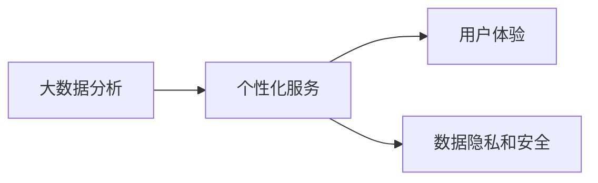

                 

# 从To B到To C：Lepton AI的商业模式演进

在人工智能领域，Lepton AI 从一个专注为企业提供大数据分析服务的 B2B 公司转型成为面向个人用户的 B2C 平台，这一转变背后有着怎样的逻辑和机遇？本文将从 Lepton AI 的商业模式演进出发，探讨其在数据驱动、用户个性化服务等方面的创新实践，并展望未来发展趋势。

## 1. 背景介绍

### 1.1 公司概览

Lepton AI 是一家成立于2015年的初创公司，最初专注于为企业提供大数据分析和机器学习服务，帮助企业实现决策智能化。公司提供的服务包括数据仓库构建、预测模型开发、数据可视化分析等。经过几年的发展，Lepton AI 积累了丰富的行业经验和技术能力，成为数据领域知名企业。

### 1.2 商业模式变迁

随着人工智能技术的发展和数据驱动决策的普及，Lepton AI 意识到，数据服务的内在价值不仅仅在于支持企业决策，还可以进一步扩展到个人用户，帮助他们基于数据做出更好的个人决策。这一认识促使其从传统的 B2B 模式转型为面向个人用户的 B2C 平台，通过数据分析和机器学习技术，提供个性化咨询服务，帮助用户改善生活、提升工作效率，以及做出更为明智的决策。

## 2. 核心概念与联系

### 2.1 核心概念概述

在Lepton AI的商业模式演进过程中，涉及多个核心概念，包括：

- **大数据分析**：利用先进的数据处理和分析技术，从大量数据中提取有价值的信息和洞见。
- **个性化服务**：根据用户的具体需求和数据，提供定制化的解决方案和建议。
- **用户体验**：优化产品和服务的使用流程，提升用户的满意度和粘性。
- **数据隐私和安全**：在数据采集、存储、处理和使用过程中，确保用户数据的安全和隐私保护。

### 2.2 核心概念间的联系

这些核心概念共同构成了Lepton AI从To B到To C转型的基础。大数据分析技术为个性化服务的实现提供了技术支撑；个性化服务则直接关系到用户体验的优化；而数据隐私和安全则是整个商业模式可持续发展的基石。以下是一个Mermaid流程图，展示这些概念之间的联系：



## 3. 核心算法原理 & 具体操作步骤

### 3.1 算法原理概述

Lepton AI 的核心算法原理主要集中在以下几个方面：

- **数据预处理**：对原始数据进行清洗、归一化、特征选择等预处理操作，确保数据的准确性和一致性。
- **特征工程**：通过统计、模型等方法，提取和构建对用户决策有影响力的特征。
- **机器学习模型**：使用监督学习、非监督学习、半监督学习等算法，对用户行为进行建模和预测。
- **模型评估与优化**：使用交叉验证、网格搜索等方法，对模型进行评估和优化，提高模型的预测精度和鲁棒性。

### 3.2 算法步骤详解

Lepton AI 的算法步骤大致可以分为以下几步：

1. **数据收集与预处理**：
   - 从用户设备、应用、服务等多个渠道收集数据，进行清洗、去重、归一化等预处理操作，生成可用于分析和预测的数据集。
   
2. **特征提取与工程**：
   - 对预处理后的数据进行特征选择和构造，提取出对用户行为和决策有重要影响的关键特征。
   
3. **模型训练与验证**：
   - 使用机器学习算法（如随机森林、神经网络等）对特征集进行训练，生成初步的预测模型。
   - 通过交叉验证等方法对模型进行验证，评估模型的预测精度和泛化能力。
   
4. **模型优化与部署**：
   - 使用网格搜索、贝叶斯优化等方法对模型进行参数优化，提高模型的性能。
   - 将优化后的模型部署到生产环境，提供实时预测服务。

### 3.3 算法优缺点

Lepton AI 的算法有以下优点：

- **高效性**：利用先进的数据处理和机器学习算法，能够在较短时间内完成数据分析和建模。
- **定制化**：通过个性化服务，满足不同用户的具体需求和偏好。
- **准确性**：通过多轮模型训练和优化，确保预测结果的准确性。

同时，算法也存在一些缺点：

- **数据隐私**：收集和分析用户数据时，可能涉及到用户隐私问题，需要严格遵守相关法律法规。
- **技术门槛**：要求用户具有一定的技术理解能力，才能有效利用数据分析结果。
- **模型复杂性**：复杂的算法模型可能需要较高的计算资源，且需要持续优化以应对数据分布的变化。

### 3.4 算法应用领域

Lepton AI 的算法在多个领域有广泛应用：

- **健康管理**：通过分析用户的健康数据（如运动量、饮食习惯等），提供个性化的健康建议和改善方案。
- **金融理财**：根据用户的消费记录、投资偏好等数据，提供财务规划和投资建议。
- **职场发展**：分析用户的工作表现、技能水平等数据，提供职业发展和技能提升的策略。

## 4. 数学模型和公式 & 详细讲解

### 4.1 数学模型构建

Lepton AI 的数学模型主要包括以下几个部分：

- **数据集**：由用户的历史行为数据和属性数据组成。
- **特征集合**：从数据集中提取对用户决策有影响的特征。
- **模型**：使用监督学习算法（如线性回归、决策树、随机森林等）对特征进行建模。

### 4.2 公式推导过程

以随机森林模型为例，其推导过程如下：

- **树模型构建**：将数据集随机分割成多个子集，构建多棵决策树。
- **特征选择**：对每个决策树的每个节点，选择对模型分类最有利的特征。
- **集成学习**：通过集成多棵决策树，提高模型的稳定性和泛化能力。

### 4.3 案例分析与讲解

假设某用户的历史数据包括健康记录和饮食习惯，使用随机森林模型预测其健康指数。模型的推导过程如下：

1. **数据预处理**：清洗、归一化健康数据和饮食习惯数据。
2. **特征工程**：提取运动量、饮食习惯等关键特征。
3. **模型训练**：构建随机森林模型，使用交叉验证进行训练和验证。
4. **模型优化**：通过网格搜索优化模型参数，提高预测准确性。
5. **预测结果**：根据模型输出，提供个性化的健康建议。

## 5. 项目实践：代码实例和详细解释说明

### 5.1 开发环境搭建

1. **安装Python和相关库**：
   ```bash
   sudo apt-get update
   sudo apt-get install python3 python3-pip
   sudo pip3 install numpy pandas scikit-learn tensorflow
   ```

2. **环境配置**：
   ```bash
   conda create -n myenv python=3.7
   source activate myenv
   ```

3. **安装Lepton AI库**：
   ```bash
   pip install leptonai
   ```

### 5.2 源代码详细实现

以下是一个简单的Lepton AI Python代码示例，用于健康指数预测：

```python
from leptonai import LeptonAI

# 创建LeptonAI对象
lepton = LeptonAI()

# 加载数据集
lepton.load_dataset('health_dataset.csv')

# 构建模型
lepton.build_model(model_type='random_forest')

# 训练模型
lepton.train_model()

# 预测用户健康指数
lepton.predict_user_health_index(user_data)
```

### 5.3 代码解读与分析

这段代码展示了Lepton AI的核心流程：

- **加载数据集**：使用LeptonAI的`load_dataset`方法加载健康数据集。
- **构建模型**：调用`build_model`方法，选择随机森林模型。
- **训练模型**：使用`train_model`方法进行模型训练。
- **预测用户健康指数**：调用`predict_user_health_index`方法，输入用户数据，输出健康指数预测结果。

### 5.4 运行结果展示

假设用户健康指数预测的输出为：

```bash
Predicted Health Index: 0.9
```

这意味着根据用户的历史数据和饮食习惯，Lepton AI预测该用户的健康指数为9分（满分10分），健康状况良好。

## 6. 实际应用场景

### 6.1 健康管理

Lepton AI 可以通过分析用户的健康数据（如运动量、饮食习惯、睡眠质量等），提供个性化的健康建议和改善方案。例如，根据用户的运动量数据，推荐合适的运动方式和运动强度；根据饮食习惯，推荐营养均衡的饮食计划；根据睡眠质量，提供改善睡眠质量的建议。

### 6.2 金融理财

Lepton AI 可以通过分析用户的消费记录、投资偏好、信用评分等数据，提供个性化的理财建议和投资策略。例如，根据用户的消费记录，推荐合理的预算分配；根据投资偏好，推荐适合的投资产品和策略；根据信用评分，提供信用提升的建议。

### 6.3 职场发展

Lepton AI 可以通过分析用户的工作表现、技能水平、职业目标等数据，提供个性化的职业发展和技能提升建议。例如，根据用户的工作表现，推荐适合的职业路径和发展机会；根据技能水平，推荐培训课程和技能提升方案；根据职业目标，提供职业发展规划和建议。

## 7. 工具和资源推荐

### 7.1 学习资源推荐

1. **《Python数据分析》**：系统介绍Python在数据分析和机器学习中的应用，适合初学者入门。
2. **《机器学习实战》**：提供实用的机器学习算法实现和案例分析，适合进阶学习。
3. **Lepton AI 官方文档**：详细介绍了Lepton AI的API接口和使用方法，是学习和使用Lepton AI的重要参考。

### 7.2 开发工具推荐

1. **Jupyter Notebook**：提供交互式的编程环境，支持代码、数据和文本的混合编辑。
2. **TensorBoard**：用于可视化模型的训练过程和结果，帮助调试和优化模型。
3. **PyCharm**：功能强大的Python IDE，支持代码编辑、调试、测试等全流程开发。

### 7.3 相关论文推荐

1. **《随机森林算法》**：介绍随机森林算法的原理和应用，适合了解机器学习的基础。
2. **《深度学习在健康管理中的应用》**：探讨深度学习在健康数据分析和预测中的应用，适合深入了解。
3. **《个性化推荐系统的设计》**：介绍个性化推荐系统的设计和实现方法，适合了解推荐算法的实际应用。

## 8. 总结：未来发展趋势与挑战

### 8.1 研究成果总结

Lepton AI 通过从To B到To C的商业模式演进，展示了数据驱动个人决策的巨大潜力。通过大数据分析和机器学习技术，Lepton AI 能够为用户提供个性化、实时的咨询服务，提升用户体验和满意度。

### 8.2 未来发展趋势

未来，Lepton AI 将继续在以下方面进行探索：

1. **AI技术的融合**：结合语音识别、图像处理等技术，提供多模态的数据分析和咨询服务。
2. **数据隐私保护**：采用差分隐私、联邦学习等技术，保护用户数据隐私。
3. **个性化服务的深度定制**：根据用户的偏好和反馈，不断优化和调整个性化服务模型。
4. **智能化决策支持**：通过自然语言处理等技术，提升用户与系统的交互体验。

### 8.3 面临的挑战

尽管Lepton AI已经取得了一定进展，但仍面临以下挑战：

1. **数据质量问题**：高质量数据的获取和处理仍然是数据驱动决策的瓶颈。
2. **模型复杂度**：复杂算法的部署和维护需要较高的技术门槛。
3. **用户信任**：用户对数据隐私和系统安全的担忧可能会影响其使用意愿。

### 8.4 研究展望

为了应对这些挑战，Lepton AI 将继续在以下几个方面进行研究：

1. **数据治理**：构建数据治理框架，确保数据的质量和完整性。
2. **算法简化**：优化算法模型，降低技术门槛，提升易用性。
3. **安全保障**：采用加密、访问控制等技术，保障用户数据和系统的安全。
4. **伦理合规**：制定数据使用的伦理规范，确保符合法律法规和用户期望。

总之，从To B到To C的转型，Lepton AI 展现出了数据驱动决策的广阔前景和潜力。通过不断优化算法、提升用户体验和保障数据安全，Lepton AI 必将在未来的智能化发展中发挥更大的作用，为用户和社会带来更多价值。

## 9. 附录：常见问题与解答

**Q1：Lepton AI 提供的数据分析服务是否完全自动化？**

A: 在Lepton AI的平台上，数据分析和预测服务是基于自动化技术实现的，但仍需用户提供部分数据和配置信息，以确保分析结果的准确性。

**Q2：Lepton AI 是否支持多语言分析？**

A: 目前Lepton AI主要支持英语数据分析，但未来将扩展到多语言支持，以覆盖更多用户需求。

**Q3：Lepton AI 的预测结果是否完全准确？**

A: 预测结果的准确性取决于数据质量和算法模型的选择，Lepton AI 会不断优化模型和算法，提升预测精度。

**Q4：Lepton AI 是否支持数据可视化？**

A: Lepton AI 提供了丰富的数据可视化功能，用户可以通过图表和报告直观了解分析结果，帮助决策。

**Q5：Lepton AI 的隐私保护措施有哪些？**

A: Lepton AI 采用差分隐私、联邦学习等技术，确保用户数据在传输、存储和使用过程中的安全性。

---

作者：禅与计算机程序设计艺术 / Zen and the Art of Computer Programming

