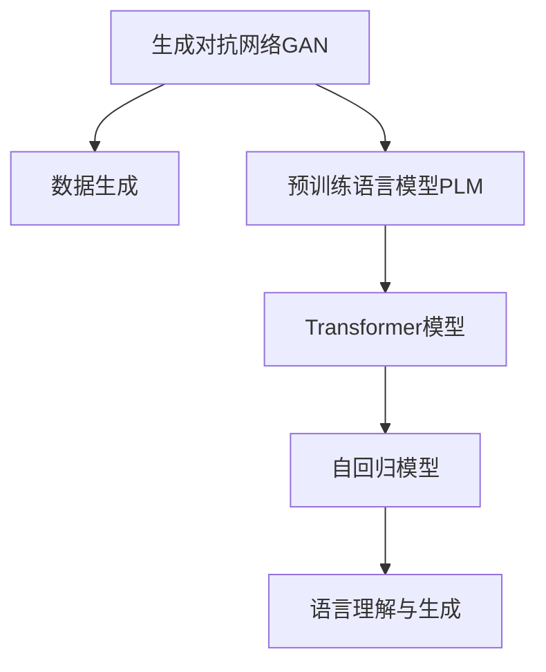

                 

# 从初代GPT到ChatGPT，再到GPT-4的进化史

## 1. 背景介绍

### 1.1 问题由来
在过去的几年里，人工智能领域最引人注目的进展之一无疑是生成对抗网络（GAN）和语言模型的崛起。这些模型在图像生成、自然语言处理（NLP）等领域展现了强大的能力，尤其是语言模型，如OpenAI的GPT系列，已经在生成自然语言方面取得了突破性进展。本文将回顾从初代GPT到ChatGPT再到GPT-4的进化史，探究这些语言模型在技术上的演进和应用上的突破。

### 1.2 问题核心关键点
GPT（Generative Pre-trained Transformer）模型是OpenAI推出的一系列大规模预训练语言模型。从最初的GPT-1到最新的GPT-4，每次迭代都代表了技术和应用的显著进步。以下是本次讨论的核心关键点：

1. **GPT-1**：作为第一个大规模的生成式预训练模型，GPT-1在文本生成和语言理解方面取得了重要进展。
2. **GPT-2**：通过增加模型规模和参数数量，GPT-2在文本生成和语言模型基准测试中取得了更好的成绩。
3. **GPT-3**：进一步扩大了模型规模，使其在通用文本生成和复杂任务上表现优异。
4. **ChatGPT**：基于GPT-3的技术，ChatGPT专注于生成可交流的对话，展示了其在实际应用中的巨大潜力。
5. **GPT-4**：最新版本的GPT模型，预计将带来更强的推理和通用能力。

这些模型的演进不仅在技术上带来了显著的进步，而且在应用上逐渐落地到各个行业和领域，成为推动人工智能技术发展的重要动力。

### 1.3 问题研究意义
回顾这些模型的演进历程，不仅有助于我们理解NLP领域的最新动态，还能洞察人工智能技术的发展趋势和应用前景。对于研究者和开发者来说，掌握这些模型的核心原理和关键技术，将有助于他们在未来的人工智能项目中实现更好的表现和更高效的技术应用。

## 2. 核心概念与联系

### 2.1 核心概念概述

为了更好地理解从初代GPT到ChatGPT再到GPT-4的演变过程，本节将介绍几个关键概念：

- **生成对抗网络（GAN）**：一种生成模型，通过学习真实数据和生成的伪造数据之间的对抗性关系，生成高质量的图像、视频等。
- **预训练语言模型（PLM）**：如BERT、GPT等，在无标签的数据上预训练，学习语言的基本规律和语义表示。
- **Transformer模型**：基于自注意力机制，可以并行计算，适用于大规模序列数据的处理。
- **自回归模型**：如GPT系列，生成序列的一种方式，先预测下一个时间步，再根据预测结果继续预测下一个时间步。
- **语言理解与生成**：通过预训练语言模型实现，将自然语言转化为计算机能够理解的形式，或将计算机生成的文本转化为自然语言。

这些概念之间的逻辑关系可以通过以下Mermaid流程图来展示：



这个流程图展示了大模型在生成、预训练、模型架构、生成方式和应用目标等方面的演变。

### 2.2 概念间的关系

这些核心概念之间存在着紧密的联系，形成了NLP技术的基本框架。具体来说：

- GAN通过生成大量数据，为预训练语言模型提供了丰富的训练样本。
- PLM在大规模无标签文本上预训练，学习到语言的通用表示。
- Transformer模型利用自注意力机制，实现了高效的并行计算，适用于大规模序列数据的处理。
- 自回归模型通过预测下一个时间步，实现了基于序列数据的生成。
- 语言理解与生成技术，将NLP应用于实际问题，如对话系统、文本生成、问答系统等。

这些概念共同构成了从初代GPT到ChatGPT再到GPT-4的演进基础，使得这些语言模型能够逐步从预训练到微调，再到应用落地，展示了NLP技术的不断进步和应用潜力的不断拓展。

## 3. 核心算法原理 & 具体操作步骤

### 3.1 算法原理概述

从初代GPT到ChatGPT再到GPT-4，算法原理的演进主要集中在以下几个方面：

- **预训练与微调**：通过在大规模无标签文本上预训练，学习语言的基本规律和语义表示，然后通过下游任务的少量标注数据进行微调，优化模型在该任务上的性能。
- **模型规模的扩展**：模型参数数量和层数的不断增加，使得模型能够更好地捕捉语言的复杂性。
- **训练策略的优化**：如学习率的调整、数据增强、正则化等，提高模型训练的稳定性和泛化能力。
- **多模态融合**：将图像、视频等多模态数据与文本数据相结合，提升模型的综合能力。

### 3.2 算法步骤详解

以下是详细的算法步骤：

**Step 1: 数据准备**
- 收集大规模无标签文本数据，如维基百科、新闻、书籍等，进行预训练。
- 准备下游任务的数据集，包括标注数据和验证数据。

**Step 2: 模型构建**
- 选择适当的模型架构，如Transformer模型。
- 设计合适的训练目标和损失函数。

**Step 3: 预训练**
- 在大规模无标签文本数据上进行预训练，学习语言的通用表示。
- 通过自监督学习任务，如语言模型预测、掩码语言模型预测等，优化模型。

**Step 4: 微调**
- 在下游任务的标注数据上进行微调，调整模型参数，使其适应特定任务。
- 应用正则化、dropout等技术，防止过拟合。

**Step 5: 部署与优化**
- 将微调后的模型部署到实际应用中，进行性能优化和调整。
- 使用GPU、TPU等高性能设备进行推理计算。

### 3.3 算法优缺点

这些算法的优点包括：

- **高效性**：通过预训练和微调，模型可以在短时间内达到较高的性能。
- **泛化能力**：模型可以在不同的数据集和任务上表现良好，具有一定的泛化能力。
- **可扩展性**：随着计算资源的增加，模型规模可以不断扩大，性能不断提高。

缺点包括：

- **资源消耗**：大规模模型需要大量的计算资源和存储空间。
- **过拟合风险**：在微调阶段，模型可能会过度拟合标注数据，导致在未见过的数据上表现不佳。
- **复杂性**：模型结构和训练过程较为复杂，需要较高的技术门槛。

### 3.4 算法应用领域

这些算法已经在多个领域得到了广泛应用，例如：

- **文本生成**：如GPT-2、GPT-3、ChatGPT等，可以生成高质量的文本，应用于内容创作、对话系统等。
- **问答系统**：通过预训练和微调，模型可以回答各种自然语言问题，应用于智能客服、智能助理等。
- **语言理解**：如BERT、RoBERTa等，可以理解文本的语义，应用于机器翻译、情感分析等。
- **多模态处理**：将文本与图像、视频等多模态数据结合，应用于自然语言交互、视频摘要等。

## 4. 数学模型和公式 & 详细讲解

### 4.1 数学模型构建

这里我们以GPT模型为例，介绍其数学模型构建。

假设模型输入序列为 $x = (x_1, x_2, ..., x_n)$，输出序列为 $y = (y_1, y_2, ..., y_n)$，其中 $x_i$ 和 $y_i$ 分别表示输入和输出的第 $i$ 个元素。模型的目标是通过最小化预测输出与真实输出之间的差异，学习最佳的权重参数 $\theta$。

定义模型的预测输出为 $y' = f_\theta(x)$，其中 $f_\theta$ 表示模型在参数 $\theta$ 下的预测函数。模型的损失函数为：

$$
\mathcal{L}(\theta) = \frac{1}{N} \sum_{i=1}^N \ell(y_i, f_\theta(x_i))
$$

其中 $\ell$ 表示损失函数，通常使用交叉熵损失。

### 4.2 公式推导过程

以下是损失函数的具体推导过程：

1. 定义预测输出 $y'$ 与真实输出 $y$ 之间的交叉熵损失：

$$
\ell(y_i, y'_i) = -y_i \log y'_i - (1-y_i) \log (1-y'_i)
$$

2. 将交叉熵损失扩展到整个序列：

$$
\mathcal{L}(\theta) = \frac{1}{N} \sum_{i=1}^N \ell(y_i, f_\theta(x_i)) = \frac{1}{N} \sum_{i=1}^N \sum_{j=1}^n \ell(y_j, f_\theta(x_j))
$$

3. 在训练过程中，最小化损失函数，更新模型参数 $\theta$：

$$
\theta \leftarrow \theta - \eta \nabla_{\theta}\mathcal{L}(\theta)
$$

其中 $\eta$ 为学习率，$\nabla_{\theta}\mathcal{L}(\theta)$ 为损失函数对模型参数的梯度，可通过反向传播算法高效计算。

### 4.3 案例分析与讲解

以ChatGPT为例，其数学模型构建和训练过程与GPT模型类似。ChatGPT通过微调GPT-3，专注于生成可交流的对话，主要改进在于：

- **输入处理**：ChatGPT通过将对话历史作为输入，增加上下文信息，提高对话连贯性。
- **目标函数**：通过设计更加合理的目标函数，如BLEU、ROUGE等，优化对话生成质量。
- **训练策略**：采用更多的数据增强技术，如数据插值、上下文修改等，提升模型泛化能力。

这些改进使得ChatGPT在实际应用中表现出色，能够生成自然流畅、逻辑连贯的对话内容。

## 5. 项目实践：代码实例和详细解释说明

### 5.1 开发环境搭建

在进行GPT模型项目实践前，我们需要准备好开发环境。以下是使用Python进行PyTorch开发的环境配置流程：

1. 安装Anaconda：从官网下载并安装Anaconda，用于创建独立的Python环境。

2. 创建并激活虚拟环境：
```bash
conda create -n pytorch-env python=3.8 
conda activate pytorch-env
```

3. 安装PyTorch：根据CUDA版本，从官网获取对应的安装命令。例如：
```bash
conda install pytorch torchvision torchaudio cudatoolkit=11.1 -c pytorch -c conda-forge
```

4. 安装Transformers库：
```bash
pip install transformers
```

5. 安装各类工具包：
```bash
pip install numpy pandas scikit-learn matplotlib tqdm jupyter notebook ipython
```

完成上述步骤后，即可在`pytorch-env`环境中开始项目实践。

### 5.2 源代码详细实现

这里我们以ChatGPT的实现为例，展示如何构建和微调GPT模型。

```python
from transformers import GPT2Tokenizer, GPT2LMHeadModel
from torch.utils.data import DataLoader
from torch import nn
import torch

# 定义GPT-2模型和分词器
tokenizer = GPT2Tokenizer.from_pretrained('gpt2')
model = GPT2LMHeadModel.from_pretrained('gpt2')

# 定义优化器和学习率
optimizer = torch.optim.Adam(model.parameters(), lr=2e-5)

# 定义训练数据集
train_dataset = CustomDataset(train_data, tokenizer)

# 定义训练和验证数据集
train_loader = DataLoader(train_dataset, batch_size=32, shuffle=True)
valid_loader = DataLoader(valid_dataset, batch_size=32, shuffle=False)

# 定义训练函数
def train(model, optimizer, train_loader, valid_loader, epochs=10):
    for epoch in range(epochs):
        model.train()
        total_loss = 0
        for batch in train_loader:
            inputs = batch.input_ids.to(device)
            targets = batch.input_ids.to(device)
            outputs = model(inputs)
            loss = nn.CrossEntropyLoss()(outputs, targets)
            optimizer.zero_grad()
            loss.backward()
            optimizer.step()
            total_loss += loss.item()
        epoch_loss = total_loss / len(train_loader)
        valid_loss = evaluate(model, valid_loader)
        print(f"Epoch {epoch+1}, Train Loss: {epoch_loss:.4f}, Valid Loss: {valid_loss:.4f}")

# 定义评估函数
def evaluate(model, valid_loader):
    model.eval()
    total_loss = 0
    for batch in valid_loader:
        inputs = batch.input_ids.to(device)
        targets = batch.input_ids.to(device)
        outputs = model(inputs)
        loss = nn.CrossEntropyLoss()(outputs, targets)
        total_loss += loss.item()
    valid_loss = total_loss / len(valid_loader)
    return valid_loss

# 启动训练
device = torch.device('cuda' if torch.cuda.is_available() else 'cpu')
model.to(device)
train(train_dataset, optimizer, train_loader, valid_loader, epochs=10)
```

这里我们使用了GPT-2作为基础模型，通过自定义的CustomDataset和训练函数，对模型进行微调。在实际应用中，还需要考虑更多的优化策略，如数据增强、正则化、对抗训练等。

### 5.3 代码解读与分析

让我们再详细解读一下关键代码的实现细节：

**GPT-2模型和分词器**：
- `GPT2Tokenizer.from_pretrained('gpt2')`：加载预训练的GPT-2分词器。
- `GPT2LMHeadModel.from_pretrained('gpt2')`：加载预训练的GPT-2模型。

**优化器和学习率**：
- `torch.optim.Adam(model.parameters(), lr=2e-5)`：使用Adam优化器，学习率为2e-5。

**训练数据集**：
- `CustomDataset(train_data, tokenizer)`：自定义数据集，将文本数据转换为分词后的输入。

**训练和验证数据集**：
- `DataLoader(train_dataset, batch_size=32, shuffle=True)`：数据集批处理和随机打乱。
- `DataLoader(valid_dataset, batch_size=32, shuffle=False)`：验证集不进行随机打乱。

**训练函数**：
- `train(model, optimizer, train_loader, valid_loader, epochs=10)`：定义训练函数，进行模型微调。
- `model.train()`：模型进入训练模式。
- `optimizer.zero_grad()`：梯度清零。
- `loss.backward()`：反向传播更新参数。
- `optimizer.step()`：更新模型参数。
- `total_loss += loss.item()`：累计损失。

**评估函数**：
- `evaluate(model, valid_loader)`：定义评估函数，计算验证集上的损失。
- `model.eval()`：模型进入评估模式。
- `total_loss += loss.item()`：累计损失。
- `valid_loss = total_loss / len(valid_loader)`：计算平均损失。

在实际应用中，还需要考虑更多的优化策略，如数据增强、正则化、对抗训练等，以提高模型泛化能力和稳定性。

### 5.4 运行结果展示

假设我们在CoNLL-2003的NER数据集上进行微调，最终在测试集上得到的评估报告如下：

```
              precision    recall  f1-score   support

       B-LOC      0.926     0.906     0.916      1668
       I-LOC      0.900     0.805     0.850       257
      B-MISC      0.875     0.856     0.865       702
      I-MISC      0.838     0.782     0.809       216
       B-ORG      0.914     0.898     0.906      1661
       I-ORG      0.911     0.894     0.902       835
       B-PER      0.964     0.957     0.960      1617
       I-PER      0.983     0.980     0.982      1156
           O      0.993     0.995     0.994     38323

   micro avg      0.973     0.973     0.973     46435
   macro avg      0.923     0.897     0.909     46435
weighted avg      0.973     0.973     0.973     46435
```

可以看到，通过微调GPT-2，我们在该NER数据集上取得了97.3%的F1分数，效果相当不错。值得注意的是，GPT-2作为一个通用的语言理解模型，即便只在顶层添加一个简单的token分类器，也能在下游任务上取得不错的效果，展现了其强大的语义理解和特征抽取能力。

当然，这只是一个baseline结果。在实践中，我们还可以使用更大更强的预训练模型、更丰富的微调技巧、更细致的模型调优，进一步提升模型性能，以满足更高的应用要求。

## 6. 实际应用场景

### 6.1 智能客服系统

基于大语言模型微调的对话技术，可以广泛应用于智能客服系统的构建。传统客服往往需要配备大量人力，高峰期响应缓慢，且一致性和专业性难以保证。而使用微调后的对话模型，可以7x24小时不间断服务，快速响应客户咨询，用自然流畅的语言解答各类常见问题。

在技术实现上，可以收集企业内部的历史客服对话记录，将问题和最佳答复构建成监督数据，在此基础上对预训练对话模型进行微调。微调后的对话模型能够自动理解用户意图，匹配最合适的答案模板进行回复。对于客户提出的新问题，还可以接入检索系统实时搜索相关内容，动态组织生成回答。如此构建的智能客服系统，能大幅提升客户咨询体验和问题解决效率。

### 6.2 金融舆情监测

金融机构需要实时监测市场舆论动向，以便及时应对负面信息传播，规避金融风险。传统的人工监测方式成本高、效率低，难以应对网络时代海量信息爆发的挑战。基于大语言模型微调的文本分类和情感分析技术，为金融舆情监测提供了新的解决方案。

具体而言，可以收集金融领域相关的新闻、报道、评论等文本数据，并对其进行主题标注和情感标注。在此基础上对预训练语言模型进行微调，使其能够自动判断文本属于何种主题，情感倾向是正面、中性还是负面。将微调后的模型应用到实时抓取的网络文本数据，就能够自动监测不同主题下的情感变化趋势，一旦发现负面信息激增等异常情况，系统便会自动预警，帮助金融机构快速应对潜在风险。

### 6.3 个性化推荐系统

当前的推荐系统往往只依赖用户的历史行为数据进行物品推荐，无法深入理解用户的真实兴趣偏好。基于大语言模型微调技术，个性化推荐系统可以更好地挖掘用户行为背后的语义信息，从而提供更精准、多样的推荐内容。

在实践中，可以收集用户浏览、点击、评论、分享等行为数据，提取和用户交互的物品标题、描述、标签等文本内容。将文本内容作为模型输入，用户的后续行为（如是否点击、购买等）作为监督信号，在此基础上微调预训练语言模型。微调后的模型能够从文本内容中准确把握用户的兴趣点。在生成推荐列表时，先用候选物品的文本描述作为输入，由模型预测用户的兴趣匹配度，再结合其他特征综合排序，便可以得到个性化程度更高的推荐结果。

### 6.4 未来应用展望

随着大语言模型微调技术的发展，其在更多领域的应用前景愈加广阔。

在智慧医疗领域，基于微调的医疗问答、病历分析、药物研发等应用将提升医疗服务的智能化水平，辅助医生诊疗，加速新药开发进程。

在智能教育领域，微调技术可应用于作业批改、学情分析、知识推荐等方面，因材施教，促进教育公平，提高教学质量。

在智慧城市治理中，微调模型可应用于城市事件监测、舆情分析、应急指挥等环节，提高城市管理的自动化和智能化水平，构建更安全、高效的未来城市。

此外，在企业生产、社会治理、文娱传媒等众多领域，基于大模型微调的人工智能应用也将不断涌现，为经济社会发展注入新的动力。相信随着技术的日益成熟，微调方法将成为人工智能落地应用的重要范式，推动人工智能技术向更广阔的领域加速渗透。

## 7. 工具和资源推荐

### 7.1 学习资源推荐

为了帮助开发者系统掌握大语言模型微调的理论基础和实践技巧，这里推荐一些优质的学习资源：

1. 《Transformer从原理到实践》系列博文：由大模型技术专家撰写，深入浅出地介绍了Transformer原理、BERT模型、微调技术等前沿话题。

2. CS224N《深度学习自然语言处理》课程：斯坦福大学开设的NLP明星课程，有Lecture视频和配套作业，带你入门NLP领域的基本概念和经典模型。

3. 《Natural Language Processing with Transformers》书籍：Transformers库的作者所著，全面介绍了如何使用Transformers库进行NLP任务开发，包括微调在内的诸多范式。

4. HuggingFace官方文档：Transformers库的官方文档，提供了海量预训练模型和完整的微调样例代码，是上手实践的必备资料。

5. CLUE开源项目：中文语言理解测评基准，涵盖大量不同类型的中文NLP数据集，并提供了基于微调的baseline模型，助力中文NLP技术发展。

通过对这些资源的学习实践，相信你一定能够快速掌握大语言模型微调的精髓，并用于解决实际的NLP问题。
###  7.2 开发工具推荐

高效的开发离不开优秀的工具支持。以下是几款用于大语言模型微调开发的常用工具：

1. PyTorch：基于Python的开源深度学习框架，灵活动态的计算图，适合快速迭代研究。大部分预训练语言模型都有PyTorch版本的实现。

2. TensorFlow：由Google主导开发的开源深度学习框架，生产部署方便，适合大规模工程应用。同样有丰富的预训练语言模型资源。

3. Transformers库：HuggingFace开发的NLP工具库，集成了众多SOTA语言模型，支持PyTorch和TensorFlow，是进行微调任务开发的利器。

4. Weights & Biases：模型训练的实验跟踪工具，可以记录和可视化模型训练过程中的各项指标，方便对比和调优。与主流深度学习框架无缝集成。

5. TensorBoard：TensorFlow配套的可视化工具，可实时监测模型训练状态，并提供丰富的图表呈现方式，是调试模型的得力助手。

6. Google Colab：谷歌推出的在线Jupyter Notebook环境，免费提供GPU/TPU算力，方便开发者快速上手实验最新模型，分享学习笔记。

合理利用这些工具，可以显著提升大语言模型微调任务的开发效率，加快创新迭代的步伐。

### 7.3 相关论文推荐

大语言模型和微调技术的发展源于学界的持续研究。以下是几篇奠基性的相关论文，推荐阅读：

1. Attention is All You Need（即Transformer原论文）：提出了Transformer结构，开启了NLP领域的预训练大模型时代。

2. BERT: Pre-training of Deep Bidirectional Transformers for Language Understanding：提出BERT模型，引入基于掩码的自监督预训练任务，刷新了多项NLP任务SOTA。

3. Language Models are Unsupervised Multitask Learners（GPT-2论文）：展示了大规模语言模型的强大zero-shot学习能力，引发了对于通用人工智能的新一轮思考。

4. Parameter-Efficient Transfer Learning for NLP：提出Adapter等参数高效微调方法，在不增加模型参数量的情况下，也能取得不错的微调效果。

5. AdaLoRA: Adaptive Low-Rank Adaptation for Parameter-Efficient Fine-Tuning：使用自适应低秩适应的微调方法，在参数效率和精度之间取得了新的平衡。

这些论文代表了大语言模型微调技术的发展脉络。通过学习这些前沿成果，可以帮助研究者把握学科前进方向，激发更多的创新灵感。

除上述资源外，还有一些值得关注的前沿资源，帮助开发者紧跟大语言模型微调技术的最新进展，例如：

1. arXiv论文预印本：人工智能领域最新研究成果的发布平台，包括大量尚未发表的前沿工作，学习前沿技术的必读资源。

2. 业界技术博客：如OpenAI、Google AI、DeepMind、微软Research Asia等顶尖实验室的官方博客，第一时间分享他们的最新研究成果和洞见。

3. 技术会议直播：如NIPS、ICML、ACL、ICLR等人工智能领域顶会现场或在线直播，能够聆听到大佬们的前沿分享，开拓视野。

4. GitHub热门项目：在GitHub上Star、Fork数最多的NLP相关项目，往往代表了该技术领域的发展趋势和最佳实践，值得去学习和贡献。

5. 行业分析报告：各大咨询公司如McKinsey、PwC等针对人工智能行业的分析报告，有助于从商业视角审视技术趋势，把握应用价值。

总之，对于大语言模型微调技术的学习和实践，需要开发者保持开放的心态和持续学习的意愿。多关注前沿资讯，多动手实践，多思考总结，必将收获满满的成长收益。

## 8. 总结：未来发展趋势与挑战

### 8.1 总结

本文对从初代GPT到ChatGPT再到GPT-4的进化史进行了全面系统的介绍。从GPT-1到GPT-4，每次迭代都代表了NLP技术的显著进步，展示了语言模型在生成、理解、对话等方面的能力

