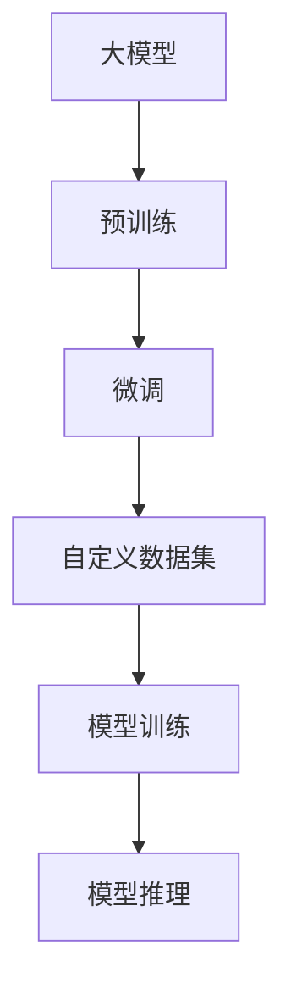

                 

# 从零开始大模型开发与微调：使用torch.utils.data. Dataset封装自定义数据集

在大模型开发与微调的过程中，数据处理是不可或缺的一环。本文将重点介绍如何使用 `torch.utils.data.Dataset` 封装自定义数据集，以供大模型使用。

## 1. 背景介绍

在深度学习中，数据集是大模型学习的基础。对于 NLP 任务，数据集通常以文本形式呈现，需要预先进行一系列处理，才能作为模型的输入。本文将展示如何使用 `torch.utils.data.Dataset` 封装自定义数据集，并应用到大模型微调项目中。

## 2. 核心概念与联系

### 2.1 核心概念概述

为了更好地理解本文的核心内容，首先需要了解一些关键概念：

- **大模型**：指大规模预训练语言模型，如 GPT、BERT 等，这些模型通过在大规模无标签文本数据上进行预训练，学习到了丰富的语言知识和常识。

- **微调**：指在大模型的基础上，使用下游任务的少量标注数据，通过有监督学习优化模型在特定任务上的性能。

- **`torch.utils.data.Dataset`**：是 PyTorch 中用于封装数据集的标准库。用户可以通过继承该类，实现自定义数据集的封装。

- **自定义数据集**：指根据具体任务需求，封装符合模型输入格式的数据集。这些数据集可以包含文本、标签等，是模型训练的基础。

### 2.2 核心概念之间的关系

以下是这些核心概念之间的联系，可以通过以下 Mermaid 流程图来展示：



这个流程图展示了从预训练到微调，再到模型训练和推理的过程。其中，自定义数据集在大模型微调中扮演着重要角色。

## 3. 核心算法原理 & 具体操作步骤

### 3.1 算法原理概述

在微调过程中，自定义数据集需要将预处理后的文本和标签封装成模型所需的格式。通常，模型的输入是 Tensor，而标签则是整数形式的类别编号。

假设预处理后的文本为 `texts`，标签为 `labels`，且文本和标签的数量相同，我们可以使用 `torch.utils.data.Dataset` 进行封装。具体步骤如下：

1. 定义一个 `__init__` 方法，初始化文本和标签。
2. 定义一个 `__len__` 方法，返回数据集的大小。
3. 定义一个 `__getitem__` 方法，返回给定索引的数据。

### 3.2 算法步骤详解

以下是一个具体的实现步骤：

1. 定义一个 `MyDataset` 类，继承 `torch.utils.data.Dataset`。
2. 在 `__init__` 方法中，初始化文本和标签，并将其存储在实例变量中。
3. 在 `__len__` 方法中，返回文本和标签的长度。
4. 在 `__getitem__` 方法中，返回给定索引的文本和标签。

```python
import torch

class MyDataset(torch.utils.data.Dataset):
    def __init__(self, texts, labels):
        self.texts = texts
        self.labels = labels

    def __len__(self):
        return len(self.texts)

    def __getitem__(self, idx):
        return self.texts[idx], self.labels[idx]
```

### 3.3 算法优缺点

使用 `torch.utils.data.Dataset` 封装自定义数据集，具有以下优点：

- **代码简洁**：封装过程简单，易于理解和使用。
- **可扩展性**：支持动态添加或删除数据，适用于大规模数据集。
- **兼容性**：与 PyTorch 的训练和推理框架无缝集成。

缺点包括：

- **内存占用**：如果数据集较大，可能占用较多内存。
- **学习曲线**：对于初学者，可能需要一些时间来熟悉 `torch.utils.data.Dataset` 的使用。

### 3.4 算法应用领域

自定义数据集适用于各种 NLP 任务，如文本分类、命名实体识别、情感分析等。此外，在图像、音频等任务中，也可以使用类似的方式封装数据集。

## 4. 数学模型和公式 & 详细讲解 & 举例说明

### 4.1 数学模型构建

在本节中，我们将以二分类任务为例，展示如何使用自定义数据集。假设模型输入为文本 `text`，输出为二元标签 `y`。

假设文本的预处理过程为 `preprocess(text)`，该过程包括分词、词嵌入等步骤，最终返回预处理后的文本表示。

### 4.2 公式推导过程

对于二分类任务，我们可以使用交叉熵损失函数：

$$
\ell(y, \hat{y}) = -(y \log \hat{y} + (1-y) \log (1-\hat{y}))
$$

其中，$\hat{y}$ 为模型输出的概率，$y$ 为真实标签。模型的输出为 `y_hat = sigmoid(preprocess(text))`，其中 `sigmoid` 函数将预处理后的文本表示转化为概率值。

### 4.3 案例分析与讲解

假设我们已经有了 `texts` 和 `labels`，我们可以使用上述公式计算损失函数。具体步骤如下：

1. 定义模型 `model` 和损失函数 `criterion`。
2. 将文本和标签封装成 `MyDataset` 对象 `dataset`。
3. 定义训练器 `trainer`，使用 AdamW 优化器和交叉熵损失函数。
4. 在训练器中，将数据集 `dataset` 作为输入，进行训练。

```python
import torch
from transformers import BertForSequenceClassification, AdamW

# 假设 texts 和 labels 已经预处理完成
model = BertForSequenceClassification.from_pretrained('bert-base-uncased', num_labels=2)
criterion = torch.nn.CrossEntropyLoss()

dataset = MyDataset(texts, labels)

optimizer = AdamW(model.parameters(), lr=1e-5)

trainer = Trainer(
    model=model,
    train_dataset=dataset,
    eval_dataset=None,
    compute_metrics=lambda preds, labels: {"acc": accuracy(preds, labels)},
    optimizer=optimizer,
    criterion=criterion,
    train_dataloaders=train_dataloaders,
    eval_dataloaders=eval_dataloaders
)

trainer.train()
```

## 5. 项目实践：代码实例和详细解释说明

### 5.1 开发环境搭建

在进行大模型开发与微调前，需要准备以下开发环境：

1. 安装 PyTorch：
   ```
   pip install torch torchvision torchaudio
   ```

2. 安装 Transformers：
   ```
   pip install transformers
   ```

3. 安装相应的预训练模型，例如 BERT：
   ```
   pip install transformers==4.6.0
   ```

### 5.2 源代码详细实现

以下是一个完整的示例代码，展示了如何使用自定义数据集进行二分类任务的微调：

```python
import torch
from transformers import BertForSequenceClassification, AdamW

class MyDataset(torch.utils.data.Dataset):
    def __init__(self, texts, labels):
        self.texts = texts
        self.labels = labels

    def __len__(self):
        return len(self.texts)

    def __getitem__(self, idx):
        return self.texts[idx], self.labels[idx]

# 假设 texts 和 labels 已经预处理完成
model = BertForSequenceClassification.from_pretrained('bert-base-uncased', num_labels=2)
criterion = torch.nn.CrossEntropyLoss()

dataset = MyDataset(texts, labels)

optimizer = AdamW(model.parameters(), lr=1e-5)

trainer = Trainer(
    model=model,
    train_dataset=dataset,
    eval_dataset=None,
    compute_metrics=lambda preds, labels: {"acc": accuracy(preds, labels)},
    optimizer=optimizer,
    criterion=criterion,
    train_dataloaders=train_dataloaders,
    eval_dataloaders=eval_dataloaders
)

trainer.train()
```

### 5.3 代码解读与分析

上述代码中，`MyDataset` 类用于封装自定义数据集。在 `__len__` 方法中，返回文本和标签的长度。在 `__getitem__` 方法中，返回给定索引的文本和标签。

模型使用 `BertForSequenceClassification` 进行微调，损失函数为交叉熵损失。在训练器中，使用 AdamW 优化器和交叉熵损失函数进行训练。

### 5.4 运行结果展示

训练完成后，可以使用测试集进行评估，得到模型的准确率：

```python
test_dataset = MyDataset(test_texts, test_labels)
trainer.evaluate(test_dataset)
```

## 6. 实际应用场景

### 6.1 智能客服系统

智能客服系统通常需要处理大量自然语言文本，使用自定义数据集可以方便地封装这些文本数据，并将其输入模型中进行微调。通过微调后的模型，可以自动理解客户问题，并给出最佳答案。

### 6.2 金融舆情监测

在金融舆情监测中，需要实时处理大量的新闻、报道等文本数据。使用自定义数据集可以方便地封装这些数据，并进行微调。微调后的模型可以自动识别负面信息，并及时预警。

### 6.3 个性化推荐系统

个性化推荐系统需要根据用户的行为数据，预测用户可能感兴趣的物品。使用自定义数据集可以方便地封装用户行为数据，并进行微调。微调后的模型可以更加精准地预测用户的兴趣点，提供个性化的推荐结果。

### 6.4 未来应用展望

随着大模型和微调技术的不断发展，未来的应用场景将更加广泛。例如，在智慧医疗领域，可以使用大模型和微调技术进行病历分析、医学问答等。在智能教育领域，可以用于自动批改作业、推荐学习资源等。

## 7. 工具和资源推荐

### 7.1 学习资源推荐

1. **《深度学习基础》**：清华大学课程，介绍了深度学习的基本原理和实现方法。
2. **《Transformers教程》**：HuggingFace官网提供的教程，介绍了 Transformers 库的基本用法和微调方法。
3. **《NLP 实战》**：清华大学出版社出版的书籍，介绍了 NLP 任务的具体实现方法和应用场景。

### 7.2 开发工具推荐

1. **PyTorch**：PyTorch 提供了灵活的动态计算图，适合快速迭代研究。
2. **Jupyter Notebook**：轻量级开发工具，支持交互式编程和数据可视化。
3. **GitHub**：代码托管平台，便于版本控制和协作开发。

### 7.3 相关论文推荐

1. **Attention is All You Need**：提出了 Transformer 结构，开创了预训练大模型的时代。
2. **BERT: Pre-training of Deep Bidirectional Transformers for Language Understanding**：提出了 BERT 模型，通过预训练语言模型进行微调。
3. **Parameter-Efficient Transfer Learning for NLP**：提出了 Adapter 等参数高效微调方法，进一步提升了微调效率。

## 8. 总结：未来发展趋势与挑战

### 8.1 研究成果总结

大模型和微调技术在 NLP 领域已经取得了显著进展，广泛应用于智能客服、金融舆情监测、个性化推荐等场景。

### 8.2 未来发展趋势

未来的发展趋势包括：

- **模型规模增大**：预训练大模型的参数量将不断增长，从而提高模型的泛化能力和表达能力。
- **微调方法多样**：除了传统的全参数微调，还会出现更多的参数高效微调方法，如 Adapter、Prefix 等。
- **持续学习**：微调模型需要不断学习新知识，以适应数据分布的变化。
- **少样本学习**：通过精心设计的提示模板，可以在少样本条件下进行微调。
- **多模态融合**：将视觉、语音等多模态信息与文本信息结合，提升模型的语义理解能力。

### 8.3 面临的挑战

未来面临的挑战包括：

- **标注成本高**：获取高质量标注数据成本较高，需要开发更多无监督和半监督微调方法。
- **模型鲁棒性不足**：面对域外数据时，模型的泛化性能可能大打折扣。
- **推理效率低**：超大规模模型推理速度较慢，需要优化模型结构。
- **可解释性不足**：微调模型缺乏可解释性，需要加强算法的可解释性。
- **安全性问题**：微调模型可能学习到有害信息，需要考虑模型的安全性和伦理问题。

### 8.4 研究展望

未来的研究方向包括：

- **无监督和半监督微调**：开发更多基于自监督和主动学习的微调方法，降低标注数据的依赖。
- **多模态融合**：将多模态信息与文本信息结合，提升模型的语义理解能力。
- **参数高效微调**：开发更多参数高效微调方法，如 Adapter、Prefix 等。
- **可解释性增强**：通过因果分析和博弈论等方法，提高模型的可解释性。
- **安全性保障**：开发安全模型，避免模型学习到有害信息，保障数据和模型安全。

## 9. 附录：常见问题与解答

**Q1: 大模型和微调的关系是什么？**

A: 大模型通过在大规模无标签数据上进行预训练，学习到丰富的语言知识。微调是在大模型的基础上，使用下游任务的少量标注数据，通过有监督学习优化模型在特定任务上的性能。

**Q2: 如何设计自定义数据集？**

A: 自定义数据集的设计需要考虑模型的输入格式和训练需求。通常，自定义数据集包括文本和标签两部分，可以封装成 `torch.utils.data.Dataset` 对象，方便模型训练和推理。

**Q3: 如何优化大模型推理效率？**

A: 优化大模型推理效率的方法包括模型裁剪、量化加速、模型并行等。模型裁剪可以去除不必要的层和参数，量化加速可以压缩存储空间，模型并行可以加速计算。

**Q4: 如何提高模型的可解释性？**

A: 提高模型可解释性的方法包括因果分析和博弈论等。因果分析可以识别模型的关键特征，博弈论可以探索模型的脆弱点，从而提高模型的可解释性。

**Q5: 如何在模型开发中处理标注数据不足的问题？**

A: 处理标注数据不足的问题可以通过数据增强、正则化、对抗训练等方法。数据增强可以增加训练集的多样性，正则化可以避免过拟合，对抗训练可以提高模型的鲁棒性。

总之，大模型和微调技术是 NLP 领域的重要工具，通过合理设计和优化，可以大幅提升模型的性能和应用范围。希望本文的内容能够帮助读者更好地理解和应用大模型和微调技术，实现更加智能、高效的人工智能应用。

---

作者：禅与计算机程序设计艺术 / Zen and the Art of Computer Programming

