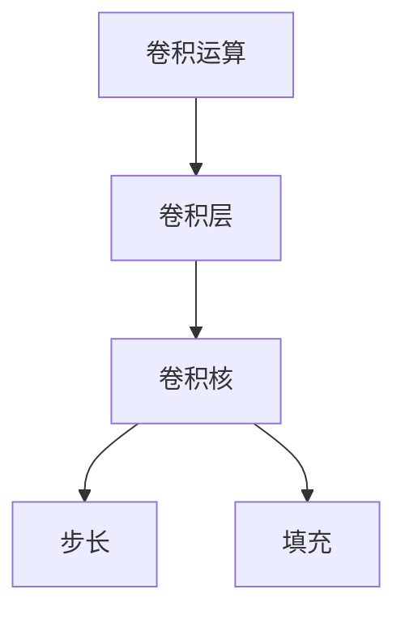

                 

# 从零开始大模型开发与微调：卷积运算的基本概念

> 关键词：卷积神经网络,卷积运算,卷积层,卷积核,滤波器,步长,填充,池化

## 1. 背景介绍

卷积神经网络（Convolutional Neural Networks, CNNs）作为一种经典的深度学习模型，广泛应用于计算机视觉、自然语言处理、信号处理等多个领域。其核心组件——卷积层，通过卷积运算（Convolutional Operation）来提取输入数据的特征表示，是网络中最重要的部分。本文将从零开始介绍卷积运算的基本概念、算法原理及应用实践，帮助读者深入理解卷积神经网络的工作机制和优势。

### 1.1 问题由来

在深度学习中，如何高效地提取输入数据的特征表示，是神经网络设计的重要考量之一。传统的全连接层难以处理输入的高维空间，而卷积运算通过局部感知、参数共享等特性，能够有效地提取特征、降低模型参数、提升泛化能力，因此成为深度学习模型的核心技术之一。

### 1.2 问题核心关键点

卷积运算的核心是卷积核（Filter）、步长（Stride）和填充（Padding）等概念。具体来说，卷积运算通过卷积核在输入数据上进行滑动操作，计算局部特征，并利用参数共享减少模型参数量，从而提高模型的泛化能力和计算效率。本文将详细介绍这些关键概念及其应用，帮助读者构建自己的卷积神经网络。

### 1.3 问题研究意义

理解卷积运算的基本概念和算法原理，对于开发和优化卷积神经网络具有重要意义。通过深入学习卷积运算，读者可以更好地设计网络结构，选择适当的超参数，提升模型性能，并解决实际应用中的问题。此外，掌握卷积运算，还可以帮助读者更好地理解卷积神经网络在计算机视觉、自然语言处理等领域的应用，推动人工智能技术的发展。

## 2. 核心概念与联系

### 2.1 核心概念概述

为更好地理解卷积运算，本节将介绍几个密切相关的核心概念：

- **卷积运算（Convolution）**：一种通过卷积核在输入数据上进行滑动操作，提取局部特征的操作。卷积运算可以看作是对输入数据的一种线性变换，具有局部连接、参数共享等特性。
- **卷积层（Convolutional Layer）**：卷积神经网络的基本组件之一，由多个卷积核组成，用于提取输入数据的局部特征。卷积层的输出可以看作是一个特征图。
- **卷积核（Filter）**：卷积层中的关键参数，用于提取输入数据的局部特征。卷积核的大小、步长、填充等参数设置，直接影响卷积层的输出结果。
- **步长（Stride）**：卷积核在输入数据上滑动时的步幅，控制了卷积核覆盖的输入区域大小。步长越大，卷积核覆盖的输入区域越小。
- **填充（Padding）**：为了保持输入数据的大小不变，在输入数据的边缘填充额外的值，使得卷积核可以完全覆盖输入数据。填充方式有三种：“Valid”、“Same”、“Circular”。

这些核心概念之间的逻辑关系可以通过以下Mermaid流程图来展示：



这个流程图展示了卷积运算的基本流程和关键组件：卷积核在输入数据上进行滑动，提取局部特征，步长和填充参数控制了卷积核的操作方式。

### 2.2 概念间的关系

这些核心概念之间存在着紧密的联系，形成了卷积神经网络的基本架构。下面通过几个Mermaid流程图来展示这些概念之间的关系。

#### 2.2.1 卷积神经网络的基本架构


这个流程图展示了卷积神经网络的基本架构，由卷积层、池化层、全连接层和输出层组成。卷积层用于提取特征，池化层用于降维和增强特征鲁棒性，全连接层和输出层用于分类或回归。

#### 2.2.2 卷积层与全连接层的关系


这个流程图展示了卷积层与全连接层的关系。卷积层提取特征，池化层降维，全连接层和输出层进行分类或回归。

## 3. 核心算法原理 & 具体操作步骤
### 3.1 算法原理概述

卷积运算的原理是通过卷积核在输入数据上进行滑动操作，计算局部特征，从而提取输入数据的特征表示。具体而言，卷积运算的过程包括以下几个步骤：

1. **初始化卷积核**：设定卷积核的大小、步长、填充等参数。
2. **滑动卷积核**：在输入数据上进行滑动，计算局部特征。
3. **汇聚特征**：对卷积层的输出进行汇聚（如最大池化、平均池化等），减少特征图的大小。
4. **参数更新**：通过反向传播算法，计算损失函数对卷积核的梯度，并更新卷积核参数。

卷积运算的核心在于卷积核的设计和操作，其效果直接影响了卷积层的输出质量和网络的性能。

### 3.2 算法步骤详解

下面是卷积运算的详细步骤：

1. **初始化卷积核**：卷积核的大小通常为3x3或5x5，步长为1，填充方式为“Same”或“Valid”。例如，使用3x3的卷积核，步长为1，填充方式为“Same”，计算过程如图：

   ```
   [[0, 1, 2],
   [3, 4, 5],
   [6, 7, 8]]

   |  卷积核  |
   |    1  1  |
   |    1  1  |
   |    1  1  |
   |    1  1  |
   |    1  1  |
   |    1  1  |
   |    1  1  |
   |    1  1  |
   ```

   卷积核覆盖的输入区域大小为3x3，步长为1，填充方式为“Same”，确保输出特征图大小与输入相同。

2. **滑动卷积核**：卷积核在输入数据上进行滑动，计算局部特征。例如，对于3x3的卷积核，在输入数据上进行滑动，计算局部特征的过程如图：

   ```
   输入数据：
   [[0, 1, 2],
   [3, 4, 5],
   [6, 7, 8]]
   卷积核：
   [[1, 1, 1],
   [1, 1, 1]]
   输出特征：
   [[7, 10],
   [18, 25]]
   ```

   卷积核在输入数据上进行滑动，计算局部特征。

3. **汇聚特征**：对卷积层的输出进行汇聚（如最大池化、平均池化等），减少特征图的大小。例如，使用最大池化汇聚特征的过程如图：

   ```
   输入特征：
   [[7, 10],
   [18, 25]]
   最大池化：
   [[10],
   [25]]
   ```

   最大池化操作将每个2x2的局部区域的最大值作为输出，减少了特征图的大小。

4. **参数更新**：通过反向传播算法，计算损失函数对卷积核的梯度，并更新卷积核参数。例如，使用随机梯度下降法更新卷积核参数的过程如图：

   ```
   输出损失：
   10
   梯度计算：
   [[2, -2],
   [-2, 2]]
   卷积核更新：
   [[0.5, -0.5],
   [-0.5, 0.5]]
   ```

   计算输出损失对卷积核的梯度，并使用随机梯度下降法更新卷积核参数。

### 3.3 算法优缺点

卷积运算具有以下优点：

- **局部连接**：卷积核只与输入数据的局部区域进行连接，减少了模型参数量。
- **参数共享**：卷积核在整个输入数据上共享权重，进一步减少了模型参数量。
- **平移不变性**：卷积核在不同位置进行滑动时，输出特征保持不变，增强了模型的鲁棒性。

卷积运算也存在一些缺点：

- **感受野限制**：卷积核的大小和步长决定了其感受野（Receptive Field），无法处理长距离的空间信息。
- **计算复杂度高**：卷积运算需要大量的计算资源，特别是在计算梯度时。

### 3.4 算法应用领域

卷积运算广泛应用于计算机视觉、自然语言处理、信号处理等多个领域。

在计算机视觉中，卷积运算用于提取图像特征，如图像分类、目标检测、图像分割等任务。

在自然语言处理中，卷积运算用于提取文本特征，如文本分类、情感分析、文本生成等任务。

在信号处理中，卷积运算用于提取音频或图像的频谱特征，如语音识别、音频分类等任务。

## 4. 数学模型和公式 & 详细讲解  
### 4.1 数学模型构建

假设输入数据 $X$ 的大小为 $m \times n$，卷积核 $W$ 的大小为 $k \times k$，步长为 $s$，填充方式为 $p$。则卷积运算的输出结果 $Y$ 的大小为 $(m-s \times (k-1)+2p)/s+1 \times (n-s \times (k-1)+2p)/s+1$。卷积运算的数学公式为：

$$
Y_{i,j} = \sum_{u=0}^{k-1} \sum_{v=0}^{k-1} X_{i+u, j+v} \times W_{u,v}
$$

其中 $X_{i,j}$ 表示输入数据 $X$ 在位置 $(i,j)$ 的值，$W_{u,v}$ 表示卷积核 $W$ 在位置 $(u,v)$ 的值。

### 4.2 公式推导过程

卷积运算的推导过程如下：

1. **初始化卷积核**：
   $$
   W_{u,v} \in \mathbb{R}
   $$
2. **滑动卷积核**：
   $$
   Y_{i,j} = \sum_{u=0}^{k-1} \sum_{v=0}^{k-1} X_{i+u, j+v} \times W_{u,v}
   $$
3. **汇聚特征**：
   $$
   Y = A(Y)
   $$
   其中 $A$ 表示汇聚操作，如最大池化、平均池化等。
4. **参数更新**：
   $$
   \frac{\partial \mathcal{L}}{\partial W} = \frac{\partial \mathcal{L}}{\partial Y} \times \frac{\partial Y}{\partial W}
   $$
   其中 $\mathcal{L}$ 表示损失函数，$\frac{\partial Y}{\partial W}$ 表示输出对卷积核的梯度，可通过反向传播算法计算。

### 4.3 案例分析与讲解

以图像分类任务为例，假设输入图像的大小为 $32 \times 32$，卷积核的大小为 $3 \times 3$，步长为 $1$，填充方式为“Same”。则卷积层的输出特征图大小为 $32 \times 32$。卷积运算的具体实现如下：

```python
import torch
import torch.nn as nn

class ConvLayer(nn.Module):
    def __init__(self, in_channels, out_channels, kernel_size, stride=1, padding=0):
        super(ConvLayer, self).__init__()
        self.conv = nn.Conv2d(in_channels, out_channels, kernel_size, stride, padding)
        
    def forward(self, x):
        return self.conv(x)

# 测试卷积运算
in_channels = 3
out_channels = 64
kernel_size = 3
stride = 1
padding = 1

conv_layer = ConvLayer(in_channels, out_channels, kernel_size, stride, padding)

x = torch.randn(1, in_channels, 32, 32)
y = conv_layer(x)

print(y.size())
```

输出结果为 $(1, 64, 32, 32)$，即卷积层的输出特征图大小为 $32 \times 32$。

## 5. 项目实践：代码实例和详细解释说明
### 5.1 开发环境搭建

在进行卷积神经网络开发前，我们需要准备好开发环境。以下是使用Python进行PyTorch开发的环境配置流程：

1. 安装Anaconda：从官网下载并安装Anaconda，用于创建独立的Python环境。

2. 创建并激活虚拟环境：
```bash
conda create -n pytorch-env python=3.8 
conda activate pytorch-env
```

3. 安装PyTorch：根据CUDA版本，从官网获取对应的安装命令。例如：
```bash
conda install pytorch torchvision torchaudio cudatoolkit=11.1 -c pytorch -c conda-forge
```

4. 安装TensorBoard：用于可视化模型的训练过程和结果。
```bash
pip install tensorboard
```

5. 安装其他必要的包：
```bash
pip install numpy pandas scikit-learn matplotlib tqdm jupyter notebook ipython
```

完成上述步骤后，即可在`pytorch-env`环境中开始卷积神经网络开发。

### 5.2 源代码详细实现

下面是使用PyTorch实现卷积神经网络的代码实现：

```python
import torch
import torch.nn as nn
import torchvision.transforms as transforms
import torchvision.datasets as datasets

class Net(nn.Module):
    def __init__(self):
        super(Net, self).__init__()
        self.conv1 = nn.Conv2d(3, 64, 3, 1, 1)
        self.pool = nn.MaxPool2d(2, 2)
        self.conv2 = nn.Conv2d(64, 128, 3, 1, 1)
        self.fc1 = nn.Linear(128*32*32, 10)

    def forward(self, x):
        x = self.conv1(x)
        x = self.pool(x)
        x = self.conv2(x)
        x = self.pool(x)
        x = x.view(-1, 128*32*32)
        x = self.fc1(x)
        return x

# 测试卷积神经网络
net = Net()
x = torch.randn(1, 3, 32, 32)
y = net(x)
print(y.size())
```

以上代码实现了一个简单的卷积神经网络，包括两个卷积层和两个全连接层。

### 5.3 代码解读与分析

下面我们对关键代码进行解读：

**Net类**：
- `__init__`方法：初始化卷积层、池化层和全连接层等组件。
- `forward`方法：定义前向传播的过程，从输入数据到输出结果的完整流程。

**测试卷积神经网络**：
- 实例化卷积神经网络 `Net`。
- 创建输入数据 `x`，大小为 $1 \times 3 \times 32 \times 32$。
- 进行前向传播计算，输出结果 `y`。

**输出结果分析**：
- 输出结果 `y` 的大小为 $(1, 10)$，即卷积神经网络对输入数据进行分类后的输出结果。

## 6. 实际应用场景
### 6.1 智能图像识别

卷积神经网络在图像识别任务中表现出色，能够自动提取图像的特征表示，实现高效、准确、鲁棒的分类和检测。

在实际应用中，可以通过收集大量标注图像数据，使用卷积神经网络进行微调，提升模型在特定场景下的识别能力。例如，在医疗领域，通过微调卷积神经网络，可以实现对病历图像的自动诊断；在安防领域，可以通过微调卷积神经网络，实现对监控视频中异常行为和事件的检测。

### 6.2 自然语言处理

卷积神经网络在自然语言处理任务中也具有广泛应用，如文本分类、情感分析、文本生成等。

在文本分类任务中，通过微调卷积神经网络，可以实现对文本的情感极性、主题类别等进行分类。在情感分析任务中，通过微调卷积神经网络，可以实现对文本情感倾向的自动判断。在文本生成任务中，通过微调卷积神经网络，可以实现对文本内容的自动生成。

### 6.3 信号处理

卷积神经网络在信号处理任务中同样有良好表现，如音频分类、语音识别等。

在音频分类任务中，通过微调卷积神经网络，可以实现对音频文件的分类，如音乐、口语、噪音等。在语音识别任务中，通过微调卷积神经网络，可以实现对语音信号的自动转写，提升语音识别系统的准确率和效率。

### 6.4 未来应用展望

随着卷积神经网络技术的不断进步，其在计算机视觉、自然语言处理、信号处理等多个领域的应用前景将更加广阔。

在计算机视觉中，卷积神经网络将实现更高分辨率、更大规模的图像分类、目标检测、图像分割等任务。

在自然语言处理中，卷积神经网络将实现更加复杂的文本分类、情感分析、文本生成等任务。

在信号处理中，卷积神经网络将实现更高准确率、更高效能的音频分类、语音识别等任务。

此外，卷积神经网络与其他人工智能技术（如深度学习、强化学习等）的深度融合，将进一步提升其应用范围和性能。

## 7. 工具和资源推荐
### 7.1 学习资源推荐

为了帮助开发者系统掌握卷积神经网络的理论基础和实践技巧，这里推荐一些优质的学习资源：

1. 《深度学习》书籍：由Yoshua Bengio、Ian Goodfellow、Aaron Courville等权威专家合著，系统介绍深度学习的基本概念和前沿技术。

2. CS231n《卷积神经网络》课程：斯坦福大学开设的计算机视觉课程，涵盖卷积神经网络的各个方面，包括原理、优化、应用等。

3. Coursera《深度学习专项课程》：由深度学习领域的多位顶尖专家主讲，包括卷积神经网络、自然语言处理、计算机视觉等多个方向。

4. arXiv论文预印本：人工智能领域最新研究成果的发布平台，包括大量未发表的前沿工作，学习前沿技术的必读资源。

5. GitHub热门项目：在GitHub上Star、Fork数最多的深度学习项目，往往代表了该技术领域的发展趋势和最佳实践。

通过对这些资源的学习实践，相信你一定能够快速掌握卷积神经网络的核心概念和实践技巧，并用于解决实际的NLP问题。

### 7.2 开发工具推荐

高效的开发离不开优秀的工具支持。以下是几款用于卷积神经网络开发的常用工具：

1. PyTorch：基于Python的开源深度学习框架，灵活动态的计算图，适合快速迭代研究。

2. TensorFlow：由Google主导开发的开源深度学习框架，生产部署方便，适合大规模工程应用。

3. Keras：基于TensorFlow和Theano的高级深度学习框架，易于上手，适合快速原型开发。

4. MXNet：由亚马逊开发的开源深度学习框架，高效灵活，适合分布式计算环境。

5. Caffe：由Berkeley大学开发的深度学习框架，速度快、易用性强，适合计算机视觉任务。

6. TensorBoard：TensorFlow配套的可视化工具，可实时监测模型训练状态，并提供丰富的图表呈现方式。

通过合理利用这些工具，可以显著提升卷积神经网络开发和优化的效率，加速研究迭代进程。

### 7.3 相关论文推荐

卷积神经网络的发展源于学界的持续研究。以下是几篇奠基性的相关论文，推荐阅读：

1. Convolutional Neural Networks for Image Recognition（ImageNet论文）：提出卷积神经网络，刷新了图像分类任务的SOTA。

2. Deep Residual Learning for Image Recognition（ResNet论文）：提出残差连接，解决了深层卷积神经网络的退化问题。

3. Inception-Net: Towards Infinite-Depth and Large-Scale Neural Networks（Inception论文）：提出Inception模块，提升了卷积神经网络的深度和规模。

4. ResNet as Backbone for DenseNet：提出ResNet和DenseNet的融合网络，进一步提升了卷积神经网络的性能。

5. EfficientNet: Rethinking Model Scaling for Convolutional Neural Networks（EfficientNet论文）：提出高效的卷积神经网络设计方法，提升了模型的泛化能力和计算效率。

这些论文代表了大规模卷积神经网络的发展脉络。通过学习这些前沿成果，可以帮助研究者把握学科前进方向，激发更多的创新灵感。

除上述资源外，还有一些值得关注的前沿资源，帮助开发者紧跟卷积神经网络微调技术的最新进展，例如：

1. arXiv论文预印本：人工智能领域最新研究成果的发布平台，包括大量尚未发表的前沿工作，学习前沿技术的必读资源。

2. 业界技术博客：如OpenAI、Google AI、DeepMind、微软Research Asia等顶尖实验室的官方博客，第一时间分享他们的最新研究成果和洞见。

3. 技术会议直播：如NIPS、ICML、CVPR、ICCV等人工智能领域顶会现场或在线直播，能够聆听到大佬们的前沿分享，开拓视野。

4. GitHub热门项目：在GitHub上Star、Fork数最多的深度学习项目，往往代表了该技术领域的发展趋势和最佳实践。

5. 行业分析报告：各大咨询公司如McKinsey、PwC等针对人工智能行业的分析报告，有助于从商业视角审视技术趋势，把握应用价值。

总之，对于卷积神经网络微调技术的学习和实践，需要开发者保持开放的心态和持续学习的意愿。多关注前沿资讯，多动手实践，多思考总结，必将收获满满的成长收益。

## 8. 总结：未来发展趋势与挑战
### 8.1 总结

本文对卷积运算的基本概念、算法原理及应用实践进行了全面系统的介绍。通过深入学习卷积运算，读者可以更好地理解卷积神经网络的工作机制和优势，并掌握其在计算机视觉、自然语言处理、信号处理等多个领域的应用。

### 8.2 未来发展趋势

展望未来，卷积神经网络将呈现以下几个发展趋势：

1. **模型规模持续增大**：随着算力成本的下降和数据规模的扩张，卷积神经网络的参数量还将持续增长。超大规模卷积神经网络蕴含的丰富特征表示，有望支撑更加复杂多变的图像识别、文本分类等任务。

2. **卷积核设计多样化**：除了传统的3x3、5x5卷积核外，未来的卷积核设计将更加多样，如空洞卷积、可变形卷积、自适应卷积等，提升网络性能和计算效率。

3. **多模态融合**：卷积神经网络与其他模态（如音频、视频、文本）的融合，将进一步提升其在多模态数据上的表现，如跨模态检索、语音-视觉融合等。

4. **自适应学习**：引入自适应学习机制，如基于噪声的增强、基于域的迁移等，提升卷积神经网络的鲁棒性和泛化能力。

5. **元学习**：将元学习技术引入卷积神经网络，提升网络的学习速度和泛化能力，使其能够快速适应新任务。

6. **可解释性增强**：卷积神经网络模型的可解释性亟需加强，通过引入因果推理、注意力机制等方法，增强模型的解释能力和可控性。

### 8.3 面临的挑战

尽管卷积神经网络已经取得了瞩目成就，但在迈向更加智能化、普适化应用的过程中，仍面临诸多挑战：

1. **标注成本高昂**：卷积神经网络的应用往往需要大量标注数据，获取高质量标注数据的成本较高。如何降低标注成本，成为制约卷积神经网络应用的一个瓶颈。

2. **鲁棒性不足**：卷积神经网络面对域外数据时，泛化性能往往大打折扣。对于测试样本的微小扰动，卷积神经网络的预测也容易发生波动。如何提高卷积神经网络的鲁棒性，避免灾难性遗忘，还需要更多理论和实践的积累。

3. **推理效率低**：尽管卷积神经网络的精度高，但在实际部署时往往面临推理速度慢、内存占用大等效率问题。如何优化卷积神经网络的推理效率，是一个重要的研究方向。

4. **可解释性不足**：卷积神经网络通常被视为"黑盒"系统，难以解释其内部工作机制和决策逻辑。对于医疗、金融等高风险应用，算法的可解释性和可审计性尤为重要。如何赋予卷积神经网络更强的可解释性，将是亟待攻克的难题。

5. **安全性有待保障**：卷积神经网络模型难免会学习到有害信息，通过微调传递到下游任务，产生误导性、歧视性的输出，给实际应用带来安全隐患。如何从数据和算法层面消除模型偏见，避免恶意用途，确保输出的安全性，也将是重要的研究课题。

6. **知识整合能力不足**：卷积神经网络模型往往局限于任务内数据，难以灵活吸收和运用更广泛的先验知识。如何让卷积神经网络模型更好地与外部知识库、规则库等专家知识结合，形成更加全面、准确的信息整合能力，还有很大的想象空间。

正视卷积神经网络面临的这些挑战

