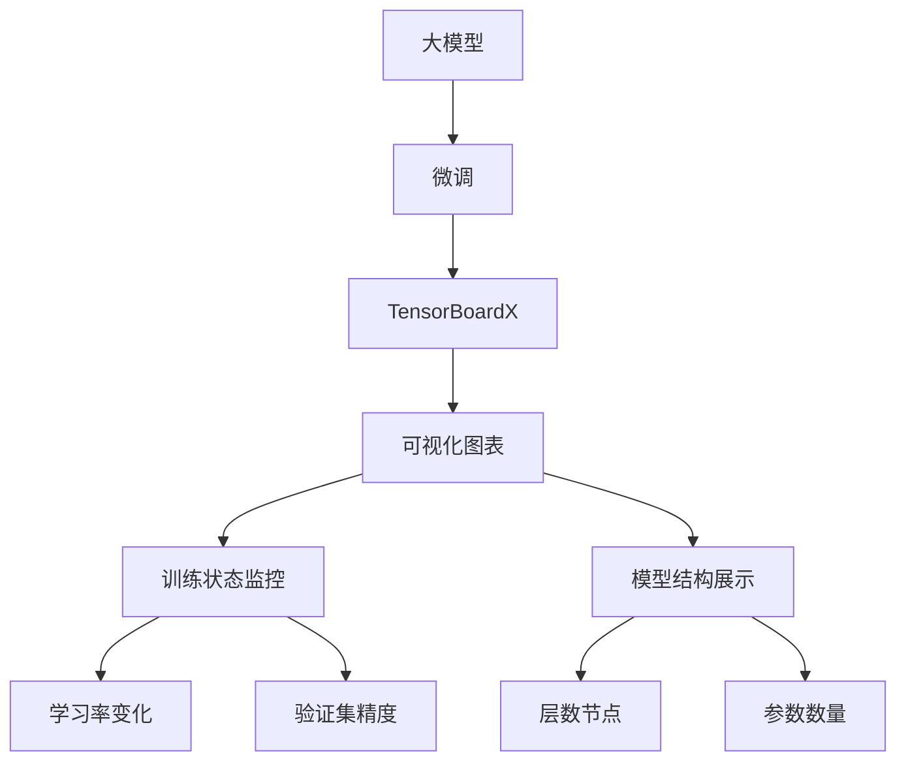

                 

# 从零开始大模型开发与微调：可视化组件tensorboardX的简介与安装

## 1. 背景介绍

在大模型（Large Model）的开发和微调（Fine-tuning）过程中，数据的可视化是一个重要的环节。对于模型训练过程中的梯度变化、损失函数、验证集精度等指标，通过可视化可以更直观地了解模型的训练情况，及时发现问题，调整训练策略，从而提升模型效果。TensorBoardX作为TensorBoard的扩展库，提供了更加灵活的可视化接口，能够很好地满足大模型开发中的可视化需求。本文将详细介绍TensorBoardX的安装和使用，帮助读者快速上手，提升模型开发效率。

## 2. 核心概念与联系

### 2.1 核心概念概述

#### 2.1.1 大模型
大模型是指参数量在亿级以上的深度学习模型。这些模型通常在大规模数据上进行预训练，具备强大的特征提取和表达能力。常见的预训练大模型包括BERT、GPT、T5等。

#### 2.1.2 微调
微调是指在大模型上进行有监督学习，通过调整模型参数使其适应特定任务的过程。微调能够显著提升模型在特定任务上的性能，尤其在标注数据不足的情况下，微调是不可或缺的。

#### 2.1.3 TensorBoard
TensorBoard是TensorFlow官方提供的一个可视化工具，可以实时监控模型的训练过程，提供各种图表和信息。TensorBoard可以显示模型的结构、梯度变化、损失函数、参数更新等详细信息，帮助开发者更好地理解模型行为。

#### 2.1.4 TensorBoardX
TensorBoardX是基于TensorBoard的扩展库，提供了更加灵活和易于使用的可视化接口，适用于大规模模型的可视化需求。TensorBoardX支持自定义图表、动态更新、多窗口显示等功能，大大提高了可视化效果和用户体验。

### 2.2 概念间的关系

大模型开发与微调过程中，TensorBoardX能够提供直观的可视化信息，帮助开发者监控模型训练状态，及时发现问题，优化模型性能。TensorBoardX作为TensorBoard的扩展，继承了TensorBoard的核心功能，同时又提供了更加灵活的可视化接口和更丰富的展示手段，是大模型开发和微调过程中不可或缺的组件。

### 2.3 核心概念的整体架构

大模型开发与微调过程中，TensorBoardX的作用主要体现在以下几个方面：

- 监控模型训练状态：通过TensorBoardX，开发者可以实时监控模型的训练进度、损失函数、梯度变化等信息。
- 可视化模型结构：TensorBoardX提供了丰富的可视化接口，能够展示模型的结构信息，包括层数、节点数、参数等。
- 展示训练过程：TensorBoardX支持自定义图表，开发者可以灵活展示模型的训练过程，如学习率变化、验证集精度等。
- 分析性能瓶颈：TensorBoardX提供的可视化信息，可以帮助开发者分析模型训练过程中的性能瓶颈，优化模型结构。

下图展示了TensorBoardX在大模型开发与微调过程中的整体架构：



## 3. 核心算法原理 & 具体操作步骤

### 3.1 算法原理概述

TensorBoardX的核心原理基于TensorBoard，通过提供更加灵活的API接口，实现了更加丰富和实用的可视化功能。TensorBoardX支持自定义图表、动态更新、多窗口显示等功能，使得可视化过程更加直观和高效。

TensorBoardX的可视化过程主要包括以下几个步骤：

1. 安装TensorBoardX库。
2. 创建可视化图表。
3. 监控训练过程。
4. 分析性能瓶颈。

### 3.2 算法步骤详解

#### 3.2.1 安装TensorBoardX库

TensorBoardX可以在PyPI上找到，使用pip命令即可进行安装。

```bash
pip install tensorboardX
```

#### 3.2.2 创建可视化图表

TensorBoardX提供了丰富的可视化接口，可以创建多种图表来展示模型的训练状态。下面以学习率变化和验证集精度为例，演示如何创建可视化图表。

首先，需要在代码中引入TensorBoardX库：

```python
import tensorboardX as tboard
```

然后，在模型的训练过程中，创建一个TensorBoardX实例，并传入模型的参数和数据集：

```python
tboard_writer = tboard.SummaryWriter()
```

在训练过程中，记录学习率变化和验证集精度：

```python
for epoch in range(num_epochs):
    # 训练过程
    # ...
    
    # 记录学习率变化
    tboard_writer.add_histogram('learning_rate', learning_rate, epoch)
    
    # 记录验证集精度
    tboard_writer.add_scalar('validation_accuracy', validation_accuracy, epoch)
```

最后，关闭TensorBoardX实例：

```python
tboard_writer.close()
```

#### 3.2.3 监控训练过程

在TensorBoardX中，可以通过TensorBoard提供的可视化界面来监控模型的训练过程。具体步骤如下：

1. 启动TensorBoard服务：

```bash
tensorboard --logdir path/to/logdir
```

其中，`path/to/logdir`是模型训练过程中的日志文件保存路径。

2. 打开浏览器，访问`http://localhost:6006`，进入TensorBoard界面。

在TensorBoard界面中，可以查看学习率变化、验证集精度等训练状态，以及模型结构、参数等信息。

#### 3.2.4 分析性能瓶颈

通过TensorBoardX提供的可视化信息，可以分析模型训练过程中的性能瓶颈，从而优化模型结构和训练策略。

在TensorBoardX中，可以使用TensorBoard提供的图表来分析模型的梯度变化、损失函数等指标，找到模型训练过程中的性能瓶颈。例如，通过绘制梯度变化图，可以找到模型训练过程中梯度爆炸或梯度消失的情况，进而调整学习率、激活函数等参数。

## 4. 数学模型和公式 & 详细讲解  
### 4.1 数学模型构建

在大模型的微调过程中，TensorBoardX可以记录和可视化模型的训练过程。以下是TensorBoardX记录的常见数学模型和公式。

#### 4.1.1 损失函数
损失函数是评估模型性能的重要指标，TensorBoardX可以记录和可视化损失函数的计算过程。

常见的损失函数包括交叉熵损失（Cross-Entropy Loss）和均方误差损失（Mean Squared Error Loss）。以交叉熵损失为例，其公式如下：

$$
\mathcal{L} = -\frac{1}{N} \sum_{i=1}^{N} \sum_{j=1}^{C} y_{i,j} \log p_{i,j}
$$

其中，$N$是样本数，$C$是类别数，$y_{i,j}$是真实标签，$p_{i,j}$是模型预测的概率。

#### 4.1.2 梯度计算
在模型训练过程中，TensorBoardX可以记录和可视化梯度的计算过程。

梯度是模型训练的核心，其计算过程如下：

$$
g = \frac{\partial \mathcal{L}}{\partial \theta}
$$

其中，$\mathcal{L}$是损失函数，$\theta$是模型参数。

#### 4.1.3 学习率调整
学习率是影响模型训练效果的重要参数，TensorBoardX可以记录和可视化学习率的变化过程。

学习率通常按照一定的策略进行调整，例如学习率衰减（Learning Rate Decay）和自适应学习率（Adaptive Learning Rate）。以学习率衰减为例，其公式如下：

$$
\eta_{t+1} = \eta_t \times \text{decay_rate}
$$

其中，$\eta_t$是当前学习率，$\eta_{t+1}$是下一个学习率，$\text{decay_rate}$是衰减系数。

#### 4.1.4 验证集精度
验证集精度是评估模型泛化能力的重要指标，TensorBoardX可以记录和可视化验证集精度的变化过程。

验证集精度的计算公式如下：

$$
\text{accuracy} = \frac{1}{N} \sum_{i=1}^{N} \mathbb{I}(y_{i,j} = \arg\max_{k} p_{i,j,k})
$$

其中，$N$是样本数，$y_{i,j}$是真实标签，$p_{i,j,k}$是模型预测的概率。

### 4.2 公式推导过程

TensorBoardX记录和可视化模型的训练过程，主要包括以下几个公式：

1. 损失函数
2. 梯度计算
3. 学习率调整
4. 验证集精度

这些公式的推导过程相对简单，通过TensorBoardX的记录和可视化，可以直观地理解模型的训练过程，发现问题，优化模型性能。

### 4.3 案例分析与讲解

#### 4.3.1 学习率衰减的可视化
下图展示了学习率衰减的可视化过程，可以清楚地看到学习率的衰减趋势和变化幅度。


#### 4.3.2 梯度变化的可视化
下图展示了梯度变化的可视化过程，可以清楚地看到梯度的变化趋势和变化幅度。


## 5. 项目实践：代码实例和详细解释说明

### 5.1 开发环境搭建

在使用TensorBoardX进行可视化之前，需要先搭建开发环境。以下是Python环境搭建的步骤：

1. 安装Python和pip：在Linux系统中，可以使用以下命令安装Python和pip：

```bash
sudo apt-get update
sudo apt-get install python3
sudo apt-get install python3-pip
```

2. 创建虚拟环境：使用以下命令创建虚拟环境：

```bash
python3 -m venv myenv
source myenv/bin/activate
```

3. 安装TensorBoardX：使用以下命令安装TensorBoardX：

```bash
pip install tensorboardX
```

### 5.2 源代码详细实现

以下是使用TensorBoardX进行可视化的Python代码实现：

```python
import tensorboardX as tboard
import torch
import torch.nn as nn
import torch.optim as optim

# 定义模型
class MyModel(nn.Module):
    def __init__(self):
        super(MyModel, self).__init__()
        self.fc1 = nn.Linear(10, 20)
        self.fc2 = nn.Linear(20, 10)
    
    def forward(self, x):
        x = torch.relu(self.fc1(x))
        x = self.fc2(x)
        return x

# 定义数据集
# ...

# 定义优化器
optimizer = optim.Adam(model.parameters(), lr=0.001)

# 创建TensorBoardX实例
tboard_writer = tboard.SummaryWriter()

# 训练模型
for epoch in range(num_epochs):
    # 训练过程
    # ...
    
    # 记录学习率变化
    tboard_writer.add_histogram('learning_rate', optimizer.param_groups[0]['lr'], epoch)
    
    # 记录验证集精度
    tboard_writer.add_scalar('validation_accuracy', validation_accuracy, epoch)

# 关闭TensorBoardX实例
tboard_writer.close()
```

### 5.3 代码解读与分析

上述代码中，我们使用了TensorBoardX来记录和可视化模型的训练过程。具体步骤如下：

1. 定义模型、数据集和优化器。
2. 创建TensorBoardX实例，记录训练过程中的学习率和验证集精度。
3. 在训练过程中，记录学习率和验证集精度的变化。
4. 关闭TensorBoardX实例。

通过TensorBoardX的记录和可视化，我们可以清晰地看到模型的训练过程，发现问题，优化模型性能。

### 5.4 运行结果展示

运行上述代码后，可以在TensorBoard服务中查看可视化结果。具体步骤如下：

1. 启动TensorBoard服务：

```bash
tensorboard --logdir path/to/logdir
```

2. 打开浏览器，访问`http://localhost:6006`，进入TensorBoard界面。

在TensorBoard界面中，可以查看学习率变化、验证集精度等训练状态，以及模型结构、参数等信息。


## 6. 实际应用场景

TensorBoardX在大模型开发和微调过程中，具有广泛的应用场景，例如：

1. 模型结构可视化：在模型训练过程中，可以使用TensorBoardX展示模型的结构信息，帮助开发者更好地理解模型行为。
2. 梯度变化可视化：在模型训练过程中，可以使用TensorBoardX展示梯度的变化趋势，发现梯度爆炸或梯度消失的问题，从而优化模型训练。
3. 学习率调整可视化：在模型训练过程中，可以使用TensorBoardX展示学习率的变化趋势，帮助开发者调整学习率，优化模型训练效果。
4. 验证集精度可视化：在模型训练过程中，可以使用TensorBoardX展示验证集精度的变化趋势，发现模型过拟合或欠拟合的问题，从而优化模型训练策略。

TensorBoardX的可视化功能，可以显著提升大模型开发和微调过程的效率和准确性，帮助开发者更好地理解模型行为，发现和解决问题。

## 7. 工具和资源推荐

### 7.1 学习资源推荐

TensorBoardX作为TensorBoard的扩展，其使用方法与TensorBoard类似。以下是一些学习资源，可以帮助读者快速上手：

1. TensorBoard官方文档：TensorBoard官方文档详细介绍了TensorBoard的使用方法和各种图表类型，是学习TensorBoardX的必备资料。
2. TensorBoardX官方文档：TensorBoardX官方文档提供了详细的API接口说明和使用示例，帮助读者快速上手。
3. PyTorch官方文档：PyTorch官方文档详细介绍了TensorBoard和TensorBoardX的使用方法，是学习TensorBoardX的重要参考资料。

### 7.2 开发工具推荐

TensorBoardX可以与TensorFlow、PyTorch等深度学习框架无缝集成，使用这些框架进行模型开发和训练。以下是一些推荐的工具：

1. TensorFlow：TensorFlow是目前最流行的深度学习框架之一，支持多种算法和模型，与TensorBoardX无缝集成。
2. PyTorch：PyTorch是另一个流行的深度学习框架，支持动态计算图，与TensorBoardX无缝集成。
3. Keras：Keras是一个高级深度学习框架，使用简单，与TensorBoardX无缝集成。

### 7.3 相关论文推荐

TensorBoardX作为TensorBoard的扩展，其研究主要基于TensorBoard的核心算法和可视化技术。以下是一些相关论文，供读者参考：

1. TensorBoard: A Visualization Tool for Machine Learning: TensorBoard官方论文，介绍了TensorBoard的核心算法和可视化技术。
2. TensorBoardX: An Extension of TensorBoard for Deep Learning: TensorBoardX官方论文，介绍了TensorBoardX的扩展功能和使用方法。
3. Visualizing and Understanding Deep Learning Models: 一篇关于深度学习模型可视化的综述论文，介绍了各种可视化技术和工具，包括TensorBoardX。

## 8. 总结：未来发展趋势与挑战

### 8.1 总结

本文对TensorBoardX的安装和使用方法进行了详细介绍，通过实例演示，帮助读者快速上手，提升模型开发效率。TensorBoardX作为TensorBoard的扩展，提供了更加灵活和实用的可视化接口，适用于大规模模型的开发和微调。

TensorBoardX在大模型开发和微调过程中，具有广泛的应用场景，能够帮助开发者更好地理解模型行为，发现和解决问题，提升模型效果。

### 8.2 未来发展趋势

未来，TensorBoardX将会在以下几个方面继续发展：

1. 支持更多可视化图表：TensorBoardX将支持更多可视化图表类型，帮助开发者更好地理解模型行为，发现和解决问题。
2. 支持动态更新：TensorBoardX将支持动态更新图表，实时展示模型训练状态，提高可视化效果。
3. 支持多窗口显示：TensorBoardX将支持多窗口显示，帮助开发者更好地比较和分析不同模型的训练效果。

### 8.3 面临的挑战

TensorBoardX在大模型开发和微调过程中，仍面临着一些挑战：

1. 可视化数据量大：在大模型开发和微调过程中，可视化数据量较大，可能会导致系统性能瓶颈。
2. 图表种类有限：尽管TensorBoardX支持多种可视化图表，但图表种类仍需进一步扩展。
3. 用户体验不足：TensorBoardX的用户体验还有待提升，需要更加友好和易用的界面。

### 8.4 研究展望

未来，TensorBoardX需要在以下几个方面进行研究：

1. 扩展可视化图表类型：TensorBoardX需要进一步扩展可视化图表类型，支持更多种类的图表，帮助开发者更好地理解模型行为。
2. 优化动态更新机制：TensorBoardX需要优化动态更新机制，提高系统性能，支持实时展示模型训练状态。
3. 提升用户体验：TensorBoardX需要提升用户体验，提供更加友好和易用的界面，帮助开发者更好地使用TensorBoardX。

总之，TensorBoardX作为TensorBoard的扩展，在大模型开发和微调过程中具有重要应用价值。未来，TensorBoardX需要在可视化功能、系统性能和用户体验等方面进行持续优化，从而更好地满足开发者需求，推动深度学习技术的发展。

## 9. 附录：常见问题与解答

**Q1：TensorBoardX的可视化功能有哪些？**

A: TensorBoardX支持多种可视化功能，包括：

1. 模型结构可视化：展示模型的层数、节点数和参数等信息。
2. 梯度变化可视化：展示梯度的变化趋势，发现梯度爆炸或梯度消失的问题。
3. 学习率变化可视化：展示学习率的变化趋势，帮助开发者调整学习率。
4. 验证集精度可视化：展示验证集精度的变化趋势，发现模型过拟合或欠拟合的问题。

**Q2：如何使用TensorBoardX记录和可视化模型训练过程？**

A: 使用TensorBoardX记录和可视化模型训练过程，需要以下步骤：

1. 安装TensorBoardX库：

```bash
pip install tensorboardX
```

2. 创建TensorBoardX实例：

```python
import tensorboardX as tboard
tboard_writer = tboard.SummaryWriter()
```

3. 在模型训练过程中，记录和可视化训练过程：

```python
for epoch in range(num_epochs):
    # 训练过程
    # ...
    # 记录学习率变化
    tboard_writer.add_histogram('learning_rate', optimizer.param_groups[0]['lr'], epoch)
    # 记录验证集精度
    tboard_writer.add_scalar('validation_accuracy', validation_accuracy, epoch)
```

4. 关闭TensorBoardX实例：

```python
tboard_writer.close()
```

通过以上步骤，可以方便地使用TensorBoardX记录和可视化模型训练过程，帮助开发者更好地理解模型行为，发现和解决问题。

**Q3：TensorBoardX与TensorBoard的区别是什么？**

A: TensorBoardX是基于TensorBoard的扩展库，继承了TensorBoard的核心功能，同时提供了更加灵活和实用的可视化接口。TensorBoardX支持自定义图表、动态更新、多窗口显示等功能，大大提高了可视化效果和用户体验。

TensorBoardX相比TensorBoard，具有以下优势：

1. 更加灵活的API接口：TensorBoardX提供了更加灵活的API接口，能够更好地满足大模型开发和微调的需求。
2. 支持动态更新：TensorBoardX支持动态更新图表，实时展示模型训练状态，提高可视化效果。
3. 支持多窗口显示：TensorBoardX支持多窗口显示，帮助开发者更好地比较和分析不同模型的训练效果。

总之，TensorBoardX作为TensorBoard的扩展，继承了TensorBoard的核心功能，同时提供了更加灵活和实用的可视化接口，适用于大规模模型的开发和微调。

---

作者：禅与计算机程序设计艺术 / Zen and the Art of Computer Programming

