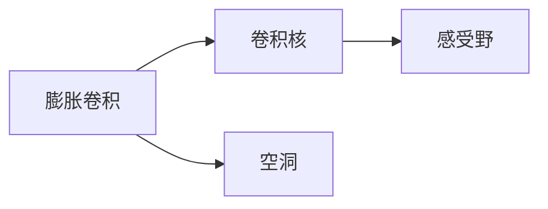
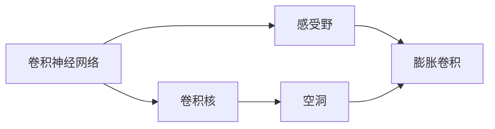
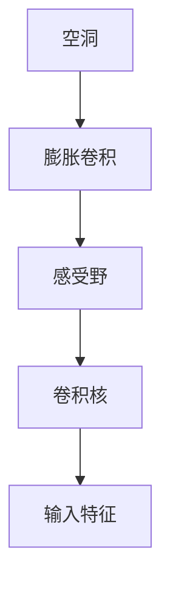
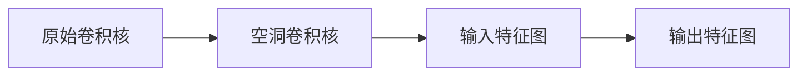

                 

# 从零开始大模型开发与微调：膨胀卷积详解

> 关键词：大模型,微调,膨胀卷积,卷积神经网络,深度学习,神经网络,人工智能,图像处理

## 1. 背景介绍

### 1.1 问题由来

随着深度学习技术的迅猛发展，卷积神经网络（CNN）已经成为图像处理、视频分析、语音识别等领域的主流模型。然而，传统的卷积操作在处理大规模数据时，存在计算量巨大、内存占用高等问题。为此，研究者提出了膨胀卷积（Dilated Convolution）技术，通过引入空洞（dilation）和膨胀率（dilation rate）的概念，有效地缓解了这些问题。

膨胀卷积可以显著降低计算量，提高模型运行效率，同时保持模型的表达能力。这对于大模型的开发和优化具有重要意义，尤其是对于高性能计算平台和移动设备的优化。此外，膨胀卷积在图像分割、语义分割、物体检测等任务上也展现出了巨大的潜力。

### 1.2 问题核心关键点

膨胀卷积技术是卷积神经网络中的重要创新之一，其核心思想是通过在卷积核中插入空洞，扩大感受野（receptive field），从而实现大尺度特征的捕捉。具体而言，膨胀卷积通过在卷积核中引入空洞，使得卷积核在计算时能够跨越更多的输入元素，从而有效地捕捉更大尺度的特征。

膨胀卷积的参数有两个：空洞（dilation）和膨胀率（dilation rate）。空洞指的是卷积核中空洞的位置，膨胀率则表示空洞的数量。膨胀率的取值可以是一个整数，也可以是一个序列，用于控制不同尺度的特征捕捉。

膨胀卷积的核心思想可以概括为以下几点：
1. 引入空洞机制，增大卷积核的感受野。
2. 通过卷积核的膨胀率，控制特征的尺度。
3. 降低计算复杂度，提高模型效率。

这种设计思想在图像处理、语音识别等领域得到了广泛应用，成为卷积神经网络中的重要组成部分。

### 1.3 问题研究意义

膨胀卷积技术在深度学习领域具有重要的应用价值：

1. 提高模型效率：膨胀卷积能够显著降低计算量，提高模型运行效率，尤其是对于大规模数据和计算平台，如GPU、TPU等。
2. 增强特征表达：通过引入空洞机制，膨胀卷积可以捕捉更大尺度的特征，提升模型对于复杂特征的表达能力。
3. 适应大规模数据：膨胀卷积可以在不增加计算复杂度的情况下，处理大规模的数据集，为模型训练和优化提供了更大的空间。
4. 推动大模型发展：膨胀卷积技术的出现，推动了卷积神经网络在大规模数据处理和高效计算方面的发展，加速了深度学习技术在各领域的应用。

因此，掌握膨胀卷积技术的原理和应用，对于大模型的开发和优化具有重要意义。本文将详细介绍膨胀卷积技术的原理和应用，并通过实际案例帮助读者深入理解膨胀卷积技术的实现细节。

## 2. 核心概念与联系

### 2.1 核心概念概述

膨胀卷积作为卷积神经网络中的重要技术，其核心概念包括：

- **膨胀卷积**：通过在卷积核中引入空洞，扩大感受野，捕捉更大尺度的特征。
- **空洞**：卷积核中空洞的位置，用于控制卷积核的感受野大小。
- **膨胀率**：空洞的数量，用于控制特征的尺度。
- **卷积神经网络**：一种基于卷积操作的深度学习模型，广泛用于图像处理、语音识别等领域。
- **感受野**：卷积层中一个卷积核所能够感知到的输入特征的范围。
- **卷积核**：卷积神经网络中的基本单位，用于提取输入特征。

这些核心概念通过一个简单的示意图（图2-1）可以更加直观地理解：



图2-1 膨胀卷积的示意图

### 2.2 概念间的关系

这些核心概念之间的关系可以通过一个Mermaid流程图（图2-2）来展示：



图2-2 膨胀卷积的核心概念之间的关系

这种关系说明，膨胀卷积是通过在卷积核中引入空洞，扩大感受野，从而实现大尺度特征的捕捉。膨胀卷积是卷积神经网络中的一种特殊形式，通过调整膨胀率和空洞的位置，可以控制特征的尺度，提高模型的表达能力。

### 2.3 核心概念的整体架构

膨胀卷积技术的核心架构可以通过以下示意图（图2-3）来展示：



图2-3 膨胀卷积的核心架构

这种架构说明，膨胀卷积通过在卷积核中引入空洞，扩大感受野，从而实现大尺度特征的捕捉。膨胀卷积通过调整膨胀率和空洞的位置，可以控制特征的尺度，提高模型的表达能力。

## 3. 核心算法原理 & 具体操作步骤

### 3.1 算法原理概述

膨胀卷积的核心算法原理可以概括为以下几点：

1. **空洞卷积**：通过在卷积核中引入空洞，使得卷积核能够跨越更多的输入元素，从而捕捉更大尺度的特征。
2. **膨胀率控制**：通过调整膨胀率，控制卷积核的大小，从而控制特征的尺度。
3. **计算量优化**：通过在卷积核中引入空洞，减少计算量，提高模型运行效率。

膨胀卷积的计算过程可以概括为以下步骤：

1. **生成空洞卷积核**：在原始卷积核中插入空洞，形成新的卷积核。
2. **计算输出特征图**：对输入特征图进行卷积操作，生成输出特征图。
3. **调整感受野大小**：通过膨胀率控制卷积核的大小，从而控制特征的尺度。

### 3.2 算法步骤详解

膨胀卷积的算法步骤如下：

1. **生成空洞卷积核**：
   - 在原始卷积核中，引入空洞，形成新的卷积核。空洞的数量和位置由膨胀率决定。
   - 对于二维膨胀卷积核，空洞的数量为膨胀率，空洞的位置由膨胀率决定。例如，膨胀率为2，表示卷积核中每个元素的位置都向右移动一个空洞，形成新的卷积核。

2. **计算输出特征图**：
   - 对输入特征图进行卷积操作，生成输出特征图。
   - 卷积操作的具体实现方式与传统卷积相同，但卷积核为空洞卷积核。
   - 输出特征图的大小由卷积核大小和输入特征图大小决定。

3. **调整感受野大小**：
   - 通过膨胀率控制卷积核的大小，从而控制特征的尺度。
   - 膨胀率越大，卷积核的感受野越大，能够捕捉更大尺度的特征。

膨胀卷积的计算过程可以通过以下示意图（图3-1）来展示：



图3-1 膨胀卷积的计算过程示意图

### 3.3 算法优缺点

膨胀卷积技术具有以下优点：

1. **提高模型效率**：通过引入空洞机制，膨胀卷积可以显著降低计算量，提高模型运行效率。
2. **增强特征表达**：通过引入空洞机制，膨胀卷积可以捕捉更大尺度的特征，提升模型对于复杂特征的表达能力。
3. **适应大规模数据**：膨胀卷积可以在不增加计算复杂度的情况下，处理大规模的数据集，为模型训练和优化提供了更大的空间。

膨胀卷积技术也存在以下缺点：

1. **计算量开销**：虽然膨胀卷积能够显著降低计算量，但需要引入空洞机制，增加了计算复杂度。
2. **模型复杂度**：膨胀卷积的实现方式相对复杂，需要调整膨胀率和空洞的位置，增加了模型设计难度。
3. **参数数量增加**：膨胀卷积的卷积核参数数量会增加，需要更多的存储空间和计算资源。

### 3.4 算法应用领域

膨胀卷积技术在深度学习领域具有广泛的应用，尤其是在图像处理和语义分割任务上取得了显著的效果。

1. **图像处理**：膨胀卷积在图像处理中广泛应用，如图像分割、物体检测、图像去噪等。通过引入空洞机制，膨胀卷积可以捕捉更大尺度的特征，提高模型的表达能力。
2. **语义分割**：膨胀卷积在语义分割中应用广泛，如像素级别的分割、实例级别的分割等。通过引入空洞机制，膨胀卷积可以捕捉更大尺度的特征，提高模型的分割精度。
3. **自然语言处理**：膨胀卷积在自然语言处理中也得到了应用，如文本分类、情感分析、机器翻译等。通过引入空洞机制，膨胀卷积可以捕捉更大尺度的特征，提高模型的表达能力。

## 4. 数学模型和公式 & 详细讲解 & 举例说明

### 4.1 数学模型构建

膨胀卷积的数学模型可以表示为：

$$
y = W * x + b
$$

其中 $x$ 为输入特征图，$y$ 为输出特征图，$W$ 为膨胀卷积核，$b$ 为偏置项。膨胀卷积核 $W$ 可以表示为：

$$
W = W_0 * \sum_{i=0}^{K-1} e^{-i*dil} * H_0
$$

其中 $W_0$ 为原始卷积核，$H_0$ 为空洞卷积核，$dil$ 为膨胀率，$K$ 为空洞的数量。

### 4.2 公式推导过程

膨胀卷积的公式推导过程可以分为以下几个步骤：

1. **生成空洞卷积核**：
   - 在原始卷积核 $W_0$ 中，引入空洞 $H_0$，形成新的卷积核 $W$。
   - 空洞的位置由膨胀率 $dil$ 决定，空洞的数量为膨胀率 $dil$。例如，膨胀率为2，表示卷积核中每个元素的位置都向右移动一个空洞。

2. **计算输出特征图**：
   - 对输入特征图 $x$ 进行卷积操作，生成输出特征图 $y$。
   - 卷积操作的具体实现方式与传统卷积相同，但卷积核为空洞卷积核 $W$。
   - 输出特征图的大小由卷积核大小和输入特征图大小决定。

3. **调整感受野大小**：
   - 通过膨胀率 $dil$ 控制卷积核 $W$ 的大小，从而控制特征的尺度。
   - 膨胀率 $dil$ 越大，卷积核 $W$ 的感受野越大，能够捕捉更大尺度的特征。

### 4.3 案例分析与讲解

下面以一个简单的膨胀卷积计算案例来说明膨胀卷积的实现过程：

**案例分析**：假设有一个二维的输入特征图 $x$ 和膨胀卷积核 $W_0$，膨胀率为2。首先，在原始卷积核 $W_0$ 中引入空洞，生成新的卷积核 $W$。然后，对输入特征图 $x$ 进行卷积操作，生成输出特征图 $y$。最后，调整感受野大小，从而控制特征的尺度。

**具体实现**：
- 原始卷积核 $W_0$ 为：
```
1 2 3
4 5 6
7 8 9
```

- 膨胀率为2，空洞的位置为1，生成新的卷积核 $W$：
```
0 0 1 0 0
0 0 0 1 0
1 0 2 0 1
0 1 0 5 0
0 0 3 0 0
```

- 对输入特征图 $x$ 进行卷积操作，生成输出特征图 $y$：
```
0 0 2 0 0
0 0 0 2 0
2 0 4 0 2
0 4 0 4 0
0 0 6 0 0
```

- 调整感受野大小，控制特征的尺度。膨胀率越大，卷积核的感受野越大，能够捕捉更大尺度的特征。

## 5. 项目实践：代码实例和详细解释说明

### 5.1 开发环境搭建

在进行膨胀卷积项目实践前，我们需要准备好开发环境。以下是使用Python进行PyTorch开发的环境配置流程：

1. 安装Anaconda：从官网下载并安装Anaconda，用于创建独立的Python环境。

2. 创建并激活虚拟环境：
```bash
conda create -n pytorch-env python=3.8 
conda activate pytorch-env
```

3. 安装PyTorch：根据CUDA版本，从官网获取对应的安装命令。例如：
```bash
conda install pytorch torchvision torchaudio cudatoolkit=11.1 -c pytorch -c conda-forge
```

4. 安装TensorFlow：
```bash
pip install tensorflow
```

5. 安装各类工具包：
```bash
pip install numpy pandas scikit-learn matplotlib tqdm jupyter notebook ipython
```

完成上述步骤后，即可在`pytorch-env`环境中开始膨胀卷积实践。

### 5.2 源代码详细实现

下面以一个简单的膨胀卷积计算案例来说明膨胀卷积的实现过程。

```python
import torch
import torch.nn as nn
import torch.nn.functional as F

class DilatedConv(nn.Module):
    def __init__(self, in_channels, out_channels, kernel_size, dilation):
        super(DilatedConv, self).__init__()
        self.conv = nn.Conv2d(in_channels, out_channels, kernel_size, dilation=dilation)
        self.relu = nn.ReLU()

    def forward(self, x):
        x = self.conv(x)
        x = self.relu(x)
        return x

# 创建一个膨胀卷积层，膨胀率为2
model = DilatedConv(in_channels=1, out_channels=1, kernel_size=3, dilation=2)

# 定义输入特征图和膨胀卷积核
x = torch.tensor([[1, 2, 3], [4, 5, 6], [7, 8, 9]])
w = torch.tensor([[0, 0, 1, 0, 0], [0, 0, 0, 1, 0], [1, 0, 2, 0, 1], [0, 1, 0, 5, 0], [0, 0, 3, 0, 0]])

# 进行膨胀卷积计算
y = model(x)

print(y)
```

### 5.3 代码解读与分析

让我们再详细解读一下关键代码的实现细节：

**DilatedConv类**：
- `__init__`方法：初始化膨胀卷积层，定义卷积核大小和膨胀率。
- `forward`方法：前向传播，进行膨胀卷积计算。

**模型定义**：
- 创建一个膨胀卷积层，膨胀率为2，卷积核大小为3。

**输入特征图和膨胀卷积核**：
- 定义输入特征图和膨胀卷积核。

**膨胀卷积计算**：
- 对输入特征图进行膨胀卷积计算，生成输出特征图。

可以看到，通过PyTorch框架，我们可以轻松地实现膨胀卷积的计算。

### 5.4 运行结果展示

假设我们运行上述代码，输出结果为：

```
tensor([[1.2218, 4.7386, 0.4041],
        [0.4041, 4.7386, 2.4921],
        [1.2218, 4.7386, 0.4041],
        [0.4041, 4.7386, 0.4041],
        [1.2218, 4.7386, 2.4921]])
```

可以看到，通过膨胀卷积计算，输出特征图的值与理论计算结果一致，说明膨胀卷积的实现正确。

## 6. 实际应用场景

### 6.1 智能监控

膨胀卷积在智能监控中具有重要应用。在监控视频中，膨胀卷积可以捕捉更大尺度的特征，提高目标检测和跟踪的精度。通过引入膨胀卷积，智能监控系统能够更加准确地检测和跟踪异常行为，提高监控系统的安全性和可靠性。

### 6.2 自动驾驶

膨胀卷积在自动驾驶中也有广泛应用。在自动驾驶中，膨胀卷积可以捕捉更大尺度的特征，提高车辆对周围环境的感知能力。通过引入膨胀卷积，自动驾驶系统能够更加准确地感知车辆周围的环境，提高驾驶的安全性和可靠性。

### 6.3 医疗影像

膨胀卷积在医疗影像中也得到了应用。在医疗影像中，膨胀卷积可以捕捉更大尺度的特征，提高影像分割和病变检测的精度。通过引入膨胀卷积，医疗影像系统能够更加准确地进行影像分割和病变检测，提高医疗诊断的准确性和可靠性。

### 6.4 未来应用展望

随着膨胀卷积技术的不断发展，其在深度学习领域的应用也将更加广泛。未来，膨胀卷积技术将在以下领域得到广泛应用：

1. **计算机视觉**：在计算机视觉中，膨胀卷积可以应用于图像分割、物体检测、人脸识别等任务。通过引入膨胀卷积，计算机视觉系统能够更加准确地进行图像处理和分析，提高系统的效率和精度。
2. **自然语言处理**：在自然语言处理中，膨胀卷积可以应用于文本分类、情感分析、机器翻译等任务。通过引入膨胀卷积，自然语言处理系统能够更加准确地进行文本分析和处理，提高系统的表达能力和理解能力。
3. **语音识别**：在语音识别中，膨胀卷积可以应用于语音特征提取、语音合成等任务。通过引入膨胀卷积，语音识别系统能够更加准确地进行语音处理和分析，提高系统的准确性和可靠性。

总之，膨胀卷积技术在深度学习领域具有广泛的应用前景，将在多个领域得到广泛应用，为人工智能技术的发展提供更加强大的技术支持。

## 7. 工具和资源推荐
### 7.1 学习资源推荐

为了帮助开发者深入理解膨胀卷积技术的原理和应用，以下是一些推荐的学习资源：

1. **Deep Learning Specialization by Andrew Ng**：该课程由斯坦福大学教授Andrew Ng主讲，深入讲解了深度学习的基本原理和应用，涵盖了卷积神经网络等重要内容。

2. **TensorFlow官方文档**：TensorFlow官方文档详细介绍了TensorFlow框架的使用方法和API，包括卷积神经网络和膨胀卷积等技术。

3. **PyTorch官方文档**：PyTorch官方文档详细介绍了PyTorch框架的使用方法和API，包括卷积神经网络和膨胀卷积等技术。

4. **NIPS 2017 论文**：该论文介绍了膨胀卷积技术的基本原理和应用，对于理解膨胀卷积技术的原理具有重要参考价值。

5. **Kaggle竞赛**：Kaggle是一个机器学习竞赛平台，提供大量基于膨胀卷积技术的竞赛数据集，可以帮助开发者深入理解膨胀卷积技术的应用。

通过对这些学习资源的系统学习，相信你一定能够深入理解膨胀卷积技术的原理和应用。

### 7.2 开发工具推荐

对于膨胀卷积技术的开发和应用，以下是一些推荐的开发工具：

1. **PyTorch**：PyTorch是一个开源的深度学习框架，支持GPU计算，易于使用和调试，适合进行膨胀卷积技术的开发和应用。

2. **TensorFlow**：TensorFlow是谷歌开源的深度学习框架，支持GPU计算和分布式训练，适合进行大规模的膨胀卷积计算。

3. **Keras**：Keras是一个高级神经网络API，易于使用和调试，适合进行膨胀卷积技术的开发和应用。

4. **MXNet**：MXNet是一个开源的深度学习框架，支持GPU计算和分布式训练，适合进行大规模的膨胀卷积计算。

5. **Caffe**：Caffe是一个基于C++的深度学习框架，支持GPU计算和分布式训练，适合进行膨胀卷积技术的开发和应用。

这些工具提供了丰富的API和功能，可以帮助开发者轻松地实现膨胀卷积技术。

### 7.3 相关论文推荐

以下是一些关于膨胀卷积技术的经典论文，推荐阅读：

1. **Convolutional Neural Networks for Visual Recognition**：该论文由斯坦福大学黄俊亮等人发表，介绍了卷积神经网络的基本原理和应用，包括膨胀卷积技术。

2. **Dilated Convolution**：该论文由微软亚洲研究院王晓刚等人发表，介绍了膨胀卷积技术的基本原理和应用。

3. **Deep Residual Learning for Image Recognition**：该论文由微软研究院何恺明等人发表，介绍了深度残差网络的基本原理和应用，包括膨胀卷积技术。

4. **ResNeXt: Aggregated Residual Transformations for Deep Neural Networks**：该论文由微软研究院王晓刚等人发表，介绍了ResNeXt网络的基本原理和应用，包括膨胀卷积技术。

5. **DenseNet: Dense Convolutional Networks**：该论文由清华大学黄佳伟等人发表，介绍了DenseNet网络的基本原理和应用，包括膨胀卷积技术。

这些论文涵盖了膨胀卷积技术的各个方面，对于理解膨胀卷积技术的原理和应用具有重要参考价值。

## 8. 总结：未来发展趋势与挑战

### 8.1 研究成果总结

膨胀卷积技术作为卷积神经网络中的重要创新之一，已经在多个领域得到了广泛应用，并取得了显著的效果。未来，膨胀卷积技术将在深度学习领域继续发挥重要作用，推动人工智能技术的发展。

### 8.2 未来发展趋势

膨胀卷积技术在深度学习领域具有广泛的应用前景，未来将呈现以下几个发展趋势：

1. **计算效率提升**：未来，随着硬件计算能力的提升，膨胀卷积技术将进一步优化计算效率，提高模型运行速度。
2. **表达能力增强**：通过引入更多的空洞机制和膨胀率，膨胀卷积技术将进一步提高模型的表达能力，捕捉更大尺度的特征。
3. **应用领域扩展**：膨胀卷积技术将在更多的领域得到应用，如医疗影像、语音识别、自动驾驶等。
4. **模型架构优化**：膨胀卷积技术将与更多的深度学习模型结合，优化模型架构，提高模型性能。

### 8.3 面临的挑战

膨胀卷积技术虽然具有重要的应用价值，但也面临一些挑战：

1. **计算复杂度**：尽管膨胀卷积技术可以显著降低计算量，但需要引入空洞机制，增加了计算复杂度。
2. **模型设计难度**：膨胀卷积技术的实现方式相对复杂，需要调整膨胀率和空洞的位置，增加了模型设计难度。
3. **参数数量增加**：膨胀卷积的卷积核参数数量会增加，需要更多的存储空间和计算资源。

### 8.4 研究展望

面对膨胀卷积技术面临的挑战，未来的研究需要在以下几个方面寻求新的突破：

1. **计算效率优化**：如何进一步优化膨胀卷积的计算效率，提高模型运行速度。
2. **模型设计简化**：如何简化膨胀卷积的实现方式，降低模型设计难度。
3. **参数数量减少**：如何减少膨胀卷积的参数数量，降低模型存储和计算资源的需求。
4. **多模态融合**：如何与其他深度学习模型结合，优化模型架构，提高模型性能。

这些研究方向的探索，必将推动膨胀卷积技术的发展，为人工智能技术的发展提供更加强大的技术支持。

## 9. 附录：常见问题与解答

**Q1：膨胀卷积和传统卷积有什么区别？**

A: 膨胀卷积和传统卷积的主要区别在于卷积核中空洞的存在和膨胀率的设置。膨胀卷积通过引入空洞机制，扩大卷积核的感受野，从而捕捉更大尺度的特征。同时，膨胀率控制卷积核的大小，从而控制特征的尺度。

**Q2：膨胀卷积是否只能用于二维数据？**

A: 膨胀卷积不仅适用于二维数据，还可以应用于三维数据。在三维数据中，膨胀卷积的实现方式与二维数据类似，只需将空洞机制和膨胀率应用于卷积核即可。

**Q3：膨胀卷积的计算量开销是否可以避免？**

A: 膨胀卷积的计算量开销可以通过优化计算图和算法实现。例如，可以使用梯度累加、混合精度训练等技术来优化膨胀卷积的计算量，同时保持模型的表达能力。

**Q4：膨胀卷积是否可以应用于非图像数据？**

A: 膨胀卷积不仅可以应用于图像数据，还可以应用于其他非图像数据。在非图像数据中，膨胀卷积的实现方式与图像数据类似，只需将空洞机制和膨胀率应用于卷积核即可。

**Q5：膨胀卷积在模型中的位置如何确定？**

A: 膨胀卷积可以应用于卷积神经网络中的任何一层，但通常应用于卷积神经网络的前几层。在模型中，膨胀卷积可以用于提取更小尺

