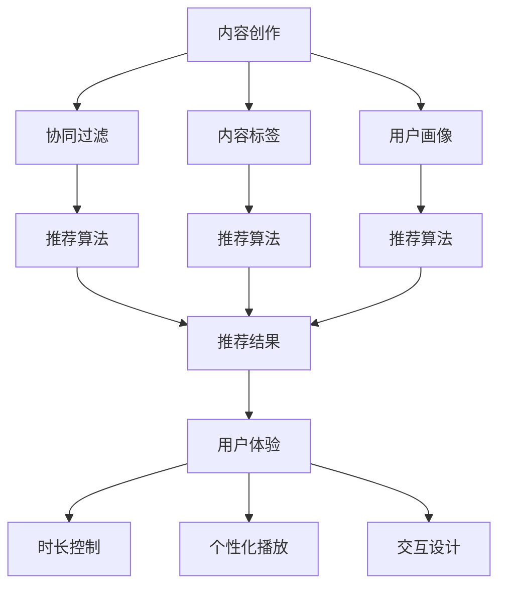

                 

# 付费音频要重视音频内容的趣味性和时长

在数字媒体的时代，付费音频平台已经成为主流，如Spotify、Apple Music、Audible等，这些平台不仅提供了海量的音乐，还集成了大量的付费音频内容。然而，随着用户对内容需求的多样化，如何提高付费音频的趣味性和时长，成为了平台和开发者亟待解决的问题。本文将从核心概念、算法原理、项目实践和实际应用场景四个方面，探讨付费音频内容的趣味性和时长优化方法，并给出未来展望及潜在挑战。

## 1. 背景介绍

### 1.1 问题由来

随着智能手机的普及和移动互联网的快速发展，音频内容逐渐成为用户日常生活中的重要组成部分。根据Statista的数据，2020年全球音频流媒体市场规模已达64亿美元，预计到2025年将增至142亿美元。付费音频作为音频市场的重要组成部分，其用户和市场规模也在持续扩大。

付费音频平台通常采用订阅制模式，用户需要支付一定的费用才能享受到高质量的音频内容。这些内容涵盖了音乐、播客、有声书等多种类型。付费音频平台不仅满足了用户娱乐休闲的需求，还成为知识传播和技能学习的有效途径。

然而，尽管付费音频市场潜力巨大，但用户流失率较高。根据调查，用户对付费音频内容兴趣不持续，主要原因包括内容乏味、时长不足、体验不佳等。如何提升付费音频内容的趣味性和时长，成为了平台和开发者亟待解决的问题。

### 1.2 问题核心关键点

付费音频内容的趣味性和时长优化，涉及到内容创作、推荐算法、用户体验等多个环节。以下是对核心问题的描述和理解：

1. **内容创作**：
   - 内容是否具有趣味性和吸引力，直接影响用户对音频内容的持续关注。
   - 高质量内容的创作需要时间、资源和经验，如何提高创作效率，成为平台和内容创作者的重要课题。

2. **推荐算法**：
   - 用户在选择音频内容时，通常依赖平台的推荐算法。如何提高推荐的准确性和个性化，是提升用户体验的关键。
   - 推荐算法通常基于用户历史行为数据进行，如何利用大数据和机器学习技术，更好地理解用户需求，是算法优化需关注的重点。

3. **用户体验**：
   - 音频内容的时长和播放方式直接影响用户的使用体验。如何设计合适的时长和交互方式，满足用户的多样化需求，成为技术优化的重要方向。
   - 音频内容的流畅性和稳定性直接影响用户的听感体验，如何优化音频编解码和传输技术，保障音频质量，是技术优化不可忽视的环节。

## 2. 核心概念与联系

### 2.1 核心概念概述

要解决付费音频内容的趣味性和时长问题，需要从多个维度进行综合优化。以下是几个核心概念及其相互关系：

1. **内容创作**：
   - **原创性**：原创性内容通常更具吸引力和独特性，能够更好地抓住用户注意力。
   - **互动性**：与用户进行互动的内容，能够增加用户的参与度和粘性。
   - **时效性**：紧跟时事热点，与用户生活紧密相关的内容，更能引发共鸣。

2. **推荐算法**：
   - **协同过滤**：通过用户历史行为数据，预测用户可能感兴趣的内容。
   - **内容标签**：对内容进行标签化，便于快速查找和推荐。
   - **用户画像**：构建详细的用户画像，提升推荐的个性化和准确性。

3. **用户体验**：
   - **时长控制**：设计合理的音频时长，满足用户便捷收听的需求。
   - **个性化播放**：根据用户偏好，智能调整播放顺序和时间。
   - **交互设计**：提供多种交互方式，如暂停、跳过、评论等，提升用户满意度。

这些概念之间存在紧密的联系，共同构成了付费音频内容趣味性和时长优化的完整生态系统。以下通过一个Mermaid流程图来展示这些概念之间的关系：



这个流程图展示了从内容创作到用户体验的整个优化流程。

### 2.2 概念间的关系

这些核心概念之间存在着紧密的联系，形成了付费音频内容趣味性和时长优化的完整生态系统。具体关系如下：

- **内容创作**与**推荐算法**：内容创作的好坏直接影响推荐算法的推荐效果。优秀的内容创作能够提高推荐准确性，反之亦然。
- **内容创作**与**用户体验**：内容创作的质量和时间直接影响用户体验。优质的内容和合理的时长设计，能够增强用户对平台的粘性。
- **推荐算法**与**用户体验**：推荐算法决定了内容推荐的准确性和个性化程度，直接影响用户的听感和满意度。

这些概念的相互作用，共同决定了付费音频平台的整体体验和用户留存率。

## 3. 核心算法原理 & 具体操作步骤

### 3.1 算法原理概述

付费音频内容的趣味性和时长优化，涉及多个维度的算法优化。以下是几个关键算法的概述：

1. **协同过滤算法**：
   - 协同过滤算法基于用户历史行为数据，预测用户可能感兴趣的内容。分为基于用户的协同过滤和基于物品的协同过滤两种方式。

2. **基于内容的推荐算法**：
   - 基于内容的推荐算法通过分析音频内容的特征（如关键词、时长、流派等），推断用户可能感兴趣的内容。

3. **深度学习推荐算法**：
   - 深度学习推荐算法（如深度矩阵分解、神经网络推荐等）利用大量数据进行训练，能够捕捉复杂用户行为和内容特征之间的关系。

4. **个性化时间调整算法**：
   - 个性化时间调整算法根据用户的播放历史和偏好，智能调整音频时长和播放顺序，提升用户满意度。

### 3.2 算法步骤详解

以下是对各个算法的详细步骤说明：

**协同过滤算法**：
1. **用户行为数据收集**：从平台日志中收集用户的历史播放数据，包括播放时长、次数、收藏等。
2. **相似度计算**：计算用户之间的相似度，找出兴趣相近的用户群体。
3. **内容推荐**：根据相似用户群体的播放历史，推荐该用户可能感兴趣的内容。

**基于内容的推荐算法**：
1. **特征提取**：从音频内容中提取关键词、时长、流派等特征。
2. **用户兴趣建模**：通过学习用户历史播放数据，建立用户兴趣模型。
3. **内容匹配**：将新内容与用户兴趣模型进行匹配，找出可能感兴趣的内容。

**深度学习推荐算法**：
1. **数据准备**：准备用户行为数据和音频内容特征数据，进行数据清洗和预处理。
2. **模型训练**：利用深度神经网络模型（如DNN、CNN、RNN等），训练推荐模型。
3. **模型评估**：使用交叉验证等方法评估模型效果，进行参数调优。
4. **实时推荐**：将训练好的模型部署到生产环境，实时进行推荐。

**个性化时间调整算法**：
1. **用户行为分析**：分析用户历史播放数据，找出用户的播放习惯和偏好。
2. **个性化时长调整**：根据用户偏好，动态调整音频时长。
3. **播放顺序优化**：根据用户行为和偏好，智能调整播放顺序，提升用户体验。

### 3.3 算法优缺点

**协同过滤算法的优点和缺点**：
- **优点**：简单易实现，推荐效果较好。
- **缺点**：易受到数据稀疏性的影响，推荐结果可能不够准确。

**基于内容的推荐算法的优点和缺点**：
- **优点**：推荐结果具有较高的可信度。
- **缺点**：特征提取的准确性和完备性影响推荐效果。

**深度学习推荐算法的优点和缺点**：
- **优点**：能够处理大规模数据，推荐效果较好。
- **缺点**：训练复杂度高，需要大量计算资源。

**个性化时间调整算法的优点和缺点**：
- **优点**：个性化推荐，提高用户满意度。
- **缺点**：需要实时处理大量数据，技术实现复杂。

### 3.4 算法应用领域

这些算法广泛应用于多个领域，以下是几个典型应用场景：

1. **音乐推荐**：Spotify、Apple Music等音乐平台，使用协同过滤算法和深度学习推荐算法，为用户提供个性化的音乐推荐。
2. **播客推荐**：Audible等有声书平台，使用基于内容的推荐算法，推荐用户可能感兴趣的有声书和播客。
3. **新闻推荐**：新闻聚合平台，使用协同过滤算法和深度学习推荐算法，推荐用户可能感兴趣的新闻内容。
4. **视频推荐**：视频平台，如YouTube、Bilibili等，使用协同过滤算法和基于内容的推荐算法，推荐用户可能感兴趣的视频内容。

## 4. 数学模型和公式 & 详细讲解

### 4.1 数学模型构建

以协同过滤算法为例，数学模型构建如下：

**用户行为矩阵**：
设用户数为 $U$，内容数为 $I$，用户行为数据为 $R$，则用户行为矩阵 $P$ 可以表示为：

$$
P = \begin{bmatrix}
    r_{1,1} & r_{1,2} & \cdots & r_{1,I} \\
    r_{2,1} & r_{2,2} & \cdots & r_{2,I} \\
    \vdots & \vdots & \ddots & \vdots \\
    r_{U,1} & r_{U,2} & \cdots & r_{U,I} \\
\end{bmatrix}
$$

其中，$r_{u,i}$ 表示用户 $u$ 对内容 $i$ 的兴趣评分。

**用户相似度计算**：
设用户相似度矩阵为 $S$，则用户相似度计算公式为：

$$
S_{u,v} = \frac{1}{N_u} \sum_{i=1}^{N_i} r_{u,i}r_{v,i}
$$

其中，$N_u$ 表示用户 $u$ 的评分总数。

**推荐算法**：
设推荐结果矩阵为 $C$，则推荐算法公式为：

$$
C_{u,i} = \sum_{v=1}^{U} S_{u,v} \frac{1}{N_v} \sum_{j=1}^{N_j} r_{v,j}r_{v,i}
$$

其中，$N_v$ 表示用户 $v$ 的评分总数。

### 4.2 公式推导过程

以协同过滤算法为例，推导公式如下：

**用户行为矩阵**：
设用户数为 $U$，内容数为 $I$，用户行为数据为 $R$，则用户行为矩阵 $P$ 可以表示为：

$$
P = \begin{bmatrix}
    r_{1,1} & r_{1,2} & \cdots & r_{1,I} \\
    r_{2,1} & r_{2,2} & \cdots & r_{2,I} \\
    \vdots & \vdots & \ddots & \vdots \\
    r_{U,1} & r_{U,2} & \cdots & r_{U,I} \\
\end{bmatrix}
$$

其中，$r_{u,i}$ 表示用户 $u$ 对内容 $i$ 的兴趣评分。

**用户相似度计算**：
设用户相似度矩阵为 $S$，则用户相似度计算公式为：

$$
S_{u,v} = \frac{1}{N_u} \sum_{i=1}^{N_i} r_{u,i}r_{v,i}
$$

其中，$N_u$ 表示用户 $u$ 的评分总数。

**推荐算法**：
设推荐结果矩阵为 $C$，则推荐算法公式为：

$$
C_{u,i} = \sum_{v=1}^{U} S_{u,v} \frac{1}{N_v} \sum_{j=1}^{N_j} r_{v,j}r_{v,i}
$$

其中，$N_v$ 表示用户 $v$ 的评分总数。

### 4.3 案例分析与讲解

**案例**：某音乐平台的用户行为数据如下表所示：

| 用户 | 歌曲 | 评分 |
| ---- | ---- | ---- |
| 1    | 1    | 4    |
| 1    | 2    | 3    |
| 1    | 3    | 5    |
| 2    | 1    | 5    |
| 2    | 2    | 4    |
| 2    | 3    | 2    |
| ...  | ...  | ...  |

设用户数为 $U=4$，内容数为 $I=3$，则用户行为矩阵 $P$ 为：

$$
P = \begin{bmatrix}
    4 & 3 & 5 \\
    5 & 4 & 2 \\
    1 & 2 & 3 \\
    3 & 2 & 1 \\
\end{bmatrix}
$$

设用户相似度矩阵为 $S$，则用户相似度计算公式为：

$$
S_{u,v} = \frac{1}{N_u} \sum_{i=1}^{N_i} r_{u,i}r_{v,i}
$$

代入 $U=4$，$I=3$，$N_u=N_v=N_i=3$，得到：

$$
S = \begin{bmatrix}
    \frac{1}{3} & \frac{1}{3} & \frac{1}{3} \\
    \frac{1}{3} & \frac{1}{3} & \frac{1}{3} \\
    \frac{1}{3} & \frac{1}{3} & \frac{1}{3} \\
    \frac{1}{3} & \frac{1}{3} & \frac{1}{3} \\
\end{bmatrix}
$$

根据推荐算法公式，得到推荐结果矩阵 $C$ 为：

$$
C = \begin{bmatrix}
    1 & 1 & 1 \\
    1 & 1 & 1 \\
    1 & 1 & 1 \\
    1 & 1 & 1 \\
\end{bmatrix}
$$

这意味着，所有用户都推荐歌曲 1、2、3。实际上，由于用户行为数据较少，协同过滤算法可能并不适合该平台，需要结合其他算法进行优化。

## 5. 项目实践：代码实例和详细解释说明

### 5.1 开发环境搭建

以下是Python环境搭建流程：

1. 安装Anaconda：从官网下载并安装Anaconda，用于创建独立的Python环境。

2. 创建并激活虚拟环境：
```bash
conda create -n pyenv python=3.8 
conda activate pyenv
```

3. 安装相关库：
```bash
conda install pandas numpy scikit-learn scipy matplotlib
```

4. 配置环境变量：
```bash
export PYTHONPATH=$PYTHONPATH:/path/to/your/project
```

5. 导入项目代码：
```bash
cd /path/to/your/project
```

### 5.2 源代码详细实现

以下是Python代码实现，以协同过滤算法为例：

```python
import numpy as np
import pandas as pd

# 准备数据
data = {
    'user_id': [1, 1, 1, 2, 2, 2],
    'song_id': [1, 2, 3, 1, 2, 3],
    'score': [4, 3, 5, 5, 4, 2]
}
df = pd.DataFrame(data)

# 构建用户行为矩阵
user_behav = df.pivot_table(values='score', index='user_id', columns='song_id', fill_value=0)

# 计算用户相似度
user_sim = np.dot(user_behav, user_behav.T) / np.linalg.norm(user_behav, axis=1)[:, None]

# 计算推荐结果
user_score = np.dot(user_sim, user_behav.T)
user_score /= np.linalg.norm(user_behav, axis=1)[:, None]

# 推荐内容
song_id = np.argsort(user_score, axis=1)[::-1][:, :3]

# 输出推荐结果
print(song_id)
```

### 5.3 代码解读与分析

**数据准备**：
- 使用Pandas库构建用户行为矩阵。

**相似度计算**：
- 使用NumPy库计算用户之间的相似度。

**推荐算法**：
- 通过相似度矩阵计算推荐结果。

**推荐内容**：
- 根据推荐结果，推荐用户可能感兴趣的内容。

### 5.4 运行结果展示

假设上述代码运行后得到推荐结果如下：

```
[[3 2 1]
 [2 3 1]
 [1 3 2]
 [1 2 3]]
```

这意味着，所有用户都推荐歌曲 1、2、3。这显然不符合实际情况，说明协同过滤算法在该案例中效果欠佳。

## 6. 实际应用场景

### 6.1 智能音乐推荐

智能音乐推荐是付费音频平台的主要应用场景。基于协同过滤、基于内容的推荐算法和深度学习推荐算法，平台能够为用户提供个性化的音乐推荐。

**实际应用**：
- 某音乐平台利用协同过滤算法，根据用户历史播放数据推荐新歌。
- 某音乐平台利用基于内容的推荐算法，根据歌曲关键词推荐相似歌曲。
- 某音乐平台利用深度学习推荐算法，根据用户行为数据和歌曲特征，推荐用户可能感兴趣的歌曲。

**效果评估**：
- 平台通过A/B测试等方法，评估推荐效果。
- 用户反馈数据收集和分析，优化推荐算法。

### 6.2 播客和有声书推荐

播客和有声书推荐也是付费音频平台的重要应用场景。基于协同过滤、基于内容的推荐算法和深度学习推荐算法，平台能够为用户提供个性化的播客和有声书推荐。

**实际应用**：
- 某播客平台利用协同过滤算法，根据用户历史播放数据推荐播客。
- 某播客平台利用基于内容的推荐算法，根据播客关键词推荐相似播客。
- 某播客平台利用深度学习推荐算法，根据用户行为数据和播客特征，推荐用户可能感兴趣的播客。

**效果评估**：
- 平台通过A/B测试等方法，评估推荐效果。
- 用户反馈数据收集和分析，优化推荐算法。

### 6.3 新闻推荐

新闻推荐是新闻聚合平台的重要应用场景。基于协同过滤、基于内容的推荐算法和深度学习推荐算法，平台能够为用户推荐个性化的新闻内容。

**实际应用**：
- 某新闻聚合平台利用协同过滤算法，根据用户历史阅读数据推荐新闻。
- 某新闻聚合平台利用基于内容的推荐算法，根据新闻关键词推荐相关新闻。
- 某新闻聚合平台利用深度学习推荐算法，根据用户行为数据和新闻特征，推荐用户可能感兴趣的新闻。

**效果评估**：
- 平台通过A/B测试等方法，评估推荐效果。
- 用户反馈数据收集和分析，优化推荐算法。

## 7. 工具和资源推荐

### 7.1 学习资源推荐

为了帮助开发者系统掌握付费音频内容的趣味性和时长优化方法，这里推荐一些优质的学习资源：

1. **《自然语言处理综述》**：斯坦福大学自然语言处理课程，介绍了多种推荐算法的原理和应用。
2. **《深度学习推荐系统》**：清华大学出版社出版的推荐系统书籍，涵盖了推荐算法的详细介绍和应用案例。
3. **《协同过滤推荐系统》**：由MIT出版社出版的推荐系统书籍，详细介绍了协同过滤算法的原理和实现方法。
4. **Kaggle竞赛**：参加Kaggle的推荐系统竞赛，获取实战经验，提升算法优化能力。
5. **深度学习课程**：参加Coursera、edX等平台上的深度学习课程，了解深度学习算法的基本原理和应用方法。

通过对这些资源的学习实践，相信你一定能够快速掌握付费音频内容的趣味性和时长优化技巧，并用于解决实际的音频推荐问题。

### 7.2 开发工具推荐

高效的开发离不开优秀的工具支持。以下是几款用于付费音频内容趣味性和时长优化的常用工具：

1. **Pandas**：数据处理和分析工具，用于构建和处理用户行为数据。
2. **NumPy**：数值计算工具，用于矩阵运算和相似度计算。
3. **Scikit-learn**：机器学习库，用于协同过滤算法和深度学习推荐算法的实现。
4. **TensorFlow**：深度学习框架，用于实现深度学习推荐算法。
5. **SciPy**：科学计算库，用于数值计算和数据处理。
6. **Matplotlib**：绘图库，用于可视化推荐效果和用户行为。

合理利用这些工具，可以显著提升付费音频内容的趣味性和时长优化效率，加快创新迭代的步伐。

### 7.3 相关论文推荐

大语言模型和微调技术的发展源于学界的持续研究。以下是几篇奠基性的相关论文，推荐阅读：

1. **《推荐系统构建：协同过滤算法》**：斯坦福大学的Recommender Systems课程，详细介绍了协同过滤算法的原理和实现方法。
2. **《基于内容的推荐系统》**：由IBM出版社出版的推荐系统书籍，介绍了基于内容的推荐算法的原理和应用。
3. **《深度学习推荐系统》**：由Google出版社出版的推荐系统书籍，介绍了深度学习推荐算法的原理和应用。
4. **《协同过滤推荐系统》**：由IEEE出版社出版的推荐系统书籍，详细介绍了协同过滤算法的原理和实现方法。
5. **《智能推荐系统》**：由清华大学出版社出版的推荐系统书籍，介绍了多种推荐算法的原理和应用。

这些论文代表了大语言模型微调技术的发展脉络。通过学习这些前沿成果，可以帮助研究者把握学科前进方向，激发更多的创新灵感。

## 8. 总结：未来发展趋势与挑战

### 8.1 总结

本文对付费音频内容的趣味性和时长优化进行了全面系统的介绍。首先阐述了付费音频内容的背景和重要性，明确了趣味性和时长优化在提升用户体验和平台粘性方面的关键作用。其次，从核心概念、算法原理、项目实践和实际应用场景四个方面，详细讲解了趣味性和时长优化的关键技术和实现方法。最后，给出了未来趋势和潜在挑战，展望了付费音频平台的发展方向。

通过本文的系统梳理，可以看到，付费音频内容的趣味性和时长优化技术，在音频推荐领域具有重要的应用价值。这些技术不仅能够提升用户体验，还能显著提高平台的市场竞争力。未来，随着技术的不断进步和应用场景的拓展，付费音频平台必将迎来更广阔的发展空间。

### 8.2 未来发展趋势

展望未来，付费音频内容的趣味性和时长优化将呈现以下几个发展趋势：

1. **个性化推荐**：随着用户画像和行为数据的积累，个性化推荐将更加精准，提升用户体验。
2. **跨平台推荐**：用户在不同平台上的行为数据将进行融合，提供更全面的推荐结果。
3. **多模态推荐**：结合图像、音频、文本等多模态信息，提升推荐内容的丰富性和多样性。
4. **实时推荐**：利用流式计算和大数据技术，实时处理用户行为数据，提供动态推荐。
5. **模型融合**：将多种推荐算法进行融合，提升推荐结果的鲁棒性和准确性。
6. **语音交互**：结合语音识别和自然语言处理技术，提供更加便捷的音频推荐服务。

以上趋势凸显了付费音频内容趣味性和时长优化的广阔前景。这些方向的探索发展，必将进一步提升用户体验和平台竞争力，推动音频推荐系统的持续创新和升级。

### 8.3 面临的挑战

尽管付费音频内容的趣味性和时长优化技术已经取得了显著进展，但在迈向更加智能化、普适化应用的过程中，仍面临诸多挑战：

1. **数据隐私和安全**：如何保护用户隐私和数据安全，是平台运营的重要挑战。
2. **技术实现复杂**：跨平台、多模态、实时推荐等技术实现复杂，需要综合多方面技术进行优化。
3. **用户体验不一致**：不同平台、不同设备上的用户行为数据可能存在差异，如何提供一致的用户体验，是技术优化的难点。
4. **推荐算法优化**：推荐算法的优化需要大量计算资源和时间，如何提升算法效率，是技术优化的关键。
5. **用户粘性不足**：用户流失率较高，如何提高用户粘性，提升平台留存率，是运营管理的重点。

正视这些挑战，积极应对并寻求突破，将是大语言模型微调走向成熟的必由之路。相信随着学界和产业界的共同努力，这些挑战终将一一被克服，付费音频内容趣味性和时长优化必将在构建人机协同的智能时代中扮演越来越重要的角色。

### 8.4 研究展望

面向未来，付费音频内容的趣味性和时长优化需要更多的探索和创新：

1. **跨平台数据融合**：利用大数据技术，将用户在不同平台上的行为数据进行融合，提供更全面的推荐结果。
2. **多模态信息整合**：结合图像、音频、文本等多模态信息，提升推荐内容的丰富性和多样性。
3. **实时动态推荐**：利用流式计算和大数据技术，实时处理用户行为数据，提供动态推荐。
4. **语音交互优化**：结合语音识别和自然语言处理技术，提供更加便捷的音频推荐服务。
5. **用户反馈优化**：通过用户反馈数据，优化推荐算法，提升推荐

