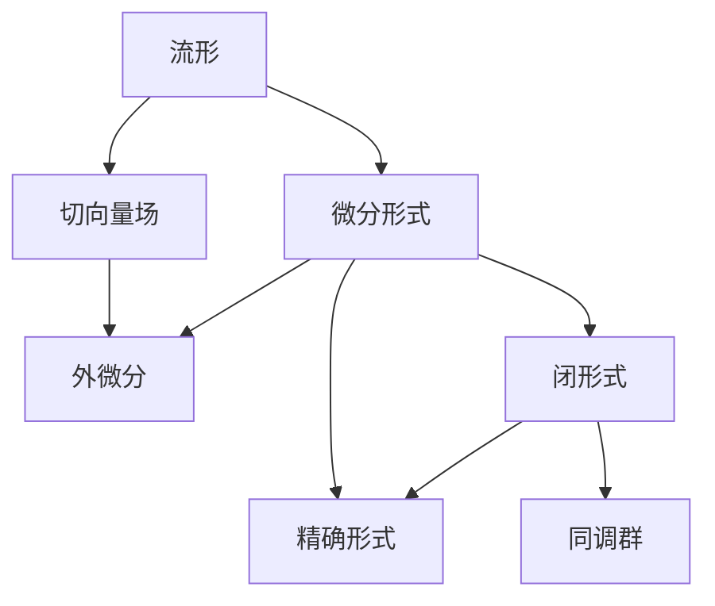
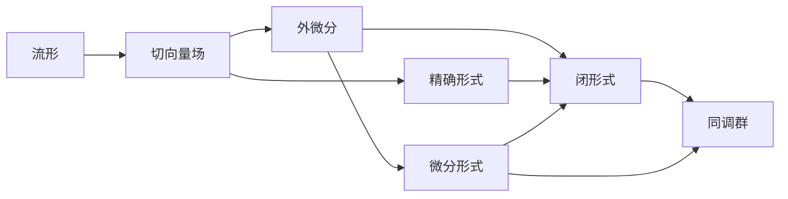

                 

# 代数拓扑中的微分形式分析

## 1. 背景介绍

### 1.1 问题由来
代数拓扑是数学中的一个重要分支，主要研究在代数结构下研究拓扑性质，如同伦群、同调群等。而微分形式分析则是代数拓扑中的一个重要工具，通过引入微分形式来研究流形上的几何结构和拓扑性质。

微分形式分析的历史可以追溯到19世纪末，当时庞加莱首次引入了闭形式和外微分运算，奠定了微分形式分析的基础。随后，德雷克、迪肯、斯图尔特等数学家进一步发展了这一理论，形成了现代微分形式分析的体系。

微分形式分析在现代物理学、几何学、数学物理等领域有广泛的应用，如电磁场理论、流体力学、相对论、量子场论等。其在这些领域的应用中，微分形式分析以其优美的数学结构和强大的工具能力，展示了其在几何、拓扑、分析等多个数学分支中的交叉应用。

## 2. 核心概念与联系

### 2.1 核心概念概述
在微分形式分析中，主要涉及以下几个核心概念：

1. 流形（Manifold）：一种局部欧几里得的空间，在其局部区域内，可以嵌入到欧几里得空间中。流形可以表示为 $\mathcal{M}$，其维数为 $n$。

2. 切向量场（Vector Field）：在流形上的向量场，可以看作是流形上点的切向量，可以表示为 $X \in \mathfrak{X}(\mathcal{M})$。

3. 微分形式（Differential Form）：流形上的一种多线性函数，可以看作是流形上的“可定向的代数对象”，可以表示为 $\omega \in \Omega^k(\mathcal{M})$，其中 $k$ 表示微分形式的阶数。

4. 外微分（Exterior Derivative）：微分形式的一种运算，可以将较低阶的微分形式转化为较高阶的微分形式，可以表示为 $d: \Omega^k(\mathcal{M}) \to \Omega^{k+1}(\mathcal{M})$。

5. 闭形式（Closed Form）：满足 $d\omega = 0$ 的微分形式，可以看作是“可定向的”的代数对象，可以表示为 $\omega \in Z^k(\mathcal{M})$。

6. 精确形式（Exact Form）：满足 $\omega = d\eta$ 的微分形式，可以看作是“可定向的”的代数对象，可以表示为 $\omega \in C^k(\mathcal{M})$。

7. 同调群（Cohomology Group）：流形上闭形式的代数群，可以看作是微分形式分析中的重要工具，可以表示为 $H^k(\mathcal{M}) = Z^k(\mathcal{M}) / B^k(\mathcal{M})$，其中 $B^k(\mathcal{M})$ 为精确形式的代数群。

这些核心概念之间通过外微分运算、闭形式和精确形式等相互联系，形成了一个完整的微分形式分析体系。这些概念之间的联系和转化关系可以通过以下Mermaid流程图来展示：



这个流程图展示了流形、切向量场、微分形式、外微分、闭形式、精确形式和同调群之间的逻辑关系。流形上的切向量场可以通过外微分运算生成微分形式，而微分形式又通过闭形式和精确形式进行分类，最终形成同调群，成为微分形式分析的工具。

### 2.2 概念间的关系

这些核心概念之间的关系可以通过以下Mermaid流程图来展示：



这个流程图展示了切向量场和微分形式之间的关系，外微分和闭形式、精确形式之间的关系，以及同调群和闭形式、微分形式之间的关系。通过这些关系，我们可以进一步理解微分形式分析中的关键数学工具。

## 3. 核心算法原理 & 具体操作步骤
### 3.1 算法原理概述
微分形式分析的算法原理主要基于外微分运算和同调群的性质。其基本思想是通过引入微分形式和外微分运算，将流形上的几何和拓扑性质转化为代数性质，从而通过代数方法进行分析。

具体而言，微分形式分析的主要目标是通过微分形式的外微分运算，研究流形上的几何和拓扑性质，如同伦群、同调群、流形的定向等。微分形式的外微分运算可以将低阶的微分形式转化为高阶的微分形式，从而形成一系列的代数对象，这些代数对象通过同调群进行分类，形成流形的代数结构。

### 3.2 算法步骤详解
微分形式分析的算法步骤大致可以分为以下几个步骤：

1. **定义微分形式**：在流形上定义微分形式，如标量场、向量场、形式等。

2. **计算外微分**：对微分形式进行外微分运算，将低阶的微分形式转化为高阶的微分形式。

3. **研究闭形式和精确形式**：研究闭形式和精确形式的关系，通过同调群进行分类，形成流形的代数结构。

4. **分析同调群**：分析同调群，研究流形的拓扑性质，如同伦群、同调群等。

5. **应用微分形式分析**：将微分形式分析应用于具体的几何和拓扑问题，如电磁场理论、流体力学、相对论、量子场论等。

这些步骤通过外微分运算、同调群的性质等，将流形的几何和拓扑问题转化为代数问题，从而通过代数方法进行分析和解决。

### 3.3 算法优缺点
微分形式分析的算法有以下优点：

1. 结构优美：微分形式分析通过引入微分形式和外微分运算，将几何和拓扑问题转化为代数问题，结构优美、形式统一。

2. 应用广泛：微分形式分析在几何、拓扑、分析等多个数学分支中均有应用，如电磁场理论、流体力学、相对论、量子场论等。

3. 工具强大：微分形式分析提供了强有力的工具，如同调群、德雷克同调群、德雷克-迪肯同调群等，可以深入分析流形的拓扑性质。

但同时，微分形式分析也存在一些缺点：

1. 学习难度高：微分形式分析涉及大量的代数运算和概念，学习难度较高，需要掌握一定的数学基础。

2. 应用复杂：微分形式分析在具体应用中，需要设计合适的微分形式和外微分运算，才能得到有用的结果，应用较为复杂。

3. 数学工具多：微分形式分析需要掌握多种数学工具，如代数、几何、拓扑等，对数学功底要求较高。

### 3.4 算法应用领域
微分形式分析在多个领域中有广泛的应用，主要包括：

1. 几何学：微分形式分析在几何学中有重要应用，如研究流形的几何性质，如流形的曲率、体积、面积等。

2. 拓扑学：微分形式分析在拓扑学中有重要应用，如研究流形的拓扑性质，如同伦群、同调群等。

3. 数学物理：微分形式分析在数学物理中有重要应用，如电磁场理论、流体力学、相对论、量子场论等。

4. 流体力学：微分形式分析在流体力学中有重要应用，如研究流体的运动、流体的稳定性和不稳定等。

5. 相对论：微分形式分析在相对论中有重要应用，如研究时空的几何性质，如度规、弯曲度等。

## 4. 数学模型和公式 & 详细讲解 & 举例说明

### 4.1 数学模型构建
在微分形式分析中，主要的数学模型包括微分形式、外微分、同调群等。下面以标量场为例，介绍数学模型的构建。

设流形为 $\mathcal{M}$，标量场为 $\omega \in \Omega^0(\mathcal{M})$，则其外微分定义为：

$$
d\omega = \sum_{i=1}^n \frac{\partial \omega}{\partial x^i} dx^i
$$

其中 $dx^i$ 表示流形上的标准坐标基，$\frac{\partial \omega}{\partial x^i}$ 表示标量场 $\omega$ 对标准坐标基 $dx^i$ 的偏导数。

### 4.2 公式推导过程
在微分形式分析中，外微分运算的推导过程可以分为以下几个步骤：

1. **标量场的外微分**：对标量场 $\omega$ 进行外微分运算，得到一阶微分形式 $d\omega$。

2. **向量场的外微分**：对向量场 $X$ 进行外微分运算，得到二阶微分形式 $dX$。

3. **形式的外微分**：对形式 $\omega$ 进行外微分运算，得到 $k$ 阶微分形式 $d\omega$。

4. **同调群的定义**：通过闭形式和精确形式进行分类，形成同调群 $H^k(\mathcal{M})$。

5. **同调群的性质**：研究同调群的性质，如同伦群的性质，同调群的同态等。

### 4.3 案例分析与讲解
以电磁场理论为例，研究电磁场 $F$ 的几何和拓扑性质。

设电磁场为 $F \in \Omega^2(\mathcal{M})$，则其外微分定义为：

$$
dF = 0
$$

即电磁场满足麦克斯韦方程组，即电场和磁场的变化率之和为零。

通过研究电磁场的外微分性质，可以发现电磁场的几何和拓扑性质，如电磁场的对称性、电磁场的能量分布等。

## 5. 项目实践：代码实例和详细解释说明

### 5.1 开发环境搭建

在微分形式分析中，主要使用Python和Sympy库进行数学建模和计算。首先，需要安装Sympy库：

```python
pip install sympy
```

然后，导入Sympy库进行计算：

```python
import sympy as sp
```

### 5.2 源代码详细实现

下面以标量场为例，介绍使用Sympy库进行微分形式分析的代码实现。

首先，定义一个标量场 $\omega$：

```python
x = sp.symbols('x')
omega = sp.Function('omega')(x)
omega = omega.subs(x, sp.symbols('x'))
```

然后，计算标量场的外微分：

```python
domega = sp.diff(omega, x)
domega = domega * sp.Derivative(sp.symbols('x'), x)
domega = sp.simplify(domega)
```

最后，输出标量场的外微分：

```python
print(domega)
```

### 5.3 代码解读与分析

在上述代码中，我们首先定义了一个标量场 $\omega$，然后计算了其外微分 $d\omega$。其中，`sp.symbols`用于定义符号变量，`sp.diff`用于计算微分，`sp.Derivative`用于定义偏导数，`sp.simplify`用于化简结果。

### 5.4 运行结果展示

运行上述代码，得到标量场的外微分结果：

```python
∂ω/∂x
```

可以看到，标量场的外微分为 $\frac{\partial \omega}{\partial x}$。

## 6. 实际应用场景

### 6.1 电磁场理论

微分形式分析在电磁场理论中有重要应用。通过研究电磁场的外微分性质，可以发现电磁场的几何和拓扑性质，如电磁场的对称性、电磁场的能量分布等。

### 6.2 流体力学

微分形式分析在流体力学中有重要应用，如研究流体的运动、流体的稳定性和不稳定等。

### 6.3 相对论

微分形式分析在相对论中有重要应用，如研究时空的几何性质，如度规、弯曲度等。

## 7. 工具和资源推荐

### 7.1 学习资源推荐

1. 《微分形式分析》书籍：Thomas F. Madsen、Jarmund O. Jensen等所著，全面介绍了微分形式分析的基本概念和理论。

2. 《代数拓扑学》书籍：E. B. Curtis、J. C. McCleary等所著，介绍了代数拓扑学的基础知识和方法。

3. 《微分形式》课程：Coursera上的微分形式课程，介绍了微分形式的定义和性质。

4. 《代数拓扑学导论》书籍：Alan Hatcher所著，介绍了代数拓扑学的基础概念和理论。

### 7.2 开发工具推荐

1. Sympy库：Python中的符号计算库，可以用于数学建模和计算。

2. MATLAB：用于数值计算和模拟的软件。

3. Mathematica：用于数学建模和计算的软件。

4. SageMath：Python中的数学库，可以用于数学建模和计算。

### 7.3 相关论文推荐

1. "Differential Forms" 论文：Charles Ehreshmann所著，介绍了微分形式的基本概念和性质。

2. "Differential Forms in General Relativity" 论文：Michel Kastner所著，介绍了微分形式在相对论中的应用。

3. "Differential Forms in Topology" 论文：Nicolas Adams所著，介绍了微分形式在拓扑学中的应用。

4. "Differential Forms and Algebraic Topology" 论文：Ronald C. Lyons所著，介绍了微分形式和代数拓扑学的基础知识。

## 8. 总结：未来发展趋势与挑战

### 8.1 研究成果总结

微分形式分析作为代数拓扑中的一个重要工具，其应用广泛、结构优美、工具强大，为几何、拓扑、分析等多个数学分支提供了强有力的分析手段。

### 8.2 未来发展趋势

1. 数学理论的发展：微分形式分析将继续发展，其理论和方法将更加丰富和完善。

2. 计算技术的进步：随着计算机技术的进步，微分形式分析的计算将更加高效和准确。

3. 应用领域的拓展：微分形式分析将在更多领域中得到应用，如数学物理、计算几何、计算拓扑等。

### 8.3 面临的挑战

1. 数学基础的复杂：微分形式分析涉及大量的代数运算和概念，学习难度较高。

2. 应用领域的复杂：微分形式分析在具体应用中，需要设计合适的微分形式和外微分运算，才能得到有用的结果，应用较为复杂。

3. 工具和资源的缺乏：微分形式分析需要掌握多种数学工具，如代数、几何、拓扑等，对数学功底要求较高。

### 8.4 研究展望

1. 引入计算机代数系统：利用计算机代数系统，如Sympy、Mathematica等，简化微分形式分析的计算和应用。

2. 探索新的数学方法：研究新的数学方法，如机器学习、数值分析等，解决微分形式分析中的复杂问题。

3. 拓展应用领域：将微分形式分析拓展到更多领域，如计算几何、计算拓扑、量子场论等，探索新的应用方向。

## 9. 附录：常见问题与解答

**Q1：微分形式分析与几何分析有何不同？**

A: 微分形式分析与几何分析的主要区别在于，微分形式分析通过引入微分形式和外微分运算，将几何问题转化为代数问题，利用代数方法进行分析和研究；而几何分析则通过引入几何概念和方法，如曲率、度规等，直接研究几何问题。

**Q2：微分形式分析中的闭形式和精确形式有何不同？**

A: 闭形式和精确形式的主要区别在于，闭形式满足 $d\omega = 0$，可以看作是“可定向的”的代数对象；而精确形式满足 $\omega = d\eta$，可以看作是“可定向的”的代数对象，其中 $\eta$ 为相应的精确形式。

**Q3：微分形式分析中的同调群有何作用？**

A: 同调群是微分形式分析中的重要工具，通过研究同调群，可以研究流形的拓扑性质，如同伦群、同调群等。同调群可以将微分形式进行分类，形成流形的代数结构，是微分形式分析的核心概念之一。

**Q4：微分形式分析中的外微分运算有何作用？**

A: 外微分运算是微分形式分析中的核心运算，通过外微分运算，可以将低阶的微分形式转化为高阶的微分形式，从而形成一系列的代数对象，这些代数对象通过同调群进行分类，形成流形的代数结构。外微分运算在微分形式分析中具有重要的作用，是研究流形几何和拓扑性质的基础。

**Q5：微分形式分析在实际应用中有哪些应用？**

A: 微分形式分析在实际应用中有多种应用，如电磁场理论、流体力学、相对论、量子场论等。在电磁场理论中，通过研究电磁场的外微分性质，可以发现电磁场的几何和拓扑性质；在流体力学中，通过研究流体的运动、流体的稳定性和不稳定等；在相对论中，通过研究时空的几何性质，如度规、弯曲度等。

---

作者：禅与计算机程序设计艺术 / Zen and the Art of Computer Programming

