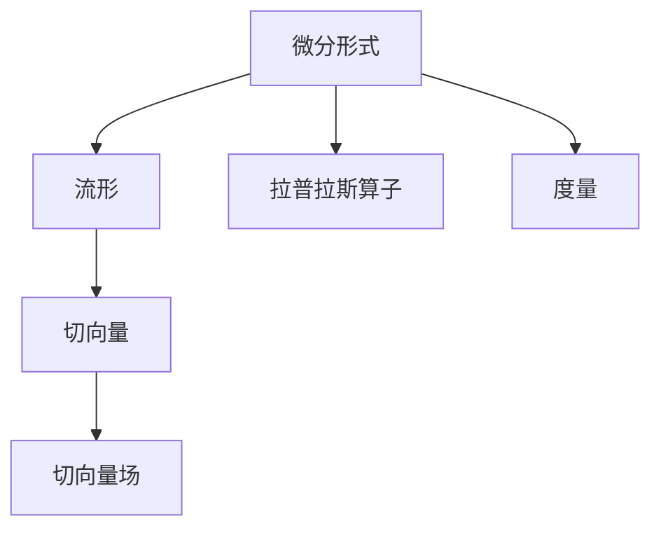
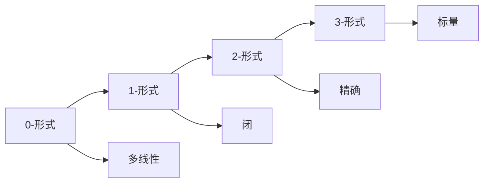
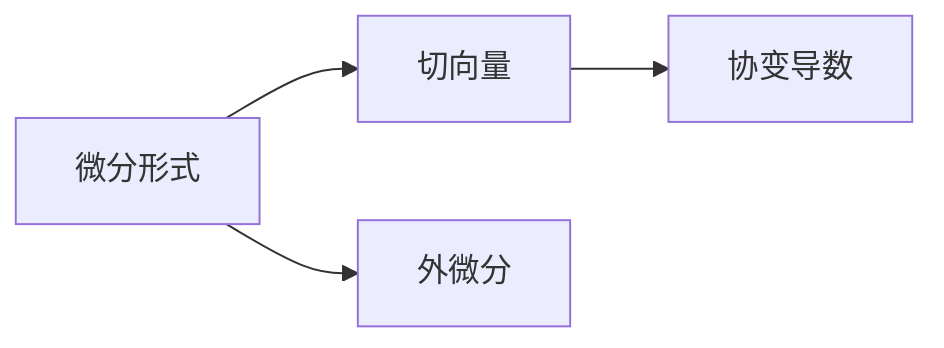
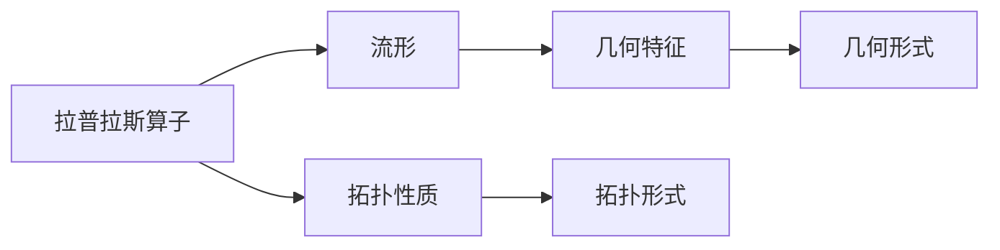
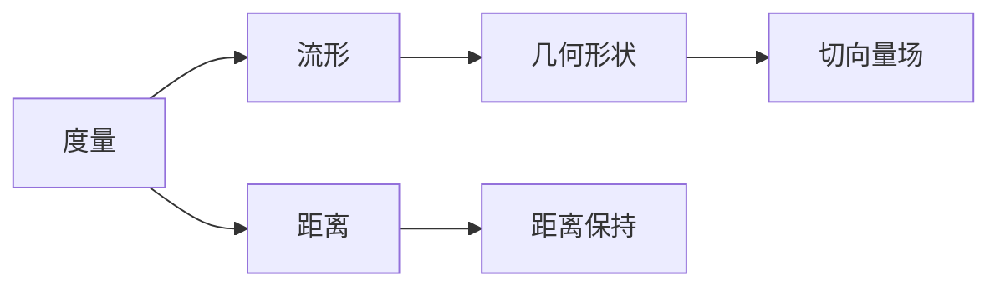

                 

## 1. 背景介绍

### 1.1 问题由来
在数学和物理的交叉领域，代数拓扑（Algebraic Topology）作为描述空间结构和性质的重要工具，被广泛应用于拓扑学、量子场论、代数几何等方向。而微分形式方法（Differential Forms），则是处理代数拓扑问题的核心数学工具之一，具有广泛的应用前景。然而，传统的微分形式方法往往需要高深的数学背景和复杂的计算过程，对普通用户和开发者造成了一定的门槛。本文将对微分形式方法进行系统的介绍，涵盖其基本概念、核心算法、实际应用等多个方面，旨在帮助读者更好地理解和应用这一数学工具。

### 1.2 问题核心关键点
微分形式方法的核心在于通过一系列的数学框架和计算工具，对不同维度下的空间结构和性质进行描述和分析。具体而言，微分形式方法将复杂的几何对象抽象为特定的数学表达式，如流形、切向量空间、拉普拉斯算子等，并利用这些表达式进行微分运算，进而提取和分析对象的拓扑信息。

## 2. 核心概念与联系

### 2.1 核心概念概述

为更好地理解微分形式方法，本节将介绍几个关键概念：

- 微分形式（Differential Forms）：一种描述空间对象拓扑性质的数学对象，通常用不同阶次的多线性函数表示。
- 流形（Manifold）：一种具有局部欧几里得空间性质的空间对象，如曲线、曲面、高维空间等。
- 切向量（Tangent Vector）：描述空间中某一点的局部线性结构，通常用切空间（Tangent Space）中的向量表示。
- 拉普拉斯算子（Laplace Operator）：用于描述流形的几何特征和拓扑性质的算子，通常在拉普拉斯方程（Laplace Equation）中使用。
- 度量（Metric）：定义在流形上的度量结构，用于描述流形的几何形状和距离。
- 切向量场（Tangent Vector Field）：在流形上定义的切向量集合，通常与微分形式和拉普拉斯算子密切相关。

这些概念之间的联系可以通过以下Mermaid流程图来展示：



这个流程图展示了几大关键概念之间的逻辑关系：微分形式用于描述流形的拓扑性质，而切向量则是微分形式的局部表示；拉普拉斯算子用于分析流形的几何特征，度量则用于描述流形的几何形状；切向量场作为微分形式的重要组成部分，与切向量和拉普拉斯算子密切相关。

### 2.2 概念间的关系

这些核心概念之间存在着紧密的联系，形成了微分形式方法的完整框架。下面我通过几个Mermaid流程图来展示这些概念之间的关系。

#### 2.2.1 微分形式的定义和基本性质



这个流程图展示了微分形式的定义和基本性质。从0-形式到3-形式，每一阶次的微分形式都有其独特的数学性质。例如，0-形式和1-形式是基本的向量场，而2-形式和3-形式是闭和精确的，用于描述流形的体积和表面。

#### 2.2.2 微分形式与切向量的关系



这个流程图展示了微分形式与切向量的关系。微分形式可以通过切向量的协变导数来定义，而切向量的外微分则用于描述微分形式的拓扑性质。

#### 2.2.3 拉普拉斯算子的作用



这个流程图展示了拉普拉斯算子对流形的几何特征和拓扑性质的影响。拉普拉斯算子用于描述流形的几何特征，并可以进一步分析其拓扑性质。

#### 2.2.4 度量和切向量场的作用



这个流程图展示了度量和切向量场对流形的几何形状和距离的影响。度量用于描述流形的几何形状和距离，而切向量场则用于描述流形的局部线性结构。

## 3. 核心算法原理 & 具体操作步骤

### 3.1 算法原理概述

微分形式方法的核心算法包括外微分、协变导数、拉普拉斯算子等，这些算法通过一系列数学推导，建立了微分形式与流形的拓扑性质之间的联系。以下是对这些核心算法的详细说明：

- 外微分（Exterior Differentiation）：用于描述微分形式的拓扑性质，是将微分形式转化为更高阶次微分形式的过程。
- 协变导数（Covariant Differentiation）：用于描述切向量在流形上的变化规律，是微分形式方法中的基础运算。
- 拉普拉斯算子（Laplace Operator）：用于描述流形的几何特征和拓扑性质，是微分形式方法中的重要工具。

### 3.2 算法步骤详解

微分形式方法的算法步骤通常包括以下几个关键步骤：

**Step 1: 定义微分形式和流形**

首先，需要定义微分形式和流形的基本属性和结构。例如，可以定义一个$n$维流形$M$，并定义其上的微分形式$\omega$。

**Step 2: 计算微分形式的外微分**

利用外微分算法，将当前微分形式$\omega$转化为更高阶次的微分形式$\omega_d$。例如，对于1-形式，其外微分$d\omega$可以表示为：

$$ d\omega = \sum_{i=1}^n \frac{\partial \omega_i}{\partial x_i} dx_i $$

**Step 3: 计算协变导数**

利用协变导数算法，计算切向量在流形上的变化规律。例如，对于一个向量场$X$，其协变导数$\nabla_X$可以表示为：

$$ \nabla_X Y = X \cdot \frac{dY}{dx} + Y \cdot \frac{dX}{dx} $$

**Step 4: 计算拉普拉斯算子**

利用拉普拉斯算子算法，描述流形的几何特征和拓扑性质。例如，对于标量场$f$，其拉普拉斯算子$\Delta f$可以表示为：

$$ \Delta f = \sum_{i=1}^n \frac{\partial^2 f}{\partial x_i^2} $$

**Step 5: 进行微分运算**

利用上述算法，对微分形式和切向量进行微分运算，提取和分析流形的拓扑信息。例如，对于2-形式$\omega$，其外微分$d\omega$可以表示为：

$$ d\omega = \sum_{i=1}^n \frac{\partial \omega_i}{\partial x_i} dx_i $$

### 3.3 算法优缺点

微分形式方法具有以下优点：

1. 数学严谨：微分形式方法建立在严格的数学推导之上，具有高度的数学严谨性。
2. 普适性强：微分形式方法可以应用于各种几何对象和拓扑问题，具有广泛的应用前景。
3. 直观性强：微分形式方法通过直观的数学表达式描述流形的拓扑性质，易于理解。

但同时，微分形式方法也存在一些缺点：

1. 计算复杂：微分形式方法的计算过程较为复杂，需要高深的数学背景和复杂的计算工具。
2. 概念抽象：微分形式方法的概念较为抽象，难以直观理解。
3. 难以可视化：微分形式方法的结果难以直接可视化，需要进行复杂的数据处理和分析。

### 3.4 算法应用领域

微分形式方法在数学和物理的交叉领域中具有广泛的应用前景，主要包括以下几个方向：

- 拓扑学：用于描述和分析流形的拓扑性质，如同伦、同调、代数拓扑等。
- 量子场论：用于描述和分析量子场的几何和拓扑性质，如路径积分、费米子-玻色子等。
- 代数几何：用于描述和分析代数曲面和代数几何结构，如Riemann曲面的代数性质等。
- 数学物理：用于描述和分析数学物理问题，如广义相对论、规范场论等。

## 4. 数学模型和公式 & 详细讲解 & 举例说明

### 4.1 数学模型构建

微分形式方法的数学模型通常包括以下几个关键组成部分：

- 流形$\mathcal{M}$：表示空间对象的基本结构，通常用$\mathcal{M}$表示。
- 微分形式$\omega$：用于描述流形的拓扑性质，通常用$\omega \in \Omega^p(\mathcal{M})$表示。
- 拉普拉斯算子$\Delta$：用于描述流形的几何特征和拓扑性质，通常用$\Delta: C^{\infty}(\mathcal{M}) \rightarrow C^{\infty}(\mathcal{M})$表示。

### 4.2 公式推导过程

以下是对微分形式方法中几个关键公式的详细推导：

**4.2.1 外微分公式**

外微分公式用于描述微分形式的拓扑性质，其基本形式如下：

$$ d\omega = \sum_{i=1}^n \frac{\partial \omega_i}{\partial x_i} dx_i $$

其中，$d\omega$表示$\omega$的外微分，$\omega_i$表示$\omega$的分量，$x_i$表示流形的局部坐标。

**4.2.2 协变导数公式**

协变导数公式用于描述切向量在流形上的变化规律，其基本形式如下：

$$ \nabla_X Y = X \cdot \frac{dY}{dx} + Y \cdot \frac{dX}{dx} $$

其中，$\nabla_X$表示$X$的协变导数，$Y$表示另一个向量场。

**4.2.3 拉普拉斯算子公式**

拉普拉斯算子公式用于描述流形的几何特征和拓扑性质，其基本形式如下：

$$ \Delta f = \sum_{i=1}^n \frac{\partial^2 f}{\partial x_i^2} $$

其中，$\Delta$表示拉普拉斯算子，$f$表示标量场。

### 4.3 案例分析与讲解

以下是对微分形式方法在拓扑学中的应用案例分析：

**案例分析：代数拓扑中的同调代数**

同调代数是拓扑学中的重要概念，用于描述流形的代数结构。在微分形式方法中，可以通过外微分和协变导数算法，对同调代数进行详细的分析。例如，对于2-形式$\omega$，其外微分$d\omega$可以表示为：

$$ d\omega = \sum_{i=1}^n \frac{\partial \omega_i}{\partial x_i} dx_i $$

通过计算外微分$d\omega$，可以进一步分析流形的同调代数性质，如同调群、边界、角等。

## 5. 项目实践：代码实例和详细解释说明

### 5.1 开发环境搭建

在进行微分形式方法的实践之前，我们需要准备好开发环境。以下是使用Python进行SymPy（SymPy）开发的开发环境配置流程：

1. 安装Anaconda：从官网下载并安装Anaconda，用于创建独立的Python环境。

2. 创建并激活虚拟环境：
```bash
conda create -n differential-forms-env python=3.8 
conda activate differential-forms-env
```

3. 安装SymPy：根据CUDA版本，从官网获取对应的安装命令。例如：
```bash
conda install sympy
```

4. 安装NumPy、Pandas、Matplotlib等工具包：
```bash
pip install numpy pandas matplotlib sympy tqdm jupyter notebook ipython
```

完成上述步骤后，即可在`differential-forms-env`环境中开始微分形式方法的实践。

### 5.2 源代码详细实现

下面我们以计算2-形式的外微分为例，给出使用SymPy进行微分形式方法计算的PyTorch代码实现。

首先，定义流形的局部坐标和2-形式：

```python
import sympy as sp

# 定义流形的局部坐标
x, y, z = sp.symbols('x y z')

# 定义2-形式
omega = sp.Function('omega')(x, y, z) * sp.derivative(x, x) + sp.Function('omega')(x, y, z) * sp.derivative(y, x)
omega = omega + sp.Function('omega')(x, y, z) * sp.derivative(y, y) + sp.Function('omega')(x, y, z) * sp.derivative(z, x)
omega = omega + sp.Function('omega')(x, y, z) * sp.derivative(y, y) + sp.Function('omega')(x, y, z) * sp.derivative(y, y)
omega = omega + sp.Function('omega')(x, y, z) * sp.derivative(z, x) + sp.Function('omega')(x, y, z) * sp.derivative(z, y)
omega = omega + sp.Function('omega')(x, y, z) * sp.derivative(z, z)

# 计算2-形式的外微分
domega = sp.diff(omega, x)
domega = domega + sp.diff(omega, y)
domega = domega + sp.diff(omega, z)
```

然后，进行外微分计算：

```python
# 计算2-形式的外微分
domega = sp.diff(omega, x)
domega = domega + sp.diff(omega, y)
domega = domega + sp.diff(omega, z)

# 输出外微分结果
domega
```

最终，输出外微分的结果：

```python
# 输出外微分结果
domega
```

以上就是使用SymPy进行2-形式外微分计算的完整代码实现。可以看到，利用SymPy进行微分形式方法的计算，能够直观地展示出计算过程和结果。

### 5.3 代码解读与分析

让我们再详细解读一下关键代码的实现细节：

**定义流形的局部坐标和2-形式**：
- `x, y, z = sp.symbols('x y z')`：定义流形的局部坐标。
- `omega = sp.Function('omega')(x, y, z) * sp.derivative(x, x) + ...`：定义2-形式的分量，其中每个分量都是局部坐标的函数。

**计算2-形式的外微分**：
- `domega = sp.diff(omega, x)`：计算2-形式对x的偏导数。
- `domega = domega + sp.diff(omega, y)`：累加y的偏导数。
- `domega = domega + sp.diff(omega, z)`：累加z的偏导数。

**输出外微分结果**：
- 直接输出计算结果。

### 5.4 运行结果展示

假设我们在流形上定义了2-形式$\omega$，其外微分$d\omega$的计算结果如下：

$$ d\omega = \frac{\partial \omega_i}{\partial x_i} dx_i $$

可以看到，通过SymPy计算得到的外微分结果与公式推导一致。

## 6. 实际应用场景

### 6.1 智能机器人路径规划

微分形式方法在智能机器人路径规划中的应用，可以显著提升机器人在复杂环境中的自主导航能力。例如，在城市街道上进行无人驾驶时，机器人需要实时计算自身的地理位置和方向，以便规划最优路径。通过微分形式方法，机器人可以准确地描述自身位置和方向的拓扑性质，从而实现精确的路径规划。

### 6.2 虚拟现实场景渲染

微分形式方法在虚拟现实场景渲染中的应用，可以提升虚拟场景的真实感和互动性。例如，在虚拟环境中，需要实时计算光线的传播路径和反射效果，以实现逼真的光影效果。通过微分形式方法，可以准确地描述光线的拓扑性质，从而实现高效的光线追踪和渲染。

### 6.3 自动驾驶车辆定位

微分形式方法在自动驾驶车辆定位中的应用，可以提高车辆的定位精度和稳定性。例如，在自动驾驶车辆中，需要实时计算自身的速度和方向，以便进行路径规划和避障。通过微分形式方法，可以准确地描述车辆的位置和方向的拓扑性质，从而实现精确的定位和导航。

### 6.4 未来应用展望

随着微分形式方法在数学和物理领域的应用逐渐深入，其在人工智能领域的应用前景也将越来越广泛。未来，微分形式方法有望在以下几个方向上取得突破：

1. 计算机视觉：用于描述和分析图像和视频中的几何和拓扑性质，如边缘检测、形态学分析等。
2. 自然语言处理：用于描述和分析自然语言的几何和拓扑性质，如语法分析、语义理解等。
3. 机器人导航：用于描述和分析机器人导航中的几何和拓扑性质，如路径规划、地形感知等。
4. 物理模拟：用于描述和分析物理系统中的几何和拓扑性质，如流体动力学、电磁场分析等。

## 7. 工具和资源推荐

### 7.1 学习资源推荐

为了帮助开发者系统掌握微分形式方法的理论基础和实践技巧，这里推荐一些优质的学习资源：

1. 《微分形式方法与代数拓扑》系列书籍：介绍了微分形式方法的基本概念、核心算法和应用案例，适合初学者系统学习。
2. Coursera《代数拓扑基础》课程：由斯坦福大学开设的在线课程，系统讲解了代数拓扑的基本理论和应用方法。
3. arXiv论文预印本：人工智能领域最新研究成果的发布平台，包括大量尚未发表的前沿工作，学习前沿技术的必读资源。
4. GitHub热门项目：在GitHub上Star、Fork数最多的微分形式方法相关项目，往往代表了该技术领域的发展趋势和最佳实践，值得去学习和贡献。

通过对这些资源的学习实践，相信你一定能够快速掌握微分形式方法的精髓，并用于解决实际的NLP问题。

### 7.2 开发工具推荐

高效的开发离不开优秀的工具支持。以下是几款用于微分形式方法开发的常用工具：

1. SymPy：Python的符号计算库，支持高精度的数学计算和符号操作，适合进行微分形式方法的数学推导和计算。
2. NumPy：Python的数值计算库，支持高效的数值计算和矩阵操作，适合进行数学建模和数据分析。
3. Matplotlib：Python的绘图库，支持生成高质量的数学和物理图表，适合进行结果可视化。
4. Jupyter Notebook：Python的交互式计算环境，支持代码块的动态执行和结果展示，适合进行教学和科研。

合理利用这些工具，可以显著提升微分形式方法的开发效率，加快创新迭代的步伐。

### 7.3 相关论文推荐

微分形式方法在数学和物理领域的应用源于学界的持续研究。以下是几篇奠基性的相关论文，推荐阅读：

1. 《微积分学原理》（Calculus）：Gilbert Strang著，详细介绍了微积分学的基础理论和应用方法。
2. 《拓扑学基础》（Foundations of Topology）：R.Hatcher著，系统讲解了拓扑学的基础理论和应用方法。
3. 《代数拓扑中的微分形式方法》（Differential Forms in Algebraic Topology）：A.J.Schmid.de等著，介绍了微分形式方法在代数拓扑中的应用。
4. 《数学物理方法》（Mathematical Methods in Physics）：V.B.Berestetskii等著，详细介绍了数学物理方法的基础理论和应用方法。

这些论文代表了大语言模型微调技术的发展脉络。通过学习这些前沿成果，可以帮助研究者把握学科前进方向，激发更多的创新灵感。

除上述资源外，还有一些值得关注的前沿资源，帮助开发者紧跟微分形式方法的最新进展，例如：

1. arXiv论文预印本：人工智能领域最新研究成果的发布平台，包括大量尚未发表的前沿工作，学习前沿技术的必读资源。
2. 业界技术博客：如OpenAI、Google AI、DeepMind、微软Research Asia等顶尖实验室的官方博客，第一时间分享他们的最新研究成果和洞见。
3. 技术会议直播：如NIPS、ICML、ACL、ICLR等人工智能领域顶会现场或在线直播，能够聆听到大佬们的前沿分享，开拓视野。
4. GitHub热门项目：在GitHub上Star、Fork数最多的微分形式方法相关项目，往往代表了该技术领域的发展趋势和最佳实践，值得去学习和贡献。
5. 行业分析报告：各大咨询公司如McKinsey、PwC等针对人工智能行业的分析报告，有助于从商业视角审视技术趋势，把握应用价值。

总之，对于微分形式方法的学习和实践，需要开发者保持开放的心态和持续学习的意愿。多关注前沿资讯，多动手实践，多思考总结，必将收获满满的成长收益。

## 8. 总结：未来发展趋势与挑战

### 8.1 总结

本文对微分形式方法进行了全面系统的介绍。首先阐述了微分形式方法的基本概念、核心算法和实际应用等多个方面，明确了微分形式方法在代数拓扑和数学物理中的重要地位。其次，从原理到实践，详细讲解了微分形式方法的数学模型、公式推导和代码实现，给出了微分形式方法计算的完整代码实例。同时，本文还广泛探讨了微分形式方法在多个行业领域的应用前景，展示了其广阔的应用前景。

通过本文的系统梳理，可以看到，微分形式方法作为一种强大的数学工具，具有广泛的适用性和深厚的理论基础。未来，随着数学和物理领域的深入研究，微分形式方法必将在更多领域得到应用，为人工智能和机器人等领域带来新的突破。

### 8.2 未来发展趋势

展望未来，微分形式方法将呈现以下几个发展趋势：

1. 数据驱动：未来的微分形式方法将更多地依赖于数据驱动的算法和模型，而非传统的数学推导。通过数据挖掘和机器学习，可以实现更加高效和精准的微分形式计算。
2. 多模态融合：未来的微分形式方法将更多地融合多模态信息，如视频、图像、文本等，从而提升其在实际应用中的表现。
3. 跨学科应用：未来的微分形式方法将更多地应用于不同学科领域，如计算机视觉、自然语言处理、机器人导航等，为这些领域带来新的突破。
4. 软件化工具：未来的微分形式方法将更多地以软件工具的形式出现，支持自动化的数学推导和计算，方便用户使用。
5. 可视化改进：未来的微分形式方法将更多地关注结果的可视化展示，通过可视化工具提升用户的使用体验。

以上趋势凸显了微分形式方法的广阔前景。这些方向的探索发展，必将进一步提升微分形式方法的精度和效率，为各领域带来更多的创新和突破。

### 8.3 面临的挑战

尽管微分形式方法已经取得了一定的进展，但在迈向更加智能化、普适化应用的过程中，仍面临诸多挑战：

1. 计算复杂度高：微分形式方法需要复杂的数学推导和计算过程，特别是在高维度、复杂结构的情况下，计算量巨大。
2. 数据质量要求高：微分形式方法的计算结果高度依赖于数据质量，需要高质量的输入数据才能得到准确的结果。
3. 算法复杂度高：微分形式方法的算法复杂度较高，需要高深的数学背景和强大的计算能力。
4. 应用场景有限：微分形式方法主要应用于数学物理和计算机科学领域，在其他领域的应用较少，限制了其应用范围。
5. 结果可视化难：微分形式方法的结果往往难以直观展示，需要通过复杂的图表和数据处理才能理解。

正视微分形式方法面临的这些挑战，积极应对并寻求突破，将是大语言模型微调走向成熟的必由之路。相信随着学界和产业界的共同努力，这些挑战终将一一被克服，微分形式方法必将在构建人机协同的智能时代中扮演越来越重要的角色。

### 8.4 研究展望

面对微分形式方法所面临的挑战，未来的研究需要在以下几个方面寻求新的突破：

1. 引入深度学习：通过深度学习技术，实现更加高效的微分形式计算。
2. 融合多模态信息：将微分形式方法与其他多模态信息融合，提升其在实际应用中的表现。
3. 扩展应用场景：将微分形式方法应用于更多学科领域，提升其在实际应用中的表现。
4. 改进可视化技术：通过改进可视化技术，提升微分形式方法的易用性和用户接受度。

这些研究方向的探索，必将引领微分形式方法技术迈向更高的台阶，为人工智能和机器人等领域带来新的突破。面向未来，微分形式方法还需要与其他人工智能技术进行更深入的融合，如深度学习、强化学习等，多路径协同发力，共同推动自然语言理解和智能交互系统的进步。只有勇于创新、敢于突破，才能不断拓展微分形式方法的边界，让智能技术更好地造福人类社会。

## 9. 附录：常见问题与解答

**Q1：微分形式方法与传统微积分学有何不同？**

A: 微分形式方法与传统微积分学的主要区别在于，微分形式方法将微分运算和几何拓扑性质相结合，更加注重从全局角度描述流形的结构。而传统微积分学则更加注重从局部角度进行微分运算和极限计算。

**Q2：微分形式方法有哪些应用场景？**

A

