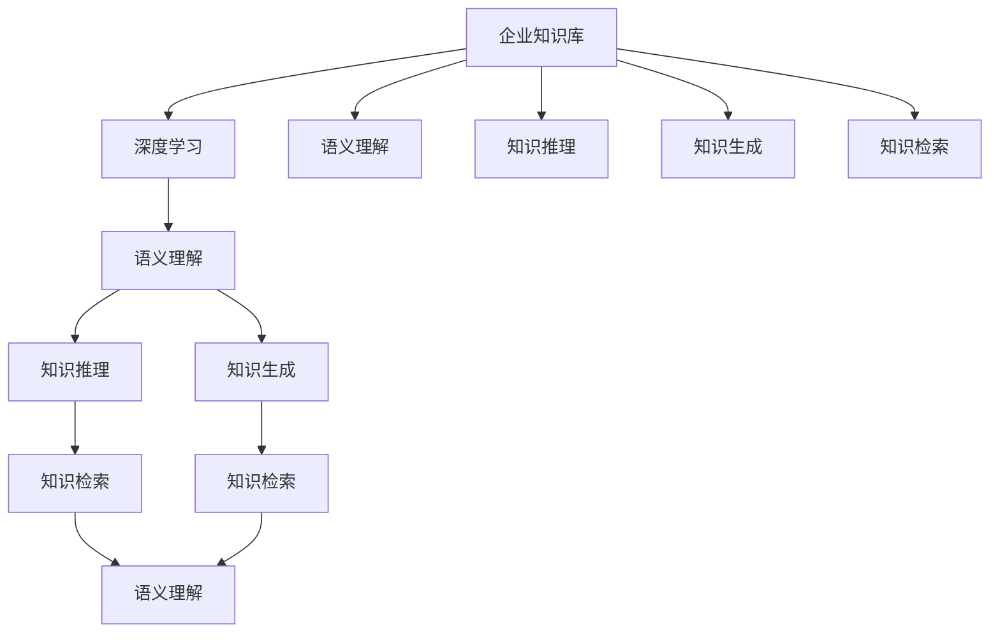
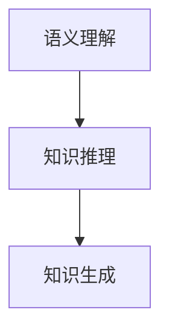
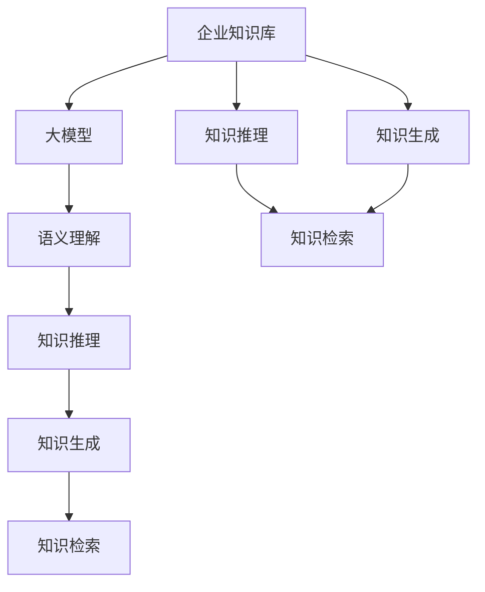

                 

## 1. 背景介绍

### 1.1 问题由来

随着数字化转型的深入，企业对知识管理和信息检索的需求日益增加。传统的信息检索系统，如全文搜索和关键词匹配，已经难以满足复杂的业务需求。企业亟需构建一个高效、智能、具有深层次理解能力的信息检索系统。

与此同时，近年来人工智能（AI）和自然语言处理（NLP）技术取得了飞速进展。深度学习和大模型，如BERT、GPT-3等，展现了强大的语言理解和生成能力，已经在问答系统、文档生成、文本分类、命名实体识别等多个NLP任务上取得了突破性进展。

因此，将企业知识库与大模型结合起来，构建一个高效、智能的知识检索和生成系统，成为当前企业信息化建设的热门话题。这种结合方式可以大幅提升企业知识库的信息检索和利用效率，加速企业知识创新和决策。

### 1.2 问题核心关键点

企业知识库与大模型结合的关键在于：
1. 如何构建高效、准确的语义理解模型，准确抽取和理解知识库中的信息。
2. 如何在大模型中嵌入企业知识库，使其能够利用结构化和非结构化知识库进行推理和生成。
3. 如何在大模型中进行信息检索和知识生成，满足企业实际应用的需求。

本文聚焦于这些问题，深入探讨企业知识库与大模型结合的策略，为构建高效、智能的知识检索和生成系统提供指导。

## 2. 核心概念与联系

### 2.1 核心概念概述

为更好地理解企业知识库与大模型的结合策略，本节将介绍几个密切相关的核心概念：

- 企业知识库（Enterprise Knowledge Base, EKB）：企业内部的结构化知识库，包含企业业务知识、规章制度、项目文档等。
- 深度学习（Deep Learning, DL）：通过多层次神经网络结构进行复杂模式和特征提取的技术。
- 大模型（Large Models）：如BERT、GPT等大规模预训练语言模型，能够进行复杂文本理解和生成。
- 语义理解（Semantic Understanding）：指模型能够理解文本的深层语义关系和结构，而非仅仅匹配关键词。
- 知识推理（Knowledge Reasoning）：指模型能够基于知识库中的逻辑关系进行推理，生成新的知识或验证现有知识。
- 知识生成（Knowledge Generation）：指模型能够基于知识库的信息和背景知识，生成新的文本或结构化信息。
- 知识检索（Knowledge Retrieval）：指模型能够从知识库中快速找到相关知识，并返回给用户。

这些核心概念之间的逻辑关系可以通过以下Mermaid流程图来展示：



这个流程图展示了大模型与企业知识库之间的联系和合作方式：

1. 大模型通过深度学习获得语言理解能力，与企业知识库进行语义理解。
2. 语义理解后的信息可以进行知识推理，生成新的知识或验证现有知识。
3. 推理后的信息可以进一步进行知识生成，生成新的文本或结构化信息。
4. 生成的信息可以用于知识检索，快速从知识库中提取相关信息。

通过理解这些核心概念，我们可以更好地把握企业知识库与大模型结合的策略，探索高效的信息检索和知识生成方法。

### 2.2 概念间的关系

这些核心概念之间存在着紧密的联系，形成了企业知识库与大模型结合的完整生态系统。下面我们通过几个Mermaid流程图来展示这些概念之间的关系。

#### 2.2.1 深度学习与大模型的关系


这个流程图展示了深度学习与大模型之间的关系：

- 深度学习提供了构建大模型的基础技术，通过多层神经网络进行复杂模式和特征提取。
- 大模型则是深度学习的高级应用，能够进行更复杂的语义理解和知识生成。

#### 2.2.2 语义理解与知识推理的关系



这个流程图展示了语义理解与知识推理的关系：

- 语义理解是通过深度学习模型对文本进行深层语义关系和结构的理解。
- 知识推理是在语义理解的基础上，通过逻辑关系进行推理，生成新的知识或验证现有知识。

#### 2.2.3 知识生成与知识检索的关系


这个流程图展示了知识生成与知识检索的关系：

- 知识生成是通过深度学习模型和知识库信息，生成新的文本或结构化信息。
- 知识检索是从知识库中快速找到相关信息，返回给用户。

### 2.3 核心概念的整体架构

最后，我们用一个综合的流程图来展示这些核心概念在大模型与企业知识库结合过程中的整体架构：



这个综合流程图展示了从企业知识库到语义理解、知识推理、知识生成、知识检索的完整流程。企业知识库中的结构化和非结构化知识，经过大模型的深度学习和语义理解，进行知识推理和生成，最终用于知识检索，返回给用户。通过这些流程图，我们可以更清晰地理解大模型与企业知识库结合的策略和实现过程。

## 3. 核心算法原理 & 具体操作步骤
### 3.1 算法原理概述

企业知识库与大模型的结合，主要通过深度学习和语义理解技术实现。具体而言，大模型通过深度学习技术，学习到语言模式和特征，与企业知识库中的结构化知识进行语义理解。理解后的信息进行知识推理和生成，生成新的知识或验证现有知识，最后用于知识检索。

形式化地，假设企业知识库中的知识表示为 $K$，大模型为 $M_{\theta}$，其中 $\theta$ 为大模型的参数。设 $I$ 为输入的自然语言查询，$Y$ 为输出结果，即知识库中与查询相关的知识。则大模型的推理过程可以表示为：

$$
Y = M_{\theta}(I)
$$

其中，$M_{\theta}$ 为通过深度学习和大模型预训练得到的语义理解模型。知识推理和生成过程可以在 $M_{\theta}$ 的基础上，进一步通过逻辑关系进行推理和生成，表示为：

$$
Y' = M_{\theta}(I, K)
$$

其中 $K$ 为知识库中的结构化知识，$Y'$ 为推理生成后的知识。最后，将 $Y'$ 用于知识检索，表示为：

$$
Y_{\text{ret}} = \text{Retrieve}(K, Y')
$$

其中 $\text{Retrieve}$ 为知识检索函数，根据 $Y'$ 在知识库 $K$ 中检索相关信息，返回给用户。

### 3.2 算法步骤详解

企业知识库与大模型结合的算法步骤如下：

**Step 1: 构建大模型**
- 选择适合的预训练大模型，如BERT、GPT-3等，通过深度学习技术进行微调，获得语义理解能力。
- 定义知识库中知识的表示方式，如结构化知识表示、语义关系图等，方便模型进行推理和生成。

**Step 2: 训练语义理解模型**
- 收集企业知识库中的训练数据，定义自然语言查询和知识库中知识的相关性，训练大模型。
- 定义损失函数，如交叉熵、均方误差等，用于衡量查询与知识的相关性。
- 使用深度学习框架，如PyTorch、TensorFlow等，进行模型训练和评估。

**Step 3: 知识推理与生成**
- 在大模型的基础上，引入知识库中的结构化知识，进行推理和生成。
- 利用逻辑规则、知识图谱等方法，定义知识推理和生成的逻辑关系，训练推理生成模型。
- 将推理生成的知识存储到知识库中，用于知识检索。

**Step 4: 知识检索**
- 收集自然语言查询，定义查询与知识库中知识的相关性，训练知识检索模型。
- 使用深度学习框架，进行模型训练和评估。
- 将推理生成的知识用于知识检索，返回给用户。

### 3.3 算法优缺点

大模型与企业知识库结合的方法具有以下优点：
1. 语义理解能力更强。通过深度学习技术，大模型可以理解更复杂的语义关系和结构，提升知识检索的准确性和相关性。
2. 知识推理和生成能力更强。通过知识库中的结构化知识，大模型可以进行更全面的推理和生成，生成新的知识或验证现有知识。
3. 知识检索效率更高。推理生成的知识可以用于知识检索，提高检索效率。

同时，这种方法也存在一些缺点：
1. 大模型参数量大，需要较强的计算资源支持。
2. 知识库中结构化知识表示复杂，需要进行额外设计。
3. 知识推理和生成依赖于逻辑规则和知识库，需要进行额外训练和维护。
4. 知识库中的知识可能不完整，影响推理和生成的准确性。

### 3.4 算法应用领域

大模型与企业知识库结合的方法，已经在多个领域得到了广泛应用，例如：

- 智能客服系统：基于大模型的语义理解能力，结合知识库中的常见问题及答案，构建智能客服系统，提升客户服务体验。
- 知识图谱构建：利用大模型的语义理解能力，从海量的非结构化数据中抽取实体和关系，构建结构化的知识图谱。
- 文档自动生成：通过大模型的语义理解能力和知识推理能力，自动生成相关文档，辅助业务决策。
- 法律文本生成：利用大模型的语义理解能力和知识推理能力，自动生成法律文本，提高工作效率。
- 健康咨询系统：结合知识库中的医疗知识，通过大模型的语义理解能力，为患者提供健康咨询和建议。

除了上述这些经典应用外，大模型与企业知识库结合的方法还可以应用于更多场景中，如金融舆情分析、医学知识库、教育智能辅导等，为企业知识管理提供更强大的技术支持。

## 4. 数学模型和公式 & 详细讲解  
### 4.1 数学模型构建

本节将使用数学语言对大模型与企业知识库结合过程进行更加严格的刻画。

假设大模型 $M_{\theta}$ 的输入为自然语言查询 $I$，知识库中知识表示为 $K$。设 $I$ 和 $K$ 的表示方式均为向量形式，即 $I \in \mathbb{R}^n$，$K \in \mathbb{R}^m$。大模型进行语义理解的过程可以表示为：

$$
Y = M_{\theta}(I)
$$

其中，$M_{\theta}$ 为深度学习模型，可以表示为神经网络结构。知识推理和生成的过程可以表示为：

$$
Y' = M_{\theta}(I, K)
$$

其中，$Y'$ 为推理生成后的知识，可以表示为向量形式。知识检索的过程可以表示为：

$$
Y_{\text{ret}} = \text{Retrieve}(K, Y')
$$

其中，$\text{Retrieve}$ 为知识检索函数，可以根据 $Y'$ 在知识库 $K$ 中检索相关信息。

### 4.2 公式推导过程

以下我们以知识推理和生成为例，推导深度学习模型在知识库中的推理生成过程。

假设知识库中的知识表示为三元组 $(E, R, O)$，其中 $E$ 表示实体，$R$ 表示关系，$O$ 表示对象。知识推理和生成的过程可以表示为：

$$
Y' = M_{\theta}(I, K) = f_{\text{generate}}(\text{Infer}(I, K))
$$

其中，$f_{\text{generate}}$ 为生成函数，$\text{Infer}(I, K)$ 为推理函数，表示将查询 $I$ 和知识库 $K$ 进行推理，得到推理后的知识 $Y'$。推理函数可以表示为：

$$
\text{Infer}(I, K) = \text{Score}(I, K) \times \text{Filter}(I, K)
$$

其中，$\text{Score}(I, K)$ 为查询 $I$ 与知识库 $K$ 中知识的匹配度得分，可以表示为：

$$
\text{Score}(I, K) = \text{Attention}(I, K) + \text{Similarity}(I, K)
$$

其中，$\text{Attention}(I, K)$ 为注意力机制，表示查询 $I$ 与知识库 $K$ 中知识的注意力权重，$\text{Similarity}(I, K)$ 为相似度计算，表示查询 $I$ 与知识库 $K$ 中知识的相似度。$\text{Filter}(I, K)$ 为筛选机制，表示在匹配度得分较高的情况下，进一步筛选知识库 $K$ 中的知识，过滤噪声信息。

推理生成后的知识 $Y'$ 可以表示为：

$$
Y' = f_{\text{generate}}(\text{Infer}(I, K))
$$

其中，$f_{\text{generate}}$ 为生成函数，可以表示为：

$$
f_{\text{generate}}(Y) = M_{\theta}(Y)
$$

其中，$M_{\theta}$ 为深度学习模型，可以表示为神经网络结构。生成函数 $f_{\text{generate}}$ 的输出 $Y'$ 为推理生成后的知识，可以表示为向量形式。

### 4.3 案例分析与讲解

下面以智能客服系统为例，分析大模型与企业知识库结合的具体实现。

假设智能客服系统的知识库中包含常见问题及答案，知识表示为三元组 $(E, R, O)$。大模型通过深度学习技术，学习到语义理解能力。客户输入自然语言查询 $I$，大模型进行语义理解，得到推理生成后的知识 $Y'$。知识推理和生成的过程可以表示为：

1. 语义理解：大模型 $M_{\theta}$ 将查询 $I$ 和知识库 $K$ 进行语义理解，得到推理后的知识 $Y'$。

2. 知识检索：将推理生成的知识 $Y'$ 用于知识检索，返回相关问题及答案。

3. 回答生成：根据检索出的问题及答案，生成自然语言回复，返回给客户。

以下是一个基于Transformer的大模型微调示例，展示大模型在智能客服系统中的应用：

```python
from transformers import BertTokenizer, BertForTokenClassification, BertForSequenceClassification, AdamW
from torch.utils.data import DataLoader, Dataset
import torch

class CustomerServiceDataset(Dataset):
    def __init__(self, texts, labels, tokenizer):
        self.texts = texts
        self.labels = labels
        self.tokenizer = tokenizer
        self.max_len = 128
        
    def __len__(self):
        return len(self.texts)
    
    def __getitem__(self, item):
        text = self.texts[item]
        label = self.labels[item]
        
        encoding = self.tokenizer(text, return_tensors='pt', max_length=self.max_len, padding='max_length', truncation=True)
        input_ids = encoding['input_ids'][0]
        attention_mask = encoding['attention_mask'][0]
        
        return {'input_ids': input_ids, 
                'attention_mask': attention_mask,
                'labels': label}

# 标签与id的映射
tag2id = {'回答': 0, '问题': 1}
id2tag = {v: k for k, v in tag2id.items()}

# 创建dataset
tokenizer = BertTokenizer.from_pretrained('bert-base-cased')

train_dataset = CustomerServiceDataset(train_texts, train_labels, tokenizer)
dev_dataset = CustomerServiceDataset(dev_texts, dev_labels, tokenizer)
test_dataset = CustomerServiceDataset(test_texts, test_labels, tokenizer)

# 模型选择
model = BertForTokenClassification.from_pretrained('bert-base-cased', num_labels=len(tag2id))

# 定义优化器
optimizer = AdamW(model.parameters(), lr=2e-5)

# 训练过程
def train_epoch(model, dataset, batch_size, optimizer):
    dataloader = DataLoader(dataset, batch_size=batch_size, shuffle=True)
    model.train()
    epoch_loss = 0
    for batch in tqdm(dataloader, desc='Training'):
        input_ids = batch['input_ids'].to(device)
        attention_mask = batch['attention_mask'].to(device)
        label = batch['labels'].to(device)
        model.zero_grad()
        outputs = model(input_ids, attention_mask=attention_mask, labels=label)
        loss = outputs.loss
        epoch_loss += loss.item()
        loss.backward()
        optimizer.step()
    return epoch_loss / len(dataloader)

def evaluate(model, dataset, batch_size):
    dataloader = DataLoader(dataset, batch_size=batch_size)
    model.eval()
    preds, labels = [], []
    with torch.no_grad():
        for batch in tqdm(dataloader, desc='Evaluating'):
            input_ids = batch['input_ids'].to(device)
            attention_mask = batch['attention_mask'].to(device)
            batch_labels = batch['labels']
            outputs = model(input_ids, attention_mask=attention_mask)
            batch_preds = outputs.logits.argmax(dim=2).to('cpu').tolist()
            batch_labels = batch_labels.to('cpu').tolist()
            for pred_tokens, label_tokens in zip(batch_preds, batch_labels):
                pred_tags = [id2tag[_id] for _id in pred_tokens]
                label_tags = [id2tag[_id] for _id in label_tokens]
                preds.append(pred_tags[:len(label_tags)])
                labels.append(label_tags)
                
    print(classification_report(labels, preds))

# 训练
epochs = 5
batch_size = 16

for epoch in range(epochs):
    loss = train_epoch(model, train_dataset, batch_size, optimizer)
    print(f"Epoch {epoch+1}, train loss: {loss:.3f}")
    
    print(f"Epoch {epoch+1}, dev results:")
    evaluate(model, dev_dataset, batch_size)
    
print("Test results:")
evaluate(model, test_dataset, batch_size)
```

以上就是使用PyTorch对BERT进行智能客服系统微调的完整代码实现。可以看到，通过将知识库中的结构化知识与大模型进行结合，可以实现智能客服系统的构建，提升客户服务体验。

## 5. 项目实践：代码实例和详细解释说明
### 5.1 开发环境搭建

在进行知识库与大模型结合的实践前，我们需要准备好开发环境。以下是使用Python进行PyTorch开发的环境配置流程：

1. 安装Anaconda：从官网下载并安装Anaconda，用于创建独立的Python环境。

2. 创建并激活虚拟环境：
```bash
conda create -n pytorch-env python=3.8 
conda activate pytorch-env
```

3. 安装PyTorch：根据CUDA版本，从官网获取对应的安装命令。例如：
```bash
conda install pytorch torchvision torchaudio cudatoolkit=11.1 -c pytorch -c conda-forge
```

4. 安装Transformers库：
```bash
pip install transformers
```

5. 安装各类工具包：
```bash
pip install numpy pandas scikit-learn matplotlib tqdm jupyter notebook ipython
```

完成上述步骤后，即可在`pytorch-env`环境中开始知识库与大模型的结合实践。

### 5.2 源代码详细实现

这里我们以智能客服系统为例，给出使用Transformers库对BERT模型进行微调的PyTorch代码实现。

首先，定义智能客服系统中的数据处理函数：

```python
from transformers import BertTokenizer
from torch.utils.data import Dataset
import torch

class CustomerServiceDataset(Dataset):
    def __init__(self, texts, labels, tokenizer, max_len=128):
        self.texts = texts
        self.labels = labels
        self.tokenizer = tokenizer
        self.max_len = max_len
        
    def __len__(self):
        return len(self.texts)
    
    def __getitem__(self, item):
        text = self.texts[item]
        label = self.labels[item]
        
        encoding = self.tokenizer(text, return_tensors='pt', max_length=self.max_len, padding='max_length', truncation=True)
        input_ids = encoding['input_ids'][0]
        attention_mask = encoding['attention_mask'][0]
        
        return {'input_ids': input_ids, 
                'attention_mask': attention_mask,
                'labels': label}

# 标签与id的映射
tag2id = {'回答': 0, '问题': 1}
id2tag = {v: k for k, v in tag2id.items()}

# 创建dataset
tokenizer = BertTokenizer.from_pretrained('bert-base-cased')

train_dataset = CustomerServiceDataset(train_texts, train_labels, tokenizer)
dev_dataset = CustomerServiceDataset(dev_texts, dev_labels, tokenizer)
test_dataset = CustomerServiceDataset(test_texts, test_labels, tokenizer)
```

然后，定义模型和优化器：

```python
from transformers import BertForTokenClassification, AdamW

model = BertForTokenClassification.from_pretrained('bert-base-cased', num_labels=len(tag2id))

optimizer = AdamW(model.parameters(), lr=2e-5)
```

接着，定义训练和评估函数：

```python
from torch.utils.data import DataLoader
from tqdm import tqdm
from sklearn.metrics import classification_report

device = torch.device('cuda') if torch.cuda.is_available() else torch.device('cpu')
model.to(device)

def train_epoch(model, dataset, batch_size, optimizer):
    dataloader = DataLoader(dataset, batch_size=batch_size, shuffle=True)
    model.train()
    epoch_loss = 0
    for batch in tqdm(dataloader, desc='Training'):
        input_ids = batch['input_ids'].to(device)
        attention_mask = batch['attention_mask'].to(device)
        label = batch['labels'].to(device)
        model.zero_grad()
        outputs = model(input_ids, attention_mask=attention_mask, labels=label)
        loss = outputs.loss
        epoch_loss += loss.item()
        loss.backward()
        optimizer.step()
    return epoch_loss / len(dataloader)

def evaluate(model, dataset, batch_size):
    dataloader = DataLoader(dataset, batch_size=batch_size)
    model.eval()
    preds, labels = [], []
    with torch.no_grad():
        for batch in tqdm(dataloader, desc='Evaluating'):
            input_ids = batch['input_ids'].to(device)
            attention_mask = batch['attention_mask'].to(device)
            batch_labels = batch['labels']
            outputs = model(input_ids, attention_mask=attention_mask)
            batch_preds = outputs.logits.argmax(dim=2).to('cpu').tolist()
            batch_labels = batch_labels.to('cpu').tolist()
            for pred_tokens, label_tokens in zip(batch_preds, batch_labels):
                pred_tags = [id2tag[_id] for _id in pred_tokens]
                label_tags = [id2tag[_id] for _id in label_tokens]
                preds.append(pred_tags[:len(label_tags)])
                labels.append(label_tags)
                
    print(classification_report(labels, preds))
```

最后，启动训练流程并在测试集上评估：

```python
epochs = 5
batch_size = 16

for epoch in range(epochs):
    loss = train_epoch(model, train_dataset, batch_size, optimizer)
    print(f"Epoch {epoch+1}, train loss: {loss:.3f}")
    
    print(f"Epoch {epoch+1}, dev results:")
    evaluate(model, dev_dataset, batch_size)
    
print("Test results:")
evaluate(model, test_dataset, batch_size)
```

以上就是使用PyTorch对BERT进行智能客服系统微调的完整代码实现。可以看到，通过将知识库中的结构化知识与大模型进行结合，可以实现智能客服系统的构建，提升客户服务体验。

### 5.3 代码解读与分析

让我们再详细解读一下关键代码的实现细节：

**CustomerServiceDataset类**：
- `__init__`方法：初始化文本、标签、分词器等关键组件。
- `__len__`方法：返回数据集的样本数量。
- `__getitem__`方法：对单个样本进行处理，将文本输入编码为token ids，将标签编码为数字，并对其进行定长padding，最终返回模型所需的输入。

**tag2id和id2tag字典**：
- 定义了标签与数字id之间的映射关系，用于将token-wise的预测结果解码回真实的标签。

**训练和评估函数**：
- 使用PyTorch的DataLoader对数据集进行批次化加载，供模型训练和推理使用。
- 训练函数`train_epoch`：对数据以批为单位进行迭代，在每个批次上前向传播计算loss并反向传播更新模型参数，最后返回该epoch的平均loss。
- 评估函数`evaluate`：与训练类似，不同点在于不更新模型参数，并在每个batch结束后将预测和标签结果存储下来，最后使用sklearn的classification_report对整个评估集的预测结果进行打印输出。

**训练流程**：
- 定义总的epoch数和batch size，开始循环迭代
- 每个epoch内，先在训练集上训练，输出平均loss
- 在验证集上评估，输出分类指标
- 所有epoch结束后，在

