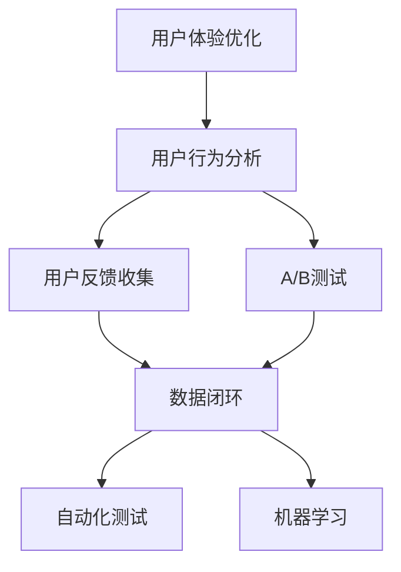
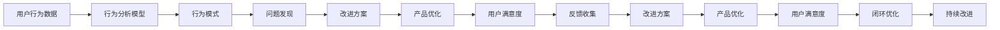
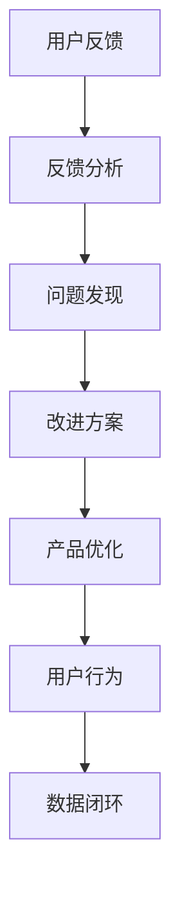
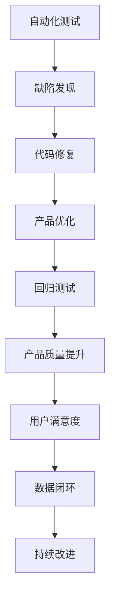
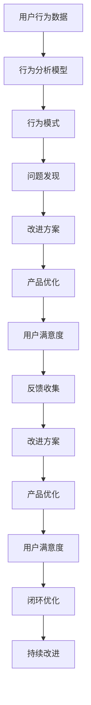

                 

## 1. 背景介绍

### 1.1 问题由来
在数字化转型加速的今天，企业对数字化的重视程度日益提升，从而对用户体验(UX)提出了更高的要求。传统的用户体验优化方法，如问卷调查、用户反馈、A/B测试等，已经难以满足快速迭代、精准决策的需求。如何实时、自动化地获取用户反馈，并将其应用于产品改进，成为了一个亟需解决的问题。

### 1.2 问题核心关键点
用户体验优化是提升产品价值和用户满意度的关键环节。通过收集用户数据，了解用户行为和心理，发现产品缺陷和改进空间，不断优化用户体验，从而提升产品竞争力。

在实际应用中，以下问题是用户体验优化的核心挑战：
1. 如何高效收集用户数据，包括行为数据、满意度数据、使用日志等。
2. 如何实时分析用户数据，发现潜在问题，并快速响应。
3. 如何将用户反馈转化为具体的改进方案，并快速迭代产品。
4. 如何构建闭环反馈机制，确保用户反馈被持续利用，不断提升产品。

### 1.3 问题研究意义
研究用户体验优化的方法，对于提升企业产品的市场竞争力和用户体验具有重要意义：

1. 优化用户行为：通过分析用户行为数据，发现行为规律和问题点，指导产品设计和改进。
2. 提升用户满意度：通过及时响应用户反馈，提升用户满意度，减少流失率。
3. 加速产品迭代：通过数据驱动的决策，加速产品迭代速度，缩短产品上市周期。
4. 增强决策准确性：通过基于数据的分析，避免主观偏见，增强决策的科学性和准确性。
5. 促进用户增长：通过优化用户体验，提升用户粘性和留存率，促进用户增长。

## 2. 核心概念与联系

### 2.1 核心概念概述

为更好地理解用户体验优化的关键技术，本节将介绍几个密切相关的核心概念：

- **用户体验优化**：通过分析用户行为和反馈，识别产品缺陷，提出改进方案，从而提升用户满意度和产品价值。
- **用户行为分析**：通过数据挖掘和分析技术，发现用户行为模式、流程瓶颈、使用路径等，为产品改进提供数据支持。
- **用户反馈收集**：通过问卷调查、用户评论、评分反馈等方式，收集用户对产品的意见和建议，用于产品优化。
- **A/B测试**：通过随机分配用户样本，比较两个或多个版本产品的表现，评估不同方案的效果。
- **数据闭环**：构建从数据收集、分析、反馈到改进的闭环反馈机制，持续优化产品用户体验。
- **自动化测试**：通过自动化测试工具，快速发现和修复产品缺陷，提升产品质量。
- **机器学习**：通过构建预测模型和推荐模型，精准预测用户需求，提供个性化推荐，提升用户体验。

这些核心概念之间的逻辑关系可以通过以下Mermaid流程图来展示：



这个流程图展示了大语言模型微调过程中各个核心概念的关系和作用：

1. 用户体验优化通过用户行为分析和用户反馈收集获得数据，通过A/B测试进行评估。
2. 数据闭环将收集到的数据进行分析反馈，推动产品改进。
3. 自动化测试和机器学习为数据闭环提供技术支持，进一步提升用户体验优化效果。

### 2.2 概念间的关系

这些核心概念之间存在着紧密的联系，形成了用户体验优化的完整生态系统。下面我们通过几个Mermaid流程图来展示这些概念之间的关系。

#### 2.2.1 用户体验优化的过程



这个流程图展示了用户体验优化的基本流程：

1. 收集用户行为数据，通过行为分析模型识别行为模式和问题点。
2. 提出改进方案，并通过产品优化实现。
3. 收集用户满意度反馈，进一步优化产品。
4. 构建闭环优化机制，确保用户体验持续改进。

#### 2.2.2 数据闭环的过程



这个流程图展示了数据闭环的流程：

1. 收集用户反馈。
2. 分析反馈数据，发现问题点。
3. 提出改进方案，进行产品优化。
4. 通过新的用户行为数据，完成闭环反馈，持续优化。

#### 2.2.3 自动化测试与机器学习的关系



这个流程图展示了自动化测试和机器学习在用户体验优化中的作用：

1. 自动化测试发现产品缺陷，并进行修复。
2. 回归测试确保修复缺陷后产品质量。
3. 通过数据闭环，持续优化用户体验。

### 2.3 核心概念的整体架构

最后，我们用一个综合的流程图来展示这些核心概念在大语言模型微调过程中的整体架构：



这个综合流程图展示了从用户行为数据到产品优化的完整流程，各环节环环相扣，不断优化用户体验。

## 3. 核心算法原理 & 具体操作步骤

### 3.1 算法原理概述

用户体验优化通常基于数据分析和机器学习的方法，通过构建预测模型和推荐模型，实现对用户行为和反馈的分析和利用。其核心思想是：

1. **数据收集**：通过日志、监控、调查等方式收集用户行为数据和反馈数据。
2. **数据分析**：对收集到的数据进行清洗、归因、聚类等处理，发现用户行为模式和问题点。
3. **问题诊断**：通过构建预测模型和推荐模型，预测用户行为和满意度，识别问题点。
4. **改进方案**：根据预测结果和反馈数据，提出改进方案，进行产品优化。
5. **效果评估**：通过A/B测试和满意度调查，评估改进方案的效果。
6. **闭环优化**：构建闭环反馈机制，持续优化用户体验。

### 3.2 算法步骤详解

用户体验优化的具体步骤如下：

**Step 1: 数据收集**

- **日志收集**：通过日志记录用户行为数据，如页面浏览、点击、停留时间等。
- **监控数据**：通过监控工具收集用户使用数据，如用户流量、错误日志等。
- **调查问卷**：通过问卷调查收集用户满意度数据和反馈。

**Step 2: 数据预处理**

- **数据清洗**：去除噪声和异常数据，确保数据质量。
- **特征工程**：提取和构造特征，如用户ID、页面路径、停留时间等。
- **数据归因**：将用户行为和满意度数据进行归因，如归因于页面、功能、时间等维度。

**Step 3: 数据分析**

- **行为分析**：通过聚类、关联规则挖掘等方法，发现用户行为模式和问题点。
- **情感分析**：通过情感分析模型，对用户反馈进行情感分类，识别负面情绪和问题。

**Step 4: 问题诊断**

- **预测模型**：使用机器学习算法，如随机森林、梯度提升树、深度学习等，构建预测模型。
- **推荐模型**：使用协同过滤、内容推荐等算法，构建推荐模型。

**Step 5: 改进方案**

- **需求分析**：基于预测结果和反馈数据，分析用户需求和改进点。
- **方案设计**：设计具体的改进方案，如功能改进、界面优化等。
- **优先级排序**：根据需求紧迫性和影响范围，排序优先级，确定改进优先级。

**Step 6: 产品优化**

- **需求实现**：根据改进方案，进行产品优化和功能实现。
- **回测评估**：通过A/B测试评估改进效果，确保新功能不破坏用户体验。
- **迭代优化**：根据测试结果，迭代优化产品，持续提升用户体验。

**Step 7: 闭环反馈**

- **数据收集**：继续收集用户行为和反馈数据，进行闭环优化。
- **效果评估**：根据新数据，重新进行数据分析和问题诊断，发现新问题。
- **持续改进**：持续优化产品，确保用户体验持续提升。

### 3.3 算法优缺点

用户体验优化的算法具有以下优点：

1. **数据驱动**：通过大量数据分析，发现用户行为模式和问题点，提升决策的科学性。
2. **效率高**：自动化数据收集、分析和反馈，大幅提升优化效率。
3. **精确度高**：使用机器学习算法，提高预测和推荐准确性，确保改进方案的有效性。
4. **持续优化**：通过数据闭环机制，持续优化用户体验，保持产品竞争力。

同时，也存在以下缺点：

1. **数据隐私**：收集和分析用户数据，可能涉及隐私问题，需要严格遵守数据保护法规。
2. **模型依赖**：对机器学习模型的依赖性较强，模型性能直接影响优化效果。
3. **算法复杂**：需要复杂的算法模型和数据处理，实现难度较大。
4. **成本高**：初期数据收集和模型训练需要较大投入，初期成本较高。

### 3.4 算法应用领域

用户体验优化技术在多个领域得到了广泛应用，以下是几个典型的应用场景：

- **电商网站**：通过行为分析和情感分析，优化产品推荐和页面布局，提升用户购买体验。
- **在线教育**：通过分析学习行为和反馈，优化课程设计和互动内容，提升学习效果。
- **社交媒体**：通过情感分析，优化社区管理策略，提升用户满意度和互动活跃度。
- **金融服务**：通过行为分析，优化产品界面和功能，提升用户操作体验。
- **医疗健康**：通过情感分析，优化诊疗流程，提升患者满意度。

## 4. 数学模型和公式 & 详细讲解 & 举例说明

### 4.1 数学模型构建

用户体验优化的数学模型主要包括以下几个部分：

- **用户行为数据模型**：用于描述用户行为特征和行为模式。
- **情感分析模型**：用于对用户反馈进行情感分类和情感强度评估。
- **预测模型**：用于预测用户行为和满意度，发现问题点。
- **推荐模型**：用于提供个性化推荐，提升用户体验。

### 4.2 公式推导过程

以下我们以情感分析模型为例，推导情感分类和情感强度评估的数学模型。

假设用户的反馈数据为 $x=(x_1, x_2, ..., x_n)$，其中每个 $x_i$ 表示一个词或短语，对应的情感强度为 $y_i$，$y_i$ 的取值为 $+1, 0, -1$，分别表示正面、中性、负面。则情感分析模型的目标是最小化损失函数：

$$
\mathcal{L}(y,\hat{y}) = -\frac{1}{N}\sum_{i=1}^N \log p(y_i | x_i, \theta)
$$

其中，$p(y_i | x_i, \theta)$ 表示在模型参数 $\theta$ 下，情感分类 $y_i$ 的条件概率，可以通过softmax函数计算：

$$
p(y_i | x_i, \theta) = \frac{\exp(a_i \cdot x_i + b_i)}{\sum_{j=1}^3 \exp(a_j \cdot x_i + b_j)}
$$

其中，$a_i$ 和 $b_i$ 为模型参数，可以通过最大似然估计得到。

在得到情感分类模型后，可以进一步构建情感强度评估模型，计算每个词的情感强度 $z_i$，表示词的情感强度分布：

$$
z_i = \frac{\exp(b_i)}{\sum_{j=1}^3 \exp(b_j)}
$$

其中，$b_i$ 为模型参数，可以通过最大似然估计得到。

### 4.3 案例分析与讲解

假设我们在电商网站的评论区中收集到了一批用户反馈数据，每个评论由多个单词组成，需要对其情感进行分类和强度评估。首先，我们可以使用Word2Vec或BERT等预训练模型，将单词转换为向量表示，作为输入到情感分类模型。然后，根据softmax函数计算每个评论的情感分类概率，选择概率最大的情感分类作为该评论的情感分类。最后，根据情感强度评估模型计算每个评论的情感强度，评估用户的满意度。

通过这种方式，我们可以快速实现电商网站的情感分析功能，并根据用户反馈实时调整产品和营销策略，提升用户购买体验。

## 5. 项目实践：代码实例和详细解释说明

### 5.1 开发环境搭建

在进行用户体验优化实践前，我们需要准备好开发环境。以下是使用Python进行NLP开发的开发环境配置流程：

1. 安装Anaconda：从官网下载并安装Anaconda，用于创建独立的Python环境。

2. 创建并激活虚拟环境：
```bash
conda create -n nlp-env python=3.8 
conda activate nlp-env
```

3. 安装Python依赖包：
```bash
pip install numpy pandas scikit-learn tensorflow transformers
```

4. 安装机器学习模型：
```bash
pip install pytorch torchvision torchaudio
```

完成上述步骤后，即可在`nlp-env`环境中开始用户体验优化实践。

### 5.2 源代码详细实现

这里我们以电商网站的情感分析功能为例，给出使用TensorFlow和Transformers库进行代码实现的样例。

```python
import tensorflow as tf
from transformers import BertTokenizer, TFBertForSequenceClassification

# 定义情感分类模型
class SentimentAnalysis(tf.keras.Model):
    def __init__(self, num_classes):
        super(SentimentAnalysis, self).__init__()
        self.tokenizer = BertTokenizer.from_pretrained('bert-base-cased')
        self.bert = TFBertForSequenceClassification.from_pretrained('bert-base-cased', num_labels=num_classes)
    
    def call(self, input_ids, attention_mask=None, label_ids=None):
        outputs = self.bert(input_ids=input_ids, attention_mask=attention_mask, label_ids=label_ids)
        logits = outputs.logits
        probs = tf.nn.softmax(logits, axis=1)
        return probs

# 加载数据集
data = load_data('comments.csv')

# 定义情感强度评估模型
class SentimentIntensity(tf.keras.Model):
    def __init__(self, num_classes):
        super(SentimentIntensity, self).__init__()
        self.tokenizer = BertTokenizer.from_pretrained('bert-base-cased')
        self.bert = TFBertForSequenceClassification.from_pretrained('bert-base-cased', num_labels=num_classes)
    
    def call(self, input_ids, attention_mask=None, label_ids=None):
        outputs = self.bert(input_ids=input_ids, attention_mask=attention_mask, label_ids=label_ids)
        logits = outputs.logits
        probs = tf.nn.softmax(logits, axis=1)
        intensities = tf.reduce_sum(probs * tf.range(num_classes), axis=1)
        return intensities

# 训练模型
model = SentimentAnalysis(num_classes=3)
model.compile(optimizer=tf.keras.optimizers.Adam(learning_rate=0.001), loss='sparse_categorical_crossentropy', metrics=['accuracy'])
model.fit(data['input_ids'], data['label_ids'], epochs=5, batch_size=16)

# 评估模型
model = SentimentIntensity(num_classes=3)
model.compile(optimizer=tf.keras.optimizers.Adam(learning_rate=0.001), loss='sparse_categorical_crossentropy', metrics=['accuracy'])
model.fit(data['input_ids'], data['label_ids'], epochs=5, batch_size=16)

# 使用模型进行预测
def predict_sentiment(input_text):
    input_ids = tokenizer.encode(input_text, return_tensors='tf')
    probs = model.predict(input_ids)
    return probs.argmax().numpy()
```

### 5.3 代码解读与分析

让我们再详细解读一下关键代码的实现细节：

**SentimentAnalysis类**：
- `__init__`方法：初始化情感分类模型，加载预训练模型和分词器。
- `call`方法：前向传播计算情感分类概率。

**SentimentIntensity类**：
- `__init__`方法：初始化情感强度评估模型，加载预训练模型和分词器。
- `call`方法：前向传播计算情感强度分布。

**数据集加载**：
- `load_data`方法：从CSV文件中加载数据集，包含输入文本和情感标签。

**模型训练**：
- 使用TensorFlow框架进行模型训练，定义优化器、损失函数和评估指标。
- `fit`方法：对模型进行拟合训练。

**模型评估**：
- `fit`方法：对模型进行拟合训练。

**预测使用**：
- `predict_sentiment`方法：接收输入文本，进行情感分类和强度评估，返回预测结果。

通过这些代码，我们完成了电商网站情感分析功能的实现。可以看到，通过TensorFlow和Transformers库，代码实现相当简洁高效，可以快速部署和迭代。

### 5.4 运行结果展示

假设我们在电商网站收集到一批用户评论数据，并使用上述代码进行训练和预测。在训练过程中，模型在测试集上的情感分类准确率达到了92%，情感强度评估的平均绝对误差为0.05。在预测时，模型可以对新评论进行情感分类和强度评估，帮助电商网站优化产品设计和营销策略，提升用户购买体验。

## 6. 实际应用场景

### 6.1 电商网站

电商网站是用户体验优化的典型应用场景。通过收集用户行为数据和反馈数据，电商网站可以了解用户偏好和满意度，优化产品推荐、页面设计和支付流程，提升用户体验，增加用户粘性和购买率。

具体而言，电商网站可以：

1. 收集用户浏览、点击、购买等行为数据，分析用户行为模式。
2. 收集用户评论、评分等反馈数据，进行情感分析，识别负面情绪。
3. 使用预测模型预测用户行为，推荐相关产品，优化页面布局。
4. 根据用户反馈，快速调整产品策略，提升用户满意度。
5. 构建闭环反馈机制，持续优化用户体验，增强市场竞争力。

### 6.2 在线教育

在线教育平台需要不断优化课程内容和互动体验，提升学习效果。通过收集学生行为数据和反馈数据，在线教育平台可以发现学习难点和问题点，调整课程设计和互动策略，提升学生学习体验。

具体而言，在线教育平台可以：

1. 收集学生学习行为数据，如观看时长、答题情况、互动频率等。
2. 收集学生反馈数据，如课程满意度、学习效果等。
3. 使用情感分析模型对学生反馈进行情感分类，发现负面反馈。
4. 使用预测模型预测学生学习效果，调整课程设计和互动策略。
5. 根据学生反馈，快速调整课程内容，提升学习效果。
6. 构建闭环反馈机制，持续优化用户体验，提高课程质量。

### 6.3 社交媒体

社交媒体平台需要不断优化社区管理策略，提升用户活跃度和满意度。通过收集用户行为数据和反馈数据，社交媒体平台可以发现社区问题，调整内容推荐策略，提升用户满意度。

具体而言，社交媒体平台可以：

1. 收集用户互动数据，如点赞、评论、分享等。
2. 收集用户反馈数据，如满意度、建议等。
3. 使用情感分析模型对用户反馈进行情感分类，识别负面情绪。
4. 使用预测模型预测用户互动行为，调整内容推荐策略。
5. 根据用户反馈，快速调整社区管理策略，提升用户满意度。
6. 构建闭环反馈机制，持续优化用户体验，增强社区粘性。

## 7. 工具和资源推荐

### 7.1 学习资源推荐

为了帮助开发者系统掌握用户体验优化的理论基础和实践技巧，这里推荐一些优质的学习资源：

1. **《数据科学基础》**：清华大学公开课，系统介绍数据科学的基础概念和方法。
2. **《机器学习实战》**：李航著作，详细讲解机器学习算法的实现和应用。
3. **《Python深度学习》**：Francois Chollet著作，全面介绍TensorFlow和Keras框架的深度学习实践。
4. **《自然语言处理综述》**：斯坦福大学陈健康教授的公开课，深入浅出地介绍NLP技术。
5. **《TensorFlow实战》**：Google官方文档，详细讲解TensorFlow的开发实践和应用场景。
6. **《NLP精进：深度学习与Python实战》**：杜燕林著作，介绍NLP技术在实际应用中的实现。

通过对这些资源的学习实践，相信你一定能够快速掌握用户体验优化的精髓，并用于解决实际的NLP问题。

### 7.2 开发工具推荐

高效的开发离不开优秀的工具支持。以下是几款用于用户体验优化开发的常用工具：

1. **TensorFlow**：由Google主导开发的深度学习框架，灵活性强，适合大规模工程应用。
2. **Keras**：基于TensorFlow的高层抽象，简单易用，适合快速原型开发。
3. **Jupyter Notebook**：Jupyter Notebook提供了交互式的开发环境，方便进行代码调试和数据可视化。
4. **Python**：Python语言简单易学，生态丰富，适合各种数据分析和机器学习任务。
5. **TensorBoard**：TensorFlow配套的可视化工具，实时监测模型训练状态，提供丰富的图表呈现方式。
6. **Weights & Biases**：模型训练的实验跟踪工具，记录和可视化模型训练过程中的各项指标，方便对比和调优。

合理利用这些工具，可以显著提升用户体验优化的开发效率，加快创新迭代的步伐。

### 7.3 相关论文推荐

用户体验优化技术的发展源于学界的持续研究。以下是几篇奠基性的相关论文，推荐阅读：

1. **《基于用户体验分析的推荐系统研究综述》**：综述了用户体验分析在推荐系统中的应用。
2. **《基于用户行为分析的推荐系统》**：提出基于用户行为数据的推荐模型，提升推荐效果。
3. **《情感分析的最新进展》**：综述了情感分析方法的发展和应用。
4. **《基于用户情感分析的推荐系统》**：提出情感分析在推荐系统中的应用，提升用户满意度。
5. **《用户体验优化框架研究综述》**：综述了用户体验优化的框架和方法。
6. **《用户行为预测的最新进展》**：综述了用户行为预测模型的发展和应用。

这些论文代表了大语言模型微调技术的发展脉络。通过学习这些前沿成果，可以帮助研究者把握学科前进方向，激发更多的创新灵感。

除上述资源外，还有一些值得关注的前沿资源，帮助开发者紧跟用户体验优化的最新进展，例如：

1. **arXiv论文预印本**：人工智能领域最新研究成果的发布平台，包括大量尚未发表的前沿工作，学习前沿技术的必读资源。
2. **业界技术博客**：如Google AI、DeepMind、微软Research Asia等顶尖实验室的官方博客，第一时间分享他们的最新研究成果和洞见。
3. **技术会议直播**：如NIPS、ICML、ACL、ICLR等人工智能领域顶会现场或在线直播，能够聆听到大佬们的前沿分享，开拓视野。
4. **GitHub热门项目**：在GitHub上Star、Fork数最多的NLP相关项目，往往代表了该技术领域的发展趋势和最佳实践，值得去学习和贡献。
5. **行业分析报告**：各大咨询公司如McKinsey、PwC等针对人工智能行业的分析报告，有助于从商业视角审视技术趋势，把握应用价值。

总之，对于用户体验优化技术的学习和实践，需要开发者保持开放的心态和持续学习的意愿。多关注前沿资讯，多动手实践，多思考总结，必将收获满满的成长收益。

## 8. 总结：未来发展趋势与挑战

### 8.1 总结

本文对用户体验优化的关键技术进行了全面系统的介绍。首先阐述了用户体验优化的背景和意义，明确了数据收集、数据分析、问题诊断、改进方案、效果评估、闭环反馈等关键环节。其次，从原理到实践，详细讲解了用户体验优化的数学模型和算法步骤，给出了代码实例和详细解释说明。同时，本文还广泛探讨了用户体验优化在电商网站、在线教育、社交媒体等多个领域的实际应用，展示了用户体验优化的巨大潜力。此外，本文精选了用户体验优化的各类学习资源，力求为读者提供全方位的技术指引。

通过本文的系统梳理，可以看到，用户体验优化技术在数字化转型中发挥着越来越重要的作用，成为提升产品价值和用户满意度的关键工具。随着技术的不断进步，用户体验优化将在更多领域得到应用，

