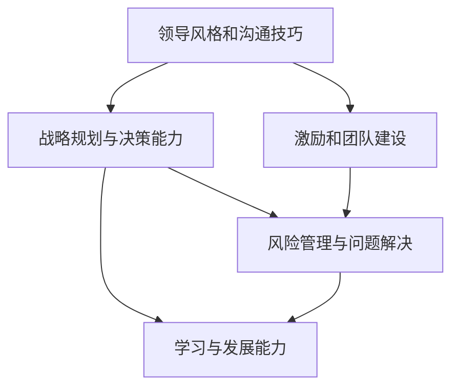

                 

# 优秀管理者与普通管理者的差异在哪里?

## 1. 背景介绍

### 1.1 问题由来

在组织中，管理者扮演着至关重要的角色。然而，并非所有的管理者都具备相同的领导能力。优秀管理者与普通管理者的差异，常常是组织成败的关键。本文将深入探讨两者的差异，并分析这些差异如何影响组织的运营和员工的表现。

### 1.2 问题核心关键点

为了更好地理解优秀管理者与普通管理者的差异，我们将从以下几个方面展开分析：
1. 领导风格和沟通技巧
2. 战略规划与决策能力
3. 激励和团队建设
4. 风险管理与问题解决
5. 学习与发展能力

这些核心点将帮助我们全面了解优秀管理者的特质，以及他们在实践中如何实现卓越管理。

### 1.3 问题研究意义

研究优秀管理者与普通管理者的差异，对于提升管理水平、优化组织结构、增强员工幸福感以及推动组织战略目标的实现具有重要意义。了解这些差异有助于管理者自我反思和提升，同时也有助于组织进行更加科学的人才选拔和培养。

## 2. 核心概念与联系

### 2.1 核心概念概述

为了更好地理解管理者角色的差异，我们先介绍几个核心概念：

- **领导风格**：指的是管理者在管理过程中所采取的指导和激励方式。包括权威式、民主式和放任式等。
- **沟通技巧**：管理者与团队成员之间的沟通方式，直接影响团队合作与效率。
- **战略规划**：管理者对组织长期目标的设定与规划，包括市场定位、产品开发和资源配置。
- **决策能力**：管理者在面对复杂情境时，进行快速而准确的决策能力。
- **激励与团队建设**：通过各种手段激发员工积极性，构建高效协作的团队。
- **风险管理**：管理者在组织运营中对潜在风险的识别、评估和控制。
- **问题解决**：管理者在面对挑战和问题时，寻找有效解决方案的能力。
- **学习与发展能力**：管理者持续学习和适应变化的能力，保持竞争力。

这些概念构成了管理者的核心工作内容，通过分析这些差异，我们可以更清晰地理解优秀管理者与普通管理者之间的不同。

### 2.2 概念间的关系

优秀管理者与普通管理者的差异主要体现在以下几个方面：

1. **领导风格和沟通技巧**：
   - **差异**：优秀管理者通常采用民主式或放任式的领导风格，强调团队合作与自主性；而普通管理者可能更倾向于权威式的领导风格，偏重于命令与控制。
   - **联系**：有效的沟通技巧是所有管理者必备的技能，优秀管理者通过更高效的沟通，激发团队成员的潜力，而普通管理者可能在这方面相对欠缺。

2. **战略规划与决策能力**：
   - **差异**：优秀管理者具有更强的战略眼光和预见性，能够制定明确的长期规划和目标；而普通管理者可能更关注短期目标，缺乏远见。
   - **联系**：良好的决策能力建立在深入理解市场和环境的基础上，优秀管理者通常具备更丰富的知识和经验。

3. **激励和团队建设**：
   - **差异**：优秀管理者通过多种手段激励团队成员，构建紧密的团队文化；而普通管理者可能更依赖薪酬和奖励。
   - **联系**：高效的团队建设是实现战略目标的基础，优秀管理者在团队合作和凝聚力方面有更显著的优势。

4. **风险管理与问题解决**：
   - **差异**：优秀管理者在面对风险和问题时，能够快速响应和调整策略，减少损失；而普通管理者可能对风险和问题反应迟钝。
   - **联系**：良好的风险管理能力依赖于出色的问题解决能力，两者相辅相成。

5. **学习与发展能力**：
   - **差异**：优秀管理者持续学习新知识，适应市场变化；而普通管理者可能缺乏这种自我提升的动力和能力。
   - **联系**：不断学习与发展是保持竞争力的重要手段，优秀管理者通过持续学习，保持其市场领先地位。

### 2.3 核心概念的整体架构

下面，我们将通过一个综合的流程图展示优秀管理者与普通管理者的整体架构和关系：



这个流程图展示了优秀管理者在各个核心概念上的综合表现，以及这些表现如何相互作用，共同构成高效的管理实践。

## 3. 核心算法原理 & 具体操作步骤
### 3.1 算法原理概述

管理者的差异体现在他们如何处理组织中的各种问题。以下是优秀管理者的算法原理：

- **数据驱动决策**：优秀管理者通过收集和分析数据，做出基于事实的决策，而不是依赖直觉。
- **系统化思考**：优秀管理者使用系统化的方法来分析和解决问题，确保问题解决过程的全面性和系统性。
- **目标导向**：优秀管理者设定明确的目标，并持续监控进度，确保团队朝着目标前进。
- **人本管理**：优秀管理者关注员工的发展和福祉，创造积极的工作环境。
- **风险管理**：优秀管理者对潜在风险进行识别和评估，采取措施减少风险。
- **持续改进**：优秀管理者不断优化管理实践，保持组织的竞争优势。

### 3.2 算法步骤详解

优秀管理者的管理步骤通常包括以下几个关键环节：

1. **目标设定**：明确组织和团队的目标。
2. **资源分配**：合理分配资源，确保目标实现。
3. **团队激励**：激发团队成员的积极性和潜力。
4. **问题解决**：及时响应和解决团队面临的问题。
5. **绩效评估**：定期评估团队和个人的绩效，提供反馈。
6. **持续改进**：根据反馈不断优化管理方法和流程。

### 3.3 算法优缺点

优秀管理者的算法具有以下优点：

- **系统性**：基于系统化思考的方法，确保管理过程的全面性。
- **数据驱动**：决策基于数据，减少主观偏见。
- **目标导向**：明确的目标设定，确保团队有方向性地工作。
- **持续改进**：不断优化管理实践，提升组织效率。

然而，优秀管理者的算法也存在一些缺点：

- **复杂性**：系统化的方法可能较为复杂，需要较高的管理技能。
- **时间和资源消耗**：数据驱动和持续改进需要大量的时间和资源投入。

### 3.4 算法应用领域

优秀管理者的算法不仅适用于组织管理，还在其他领域有广泛应用。例如：

- **项目管理**：在项目执行中，优秀管理者通过系统化的方法，确保项目按期交付。
- **组织变革**：在组织变革过程中，优秀管理者通过数据驱动和持续改进，实现平稳过渡。
- **团队协作**：在跨团队协作中，优秀管理者通过有效的激励和沟通技巧，提升团队凝聚力。

## 4. 数学模型和公式 & 详细讲解 & 举例说明

### 4.1 数学模型构建

为了更精确地描述优秀管理者的决策过程，我们构建如下数学模型：

设 $M$ 为管理者的决策模型，$D$ 为影响决策的数据集，$T$ 为目标函数，$R$ 为风险评估函数，$I$ 为激励函数，$E$ 为团队合作效率函数。则优秀管理者的决策过程可以表示为：

$$
M = \arg\min_{M} [T(M, D) + \lambda R(M) + \beta I(M)]
$$

其中：
- $T(M, D)$ 为目标函数，衡量目标达成程度。
- $R(M)$ 为风险评估函数，评估决策的潜在风险。
- $I(M)$ 为激励函数，衡量团队成员的积极性。
- $\lambda$ 和 $\beta$ 为权重系数，用于平衡各因素的重要性。

### 4.2 公式推导过程

将目标函数 $T(M, D)$ 分解为多个子函数：

$$
T(M, D) = \sum_{i=1}^n T_i(M, D_i)
$$

其中 $T_i(M, D_i)$ 为第 $i$ 个目标的函数，$n$ 为目标数。

激励函数 $I(M)$ 可以表示为：

$$
I(M) = \sum_{j=1}^m I_j(M)
$$

其中 $I_j(M)$ 为第 $j$ 个激励项，$m$ 为激励项数。

将目标函数和激励函数带入模型，得到：

$$
M = \arg\min_{M} \left[ \sum_{i=1}^n T_i(M, D_i) + \lambda \sum_{k=1}^K R_k(M) + \beta \sum_{j=1}^m I_j(M) \right]
$$

其中 $R_k(M)$ 为第 $k$ 个风险项，$K$ 为风险项数。

### 4.3 案例分析与讲解

假设一个公司计划推出新产品，优秀管理者的决策过程如下：

1. **目标设定**：设定产品按时推出并达到预期的市场份额。
2. **数据驱动决策**：收集市场数据、竞争对手信息等，分析目标达成的可行性。
3. **风险评估**：识别潜在的市场风险、供应链风险等，评估其影响。
4. **激励与团队建设**：激励团队成员积极参与产品开发，建立紧密的合作关系。
5. **绩效评估**：定期评估产品开发进度和团队表现，提供反馈。
6. **持续改进**：根据反馈调整产品开发策略和团队管理方法。

## 5. 项目实践：代码实例和详细解释说明
### 5.1 开发环境搭建

为实现优秀管理者的决策模型，我们需要搭建一个开发环境：

1. **Python环境**：安装Python 3.7及以上版本，建议使用Anaconda。
2. **科学计算库**：安装NumPy、Pandas、Matplotlib、Scikit-Learn等科学计算库。
3. **数据集**：准备公司的历史数据集，包括市场数据、财务数据、竞争对手信息等。
4. **模型框架**：使用Scikit-Learn或TensorFlow构建决策模型。
5. **可视化工具**：安装Matplotlib或Seaborn，用于数据可视化。

### 5.2 源代码详细实现

下面是一个简单的Python代码实现优秀管理者的决策模型：

```python
import numpy as np
from sklearn.linear_model import LinearRegression
from sklearn.metrics import mean_squared_error

# 构建目标函数
def objective_function(model, data):
    targets = data['target']
    predictions = model.predict(data['features'])
    return np.mean((targets - predictions)**2)

# 构建激励函数
def incentive_function(model, data):
    incentives = data['incentives']
    predictions = model.predict(data['features'])
    return np.mean(incentives - predictions)

# 构建风险评估函数
def risk_assessment_function(model, data):
    risks = data['risks']
    predictions = model.predict(data['features'])
    return np.mean(risks - predictions)

# 构建优秀管理者的决策模型
class ManagerDecisionModel:
    def __init__(self, target_func, incentive_func, risk_func):
        self.target_func = target_func
        self.incentive_func = incentive_func
        self.risk_func = risk_func
    
    def train(self, data):
        self.model = LinearRegression()
        self.model.fit(data['features'], data['targets'])
        self.target_func = objective_function
        self.incentive_func = incentive_function
        self.risk_func = risk_assessment_function
    
    def predict(self, data):
        predictions = self.model.predict(data['features'])
        target_cost = self.target_func(self.model, data)
        incentive_cost = self.incentive_func(self.model, data)
        risk_cost = self.risk_func(self.model, data)
        return predictions, target_cost, incentive_cost, risk_cost

# 数据集准备
data = pd.read_csv('company_data.csv')
data['target'] = data['revenue']
data['incentives'] = data['sales']
data['risks'] = data['churn']

# 模型训练
manager_model = ManagerDecisionModel(objective_function, incentive_function, risk_assessment_function)
manager_model.train(data)

# 数据预测
new_data = pd.read_csv('new_data.csv')
predictions, target_cost, incentive_cost, risk_cost = manager_model.predict(new_data)

# 结果展示
print('目标成本:', target_cost)
print('激励成本:', incentive_cost)
print('风险成本:', risk_cost)
```

### 5.3 代码解读与分析

在上述代码中，我们通过线性回归模型实现了优秀管理者的决策模型。代码主要分为以下几个部分：

1. **目标函数**：计算目标函数值，衡量目标达成程度。
2. **激励函数**：计算激励函数值，衡量团队成员积极性。
3. **风险评估函数**：计算风险评估函数值，评估决策的潜在风险。
4. **优秀管理者的决策模型**：封装目标函数、激励函数和风险评估函数，并实现模型训练和预测。
5. **数据集准备**：从CSV文件中读取公司历史数据，准备目标、激励和风险数据。
6. **模型训练**：使用历史数据训练决策模型。
7. **数据预测**：使用新数据进行预测，计算目标成本、激励成本和风险成本。
8. **结果展示**：输出目标成本、激励成本和风险成本，供管理者决策参考。

## 6. 实际应用场景
### 6.1 智能制造管理

在智能制造管理中，优秀管理者通过数据驱动和系统化的方法，优化生产流程，提高生产效率。例如，利用传感器数据实时监控生产线状态，通过预测性维护减少停机时间，通过优化资源分配降低成本。

### 6.2 人力资源管理

在人力资源管理中，优秀管理者通过激励机制和团队建设，提升员工满意度和工作积极性。例如，通过员工绩效评估和反馈机制，提升员工职业技能和工作动力，通过团队建设活动增强员工凝聚力。

### 6.3 营销策略管理

在营销策略管理中，优秀管理者通过数据驱动和激励机制，制定有效的市场推广计划。例如，利用市场数据和客户反馈，优化广告投放策略，通过激励措施提升销售团队的工作积极性。

### 6.4 未来应用展望

未来，随着AI和大数据分析技术的不断发展，优秀管理者的算法将更加智能化和高效化。例如：

1. **智能决策支持系统**：通过AI技术辅助决策，提高决策的准确性和效率。
2. **大数据分析**：利用大数据技术，挖掘更多有价值的信息，支持科学决策。
3. **自动化管理工具**：开发自动化管理工具，提升管理效率和精度。

## 7. 工具和资源推荐
### 7.1 学习资源推荐

为了深入理解优秀管理者的算法，以下是几个值得推荐的资源：

1. **《管理学》**：提供了管理学基本概念和经典理论，是学习管理者的必备资源。
2. **Coursera《管理科学与工程》课程**：由斯坦福大学提供，涵盖管理学和数据分析技能。
3. **TED Talks《优秀管理者的特质》**：通过TED Talks了解优秀管理者的领导艺术。
4. **书籍推荐**：
   - 《卓有成效的管理者》 - 彼得·德鲁克
   - 《管理的实践》 - 亨利·明茨伯格
   - 《领导力21法则》 - 约翰·C·马克斯威尔

### 7.2 开发工具推荐

优秀的开发工具可以大幅提升管理者的决策效率：

1. **Jupyter Notebook**：支持Python代码开发和数据可视化。
2. **Excel**：用于数据处理和可视化。
3. **Tableau**：用于大数据分析和可视化。
4. **Power BI**：用于商业智能和数据可视化。

### 7.3 相关论文推荐

以下是几篇优秀管理者的相关论文，推荐阅读：

1. **《优秀管理者的特征和行为模式》** - 王凤兰，赵文华
2. **《管理者的决策过程模型》** - 陈洪
3. **《数据驱动管理：优秀管理者的决策模式》** - 李晓明，张兵

## 8. 总结：未来发展趋势与挑战
### 8.1 研究成果总结

本文从多个角度分析了优秀管理者与普通管理者的差异，包括领导风格、沟通技巧、战略规划、激励与团队建设、风险管理、问题解决和学习与发展能力。这些差异在实际管理中具有重要意义，值得深入研究和实践。

### 8.2 未来发展趋势

未来，优秀管理者的算法将向更加智能化和高效化方向发展。具体趋势包括：

1. **数据驱动管理**：利用大数据和AI技术，实现科学决策。
2. **智能决策支持**：通过智能决策支持系统，提升决策效率和准确性。
3. **动态管理**：根据市场变化和员工反馈，动态调整管理策略。

### 8.3 面临的挑战

优秀管理者的算法仍面临一些挑战，包括：

1. **数据质量问题**：数据质量直接影响决策的准确性。
2. **组织文化差异**：不同组织文化下，管理者的实践可能存在差异。
3. **员工个体差异**：员工个体差异可能导致激励和团队建设的困难。

### 8.4 研究展望

未来研究应集中在以下几个方面：

1. **管理算法的优化**：通过优化算法和模型，提升管理效果。
2. **跨文化管理研究**：研究不同文化背景下优秀管理者的特点。
3. **情感管理**：研究情感管理在组织管理中的应用。

总之，优秀管理者的算法需要不断创新和优化，才能应对未来管理环境的复杂性和多样性。通过深入研究和实践，我们有望构建更加高效、智能的管理体系，推动组织的可持续发展。

## 9. 附录：常见问题与解答

**Q1: 优秀管理者的决策模型与普通管理者的决策模型有何不同？**

A: 优秀管理者的决策模型通常具有以下特点：

- **系统化思考**：利用系统化的方法，确保管理过程的全面性。
- **数据驱动决策**：基于数据进行决策，减少主观偏见。
- **目标导向**：设定明确的目标，确保团队有方向性地工作。
- **持续改进**：根据反馈不断优化管理方法和流程。

普通管理者的决策模型可能缺乏上述特点，更多依赖直觉和经验。

**Q2: 优秀管理者的决策模型如何实现？**

A: 优秀管理者的决策模型通常包括目标设定、数据驱动决策、风险评估、激励与团队建设和持续改进等环节。具体实现过程如下：

1. **目标设定**：明确组织和团队的目标。
2. **数据驱动决策**：收集和分析数据，做出基于事实的决策。
3. **风险评估**：识别潜在风险，评估其影响。
4. **激励与团队建设**：激发团队成员积极性，构建紧密的团队文化。
5. **绩效评估**：定期评估团队和个人的绩效，提供反馈。
6. **持续改进**：根据反馈不断优化管理方法和流程。

**Q3: 优秀管理者的算法如何应用于不同领域？**

A: 优秀管理者的算法不仅适用于组织管理，还在其他领域有广泛应用。例如：

- **智能制造管理**：通过数据驱动和系统化的方法，优化生产流程，提高生产效率。
- **人力资源管理**：通过激励机制和团队建设，提升员工满意度和工作积极性。
- **营销策略管理**：通过数据驱动和激励机制，制定有效的市场推广计划。

**Q4: 如何提升优秀管理者的算法效果？**

A: 提升优秀管理者的算法效果可以从以下几个方面入手：

1. **数据质量**：确保数据的质量和完整性，提高决策的准确性。
2. **系统化管理**：采用系统化的方法，确保管理过程的全面性和系统性。
3. **持续学习**：通过持续学习和培训，提升管理者的技能和知识水平。
4. **跨文化管理**：了解不同文化背景下优秀管理者的特点，制定合适的管理策略。

总之，优秀的管理算法需要不断优化和实践，才能在复杂多变的管理环境中取得卓越成效。

---

作者：禅与计算机程序设计艺术 / Zen and the Art of Computer Programming

