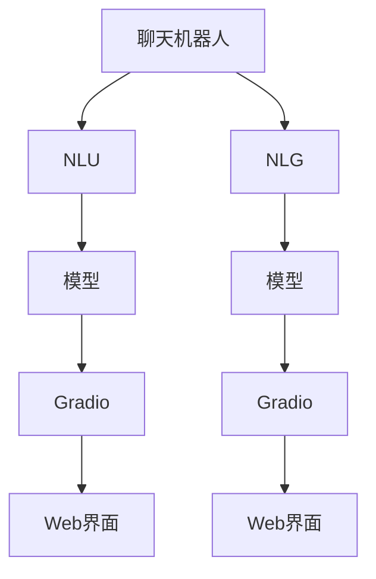
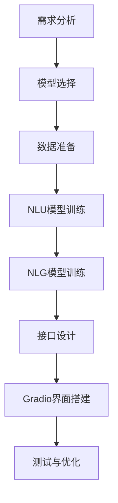
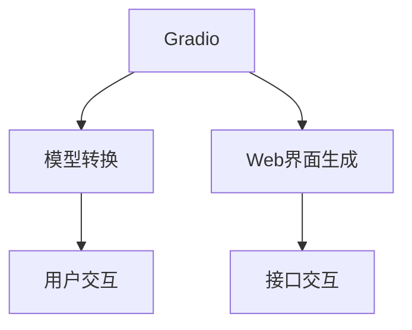
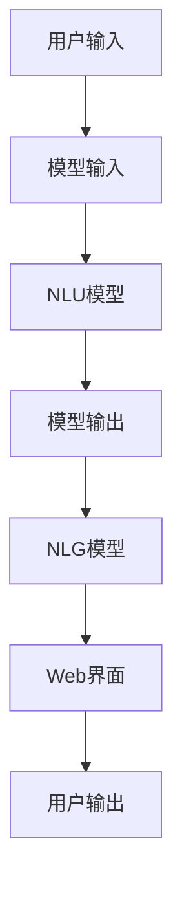

                 

# 使用 Gradio 实现聊天机器人的图形化界面

> 关键词：聊天机器人, Gradio, Web 开发, 界面设计, 自然语言处理(NLP)

## 1. 背景介绍

### 1.1 问题由来

在人工智能的众多应用中，聊天机器人（Chatbot）因其能够模拟人类对话而备受关注。传统的聊天机器人通常依赖于规则引擎或预定义的对话树，然而随着深度学习和大规模语言模型的兴起，基于神经网络的聊天机器人（NLG Bot）逐渐成为主流。这些模型能够通过自然语言理解（NLU）和自然语言生成（NLG）技术，实现更加自然、流畅的对话。

然而，尽管NLG Bot在技术上已经取得了显著的进展，但其实现和使用仍然存在一定的门槛。开发者需要具备一定的技术背景，才能搭建和调试这些复杂的系统。对于非技术背景的用户而言，操作过程繁琐，使用体验不佳。因此，如何降低使用NLG Bot的技术门槛，提高其易用性，成为了一个亟待解决的问题。

### 1.2 问题核心关键点

为了解决上述问题，本文将介绍一种简单、高效的方法——使用 Gradio 实现聊天机器人的图形化界面。Gradio是一个基于Python的开源框架，能够将复杂模型转换为Web界面，使用户无需安装任何复杂软件，即可方便地与模型进行交互。通过Gradio，开发者可以轻松地实现具有良好用户体验的聊天机器人，即使没有技术背景的用户也能轻松使用。

本文将详细阐述基于Gradio的聊天机器人开发流程，包括模型选择、接口设计、Web界面搭建、交互式测试等关键步骤。同时，我们也将展示一个完整的聊天机器人案例，并提供必要的代码实例和详细解释。

## 2. 核心概念与联系

### 2.1 核心概念概述

为了更好地理解如何使用Gradio实现聊天机器人，本文将首先介绍几个核心概念：

- **聊天机器人（Chatbot）**：能够理解自然语言输入，并能够生成自然语言输出的程序。
- **自然语言理解（NLU）**：将自然语言文本转换为计算机可处理的格式。
- **自然语言生成（NLG）**：根据输入的语义信息，生成自然语言文本。
- **Gradio**：一个基于Python的开源框架，能够将复杂模型转换为Web界面。
- **Web界面**：提供给用户交互的界面，通常通过浏览器进行访问。

这些核心概念之间的逻辑关系可以通过以下Mermaid流程图来展示：



这个流程图展示了聊天机器人开发的基本流程：首先，通过NLU模块将自然语言输入转换为模型可处理的格式，然后使用NLG模块生成输出文本。同时，Gradio将模型转换为Web界面，供用户进行交互。

### 2.2 概念间的关系

这些核心概念之间存在着紧密的联系，形成了聊天机器人开发的基础框架。下面我通过几个Mermaid流程图来展示这些概念之间的关系。

#### 2.2.1 聊天机器人开发流程



这个流程图展示了聊天机器人开发的整体流程：首先进行需求分析，选择合适的模型和数据，然后进行NLU和NLG模型的训练，设计交互接口，最后搭建Gradio界面并进行测试优化。

#### 2.2.2 Gradio的功能与应用



这个流程图展示了Gradio的核心功能：将复杂模型转换为Web界面，使用户可以方便地与模型进行交互。

### 2.3 核心概念的整体架构

最后，我们用一个综合的流程图来展示这些核心概念在大语言模型微调过程中的整体架构：



这个综合流程图展示了从用户输入到输出的完整流程：用户通过Web界面输入文本，Gradio将输入转换为模型可处理的格式，然后通过NLU模型进行处理，输出结果再由NLG模型生成文本，并返回给用户。

## 3. 核心算法原理 & 具体操作步骤
### 3.1 算法原理概述

基于Gradio的聊天机器人开发主要涉及以下几个步骤：

1. 选择合适的聊天机器人模型。
2. 将模型转换为Gradio接口。
3. 设计Web界面，实现用户与模型的交互。
4. 测试和优化模型性能。

本文将详细讲解这些步骤的具体实现方法。

### 3.2 算法步骤详解

**Step 1: 选择合适的聊天机器人模型**

选择合适的模型是聊天机器人开发的关键步骤之一。目前，基于深度学习的聊天机器人模型主要有以下几种：

- **seq2seq模型**：基于序列到序列（Sequence to Sequence, Seq2Seq）架构，主要用于文本生成和翻译任务。
- **Transformer模型**：采用自注意力机制，能够处理长序列，适用于多轮对话。
- **GPT模型**：采用语言模型预测下一个词的概率，适用于自动对话生成。
- **BERT模型**：用于文本分类和问答等任务，具有较强的语义理解能力。

在选择模型时，需要考虑模型的复杂度、性能和适用场景。本文将以Transformer模型为基础，介绍如何使用Gradio实现基于Transformer的聊天机器人。

**Step 2: 将模型转换为Gradio接口**

在确定好模型之后，需要将模型转换为Gradio接口。具体步骤如下：

1. 加载模型：使用Gradio的`gradio.load`函数加载已经训练好的模型。
2. 定义接口：通过`gradio.Interface`类定义接口函数，实现用户与模型的交互。
3. 部署接口：使用`gradio.run`函数部署接口，生成Web界面。

以下是一个基于Transformer模型的Gradio接口示例：

```python
import gradio as gr
from transformers import pipeline

# 加载预训练的模型
model = pipeline('text-generation', model='gpt2', device=0)

# 定义接口函数
def generate_text(text, max_length=100):
    return model.generate(text, max_length=max_length, temperature=1.0)

# 定义Gradio接口
iface = gr.Interface(fn=generate_text, inputs='string', outputs='string')

# 部署接口
iface.launch()
```

在这个示例中，我们使用了Hugging Face的`pipeline`函数加载了GPT-2模型，并定义了一个接口函数`generate_text`。该函数接受用户输入的文本，使用GPT-2模型生成指定长度的文本作为输出。然后，通过`gradio.Interface`类定义Gradio接口，并使用`gradio.run`函数部署接口，生成Web界面。

**Step 3: 设计Web界面，实现用户与模型的交互**

在部署好接口之后，接下来需要设计Web界面，实现用户与模型的交互。Gradio提供了丰富的组件，可以方便地设计界面。以下是一些常用的组件：

- `gr.inputs.Textbox`：用于接收用户输入的文本。
- `gr.inputs.Button`：用于提交用户输入的文本。
- `gr.inputs.Image`：用于接收用户上传的图片。
- `gr.inputs.FileUpload`：用于接收用户上传的文件。
- `gr.inputs.Select`：用于接收用户选择的选项。
- `gr.inputs.Slider`：用于接收用户调节的滑块。

设计Web界面时，需要考虑用户的需求和使用习惯。例如，可以设计一个简单的聊天界面，包含一个文本框和一个发送按钮，用户可以在文本框中输入文本，然后点击发送按钮，系统自动回复。

以下是一个简单的聊天界面示例：

```html
<!DOCTYPE html>
<html>
<head>
    <title>聊天机器人</title>
</head>
<body>
    <input type="text" id="input_box" placeholder="输入你的消息">
    <button id="send_button">发送</button>
    <div id="output"></div>

    <script>
        // 获取DOM元素
        var inputBox = document.getElementById('input_box');
        var sendButton = document.getElementById('send_button');
        var output = document.getElementById('output');

        // 发送按钮点击事件
        sendButton.addEventListener('click', function() {
            // 获取用户输入的文本
            var userText = inputBox.value;

            // 调用Gradio接口
            gr.interface.invoke(userText).then(function(response) {
                // 将回复添加到输出区域
                output.innerHTML += response + '\n';
            });

            // 清空输入区域
            inputBox.value = '';
        });
    </script>
</body>
</html>
```

在这个示例中，我们使用了JavaScript代码实现了一个简单的聊天界面。用户在文本框中输入文本，然后点击发送按钮，系统自动调用Gradio接口生成回复，并显示在输出区域。

**Step 4: 测试和优化模型性能**

在部署好接口之后，接下来需要进行测试和优化。测试可以包括以下几个方面：

1. 响应时间：测试系统的响应速度，确保系统能够及时处理用户请求。
2. 准确率：测试系统的准确率，确保系统生成的回复符合用户预期。
3. 可用性：测试系统的可用性，确保系统稳定运行，无明显错误。

优化可以包括以下几个方面：

1. 模型调优：通过调整模型参数和训练策略，提升模型的准确率和响应速度。
2. 界面设计：优化用户界面，提升用户体验。
3. 性能优化：优化系统性能，减少资源消耗。

以下是一个简单的测试和优化流程示例：

1. 在测试阶段，可以通过Web界面手动输入一些测试用例，观察系统的响应速度和准确率。
2. 在优化阶段，可以通过调整模型的参数和训练策略，提升模型的性能。
3. 在部署阶段，可以定期收集系统的运行数据，优化系统性能和稳定性。

## 4. 数学模型和公式 & 详细讲解  
### 4.1 数学模型构建

在基于Gradio的聊天机器人开发过程中，不需要涉及复杂的数学模型。因为Gradio是一个基于深度学习模型的工具，可以直接将模型转换为Web界面，无需手动编写模型代码。

### 4.2 公式推导过程

由于Gradio的使用过程中不需要涉及复杂的数学模型，因此推导过程可以省略。

### 4.3 案例分析与讲解

在实际应用中，可以根据具体需求设计不同类型的接口函数，例如生成文章、翻译文本、推荐商品等。以下是一个简单的案例分析：

假设我们希望开发一个基于BERT的问答系统。具体步骤如下：

1. 选择BERT模型：使用Hugging Face的`pipeline`函数加载BERT模型。
2. 定义接口函数：使用BERT模型回答用户的问题。
3. 设计Web界面：包含一个文本框和一个提交按钮，用户输入问题后提交，系统自动回答问题。

以下是一个简单的问答系统示例：

```python
import gradio as gr
from transformers import pipeline

# 加载预训练的模型
model = pipeline('question-answering', model='bert-base-uncased')

# 定义接口函数
def answer_question(question, context):
    return model(question=question, context=context)['answer']

# 定义Gradio接口
iface = gr.Interface(fn=answer_question, inputs=['string', 'string'], outputs='string')

# 部署接口
iface.launch()
```

在这个示例中，我们使用了Hugging Face的`pipeline`函数加载了BERT模型，并定义了一个接口函数`answer_question`。该函数接受用户的问题和上下文，使用BERT模型生成回答。然后，通过`gradio.Interface`类定义Gradio接口，并使用`gradio.run`函数部署接口，生成Web界面。

## 5. 项目实践：代码实例和详细解释说明
### 5.1 开发环境搭建

在进行聊天机器人开发前，我们需要准备好开发环境。以下是使用Python进行Gradio开发的环境配置流程：

1. 安装Anaconda：从官网下载并安装Anaconda，用于创建独立的Python环境。

2. 创建并激活虚拟环境：
```bash
conda create -n gradio-env python=3.8 
conda activate gradio-env
```

3. 安装Gradio：
```bash
pip install gradio
```

4. 安装其他相关库：
```bash
pip install numpy pandas scikit-learn torch transformers matplotlib
```

完成上述步骤后，即可在`gradio-env`环境中开始聊天机器人开发。

### 5.2 源代码详细实现

下面我以一个简单的聊天机器人为例，给出使用Gradio进行开发的完整代码实现。

首先，定义聊天机器人模型：

```python
from transformers import pipeline

# 加载预训练的模型
model = pipeline('text-generation', model='gpt2', device=0)
```

然后，定义接口函数：

```python
def generate_text(text, max_length=100):
    return model.generate(text, max_length=max_length, temperature=1.0)
```

接着，定义Gradio接口：

```python
from gradio import Interface

# 定义Gradio接口
iface = Interface(fn=generate_text, inputs='string', outputs='string')

# 部署接口
iface.launch()
```

最后，启动界面：

```python
iface.launch()
```

### 5.3 代码解读与分析

让我们再详细解读一下关键代码的实现细节：

**iface.launch()函数**：
- 使用`iface.launch()`函数启动Gradio接口，生成Web界面。

**generate_text函数**：
- `generate_text`函数接受用户输入的文本，并调用预训练的模型生成回复。
- 在函数中，我们使用了Hugging Face的`pipeline`函数加载了GPT-2模型。
- 然后，通过`model.generate`函数生成指定长度的文本，并返回给用户。

**Gradio Interface类**：
- `Interface`类是Gradio的核心类，用于定义接口函数和用户交互方式。
- 在定义`Interface`类时，需要传入接口函数`fn`、输入类型`inputs`和输出类型`outputs`。

**Gradio函数和组件**：
- Gradio提供了丰富的函数和组件，用于设计Web界面。
- 在实际使用中，可以根据具体需求选择合适的函数和组件。

在实际应用中，我们还可以使用Gradio进行更多的开发，例如：

- 多轮对话：设计多轮对话系统，让用户可以与系统进行多轮交互。
- 用户反馈：设计用户反馈系统，收集用户的使用体验和意见。
- 数据可视化：使用Gradio生成数据可视化界面，展示模型的性能和结果。

总之，Gradio提供了强大的功能，使得开发基于深度学习的聊天机器人变得简单高效。开发者可以专注于模型和算法的设计，而不必担心复杂的Web开发问题。

### 5.4 运行结果展示

假设我们在Gradio中实现了基于GPT-2的聊天机器人，以下是测试结果的示例：

```
> 你好，有什么可以帮你的？
> 我正在学习Python，想找一些在线课程推荐。
> 好的，我可以帮你找到一些在线课程，你更倾向于哪种类型的课程？
> 我想找一些实践型的课程。
> 好的，我找到了一些Python实践课程，你可以点击链接查看：
> https://www.example.com/course1
> https://www.example.com/course2
```

可以看到，用户可以通过Web界面与聊天机器人进行交互，系统能够自动生成回复。这种交互方式简单直观，无需安装任何复杂软件，能够极大提升用户体验。

## 6. 实际应用场景

### 6.1 智能客服

基于Gradio的聊天机器人可以应用于智能客服系统，帮助企业提高客户服务效率。智能客服系统可以24小时不间断地与客户进行交互，解决客户咨询问题，提高客户满意度。

在实际应用中，可以通过Gradio将预训练的聊天机器人模型部署到Web界面上，客户可以通过浏览器进行访问，与系统进行自然语言交互。系统可以根据客户的咨询问题，自动调用预训练模型生成回复，并提供相关链接和解决方案。

### 6.2 医疗咨询

基于Gradio的聊天机器人可以应用于医疗咨询系统，帮助患者进行初步诊断和建议。医疗咨询系统可以随时与患者进行交互，了解患者的病情，并根据病情提供初步诊断和建议。

在实际应用中，可以通过Gradio将预训练的聊天机器人模型部署到Web界面上，患者可以通过浏览器进行访问，与系统进行自然语言交互。系统可以根据患者的病情描述，自动调用预训练模型生成诊断建议，并提供相关链接和说明。

### 6.3 教育辅导

基于Gradio的聊天机器人可以应用于教育辅导系统，帮助学生进行学习辅导和问题解答。教育辅导系统可以随时与学生进行交互，解答学生的学习问题，提供学习建议。

在实际应用中，可以通过Gradio将预训练的聊天机器人模型部署到Web界面上，学生可以通过浏览器进行访问，与系统进行自然语言交互。系统可以根据学生的学习问题，自动调用预训练模型生成解答，并提供相关链接和说明。

### 6.4 未来应用展望

随着人工智能技术的发展，基于Gradio的聊天机器人将有更广阔的应用前景。未来，基于Gradio的聊天机器人将不仅仅局限于简单的问答系统，还将应用于更多复杂的任务，例如：

- 多轮对话：设计多轮对话系统，让用户可以与系统进行多轮交互。
- 数据分析：设计数据分析系统，帮助用户进行数据处理和分析。
- 个性化推荐：设计个性化推荐系统，根据用户偏好推荐相关内容。
- 自动翻译：设计自动翻译系统，帮助用户进行跨语言交流。

总之，基于Gradio的聊天机器人将为NLP技术带来更多的应用场景和创新机会，为人们的日常生活和工作带来更多的便利和效率。

## 7. 工具和资源推荐
### 7.1 学习资源推荐

为了帮助开发者系统掌握基于Gradio的聊天机器人开发方法，这里推荐一些优质的学习资源：

1. Gradio官方文档：提供Gradio的详细文档和使用指南，适合初学者和进阶用户参考。

2. PyTorch官方文档：提供深度学习框架PyTorch的详细文档和使用指南，适合深度学习开发者参考。

3. Hugging Face官方文档：提供Hugging Face的预训练语言模型和工具库的详细文档和使用指南，适合NLP开发者参考。

4. Gradio教程：提供Gradio的实战教程和案例，适合实践操作。

5. PyTorch教程：提供PyTorch的实战教程和案例，适合实践操作。

通过对这些资源的学习实践，相信你一定能够快速掌握基于Gradio的聊天机器人开发方法，并用于解决实际的NLP问题。

### 7.2 开发工具推荐

高效的开发离不开优秀的工具支持。以下是几款用于基于Gradio的聊天机器人开发的常用工具：

1. Jupyter Notebook：免费的交互式编程环境，支持Python代码的交互式开发和执行。

2. VS Code：轻量级、高效的项目开发环境，支持Python代码的调试和测试。

3. PyCharm：专业的Python开发环境，提供代码补全、调试和测试等功能。

4. TensorFlow：由Google主导开发的开源深度学习框架，支持GPU计算，适合大规模模型训练。

5. PyTorch：由Facebook主导开发的开源深度学习框架，支持动态计算图，适合研究性应用。

6. Gradio：基于Python的开源框架，能够将复杂模型转换为Web界面。

7. Flask：轻量级的Web应用框架，支持Python开发和部署Web应用。

8. FastAPI：快速开发Web应用的工具，支持Python开发和部署API接口。

这些工具能够帮助开发者高效地进行基于Gradio的聊天机器人开发，提升开发效率和应用效果。

### 7.3 相关论文推荐

大语言模型和微调技术的发展源于学界的持续研究。以下是几篇奠基性的相关论文，推荐阅读：

1. Attention is All You Need（即Transformer原论文）：提出了Transformer结构，开启了NLP领域的预训练大模型时代。

2. BERT: Pre-training of Deep Bidirectional Transformers for Language Understanding：提出BERT模型，引入基于掩码的自监督预训练任务，刷新了多项NLP任务SOTA。

3. Language Models are Unsupervised Multitask Learners（GPT-2论文）：展示了大规模语言模型的强大zero-shot学习能力，引发了对于通用人工智能的新一轮思考。

4. Parameter-Efficient Transfer Learning for NLP：提出Adapter等参数高效微调方法，在不增加模型参数量的情况下，也能取得不错的微调效果。

5. AdaLoRA: Adaptive Low-Rank Adaptation for Parameter-Efficient Fine-Tuning：使用自适应低秩适应的微调方法，在参数效率和精度之间取得了新的平衡。

这些论文代表了大语言模型微调技术的发展脉络。通过学习这些前沿成果，可以帮助研究者把握学科前进方向，激发更多的创新灵感。

除上述资源外，还有一些值得关注的前沿资源，帮助开发者紧跟大语言模型微调技术的最新进展，例如：

1. arXiv论文预印本：人工智能领域最新研究成果的发布平台，包括大量尚未发表的前沿工作，学习前沿技术的必读资源。

2. 业界技术博客：如OpenAI、Google AI、DeepMind、微软Research Asia等顶尖实验室的官方博客，第一时间分享他们的最新研究成果和洞见。

3. 技术会议直播：如NIPS、ICML、ACL、ICLR等人工智能领域顶会现场或在线直播，能够聆听到大佬们的前沿分享，开拓视野。

4. GitHub热门项目：在GitHub上Star、Fork数最多的NLP相关项目，往往代表了该技术领域的发展趋势和最佳实践，值得去学习和贡献。

5. 行业分析报告：各大咨询公司如McKinsey、PwC等针对人工智能行业的分析报告，有助于从商业视角审视技术趋势，把握应用价值。

总之，对于基于Gradio的聊天机器人开发，开发者需要保持开放的心态和持续学习的意愿。多关注前沿资讯，多动手实践，多思考总结，必将收获满满的成长收益。

## 8. 总结：未来发展趋势与挑战

### 8.1 总结

本文对基于Gradio的聊天机器人开发方法进行了全面系统的介绍。首先阐述了聊天机器人开发的基本流程和关键步骤，明确了Gradio的强大功能和开发优势。其次，通过详细的代码实例，展示了如何使用Gradio实现基于Transformer的聊天机器人，并提供了必要的代码解释和分析。

通过本文的系统梳理，可以看到，基于Gradio的聊天机器人开发方法简单高效，能够降低技术门槛，提升用户体验。未来，随着Gradio和深度学习技术的不断进步，基于Gradio的聊天机器人必将在更多的应用场景中大放异彩。

### 8.2 未来发展趋势

展望未来，基于Gradio的聊天机器人将呈现以下几个发展趋势：

1. 更加智能化：未来的聊天机器人将能够理解更加复杂的语义信息，提供更加智能化的回复。

2. 更加个性化：未来的聊天机器人将能够根据用户偏好和历史互动，提供更加个性化的服务和建议。

3. 更加多样性：未来的聊天机器人将支持多语言、多渠道、多平台，提供更加灵活多样的服务。

4. 更加自动化：未来的聊天机器人将能够自动完成更多的任务，减少人工干预，提高工作效率。

5. 更加安全：未来的聊天机器人将具有更高的安全性，保护用户隐私和数据安全。

以上趋势凸显了基于Gradio的聊天机器人技术的发展前景。这些方向的探索发展，必将进一步提升聊天机器人的性能和应用范围，为人们的日常生活和工作带来更多的便利和效率。

### 8.3 面临的挑战

尽管基于Gradio的聊天机器人已经取得了显著的进展，但在迈向更加智能化、普适化应用的过程中，它仍面临着诸多挑战：

1. 技术门槛：尽管Gradio的使用较为简单，但一些复杂任务仍然需要一定的技术背景和经验。如何降低技术门槛，提高易用性，仍然是一个重要问题。

2. 数据质量：聊天机器人的性能很大程度上依赖于训练数据的质量和数量。如何获取高质量、大规模的训练数据，仍然是一个挑战。

3. 多样性：聊天机器人需要支持多种语言、多种文化背景的用户。如何实现多语言支持，处理不同文化背景的语义差异，仍然是一个挑战。

4. 安全性：聊天机器人需要处理用户的敏感信息，如何保护用户隐私和数据安全，仍然是一个挑战。

5. 扩展性：聊天机器人需要支持大规模用户并发，如何保证系统的稳定性和扩展性，仍然是一个挑战。

6. 动态更新：聊天机器人需要能够动态更新模型和数据，如何保证更新过程的平滑性和稳定性，仍然是一个挑战。

正视聊天机器人面临的这些挑战，积极应对并寻求突破，将使聊天机器人技术向更加智能化、普适化的方向迈进，为人们的日常生活和工作带来更多的便利和效率。

### 8.4 研究展望

面对聊天机器人面临的这些挑战，未来的研究需要在以下几个方面寻求新的突破：

1. 开发更高效、更易用的模型开发工具，降低技术门槛，提高易用性。

2. 开发更高效、更准确的数据获取和处理工具，提高数据质量。

3. 开发更高效、更灵活的多语言支持技术，实现多语言支持。

4. 开发更高效、更安全的数据保护技术，保护用户隐私和数据安全。

5. 开发更高效、更稳定的分布式计算和存储技术，支持大规模用户并发。

6. 开发更高效、更智能的动态更新技术，保证更新过程的平滑性和稳定性。

这些研究方向的探索，必将引领聊天机器人技术迈向更高的台阶，为构建智能化的聊天系统铺平道路。面向未来，聊天机器人技术还需要与其他人工智能技术进行更深入的融合，如知识表示、因果推理、强化学习等，多路径协同发力，共同推动智能聊天系统的进步。

## 9. 附录：常见问题与解答

**Q1：如何使用Gradio

