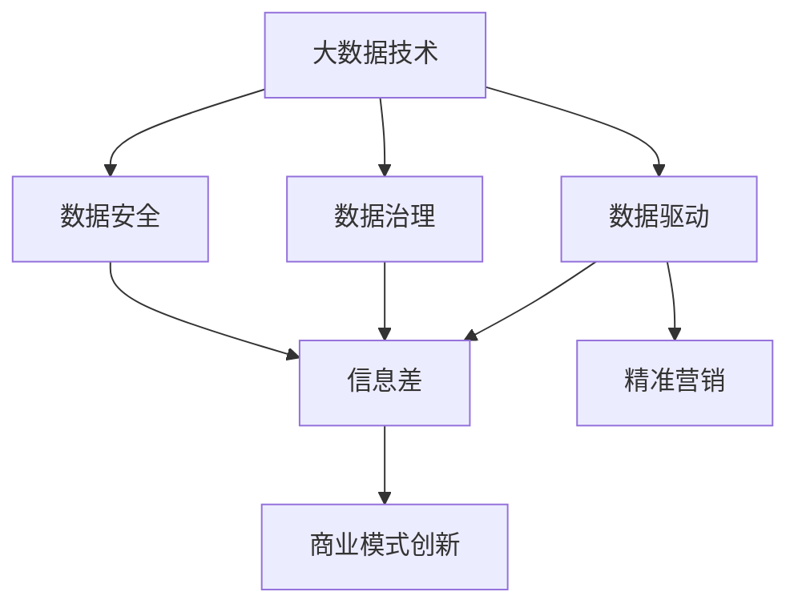

                 

# 信息差的商业价值：大数据驱动的商业模式创新

> 关键词：信息差, 大数据, 商业模式创新, 数据驱动, 精准营销, 竞争优势, 数据治理, 数据安全

## 1. 背景介绍

### 1.1 问题由来

在当今数字化时代，信息差（Information Gap）正逐渐成为企业获取竞争优势的关键。数据资源的分布不均衡、利用效率低、数据治理难等问题，使得部分企业在面对激烈的市场竞争中处于劣势。因此，如何利用大数据技术来弥合信息差、驱动商业模式创新，成为了企业关注的焦点。

### 1.2 问题核心关键点

信息差的核心关键点在于数据的不对称分布。在市场环境中，部分企业由于数据获取能力较弱、数据处理技术落后、数据安全意识薄弱等原因，无法全面、准确地了解市场动态和消费者需求。而另一些企业在数据收集、存储、分析等方面具有显著优势，能够据此制定更有效的商业策略，取得更好的市场表现。

### 1.3 问题研究意义

研究信息差在大数据环境下的商业价值，对于优化企业的竞争策略、提升市场响应速度、增强数据驱动决策的精准性，具有重要意义。同时，探索如何通过大数据技术缩小信息差，可以帮助更多中小企业提升市场地位，推动整个行业的健康发展。

## 2. 核心概念与联系

### 2.1 核心概念概述

1. **信息差（Information Gap）**：指在市场、技术、能力等方面存在的不对称信息分布，导致企业之间存在市场地位、竞争能力等方面的差异。

2. **大数据（Big Data）**：指规模庞大、类型多样、速度极快的数据集合，通过大数据分析技术可以从中挖掘出有价值的信息和知识。

3. **商业模式创新（Business Model Innovation）**：指通过创新商业模式，改变企业与市场、客户、供应商之间的交互方式，提高企业竞争力和市场响应速度。

4. **数据驱动（Data-Driven）**：指在决策过程中充分利用数据信息，依靠数据分析结果来进行市场策略、产品设计、运营管理等方面的决策。

5. **精准营销（Precision Marketing）**：指基于数据分析和客户画像，实现对目标客户的高精度定位和定制化营销。

6. **数据治理（Data Governance）**：指对数据的采集、存储、处理、利用、分发等全生命周期进行标准化、制度化管理，确保数据质量和安全。

7. **数据安全（Data Security）**：指保护数据免受未授权访问、修改、泄露等风险，确保数据隐私和信息安全。

这些核心概念之间紧密相关，构成了信息差在大数据驱动下的商业模式创新的基础框架。

### 2.2 概念间的关系

信息差和商业模式创新之间存在着密切的关系：

1. **数据驱动与精准营销**：大数据驱动的精准营销能够提高市场定位和客户画像的准确性，实现高精度、个性化的市场策略。

2. **数据治理与数据安全**：高效的数据治理保障了数据的质量和安全，减少了信息不对称的风险。

3. **信息差与商业模式创新**：通过大数据技术缩小信息差，企业能够更精准地了解市场和客户需求，从而进行商业模式创新。

以下是一个Mermaid流程图，展示了信息差在大数据驱动下的商业模式创新的整体框架：



## 3. 核心算法原理 & 具体操作步骤

### 3.1 算法原理概述

基于信息差的大数据驱动商业模式创新，主要依赖于以下几个核心算法：

1. **数据收集与清洗**：通过爬虫、API接口等手段，收集市场数据和用户行为数据，并进行清洗处理，去除噪声和冗余信息。

2. **数据挖掘与分析**：利用机器学习、统计分析等技术，从大规模数据中挖掘出有价值的信息和模式，如用户偏好、市场趋势等。

3. **数据可视化与报表**：使用数据可视化工具，将分析结果以图表、报表等形式展现，便于业务人员理解和决策。

4. **市场策略制定与优化**：基于数据分析结果，制定市场策略和优化方案，如产品推荐、广告投放等。

5. **反馈循环与迭代**：通过市场反馈和实际效果，不断调整和优化策略，实现持续改进。

### 3.2 算法步骤详解

1. **数据收集与清洗**
    - 收集数据：通过网络爬虫、API接口、传感器等手段，获取市场数据、用户行为数据等。
    - 数据清洗：去除重复、缺失、异常数据，确保数据质量。

2. **数据挖掘与分析**
    - 特征提取：从收集的数据中提取关键特征，如用户特征、产品特征、市场特征等。
    - 建模分析：使用机器学习算法如K-means、随机森林、深度学习等，建立预测模型，挖掘数据中的模式和关系。

3. **数据可视化与报表**
    - 数据可视化：使用Tableau、Power BI等工具，将分析结果以图表、报表等形式展现。
    - 业务决策：通过报表，业务人员可以直观了解数据情况，制定决策。

4. **市场策略制定与优化**
    - 策略制定：根据分析结果，制定精准营销策略，如个性化推荐、定向广告等。
    - 效果评估：通过A/B测试等方法，评估策略效果，进行迭代优化。

5. **反馈循环与迭代**
    - 收集反馈：通过用户反馈、市场数据等，收集策略效果反馈。
    - 策略调整：根据反馈调整策略，确保策略持续有效。

### 3.3 算法优缺点

大数据驱动的商业模式创新算法具有以下优点：

1. **精准营销**：通过大数据分析，实现对目标客户的精准定位和定制化营销，提升营销效果。
2. **快速响应**：基于实时数据分析，企业可以迅速响应市场变化，优化市场策略。
3. **竞争优势**：通过大数据技术缩小信息差，提升企业的市场地位和竞争能力。
4. **决策支持**：数据驱动的决策模式，降低了决策风险，提高了决策质量。

但同时也存在以下缺点：

1. **数据质量**：大数据分析的准确性依赖于数据质量，低质量的数据可能导致误导性的决策。
2. **技术门槛**：大数据技术和算法复杂度高，需要专业的技术团队支持。
3. **隐私问题**：大规模数据收集和分析可能涉及用户隐私，需要严格的数据治理和隐私保护措施。
4. **成本高**：大数据技术实施成本较高，对中小企业来说可能难以承受。

### 3.4 算法应用领域

大数据驱动的商业模式创新算法可以广泛应用于以下领域：

1. **零售行业**：通过用户行为数据分析，实现个性化推荐和精准营销。
2. **金融行业**：利用市场数据和用户行为数据，进行风险评估和客户管理。
3. **医疗行业**：通过健康数据分析，提供个性化医疗服务和健康管理。
4. **制造行业**：通过设备运行数据和市场数据，优化生产计划和供应链管理。
5. **物流行业**：利用用户运输数据和市场需求数据，优化物流配送路线和服务。

## 4. 数学模型和公式 & 详细讲解  
### 4.1 数学模型构建

设市场数据集为 $D=\{x_i, y_i\}_{i=1}^N$，其中 $x_i$ 表示市场特征，$y_i$ 表示市场行为。定义市场策略为 $S$，策略的效果为 $E$，则目标是最小化策略效果与期望效果的偏差，即：

$$
\min_{S} \sum_{i=1}^N (E(S, x_i) - y_i)^2
$$

其中 $E(S, x_i)$ 表示策略 $S$ 在特征 $x_i$ 下的效果预测。

### 4.2 公式推导过程

以零售行业的个性化推荐为例，设用户特征为 $x = (x_1, x_2, ..., x_n)$，产品特征为 $y = (y_1, y_2, ..., y_m)$，市场策略为 $S$。则推荐系统的效果预测公式为：

$$
E(S, x) = f(S, x) = \sum_{i=1}^m \alpha_i y_i(x)
$$

其中 $y_i(x)$ 表示用户对产品 $i$ 的评分，$\alpha_i$ 表示产品 $i$ 的权重。假设市场策略为线性推荐模型，则有：

$$
E(S, x) = \sum_{i=1}^m \alpha_i y_i(x)
$$

目标是最小化推荐效果与实际行为偏差，即：

$$
\min_{\alpha} \sum_{i=1}^N (E(S, x_i) - y_i)^2
$$

通过求解该优化问题，可以得到最优的推荐策略。

### 4.3 案例分析与讲解

假设某零售企业在用户购买数据上进行个性化推荐，通过数据分析得知用户对不同商品的偏好，从而制定推荐策略。首先，利用大数据技术收集用户购买数据和产品特征数据，进行数据清洗和特征提取。然后，通过机器学习算法建立用户行为预测模型，输出用户对不同商品的评分。最后，根据用户评分和产品权重，构建个性化推荐策略。

## 5. 项目实践：代码实例和详细解释说明

### 5.1 开发环境搭建

在搭建大数据驱动的商业模式创新项目环境时，需要以下开发工具和环境：

1. **Python**：作为主要编程语言，Python具有丰富的数据处理和分析库。
2. **Jupyter Notebook**：用于编写和运行Python代码，支持多种语言和数据可视化。
3. **PySpark**：基于Scala的分布式计算框架，支持大规模数据处理。
4. **Apache Hadoop**：分布式文件系统，用于存储大规模数据。
5. **Tableau**：数据可视化工具，提供直观的报表展示功能。

### 5.2 源代码详细实现

以下是一个基于Python和PySpark的个性化推荐系统的代码实现示例：

```python
from pyspark.sql import SparkSession
from pyspark.ml import Pipeline, DecisionTreeRegressor, Feature, VectorAssembler

# 初始化Spark会话
spark = SparkSession.builder.appName('Recommendation System').getOrCreate()

# 读取数据
df = spark.read.format("csv").option("header", "true").load("path/to/data.csv")

# 特征工程
vector_assembler = VectorAssembler(inputCols=["x1", "x2", "x3"], outputCol="features")
df = vector_assembler.transform(df)

# 数据训练
pipeline = Pipeline(stages=[DecisionTreeRegressor()])
model = pipeline.fit(df)

# 预测推荐
df2 = model.transform(df)
recommendations = df2.select("features", "prediction")
recommendations.show()
```

### 5.3 代码解读与分析

该代码实现了一个基于决策树的个性化推荐系统。首先，使用PySpark读取数据，并进行特征工程，将用户特征转换成向量。然后，使用决策树算法训练模型，输出预测结果。最后，通过读取训练好的模型，对新数据进行预测，输出推荐结果。

## 6. 实际应用场景

### 6.1 零售行业个性化推荐

在大数据驱动的商业模式创新中，零售行业是个性化推荐的重要应用场景。通过大数据技术，零售企业可以实时分析用户购买行为和偏好，实现个性化推荐和精准营销。例如，亚马逊的推荐系统就是基于大数据技术的代表，通过分析用户的浏览和购买记录，向用户推荐相关商品，大大提升了用户体验和销售额。

### 6.2 金融行业风险评估

在金融行业，大数据技术可以用于风险评估和管理。金融机构可以通过分析客户的交易数据、信用记录等，建立风险预测模型，进行风险预警和客户管理。例如，银行可以利用客户交易数据，建立信用评分模型，预测客户的还款能力和风险等级。

### 6.3 医疗行业个性化治疗

医疗行业同样可以利用大数据技术进行个性化治疗。通过分析患者的病历数据、基因数据等，医疗机构可以制定个性化的治疗方案，提高治疗效果。例如，IBM的Watson Health平台可以通过分析患者数据，提供个性化的治疗建议和药物推荐。

### 6.4 未来应用展望

未来，大数据驱动的商业模式创新将继续在更多行业得到应用，为各行业的数字化转型提供动力。以下是对未来应用场景的展望：

1. **智能制造**：通过物联网设备数据和市场数据，优化生产计划和供应链管理，实现智能制造。
2. **智慧城市**：利用城市交通、环境、公共安全等数据，进行城市管理和智慧决策。
3. **智能农业**：通过传感器和无人机采集的数据，进行精准农业管理和农产品预测。
4. **教育行业**：通过学生学习数据和教学资源数据，进行个性化教学和资源推荐。

## 7. 工具和资源推荐

### 7.1 学习资源推荐

1. **《大数据驱动的商业决策》书籍**：该书详细介绍了大数据在商业决策中的应用，帮助读者理解数据驱动决策的原理和实践。
2. **Coursera《大数据技术与应用》课程**：由斯坦福大学开设的大数据技术课程，涵盖大数据的基础知识和实践技能。
3. **Kaggle**：数据科学竞赛平台，提供大量数据集和竞赛机会，有助于提升数据处理和分析能力。
4. **数据科学社区（KDNuggets）**：提供大量数据科学和机器学习相关的文章和教程，帮助读者学习最新的技术和方法。

### 7.2 开发工具推荐

1. **Apache Spark**：支持大规模数据处理和分布式计算，是数据处理的主流工具。
2. **Apache Hadoop**：分布式文件系统，支持海量数据存储和管理。
3. **Tableau**：数据可视化工具，提供直观的报表展示功能。
4. **PySpark**：基于Scala的分布式计算框架，支持大规模数据处理。

### 7.3 相关论文推荐

1. **《大数据驱动的商业创新》论文**：该论文探讨了大数据在商业创新中的应用，提出了基于大数据的商业决策模型。
2. **《数据驱动的商业模式创新》论文**：该论文分析了数据驱动商业模式创新的方法，提出了基于数据治理和数据安全的创新策略。
3. **《大数据与精准营销》论文**：该论文研究了大数据在精准营销中的应用，提出了基于用户行为数据的推荐算法。

## 8. 总结：未来发展趋势与挑战

### 8.1 研究成果总结

本文对基于信息差的大数据驱动商业模式创新进行了全面系统的介绍。通过数据分析和模型训练，帮助企业实现精准营销、风险评估、个性化治疗等商业策略，提升市场响应速度和竞争力。

### 8.2 未来发展趋势

未来，大数据驱动的商业模式创新将继续呈现以下几个发展趋势：

1. **实时分析**：实时数据分析和处理将成为常态，帮助企业快速响应市场变化。
2. **人工智能与大数据融合**：人工智能技术将与大数据深度融合，提升数据分析和决策的精准性。
3. **区块链与大数据结合**：区块链技术可以提高数据的透明度和安全性，为数据治理提供新的解决方案。
4. **跨领域数据融合**：跨领域数据融合将带来更多的商业机会，实现多行业、多领域的协同创新。

### 8.3 面临的挑战

尽管大数据驱动的商业模式创新取得了显著进展，但仍面临以下挑战：

1. **数据质量问题**：大数据分析的准确性依赖于数据质量，低质量的数据可能导致误导性的决策。
2. **技术门槛高**：大数据技术和算法的复杂度高，需要专业的技术团队支持。
3. **隐私保护问题**：大规模数据收集和分析可能涉及用户隐私，需要严格的数据治理和隐私保护措施。
4. **成本高昂**：大数据技术实施成本较高，对中小企业来说可能难以承受。

### 8.4 研究展望

未来，需要在以下几个方面进行深入研究：

1. **数据治理与隐私保护**：建立标准化的数据治理体系，确保数据质量和安全。
2. **跨领域数据融合**：探索跨行业数据融合的新方法，实现更全面的数据应用。
3. **人工智能与大数据融合**：结合人工智能技术，提升数据分析和决策的精准性和自动化程度。
4. **实时数据分析**：研究实时数据分析和处理技术，提升企业对市场变化的响应速度。

通过不断优化和创新，大数据驱动的商业模式创新将为企业带来更大的商业价值，推动各行业的数字化转型。

## 9. 附录：常见问题与解答

**Q1：如何选择合适的数据治理策略？**

A: 选择合适的数据治理策略需要考虑以下几个因素：
1. **数据质量**：建立数据质量标准，确保数据的准确性和完整性。
2. **数据安全**：采用数据加密、访问控制等措施，保护数据隐私和安全。
3. **数据共享**：建立数据共享机制，确保数据互通和协同应用。
4. **数据管理**：采用数据生命周期管理策略，确保数据的全生命周期管理。

**Q2：如何提高大数据分析的准确性？**

A: 提高大数据分析的准确性需要考虑以下几个方面：
1. **数据清洗**：去除重复、缺失、异常数据，确保数据质量。
2. **特征工程**：提取关键特征，使用高质量的特征进行建模。
3. **模型选择**：选择合适的算法和模型，进行模型验证和优化。
4. **数据可视化**：使用数据可视化工具，直观展示分析结果，帮助发现问题。

**Q3：大数据技术在商业决策中的优势是什么？**

A: 大数据技术在商业决策中的优势主要体现在以下几个方面：
1. **数据驱动决策**：通过数据分析和建模，提供客观的决策依据。
2. **实时响应**：实时数据分析和处理，快速响应市场变化。
3. **精准营销**：通过大数据分析，实现对目标客户的精准定位和定制化营销。
4. **竞争优势**：通过大数据技术缩小信息差，提升企业的市场地位和竞争能力。

**Q4：如何有效降低大数据实施成本？**

A: 有效降低大数据实施成本需要考虑以下几个方面：
1. **开源工具**：使用开源工具和框架，降低开发和部署成本。
2. **云服务**：利用云服务资源，降低硬件和运维成本。
3. **自动化工具**：使用自动化工具进行数据处理和模型训练，提高效率。
4. **合作共建**：与其他企业或机构合作共建数据平台，共享数据资源。

**Q5：如何确保数据隐私和安全？**

A: 确保数据隐私和安全需要考虑以下几个方面：
1. **数据加密**：对数据进行加密保护，防止未授权访问。
2. **访问控制**：采用严格的访问控制策略，限制数据访问权限。
3. **审计和监控**：建立数据审计和监控机制，实时监测数据访问和操作。
4. **合规性**：遵守相关法律法规，确保数据处理合规。

---

作者：禅与计算机程序设计艺术 / Zen and the Art of Computer Programming

