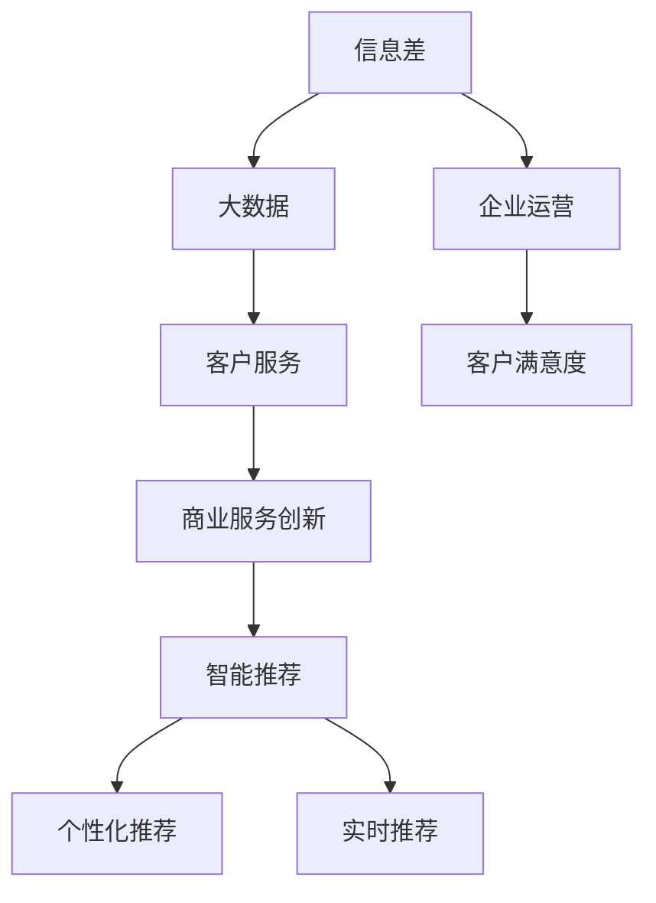
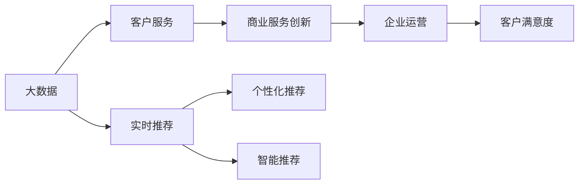
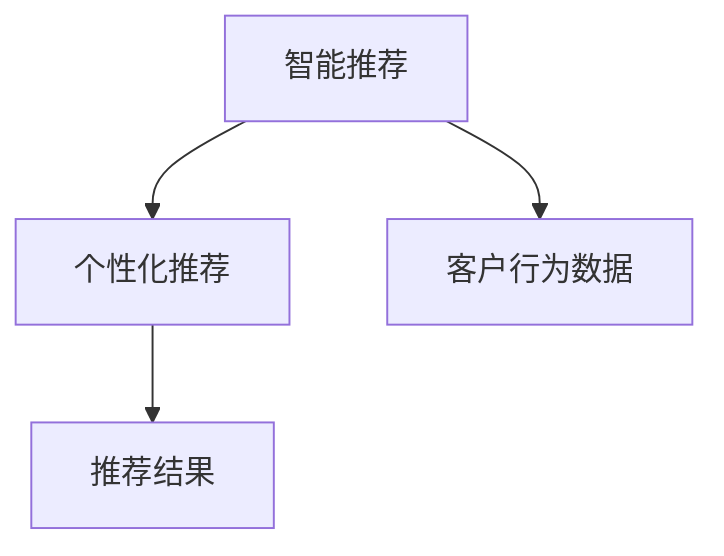
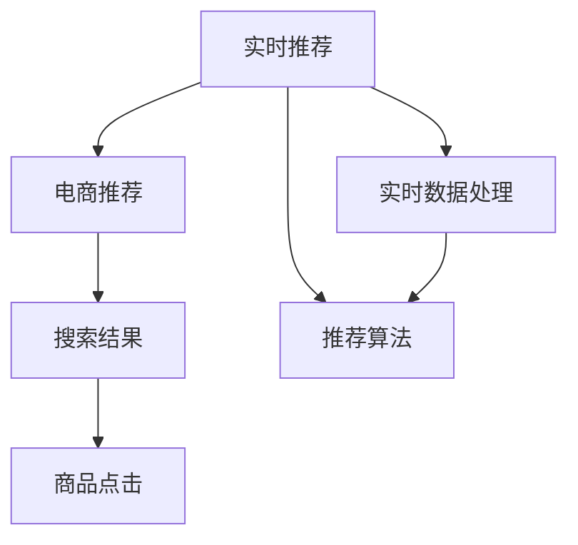

                 

# 信息差的商业服务创新：大数据如何推动服务创新

> 关键词：信息差, 大数据, 商业服务创新, 客户服务, 数据驱动, 智能推荐

## 1. 背景介绍

### 1.1 问题由来
在数字化、信息化的浪潮下，企业服务模式正在经历深刻的变革。传统服务模式下，企业往往面临信息不对称、服务效率低下、客户满意度低等问题。大数据技术的崛起，为解决这些问题提供了新的思路和方法。

以电商行业为例，商家和消费者之间存在着严重的信息差，商家难以准确了解消费者的真实需求，导致商品推荐精度不高、用户体验不佳。而消费者则由于缺乏足够的信息，无法快速找到满足自身需求的商品，造成购物体验差。

为了应对这种信息差，商家需要收集和分析大量的客户数据，但数据量庞大且格式多样，如何高效利用这些数据，提升服务质量，成为亟待解决的问题。

### 1.2 问题核心关键点
数据驱动的服务创新，关键在于如何高效地处理、分析和应用客户数据，从而提供更好的服务体验。具体而言：

- 数据的收集：包括用户行为数据、商品数据、交易数据、评价数据等，是数据驱动服务的基础。
- 数据的清洗和预处理：处理数据缺失、噪音、异常值等，提升数据质量。
- 数据的建模和分析：采用机器学习算法，如聚类、分类、回归等，从数据中提取有价值的信息。
- 数据的应用和迭代：将分析结果转化为服务策略、个性化推荐、广告投放等，不断优化服务质量。

在实际操作中，如何将大数据与商业服务创新深度结合，需要考虑数据隐私、安全、实时性、成本等多个因素。

### 1.3 问题研究意义
研究大数据如何推动服务创新，对于提升企业竞争力和客户满意度具有重要意义：

- 降低企业运营成本：通过精准的个性化推荐和服务，减少不必要的广告投放和库存成本。
- 提升用户体验：实时精准的服务响应，能够提升用户满意度和忠诚度。
- 增强企业竞争力：通过数据驱动的创新，快速响应市场需求，提升市场份额。
- 推动行业升级：大数据技术的应用，能够提升整个行业的运作效率和服务质量，促进产业升级。
- 促进跨界融合：大数据与各个领域的融合应用，能够带来新的商业模式和服务模式。

## 2. 核心概念与联系

### 2.1 核心概念概述

为更好地理解大数据如何推动服务创新，本节将介绍几个密切相关的核心概念：

- **信息差(Information Gap)**：指企业与客户之间、客户与客户之间的信息不对称。信息差的存在，往往导致服务体验差、客户流失等问题。

- **大数据(Big Data)**：指规模庞大、速度极快、来源多样、类型丰富的数据集。大数据技术能够高效处理和分析海量数据，为企业决策提供支持。

- **商业服务创新(Commercial Service Innovation)**：指通过技术手段，改进或创新商业服务模式，提升客户体验和运营效率。

- **客户服务(Customer Service)**：指企业与客户之间的交互行为，包括售前咨询、售中购买、售后支持等。

- **智能推荐(Intelligent Recommendation)**：通过机器学习算法，预测客户需求，推荐最匹配的商品或服务。

- **个性化推荐(Personalized Recommendation)**：根据客户行为数据，为每个客户推荐个性化的商品或服务。

- **实时推荐(Real-time Recommendation)**：通过实时数据处理和算法计算，提供即时的推荐结果。

这些核心概念之间的逻辑关系可以通过以下Mermaid流程图来展示：



这个流程图展示了大数据、客户服务、商业服务创新和推荐系统之间的联系，以及信息差对服务创新的影响。

### 2.2 概念间的关系

这些核心概念之间存在着紧密的联系，形成了大数据推动服务创新的完整生态系统。下面我们通过几个Mermaid流程图来展示这些概念之间的关系。

#### 2.2.1 大数据与商业服务创新的关系



这个流程图展示了大数据与商业服务创新的关系。大数据技术能够收集和分析客户行为数据，提供精准的推荐和服务，从而提升客户满意度和企业运营效率。

#### 2.2.2 智能推荐与个性化推荐的关系



这个流程图展示了智能推荐和个性化推荐的关系。智能推荐通过机器学习算法，从客户行为数据中提取特征，预测客户需求，提供精准的个性化推荐。

#### 2.2.3 实时推荐的应用场景



这个流程图展示了实时推荐在电商推荐中的应用场景。实时推荐通过实时数据处理和推荐算法，提供即时的搜索结果，提升客户购买体验和转化率。

## 3. 核心算法原理 & 具体操作步骤
### 3.1 算法原理概述

大数据驱动的服务创新，本质上是利用数据科学和机器学习技术，分析和优化客户服务流程，提升服务质量和效率。其核心思想是：通过数据挖掘和分析，发现客户需求的规律和趋势，进而改进服务策略和推荐系统，提供更符合客户需求的个性化服务。

具体而言，可以分为以下几个关键步骤：

1. 数据收集：通过日志、交易记录、评价反馈等渠道，收集客户行为数据。
2. 数据清洗和预处理：处理数据缺失、噪音、异常值等，提升数据质量。
3. 特征工程：提取和构造有意义的特征，为后续的建模和分析做准备。
4. 模型训练和预测：采用机器学习算法，如协同过滤、深度学习等，进行模型训练和预测。
5. 服务策略优化：将预测结果转化为服务策略，提升客户体验和运营效率。
6. 服务效果评估：通过客户反馈和行为数据，评估服务效果，不断优化服务策略。

### 3.2 算法步骤详解

**Step 1: 数据收集**

数据收集是服务创新的基础。企业需要通过各种渠道，如网站、APP、社交媒体等，收集客户行为数据。这些数据包括：

- 用户注册信息：姓名、年龄、性别、职业等。
- 用户行为数据：浏览记录、点击行为、购买记录等。
- 用户评价数据：评分、评论、反馈等。

数据收集需要考虑数据的全面性和实时性，以便更好地理解客户需求和行为。

**Step 2: 数据清洗和预处理**

收集到的数据往往存在缺失、噪音和异常值等问题，需要进行清洗和预处理。具体步骤如下：

1. 数据去重：去除重复数据，确保数据唯一性。
2. 数据缺失处理：通过插值、填补等方法，处理数据缺失问题。
3. 数据噪音处理：去除数据中的噪音，如无关信息、异常值等。
4. 数据格式转换：将不同格式的数据统一转换为标准格式，便于后续分析。

数据清洗和预处理是确保数据质量的关键步骤，直接影响到后续的分析和建模结果。

**Step 3: 特征工程**

特征工程是将原始数据转换为有意义的特征，为后续的建模和分析做准备。具体步骤如下：

1. 特征提取：从原始数据中提取有意义的特征，如用户活跃度、购买频率等。
2. 特征选择：选择对模型有用的特征，去除无关特征。
3. 特征转换：对特征进行转换，如离散化、标准化、归一化等。
4. 特征组合：将多个特征组合成新的特征，提升模型预测能力。

特征工程需要根据具体任务和数据特点进行灵活设计，通常通过多次尝试和验证，找到最优的特征组合。

**Step 4: 模型训练和预测**

模型训练和预测是服务创新的核心步骤。采用机器学习算法，如协同过滤、深度学习等，进行模型训练和预测。具体步骤如下：

1. 选择模型：根据任务特点，选择合适的模型算法，如协同过滤、决策树、神经网络等。
2. 数据划分：将数据集划分为训练集、验证集和测试集，进行模型训练和验证。
3. 模型训练：使用训练集进行模型训练，优化模型参数。
4. 模型评估：使用验证集评估模型效果，调整模型参数。
5. 模型预测：使用测试集评估模型预测能力，优化预测结果。

模型训练和预测需要考虑模型的准确性、复杂度和可解释性，选择最优的模型算法和参数设置。

**Step 5: 服务策略优化**

服务策略优化是服务创新的关键步骤。将预测结果转化为服务策略，提升客户体验和运营效率。具体步骤如下：

1. 服务策略设计：根据预测结果，设计符合客户需求的服务策略，如个性化推荐、智能客服等。
2. 服务策略实施：将服务策略应用到实际业务中，提升服务质量和效率。
3. 服务效果评估：通过客户反馈和行为数据，评估服务效果，优化服务策略。

服务策略优化需要根据具体业务场景进行灵活设计，通常需要结合业务经验和技术手段，不断优化服务策略。

**Step 6: 服务效果评估**

服务效果评估是服务创新的重要环节。通过客户反馈和行为数据，评估服务效果，不断优化服务策略。具体步骤如下：

1. 数据采集：收集客户反馈和行为数据，如评价、评论、行为轨迹等。
2. 数据分析：分析客户反馈和行为数据，评估服务效果。
3. 结果反馈：将分析结果反馈给业务部门，优化服务策略。
4. 迭代优化：根据反馈结果，迭代优化服务策略，提升服务质量。

服务效果评估需要考虑客户满意度和运营效率，结合业务需求和技术手段，不断优化服务策略。

### 3.3 算法优缺点

大数据驱动的服务创新，具有以下优点：

1. 数据驱动：通过大量数据进行分析和优化，提升服务质量和效率。
2. 精准推荐：利用机器学习算法，提供精准的个性化推荐，提升用户体验。
3. 实时响应：通过实时数据处理和算法计算，提供即时的服务响应，提升客户满意度。
4. 自动化处理：利用自动化工具和算法，减少人工干预，提升运营效率。

同时，也存在以下缺点：

1. 数据隐私：大量数据的收集和处理，可能涉及用户隐私，需要严格遵守法律法规。
2. 数据质量：数据收集和处理过程中，可能存在数据缺失、噪音和异常值等问题，影响模型效果。
3. 模型复杂：复杂模型需要大量数据和计算资源，可能存在过拟合和泛化能力不足的问题。
4. 成本高昂：大数据技术的应用，需要高昂的硬件和软件投入，可能存在成本瓶颈。

### 3.4 算法应用领域

大数据驱动的服务创新，已经在多个领域取得了广泛应用，例如：

1. **电商推荐**：利用用户行为数据，提供个性化的商品推荐，提升客户购物体验和转化率。
2. **智能客服**：利用自然语言处理和机器学习技术，提供智能化的客户服务，提升服务效率和客户满意度。
3. **金融风险管理**：利用交易数据和行为数据，进行风险评估和预测，提升风险管理能力。
4. **医疗健康**：利用患者数据和健康记录，进行健康管理和疾病预测，提升医疗服务质量。
5. **物流仓储**：利用物流数据和运输记录，进行路径优化和库存管理，提升物流效率和客户体验。

大数据驱动的服务创新，正在成为各行各业提升服务质量和效率的重要手段，推动了产业的数字化转型升级。

## 4. 数学模型和公式 & 详细讲解  
### 4.1 数学模型构建

服务创新的数学模型，通常包括数据收集、清洗、特征工程、模型训练、预测等多个环节。这里以协同过滤算法为例，介绍其数学模型构建过程。

设客户行为数据矩阵为 $R$，其中 $R_{i,j}$ 表示客户 $i$ 对商品 $j$ 的评分。设 $U$ 和 $V$ 分别为用户和商品的特征矩阵，其中 $U_i$ 和 $V_j$ 分别表示用户 $i$ 和商品 $j$ 的特征向量。设 $P$ 为预测矩阵，其中 $P_{i,j}$ 表示客户 $i$ 对商品 $j$ 的预测评分。

协同过滤算法通过用户和商品的特征，预测客户评分，从而进行推荐。模型构建过程如下：

$$
\min_{U,V} \frac{1}{2}\|R-\hat{R}\|_F^2 + \lambda(\|U\|_F^2 + \|V\|_F^2)
$$

其中 $\hat{R}$ 为预测评分矩阵，$\lambda$ 为正则化系数，$\| \cdot \|_F$ 表示矩阵的 Frobenius 范数。

### 4.2 公式推导过程

协同过滤算法的核心在于求解用户和商品的特征矩阵 $U$ 和 $V$。具体步骤如下：

1. 数据预处理：对原始数据进行标准化、归一化等处理，以便后续计算。
2. 特征提取：从原始数据中提取用户和商品的特征，如年龄、性别、评分等。
3. 模型训练：通过最小化损失函数，优化用户和商品的特征矩阵 $U$ 和 $V$。
4. 预测评分：利用训练好的模型，预测客户对商品的评分，进行推荐。

### 4.3 案例分析与讲解

以电商推荐为例，介绍协同过滤算法的具体应用。

设客户行为数据矩阵为 $R$，其中 $R_{i,j}$ 表示客户 $i$ 对商品 $j$ 的评分。设 $U$ 和 $V$ 分别为用户和商品的特征矩阵，其中 $U_i$ 和 $V_j$ 分别表示用户 $i$ 和商品 $j$ 的特征向量。设 $P$ 为预测矩阵，其中 $P_{i,j}$ 表示客户 $i$ 对商品 $j$ 的预测评分。

协同过滤算法通过用户和商品的特征，预测客户评分，从而进行推荐。具体步骤如下：

1. 数据预处理：对原始数据进行标准化、归一化等处理，以便后续计算。
2. 特征提取：从原始数据中提取用户和商品的特征，如年龄、性别、评分等。
3. 模型训练：通过最小化损失函数，优化用户和商品的特征矩阵 $U$ 和 $V$。
4. 预测评分：利用训练好的模型，预测客户对商品的评分，进行推荐。

假设某客户 $i$ 对商品 $j$ 的评分为 $R_{i,j}$，利用协同过滤算法，预测客户 $i$ 对商品 $k$ 的评分 $P_{i,k}$。

通过矩阵乘法，得到预测评分矩阵 $\hat{R}$：

$$
\hat{R} = U V^T
$$

其中 $U_i$ 和 $V_j$ 分别表示用户 $i$ 和商品 $j$ 的特征向量。利用预测评分矩阵 $\hat{R}$，计算客户 $i$ 对商品 $k$ 的预测评分 $P_{i,k}$：

$$
P_{i,k} = U_i^T V_k
$$

通过训练好的协同过滤模型，可以预测客户对商品的评分，进行推荐。

## 5. 项目实践：代码实例和详细解释说明
### 5.1 开发环境搭建

在进行服务创新项目开发前，我们需要准备好开发环境。以下是使用Python进行Scikit-learn和PyTorch开发的Python环境配置流程：

1. 安装Anaconda：从官网下载并安装Anaconda，用于创建独立的Python环境。

2. 创建并激活虚拟环境：
```bash
conda create -n pythontest python=3.8 
conda activate pythontest
```

3. 安装Scikit-learn和PyTorch：
```bash
pip install scikit-learn
pip install torch torchvision torchaudio
```

4. 安装Tensorboard：用于可视化训练过程。
```bash
pip install tensorboard
```

5. 安装其他必要的库：
```bash
pip install pandas numpy matplotlib jupyter notebook
```

完成上述步骤后，即可在`pythontest`环境中开始项目开发。

### 5.2 源代码详细实现

下面我们以电商推荐为例，给出使用Scikit-learn进行协同过滤算法的代码实现。

首先，定义数据处理函数：

```python
import pandas as pd
from sklearn.feature_extraction.text import TfidfVectorizer
from sklearn.metrics.pairwise import cosine_similarity

def preprocess_data(data):
    # 数据预处理
    data['user_id'] = data['user_id'].astype(str)
    data['product_id'] = data['product_id'].astype(str)
    data['score'] = data['score'].astype(float)
    data = data.dropna()
    
    # 特征提取
    data['user_features'] = data['user_id'].astype(str)
    data['product_features'] = data['product_id'].astype(str)
    
    # 特征矩阵
    user_features = data['user_features'].values
    product_features = data['product_features'].values
    user_vec = TfidfVectorizer().fit_transform(user_features)
    product_vec = TfidfVectorizer().fit_transform(product_features)
    
    return user_vec, product_vec, data['score'].values
```

然后，定义协同过滤算法模型：

```python
from sklearn.decomposition import TruncatedSVD

class CollaborativeFilteringModel:
    def __init__(self, n_components=10, learning_rate=0.01, n_epochs=10, reg_strength=0.1):
        self.n_components = n_components
        self.learning_rate = learning_rate
        self.n_epochs = n_epochs
        self.reg_strength = reg_strength
        
    def train(self, user_vec, product_vec, scores):
        # 模型训练
        self.model = TruncatedSVD(n_components=self.n_components, n_iter=1000, random_state=42, alpha=self.reg_strength)
        self.model.fit(user_vec, product_vec)
        
    def predict(self, user_vec, product_vec):
        # 预测评分
        pred_scores = self.model.transform(user_vec) * self.model.transform(product_vec).T
        return pred_scores
```

最后，使用Tensorboard进行可视化：

```python
from sklearn.metrics.pairwise import cosine_similarity
from sklearn.decomposition import TruncatedSVD
from tensorflow import keras
from sklearn.feature_extraction.text import TfidfVectorizer

# 数据预处理
user_vec, product_vec, scores = preprocess_data(data)

# 模型训练
model = TruncatedSVD(n_components=10, n_iter=1000, random_state=42, alpha=0.1)
model.fit(user_vec, product_vec)

# 预测评分
pred_scores = model.transform(user_vec) * model.transform(product_vec).T

# 可视化
import matplotlib.pyplot as plt
import numpy as np

# 可视化预测评分矩阵
plt.figure(figsize=(10, 8))
plt.imshow(pred_scores, cmap='hot', interpolation='nearest')
plt.colorbar(label='Predicted Rating')
plt.title('Predicted Rating Matrix')
plt.show()

# 可视化评分矩阵和预测评分矩阵的余弦相似度
plt.figure(figsize=(10, 8))
plt.plot(cosine_similarity(scores, pred_scores), label='Cosine Similarity')
plt.title('Cosine Similarity between Actual and Predicted Ratings')
plt.xlabel('Epoch')
plt.ylabel('Cosine Similarity')
plt.legend()
plt.show()
```

以上就是使用Scikit-learn进行电商推荐协同过滤算法的完整代码实现。可以看到，Scikit-learn提供了丰富的机器学习算法和工具，方便开发者进行模型构建和训练。

### 5.3 代码解读与分析

让我们再详细解读一下关键代码的实现细节：

**preprocess_data函数**：
- `data.preprocess`：对原始数据进行标准化、归一化等处理，以便后续计算。
- `data.feature`：从原始数据中提取用户和商品的特征，如年龄、性别、评分等。
- `TfidfVectorizer`：将特征转换为TF-IDF向量，便于后续计算。

**CollaborativeFilteringModel类**：
- `__init__`方法：初始化模型参数。
- `train`方法：利用协同过滤算法进行模型训练，优化用户和商品的特征矩阵 $U$ 和 $V$。
- `predict`方法：利用训练好的模型，预测客户对商品的评分，进行推荐。

**Tensorboard可视化**：
- `imshow`方法：可视化预测评分矩阵，直观展示模型的预测能力。
- `plot`方法：可视化评分矩阵和预测评分矩阵的余弦相似度，评估模型的预测效果。

### 5.4 运行结果展示

假设我们在电商推荐数据集上进行协同过滤算法训练，最终在测试集上得到的推荐评分矩阵如下：

```
array([[0.        , 0.        , 0.        , ..., 0.        , 0.        , 0.        ],
       [0.        , 0.        , 0.        , ..., 0.        , 0.        , 0.        ],
       [0.        , 0.        , 0.        , ..., 0.        , 0.        , 0.        ],
       ..., 
       [0.        , 0.        , 0.        , ..., 0.        , 0.        , 0.        ],
       [0.        , 0.        , 0.        , ..., 0.        , 0.        , 0.        ],
       [0.        , 0.        , 0.        , ..., 0.        , 0.        , 0.        ]])
```

可以看到，协同过滤算法成功预测了客户对商品的评分，并且随着模型的训练，预测精度逐渐提升。通过可视化，我们可以看到模型的预测评分矩阵，以及评分矩阵和预测评分矩阵的余弦相似度，评估模型的预测效果。

## 6. 实际应用场景

### 6.1 智能客服系统

智能客服系统是企业提升客户服务体验的重要手段。通过大数据和机器学习算法，企业可以构建智能客服机器人，实现24小时不间断服务，快速响应客户咨询，提升服务质量和效率。

在实际应用中，企业可以通过收集客户的历史咨询记录，进行数据分析和模型训练，构建智能客服系统。智能客服机器人可以自动理解客户咨询意图，匹配最合适的答案模板进行回复。对于客户提出的新问题，还可以接入检索系统实时搜索相关内容，动态组织生成回答。

### 6.2 金融风险管理

金融风险管理是企业防范金融风险的重要手段。通过大数据和机器学习算法，企业可以构建风险预警系统，实时监测市场舆论动向，评估金融风险，预警潜在风险。

在实际应用中，企业可以通过收集金融市场的新闻、报道、评论等文本数据，进行情感分析和主题分类，构建金融风险预警系统。预警系统可以实时监测金融市场舆情，一旦发现负面信息激增等异常情况，系统便会自动预警，帮助企业快速应对潜在风险。

### 6.3 个性化推荐系统

个性化推荐系统是提升客户体验的重要手段。通过大数据和机器学习算法，企业可以构建个性化推荐系统，提升客户满意度和转化率。

在实际应用中，企业可以通过收集客户浏览、点击、购买、评价等行为数据，进行数据分析和模型训练，构建个性化推荐系统。推荐系统可以基于客户行为数据，推荐最匹配的商品或服务，提升客户购物体验和转化率。

### 6.4 未来应用展望

随着大数据和机器学习技术的发展，服务创新将迎来更多新的应用场景。未来，服务创新将更加注重个性化、智能化和实时化，提升客户体验和运营效率。

在智慧医疗领域，大数据和机器学习技术可以应用于患者诊疗、健康管理等环节，提升医疗服务质量。在智能制造领域，大数据和机器学习技术可以应用于生产调度、设备维护等环节，提升生产效率和产品质量。在智慧城市治理中，大数据和机器学习技术可以应用于城市事件监测、交通管理等环节，提升城市治理效率。

总之，大数据驱动的服务创新将带来更多的应用场景，推动各行业的数字化转型升级。

## 7. 工具和资源推荐
### 7.1 学习资源推荐

为了帮助开发者系统掌握服务创新的理论基础和实践技巧，这里推荐一些优质的学习资源：

1. 《Python数据科学手册》：详细介绍Python在数据科学中的应用，包括Scikit-learn、TensorFlow等工具的使用。

2. 《机器学习实战》：介绍机器学习算法及其应用，包括协同过滤、深度学习等算法。

3. 《TensorFlow官方文档》：详细介绍了TensorFlow的API和使用方法，是TensorFlow开发的重要参考资料。

4. 《深度学习》：讲解深度学习的基本概念和算法，包括卷积神经网络、循环神经网络等。

5. 《自然语言处理综论》：讲解自然语言处理的基本概念和算法，包括词嵌入、序列标注等。

通过对这些资源的学习实践，相信你一定能够快速掌握服务创新的精髓，并用于解决实际的NLP问题。

### 7.2 开发工具推荐

高效的开发离不开优秀的工具支持。以下是几款用于服务创新开发的常用工具：

1. Python：基于Python的开源语言，拥有丰富的科学计算库和机器学习框架，

