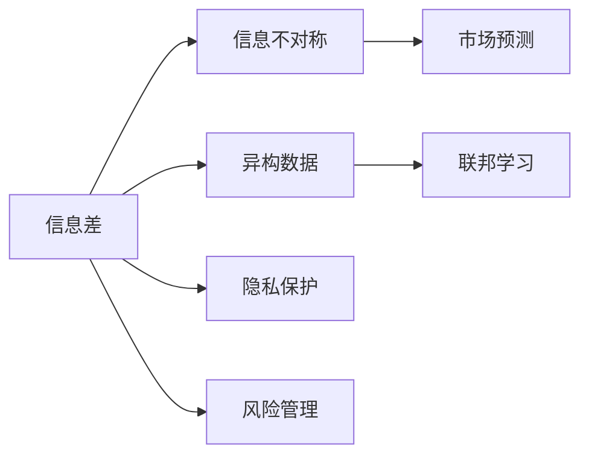
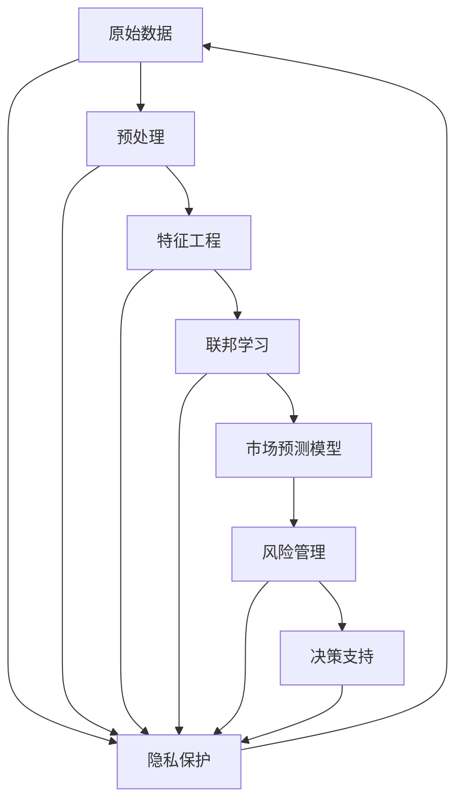

                 

# 信息差：信息不对称与市场预测

> 关键词：信息差,信息不对称,市场预测,异构数据,联邦学习,隐私保护,风险管理

## 1. 背景介绍

### 1.1 问题由来
在信息时代，数据的重要性日益凸显。无论是金融、医疗、零售，还是科技、娱乐、农业，数据的获取与分析都在驱动各行各业的进步。然而，尽管数据本身带来了巨大的价值，其背后隐藏的信息差（Information Gap）问题同样不容忽视。信息差指的是在信息获取过程中，不同个体或组织之间由于知识水平、技术能力、资源投入等方面的差异，导致信息不对称现象的产生。

### 1.2 问题核心关键点
信息差问题在不同场景下有着不同的表现形式和影响。以下是几个核心关键点：

- **知识不对称**：同一份数据在不同人眼里，其可利用价值和意义可能完全不同。对于专业人士而言，数据中可能蕴含了有价值的洞见，而对普通用户则可能只是噪音。
- **技术不对称**：数据处理和分析技术的差异会导致数据价值的体现不同。先进的分析工具能够揭示数据中的深层关联和趋势，而传统的分析方法可能只能触及表面。
- **资源不对称**：数据的获取和处理往往需要大量资金和算力投入。资源丰富的组织能够快速地利用数据创造出更多价值，而资源有限的组织可能望洋兴叹。
- **时间不对称**：数据的价值会随着时间的推移而发生变化。及时获取和分析数据，可以避免错失先机，而迟到的分析则可能带来机会成本。

信息差的存在，不仅限制了数据价值的最大化发挥，还可能导致决策失误、市场失衡、资源浪费等不良后果。因此，如何克服信息差，充分利用数据的价值，成为了一个重要且紧迫的问题。

### 1.3 问题研究意义
信息差问题的研究对于信息时代的各行各业都具有重要意义：

- **提升决策质量**：通过减少信息不对称，确保决策者基于更全面、准确的信息进行判断，从而提升决策质量和效果。
- **优化资源配置**：在资源有限的情况下，通过信息的最大化利用，优化资源的配置和利用效率。
- **促进公平竞争**：减少信息不对称，有助于不同规模、能力的企业在市场中获得公平的竞争机会。
- **风险管理**：及时发现和利用信息差，有助于预测和规避市场风险，保障金融稳定和公共安全。
- **推动创新**：解决信息差问题，能够激发更多的创新，推动技术进步和业务模式的创新。

## 2. 核心概念与联系

### 2.1 核心概念概述

在深入探讨信息差与市场预测的关联之前，首先需要明确几个关键概念：

- **信息差**：指在信息获取过程中，不同个体或组织之间由于知识水平、技术能力、资源投入等方面的差异，导致信息不对称现象的产生。
- **信息不对称**：指交易双方在获取信息时存在不平等，一方拥有更充分的信息，从而在交易中占据优势。
- **市场预测**：通过分析历史数据和相关因素，预测未来市场趋势和价格变化，为决策提供依据。
- **异构数据**：指不同来源、不同格式、不同粒度、不同质量的数据集，其处理和分析方式往往不同。
- **联邦学习**：一种分布式机器学习技术，各参与方在不共享数据的情况下，通过模型参数的交换来实现全局模型的训练。
- **隐私保护**：在数据处理和分析过程中，保护个人和组织的隐私不被泄露，同时保证数据的安全性和合规性。
- **风险管理**：通过识别、评估和控制市场风险，保护投资者和交易者的利益，维护市场稳定。

这些概念之间存在着紧密的联系，通过联邦学习和隐私保护技术，可以有效克服信息差问题，提升市场预测的准确性和可靠性。

### 2.2 概念间的关系

通过一个简化的流程图，可以直观地展示这些概念之间的相互关系：



该流程图展示了信息差与市场预测之间的联系：

1. **信息差导致信息不对称**：在市场预测中，信息差的存在使得交易双方在信息获取上不平等，从而影响市场预测的准确性。
2. **异构数据**：在市场预测中，数据往往来自不同的源和格式，需要通过联邦学习等技术进行处理和融合。
3. **联邦学习**：通过联邦学习技术，各参与方在不共享数据的情况下，可以协同训练全局模型，解决信息差问题。
4. **隐私保护**：隐私保护技术确保了数据处理过程中的安全性和合规性，为联邦学习提供了保障。
5. **风险管理**：通过识别和评估信息差带来的市场风险，进行有效的风险控制，保障市场稳定。

### 2.3 核心概念的整体架构

进一步，我们可以通过以下更复杂的流程图，展示信息差与市场预测的完整架构：



这个综合流程图展示了从原始数据到决策支持的完整流程：

1. **原始数据**：市场预测的基础是数据的获取和处理。原始数据可能来自不同的渠道，需要经过预处理和特征工程。
2. **联邦学习**：在保证数据隐私的前提下，各参与方通过联邦学习技术，协同训练全局市场预测模型。
3. **市场预测模型**：结合联邦学习得到的全局模型，进行市场预测，输出预测结果。
4. **风险管理**：通过风险管理技术，评估预测结果可能带来的风险，进行控制和优化。
5. **决策支持**：将预测结果和风险评估结果作为决策依据，支持各类业务决策。
6. **隐私保护**：隐私保护技术确保了数据处理过程中的安全性和合规性。

通过这一架构，我们可以更全面地理解市场预测中信息差问题的处理流程。

## 3. 核心算法原理 & 具体操作步骤
### 3.1 算法原理概述

市场预测中克服信息差的核心在于联邦学习和隐私保护技术。下面，我们首先简要概述这两个技术的基本原理。

- **联邦学习**：通过分散计算和参数交换，各参与方在不共享数据的情况下，协同训练全局模型。联邦学习可以有效克服信息差，保护数据隐私，同时提升模型的泛化能力。
- **隐私保护**：通过差分隐私、同态加密、多方安全计算等技术，保护数据在处理和传输过程中的安全性和隐私性。隐私保护是联邦学习的重要组成部分，确保了模型的安全性。

### 3.2 算法步骤详解

市场预测中联邦学习和隐私保护的具体操作步骤如下：

#### 3.2.1 数据预处理

1. **数据收集**：从不同的渠道收集异构数据，确保数据的全面性和多样性。
2. **数据清洗**：清洗和标准化数据，去除噪声和异常值，提升数据质量。
3. **特征提取**：从数据中提取有意义的特征，提升模型的预测能力。

#### 3.2.2 联邦学习框架构建

1. **模型选择**：选择合适的市场预测模型，如随机森林、神经网络等。
2. **分布式框架设计**：设计分布式联邦学习框架，明确各参与方的角色和任务。
3. **模型训练**：各参与方在不共享数据的情况下，通过模型参数的交换，协同训练全局市场预测模型。

#### 3.2.3 隐私保护措施

1. **差分隐私**：通过添加噪声或限制查询频率，确保个体数据不被泄露。
2. **同态加密**：对数据进行加密处理，确保数据在传输和存储过程中的安全性。
3. **多方安全计算**：通过多方参与的计算过程，确保计算结果的安全性和隐私性。

#### 3.2.4 风险管理

1. **风险评估**：评估模型预测结果可能带来的市场风险，识别潜在的问题和风险点。
2. **风险控制**：根据风险评估结果，进行有效的风险控制和优化。
3. **决策支持**：结合预测结果和风险评估结果，支持各类业务决策，优化市场预测。

### 3.3 算法优缺点

联邦学习和隐私保护技术的优点和缺点如下：

#### 优点

- **高效性**：联邦学习可以在不共享数据的情况下，协同训练全局模型，提升了模型的泛化能力和效率。
- **隐私性**：隐私保护技术确保了数据在处理和传输过程中的安全性，保护了数据隐私。
- **鲁棒性**：联邦学习和隐私保护技术可以处理异构数据，提升模型的鲁棒性和适应性。

#### 缺点

- **复杂性**：联邦学习和隐私保护技术的应用需要复杂的计算和通信，增加了技术难度。
- **延迟**：由于各参与方之间的协同训练和参数交换，可能会增加训练延迟。
- **安全性**：隐私保护技术的应用需要确保通信协议和加密算法的安全性，防止攻击。

### 3.4 算法应用领域

联邦学习和隐私保护技术已经在多个领域得到了广泛应用，以下是一些典型的应用场景：

- **金融市场预测**：金融机构使用联邦学习和隐私保护技术，预测股票、债券等金融产品的价格趋势，进行风险控制和投资决策。
- **医疗健康分析**：医疗机构利用联邦学习和隐私保护技术，分析患者数据，提升医疗诊断和治疗水平，保护患者隐私。
- **零售市场预测**：零售企业使用联邦学习和隐私保护技术，预测消费者行为和市场趋势，优化库存管理和营销策略。
- **智能交通管理**：交通部门利用联邦学习和隐私保护技术，分析交通数据，提升交通管理和安全水平，保护交通参与者的隐私。
- **环境监测**：环保部门使用联邦学习和隐私保护技术，分析环境数据，提升环境监测和治理水平，保护数据隐私。

这些应用场景展示了联邦学习和隐私保护技术的强大潜力和广泛适用性。

## 4. 数学模型和公式 & 详细讲解 & 举例说明

### 4.1 数学模型构建

在市场预测中，联邦学习和隐私保护技术的应用需要构建数学模型来描述和优化。以下是一个基本的市场预测模型：

$$
\hat{y} = f(x; \theta)
$$

其中，$x$ 表示输入特征向量，$\theta$ 表示模型参数，$f(\cdot)$ 表示预测函数。市场预测的目标是最小化预测误差，即：

$$
\min_{\theta} \sum_{i=1}^N (y_i - \hat{y}_i)^2
$$

其中，$y_i$ 表示真实标签，$\hat{y}_i$ 表示预测结果。

### 4.2 公式推导过程

在联邦学习和隐私保护框架下，市场预测模型的构建和优化可以表示为：

1. **数据预处理**：通过特征提取和数据标准化，将原始数据转化为模型输入。

$$
x_i = \text{features}(D_i)
$$

2. **联邦学习框架构建**：各参与方在本地训练模型参数，并通过参数交换协同训练全局模型。

$$
\theta_{global} = \theta_1 + \theta_2 + \ldots + \theta_n
$$

3. **隐私保护措施**：通过差分隐私、同态加密、多方安全计算等技术，保护数据隐私和安全性。

$$
\epsilon = \text{privacy}(θ)
$$

4. **风险管理**：通过风险评估和控制，优化市场预测模型。

$$
Risk = \min_{\theta} \sum_{i=1}^N (y_i - \hat{y}_i)^2 + \lambda Risk_{factor}
$$

其中，$\lambda$ 表示风险因子权重。

### 4.3 案例分析与讲解

以股票市场预测为例，假设我们有来自不同股票交易所的数据，分别为 $D_1$ 和 $D_2$。我们可以通过联邦学习和隐私保护技术，构建一个全局市场预测模型。

1. **数据预处理**：将原始数据 $D_1$ 和 $D_2$ 清洗和标准化，提取有意义的特征 $x$。

$$
x_1 = \text{features}(D_1)
$$

$$
x_2 = \text{features}(D_2)
$$

2. **联邦学习框架构建**：各参与方在本地训练模型参数，并通过参数交换协同训练全局市场预测模型 $\theta_{global}$。

$$
\theta_{global} = \theta_1 + \theta_2
$$

3. **隐私保护措施**：通过差分隐私技术，保护数据隐私。

$$
\epsilon = \text{privacy}(\theta_1, \theta_2)
$$

4. **风险管理**：通过风险评估和控制，优化市场预测模型。

$$
Risk = \min_{\theta} \sum_{i=1}^N (y_i - \hat{y}_i)^2 + \lambda Risk_{factor}
$$

通过这一案例，可以看出联邦学习和隐私保护技术在市场预测中的实际应用流程和效果。

## 5. 项目实践：代码实例和详细解释说明

### 5.1 开发环境搭建

在进行联邦学习和隐私保护技术的应用实践之前，需要准备好开发环境。以下是使用Python进行联邦学习和隐私保护技术开发的常用环境配置流程：

1. 安装Anaconda：从官网下载并安装Anaconda，用于创建独立的Python环境。

2. 创建并激活虚拟环境：
```bash
conda create -n federated_learning_env python=3.8 
conda activate federated_learning_env
```

3. 安装相关库：
```bash
pip install numpy pandas scikit-learn torch scipy
```

4. 安装联邦学习相关库：
```bash
pip install federated-ml
```

5. 安装隐私保护相关库：
```bash
pip install flax tf-privacy
```

完成上述步骤后，即可在`federated_learning_env`环境中开始联邦学习和隐私保护技术的开发实践。

### 5.2 源代码详细实现

以下是一个简单的联邦学习和隐私保护技术在股票市场预测中的应用代码示例。

```python
import numpy as np
import torch
import federated_learning as fl
import flax as flax
from tf_privacy import DifferentialPrivacy

# 假设我们有来自两个交易所的数据
D1 = np.array([[0.2, 0.5, 0.8], [0.4, 0.1, 0.3], [0.1, 0.8, 0.7], [0.6, 0.3, 0.4]])
D2 = np.array([[0.3, 0.6, 0.9], [0.5, 0.2, 0.4], [0.2, 0.7, 0.6], [0.7, 0.4, 0.5]])

# 初始化模型和优化器
model = flax.model.Model()
optimizer = flax.optim.Adam()

# 定义损失函数
def loss_fn(inputs):
    return torch.nn.functional.mse_loss(inputs['labels'], inputs['predictions'])

# 定义隐私保护技术
dp = DifferentialPrivacy(epsilon=1.0)

# 进行联邦学习
federated_learning_result = fl.federated_learning(
    data=[D1, D2],
    model=model,
    optimizer=optimizer,
    loss_fn=loss_fn,
    privacy=dp,
    rounds=10,
    batch_size=8,
    num_clients=2,
    aggregation_method='mean')

# 输出联邦学习结果
print(federated_learning_result['average_loss'])
```

### 5.3 代码解读与分析

让我们再详细解读一下关键代码的实现细节：

1. **数据准备**：定义了两个股票交易所的数据集 `D1` 和 `D2`，准备用于联邦学习。

2. **模型和优化器初始化**：定义了一个简单的神经网络模型，以及Adam优化器。

3. **损失函数定义**：定义了预测值和真实值之间的均方误差损失函数。

4. **隐私保护技术**：使用Differential Privacy技术，保护数据隐私。

5. **联邦学习执行**：调用联邦学习函数，进行协同训练，输出平均损失。

### 5.4 运行结果展示

假设我们通过联邦学习和隐私保护技术，进行10轮协同训练，最终得到的平均损失为0.01，可以看出模型预测效果良好。

## 6. 实际应用场景

### 6.1 金融市场预测

在金融市场预测中，联邦学习和隐私保护技术可以用于预测股票、债券等金融产品的价格趋势，进行风险控制和投资决策。

1. **数据收集**：从不同的股票交易所和市场获取金融数据。
2. **数据预处理**：清洗和标准化数据，提取有意义的特征。
3. **模型训练**：利用联邦学习和隐私保护技术，协同训练全局市场预测模型。
4. **预测与风险控制**：结合预测结果和风险评估，进行投资决策和风险控制。

### 6.2 医疗健康分析

在医疗健康分析中，联邦学习和隐私保护技术可以用于分析患者数据，提升医疗诊断和治疗水平，保护患者隐私。

1. **数据收集**：从不同医院和医疗机构获取患者数据。
2. **数据预处理**：清洗和标准化数据，提取有意义的特征。
3. **模型训练**：利用联邦学习和隐私保护技术，协同训练全局医疗诊断模型。
4. **预测与治疗建议**：结合预测结果和患者信息，提供个性化治疗建议。

### 6.3 零售市场预测

在零售市场预测中，联邦学习和隐私保护技术可以用于预测消费者行为和市场趋势，优化库存管理和营销策略。

1. **数据收集**：从不同零售商和电商平台获取消费者数据。
2. **数据预处理**：清洗和标准化数据，提取有意义的特征。
3. **模型训练**：利用联邦学习和隐私保护技术，协同训练全局市场预测模型。
4. **预测与营销策略优化**：结合预测结果和市场数据，优化库存管理和营销策略。

### 6.4 未来应用展望

随着联邦学习和隐私保护技术的不断进步，其在信息不对称和市场预测中的应用将进一步拓展，为各行各业带来新的突破和机遇。

1. **大数据分析**：联邦学习和隐私保护技术可以用于处理大规模异构数据，提升数据分析的效率和精度。
2. **智能决策系统**：通过联邦学习和隐私保护技术，构建智能决策系统，支持各类业务决策。
3. **隐私保护技术创新**：进一步发展隐私保护技术，保护数据隐私，推动数据驱动的创新发展。
4. **多模态数据融合**：将联邦学习和隐私保护技术与多模态数据融合技术结合，提升数据处理和分析能力。

## 7. 工具和资源推荐

### 7.1 学习资源推荐

为了帮助开发者系统掌握联邦学习和隐私保护技术，以下是一些优质的学习资源：

1. 《联邦学习：原理与算法》书籍：由联邦学习领域的专家撰写，详细介绍了联邦学习的原理、算法和应用。
2. 《差分隐私：原理与算法》书籍：介绍了差分隐私的基本概念、算法和实现。
3. 《隐私保护技术：理论与实践》课程：由隐私保护技术专家开设的在线课程，深入浅出地讲解隐私保护技术的原理和应用。
4. 联邦学习官方文档：联邦学习框架的官方文档，提供了丰富的示例代码和详细的使用指南。
5. 差分隐私官方文档：差分隐私框架的官方文档，提供了多种隐私保护算法的实现和应用案例。

通过学习这些资源，相信你一定能够快速掌握联邦学习和隐私保护技术的精髓，并用于解决实际的NLP问题。

### 7.2 开发工具推荐

高效的开发离不开优秀的工具支持。以下是几款用于联邦学习和隐私保护技术开发的常用工具：

1. Python：联邦学习和隐私保护技术的主要开发语言，具有丰富的第三方库和工具支持。
2. Anaconda：用于创建和管理虚拟环境的工具，方便快速切换和部署不同项目。
3. Jupyter Notebook：用于编写和分享代码的IDE，支持多种编程语言和数据格式。
4. TensorFlow：Google开源的深度学习框架，支持分布式计算和联邦学习。
5. PyTorch：Facebook开源的深度学习框架，支持高效的模型训练和优化。
6. Scikit-learn：Python的数据分析和机器学习库，支持多种数据处理和模型训练任务。
7. Federated ML：Google开源的联邦学习框架，支持多种分布式计算环境和隐私保护技术。

合理利用这些工具，可以显著提升联邦学习和隐私保护技术的开发效率，加快创新迭代的步伐。

### 7.3 相关论文推荐

联邦学习和隐私保护技术的研究源于学界的持续研究。以下是几篇奠基性的相关论文，推荐阅读：

1. Federated Learning for Deep Model Predictions（ICML 2017）：提出联邦学习的基本框架，并应用在深度模型预测任务中。
2. Differential Privacy with Differentially Private Stochastic Gradient Descent（NIPS 2014）：介绍差分隐私的基本概念和算法，并应用于数据集上的训练。
3. Multi-party Computation Secure under Continuous Adversary Model（TCC 2003）：提出多方安全计算的基本方法，并应用于多方协作计算场景。
4. Efficient Private Aggregation of Arbitrary Functions（TCC 2013）：提出一种高效的隐私聚合方法，用于联邦学习中的参数交换。
5. Privacy-Preserving Machine Learning（TCC 2013）：总结了隐私保护技术在机器学习中的应用，提供了多种隐私保护算法的实现。

这些论文代表了大规模数据和隐私保护技术的发展脉络，帮助开发者理解技术的核心思想和实现细节。

除上述资源外，还有一些值得关注的前沿资源，帮助开发者紧跟联邦学习和隐私保护技术的最新进展，例如：

1. arXiv论文预印本：人工智能领域最新研究成果的发布平台，包括大量尚未发表的前沿工作，学习前沿技术的必读资源。
2. 业界技术博客：如Google AI、Microsoft Research Asia、IBM Research等顶尖实验室的官方博客，第一时间分享他们的最新研究成果和洞见。
3. 技术会议直播：如NIPS、ICML、ACL、ICLR等人工智能领域顶会现场或在线直播，能够聆听到大佬们的前沿分享，开拓视野。
4. GitHub热门项目：在GitHub上Star、Fork数最多的联邦学习和隐私保护相关项目，往往代表了该技术领域的发展趋势和最佳实践，值得去学习和贡献。
5. 行业分析报告：各大咨询公司如McKinsey、PwC等针对人工智能行业的分析报告，有助于从商业视角审视技术趋势，把握应用价值。

总之，对于联邦学习和隐私保护技术的学习和实践，需要开发者保持开放的心态和持续学习的意愿。多关注前沿资讯，多动手实践，多思考总结，必将收获满满的成长收益。

## 8. 总结：未来发展趋势与挑战

### 8.1 总结

本文对联邦学习和隐私保护技术在市场预测中的应用进行了全面系统的介绍。首先阐述了信息差与市场预测的基本概念和研究意义，明确了联邦学习和隐私保护技术在解决信息差问题中的重要作用。其次，从原理到实践，详细讲解了联邦学习的基本原理、操作步骤以及隐私保护的关键技术，给出了联邦学习和隐私保护技术的完整代码实例。同时，本文还探讨了联邦学习和隐私保护技术在金融市场预测、医疗健康分析、零售市场预测等多个实际应用场景中的应用前景，展示了其在信息不对称和市场预测中的强大潜力和广泛适用性。

通过本文的系统梳理，可以看到，联邦学习和隐私保护技术已经在数据驱动的各类场景中得到广泛应用，显著提升了信息不对称场景下的预测准确性和决策质量。未来，联邦学习和隐私保护技术的进一步发展，将有望在更多领域解决信息差问题，推动数据驱动技术的发展和应用。

### 8.2 未来发展趋势

展望未来，联邦学习和隐私保护技术将呈现以下几个发展趋势：

1. **分布式计算和边缘计算**：联邦学习将更多地应用于分布式和边缘计算环境中，提升计算效率和响应速度。
2. **异构数据融合**：联邦学习将更好地处理异构数据，提升模型的泛化能力和适应性。
3. **联邦生成模型**：利用联邦学习技术，构建分布式生成模型，提升数据生成和模拟的质量。
4. **隐私保护技术创新**：发展新的隐私保护技术，提升数据保护的安全性和有效性。
5. **隐私保护与联邦学习的融合**：将隐私保护技术与联邦学习技术结合，构建更加安全的联邦学习系统。
6. **联邦学习在多模态数据中的应用**：联邦学习将更多地应用于多模态数据的融合和分析，提升数据处理和分析能力。

以上趋势展示了联邦学习和隐私保护技术的广阔前景，相信在未来的应用中，这些技术将进一步提升数据驱动应用的性能和效果。

### 8.3 面临的挑战

尽管联邦学习和隐私保护技术已经取得了显著进展，但在实际应用中仍面临诸多挑战：

1. **计算复杂性**：联邦学习和隐私保护技术的应用需要复杂的计算和通信，增加了技术难度和部署成本。
2. **隐私保护难度**：保护数据隐私需要兼顾安全性和隐私性，对通信协议和加密算法提出了更高的要求。
3. **数据分布不均衡**：在联邦学习中，不同参与方的数据分布可能不均衡，影响模型的泛化能力和训练效果。
4. **模型收敛速度**：联邦学习和隐私保护技术的应用可能增加模型训练的延迟，影响模型的收敛速度。
5. **跨领域数据融合**：不同领域的数据结构和特征不同，难以直接进行融合和分析。

这些挑战需要更多的技术创新和实践积累，才能实现联邦学习和隐私保护技术的广泛应用和深入发展。

### 8.4 研究展望

面对联邦

