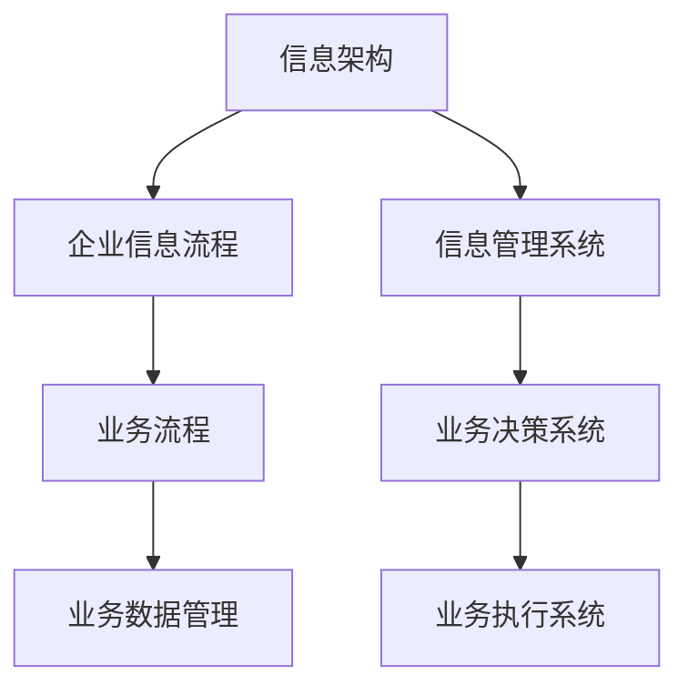
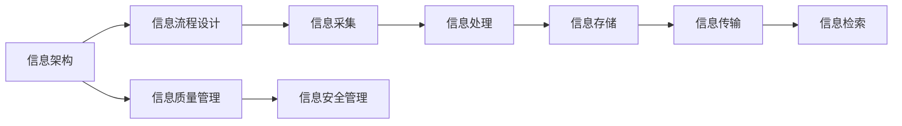
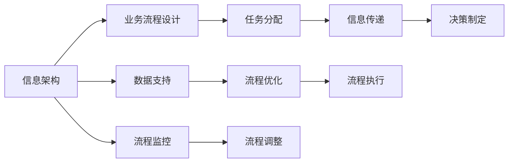
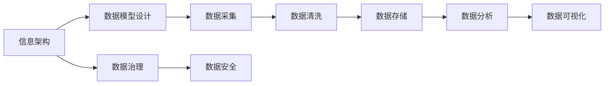
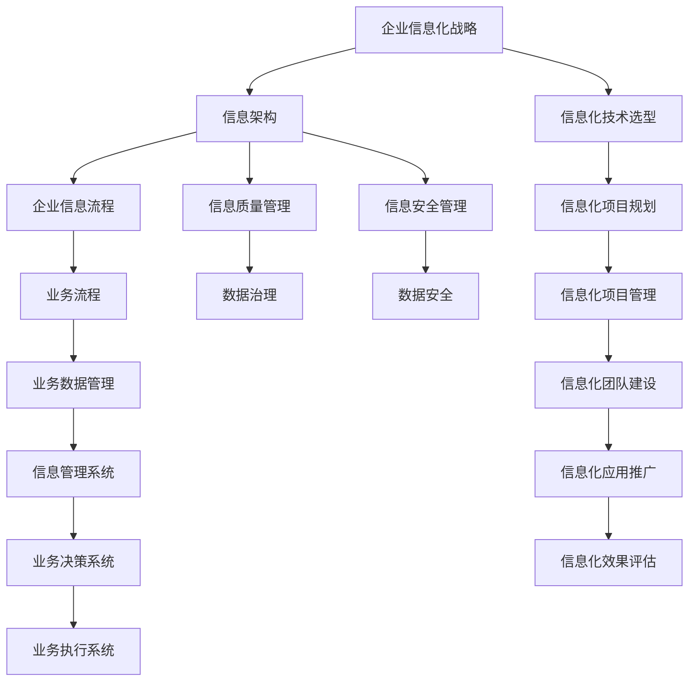

                 

# 信息搭建、企业信息流程、业务流程、业务数据管理系统搭建

> 关键词：信息架构、企业信息流程、业务流程、业务数据管理、信息系统搭建、数据管理、流程优化、数字化转型、软件架构、企业信息化、业务智能化

## 1. 背景介绍

### 1.1 问题由来
随着数字化浪潮的不断推进，企业信息化建设成为各行各业提升竞争力的重要手段。信息架构（Information Architecture, IA）作为信息化建设的核心，是连接企业业务流程与信息系统的桥梁。构建科学合理的信息架构，能够有效整合和管理企业各类信息资源，支撑企业决策、运营和管理活动，最终实现业务流程的自动化和智能化。

然而，信息架构的构建并非易事。传统的企业信息化建设往往缺乏顶层设计和系统规划，导致信息孤岛、数据冗余、系统烟囱等问题频出，严重影响了企业的信息共享和业务协同。因此，如何在数字化转型中有效搭建信息架构，提升企业信息流程和业务流程的效率，成为企业信息化建设的关键问题。

### 1.2 问题核心关键点
构建信息架构的关键在于：
1. 明确企业业务流程和信息需求，设计合理的企业信息流程。
2. 选择合适的技术架构和工具，搭建高效的企业信息系统。
3. 设计科学的数据管理体系，保障企业信息的安全、准确和高效。
4. 实施灵活的流程优化策略，提升企业运营效率。

## 2. 核心概念与联系

### 2.1 核心概念概述

为更好地理解信息架构的构建，本节将介绍几个密切相关的核心概念：

- 信息架构（Information Architecture, IA）：定义和设计信息系统的结构，包括信息内容、信息管理和信息检索等方面。IA的目标是实现信息的有效组织和利用，支持企业决策和运营。
- 企业信息流程（Enterprise Information Process, EIP）：描述企业信息在采集、处理、存储和传输等环节的流动过程，包括数据流、业务流、物流等多个维度。
- 业务流程（Business Process, BP）：定义企业内部各部门之间的合作流程，包括任务分配、信息传递、决策制定等活动。
- 业务数据管理（Business Data Management, BDM）：管理和维护企业内部的业务数据，包括数据收集、清洗、存储、分析、可视化和保护等方面。
- 信息管理系统（Information Management System, IMS）：利用信息技术对企业信息资源进行整合和管理的系统，支持企业决策、运营和管理活动。

这些核心概念之间的逻辑关系可以通过以下Mermaid流程图来展示：



这个流程图展示了信息架构与企业信息化各个环节的紧密联系：

1. 信息架构作为整个系统的顶层设计，指导和规范信息流程和业务流程的设计。
2. 企业信息流程描述了信息在系统中的流动路径，直接影响信息架构的实现。
3. 业务流程定义了企业内部各环节的活动，是信息流程的核心。
4. 业务数据管理提供了企业信息的基础支撑，保障信息的质量和安全性。
5. 信息管理系统是实现信息架构的工具，通过技术手段支持信息流程和业务流程的落地。

### 2.2 概念间的关系

这些核心概念之间存在着紧密的联系，形成了企业信息架构的完整生态系统。下面我们通过几个Mermaid流程图来展示这些概念之间的关系。

#### 2.2.1 信息架构与信息流程



这个流程图展示了信息架构与信息流程的具体实现：

1. 信息架构指导信息流程的设计，从信息采集到信息检索，每个环节都需要遵守IA的设计原则。
2. 信息流程的每个环节都需要对信息质量和安全进行管理，确保信息的一致性和安全性。

#### 2.2.2 信息架构与业务流程



这个流程图展示了信息架构与业务流程的融合：

1. 信息架构定义了业务流程的流程模型，支持流程的设计和优化。
2. 业务流程的执行需要信息的支撑，信息架构为业务流程提供数据支持。
3. 信息架构还负责对业务流程进行监控和调整，确保流程的顺畅执行。

#### 2.2.3 信息架构与数据管理



这个流程图展示了信息架构与数据管理的结合：

1. 信息架构定义了数据模型，指导数据的采集、清洗、存储和分析。
2. 数据治理和数据安全是信息架构的重要组成部分，保障数据的质量和安全。
3. 数据分析和数据可视化是信息架构的重要应用，提供决策支持。

### 2.3 核心概念的整体架构

最后，我们用一个综合的流程图来展示这些核心概念在大规模信息系统中的整体架构：



这个综合流程图展示了企业信息架构从战略规划到技术实现的完整过程：

1. 信息化战略为信息架构提供了顶层指导。
2. 信息架构设计了信息流程、业务流程和数据管理的基础架构。
3. 信息系统支持信息流程和业务流程的落地执行。
4. 信息质量管理和数据治理保障信息的一致性和安全性。
5. 信息化技术选型、项目管理、团队建设等活动支持信息架构的实现。

通过这些流程图，我们可以更清晰地理解企业信息架构的构建和应用，为后续深入讨论具体的信息架构设计和实施细节奠定基础。

## 3. 核心算法原理 & 具体操作步骤

### 3.1 算法原理概述

信息架构的构建和优化涉及多个领域的知识和技能，包括信息管理、业务流程优化、数据建模等。从算法角度来看，信息架构的构建可以分为以下几个主要步骤：

1. 需求分析：通过调查问卷、访谈等方式，了解企业各部门的业务需求和信息需求，明确信息架构的目标。
2. 信息模型设计：设计信息架构的逻辑模型，包括信息分类、数据字典、数据流图等，建立企业信息的结构和关系。
3. 流程模型设计：定义业务流程的流程模型，包括任务、角色、权限等，实现业务流程的自动化和智能化。
4. 数据模型设计：设计数据模型，包括数据实体、属性、关系等，支持数据的存储和分析。
5. 信息架构实现：选择合适的技术架构和工具，搭建信息管理系统，实现信息架构的落地。
6. 效果评估：对信息架构的效果进行评估，收集反馈，不断优化和调整。

### 3.2 算法步骤详解

信息架构的构建过程复杂，涉及多个环节和阶段，以下是对这些步骤的详细说明：

#### 3.2.1 需求分析

需求分析是信息架构构建的第一步，通过深入了解企业各部门的业务需求和信息需求，明确信息架构的目标。

1. 数据收集：通过调查问卷、访谈等方式，收集企业各部门的需求信息。
2. 数据分析：对收集到的需求信息进行分析，识别出企业的主要业务流程和信息需求。
3. 需求建模：将需求信息建模为信息架构的需求模型，明确信息架构的目标和范围。

#### 3.2.2 信息模型设计

信息模型设计是信息架构构建的核心，通过设计信息架构的逻辑模型，建立企业信息的结构和关系。

1. 信息分类：将企业信息分为不同的类别，如客户信息、财务信息、运营信息等，明确信息的类型和范围。
2. 数据字典：设计数据字典，定义数据实体和属性，建立数据的标准化规范。
3. 数据流图：设计数据流图，描述企业信息在系统中的流动路径，明确信息的来源和去向。

#### 3.2.3 流程模型设计

流程模型设计是信息架构构建的重要环节，通过定义业务流程的流程模型，实现业务流程的自动化和智能化。

1. 任务设计：定义业务流程中的任务，明确任务的执行者和执行步骤。
2. 角色设计：定义业务流程中的角色，明确角色在流程中的职责和权限。
3. 权限设计：设计业务流程中的权限控制，保障信息的安全和合规。

#### 3.2.4 数据模型设计

数据模型设计是信息架构构建的关键，通过设计数据模型，支持数据的存储和分析。

1. 数据实体设计：设计数据实体，明确数据的存储和访问方式。
2. 数据关系设计：设计数据关系，建立数据实体之间的关系，支持数据的查询和分析。
3. 数据安全设计：设计数据安全机制，保障数据的安全和合规。

#### 3.2.5 信息架构实现

信息架构的实现是将信息架构设计转化为可执行的信息管理系统，主要包括以下步骤：

1. 技术选型：选择合适的技术架构和工具，搭建信息管理系统，支持信息流程和业务流程的落地。
2. 系统设计：设计信息管理系统的详细架构，包括界面设计、功能设计、数据设计等。
3. 系统开发：根据系统设计，开发信息管理系统的具体功能模块，实现信息架构的落地。
4. 系统测试：对信息管理系统进行测试，确保系统的稳定性和可靠性。

#### 3.2.6 效果评估

效果评估是信息架构构建的最后一个环节，通过收集反馈，不断优化和调整信息架构，确保其适应企业发展的需要。

1. 评估指标：设计信息架构的评估指标，包括系统性能、信息质量、用户满意度等。
2. 数据收集：收集用户反馈和系统使用数据，进行评估分析。
3. 优化调整：根据评估结果，对信息架构进行优化和调整，提升信息架构的效果。

### 3.3 算法优缺点

信息架构的构建涉及多个领域的知识和技能，以下是对其优缺点的详细说明：

#### 3.3.1 优点

1. 提高信息共享和协作效率：通过合理的信息架构设计，实现信息的有效组织和利用，提高信息共享和协作效率。
2. 支持企业决策和运营：信息架构提供了企业决策和运营所需的信息支持，提升决策的科学性和运营的智能化。
3. 优化业务流程和数据管理：通过信息架构的优化设计，实现业务流程的自动化和数据管理的规范化，提升企业的运营效率和数据质量。
4. 适应企业发展需要：信息架构能够随着企业的发展和变化进行动态调整，满足企业发展的需要。

#### 3.3.2 缺点

1. 设计复杂度较高：信息架构的构建涉及多个领域的知识和技能，设计复杂度较高，需要多学科协作完成。
2. 数据隐私和安全问题：信息架构涉及大量的数据存储和传输，数据隐私和安全问题需要特别关注。
3. 实施成本较高：信息架构的构建和优化需要大量的人力、物力和时间成本，实施成本较高。
4. 技术更新速度快：信息架构需要紧跟技术发展的步伐，技术更新速度快，需要不断进行优化和调整。

### 3.4 算法应用领域

信息架构的应用领域广泛，以下是对其主要应用场景的详细说明：

1. 企业信息化建设：信息架构是企业信息化建设的核心，支持企业决策、运营和管理活动。
2. 业务流程自动化：信息架构提供了业务流程的流程模型，支持业务流程的自动化和智能化。
3. 数据管理和分析：信息架构设计了数据模型，支持数据的存储和分析，实现数据的可视化和决策支持。
4. 系统集成和互操作：信息架构通过标准化接口和数据格式，实现系统之间的集成和互操作，提升系统的综合能力。

## 4. 数学模型和公式 & 详细讲解 & 举例说明

### 4.1 数学模型构建

信息架构的构建涉及多个领域的知识和技能，以下是对其数学模型的详细说明。

1. 信息分类：通过数学方法对企业信息进行分类，建立信息分类的标准。
2. 数据字典：通过数学方法定义数据字典，建立数据的标准化规范。
3. 数据流图：通过数学方法描述企业信息在系统中的流动路径，明确信息的来源和去向。
4. 任务设计：通过数学方法定义业务流程中的任务，明确任务的执行者和执行步骤。
5. 角色设计：通过数学方法定义业务流程中的角色，明确角色在流程中的职责和权限。
6. 权限设计：通过数学方法设计业务流程中的权限控制，保障信息的安全和合规。
7. 数据模型设计：通过数学方法设计数据模型，支持数据的存储和分析。

### 4.2 公式推导过程

以下是对信息架构构建中各个数学模型的详细推导过程：

#### 4.2.1 信息分类模型

信息分类模型的推导过程如下：

1. 定义信息分类的标准：将企业信息分为不同的类别，如客户信息、财务信息、运营信息等。
2. 设计信息分类的关系：建立信息分类之间的层次关系，明确信息分类的层级结构。
3. 构建信息分类的数学模型：通过数学方法描述信息分类的层次结构，建立信息分类的数学模型。

#### 4.2.2 数据字典模型

数据字典模型的推导过程如下：

1. 定义数据字典的标准：设计数据字典，定义数据实体和属性。
2. 设计数据字典的关系：建立数据字典之间的关系，支持数据的查询和分析。
3. 构建数据字典的数学模型：通过数学方法描述数据字典的关系，建立数据字典的数学模型。

#### 4.2.3 数据流图模型

数据流图模型的推导过程如下：

1. 定义数据流图的标准：设计数据流图，描述企业信息在系统中的流动路径。
2. 设计数据流图的结构：建立数据流图的层次结构，明确信息在系统中的流动路径。
3. 构建数据流图的数学模型：通过数学方法描述数据流图的层次结构，建立数据流图的数学模型。

#### 4.2.4 任务设计模型

任务设计模型的推导过程如下：

1. 定义任务的标准：设计任务，明确任务的执行者和执行步骤。
2. 设计任务的关系：建立任务之间的关系，支持任务的协调和控制。
3. 构建任务模型的数学模型：通过数学方法描述任务的关系，建立任务模型的数学模型。

#### 4.2.5 角色设计模型

角色设计模型的推导过程如下：

1. 定义角色的标准：设计角色，明确角色在流程中的职责和权限。
2. 设计角色的关系：建立角色之间的关系，支持角色的协调和控制。
3. 构建角色模型的数学模型：通过数学方法描述角色的关系，建立角色模型的数学模型。

#### 4.2.6 权限设计模型

权限设计模型的推导过程如下：

1. 定义权限的标准：设计权限，明确权限的分配和控制。
2. 设计权限的关系：建立权限之间的关系，支持权限的协调和控制。
3. 构建权限模型的数学模型：通过数学方法描述权限的关系，建立权限模型的数学模型。

#### 4.2.7 数据模型设计模型

数据模型设计模型的推导过程如下：

1. 定义数据模型的标准：设计数据模型，明确数据的存储和访问方式。
2. 设计数据模型的关系：建立数据模型之间的关系，支持数据的查询和分析。
3. 构建数据模型的数学模型：通过数学方法描述数据模型的关系，建立数据模型的数学模型。

### 4.3 案例分析与讲解

以下是对信息架构构建中各个数学模型的案例分析和讲解：

#### 4.3.1 信息分类模型

某企业的信息分类模型如下：

1. 定义信息分类的标准：将企业信息分为客户信息、财务信息、运营信息等类别。
2. 设计信息分类的关系：建立信息分类之间的层次关系，如客户信息包括客户名称、地址、联系电话等。
3. 构建信息分类的数学模型：通过数学方法描述信息分类的层次结构，建立信息分类的数学模型。

#### 4.3.2 数据字典模型

某企业的数据字典模型如下：

1. 定义数据字典的标准：设计数据字典，定义数据实体和属性，如客户信息包括客户名称、地址、联系电话等。
2. 设计数据字典的关系：建立数据字典之间的关系，支持数据的查询和分析，如客户信息通过客户名称查询地址和联系电话。
3. 构建数据字典的数学模型：通过数学方法描述数据字典的关系，建立数据字典的数学模型。

#### 4.3.3 数据流图模型

某企业的数据流图模型如下：

1. 定义数据流图的标准：设计数据流图，描述企业信息在系统中的流动路径，如客户信息从客户系统传输到财务系统。
2. 设计数据流图的结构：建立数据流图的层次结构，明确信息在系统中的流动路径，如客户信息通过客户系统传输到财务系统。
3. 构建数据流图的数学模型：通过数学方法描述数据流图的层次结构，建立数据流图的数学模型。

#### 4.3.4 任务设计模型

某企业的任务设计模型如下：

1. 定义任务的标准：设计任务，明确任务的执行者和执行步骤，如客户信息查询任务由客户系统执行。
2. 设计任务的关系：建立任务之间的关系，支持任务的协调和控制，如客户信息查询任务完成后将结果传递给财务系统。
3. 构建任务模型的数学模型：通过数学方法描述任务的关系，建立任务模型的数学模型。

#### 4.3.5 角色设计模型

某企业的角色设计模型如下：

1. 定义角色的标准：设计角色，明确角色在流程中的职责和权限，如客户信息查询任务由客户管理员执行。
2. 设计角色的关系：建立角色之间的关系，支持角色的协调和控制，如客户管理员需要与财务管理员协作。
3. 构建角色模型的数学模型：通过数学方法描述角色的关系，建立角色模型的数学模型。

#### 4.3.6 权限设计模型

某企业的权限设计模型如下：

1. 定义权限的标准：设计权限，明确权限的分配和控制，如客户管理员需要查询客户信息。
2. 设计权限的关系：建立权限之间的关系，支持权限的协调和控制，如客户管理员的权限由系统管理员授权。
3. 构建权限模型的数学模型：通过数学方法描述权限的关系，建立权限模型的数学模型。

#### 4.3.7 数据模型设计模型

某企业的数据模型设计模型如下：

1. 定义数据模型的标准：设计数据模型，明确数据的存储和访问方式，如客户信息存储在数据库中。
2. 设计数据模型的关系：建立数据模型之间的关系，支持数据的查询和分析，如客户信息通过查询客户名称查询地址和联系电话。
3. 构建数据模型的数学模型：通过数学方法描述数据模型的关系，建立数据模型的数学模型。

## 5. 项目实践：代码实例和详细解释说明

### 5.1 开发环境搭建

在进行信息架构设计和实施前，我们需要准备好开发环境。以下是使用Python进行信息架构设计和实现的环境配置流程：

1. 安装Python：从官网下载并安装Python，建议选择最新稳定版本。
2. 安装Python库：安装用于信息架构设计和实现的Python库，如Pandas、Matplotlib、Numpy等。
3. 配置环境变量：将Python库的路径添加到系统环境变量中，方便后续调用。

### 5.2 源代码详细实现

这里我们以某企业的信息架构设计为例，给出使用Python进行信息架构设计和实现的基本代码实现。

首先，定义企业信息分类的字典：

```python
customer_info = {'客户名称': 'name', '地址': 'address', '联系电话': 'phone'}

# 定义客户信息的数据字典
customer_dict = {
    '客户名称': {'name': str, '长度': 10},
    '地址': {'address': str, '长度': 50},
    '联系电话': {'phone': str, '长度': 20}
}
```

然后，设计企业数据流图：

```python
# 定义数据流图
data_flow_graph = {
    '客户系统': ['客户信息', '财务系统'],
    '财务系统': ['财务信息', '客户系统'],
    '运营系统': ['运营信息', '财务系统']
}
```

接着，定义企业任务设计：

```python
# 定义任务设计
task_design = {
    '客户信息查询': {
        '执行者': '客户管理员',
        '执行步骤': ['输入客户名称', '查询客户信息', '输出查询结果']
    },
    '财务信息生成': {
        '执行者': '财务管理员',
        '执行步骤': ['输入客户信息', '生成财务信息', '输出财务信息']
    }
}
```

然后，定义企业角色设计：

```python
# 定义角色设计
role_design = {
    '客户管理员': {'职责': ['客户信息查询', '客户信息更新'], '权限': ['查询', '更新']},
    '财务管理员': {'职责': ['财务信息生成', '财务信息审核'], '权限': ['生成', '审核']}
}
```

最后，定义企业数据模型设计：

```python
# 定义数据模型设计
data_model_design = {
    '客户信息': {
        '数据实体': ['客户名称', '地址', '联系电话'],
        '数据关系': {'客户名称': 'address', '地址': 'phone'}
    },
    '财务信息': {
        '数据实体': ['财务编号', '金额', '时间'],
        '数据关系': {'财务编号': 'amount', '金额': 'time'}
    }
}
```

### 5.3 代码解读与分析

让我们再详细解读一下关键代码的实现细节：

**信息分类模型**：
- 使用字典定义信息分类的标准，如客户信息包括客户名称、地址、联系电话等。
- 设计信息分类的关系，建立信息分类之间的层次结构，如客户信息通过客户名称查询地址和联系电话。
- 构建信息分类的数学模型，描述信息分类的层次结构。

**数据字典模型**：
- 使用字典定义数据字典的标准，如客户信息包括客户名称、地址、联系电话等。
- 设计数据字典的关系，建立数据字典之间的关系，支持数据的查询和分析，如客户信息通过客户名称查询地址和联系电话。
- 构建数据字典的数学模型，描述数据字典的关系。

**数据流图模型**：
- 使用字典定义数据流图的标准，如客户信息从客户系统传输到财务系统。
- 设计数据流图的结构，建立数据流图的层次结构，明确信息在系统中的流动路径，如客户信息通过客户系统传输到财务系统。
- 构建数据流图的数学模型，描述数据流图的层次结构。

**任务设计模型**：
- 使用字典定义任务的标准，如客户信息查询任务由客户系统执行。
- 设计任务的关系，建立任务之间的关系，支持任务的协调和控制，如客户信息查询任务完成后将结果传递给财务系统。
- 构建任务模型的数学模型，描述任务的关系。

**角色设计模型**：
- 使用字典定义角色的标准，如客户信息查询任务由客户管理员执行。
- 设计角色的关系，建立角色之间的关系，支持角色的协调和控制，如客户管理员需要与财务管理员协作。
- 构建角色模型的数学模型，描述角色的关系。

**权限设计模型**：
- 使用字典定义权限的标准，如客户管理员需要查询客户信息。
- 设计权限的关系，建立权限之间的关系，支持权限的协调和控制，如客户管理员的权限由系统管理员授权。
- 构建权限模型的数学模型，描述权限的关系。

**数据模型设计模型**：
- 使用字典定义数据模型的标准，如客户信息存储在数据库中。
- 设计数据模型的关系，建立数据模型之间的关系，支持数据的查询和分析，如客户信息通过查询客户名称查询地址和联系电话。
- 构建数据模型的数学模型，描述数据模型的关系。

### 5.4 运行结果展示

假设我们在某企业内部进行信息架构设计，最终得到的信息架构模型如下：

1. 信息分类模型：将企业信息分为客户信息、财务信息、运营信息等类别。
2. 数据字典模型：设计数据字典，定义数据实体和属性，如客户信息包括客户名称、地址、联系电话等。
3. 数据流图模型：设计数据流图，描述企业信息在系统中的流动路径，如客户信息从客户系统传输到财务系统。
4. 任务设计模型：设计任务，明确任务的执行者和执行步骤，如客户信息查询任务由客户管理员执行。
5. 角色设计模型：设计角色

