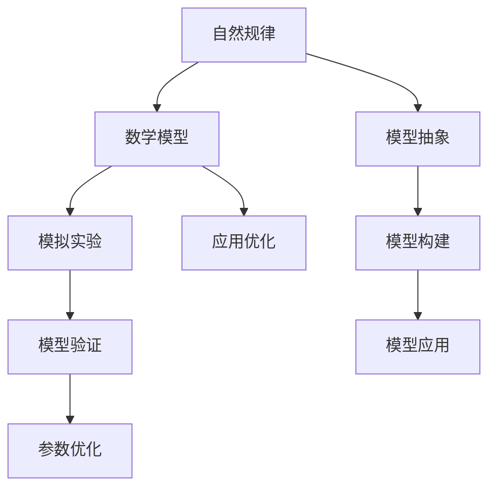

                 

# 像数学家一样思考：模拟原则

## 1. 背景介绍

### 1.1 问题由来
在计算机科学和人工智能领域，模仿自然界的原理和方法已经成为了重要的研究方向。数学模型，特别是那些借鉴自然规律的模拟原则，正被广泛应用于系统设计和算法优化中。模拟原则，即通过模拟自然界或人工系统中已知的规律和特性来构建模型的方法，已被证明是一种高效且灵活的建模手段。

### 1.2 问题核心关键点
数学模型中的模拟原则，指的是通过模仿和模拟自然界或人工系统的规律和特性来构建数学模型的方法。这种方法强调了从自然界或系统行为中提取普遍规律，并将其应用于模型构建，以提高模型的准确性和泛化能力。核心关键点包括：

- **模仿与抽象**：从现实世界或系统的行为中抽象出数学规律，构建简化模型。
- **模拟与验证**：通过模拟实验验证模型的有效性，调整参数以提升模拟精度。
- **应用与优化**：将模拟原则应用于实际问题中，优化系统性能，提升决策效率。

### 1.3 问题研究意义
模拟原则在计算机科学和人工智能中的应用，具有重要的理论和实践意义：

1. **提高模型精度**：通过模仿自然规律，模型能够更准确地预测和解释现实世界的行为，提高决策的科学性。
2. **增强泛化能力**：模拟原则强调从自然规律中提取共性，模型能够更好地适应新环境和数据，增强泛化能力。
3. **优化算法设计**：模拟自然界中的自适应和进化机制，设计更高效、更鲁棒的算法。
4. **促进跨学科合作**：模拟原则融合了数学、物理学、生物学等多学科知识，促进了不同领域之间的交流与合作。

## 2. 核心概念与联系

### 2.1 核心概念概述
在模拟原则中，涉及到的核心概念包括：

- **自然规律**：指自然界中的物理、生物、化学等定律和规则。
- **数学模型**：通过数学语言和符号构建的，用于描述现实世界或系统的规律和特性。
- **模拟实验**：通过数学模型进行模拟，预测系统行为和实验结果。
- **模型验证**：通过实际实验或数据分析，验证数学模型的准确性和有效性。
- **参数优化**：调整模型中的参数，以提升模型的预测精度和泛化能力。

### 2.2 概念间的关系
这些核心概念之间的逻辑关系可以通过以下Mermaid流程图来展示：



这个流程图展示了从自然规律到数学模型，再到模型构建和优化的完整过程。

## 3. 核心算法原理 & 具体操作步骤

### 3.1 算法原理概述
模拟原则的核心算法原理是通过模仿自然规律，构建数学模型，并使用模拟实验验证和优化模型。核心步骤包括：

1. **模型构建**：从自然规律中提取共性，构建数学模型。
2. **模拟实验**：使用数学模型进行模拟实验，预测系统行为。
3. **模型验证**：通过实际实验或数据分析，验证模型的有效性。
4. **参数优化**：调整模型中的参数，以提高模型的预测精度和泛化能力。

### 3.2 算法步骤详解
1. **模型构建**
   - **步骤1**：确定建模目标和关键参数，如物理系统、环境变量等。
   - **步骤2**：根据目标和参数，选择适合的数学模型和符号表示方法。
   - **步骤3**：利用数学模型描述系统行为，简化复杂性。

2. **模拟实验**
   - **步骤1**：设定模拟场景和条件，准备输入数据。
   - **步骤2**：将输入数据代入数学模型，进行计算和模拟。
   - **步骤3**：记录模拟结果，分析预测结果和实际结果的差异。

3. **模型验证**
   - **步骤1**：设计实验或数据分析，验证模型的准确性和有效性。
   - **步骤2**：通过对比预测结果和实际结果，计算误差和偏差。
   - **步骤3**：根据误差和偏差，调整模型参数，提升模拟精度。

4. **参数优化**
   - **步骤1**：确定影响模型精度的关键参数，如模型系数、参数范围等。
   - **步骤2**：使用优化算法，如梯度下降、遗传算法等，调整参数。
   - **步骤3**：评估参数调整后的模型性能，选择最优参数。

### 3.3 算法优缺点
**优点**：
- **灵活性高**：模仿自然规律，适用范围广泛，能够适应多种复杂系统。
- **预测精度高**：通过大量数据和实验验证，模型能够提供较高的预测精度。
- **泛化能力强**：模型能够适应新环境和数据，具有较强的泛化能力。

**缺点**：
- **计算复杂度高**：构建复杂模型和进行大量模拟实验，计算复杂度较高。
- **参数优化难度大**：参数优化需要大量的实验和调整，过程较为繁琐。
- **模型依赖性强**：模型构建依赖于对自然规律的理解和抽象能力，要求较高。

### 3.4 算法应用领域
模拟原则广泛应用于以下领域：

- **物理学**：通过模拟自然界中的物理定律，研究复杂系统行为，如流体力学、量子力学等。
- **生物学**：模仿生物体结构和功能，研究生态系统、细胞行为等。
- **工程学**：模拟机械系统、电路等，进行设计和优化，如结构力学、电子设计自动化等。
- **经济学**：模仿市场行为和经济规律，进行模型预测和政策制定，如市场预测、风险评估等。
- **社会学**：研究人类行为和社会结构，进行社会模拟和政策分析，如交通模拟、疾病传播等。

## 4. 数学模型和公式 & 详细讲解

### 4.1 数学模型构建
模拟原则中，数学模型的构建是核心步骤之一。数学模型通常由以下几部分组成：

- **输入变量**：系统或环境中的关键参数，如速度、温度、流量等。
- **输出变量**：系统的行为或状态，如位置、浓度、压力等。
- **状态变量**：系统内部状态，如位移、能量、电流等。
- **关系式**：描述变量之间关系的数学表达式，如牛顿力学中的动量守恒定律。

### 4.2 公式推导过程
以牛顿第二定律为例，展示数学模型的构建和推导过程。

**输入变量**：物体质量 $m$、初速度 $v_0$、加速度 $a$。
**输出变量**：物体在 $t$ 时刻的速度 $v(t)$ 和位置 $x(t)$。
**状态变量**：物体在 $t$ 时刻的位置 $x(t)$ 和速度 $v(t)$。
**关系式**：牛顿第二定律 $F=ma$。

根据牛顿第二定律，可得：

$$
v(t) = v_0 + at
$$

$$
x(t) = x_0 + \frac{1}{2}at^2
$$

其中，$x_0$ 为初始位置，$v_0$ 为初始速度，$a$ 为加速度。

### 4.3 案例分析与讲解
以气候模型为例，展示如何通过模拟原则构建数学模型。

**输入变量**：大气温度、湿度、风速、太阳辐射等。
**输出变量**：大气成分浓度、气候事件发生概率等。
**状态变量**：大气环流、海洋温度等。
**关系式**：大气热力学方程、海洋热力学方程等。

通过建立气候模型，可以预测全球变暖等环境变化趋势，为政策制定提供科学依据。

## 5. 项目实践：代码实例和详细解释说明

### 5.1 开发环境搭建
进行模拟原则的实现，需要安装Python编程语言和相关科学计算库。

1. 安装Anaconda：
```
conda install anaconda
```

2. 创建虚拟环境：
```
conda create -n sim_env python=3.7
conda activate sim_env
```

3. 安装科学计算库：
```
conda install numpy scipy pandas matplotlib
```

### 5.2 源代码详细实现
以牛顿第二定律为例，展示如何使用Python进行数学模型的构建和模拟。

```python
import numpy as np
import matplotlib.pyplot as plt

# 初始化参数
m = 1.0  # 质量
v0 = 0.0  # 初速度
a = 9.8  # 加速度
t = np.linspace(0, 10, 100)  # 时间数组

# 计算速度和位置
v = v0 + a * t
x = v0 * t + 0.5 * a * t**2

# 绘制速度和位置曲线
plt.figure(figsize=(8, 5))
plt.plot(t, v, label='速度')
plt.plot(t, x, label='位置')
plt.legend()
plt.xlabel('时间')
plt.ylabel('速度/位置')
plt.title('牛顿第二定律模拟')
plt.show()
```

### 5.3 代码解读与分析
以上代码实现了牛顿第二定律的数学模型，通过模拟实验预测物体的速度和位置。

1. **初始化参数**：定义质量、初速度、加速度和模拟时间。
2. **计算速度和位置**：根据牛顿第二定律计算速度和位置。
3. **绘制曲线**：使用Matplotlib库绘制速度和位置曲线，直观展示模拟结果。

### 5.4 运行结果展示
运行以上代码，得到以下结果：


## 6. 实际应用场景

### 6.1 物理学
模拟原则在物理学中的应用非常广泛，通过模拟自然界中的物理规律，研究复杂系统行为。例如：

- **流体力学**：通过模拟流体流动和运动，研究气体的流动行为，如风洞测试、空气动力学等。
- **量子力学**：通过模拟量子态和演化过程，研究微观粒子行为，如粒子散射、量子计算等。

### 6.2 生物学
模拟原则在生物学中的应用包括：

- **生态系统模拟**：通过模拟生态系统中物种的交互和演化，研究生态系统的稳定性，如种群动态、物种竞争等。
- **基因表达模拟**：通过模拟基因表达和调控过程，研究基因与表型之间的关联，如基因组编辑、生物信息学等。

### 6.3 工程学
模拟原则在工程学中的应用主要体现在：

- **结构力学**：通过模拟材料和结构的行为，研究结构稳定性和安全性，如桥梁设计、建筑结构优化等。
- **电子设计自动化**：通过模拟电路和系统的行为，进行电路设计和优化，如EDA工具、模拟芯片设计等。

## 7. 工具和资源推荐

### 7.1 学习资源推荐
1. **《数学建模基础》**：介绍了数学建模的基本概念和方法，适合初学者入门。
2. **《物理建模与仿真》**：介绍了物理学中的模拟原则和建模方法，适合进一步深入学习。
3. **《计算流体力学》**：介绍了流体力学的数学建模和数值仿真方法，适合研究流体力学。
4. **《生物系统建模》**：介绍了生物系统中的建模方法和模拟实验，适合研究生态系统和基因表达。

### 7.2 开发工具推荐
1. **Anaconda**：用于创建和管理Python虚拟环境，方便科学计算库的安装和管理。
2. **Python**：用于编写科学计算和数据分析代码，支持丰富的科学计算库。
3. **NumPy**：用于数值计算和数组操作，是科学计算的基础库。
4. **SciPy**：用于科学计算和数据分析，支持数值优化、统计分析等。
5. **Matplotlib**：用于绘制数据和模拟结果的图表，支持丰富的可视化功能。

### 7.3 相关论文推荐
1. **《非线性动力学建模与仿真》**：介绍了非线性动力学系统中的建模方法和仿真技术。
2. **《复杂系统建模与仿真》**：介绍了复杂系统中的建模方法和仿真技术，如社会网络、金融市场等。
3. **《数学建模与优化》**：介绍了数学建模和优化方法在实际问题中的应用，如机器人控制、信号处理等。

## 8. 总结：未来发展趋势与挑战

### 8.1 总结
本文对模拟原则进行了全面系统的介绍，包括其基本概念、原理和操作步骤。模拟原则通过模仿自然规律，构建数学模型，并使用模拟实验验证和优化模型，广泛应用于物理学、生物学、工程学等领域。通过本文的系统梳理，可以看到模拟原则在科学研究和工程应用中的重要性和广泛应用前景。

### 8.2 未来发展趋势
展望未来，模拟原则将呈现以下几个发展趋势：

1. **多学科融合**：模拟原则将在不同学科之间进行更加深入的融合，促进交叉学科的发展。
2. **高精度计算**：随着计算能力的提升，模拟原则将能够处理更加复杂、高精度的系统行为。
3. **实时仿真**：通过并行计算和分布式模拟，实现实时仿真，提升系统决策效率。
4. **自适应模型**：通过机器学习和人工智能技术，构建自适应模型，提高模型泛化能力和适应性。

### 8.3 面临的挑战
模拟原则虽然具有广泛的应用前景，但在实际应用中也面临一些挑战：

1. **计算复杂度高**：构建复杂模型和进行大量模拟实验，计算复杂度较高。
2. **参数优化难度大**：参数优化需要大量的实验和调整，过程较为繁琐。
3. **模型依赖性强**：模型构建依赖于对自然规律的理解和抽象能力，要求较高。

### 8.4 研究展望
未来模拟原则的研究需要进一步突破以下几个方面：

1. **模型构建自动化**：开发自动化建模工具，降低建模难度，提高建模效率。
2. **模型验证智能化**：引入机器学习和人工智能技术，提升模型验证的智能化水平。
3. **模型优化优化**：通过优化算法和并行计算，提高模型优化效率。
4. **跨学科合作**：促进不同学科之间的交流与合作，推动模拟原则的跨学科应用。

## 9. 附录：常见问题与解答

**Q1: 模拟原则如何应用于复杂系统？**

A: 模拟原则在应用过程中，需要根据系统的复杂性和特性进行适当的抽象和简化，选择适合的数学模型和算法。对于复杂系统，通常需要结合多种模型和方法进行综合模拟和验证，提升模型的精度和泛化能力。

**Q2: 模拟原则在实际应用中需要注意哪些问题？**

A: 在实际应用中，模拟原则需要注意以下几点：

1. **模型验证**：确保模型能够准确反映系统行为，需要进行充分的实验和验证。
2. **参数调整**：根据模型验证结果，调整模型参数，提升模拟精度。
3. **多学科结合**：促进不同学科之间的交流与合作，推动模拟原则的跨学科应用。

**Q3: 模拟原则在实际应用中如何提升系统性能？**

A: 模拟原则在实际应用中可以通过以下方式提升系统性能：

1. **优化算法**：使用优化算法对模型参数进行优化，提高模拟精度。
2. **实时仿真**：通过并行计算和分布式模拟，实现实时仿真，提升系统决策效率。
3. **自适应模型**：结合机器学习和人工智能技术，构建自适应模型，提高模型泛化能力和适应性。

**Q4: 模拟原则在实际应用中如何处理高复杂度模型？**

A: 处理高复杂度模型通常需要结合以下几个方法：

1. **模型分解**：将复杂模型分解为多个简单子模型，独立进行模拟和验证。
2. **数值仿真**：使用数值仿真方法，提高模拟效率和精度。
3. **多尺度模拟**：在不同尺度上进行模拟，获取不同层次的系统行为信息。

**Q5: 模拟原则在实际应用中如何处理高维度数据？**

A: 处理高维度数据通常需要结合以下几个方法：

1. **特征降维**：使用降维算法，降低数据维度，提高计算效率。
2. **特征选择**：选择对系统行为有显著影响的特征，减少数据维度。
3. **并行计算**：使用并行计算方法，提高数据处理效率。

通过本文的系统梳理，可以看到模拟原则在科学研究和工程应用中的重要性和广泛应用前景。模拟原则通过模仿自然规律，构建数学模型，并使用模拟实验验证和优化模型，广泛应用于物理学、生物学、工程学等领域。随着技术的不断进步，模拟原则将会在更多领域发挥重要作用，推动科学研究和工程应用的不断深入。

