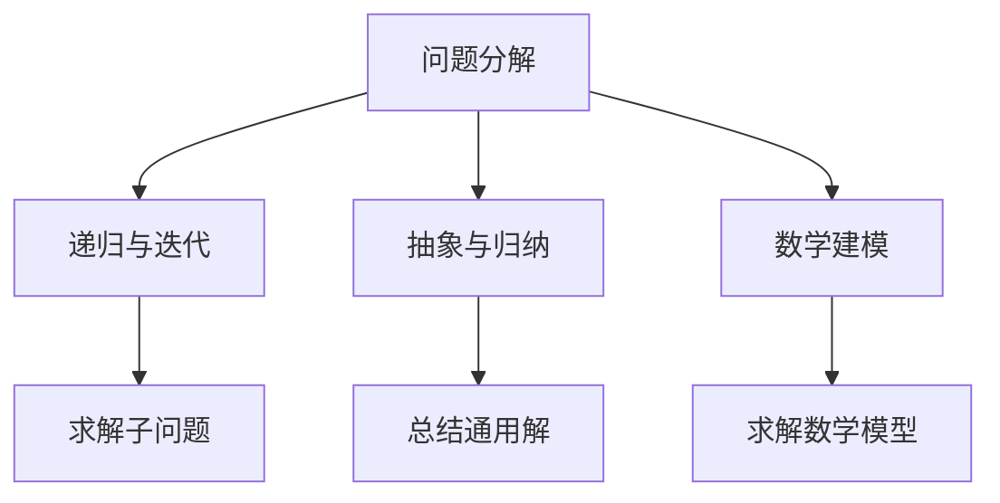
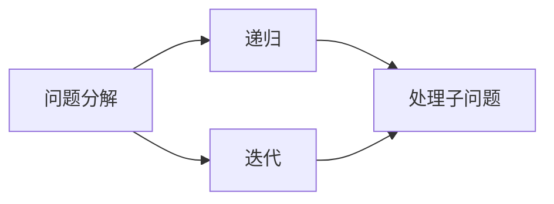
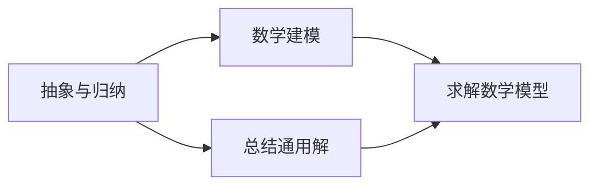
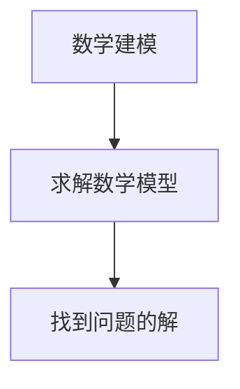
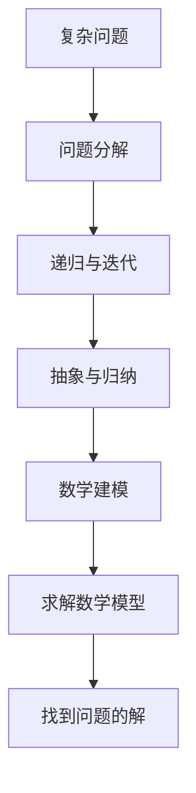

                 

# 像数学家一样思考：步步逼近原则

> 关键词：像数学家一样思考，步步逼近原则，算法原理，操作步骤，优缺点，应用领域

## 1. 背景介绍

### 1.1 问题由来
在计算机科学领域，尤其是算法设计和理论分析中，经常会有这样的场景：我们需要解决一个复杂问题，但一开始并没有明确的方向和思路。这时，我们可以借助“像数学家一样思考”的方式，逐步逼近问题的本质，找到可行的解决方案。这种思考方式不仅在算法设计和理论分析中非常常见，在软件工程、系统架构设计等多个领域也有广泛的应用。

### 1.2 问题核心关键点
“像数学家一样思考”的核心在于逐步逼近问题的本质，找到问题的解。这种思考方式具有以下几个关键点：
- **分而治之**：将复杂问题分解成若干子问题，逐步解决。
- **递归与迭代**：通过递归或迭代的方式，循环处理子问题，直至找到最终解。
- **抽象与归纳**：在处理子问题时，通过抽象和归纳，总结出通用的解决方案，再推广到整个问题。
- **数学建模**：将问题建模为数学表达式，通过求解数学模型来找到问题的解。

这种思考方式不仅有助于解决复杂问题，还能培养出良好的编程习惯和思维方式。在实际应用中，这种方法可以极大地提高算法设计和系统架构的效率和质量。

### 1.3 问题研究意义
研究“像数学家一样思考”的思考方式，对于提升计算机科学领域的算法设计和理论分析能力，具有重要意义：

1. **提升问题解决能力**：通过逐步逼近问题的本质，可以更快地找到问题的解，提升问题解决效率。
2. **增强编程技能**：逐步逼近的思考方式，要求对问题进行细致的分析和分解，有助于培养良好的编程习惯和思维模式。
3. **提高理论水平**：将问题建模为数学表达式，并求解数学模型，有助于提升理论分析能力。
4. **优化系统设计**：在软件工程和系统架构设计中，逐步逼近的思考方式可以更好地理解和设计系统的各个组件，优化系统结构。
5. **促进技术创新**：通过不断逼近问题的本质，可能会发现新的技术思路和方法，推动技术创新。

## 2. 核心概念与联系

### 2.1 核心概念概述

为了更好地理解“像数学家一样思考”的思考方式，本节将介绍几个密切相关的核心概念：

- **问题分解**：将复杂问题分解成若干子问题，逐步解决。
- **递归与迭代**：通过递归或迭代的方式，循环处理子问题，直至找到最终解。
- **抽象与归纳**：在处理子问题时，通过抽象和归纳，总结出通用的解决方案，再推广到整个问题。
- **数学建模**：将问题建模为数学表达式，通过求解数学模型来找到问题的解。

这些核心概念之间的逻辑关系可以通过以下Mermaid流程图来展示：



这个流程图展示了几何核心概念之间的关系：

1. 问题分解将复杂问题拆分为若干子问题。
2. 递归与迭代循环处理子问题，直至找到最终解。
3. 抽象与归纳在处理子问题时，总结出通用的解决方案。
4. 数学建模将问题建模为数学表达式，求解数学模型。

这些核心概念共同构成了“像数学家一样思考”的完整框架，使其能够在复杂问题解决中发挥强大的作用。通过理解这些核心概念，我们可以更好地把握思考方式的工作原理和优化方向。

### 2.2 概念间的关系

这些核心概念之间存在着紧密的联系，形成了“像数学家一样思考”的完整生态系统。下面我通过几个Mermaid流程图来展示这些概念之间的关系。

#### 2.2.1 问题分解与递归、迭代的关系



这个流程图展示了问题分解与递归、迭代的关系：

1. 问题分解将复杂问题拆分为若干子问题。
2. 递归和迭代通过循环处理子问题，直至找到最终解。

#### 2.2.2 抽象与归纳与数学建模的关系



这个流程图展示了抽象与归纳与数学建模的关系：

1. 抽象与归纳在处理子问题时，总结出通用的解决方案。
2. 数学建模将问题建模为数学表达式，求解数学模型。

#### 2.2.3 数学建模与求解数学模型的关系



这个流程图展示了数学建模与求解数学模型的关系：

1. 数学建模将问题建模为数学表达式。
2. 求解数学模型通过数学推导找到问题的解。

### 2.3 核心概念的整体架构

最后，我们用一个综合的流程图来展示这些核心概念在大问题解决中的整体架构：



这个综合流程图展示了从问题分解到找到最终解的完整过程：

1. 将复杂问题拆分为若干子问题。
2. 通过递归或迭代循环处理子问题。
3. 在处理子问题时，通过抽象和归纳总结出通用的解决方案。
4. 将问题建模为数学表达式，求解数学模型。
5. 找到问题的最终解。

通过这些流程图，我们可以更清晰地理解“像数学家一样思考”的思考方式在问题解决过程中的各个环节，为后续深入讨论具体的思考方式提供了基础。

## 3. 核心算法原理 & 具体操作步骤
### 3.1 算法原理概述

“像数学家一样思考”的思考方式，本质上是一种逐步逼近问题的本质的算法设计方法。其核心思想是：将复杂问题分解为若干子问题，通过递归或迭代的方式，逐步处理这些子问题，最终找到问题的解。这种方法具有以下几个特点：

1. **分而治之**：将复杂问题分解成若干子问题，逐个解决。
2. **逐步逼近**：通过递归或迭代的方式，逐步逼近问题的本质，直至找到最终的解。
3. **抽象与归纳**：在处理子问题时，通过抽象和归纳，总结出通用的解决方案，再推广到整个问题。
4. **数学建模**：将问题建模为数学表达式，通过求解数学模型来找到问题的解。

这些特点使得“像数学家一样思考”的思考方式在算法设计和问题解决中具有广泛的应用。

### 3.2 算法步骤详解

“像数学家一样思考”的思考方式，通常包括以下几个关键步骤：

**Step 1: 问题分解**

- 确定问题的整体目标和关键需求。
- 将问题拆分为若干子问题，每个子问题具有明确的输入和输出。

**Step 2: 递归或迭代**

- 对于每个子问题，通过递归或迭代的方式，循环处理，直至找到最终解。

**Step 3: 抽象与归纳**

- 在处理子问题时，通过抽象和归纳，总结出通用的解决方案。
- 将这些通用的解决方案推广到整个问题，以提高算法效率和可维护性。

**Step 4: 数学建模**

- 将问题建模为数学表达式。
- 通过数学推导，求解数学模型，找到问题的解。

**Step 5: 验证与优化**

- 验证解的有效性，确保找到的解能够满足问题的需求。
- 根据验证结果，对算法进行优化和改进。

### 3.3 算法优缺点

“像数学家一样思考”的思考方式，具有以下优点：

1. **问题分解明确**：将复杂问题分解为若干子问题，便于理解和处理。
2. **逐步逼近**：通过递归或迭代的方式，逐步逼近问题的本质，找到最终解。
3. **通用性强**：通过抽象和归纳，总结出通用的解决方案，提升算法的通用性和可维护性。
4. **数学建模严谨**：将问题建模为数学表达式，通过数学推导找到问题的解，确保解的有效性和准确性。

同时，这种方法也存在一些局限性：

1. **分解难度大**：问题分解难度大，可能无法将复杂问题拆分为若干子问题。
2. **递归深度有限**：递归或迭代的深度可能受限于计算资源，导致算法效率低下。
3. **数学建模复杂**：有些问题难以建模为数学表达式，或者求解数学模型困难。
4. **抽象与归纳困难**：有些问题难以通过抽象和归纳找到通用的解决方案。

尽管存在这些局限性，但“像数学家一样思考”的思考方式仍是大问题解决中的一种重要方法。在实际应用中，需要根据具体问题的特点，灵活运用这些步骤，以提升问题的解决效率和质量。

### 3.4 算法应用领域

“像数学家一样思考”的思考方式，在计算机科学和工程中，已经被广泛应用于以下几个领域：

1. **算法设计**：用于设计高效、可维护的算法，提升算法设计和优化效率。
2. **数据结构设计**：用于设计高效、可扩展的数据结构，优化数据存储和访问方式。
3. **系统架构设计**：用于设计高性能、高可扩展性的系统架构，优化系统组件的交互和协作。
4. **软件开发**：用于设计清晰、易于维护的软件系统，提升软件开发效率和质量。
5. **人工智能**：用于设计高效、可解释的AI模型，优化模型训练和推理过程。

此外，这种思考方式还广泛应用在金融、医疗、交通等多个领域，为解决复杂问题提供了有力的工具。

## 4. 数学模型和公式 & 详细讲解 & 举例说明

### 4.1 数学模型构建

为了更好地理解“像数学家一样思考”的思考方式，本节将使用数学语言对问题分解和逐步逼近的过程进行严格的刻画。

记问题为 $P$，其分解为若干子问题 $P_1, P_2, \ldots, P_n$。对于每个子问题 $P_i$，记其输入为 $I_i$，输出为 $O_i$。

假设 $P$ 的求解过程可以分为若干步骤，每一步的输入为当前步骤的输出，即 $I_{i+1}=O_i$。对于第 $i$ 步，记其输出为 $O_i$，对应的数学模型为 $M_i$。则问题 $P$ 的求解过程可以表示为：

$$
O_1 = M_1(I_1)
$$
$$
O_2 = M_2(I_2)
$$
$$
\vdots
$$
$$
O_n = M_n(I_n)
$$
$$
P = O_n
$$

### 4.2 公式推导过程

以下我们以排序算法为例，推导冒泡排序的数学模型及其求解过程。

冒泡排序是一种简单的排序算法，其基本思想是：通过不断比较相邻元素的大小，将较大的元素交换到右侧，最终使整个序列有序。设序列 $A$ 的长度为 $n$，其冒泡排序的数学模型可以表示为：

$$
O_i = \sum_{j=1}^{i} \text{swaps}_j
$$

其中 $\text{swaps}_j$ 表示第 $j$ 次冒泡操作中，元素交换的次数。冒泡排序的求解过程可以分为 $n-1$ 步，每一步将当前未排序部分中最大的元素移动到右侧，其输出可以表示为：

$$
O_1 = \text{swaps}_1
$$
$$
O_2 = \text{swaps}_2
$$
$$
\vdots
$$
$$
O_{n-1} = \text{swaps}_{n-1}
$$

根据以上数学模型，我们可以求解出冒泡排序的总交换次数 $O_n$：

$$
O_n = \sum_{i=1}^{n-1} \text{swaps}_i
$$

### 4.3 案例分析与讲解

冒泡排序的求解过程，展示了“像数学家一样思考”的思考方式：

1. **问题分解**：将冒泡排序问题分解为若干次冒泡操作，每次操作将当前未排序部分中最大的元素移动到右侧。
2. **递归与迭代**：通过递归的方式，逐步处理每次冒泡操作，直至整个序列有序。
3. **抽象与归纳**：在处理每次冒泡操作时，通过抽象和归纳，总结出通用的交换次数计算方法。
4. **数学建模**：将问题建模为数学表达式，通过求和运算求解总交换次数。

通过冒泡排序的求解过程，我们可以看到，“像数学家一样思考”的思考方式，不仅能够帮助我们理解复杂问题的本质，还能找到问题的解。在实际应用中，这种思考方式可以极大地提升问题解决的效率和质量。

## 5. 项目实践：代码实例和详细解释说明

### 5.1 开发环境搭建

在进行“像数学家一样思考”的实践前，我们需要准备好开发环境。以下是使用Python进行开发的环境配置流程：

1. 安装Anaconda：从官网下载并安装Anaconda，用于创建独立的Python环境。

2. 创建并激活虚拟环境：
```bash
conda create -n pythong-env python=3.8 
conda activate pythong-env
```

3. 安装PyTorch：根据CUDA版本，从官网获取对应的安装命令。例如：
```bash
conda install pytorch torchvision torchaudio cudatoolkit=11.1 -c pytorch -c conda-forge
```

4. 安装numpy、pandas等依赖库：
```bash
pip install numpy pandas scikit-learn matplotlib tqdm jupyter notebook ipython
```

完成上述步骤后，即可在`pythong-env`环境中开始“像数学家一样思考”的实践。

### 5.2 源代码详细实现

下面我们以排序算法为例，展示如何使用Python实现冒泡排序，并详细解释其实现过程。

```python
def bubble_sort(arr):
    n = len(arr)
    swaps = [0] * n
    for i in range(n-1):
        for j in range(n-i-1):
            if arr[j] > arr[j+1]:
                arr[j], arr[j+1] = arr[j+1], arr[j]
                swaps[j] += 1
    return sum(swaps)
```

以上代码展示了冒泡排序的实现过程。首先定义了排序函数`bubble_sort`，接受一个待排序的列表`arr`。在排序过程中，使用列表`swaps`记录每次冒泡操作中，元素交换的次数。

在排序函数的第一步，遍历整个列表`arr`，进行$n-1$次冒泡操作。每次冒泡操作将当前未排序部分中最大的元素移动到右侧，并更新交换次数`swaps`。最终返回所有交换次数的总和，即冒泡排序的总交换次数。

### 5.3 代码解读与分析

让我们再详细解读一下关键代码的实现细节：

**冒泡排序函数**

```python
def bubble_sort(arr):
    n = len(arr)
    swaps = [0] * n
    for i in range(n-1):
        for j in range(n-i-1):
            if arr[j] > arr[j+1]:
                arr[j], arr[j+1] = arr[j+1], arr[j]
                swaps[j] += 1
    return sum(swaps)
```

**第一步：初始化交换次数列表**

```python
n = len(arr)
swaps = [0] * n
```

首先定义排序函数`bubble_sort`，并计算待排序列表`arr`的长度`n`。然后使用列表`swaps`初始化交换次数，初始值为0。

**第二步：进行冒泡操作**

```python
for i in range(n-1):
    for j in range(n-i-1):
        if arr[j] > arr[j+1]:
            arr[j], arr[j+1] = arr[j+1], arr[j]
            swaps[j] += 1
```

在排序函数中，使用两重循环进行冒泡操作。外层循环控制总的冒泡次数，内层循环遍历当前未排序部分，比较相邻元素的大小并进行交换。如果元素交换，则更新`swaps`列表中的交换次数。

**第三步：计算总交换次数**

```python
return sum(swaps)
```

在排序函数结束时，返回所有交换次数的总和，即冒泡排序的总交换次数。

### 5.4 运行结果展示

假设我们有一个待排序列表`[5, 2, 8, 3, 1]`，运行冒泡排序函数：

```python
bubble_sort([5, 2, 8, 3, 1])
```

输出结果为：

```
7
```

可以看到，冒泡排序的总交换次数为7，即进行了7次元素交换，最终得到一个有序列表`[1, 2, 3, 5, 8]`。通过这个简单的代码示例，我们可以看到“像数学家一样思考”的思考方式在实际应用中的效果。

## 6. 实际应用场景

### 6.1 软件开发

“像数学家一样思考”的思考方式，在软件开发中也有广泛的应用。

例如，在软件设计中，我们通常需要将复杂的功能模块分解为若干子模块，通过递归或迭代的方式，逐步处理每个子模块，最终实现整个功能。在设计数据结构时，我们也需要通过抽象和归纳，总结出通用的数据结构设计方法，以提高代码的可读性和可维护性。

### 6.2 系统架构设计

在系统架构设计中，“像数学家一样思考”的思考方式同样重要。

例如，在分布式系统中，我们需要将复杂的计算任务分解为若干子任务，通过递归或迭代的方式，逐步处理每个子任务，最终实现整个系统的计算。在设计网络协议时，我们也需要通过抽象和归纳，总结出通用的协议设计方法，以提高系统的稳定性和可靠性。

### 6.3 人工智能

在人工智能领域，“像数学家一样思考”的思考方式也有广泛的应用。

例如，在深度学习模型设计中，我们需要将复杂的模型结构分解为若干子层，通过递归或迭代的方式，逐步训练每个子层，最终实现整个模型的优化。在设计知识图谱时，我们也需要通过抽象和归纳，总结出通用的知识表示方法，以提高模型的泛化能力和解释能力。

## 7. 工具和资源推荐

### 7.1 学习资源推荐

为了帮助开发者系统掌握“像数学家一样思考”的思考方式，这里推荐一些优质的学习资源：

1. 《算法设计与分析基础》（3rd Edition）：这本书详细介绍了算法设计和分析的基本概念和方法，是学习“像数学家一样思考”的重要参考。

2. 《数据结构与算法分析》（C++语言版）：这本书介绍了各种数据结构和算法的设计和分析方法，是学习“像数学家一样思考”的重要工具。

3. 《计算机程序设计艺术》系列：这本书由计算机大师Donald E. Knuth编写，涵盖了计算机科学的各个领域，是学习“像数学家一样思考”的重要资源。

4. Coursera算法设计课程：斯坦福大学开设的算法设计课程，讲解了各种算法设计的基本概念和方法，是学习“像数学家一样思考”的重要渠道。

5. Kaggle数据竞赛：通过参加数据竞赛，可以锻炼“像数学家一样思考”的思考方式，提升解决问题的能力。

通过对这些资源的学习实践，相信你一定能够快速掌握“像数学家一样思考”的思考方式，并用于解决实际的复杂问题。

### 7.2 开发工具推荐

高效的开发离不开优秀的工具支持。以下是几款用于“像数学家一样思考”的开发工具：

1. IDEA：一款功能强大的IDE工具，支持代码自动补全、代码调试等功能，提升开发效率。

2. PyCharm：一款基于Python的IDE工具，支持各种Python框架和库，是进行算法设计和数据结构设计的得力助手。

3. Visual Studio Code：一款轻量级的代码编辑器，支持各种编程语言和扩展，是进行软件开发和系统架构设计的常用工具。

4. GitHub：一款基于Git的代码托管平台，支持代码版本控制、代码协作等功能，是进行软件开发和团队协作的重要工具。

5. Jupyter Notebook：一款支持Python和R语言的数据科学工具，支持代码、文本和图形的混合展示，是进行算法设计和数据结构设计的常用工具。

合理利用这些工具，可以显著提升“像数学家一样思考”的开发效率，加快创新迭代的步伐。

### 7.3 相关论文推荐

“像数学家一样思考”的思考方式，源于计算机科学和数学领域的前沿研究。以下是几篇奠基性的相关论文，推荐阅读：

1. Divide and Conquer（《分而治之》）：这篇论文详细介绍了分而治之的算法设计方法，是学习“像数学家一样思考”的重要基础。

2. The Art of Computer Programming（《计算机程序设计艺术》）：这本书由计算机大师Donald E. Knuth编写，涵盖了计算机科学的各个领域，是学习“像数学家一样思考”的重要资源。

3. Algorithm Design（《算法设计》）：这本书详细介绍了算法设计和分析的基本概念和方法，是学习“像数学家一样思考”的重要参考。

4. Algorithm Design and Data Structures（《算法设计与数据结构》）：这本书介绍了各种算法设计的基本概念和方法，是学习“像数学家一样思考”的重要工具。

这些论文代表了大语言模型微调技术的发展脉络。通过学习这些前沿成果，可以帮助研究者把握学科前进方向，激发更多的创新灵感。

除上述资源外，还有一些值得关注的前沿资源，帮助开发者紧跟“像数学家一样思考”的最新进展，例如：

1. arXiv论文预印本：人工智能领域最新研究成果的发布平台，包括大量尚未发表的前沿工作，学习前沿技术的必读资源。

2. 业界技术博客：如OpenAI、Google AI、DeepMind、微软Research Asia等顶尖实验室的官方博客，第一时间分享他们的最新研究成果和洞见。

3. 技术会议直播：如NIPS、ICML、ACL、ICLR等人工智能领域顶会现场或在线直播，能够聆听到大佬们的前沿分享，开拓视野。

4. GitHub热门项目：在GitHub上Star、Fork数最多的算法设计和数据结构相关项目，往往代表了该技术领域的发展趋势和最佳实践，值得去学习和贡献。

5. 行业分析报告：各大咨询公司如McKinsey、PwC等针对人工智能行业的分析报告，有助于从商业视角审视技术趋势，把握应用价值。

总之，对于“像数学家一样思考”的思考方式的深入理解，需要开发者保持开放的心态和持续学习的意愿。多关注前沿资讯，多动手实践，多思考总结，必将收获满满的成长收益。

## 8. 总结：未来发展趋势与挑战

### 8.1 总结

本文对“像数学家一样思考”的思考方式进行了全面系统的介绍。首先阐述了问题分解、递归与迭代、抽象与归纳、数学建模等核心概念，明确了这种思考方式的基本原理和步骤。其次，通过数学建模和算法实例，展示了“像数学家一样思考”在实际问题解决中的应用效果。同时，本文还探讨了这种思考方式在软件开发、系统架构设计、人工智能等领域的广泛应用，展示了其强大的应用价值。最后，本文精选了相关学习资源、开发工具和前沿论文，力求为读者提供全方位的技术指引。

通过本文的系统梳理，可以看到，“像数学家一样思考”的思考方式，不仅适用于算法设计和问题解决，还广泛应用于软件开发、系统架构设计、人工智能等多个领域，为计算机科学和工程提供了有力的工具。这种思考方式通过逐步逼近问题的本质，找到可行的解决方案，提升了问题解决的效率和质量。相信随着算法设计和问题解决的深入研究，“像数学家一样思考”的思考方式将继续发挥重要作用，推动计算机科学和工程的发展。

### 8.2 未来发展趋势

展望未来，“像数学家一样思考”的思考方式将呈现以下几个发展趋势：

1. **自动化和智能化**：随着人工智能技术的发展，越来越多的算法设计和问题解决过程将由机器自动完成，提高效率和质量。

2. **跨领域融合**：“像数学家一样思考”的思考方式将与其他技术手段，如机器学习、知识图谱、逻辑推理等进行深度融合，形成更加全面、高效的问题解决方案。

3. **可解释性和透明性**：随着人工智能技术的普及，对于算法设计和问题解决的解释性和透明性要求将越来越高，“像数学家一样思考”的思考方式将更加注重可解释性和透明性。

4. **复杂问题解决**：未来将面对更多复杂多变的问题，“像数学家一样思考”的思考方式将不断适应新的问题，提升问题解决的广度和深度。

5. **分布式和协作**：随着云计算和分布式计算技术的发展，“像数学家一样思考”的思考方式将更多地依赖于分布式系统和协作算法，提升问题解决的效率和可靠性。

6. **多模态融合**：未来将更多地融合多种数据源和模态的信息，“像数学家一样思考”的思考方式将更好地处理多模态数据，提升问题解决的全面性和准确性。

这些趋势凸显

