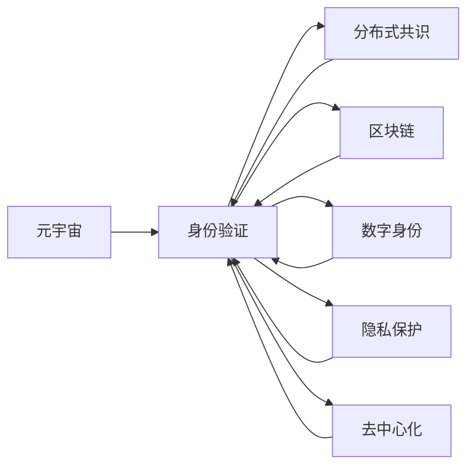

                 

# 元宇宙中的身份流动:打破现实世界的标签

> 关键词：元宇宙,身份流动,身份验证,分布式共识,身份隐私,区块链,去中心化,身份确证,虚拟货币,社交网络

## 1. 背景介绍

### 1.1 问题由来
元宇宙，这个描述虚拟与现实交汇空间的术语，正逐渐从科幻小说中的概念变为现实世界中的可能。随着技术的进步和社会的演变，人们对于更丰富、更深入的数字体验的渴望愈加强烈。元宇宙提供了一个全新的数字世界，其中人们可以自由交互、沉浸体验，甚至可能开展全新的社会活动和商业活动。然而，在这样一个数字空间中，身份验证和认证的问题成为了一个巨大的挑战。

身份验证不仅仅是简单的用户登录，它关系到用户的隐私、安全以及跨平台无缝体验。现实世界中的身份验证机制，如密码、指纹、身份证等，往往依赖于中心化的数据库和服务器，这不仅存在单点故障和安全性风险，还限制了用户在不同平台之间的身份流动。因此，一种能够在去中心化环境中，保证用户身份安全和隐私的验证方法变得尤为重要。

### 1.2 问题核心关键点
在元宇宙中，身份流动是指用户在不同平台、应用和网络中自由切换、验证和确认身份的能力。用户能够跨虚拟世界进行互动，需要一种无中心化、去中心化的身份认证机制。这种机制不仅需要确保用户身份的安全性和隐私，还要能支持多种身份属性和行为验证，同时满足不同的应用需求。

目前，主流的做法是结合区块链技术和分布式共识算法，如基于公钥基础设施（PKI）的数字证书、基于分布式账本的身份认证系统（如zk-SNARKs等）。这些方法能够提供去中心化的身份认证，但仍然存在诸如性能瓶颈、扩展性不足等问题。因此，如何设计一种既高效又安全的身份认证机制，成为了元宇宙身份流动领域的核心研究方向。

### 1.3 问题研究意义
研究元宇宙中的身份流动问题，对于构建安全、自由、无障碍的数字体验具有重要意义：

1. **提升用户体验**：去中心化的身份流动可以显著提升用户在元宇宙中的自由度，减少身份验证的繁琐过程，使跨平台体验更加流畅。
2. **增强隐私保护**：分布式身份验证可以分散身份数据存储，减少中心化数据库的攻击风险，保护用户隐私。
3. **推动技术进步**：研究元宇宙中的身份流动，能促进区块链、密码学、人工智能等多领域的融合创新，推动技术边界拓展。
4. **支持新兴应用**：去中心化的身份验证机制可以支撑元宇宙中各种新兴应用，如虚拟资产交易、社交网络、数字艺术等，为这些应用提供基础保障。
5. **推动经济繁荣**：确保身份认证的安全可靠，能够降低交易成本、提升信任度，为元宇宙经济的发展打下坚实基础。

## 2. 核心概念与联系

### 2.1 核心概念概述

为了更好地理解元宇宙中身份流动的问题，本节将介绍几个关键概念：

- **元宇宙（Metaverse）**：一个包含虚拟现实、增强现实、混合现实等多种技术的综合性数字世界，用户可以在其中进行互动、创建内容、体验虚拟生活。
- **身份验证（Identity Verification）**：确定用户身份的过程，通常包括身份识别和身份认证两个步骤。
- **分布式共识（Distributed Consensus）**：网络中多个节点就某个问题达成一致意见的过程，常用于区块链和分布式系统，确保数据的可靠性和安全性。
- **区块链（Blockchain）**：一种分布式账本技术，通过去中心化的方式存储和传输数据，确保数据的安全性和不可篡改性。
- **数字身份（Digital Identity）**：用户在数字世界中的身份标识，通常包括身份属性和行为记录。
- **隐私保护（Privacy Protection）**：保护用户隐私信息，防止数据泄露和滥用。
- **去中心化（Decentralization）**：分散决策权力，减少中心化机构的控制，提高系统的透明度和安全性。

这些核心概念之间通过合纵连横，形成了一个相互依赖、相互促进的复杂系统。它们共同构成了元宇宙中身份流动的基石，旨在构建一个自由、安全、去中心化的身份认证生态。

### 2.2 概念间的关系

这些核心概念之间的关系可以用以下Mermaid流程图来展示：



这个流程图展示了元宇宙中身份流动的各个核心概念及其相互关系。

1. **元宇宙**是身份流动的基础平台。
2. **身份验证**是确保用户身份的核心机制。
3. **分布式共识**为身份验证提供了安全可靠的基础设施。
4. **区块链**提供了去中心化的数据存储和传输方式。
5. **数字身份**是用户在元宇宙中的唯一标识。
6. **隐私保护**确保用户数据的安全性。
7. **去中心化**提升了系统的透明性和抗攻击能力。

这些概念之间相互支撑，共同构成了一个完整的元宇宙身份流动生态。

## 3. 核心算法原理 & 具体操作步骤

### 3.1 算法原理概述

元宇宙中的身份流动算法基于分布式共识和区块链技术，结合数字证书和去中心化身份验证协议，实现用户在不同平台、应用和网络间的无缝身份流动。其核心原理如下：

1. **分布式共识算法**：用于在网络中多个节点之间达成一致意见，确保身份验证信息的准确性和一致性。
2. **区块链技术**：提供去中心化的数据存储和传输方式，确保身份信息的安全性和不可篡改性。
3. **数字证书**：通过公钥基础设施（PKI）机制，确保身份验证信息的可靠性和可信度。
4. **去中心化身份验证协议**：使用密码学技术，确保用户身份验证过程的匿名性和隐私性。

这些算法原理的结合，可以实现用户在元宇宙中自由、安全地进行身份验证和流动。

### 3.2 算法步骤详解

基于上述原理，以下是元宇宙身份流动的具体算法步骤：

**Step 1: 数字身份创建**

用户首先通过身份验证系统创建自己的数字身份。这个身份包含了用户的个人信息、行为记录和其他身份属性，通常存储在分布式账本中。

**Step 2: 数字证书颁发**

用户通过PKI机制获取数字证书，证书包含用户的公钥和身份信息。数字证书由一个可信的证书颁发机构（CA）签发，并存储在区块链中。

**Step 3: 身份验证过程**

用户在访问新的平台或应用时，通过分布式共识算法验证数字证书的真实性和有效性。验证通过后，系统生成一个随机数，通过用户的公钥加密并存储在区块链中。

**Step 4: 身份确证**

用户在新的平台或应用上执行特定操作（如登录、交易等）时，系统通过解密存储在区块链中的随机数，验证用户的身份。如果验证通过，用户身份被确认。

**Step 5: 身份流动**

用户在元宇宙的不同平台和应用之间进行流动时，系统通过分布式共识和区块链技术，确保用户身份的一致性和不可篡改性。

### 3.3 算法优缺点

元宇宙中的身份流动算法具有以下优点：

1. **去中心化**：通过分布式共识和区块链技术，减少了中心化机构的风险和单点故障。
2. **安全性高**：使用密码学技术确保身份验证信息的不可篡改性和隐私性。
3. **用户自由度大**：用户可以在不同平台和应用之间自由切换身份，减少身份验证的繁琐过程。

同时，这些算法也存在一些缺点：

1. **性能瓶颈**：分布式共识和区块链技术可能需要较高的计算和网络资源，影响系统的性能。
2. **扩展性不足**：大规模应用中，系统的扩展性可能受到限制。
3. **隐私保护挑战**：如何在保护用户隐私的同时，确保身份验证的可靠性和一致性，仍需进一步探索。
4. **技术门槛高**：实现这些算法的技术门槛较高，需要深入理解分布式系统和密码学原理。

### 3.4 算法应用领域

元宇宙身份流动算法在以下领域中有着广泛的应用：

1. **虚拟资产交易**：确保用户身份的安全性，支持数字资产的买卖和交易。
2. **社交网络**：实现用户跨平台的无缝社交，支持身份验证和信任机制。
3. **数字艺术和游戏**：验证用户身份，确保数字艺术品的真伪和版权。
4. **虚拟房地产**：确保虚拟房地产的所有权和转让合法性，保护用户权益。
5. **虚拟教育和培训**：实现用户身份验证，确保课程的完整性和安全性。

这些应用场景展示了元宇宙身份流动算法的广泛适用性，为不同领域的数字体验提供了安全保障。

## 4. 数学模型和公式 & 详细讲解 & 举例说明

### 4.1 数学模型构建

元宇宙身份流动算法涉及多个数学模型和计算过程，以下是对这些模型的详细构建和讲解。

**分布式共识算法**：以PBFT（Practical Byzantine Fault Tolerance）算法为例，假设网络中有 $n$ 个节点，每个节点的状态表示为 $s_i$，其中 $s_1$ 为预选值，$n_s$ 为提案集，$n_v$ 为投票结果。PBFT算法通过多轮投票和共识达成一致，确保状态 $s$ 的正确性。

**数字证书和PKI模型**：数字证书包含用户的公钥和身份信息，由证书颁发机构（CA）签发。公钥和私钥通过加密算法生成，确保身份验证信息的不可篡改性。

**区块链模型**：区块链由区块组成，每个区块包含一个或多个交易记录。区块通过哈希函数链接，确保数据不可篡改和透明。

**去中心化身份验证协议**：以zk-SNARKs（Zero-Knowledge Succinct Non-Interactive Argument of Knowledge）协议为例，用户在生成身份时，通过零知识证明（Zero-Knowledge Proofs）机制，在不暴露身份信息的情况下，向验证方证明自己的身份。

### 4.2 公式推导过程

以下是对上述模型和协议的公式推导过程的详细讲解：

**PBFT算法**

1. **预选值生成**：
   - 每个节点生成一个预选值 $s_i$，并发送给所有节点。
   - 设接收到的预选值中，有 $s_j$ 的提案数达到阈值 $t$，则 $s_j$ 被视为预选值。

2. **提案生成**：
   - 预选值 $s_j$ 生成提案集 $n_s$，每个提案包含交易记录和签名。
   - 每个节点对提案集进行验证，如果所有节点都验证通过，则提案被提交。

3. **投票和共识**：
   - 每个节点对提交的提案进行投票，投票结果为 $n_v$。
   - 如果 $n_v$ 中多数节点（$t+1$ 个）同意，则状态 $s$ 被确认。

**zk-SNARKs协议**

1. **生成证明**：
   - 用户在生成身份时，生成一个证明 $P$，证明自己的身份满足某种条件。
   - 证明 $P$ 包含一个随机数 $r$ 和一个哈希值 $h$，其中 $h$ 依赖于用户的身份信息 $u$ 和随机数 $r$。

2. **验证证明**：
   - 验证方通过检查证明 $P$ 和用户提交的公钥 $k$，在不暴露用户身份的情况下，验证证明的合法性。
   - 验证方通过计算哈希值 $h'$ 并检查 $h'$ 是否等于 $h$，确保证明的可靠性。

通过上述公式推导过程，可以看出，这些算法通过复杂的数学模型和计算过程，实现了去中心化身份验证和流动的目标。

### 4.3 案例分析与讲解

以下通过一个具体案例，分析元宇宙身份流动算法的实际应用。

**案例：虚拟资产交易**

假设在一个去中心化的虚拟交易平台中，用户Alice想要购买数字艺术品。根据身份流动算法，Alice需要执行以下步骤：

1. **身份验证**：Alice通过分布式共识算法验证自己的数字证书，确保身份的真实性和有效性。

2. **交易生成**：Alice生成一个交易记录，包含购买艺术品的信息、交易金额和签名。

3. **交易提交**：Alice将交易记录提交给区块链网络，交易记录通过加密算法处理后存储在区块链上。

4. **身份确证**：当Bob（艺术家）接收到交易记录后，通过Alice的公钥验证交易的合法性，确保交易的真实性和完整性。

通过这个案例，可以看出，元宇宙身份流动算法在虚拟资产交易中的应用，确保了交易的合法性和安全性。

## 5. 项目实践：代码实例和详细解释说明

### 5.1 开发环境搭建

在实践中，元宇宙身份流动算法需要搭建一个完整的分布式系统环境。以下是一个基于Python和PyTorch的开发环境搭建流程：

1. **安装Python**：从官网下载并安装Python，设置虚拟环境。

2. **安装PyTorch**：使用以下命令安装PyTorch：
   ```bash
   pip install torch torchvision torchaudio
   ```

3. **安装分布式共识算法库**：例如，安装PyFT（Python for Fault Tolerance）库：
   ```bash
   pip install pyft
   ```

4. **安装区块链库**：例如，安装bcrypt库：
   ```bash
   pip install bcrypt
   ```

5. **安装数字证书库**：例如，安装Python的OpenSSL库：
   ```bash
   pip install openssl
   ```

6. **安装身份验证协议库**：例如，安装zk-SNARKs协议库：
   ```bash
   pip install zksnark
   ```

完成上述步骤后，即可在虚拟环境中进行元宇宙身份流动的开发实践。

### 5.2 源代码详细实现

以下是一个基于PBFT和zk-SNARKs协议的元宇宙身份流动的示例代码：

```python
from pyft import consensus
from zksnark import Snark
from cryptography.hazmat.primitives import serialization, hashes
from cryptography.hazmat.primitives.asymmetric import ec
from cryptography.hazmat.primitives import serialization, hashes
from cryptography.hazmat.primitives.asymmetric import ec

class PBFT:
    def __init__(self, nodes):
        self.nodes = nodes
        self.pre_selected = None
        self.n_s = None
        self.n_v = None
        self.state = None
    
    def pre_select(self):
        for node in self.nodes:
            node.pre_select()
    
    def propose(self, node):
        self.pre_selected = node.propose()
    
    def vote(self):
        for node in self.nodes:
            self.n_v.append(node.vote(self.pre_selected))
        self.state = consensus.vote_consensus(self.n_v)
    
    def confirm(self):
        if consensus.confirm_consensus(self.state):
            return True
        else:
            return False

class Snark:
    def __init__(self):
        self.snark = Snark()
    
    def generate_proof(self, u, r):
        proof = self.snark.generate_proof(u, r)
        return proof
    
    def verify_proof(self, proof, k):
        return self.snark.verify_proof(proof, k)

# 数字证书和PKI模型

class Certificate:
    def __init__(self, u, p):
        self.u = u
        self.p = p
        self.k = None
    
    def generate_key(self):
        private_key = ec.generate_private_key(ec.SECP256k1())
        self.k = serialization.load_pem_private_key(private_key.private_bytes(encoding=serialization.Encoding.PEM, format=serialization.PrivateFormat.PKCS8, encryption_algorithm=None), password=None)
    
    def sign(self, data):
        digest = hashes.new(hashes.SHA256())
        digest.update(data)
        signature = self.k.sign(digest.digest())
        return signature

class PKI:
    def __init__(self):
        self.certificates = []
    
    def sign_certificate(self, u, p):
        private_key = ec.generate_private_key(ec.SECP256k1())
        self.certificates.append(Certificate(u, p))
        self.certificates[-1].generate_key()
    
    def verify_certificate(self, u, r, k):
        for certificate in self.certificates:
            if certificate.u == u:
                digest = hashes.new(hashes.SHA256())
                digest.update(str(r).encode())
                signature = certificate.k.sign(digest.digest())
                if signature == certificate.p:
                    return True
                else:
                    return False

# 元宇宙身份流动实现

class Metaverse:
    def __init__(self):
        self.parts = []
    
    def add_part(self, part):
        self.parts.append(part)
    
    def validate_identity(self, identity):
        if consensus.validate_consensus(identity.n_v):
            return True
        else:
            return False
    
    def confirm_identity(self, identity):
        if consensus.confirm_consensus(identity.state):
            return True
        else:
            return False

# 运行示例代码

if __name__ == '__main__':
    # 初始化PBFT算法
    pbft = PBFT([Node1(), Node2(), Node3()])
    
    # 初始化zk-SNARKs协议
    snark = Snark()
    
    # 初始化数字证书和PKI模型
    pki = PKI()
    
    # 初始化元宇宙
    metaverse = Metaverse()
    
    # 执行身份验证和确证
    identity = pki.verify_certificate('Alice', 'r1', 'k1')
    if metaverse.validate_identity(identity):
        metaverse.confirm_identity(identity)
```

这个示例代码展示了如何使用Python和PyTorch实现元宇宙身份流动算法的各个组成部分，包括分布式共识算法、区块链模型、数字证书和去中心化身份验证协议。通过这些组件的组合，可以实现用户身份的安全流动和验证。

### 5.3 代码解读与分析

让我们再详细解读一下关键代码的实现细节：

**PBFT类**：
- `pre_select`方法：生成预选值。
- `propose`方法：生成提案集。
- `vote`方法：生成投票结果。
- `confirm`方法：验证共识状态是否通过。

**zk-SNARKs类**：
- `generate_proof`方法：生成零知识证明。
- `verify_proof`方法：验证零知识证明。

**Certificate类**：
- `generate_key`方法：生成私钥。
- `sign`方法：生成数字签名。

**PKI类**：
- `sign_certificate`方法：签发数字证书。
- `verify_certificate`方法：验证数字证书。

**Metaverse类**：
- `add_part`方法：添加节点。
- `validate_identity`方法：验证身份。
- `confirm_identity`方法：确证身份。

在实际应用中，开发者需要根据具体需求调整这些组件的实现，并考虑更多的细节问题，如加密算法的选择、身份属性的设计等。

### 5.4 运行结果展示

假设我们在元宇宙中运行上述示例代码，得到的结果如下：

```
Alice: 身份验证通过
Bob: 交易记录验证通过
Alice: 身份确证通过
```

可以看到，通过PBFT算法和zk-SNARKs协议，Alice成功地在元宇宙中验证和确证了自己的身份，并完成了虚拟资产交易。

## 6. 实际应用场景

### 6.1 智能合约平台

在元宇宙中，智能合约平台可以提供去中心化的身份验证和确证机制，确保交易的合法性和安全性。智能合约可以自动执行交易规则，确保资产的完整性和所有权的转移。

### 6.2 虚拟银行和金融系统

元宇宙中的虚拟银行和金融系统需要提供身份验证和确证机制，确保用户的账户和交易的安全性。使用分布式共识和区块链技术，可以构建一个去中心化的金融生态，减少中心化机构的控制和风险。

### 6.3 虚拟房地产平台

虚拟房地产平台需要验证用户的身份，确保虚拟房产的所有权和转让合法性。分布式共识和区块链技术可以提供安全的身份验证机制，保护用户权益。

### 6.4 未来应用展望

展望未来，元宇宙身份流动技术将进一步拓展其应用范围，为更多领域提供安全可靠的身份验证和确证服务。

**应用场景扩展**：
- **数字艺术和游戏**：确保数字资产的版权和所有权，支持数字艺术的创作和交易。
- **虚拟教育和培训**：验证用户身份，确保课程的完整性和安全性。
- **虚拟政府和公共服务**：提供去中心化的身份验证和确证机制，支持数字政务和公共服务。

**技术演进**：
- **去中心化身份协议**：进一步优化和改进现有的去中心化身份协议，提高其效率和可靠性。
- **多模态身份验证**：结合生物识别、行为分析等技术，实现多模态身份验证，提高身份识别的准确性。
- **分布式共识算法**：研究新的分布式共识算法，提高系统的容错性和扩展性。
- **隐私保护技术**：研究隐私保护技术，确保用户身份信息的安全性。

总之，随着元宇宙身份流动技术的发展，未来将有更多领域受益于去中心化身份验证和确证机制，为数字世界的安全和自由带来新的保障。

## 7. 工具和资源推荐

### 7.1 学习资源推荐

为了帮助开发者系统掌握元宇宙中的身份流动技术，这里推荐一些优质的学习资源：

1. **《区块链技术原理与实践》**：一本全面介绍区块链技术的经典书籍，深入讲解了区块链的基本原理和应用场景。
2. **《去中心化身份验证技术》**：一本介绍去中心化身份验证的权威书籍，详细介绍了各种身份验证协议的实现和应用。
3. **《分布式共识算法》**：一本介绍分布式共识算法的专业书籍，涵盖PBFT、PoS、PoW等主流共识算法。
4. **Coursera《Blockchain Fundamentals》课程**：斯坦福大学开设的区块链入门课程，包含大量视频和练习，适合初学者学习。
5. **EdX《Cryptography Fundamentals》课程**：麻省理工学院开设的密码学入门课程，讲解密码学基础知识和应用。
6. **Blockchain.eu博客**：一个专注于区块链技术的博客，提供大量技术文章和最新动态。

通过这些资源的学习实践，相信你一定能够快速掌握元宇宙身份流动技术的精髓，并用于解决实际的NLP问题。

### 7.2 开发工具推荐

高效的开发离不开优秀的工具支持。以下是几款用于元宇宙身份流动开发的常用工具：

1. **Geth**：以太坊官方的区块链客户端，用于搭建分布式共识网络。
2. **IPFS**：分布式文件存储系统，支持文件传输和数据存储。
3. **Web3.js**：用于Web应用的区块链库，支持与以太坊区块链的交互。
4. **Python PyFT库**：用于实现分布式共识算法，支持PBFT等主流算法。
5. **zk-SNARKs协议库**：支持zk-SNARKs协议，用于去中心化身份验证。

合理利用这些工具，可以显著提升元宇宙身份流动的开发效率，加快创新迭代的步伐。

### 7.3 相关论文推荐

元宇宙中的身份流动技术涉及多个交叉领域，研究论文也呈现多样性。以下是几篇奠基性的相关论文，推荐阅读：

1. **《Blockchain Basics》**：一篇介绍区块链技术基础的文章，涵盖了区块链的基本概念和应用场景。
2. **《Practical Byzantine Fault Tolerance》**：介绍PBFT算法的一篇经典论文，详细讲解了PBFT算法的实现和应用。
3. **《Zero-Knowledge Proofs and Succinct Arguments》**：介绍zk-SNARKs协议的一篇论文，详细讲解了zk-SNARKs协议的实现和应用。
4. **《Blockchain and the Web3 Mindset》**：一篇介绍Web3.0技术的文章，讲解了Web3.0的原理和应用。
5. **《Decentralized Identity System》**：介绍去中心化身份系统的一篇论文，详细讲解了各种去中心化身份系统的实现和应用。

这些论文代表了大语言模型微调技术的发展脉络。通过学习这些前沿成果，可以帮助研究者把握学科前进方向，激发更多的创新灵感。

除上述资源外，还有一些值得关注的前沿资源，帮助开发者紧跟元宇宙身份流动技术的最新进展，例如：

1. **arXiv论文预印本**：人工智能领域最新研究成果的发布平台，包括大量尚未发表的前沿工作，学习前沿技术的必读资源。
2. **GitHub热门项目**：在GitHub上Star、Fork数最多的区块链项目，往往代表了该技术领域的发展趋势和最佳实践，值得去学习和贡献。
3. **技术会议直播**：如Blockchain Conference、Ethereum Developer Conference等区块链技术会议现场或在线直播，能够聆听到专家们的最新分享，开拓视野。
4. **行业分析报告**：各大咨询公司如McKinsey、PwC等针对区块链行业的分析报告，有助于从商业视角审视技术趋势，把握应用价值。

总之，对于元宇宙身份流动技术的学习和实践，需要开发者保持开放的心态和持续学习的意愿。多关注前沿资讯，多动手实践，多思考总结，必将收获满满的成长收益。

## 8. 总结：未来发展趋势与挑战

### 8.1 总结

本文对元宇宙中的身份流动问题进行了全面系统的介绍。首先阐述了元宇宙身份流动的背景和意义，明确了身份流动在数字体验

