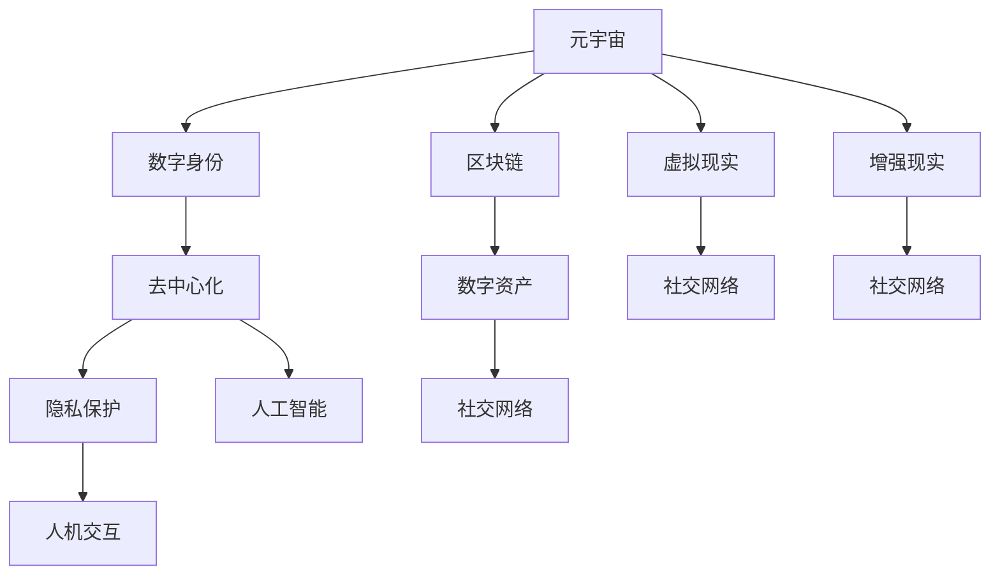
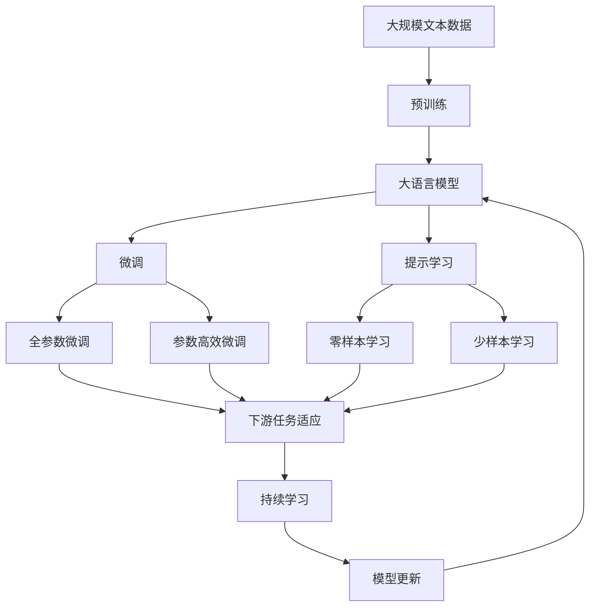

                 

# 元宇宙社交网络:重塑人际关系的数字平台

> 关键词：元宇宙,社交网络,虚拟现实,区块链,数字身份,去中心化,隐私保护,人工智能,人机交互,社会资本

## 1. 背景介绍

### 1.1 问题由来

随着技术的飞速进步，人类社会进入了一个崭新的数字时代。传统社交网络已经无法满足人们日益增长的数字化需求，一个全新的社交形态——元宇宙（Metaverse）应运而生。元宇宙是一个基于虚拟现实技术（Virtual Reality, VR）、增强现实技术（Augmented Reality, AR）和区块链技术构建的虚拟数字世界，人们可以在其中进行交流、互动、创作，甚至生活和工作。

元宇宙的构想早在20世纪90年代就已提出，但直到近年来，随着技术的成熟和普及，才真正开始落地实现。尤其是在疫情的推动下，人们越来越多地将社交活动转移到线上，虚拟社交网络平台迅速崛起。

### 1.2 问题核心关键点

元宇宙社交网络（Metaverse Social Network）的核心在于打造一个高度沉浸式、去中心化、隐私保护的虚拟社交空间。它打破了现实世界的限制，允许人们以全新的方式进行社交互动，但同时也带来了新的挑战和问题：

1. **去中心化**：如何在没有中心化管理的情况下，保障网络的安全、稳定和公平性？
2. **隐私保护**：如何在保护用户隐私的同时，让用户在虚拟世界中有足够的自由和信任？
3. **身份认证**：如何建立和验证用户的虚拟身份，确保其真实性和唯一性？
4. **交互体验**：如何设计直观、自然的人机交互方式，提升用户的沉浸感和满意度？
5. **数字资产**：如何管理和保护用户在虚拟世界中的数字资产和权益？

这些问题的解决需要跨学科的合作和技术创新，包括但不限于计算机科学、人工智能、心理学、社会学等。

### 1.3 问题研究意义

元宇宙社交网络的研究和实践，对于重塑人与人之间的关系、拓展数字生活的可能性、促进数字经济的发展具有重要意义：

1. **提升社交体验**：在元宇宙中，人们可以不受时间和空间的限制，自由地进行社交活动，提升用户体验和满意度。
2. **促进文化交流**：元宇宙为不同文化背景的人们提供了一个交流和融合的平台，促进了多元文化的理解和融合。
3. **驱动创新经济**：元宇宙为虚拟商品、数字资产的交易提供了新的渠道，推动了虚拟经济的发展。
4. **改变社交模式**：元宇宙社交网络将改变传统社交模式，为用户提供全新的社交体验和互动方式。
5. **影响社会结构**：元宇宙的兴起将对社会结构、文化形态、经济活动产生深远影响，成为未来社会的重要组成部分。

## 2. 核心概念与联系

### 2.1 核心概念概述

为了更好地理解元宇宙社交网络的构建原理，本节将介绍几个关键概念：

- **元宇宙 (Metaverse)**：一个由虚拟现实技术、增强现实技术和区块链技术构建的虚拟数字世界。用户可以在其中进行交流、互动、创作，甚至生活和工作。
- **虚拟现实 (Virtual Reality, VR)**：通过计算机生成的虚拟环境，使用户产生沉浸式体验的技术。
- **增强现实 (Augmented Reality, AR)**：将虚拟信息叠加到现实世界，增强用户的现实感知。
- **区块链 (Blockchain)**：一种去中心化的分布式账本技术，用于记录和验证数据，保障数据的安全和透明。
- **数字身份 (Digital Identity)**：在元宇宙中，用户的虚拟身份和真实身份的映射，用于身份认证和授权管理。
- **去中心化 (Decentralization)**：通过区块链技术，去除中心化管理，实现网络的去中心化运行。
- **隐私保护 (Privacy Protection)**：在保障用户隐私的同时，提供安全的社交环境。
- **人工智能 (Artificial Intelligence, AI)**：用于优化用户体验、提升社交互动的智能算法和系统。
- **人机交互 (Human-Computer Interaction, HCI)**：设计自然、直观的人机交互方式，提升用户的沉浸感。
- **数字资产 (Digital Assets)**：用户在元宇宙中的虚拟资产和权益，如虚拟土地、数字货币等。

这些概念共同构成了元宇宙社交网络的基石，通过它们之间的相互作用和配合，可以打造出一种全新的社交体验。

### 2.2 概念间的关系

这些核心概念之间的逻辑关系可以通过以下Mermaid流程图来展示：



这个流程图展示了大语言模型微调过程中各个核心概念的关系：

1. 元宇宙社交网络基于虚拟现实和增强现实技术，构建一个高度沉浸式的虚拟世界。
2. 区块链技术提供了去中心化的网络架构，保障数据的安全和透明。
3. 数字身份技术用于验证和授权，建立用户的虚拟身份。
4. 人工智能技术用于优化用户体验，提升社交互动的智能化水平。
5. 人机交互技术设计直观、自然的交互方式，提升用户的沉浸感。
6. 数字资产技术用于管理和保护用户在虚拟世界中的权益。
7. 社交网络是元宇宙的核心功能，连接虚拟世界中的用户，进行交流和互动。

### 2.3 核心概念的整体架构

最后，我们用一个综合的流程图来展示这些核心概念在大语言模型微调过程中的整体架构：



这个综合流程图展示了从预训练到微调，再到持续学习的完整过程。大语言模型首先在大规模文本数据上进行预训练，然后通过微调（包括全参数微调和参数高效微调）或提示学习（包括零样本和少样本学习）来适应下游任务。最后，通过持续学习技术，模型可以不断更新和适应新的任务和数据。

## 3. 核心算法原理 & 具体操作步骤
### 3.1 算法原理概述

元宇宙社交网络的构建，是一个多学科交叉、技术融合的过程。其核心算法原理主要包括以下几个方面：

- **虚拟现实技术**：通过头显设备、控制器等硬件，构建高度沉浸式的虚拟环境，使用户在虚拟世界中产生类似现实世界的体验。
- **增强现实技术**：将虚拟信息叠加到现实世界，增强用户的现实感知，实现虚拟与现实的融合。
- **区块链技术**：通过分布式账本技术，保障网络的去中心化运行和数据的安全透明。
- **数字身份技术**：利用公钥加密、数字证书等技术，验证和授权用户的虚拟身份。
- **人工智能技术**：使用深度学习、自然语言处理等技术，优化用户体验、提升社交互动的智能化水平。
- **人机交互技术**：设计直观、自然的交互方式，提升用户的沉浸感和满意度。
- **数字资产技术**：使用智能合约、区块链等技术，管理和保护用户在虚拟世界中的数字资产和权益。

### 3.2 算法步骤详解

元宇宙社交网络的构建，主要包括以下几个关键步骤：

1. **虚拟环境设计**：设计虚拟环境，包括虚拟空间的布局、家具、物品等，以及交互方式，如手势控制、语音识别等。
2. **虚拟身份验证**：通过公钥加密、数字证书等技术，验证用户的虚拟身份，确保其真实性和唯一性。
3. **社交网络搭建**：利用区块链技术，搭建去中心化的社交网络，记录和验证用户之间的交互行为。
4. **人工智能集成**：集成人工智能技术，提升用户体验和社交互动的智能化水平。
5. **数字资产管理**：使用智能合约、区块链等技术，管理和保护用户在虚拟世界中的数字资产和权益。
6. **数据安全保障**：通过加密、匿名化等技术，保障用户数据的安全和隐私。
7. **持续更新和优化**：根据用户反馈和需求，不断更新和优化元宇宙社交网络，提升用户体验和功能。

### 3.3 算法优缺点

元宇宙社交网络具有以下优点：

- **沉浸式体验**：高度沉浸式的虚拟环境，使用户在虚拟世界中产生类似现实世界的体验。
- **去中心化**：通过区块链技术，去除中心化管理，保障网络的安全和公平性。
- **隐私保护**：利用隐私保护技术，保障用户的隐私和安全。
- **智能化水平高**：集成人工智能技术，提升用户体验和社交互动的智能化水平。

但同时也存在以下缺点：

- **技术门槛高**：需要跨学科的技术合作和支持，对技术门槛要求较高。
- **成本高**：硬件设备、软件开发和维护成本较高，初期投入较大。
- **依赖于网络和硬件**：元宇宙社交网络依赖于稳定的网络和硬件设备，一旦网络或硬件出现问题，用户体验将大受影响。

### 3.4 算法应用领域

元宇宙社交网络可以应用于多个领域，如：

- **虚拟会议**：在虚拟环境中进行会议、培训、演讲等。
- **虚拟购物**：在虚拟环境中进行购物、浏览商品等。
- **虚拟教育**：在虚拟环境中进行在线教育、课程学习等。
- **虚拟娱乐**：在虚拟环境中进行游戏、看电影、听音乐等。
- **虚拟旅游**：在虚拟环境中进行旅游、探险等。
- **虚拟办公**：在虚拟环境中进行协作、沟通、文件共享等。

这些应用领域展示了元宇宙社交网络的广阔前景和多样性，未来随着技术的进一步发展，将会有更多的应用场景涌现。

## 4. 数学模型和公式 & 详细讲解 & 举例说明

### 4.1 数学模型构建

元宇宙社交网络的设计涉及多个方面的数学模型，下面我们将详细介绍其中几个关键模型：

- **虚拟空间建模**：使用三维几何模型和物理模拟技术，对虚拟空间进行建模。数学公式为：
  $$
  \mathbf{r} = \mathbf{r}_0 + \mathbf{v} t + \frac{1}{2} \mathbf{a} t^2
  $$
  其中，$\mathbf{r}$ 为位置向量，$\mathbf{r}_0$ 为初始位置，$\mathbf{v}$ 为初始速度，$\mathbf{a}$ 为加速度，$t$ 为时间。

- **数字身份验证模型**：使用公钥加密、数字证书等技术，验证用户的虚拟身份。数学公式为：
  $$
  \text{verify}(\text{sign}, \text{pub_key})
  $$
  其中，$\text{sign}$ 为用户签名的数据，$\text{pub_key}$ 为公钥。

- **社交网络建模**：使用图论和网络理论，对社交网络进行建模。数学公式为：
  $$
  \text{G} = (V, E)
  $$
  其中，$V$ 为节点集合，$E$ 为边集合。

- **人工智能模型**：使用深度学习、自然语言处理等技术，提升用户体验和社交互动的智能化水平。数学公式为：
  $$
  y = f(x; \theta)
  $$
  其中，$y$ 为模型输出，$x$ 为输入数据，$\theta$ 为模型参数。

- **数字资产管理模型**：使用智能合约、区块链等技术，管理和保护用户在虚拟世界中的数字资产和权益。数学公式为：
  $$
  \text{transaction} = (hash, value)
  $$
  其中，$hash$ 为哈希值，$value$ 为资产价值。

### 4.2 公式推导过程

以下我们以数字身份验证模型为例，推导其核心数学公式：

数字身份验证模型通常采用公钥加密和数字证书技术，用于验证用户的虚拟身份。数字证书是由权威机构颁发的电子文档，包含用户的公钥和相关信息，用于验证用户的身份。数字证书的格式为：

```
-----BEGIN CERTIFICATE-----
MIICmDCCAlagAwIBAgIJAKc0y+YFg+aiJ2WlJm8wHQYDVQQDDBBEVTEQMA1UEAxMNRTEP
MR0wFwYDVQQDDA1EUjEQMA4GA1huAyBIZDExMQswCQYDVQQGEwJVUzELMAkGA1OKYyBD
QTEGEWNBdEVwaG8wDQYDVQQLEwZVUzELMAkGA1hkEA0CgYIKoZIzj0EAwID/k5xY2Rz
MGU6WT7Ysg+nWD7Hs/5yZvG3jDZzx1yUOZLIe1Nf4PX+8wUJBxI1CNuW5PmsvF3mG
3z7TyteJvzKM9j5+nftd+5OnvSYf4FQaFQN94kZap7O1Iqy6/FvJou8vhKs/c8ITL6c
HEWl6l7jvRHwK81xLae4Y7yP6ei0N9k5DfJYT2c9ENc5B5M5RyZ+np9SkrWg3zAOBA
kZbiDrQ0Uk8W/BF0WtVwSqXNjQ5TJQwB/yzkZ7Qs4QN2ihlNKZ+sLDz1LpVW/fxHD
AdzVLPLy6GVykD+2Jr9ihbsTVlUCgYIKoZIzj0EAwID/k5xY2RzMGU6WT7Ysg+nWD7H
s/5yZvG3jDZzx1yUOZLIe1Nf4PX+8wUJBxI1CNuW5PmsvF3mG3z7TyteJvzKM9j5+
nmdd+5OnvSYf4FQaFQN94kZap7O1Iqy6/FvJou8vhKs/c8ITL6cHEWl6l7jvRHwK81x
Lae4Y7yP6ei0N9k5DfJYT2c9ENc5B5M5RyZ+np9SkrWg3zAOBAkZbiDrQ0Uk8W/BF0
WtVwSqXNjQ5TJQwB/yzkZ7Qs4QN2ihlNKZ+sLDz1LpVW/fxHDAdzVLPLy6GVykD+2
Jr9ihbsTVlUCgYIKoZIzj0EAwID/k5xY2RzMGU6WT7Ysg+nWD7Hs/5yZvG3jDZzx1yU
OZLIe1Nf4PX+8wUJBxI1CNuW5PmsvF3mG3z7TyteJvzKM9j5+nftd+5OnvSYf4FQa
FQN94kZap7O1Iqy6/FvJou8vhKs/c8ITL6cHEWl6l7jvRHwK81xLae4Y7yP6ei0N9k5
DfJYT2c9ENc5B5M5RyZ+np9SkrWg3zAOBAkZbiDrQ0Uk8W/BF0WtVwSqXNjQ5TJQwB/
yzkZ7Qs4QN2ihlNKZ+sLDz1LpVW/fxHDAdzVLPLy6GVykD+2Jr9ihbsTVlUCgYIKoZI
zj0EAwID/k5xY2RzMGU6WT7Ysg+nWD7Hs/5yZvG3jDZzx1yUOZLIe1Nf4PX+8wUJBx
I1CNuW5PmsvF3mG3z7TyteJvzKM9j5+nftd+5OnvSYf4FQaFQN94kZap7O1Iqy6/Fv
Jou8vhKs/c8ITL6cHEWl6l7jvRHwK81xLae4Y7yP6ei0N9k5DfJYT2c9ENc5B5M5
RyZ+np9SkrWg3zAOBAkZbiDrQ0Uk8W/BF0WtVwSqXNjQ5TJQwB/yzkZ7Qs4QN2ihl
NKZ+sLDz1LpVW/fxHDAdzVLPLy6GVykD+2Jr9ihbsTVlUCgYIKoZIzj0EAwID/k5x
Y2RzMGU6WT7Ysg+nWD7Hs/5yZvG3jDZzx1yUOZLIe1Nf4PX+8wUJBxI1CNuW5Pmsv
F3mG3z7TyteJvzKM9j5+nftd+5OnvSYf4FQaFQN94kZap7O1Iqy6/FvJou8vhKs/c8
ITL6cHEWl6l7jvRHwK81xLae4Y7yP6ei0N9k5DfJYT2c9ENc5B5M5RyZ+np9SkrWg
3zAOBAkZbiDrQ0Uk8W/BF0WtVwSqXNjQ5TJQwB/yzkZ7Qs4QN2ihlNKZ+sLDz1LpV
W/fxHDAdzVLPLy6GVykD+2Jr9ihbsTVlUCgYIKoZIzj0EAwID/k5xY2RzMGU6WT7Y
sg+nWD7Hs/5yZvG3jDZzx1yUOZLIe1Nf4PX+8wUJBxI1CNuW5PmsvF3mG3z7Tyte
JvzKM9j5+nftd+5OnvSYf4FQaFQN94kZap7O1Iqy6/FvJou8vhKs/c8ITL6cHEWl6l
7jvRHwK81xLae4Y7yP6ei0N9k5DfJYT2c9ENc5B5M5RyZ+np9SkrWg3zAOBAkZbiDr
Q0Uk8W/BF0WtVwSqXNjQ5TJQwB/yzkZ7Qs4QN2ihlNKZ+sLDz1LpVW/fxHDAdzVL
PLy6GVykD+2Jr9ihbsTVlUCgYIKoZIzj0EAwID/k5xY2RzMGU6WT7Ysg+nWD7Hs/5y
ZvG3jDZzx1yUOZLIe1Nf4PX+8wUJBxI1CNuW5PmsvF3mG3z7TyteJvzKM9j5+nftd
+5OnvSYf4FQaFQN94kZap7O1Iqy6/FvJou8vhKs/c8ITL6cHEWl6l7jvRHwK81xLae
4Y7yP6ei0N9k5DfJYT2c9ENc5B5M5RyZ+np9SkrWg3zAOBAkZbiDrQ0Uk8W/BF0W
tVwSqXNjQ5TJQwB/yzkZ7Qs4QN2ihlNKZ+sLDz1LpVW/fxHDAdzVLPLy6GVykD+2
Jr9ihbsTVlUCgYIKoZIzj0EAwID/k5xY2RzMGU6WT7Ysg+nWD7Hs/5yZvG3jDZzx1y
UOZLIe1Nf4PX+8wUJBxI1CNuW5PmsvF3mG3z7TyteJvzKM9j5+nftd+5OnvSYf4FQa
FQN94kZap7O1Iqy6/FvJou8vhKs/c8ITL6cHEWl6l7jvRHwK81xLae4Y7yP6ei0N9k5
DfJYT2c9ENc5B5M5RyZ+np9SkrWg3zAOBAkZbiDrQ0Uk8W/BF0WtVwSqXNjQ5TJQwB/
yzkZ7Qs4QN2ihlNKZ+sLDz1LpVW/fxHDAdzVLPLy6GVykD+2Jr9ihbsTVlUCgYIKoZ
Izj0EAwID/k5xY2RzMGU6WT7Ysg+nWD7Hs/5yZvG3jDZzx1yUOZLIe1Nf4PX+8wUJB
xI1CNuW5PmsvF3mG3z7TyteJvzKM9j5+nftd+5OnvSYf4FQaFQN94kZap7O1Iqy6/F
vJou8vhKs/c8ITL6cHEWl6l7jvRHwK81xLae4Y7yP6ei0N9k5DfJYT2c9ENc5B5M5
RyZ+np9SkrWg3zAOBAkZbiDrQ0Uk8W/BF0WtVwSqXNjQ5TJQwB/yzkZ7Qs4QN2ihl
NKZ+sLDz1LpVW/fxHDAdzVLPLy6GVykD+2Jr9ihbsTVlUCgYIKoZIzj0EAwID/k5x
Y2RzMGU6WT7Ysg+nWD7Hs/5yZvG3jDZzx1yUOZLIe1Nf4PX+8wUJBxI1CNuW5Pmsv
F3mG3z7TyteJvzKM9j5+nftd+5OnvSYf4FQaFQN94kZap7O1Iqy6/FvJou8vhKs/c8
ITL6cHEWl6l7jvRHwK81xLae4Y7yP6ei0N9k5DfJYT2c9ENc5B5M5RyZ+np9SkrWg
3zAOBAkZbiDrQ0Uk8W/BF0WtVwSqXNjQ5TJQwB/yzkZ7Qs4QN2ihlNKZ+sLDz1LpV
W/fxHDAdzVLPLy6GVykD+2Jr9ihbsTVlUCgYIKoZIzj0EAwID/k5xY2RzMGU6WT7Y
sg+nWD7Hs/5yZvG3jDZzx1yUOZLIe1Nf4PX+8wUJBxI1CNuW5PmsvF3mG3z7Tyte
JvzKM9j5+nftd+5OnvSYf4FQaFQN94kZap7O1Iqy6/FvJou8vhKs/c8ITL6cHEWl6l
7jvRHwK81xLae4Y7yP6ei0N9k5DfJYT2c9ENc5B5M5RyZ+np9SkrWg3zAOBAkZbiDr
Q0Uk8W/BF0WtVwSqXNjQ5TJQwB/yz

