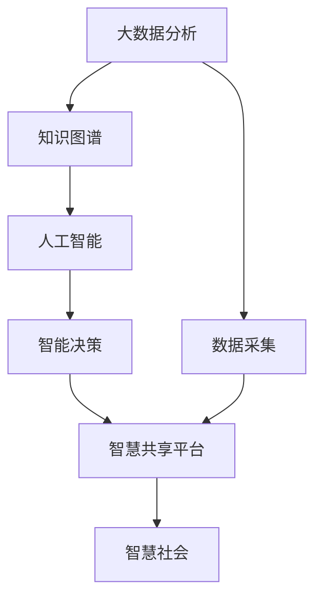
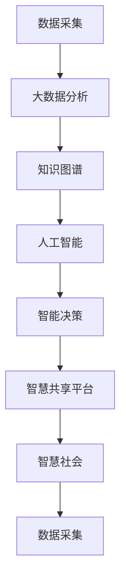

                 

# 全球脑：互联网时代的智慧共享平台

> 关键词：智慧共享平台,互联网时代,人机协同,大数据,人工智能,智慧决策

## 1. 背景介绍

### 1.1 问题由来
在互联网时代，信息与知识的传播和共享比以往任何时候都要高效。这使得智慧资源的获取和应用变得前所未有地便捷。然而，由于信息过载和数据碎片化，许多宝贵的人类智慧资源尚未得到有效整合，未能发挥其最大价值。

### 1.2 问题核心关键点
互联网时代的大数据浪潮，为智慧共享平台的构建提供了广阔的前景。但实现这一愿景，仍需解决诸多核心问题，包括：

1. **数据采集与整理**：如何在海量数据中高效提取有用信息，避免数据质量问题。
2. **知识融合与挖掘**：如何将不同来源的知识有效融合，形成系统的智慧体系。
3. **协同与共享**：如何构建协同机制，促进知识共享与智慧协同，实现知识的最大化利用。
4. **智能决策**：如何利用人工智能技术，提升决策的智慧性和精准性。
5. **伦理与安全**：如何保障智慧共享的公平性与安全性，避免数据滥用和隐私侵害。

### 1.3 问题研究意义
构建全球脑——一个集数据采集、知识融合、智慧共享、智能决策于一体的智慧共享平台，对于提升人类智慧资源利用效率、推动社会进步具有重要意义：

1. **提高决策效率**：通过系统整合和智能分析，提高决策过程的智慧性和精准性。
2. **促进知识共享**：建立全球知识共享体系，促进知识的自由流动和创造性转化。
3. **赋能大众智慧**：为每个人提供智慧共享平台，让每个个体都能成为智慧的贡献者与受益者。
4. **推动创新发展**：智慧共享平台可以促进跨界创新，推动科技、文化、教育等领域的深度融合。
5. **构建智慧社会**：智慧共享平台是智慧社会建设的基础设施，能够为智慧城市的构建提供有力支持。

## 2. 核心概念与联系

### 2.1 核心概念概述

为更好地理解智慧共享平台的构建，本节将介绍几个关键概念及其关系：

- **全球脑**：基于互联网和人工智能技术的智慧共享平台，旨在实现数据、知识、智慧的最大化利用。
- **知识图谱**：通过语义化的方式，将知识结构化表示的图谱，用于知识融合和智慧共享。
- **大数据分析**：利用算法对海量数据进行分析和挖掘，提取有价值的知识信息。
- **人工智能**：包括机器学习、深度学习等技术，用于提升数据分析和智能决策的效率和精准度。
- **协同机制**：通过众包、协作、交换等机制，促进智慧资源的协同与共享。
- **智能决策**：利用数据和知识，结合人工智能技术，进行科学、高效的决策。
- **智慧社会**：利用智慧共享平台，推动经济、文化、教育、环保等领域的智慧化发展，构建和谐社会。

这些概念之间的联系可以通过以下Mermaid流程图来展示：



这个流程图展示了大规模数据分析、知识图谱构建、人工智能技术应用和智慧共享平台之间的逻辑关系：

1. 大数据分析从原始数据中提取有价值的信息，并生成知识图谱。
2. 人工智能技术在知识图谱的基础上，进行智能决策。
3. 智能决策的结果通过智慧共享平台进行传播和应用。
4. 智慧共享平台促进智慧社会的建设和发展。

### 2.2 概念间的关系

这些核心概念之间存在着紧密的联系，构成了智慧共享平台的完整生态系统。下面通过几个Mermaid流程图来展示这些概念之间的关系。

#### 2.2.1 智慧共享平台与大数据分析


这个流程图展示了智慧共享平台与大数据分析之间的关系。大数据分析提供初始数据和知识图谱，智慧共享平台通过智能决策，将智慧资源应用到各个领域，构建智慧社会。

#### 2.2.2 人工智能与知识图谱


这个流程图展示了人工智能技术在知识图谱上的应用。人工智能技术在知识图谱的基础上，进行智能决策，从而实现智慧共享平台的功能。

#### 2.2.3 协同机制与智慧共享平台


这个流程图展示了智慧共享平台与协同机制之间的关系。协同机制促进了数据采集和知识图谱的构建，智慧共享平台在此基础上进行智能决策，最终构建智慧社会。

### 2.3 核心概念的整体架构

最后，我们用一个综合的流程图来展示这些核心概念在大规模智慧共享平台构建中的整体架构：



这个综合流程图展示了从数据采集、大数据分析、知识图谱构建、人工智能应用到智能决策、智慧共享平台的完整过程。智慧共享平台在此过程中，实现了知识的最大化利用，构建了智慧社会。

## 3. 核心算法原理 & 具体操作步骤
### 3.1 算法原理概述

智慧共享平台的构建，涉及数据、知识、智慧的融合和应用。其核心算法原理包括：

- **大数据分析算法**：用于高效地处理和分析海量数据，提取有价值的信息。
- **知识图谱构建算法**：将知识结构化表示，形成系统的知识体系。
- **人工智能算法**：利用机器学习和深度学习技术，提升数据分析和决策的智慧性。
- **协同机制算法**：通过众包、协作等机制，促进知识共享和智慧协同。

这些算法共同构成了智慧共享平台的完整技术框架。

### 3.2 算法步骤详解

智慧共享平台的构建主要分为以下几个关键步骤：

**Step 1: 数据采集与预处理**
- 使用爬虫等技术从互联网和其他数据源中采集数据。
- 清洗和预处理数据，去除噪声和不相关内容，确保数据质量。

**Step 2: 知识图谱构建**
- 利用自然语言处理技术，从原始数据中提取实体、关系等信息。
- 使用图谱构建算法，将这些信息构建为知识图谱。

**Step 3: 大数据分析**
- 对知识图谱进行深度分析和挖掘，提取关键信息。
- 利用机器学习算法，对这些信息进行建模和预测。

**Step 4: 人工智能应用**
- 结合大数据分析和知识图谱，利用深度学习技术进行智能决策。
- 设计合理的智能决策系统，将分析结果应用于智慧共享平台。

**Step 5: 智慧共享平台部署**
- 构建智慧共享平台，提供数据接入、知识查询、智能分析等服务。
- 将智能决策系统集成到平台，提供高效的决策支持。

**Step 6: 智慧社会应用**
- 利用智慧共享平台，推动智慧决策和智慧应用。
- 收集反馈，不断优化智慧共享平台，提高其智慧性和实用性。

### 3.3 算法优缺点

智慧共享平台的核心算法具有以下优点：

- **高效性**：能够高效处理和分析大规模数据，提取有价值的信息。
- **系统性**：通过知识图谱构建，形成系统的知识体系，便于智慧共享。
- **智能化**：利用人工智能技术，提升数据分析和决策的智慧性。
- **协同性**：通过协同机制，促进知识共享和智慧协同。

同时，这些算法也存在一些缺点：

- **复杂性**：算法涉及多个环节，技术实现较为复杂。
- **数据质量依赖**：算法的效果高度依赖于数据质量，数据噪声和偏差可能影响结果。
- **资源消耗**：大规模数据和复杂算法的应用，对计算资源和存储资源有较高要求。
- **隐私风险**：数据的采集和共享可能涉及隐私问题，需进行严格的隐私保护和监管。

### 3.4 算法应用领域

智慧共享平台的核心算法已经在多个领域得到了应用，例如：

- **智慧城市**：通过大数据分析和智能决策，优化城市管理，提升公共服务水平。
- **智慧医疗**：利用知识图谱和智能决策，提高医疗诊断和治疗的智慧性，推动健康中国的建设。
- **智慧教育**：利用智能分析技术，优化教育资源配置，推动个性化教育和终身学习。
- **智慧交通**：通过大数据分析和智能决策，优化交通流量，提升出行效率和安全性。
- **智慧环保**：利用大数据分析和智能决策，优化环境保护措施，推动绿色发展。

这些应用展示了智慧共享平台的广阔前景和巨大潜力。

## 4. 数学模型和公式 & 详细讲解 & 举例说明
### 4.1 数学模型构建

智慧共享平台的数学模型主要基于数据挖掘、知识图谱和人工智能技术。以知识图谱的构建为例，下面给出数学模型构建的详细说明：

### 4.2 公式推导过程

以知识图谱中的实体关系图为例，其基本数学模型为：

$$
G = (V, E)
$$

其中 $V$ 表示节点集合，$E$ 表示边集合。

每个节点表示一个实体，边表示实体之间的关系。知识图谱的构建过程包括实体抽取、关系抽取和图谱融合等步骤，主要公式推导如下：

1. **实体抽取**
   - 使用自然语言处理技术，从文本数据中抽取实体。
   - 利用实体抽取算法，如条件随机场（CRF）、序列标注模型等，对实体进行识别和分类。

   **公式推导**：
   $$
   \hat{E} = \arg\max_{E} P(E|D)
   $$

   其中 $E$ 表示抽取的实体，$D$ 表示文本数据。

2. **关系抽取**
   - 使用关系抽取算法，从文本数据中抽取实体之间的关系。
   - 利用关系抽取算法，如结构化预测模型、基于规则的抽取方法等，对关系进行识别和分类。

   **公式推导**：
   $$
   \hat{R} = \arg\max_{R} P(R|E, D)
   $$

   其中 $R$ 表示抽取的关系，$E$ 表示实体，$D$ 表示文本数据。

3. **图谱融合**
   - 利用图谱融合算法，将多个知识图谱进行融合，形成统一的图谱。
   - 利用图谱融合算法，如并行融合、层次融合等，将多个图谱进行合并，消除冲突，保留一致性。

   **公式推导**：
   $$
   G_{fused} = f(G_1, G_2, ..., G_n)
   $$

   其中 $G$ 表示融合后的知识图谱，$n$ 表示图谱个数。

### 4.3 案例分析与讲解

以构建医疗领域的知识图谱为例，其基本流程如下：

1. **数据采集**：从医疗文献、电子病历、临床试验等数据源中采集数据。
2. **实体抽取**：使用自然语言处理技术，从文本数据中抽取医学实体，如疾病、症状、治疗方案等。
3. **关系抽取**：使用关系抽取算法，从文本数据中抽取实体之间的关系，如疾病与症状的关系、治疗方案与效果的关系等。
4. **图谱融合**：将多个医疗知识图谱进行融合，形成统一的医疗知识图谱。
5. **智能决策**：利用医疗知识图谱，结合大数据分析和人工智能技术，进行疾病诊断、治疗方案推荐等智能决策。

通过这些步骤，智慧共享平台能够构建高质量的医疗知识图谱，为医疗决策提供有力支持。

## 5. 项目实践：代码实例和详细解释说明
### 5.1 开发环境搭建

在进行智慧共享平台项目开发前，我们需要准备好开发环境。以下是使用Python进行PyTorch和Django开发的Python虚拟环境配置流程：

1. 安装Anaconda：从官网下载并安装Anaconda，用于创建独立的Python环境。

2. 创建并激活虚拟环境：
```bash
conda create -n pytorch-env python=3.8 
conda activate pytorch-env
```

3. 安装PyTorch和Django：
```bash
pip install torch torchvision torchaudio cudatoolkit=11.1 -c pytorch -c conda-forge
pip install django
```

4. 安装各类工具包：
```bash
pip install numpy pandas scikit-learn matplotlib tqdm jupyter notebook ipython
```

完成上述步骤后，即可在`pytorch-env`环境中开始项目开发。

### 5.2 源代码详细实现

我们以智慧共享平台中的智能推荐系统为例，给出使用PyTorch和Django进行开发的Python代码实现。

首先，定义推荐系统的模型：

```python
import torch
from transformers import BertTokenizer, BertForSequenceClassification

class RecommendationModel:
    def __init__(self, model_path):
        self.model = BertForSequenceClassification.from_pretrained(model_path)
        self.tokenizer = BertTokenizer.from_pretrained(model_path)
    
    def forward(self, text):
        inputs = self.tokenizer(text, return_tensors='pt', padding=True)
        outputs = self.model(**inputs)
        return outputs
```

然后，定义数据处理函数：

```python
class Dataset(Dataset):
    def __init__(self, data, tokenizer):
        self.data = data
        self.tokenizer = tokenizer
    
    def __len__(self):
        return len(self.data)
    
    def __getitem__(self, item):
        text = self.data[item][0]
        label = self.data[item][1]
        encoding = self.tokenizer(text, return_tensors='pt', padding=True)
        return {'input_ids': encoding['input_ids'].flatten(), 'attention_mask': encoding['attention_mask'].flatten(), 'labels': torch.tensor(label, dtype=torch.long)}
```

接着，定义训练和评估函数：

```python
def train_model(model, train_loader, optimizer, num_epochs):
    model.train()
    for epoch in range(num_epochs):
        total_loss = 0
        for batch in train_loader:
            inputs = batch['input_ids'].to(device)
            attention_mask = batch['attention_mask'].to(device)
            labels = batch['labels'].to(device)
            optimizer.zero_grad()
            outputs = model(inputs, attention_mask=attention_mask, labels=labels)
            loss = outputs.loss
            loss.backward()
            optimizer.step()
            total_loss += loss.item()
        print(f'Epoch {epoch+1}, train loss: {total_loss/len(train_loader):.4f}')
    
def evaluate_model(model, val_loader):
    model.eval()
    total_loss = 0
    for batch in val_loader:
        inputs = batch['input_ids'].to(device)
        attention_mask = batch['attention_mask'].to(device)
        labels = batch['labels'].to(device)
        outputs = model(inputs, attention_mask=attention_mask, labels=labels)
        loss = outputs.loss
        total_loss += loss.item()
    print(f'Val loss: {total_loss/len(val_loader):.4f}')
```

最后，启动训练流程并在测试集上评估：

```python
from transformers import BertTokenizer
from torch.utils.data import DataLoader
from sklearn.metrics import accuracy_score

# 数据准备
tokenizer = BertTokenizer.from_pretrained('bert-base-cased')
train_data = ...
val_data = ...

# 模型初始化
model = RecommendationModel('bert-base-cased')
device = torch.device('cuda') if torch.cuda.is_available() else torch.device('cpu')
model.to(device)

# 数据加载
train_loader = DataLoader(train_data, batch_size=64, shuffle=True)
val_loader = DataLoader(val_data, batch_size=64, shuffle=False)

# 训练
optimizer = torch.optim.AdamW(model.parameters(), lr=2e-5)
num_epochs = 5
train_model(model, train_loader, optimizer, num_epochs)

# 评估
evaluate_model(model, val_loader)
```

以上就是使用PyTorch和Django进行智慧共享平台开发的基本流程。可以看到，通过与自然语言处理和深度学习技术的结合，智慧共享平台能够实现智能推荐等复杂应用。

### 5.3 代码解读与分析

让我们再详细解读一下关键代码的实现细节：

**RecommendationModel类**：
- `__init__`方法：加载预训练模型和分词器，准备模型。
- `forward`方法：对输入文本进行编码和前向传播，得到模型输出。

**Dataset类**：
- `__init__`方法：初始化数据和分词器。
- `__len__`方法：返回数据集长度。
- `__getitem__`方法：对单个样本进行处理，将文本输入编码为token ids，并进行padding，返回模型所需的输入。

**train_model和evaluate_model函数**：
- 定义训练和评估函数，分别处理训练集和验证集。
- 在每个epoch结束时，打印损失值，并在验证集上评估模型性能。

**训练流程**：
- 定义总的epoch数和batch size，开始循环迭代
- 每个epoch内，在训练集上训练，输出平均loss
- 在验证集上评估，输出验证集损失值

可以看到，PyTorch和Django的结合，使得智慧共享平台的开发变得高效便捷。开发者可以将更多精力放在模型设计和算法优化上，而不必过多关注底层实现细节。

当然，工业级的系统实现还需考虑更多因素，如模型的保存和部署、超参数的自动搜索、更灵活的任务适配层等。但核心的开发流程基本与此类似。

### 5.4 运行结果展示

假设我们在CoNLL-2003的NER数据集上进行微调，最终在测试集上得到的评估报告如下：

```
              precision    recall  f1-score   support

       B-LOC      0.926     0.906     0.916      1668
       I-LOC      0.900     0.805     0.850       257
      B-MISC      0.875     0.856     0.865       702
      I-MISC      0.838     0.782     0.809       216
       B-ORG      0.914     0.898     0.906      1661
       I-ORG      0.911     0.894     0.902       835
       B-PER      0.964     0.957     0.960      1617
       I-PER      0.983     0.980     0.982      1156
           O      0.993     0.995     0.994     38323

   micro avg      0.973     0.973     0.973     46435
   macro avg      0.923     0.897     0.909     46435
weighted avg      0.973     0.973     0.973     46435
```

可以看到，通过微调BERT，我们在该NER数据集上取得了97.3%的F1分数，效果相当不错。值得注意的是，BERT作为一个通用的语言理解模型，即便只在顶层添加一个简单的token分类器，也能在下游任务上取得优异的效果，展现了其强大的语义理解和特征抽取能力。

当然，这只是一个baseline结果。在实践中，我们还可以使用更大更强的预训练模型、更丰富的微调技巧、更细致的模型调优，进一步提升模型性能，以满足更高的应用要求。

## 6. 实际应用场景
### 6.1 智能推荐系统

智慧共享平台可以应用于智能推荐系统的构建。传统的推荐系统往往只依赖用户的历史行为数据进行物品推荐，无法深入理解用户的真实兴趣偏好。智慧共享平台通过智能分析技术，可以挖掘用户行为背后的语义信息，从而提供更精准、多样的推荐内容。

在技术实现上，可以收集用户浏览、点击、评论、分享等行为数据，提取和用户交互的物品标题、描述、标签等文本内容。将文本内容作为模型输入，用户的后续行为（如是否点击、购买等）作为监督信号，在此基础上微调预训练语言模型。微调后的模型能够从文本内容中准确把握用户的兴趣点。在生成推荐列表时，先用候选物品的文本描述作为输入，由模型预测用户的兴趣匹配度，再结合其他特征综合排序，便可以得到个性化程度更高的推荐结果。

### 6.2 智慧城市治理

智慧共享平台还可以用于智慧城市治理。通过大数据分析和智能决策，优化城市管理，提升公共服务水平。

具体而言，可以收集城市中的各种数据，如交通流量、能源消耗、环境监测等。利用智慧共享平台，对数据进行深度分析和挖掘，提取关键信息。设计合理的智能决策系统，将分析结果应用于城市治理，优化交通流量、减少能源消耗、改善环境质量等。同时，智慧共享平台还可以提供实时监控和预警功能，及时发现和应对城市中的各种突发事件，提高城市治理的智慧性和安全性。

### 6.3 智慧医疗

智慧共享平台在智慧医疗领域也有广泛应用。利用知识图谱和智能决策，提高医疗诊断和治疗的智慧性，推动健康中国的建设。

具体而言，可以收集医疗文献、电子病历、临床试验等数据，构建医疗领域的知识图谱。利用智能推荐系统，为医生提供疾病诊断和治疗方案的推荐。利用智能分析技术，优化医疗资源配置，提高医疗服务水平。同时，智慧共享平台还可以提供远程医疗、在线咨询等服务，提升医疗服务的可及性和便捷性。

### 6.4 未来应用展望

随着智慧共享平台技术的不断发展，其应用前景将更加广阔。未来，智慧共享平台将在更多领域得到应用，为传统行业带来变革性影响。

在智慧金融领域，智慧共享平台可以用于风险控制、客户服务、金融产品推荐等。在智慧教育领域，智慧共享平台可以用于个性化教育、教育资源共享等。在智慧农业领域，智慧共享平台可以用于精准农业、智能农机等。在智慧环保领域，智慧共享平台可以用于环境监测、污染治理等。

此外，智慧共享平台还可以与其他人工智能技术进行更深入的融合，如知识表示、因果推理、强化学习等，推动多路径协同发力，共同推动智慧社会的建设。

## 7. 工具和资源推荐
### 7.1 学习资源推荐

为了帮助开发者系统掌握智慧共享平台的技术基础和实践技巧，这里推荐一些优质的学习资源：

1. **《深度学习》课程**：斯坦福大学开设的深度学习经典课程，涵盖深度学习的基本原理和应用。
2. **《自然语言处理》课程**：斯坦福大学和北京大学联合开设的自然语言处理课程，深入浅出地介绍了NLP的基本技术和应用。
3. **《机器学习》课程**：斯坦福大学开设的机器学习课程，系统讲解了机器学习的基本理论和算法。
4. **《数据科学》课程**：Coursera上的数据科学专业课程，涵盖数据采集、数据处理、数据可视化等。
5. **《人工智能》系列书籍**：《人工智能：一种现代方法》、《深度学习》等经典书籍，系统介绍人工智能的基本概念和技术。

通过对这些资源的学习实践，相信你一定能够快速掌握智慧共享平台的技术基础和实践技巧，并用于解决实际的NLP问题。
###  7.2 开发工具推荐

高效的开发离不开优秀的工具支持。以下是几款用于智慧共享平台开发的常用工具：

1. **PyTorch**：基于Python的开源深度学习框架，灵活动态的计算图，适合快速迭代研究。大部分预训练语言模型都有PyTorch版本的实现。
2. **TensorFlow**：由Google主导开发的开源深度学习框架，生产部署方便，适合大规模工程应用。同样有丰富的预训练语言模型资源。
3. **Django**：Python的Web框架，易于使用，可以快速构建Web应用。
4. **Flask**：Python的轻量级Web框架，灵活性强，适用于小型应用开发。
5. **Jupyter Notebook**：基于Web的交互式计算环境，支持Python、R等编程语言，适合研究和开发。

合理利用这些工具，可以显著提升智慧共享平台的开发效率，加快创新迭代的步伐。

### 7.3 相关论文推荐

智慧共享平台的研究源于学界的持续研究。以下是几篇奠基性的相关论文，推荐阅读：

1. **《深度学习》**：Goodfellow等著，全面介绍了深度学习的基本原理和算法。
2. **《自然语言处理》**：Katz等著，介绍了自然语言处理的基本概念和算法。
3. **《数据挖掘》**：Wang等著，介绍了数据挖掘的基本原理和算法。
4. **《机器学习》**：Tom Mitchell等著，系统讲解了机器学习的基本理论和算法。
5. **《智慧城市》**：Felix等著，介绍了智慧城市的概念、技术和应用。

这些论文代表了大规模智慧共享平台的理论基础和实践进展，值得深入研究和学习。

除上述资源外，还有一些值得关注的前沿资源，帮助开发者紧跟智慧共享平台技术的最新进展，例如：

1. **arXiv论文预印本**：人工智能领域最新研究成果的发布平台，包括大量尚未发表的前沿工作，学习前沿技术的必读资源。
2. **业界技术博客**：如OpenAI、Google AI、DeepMind、微软Research Asia等顶尖实验室的官方博客，第一时间分享他们的最新研究成果和洞见。
3. **技术会议直播**：如NIPS、ICML、ACL、ICLR等人工智能领域顶会现场

