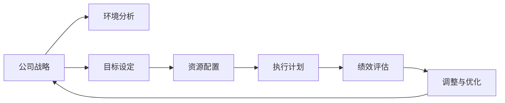

                 

# 公司发展战略、年度经营计划制定，组织制定和实施

## 1. 背景介绍

### 1.1 问题由来

在现代企业运营中，制定和实施公司发展战略和年度经营计划是企业持续发展和增长的关键。这些计划不仅能帮助公司明确发展方向，还能指导具体业务运营和资源配置，确保公司目标的实现。然而，制定和实施这些计划的复杂性常常使得企业管理者面临诸多挑战。一方面，公司需要考虑市场环境、竞争对手、内部资源等多方面因素；另一方面，计划制定后，如何确保计划得到有效执行，是管理层需要重点考虑的问题。本文将深入探讨公司发展战略和年度经营计划制定的基本原理、详细步骤，以及如何组织实施这些计划，为管理者提供系统性、可操作的指导。

### 1.2 问题核心关键点

公司发展战略和年度经营计划的制定，涉及多个关键要素，包括但不限于：
1. **环境分析**：对公司内外部的宏观环境和行业趋势进行全面分析，评估市场机会和威胁。
2. **目标设定**：明确公司的长期和短期目标，包括财务目标、市场份额目标、客户满意度目标等。
3. **战略选择**：根据环境分析结果和目标设定，制定相应的市场进入策略、产品开发策略、营销策略等。
4. **资源配置**：确定实现战略目标所需的资源，包括人力、资金、技术等。
5. **执行计划**：详细规划如何实现战略目标，包括具体行动、时间表、责任分配等。
6. **绩效评估**：建立关键绩效指标(KPIs)，监控战略实施进展，及时调整计划以确保目标达成。

### 1.3 问题研究意义

明确的公司发展战略和年度经营计划，能够帮助企业集中资源，提升竞争力，促进可持续发展。具体而言，研究这些关键问题具有以下重要意义：
1. **战略明确性**：确保公司发展方向与长期愿景一致，避免资源浪费。
2. **执行效率**：通过科学规划和系统执行，提高计划的实施效果。
3. **灵活性**：在实施过程中，能够根据环境变化灵活调整策略。
4. **绩效提升**：通过绩效评估和调整，持续提升公司业绩。

## 2. 核心概念与联系

### 2.1 核心概念概述

为了更好地理解公司发展战略和年度经营计划的制定过程，本文将介绍几个关键概念：

- **公司发展战略（Corporate Strategy）**：公司为实现其长远目标和愿景，在综合分析环境的基础上，制定出的全局性、长远性的规划。
- **年度经营计划（Annual Business Plan）**：根据公司战略，每年制定的具体业务运营和资源配置方案，确保战略目标的实现。
- **环境分析（Environmental Analysis）**：对公司所处的宏观和微观环境进行分析，包括市场、技术、政策等。
- **目标设定（Goal Setting）**：明确公司的短期和长期目标，是制定战略和计划的基础。
- **资源配置（Resource Allocation）**：确定实现战略目标所需的各种资源，并进行合理配置。
- **执行计划（Execution Plan）**：详细规划如何执行战略和计划，包括具体行动、时间表和责任分配。
- **绩效评估（Performance Evaluation）**：通过设定关键绩效指标(KPIs)，监控计划执行效果，及时调整以确保目标达成。

这些概念通过以下Mermaid流程图相互联系：



### 2.2 概念间的关系

这些概念通过以下Mermaid流程图展示它们之间的联系：

```mermaid
graph TB
    A[公司战略] --> B[年度经营计划]
    B --> C[财务计划]
    B --> D[市场计划]
    B --> E[人力资源计划]
    B --> F[研发计划]
    B --> G[生产计划]
    B --> H[销售计划]
    B --> I[采购计划]
    C --> J[预算编制]
    D --> K[产品开发]
    E --> L[员工招聘与培训]
    F --> M[技术创新]
    G --> N[生产调度]
    H --> O[市场推广]
    I --> P[供应商管理]
    J --> Q[成本控制]
    K --> R[产品测试与上线]
    L --> S[人才管理]
    M --> T[技术应用]
    N --> U[设备维护]
    O --> V[客户关系管理]
    P --> W[供应链优化]
    Q --> X[运营效率]
    R --> Y[用户体验]
    S --> Z[员工满意度]
    T --> AA[技术平台]
    U --> AB[设施保障]
    V --> AC[客户反馈]
    W --> AD[物流优化]
    X --> AE[运营成本]
    Y --> AF[客户忠诚度]
    Z --> AG[员工参与度]
    AA --> AH[技术创新应用]
    AB --> AI[设施优化]
    AC --> AJ[客户满意度提升]
    AD --> AK[供应链效率提升]
    AE --> AL[运营成本降低]
    AF --> AM[客户忠诚度提升]
    AG --> AN[员工参与度提升]
    AH --> AO[技术平台优化]
    AI --> AP[设施升级]
    AJ --> AQ[客户满意度提升]
    AK --> AR[供应链效率提升]
    AL --> AS[运营成本降低]
    AM --> AT[客户忠诚度提升]
    AN --> AU[员工参与度提升]
    AO --> AV[技术平台优化]
    AP --> AW[设施升级]
    AQ --> AX[客户满意度提升]
    AR --> AY[供应链效率提升]
    AS --> AZ[运营成本降低]
    AT --> BA[客户忠诚度提升]
    AU --> BB[员工参与度提升]
    AV --> BC[技术平台优化]
    AW --> BD[设施升级]
    AX --> BE[客户满意度提升]
    AY --> BF[供应链效率提升]
    AZ --> BG[运营成本降低]
    BA --> BH[客户忠诚度提升]
    BB --> BI[员工参与度提升]
    BC --> BJ[技术平台优化]
    BD --> BK[设施升级]
    BE --> BL[客户满意度提升]
    BF --> BM[供应链效率提升]
    BG --> BN[运营成本降低]
    BH --> BO[客户忠诚度提升]
    BI --> BP[员工参与度提升]
    BJ --> BQ[技术平台优化]
    BK --> BR[设施升级]
    BL --> BS[客户满意度提升]
    BM --> BT[供应链效率提升]
    BN --> BU[运营成本降低]
    BO --> BV[客户忠诚度提升]
    BP --> BW[员工参与度提升]
    BQ --> BX[技术平台优化]
    BR --> BY[设施升级]
    BS --> BZ[客户满意度提升]
    BT --> CA[客户忠诚度提升]
    BU --> CB[员工参与度提升]
    BV --> CC[技术平台优化]
    BW --> CD[设施升级]
    BZ --> CE[客户满意度提升]
    CA --> CF[客户忠诚度提升]
    CB --> CG[员工参与度提升]
    CC --> CH[技术平台优化]
    CD --> CI[设施升级]
    CE --> CJ[客户满意度提升]
    CF --> CK[客户忠诚度提升]
    CG --> CL[员工参与度提升]
    CH --> CM[技术平台优化]
    CI --> CN[设施升级]
    CJ --> CO[客户满意度提升]
    CK --> CR[客户忠诚度提升]
    CL --> CS[员工参与度提升]
    CM --> CU[技术平台优化]
    CN --> CV[设施升级]
    CO --> CW[客户满意度提升]
    CR --> CX[客户忠诚度提升]
    CS --> CY[员工参与度提升]
    CU --> CZ[技术平台优化]
    CV --> DA[设施升级]
    CW --> DB[客户满意度提升]
    CX --> DC[客户忠诚度提升]
    CY --> DD[员工参与度提升]
    CZ --> DE[技术平台优化]
    DA --> DF[设施升级]
    DB --> DG[客户满意度提升]
    DC --> DH[客户忠诚度提升]
    DD --> DI[员工参与度提升]
    DE --> DJ[技术平台优化]
    DF --> DK[设施升级]
    DG --> DL[客户满意度提升]
    DH --> DM[客户忠诚度提升]
    DI --> DN[员工参与度提升]
    DJ --> DO[技术平台优化]
    DK --> DP[设施升级]
    DL --> DQ[客户满意度提升]
    DM --> DR[客户忠诚度提升]
    DN --> DS[员工参与度提升]
    DO --> DT[技术平台优化]
    DP --> DU[设施升级]
    DQ --> DV[客户满意度提升]
    DR --> DW[客户忠诚度提升]
    DS --> DX[员工参与度提升]
    DT --> DY[技术平台优化]
    DU --> DZ[设施升级]
    DV --> EA[客户满意度提升]
    DW --> EB[客户忠诚度提升]
    DX --> EC[员工参与度提升]
    DY --> ED[技术平台优化]
    DZ --> EE[设施升级]
    EA --> EF[客户满意度提升]
    EB --> EG[客户忠诚度提升]
    EC --> EH[员工参与度提升]
    ED --> EE[技术平台优化]
    EE --> EF[设施升级]
    EF --> EH[客户满意度提升]
    EG --> EI[客户忠诚度提升]
    EH --> EJ[员工参与度提升]
    EI --> EK[技术平台优化]
    EJ --> EL[设施升级]
    EK --> EM[客户满意度提升]
    EL --> EM[客户忠诚度提升]
    EM --> EN[员工参与度提升]
    EN --> EO[技术平台优化]
    EO --> EP[设施升级]
    EP --> EQ[客户满意度提升]
    EQ --> ER[客户忠诚度提升]
    ER --> ES[员工参与度提升]
    ES --> ET[技术平台优化]
    ET --> EU[设施升级]
    EU --> EV[客户满意度提升]
    EV --> EW[客户忠诚度提升]
    EW --> EX[员工参与度提升]
    EX --> EY[技术平台优化]
    EY --> EA[设施升级]
    EZ --> FA[客户满意度提升]
    FA --> FB[客户忠诚度提升]
    FB --> FC[员工参与度提升]
    FC --> FD[技术平台优化]
    FD --> FE[设施升级]
    FE --> FF[客户满意度提升]
    FF --> FG[客户忠诚度提升]
    FG --> FH[员工参与度提升]
    FH --> FI[技术平台优化]
    FI --> FJ[设施升级]
    FJ --> FK[客户满意度提升]
    FK --> FL[客户忠诚度提升]
    FL --> FM[员工参与度提升]
    FM --> FN[技术平台优化]
    FN --> FO[设施升级]
    FO --> FP[客户满意度提升]
    FP --> FQ[客户忠诚度提升]
    FQ --> FR[员工参与度提升]
    FR --> FS[技术平台优化]
    FS --> FT[设施升级]
    FT --> FU[客户满意度提升]
    FU --> FV[客户忠诚度提升]
    FV --> FW[员工参与度提升]
    FW --> FZ[技术平台优化]
    FZ --> GA[设施升级]
    GA --> GB[客户满意度提升]
    GB --> GC[客户忠诚度提升]
    GC --> GD[员工参与度提升]
    GD --> GE[技术平台优化]
    GE --> GF[设施升级]
    GF --> GG[客户满意度提升]
    GG --> GH[客户忠诚度提升]
    GH --> GI[员工参与度提升]
    GI --> GJ[技术平台优化]
    GJ --> GK[设施升级]
    GK --> GL[客户满意度提升]
    GL --> GM[客户忠诚度提升]
    GM --> GN[员工参与度提升]
    GN --> GO[技术平台优化]
    GO --> GP[设施升级]
    GP --> GQ[客户满意度提升]
    GQ --> GR[客户忠诚度提升]
    GR --> GS[员工参与度提升]
    GS --> GT[技术平台优化]
    GT --> GU[设施升级]
    GU -->GV[客户满意度提升]
    GV --> GW[客户忠诚度提升]
    GW --> GX[员工参与度提升]
    GX --> GY[技术平台优化]
    GY --> GZ[设施升级]
    GZ --> HA[客户满意度提升]
    HA --> HB[客户忠诚度提升]
    HB --> HC[员工参与度提升]
    HC --> HD[技术平台优化]
    HD --> HE[设施升级]
    HE --> HF[客户满意度提升]
    HF --> HG[客户忠诚度提升]
    HG --> HH[员工参与度提升]
    HH --> HI[技术平台优化]
    HI --> HJ[设施升级]
    HJ --> HK[客户满意度提升]
    HK --> HL[客户忠诚度提升]
    HL --> HM[员工参与度提升]
    HM --> HN[技术平台优化]
    HN --> HO[设施升级]
    HO --> HP[客户满意度提升]
    HP --> HQ[客户忠诚度提升]
    HQ --> HR[员工参与度提升]
    HR --> HS[技术平台优化]
    HS --> HT[设施升级]
    HT --> HU[客户满意度提升]
    HU --> HV[客户忠诚度提升]
    HV --> HW[员工参与度提升]
    HW --> HZ[技术平台优化]
    HZ --> IA[设施升级]
    IA --> IB[客户满意度提升]
    IB --> IC[客户忠诚度提升]
    IC --> ID[员工参与度提升]
    ID --> IE[技术平台优化]
    IE --> IF[设施升级]
    IF --> IG[客户满意度提升]
    IG --> IH[客户忠诚度提升]
    IH --> II[员工参与度提升]
    II --> IJ[技术平台优化]
    IJ --> IK[设施升级]
    IK --> IL[客户满意度提升]
    IL --> IM[客户忠诚度提升]
    IM --> IN[员工参与度提升]
    IN --> IO[技术平台优化]
    IO --> IP[设施升级]
    IP --> IQ[客户满意度提升]
    IQ --> IR[客户忠诚度提升]
    IR --> IS[员工参与度提升]
    IS --> IT[技术平台优化]
    IT --> IU[设施升级]
    IU --> IV[客户满意度提升]
    IV --> IW[客户忠诚度提升]
    IW --> IX[员工参与度提升]
    IX --> IY[技术平台优化]
    IY --> IZ[设施升级]
    IZ --> JA[客户满意度提升]
    JA --> JB[客户忠诚度提升]
    JB --> JC[员工参与度提升]
    JC --> JD[技术平台优化]
    JD --> JE[设施升级]
    JE --> JF[客户满意度提升]
    JF --> JG[客户忠诚度提升]
    JG --> JH[员工参与度提升]
    JH --> JI[技术平台优化]
    JI --> JJ[设施升级]
    JJ --> JK[客户满意度提升]
    JK --> JL[客户忠诚度提升]
    JL --> JM[员工参与度提升]
    JM --> JN[技术平台优化]
    JN --> JO[设施升级]
    JO --> JP[客户满意度提升]
    JP --> JQ[客户忠诚度提升]
    JQ --> JR[员工参与度提升]
    JR --> JS[技术平台优化]
    JS --> JT[设施升级]
    JT --> JU[客户满意度提升]
    JU --> JV[客户忠诚度提升]
    JV --> JW[员工参与度提升]
    JW --> JX[技术平台优化]
    JX --> JY[设施升级]
    JY --> JZ[客户满意度提升]
    JZ -->KA[客户忠诚度提升]
    KA --> KB[员工参与度提升]
    KB --> KC[技术平台优化]
    KC --> KD[设施升级]
    KD --> KE[客户满意度提升]
    KE --> KF[客户忠诚度提升]
    KF --> KG[员工参与度提升]
    KG --> KH[技术平台优化]
    KH --> KI[设施升级]
    KI --> KJ[客户满意度提升]
    KJ --> KK[客户忠诚度提升]
    KK --> KL[员工参与度提升]
    KL --> KM[技术平台优化]
    KM --> KN[设施升级]
    KN --> KO[客户满意度提升]
    KO --> KP[客户忠诚度提升]
    KP --> KQ[员工参与度提升]
    KQ --> KR[技术平台优化]
    KR --> KS[设施升级]
    KS --> KT[客户满意度提升]
    KT --> KU[客户忠诚度提升]
    KU --> KV[员工参与度提升]
    KV --> KW[技术平台优化]
    KW --> KX[设施升级]
    KX --> KY[客户满意度提升]
    KY --> KZ[客户忠诚度提升]
    KZ --> LA[员工参与度提升]
    LA --> LB[技术平台优化]
    LB --> LC[设施升级]
    LC --> LD[客户满意度提升]
    LD --> LE[客户忠诚度提升]
    LE --> LF[员工参与度提升]
    LF --> LG[技术平台优化]
    LG --> LH[设施升级]
    LH --> LI[客户满意度提升]
    LI --> LJ[客户忠诚度提升]
    LJ --> LK[员工参与度提升]
    LK --> LL[技术平台优化]
    LL --> LM[设施升级]
    LM --> LN[客户满意度提升]
    LN --> LO[客户忠诚度提升]
    LO --> LP[员工参与度提升]
    LP --> LQ[技术平台优化]
    LQ --> LR[设施升级]
    LR --> LS[客户满意度提升]
    LS --> LT[客户忠诚度提升]
    LT --> LU[员工参与度提升]
    LU --> LV[技术平台优化]
    LV --> LW[设施升级]
    LW --> LX[客户满意度提升]
    LX --> LY[客户忠诚度提升]
    LY --> LZ[员工参与度提升]
    LZ --> MA[技术平台优化]
    MA --> MB[设施升级]
    MB --> MC[客户满意度提升]
    MC --> MD[客户忠诚度提升]
    MD --> ME[员工参与度提升]
    ME --> MF[技术平台优化]
    MF --> MG[设施升级]
    MG --> MH[客户满意度提升]
    MH --> MI[客户忠诚度提升]
    MI --> MJ[员工参与度提升]
    MJ --> MK[技术平台优化]
    MK --> ML[设施升级]
    ML --> MM[客户满意度提升]
    MM --> MN[客户忠诚度提升]
    MN --> MO[员工参与度提升]
    MO --> MP[技术平台优化]
    MP --> MQ[设施升级]
    MQ --> MR[客户满意度提升]
    MR --> MS[客户忠诚度提升]
    MS --> MT[员工参与度提升]
    MT --> MU[技术平台优化]
    MU --> MV[设施升级]
    MV --> MW[客户满意度提升]
    MW --> MX[客户忠诚度提升]
    MX --> MY[员工参与度提升]
    MY --> MZ[技术平台优化]
    MZ --> NA[设施升级]
    NA --> NB[客户满意度提升]
    NB --> NC[客户忠诚度提升]
    NC --> ND[员工参与度提升]
    ND --> NE[技术平台优化]
    NE --> NF[设施升级]
    NF --> NG[客户满意度提升]
    NG --> NH[客户忠诚度提升]
    NH --> NI[员工参与度提升]
    NI --> NJ[技术平台优化]
    NJ --> NK[设施升级]
    NK --> NL[客户满意度提升]
    NL --> NM[客户忠诚度提升]
    NM --> NN[员工参与度提升]
    NN --> NO[技术平台优化]
    NO --> NP[设施升级]
    NP --> NQ[客户满意度提升]
    NQ --> NR[客户忠诚度提升]
    NR --> NS[员工参与度提升]
    NS --> NT[技术平台优化]
    NT --> NU[设施升级]
    NU --> NV[客户满意度提升]
    NV --> NW[客户忠诚度提升]
    NW --> NX[员工参与度提升]
    NX --> NY[技术平台优化]
    NY --> NZ[设施升级]
    NZ --> OA[客户满意度提升]
    OA --> OB[客户忠诚度提升]
    OB --> OC[员工参与度提升]
    OC --> OD[技术平台优化]
    OD --> OE[设施升级]
    OE --> OF[客户满意度提升]
    OF --> OG[客户忠诚度提升]
    OG --> OH[员工参与度提升]
    OH --> OI[技术平台优化]
    OI --> OJ[设施升级]
    OJ --> OK[客户满意度提升]
    OK --> OL[客户忠诚度提升]
    OL --> OM[员工参与度提升]
    OM --> ON[技术平台优化]
    ON --> OP[设施升级]
    OP --> OQ[客户满意度提升]
    OQ --> OR[客户忠诚度提升]
    OR --> OS[员工参与度提升]
    OS --> OT[技术平台优化]
    OT --> OU[设施升级]
    OU -->OV[客户满意度提升]
    OV --> OW[客户忠诚度提升]
    OW --> OX[员工参与度提升]
    OX --> OY[技术平台优化]
    OY --> OZ[设施升级]
    OZ --> PA[客户满意度提升]
    PA --> PB[客户忠诚度提升]
    PB --> PC[员工参与度提升]
    PC --> PD[技术平台优化]
    PD --> PE[设施升级]
    PE --> PF[客户满意度提升]
    PF --> PG[客户忠诚度提升]
    PG --> PH[员工参与度提升]
    PH --> PI[技术平台优化]
    PI --> PJ[设施升级]
    PJ --> PK[客户满意度提升]
    PK --> PL[客户忠诚度提升]
    PL --> PM[员工参与度提升]
    PM --> PN[技术平台优化]
    PN --> PO[设施升级]
    PO --> PP[客户满意度提升]
    PP --> PQ[客户忠诚度提升]
    PQ --> PR[员工参与度提升]
    PR --> PS[技术平台优化]
    PS --> PT[设施升级]
    PT --> PU[客户满意度提升]
    PU --> PV[客户忠诚度提升]
    PV --> PW[员工参与度提升]
    PW --> PX[技术平台优化]
    PX --> PY[设施升级]
    PY --> PZ[客户满意度提升]
    PZ --> QA[客户忠诚度提升]
    QA --> QB[员工参与度提升]
    QB --> QC[技术平台优化]
    QC --> QD[设施升级]
    QD --> QE[客户满意度提升]
    QE --> QF[客户忠诚度提升]
    QF --> QG[员工参与度提升]
    QG --> QH[技术平台优化]
    QH --> QJ[设施升级]
    QJ --> QK[客户满意度提升]
    QK --> QL[客户忠诚度提升]
    QL --> QM[员工参与度提升]
    QM --> QN[技术平台优化]
    QN --> QO[设施升级]
    QO --> QP[客户满意度提升]
    QP --> QQ[客户忠诚度提升]
    QQ --> QR[员工参与度提升]
    QR --> QS[技术平台优化]
    QS --> QT[设施升级]
    QT --> QU[客户满意度提升]
    QU --> QV[客户忠诚度提升]
    QV --> QW[员工参与度提升]
    QW --> QX[技术平台优化]
    QX --> QY[设施升级]
    QY --> QZ[客户满意度提升]
    QZ --> RA[客户忠诚度提升]
    RA --> RB[员工参与度提升]
    RB --> RC[技术平台优化]
    RC --> RD[设施升级]
    RD --> RE[客户满意度提升]
    RE --> RF[客户忠诚度提升]
    RF --> RG[员工参与度提升]
    RG --> RH[技术平台优化]
    RH --> RJ[设施升级]
    RJ --> RK[客户满意度提升]
    RK --> RL[客户忠诚度提升]
    RL --> RM[员工参与度提升]
    RM --> RN[技术平台优化]
    RN --> RO[设施升级]
    RO --> RP[客户满意度提升]
    RP --> RQ[客户忠诚度提升]
    RQ --> RR[员工参与度提升]
    RR --> RS[技术平台优化]
    RS --> RT[设施升级]
    RT --> RU[客户满意度提升]
    RU --> RV[客户忠诚度提升]
    RV --> RW[员工参与度提升]
    RW --> RX[技术平台优化]
    RX --> RY[设施升级]
    RY --> RZ[客户满意度提升]
    RZ --> SA[客户忠诚度提升]
    SA --> SB[员工参与度提升]
    SB --> SC[技术平台优化]
    SC --> SD[设施升级]
    SD --> SE[客户满意度提升]
    SE --> SF[客户忠诚度提升]
    SF --> SG[员工参与度提升]
    SG --> SH[技术平台优化]
    SH --> SI[设施升级]
    SI --> SJ[客户满意度提升]
    SJ --> SK[客户忠诚度提升]
    SK --> SL[员工参与度提升]
    SL --> SM[技术平台优化]
    SM --> SN[设施升级]
    SN --> SO[客户满意度提升]
    SO --> SP[客户忠诚度提升]
    SP --> SQ[员工参与度提升]
    SQ --> SR[技术平台优化]
    SR --> SS[设施升级]
    SS --> ST[客户满意度提升]
    ST --> SU[客户忠诚度提升]
    SU --> SV[员工参与度提升]
    SV --> SW[技术平台优化]
    SW --> SX[设施升级]
    SX --> SY[客户满意度提升]
    SY --> SZ[客户忠诚度提升]
    SZ --> TA[员工参与度提升]
    TA --> TB[技术平台优化]
    TB --> TC[设施升级]
    TC --> TD[客户满意度提升]
    TD --> TE[客户忠诚度提升]
    TE

