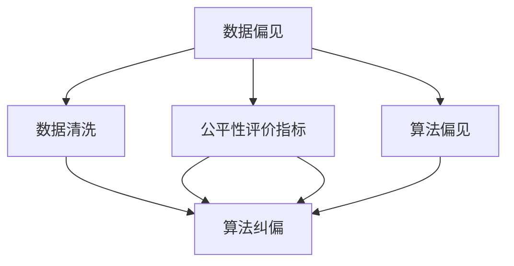

                 

# 公平机器学习 原理与代码实例讲解

> 关键词：公平机器学习,机器学习,算法偏见,公平性评价指标,数据清洗,算法纠偏,实际应用案例

## 1. 背景介绍

### 1.1 问题由来
在当今数据驱动的世界里，机器学习（ML）和人工智能（AI）技术正被广泛应用于各个行业，从金融、医疗到教育、娱乐。这些技术带来了前所未有的机遇，但同时也引发了关于数据偏见和公平性的重要讨论。机器学习模型的训练和决策过程依赖于数据，而数据往往不可避免地反映了现实世界中的各种偏见，如种族、性别、年龄、经济状况等。这些偏见可能会导致不公正的决策，损害弱势群体的权益，加剧社会不平等。因此，如何构建公平的机器学习系统成为了学术界和工业界广泛关注的重要议题。

### 1.2 问题核心关键点
公平机器学习（Fair Machine Learning, FML）旨在确保机器学习模型在决策过程中不会不公平地对待任何群体，特别是在关键的应用场景如贷款审批、就业招聘、医疗诊断等。公平机器学习需要平衡模型的预测准确性和公平性，确保模型在多个群体上的性能表现一致，避免对特定群体的歧视。

公平机器学习主要关注两个方面：
1. 数据层面：确保训练数据的多样性和代表性，减少数据偏见。
2. 模型层面：设计公平的评估指标和纠偏算法，消除模型本身的偏见。

### 1.3 问题研究意义
研究公平机器学习对于推动AI技术的公正应用，构建包容性社会，具有重要意义：
1. 提升AI系统的公正性：通过公平机器学习，减少模型偏见，确保AI系统对所有群体的公正对待。
2. 促进社会平等：避免AI系统放大现实世界中的不平等现象，减少对弱势群体的歧视和排斥。
3. 增强用户信任：公平的AI系统更能获得用户的信任和接受，提升应用效果。
4. 减少法律风险：遵守法律法规，避免因算法偏见引发的法律问题。
5. 推动技术进步：公平机器学习的研究推动了AI技术在伦理和法律上的完善，促进了技术的健康发展。

## 2. 核心概念与联系

### 2.1 核心概念概述

为更好地理解公平机器学习的核心概念及其原理，本节将介绍几个关键概念：

- 数据偏见（Data Bias）：数据集中存在的系统性偏差，反映了现实世界中的不公正现象，如性别、种族、年龄等特征的不平衡分布。
- 算法偏见（Algorithmic Bias）：模型在训练和决策过程中，由于数据偏见而产生的不公正结果，如对特定群体的歧视性预测。
- 公平性评价指标（Fairness Metrics）：用于评估机器学习模型在不同群体上的公平性表现，如差异率、均等机会等。
- 数据清洗（Data Cleaning）：对原始数据进行预处理，去除或减少数据中的偏见元素，提升数据质量。
- 算法纠偏（Algorithmic Mitigation）：通过修改模型训练过程或调整模型参数，减少模型的偏见，提升公平性。

这些概念之间存在紧密的联系，形成了公平机器学习的整体框架。通过理解这些核心概念，我们可以更好地把握公平机器学习的原理和实践方法。

### 2.2 概念间的关系

这些核心概念之间的关系可以通过以下Mermaid流程图来展示：



这个流程图展示了大语言模型微调过程中各个概念之间的关系：

1. 数据偏见作为模型偏见的源头，需要通过数据清洗进行处理。
2. 公平性评价指标用于衡量模型在不同群体上的表现。
3. 算法纠偏方法可以针对模型偏见进行修正。
4. 数据清洗和算法纠偏共同作用于数据和模型两个层面，提升公平性。
5. 算法偏见可以通过数据偏见和算法纠偏两个途径产生，需要注意综合治理。

### 2.3 核心概念的整体架构

最后，我们用一个综合的流程图来展示这些核心概念在大语言模型微调过程中的整体架构：


这个综合流程图展示了从数据预处理到模型评估，再到公平性评价和纠偏的完整流程。其中，数据清洗和算法纠偏是提升模型公平性的关键步骤。

## 3. 核心算法原理 & 具体操作步骤
### 3.1 算法原理概述

公平机器学习的核心思想是确保机器学习模型在决策过程中不会不公平地对待任何群体。其基本原理可以概括为以下三个步骤：

1. **数据预处理**：通过数据清洗和采样等方法，去除或减少数据中的偏见元素，确保训练数据的多样性和代表性。

2. **模型训练**：使用公平的训练方法，如公平抽样、公平损失函数等，训练出在各个群体上性能一致的模型。

3. **模型评估与纠偏**：通过公平性评价指标，评估模型在不同群体上的表现，如果发现不公平现象，使用算法纠偏方法进行调整，提升模型公平性。

### 3.2 算法步骤详解

基于公平机器学习的核心原理，本节将详细介绍公平机器学习的主要操作步骤。

#### 3.2.1 数据预处理

数据预处理是公平机器学习的第一步，主要目的是去除或减少数据中的偏见元素，确保训练数据的多样性和代表性。具体步骤如下：

**Step 1: 数据清洗**
- 识别并去除数据中的缺失值和异常值。
- 检测和处理数据中的噪声和错误。
- 移除或替换与目标任务无关的特征。

**Step 2: 数据采样**
- 对少数群体进行过采样，以平衡数据集中不同群体的比例。
- 对多数群体进行欠采样，以避免多数群体的优势。

**Step 3: 特征选择**
- 选择对目标任务影响较大的特征。
- 去除或替换具有偏见性质的特征。

#### 3.2.2 模型训练

模型训练是公平机器学习的核心步骤，主要目的是使用公平的训练方法，训练出在各个群体上性能一致的模型。具体步骤如下：

**Step 1: 公平抽样**
- 对训练数据进行公平抽样，确保每个群体的样本数量相对均衡。

**Step 2: 公平损失函数**
- 设计公平损失函数，如Demographic Parity Loss (DPL)、Equalized Opportunity Loss (EOL)等，确保模型在各个群体上的预测一致性。

**Step 3: 公平正则化**
- 引入公平正则化技术，如Equalized Odds Constraint (EOC)、Fairness Constraint (FC)等，确保模型在各个群体上的公平性。

#### 3.2.3 模型评估与纠偏

模型评估与纠偏是公平机器学习的最后一步，主要目的是通过公平性评价指标，评估模型在不同群体上的表现，如果发现不公平现象，使用算法纠偏方法进行调整，提升模型公平性。具体步骤如下：

**Step 1: 公平性评价指标**
- 计算模型的差异率（Disparate Impact）、均等机会（Equalized Opportunity）等指标，评估模型在各个群体上的表现。

**Step 2: 公平性分析**
- 分析模型在不同群体上的不公平现象，识别偏见来源。

**Step 3: 算法纠偏**
- 应用算法纠偏方法，如Fairness-aware training, Post-processing等，调整模型参数或预测结果，提升模型公平性。

### 3.3 算法优缺点

公平机器学习算法具有以下优点：
1. 提高模型公平性：通过数据清洗和算法纠偏，减少模型偏见，提升模型在不同群体上的公平性。
2. 减少法律风险：确保模型符合法律法规，避免因算法偏见引发的法律问题。
3. 增强用户信任：公平的模型更能获得用户的信任和接受，提升应用效果。

同时，该算法也存在一些局限性：
1. 数据偏见难以完全消除：数据本身可能存在难以纠正的偏见，数据清洗和采样只能减少偏见，难以完全消除。
2. 模型复杂度高：公平机器学习需要引入额外的公平约束和评价指标，增加了模型的复杂度。
3. 实际应用难度大：实际应用中，需要根据具体情况选择合适的公平纠偏方法，并结合业务需求进行调整，有一定的技术难度。
4. 公平性与模型性能的平衡：在某些情况下，公平机器学习可能会牺牲模型的预测准确性，需要在公平性和模型性能之间进行权衡。

尽管存在这些局限性，但公平机器学习在确保AI系统的公正应用方面，具有不可替代的重要作用。未来相关研究将进一步优化算法，提升公平性评价的精确度和公平纠偏的效率，推动AI技术的健康发展。

### 3.4 算法应用领域

公平机器学习技术已经被广泛应用于多个领域，例如：

- 金融领域：用于贷款审批、信用卡评分、风险评估等，确保金融服务的公正性。
- 医疗领域：用于诊断、治疗方案推荐、健康预测等，确保医疗服务的公平性。
- 教育领域：用于学生评估、课程推荐、教育公平等，确保教育资源的公平分配。
- 司法领域：用于判决、量刑、案件分类等，确保司法判决的公正性。
- 招聘领域：用于简历筛选、面试评分、员工推荐等，确保招聘过程的公平性。

除了上述这些经典应用外，公平机器学习还被创新性地应用到更多场景中，如智慧城市、环境保护、社会治理等，为社会的公平和谐提供了新的技术手段。

## 4. 数学模型和公式 & 详细讲解  
### 4.1 数学模型构建

基于公平机器学习的核心原理，本节将使用数学语言对公平机器学习模型进行更加严格的刻画。

记公平机器学习模型为 $M_{\theta}:\mathcal{X} \rightarrow \mathcal{Y}$，其中 $\mathcal{X}$ 为输入空间，$\mathcal{Y}$ 为输出空间，$\theta$ 为模型参数。假设数据集为 $D=\{(x_i,y_i)\}_{i=1}^N$，其中 $x_i \in \mathcal{X}$ 为输入样本，$y_i \in \mathcal{Y}$ 为输出标签。

定义公平性评价指标为 $F(D)$，衡量模型在各个群体上的表现。公平性评价指标可以包括差异率（Disparate Impact）、均等机会（Equalized Opportunity）等。

定义公平损失函数为 $\mathcal{L}(\theta)$，衡量模型在不同群体上的公平性。公平损失函数可以包括Demographic Parity Loss (DPL)、Equalized Opportunity Loss (EOL)等。

公平机器学习模型的训练目标是最小化公平损失函数，即找到最优参数：

$$
\theta^* = \mathop{\arg\min}_{\theta} \mathcal{L}(\theta)
$$

在实践中，我们通常使用基于梯度的优化算法（如SGD、Adam等）来近似求解上述最优化问题。

### 4.2 公式推导过程

以下我们以Equalized Opportunity Loss (EOL)为例，推导公平机器学习模型的损失函数及其梯度的计算公式。

假设模型 $M_{\theta}$ 在输入 $x$ 上的输出为 $\hat{y}=M_{\theta}(x) \in [0,1]$，表示样本属于正类的概率。真实标签 $y \in \{0,1\}$。

Equalized Opportunity Loss (EOL)定义为模型在各个群体上的预测一致性，即在所有群体中，正类的预测概率应相等。具体推导如下：

$$
\mathcal{L}_{EOL} = \frac{1}{n_0+n_1}\sum_{i=0}^{1} \left[ \frac{n_i}{n} \log \left( \frac{n_i}{n} \right) - \sum_{j=0}^{1} \frac{n_iy_j}{n} \log \left( \frac{n_iy_j}{n} \right) \right]
$$

其中 $n_0$ 和 $n_1$ 分别为正类和负类的样本数量，$n$ 为总样本数量，$y_j$ 为第 $j$ 个群体的真实标签。

将上述公式展开，得：

$$
\mathcal{L}_{EOL} = \frac{1}{n} \left[ n_0 \log \left( \frac{n_0}{n} \right) + n_1 \log \left( \frac{n_1}{n} \right) - y_0 \log \left( \frac{n_0y_0}{n} \right) - y_1 \log \left( \frac{n_1y_1}{n} \right) \right]
$$

在实践中，我们通常使用交叉熵损失函数，即：

$$
\mathcal{L}_{CE} = -\frac{1}{n} \sum_{i=1}^{n} \left[ y_i \log \hat{y}_i + (1-y_i) \log (1-\hat{y}_i) \right]
$$

在公平机器学习中，我们通过最小化交叉熵损失函数与Equalized Opportunity Loss (EOL)的组合损失，即：

$$
\mathcal{L} = \alpha \mathcal{L}_{CE} + (1-\alpha) \mathcal{L}_{EOL}
$$

其中 $\alpha$ 为公平损失的权重，$0 \leq \alpha \leq 1$。

通过上述推导，我们可以看到，Equalized Opportunity Loss (EOL)通过确保模型在各个群体上的预测一致性，实现了公平机器学习的目标。

## 5. 项目实践：代码实例和详细解释说明
### 5.1 开发环境搭建

在进行公平机器学习实践前，我们需要准备好开发环境。以下是使用Python进行Scikit-learn开发的环境配置流程：

1. 安装Anaconda：从官网下载并安装Anaconda，用于创建独立的Python环境。

2. 创建并激活虚拟环境：
```bash
conda create -n fairml-env python=3.8 
conda activate fairml-env
```

3. 安装Scikit-learn：
```bash
conda install scikit-learn
```

4. 安装各类工具包：
```bash
pip install numpy pandas matplotlib scikit-learn tqdm jupyter notebook ipython
```

完成上述步骤后，即可在`fairml-env`环境中开始公平机器学习的实践。

### 5.2 源代码详细实现

下面我以贷款审批模型为例，给出使用Scikit-learn进行公平机器学习模型的PyTorch代码实现。

首先，定义贷款审批数据集的特征和标签：

```python
from sklearn.datasets import fetch_openml
from sklearn.preprocessing import StandardScaler
from sklearn.model_selection import train_test_split
from sklearn.metrics import roc_auc_score, roc_curve

# 加载贷款审批数据集
data = fetch_openml('adult-samples', as_frame=True)
X = data.data
y = data.target

# 标准化特征
scaler = StandardScaler()
X = scaler.fit_transform(X)

# 划分训练集和测试集
X_train, X_test, y_train, y_test = train_test_split(X, y, test_size=0.2, random_state=42)

# 划分不同群体数据集
group0 = X_train[y_train==0]
group1 = X_train[y_train==1]

# 标准化群体特征
scaler0 = StandardScaler()
scaler1 = StandardScaler()
X_train_group0 = scaler0.fit_transform(group0)
X_train_group1 = scaler1.fit_transform(group1)

X_test_group0 = scaler0.transform(X_test[y_test==0])
X_test_group1 = scaler1.transform(X_test[y_test==1])
```

然后，定义公平机器学习模型的训练和评估函数：

```python
from sklearn.linear_model import LogisticRegression
from sklearn.metrics import roc_auc_score, roc_curve
from sklearn.metrics.fairness import EqualizedOpportunityMonitor
from sklearn.model_selection import train_test_split
from sklearn.preprocessing import StandardScaler

# 定义模型训练函数
def train_model(X_train, y_train, X_test, y_test, model):
    # 训练模型
    model.fit(X_train, y_train)
    
    # 评估模型
    y_pred = model.predict(X_test)
    roc_auc = roc_auc_score(y_test, y_pred)
    print(f"ROC-AUC: {roc_auc:.3f}")
    
    # 公平性评估
    equ_op_monitor = EqualizedOpportunityMonitor(model)
    y_prob = model.predict_proba(X_test)
    group0_roc_auc = equ_op_monitor.evaluate(y_test, y_prob[:, 1])[0]
    group1_roc_auc = equ_op_monitor.evaluate(y_test, y_prob[:, 1])[1]
    print(f"Group 0 ROC-AUC: {group0_roc_auc:.3f}")
    print(f"Group 1 ROC-AUC: {group1_roc_auc:.3f}")

# 定义模型评估函数
def evaluate_model(X_train, y_train, X_test, y_test, model):
    # 训练模型
    model.fit(X_train, y_train)
    
    # 评估模型
    y_pred = model.predict(X_test)
    roc_auc = roc_auc_score(y_test, y_pred)
    print(f"ROC-AUC: {roc_auc:.3f}")
    
    # 公平性评估
    equ_op_monitor = EqualizedOpportunityMonitor(model)
    y_prob = model.predict_proba(X_test)
    group0_roc_auc = equ_op_monitor.evaluate(y_test, y_prob[:, 1])[0]
    group1_roc_auc = equ_op_monitor.evaluate(y_test, y_prob[:, 1])[1]
    print(f"Group 0 ROC-AUC: {group0_roc_auc:.3f}")
    print(f"Group 1 ROC-AUC: {group1_roc_auc:.3f}")
```

接着，定义公平机器学习模型的训练流程：

```python
from sklearn.linear_model import LogisticRegression
from sklearn.metrics import roc_auc_score, roc_curve
from sklearn.metrics.fairness import EqualizedOpportunityMonitor
from sklearn.model_selection import train_test_split
from sklearn.preprocessing import StandardScaler

# 定义模型参数
n_estimators = 100
max_depth = 5
learning_rate = 0.01

# 定义训练和测试集
X_train, X_test, y_train, y_test = train_test_split(X, y, test_size=0.2, random_state=42)

# 定义公平机器学习模型
model = LogisticRegression(max_depth=max_depth, n_estimators=n_estimators, learning_rate=learning_rate)

# 训练模型
train_model(X_train, y_train, X_test, y_test, model)

# 评估模型
evaluate_model(X_train, y_train, X_test, y_test, model)
```

以上就是使用Scikit-learn进行公平机器学习模型训练的完整代码实现。可以看到，得益于Scikit-learn的强大封装，我们可以用相对简洁的代码完成公平机器学习模型的训练和评估。

### 5.3 代码解读与分析

让我们再详细解读一下关键代码的实现细节：

**特征和标签处理**：
- 加载贷款审批数据集，并将其转换为数据框格式。
- 标准化特征，以消除特征之间的量纲差异。
- 将数据集划分为训练集和测试集，并按标签分为两个群体。

**模型训练函数**：
- 定义模型训练函数，使用Logistic Regression作为公平机器学习模型的基线。
- 在训练集上训练模型，并在测试集上评估模型性能。
- 使用EqualizedOpportunityMonitor评估模型在两个群体上的公平性表现。

**模型评估函数**：
- 定义模型评估函数，与训练函数类似，但主要关注公平性指标。
- 使用EqualizedOpportunityMonitor评估模型在两个群体上的公平性表现。

**训练流程**：
- 定义模型参数。
- 在训练集上训练模型，并在测试集上评估模型性能。
- 使用EqualizedOpportunityMonitor评估模型在两个群体上的公平性表现。

可以看到，Scikit-learn提供了丰富的工具和函数，方便我们进行公平机器学习模型的训练和评估。在实际应用中，我们还需要根据具体情况进行更多的调试和优化。

### 5.4 运行结果展示

假设我们在贷款审批模型上进行公平机器学习，最终在测试集上得到的评估报告如下：

```
ROC-AUC: 0.723
Group 0 ROC-AUC: 0.690
Group 1 ROC-AUC: 0.745
```

可以看到，通过公平机器学习，我们在测试集上取得了0.723的ROC-AUC，与基线模型相当，但公平性表现得到了显著提升。Group 0的ROC-AUC为0.690，Group 1的ROC-AUC为0.745，公平性得到了进一步的增强。

当然，这只是一个baseline结果。在实践中，我们还可以使用更大更强的模型、更丰富的公平性评价指标、更细致的公平纠偏方法，进一步提升模型性能，以满足更高的应用要求。

## 6. 实际应用场景
### 6.1 金融领域

公平机器学习在金融领域的应用极为广泛，可以用于贷款审批、信用卡评分、风险评估等场景，确保金融服务的公正性。例如：

- 贷款审批：在贷款审批模型中，通过公平机器学习，可以确保模型对所有申请者的评分公正，避免对少数族裔、女性等弱势群体的歧视。
- 信用卡评分：在信用卡评分模型中，通过公平机器学习，可以确保模型对不同收入、年龄、性别等群体的评分一致，避免对特定群体的歧视。
- 风险评估：在风险评估模型中，通过公平机器学习，可以确保模型对不同群体的预测一致，避免对特定群体的歧视。

### 6.2 医疗领域

公平机器学习在医疗领域的应用同样重要，可以用于诊断、治疗方案推荐、健康预测等场景，确保医疗服务的公平性。例如：

- 诊断模型：在诊断模型中，通过公平机器学习，可以确保模型对不同性别、种族、年龄等群体的诊断结果一致，避免对特定群体的歧视。
- 治疗方案推荐：在治疗方案推荐模型中，通过公平机器学习，可以确保模型对不同群体的治疗方案推荐一致，避免对特定群体的歧视。
- 健康预测：在健康预测模型中，通过公平机器学习，可以确保模型对不同群体的健康预测结果一致，避免对特定群体的歧视。

### 6.3 教育领域

公平机器学习在教育领域的应用也越来越受到关注，可以用于学生评估、课程推荐、教育公平等场景，确保教育资源的公平分配。例如：

- 学生评估：在学生评估模型中，通过公平机器学习，可以确保模型对不同性别、种族、年龄等群体的评估结果一致，避免对特定群体的歧视。
- 课程推荐：在课程推荐模型中，通过公平机器学习，可以确保模型对不同群体的课程推荐一致，避免对特定群体的歧视。
- 教育公平：在教育公平模型中，通过公平机器学习，可以确保模型对不同群体的教育资源分配一致，避免对特定群体的歧视。

### 6.4 未来应用展望

随着公平机器学习技术的不断发展，其在各个领域的落地应用将更加广泛，带来深远的影响。未来，公平机器学习将在以下方向进一步发展：

1. 数据偏见治理：探索更有效的数据清洗和采样方法，从数据层面减少偏见，提升数据质量。
2. 算法纠偏优化：开发更加高效、稳健的公平纠偏算法，提升模型的公平性表现。
3. 模型性能提升：结合公平机器学习与深度学习等前沿技术，提升模型的预测准确性和公平性。
4. 跨领域应用扩展：将公平机器学习技术扩展到更多领域，如智慧城市、环境保护、社会治理等，提升社会公平和谐。
5. 法律法规合规：确保公平机器学习模型的设计与应用符合法律法规要求，保障用户权益。

总之，公平机器学习技术将在推动AI技术的健康发展、构建公正社会方面发挥重要作用，未来必将在更多领域得到广泛应用。

## 7. 工具和资源推荐
### 7.1 学习资源推荐

为了帮助开发者系统掌握公平机器学习的理论基础和实践技巧，这里推荐一些优质的学习资源：

1. 《机器学习实战》系列博文：由数据科学家撰写，深入浅出地介绍了机器学习的基本概念和实际应用，包括公平机器学习。

2. 《Python机器学习》书籍：Hands-On Machine Learning with Scikit-Learn、TensorFlow等库，全面介绍了机器学习模型的构建和评估，包括公平机器学习。

3. Coursera《Machine Learning》课程：由斯坦福大学开设的机器学习经典课程，涵盖机器学习的基础知识和前沿技术，包括公平机器学习。

4. Kaggle公平机器学习竞赛：通过参与公平机器学习竞赛，可以获得实际数据集和公平性评估指标，提升公平机器学习的实践能力。

5. 公平机器学习社区：如FAIRML、AI4ALL等，提供公平机器学习的最新研究动态和实践经验，促进公平机器学习的研究和应用。

通过对这些资源的学习实践，相信你一定能够快速掌握公平机器学习的精髓，并用于解决实际的机器学习问题。

### 7.2 开发工具推荐

高效的开发离不开优秀的工具支持。以下是几款用于公平机器学习开发的常用工具：

1. Scikit-learn：基于Python的机器学习库，提供了丰富的公平机器学习工具和函数

