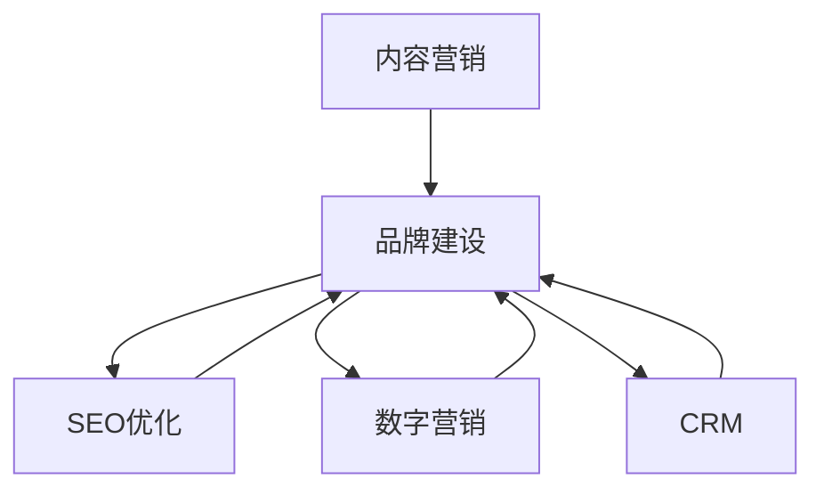

                 

# 内容营销创业：品牌建设的新思路

> 关键词：内容营销,品牌建设,SEO优化,数字营销,客户关系管理(CRM)

## 1. 背景介绍

### 1.1 问题由来

在当今数字化时代，传统的广告和销售手段已经无法满足企业增长的需求。随着消费者行为的变化，对内容的需求日益增长，内容营销成为了品牌建设的重要手段。内容营销不仅能够提升品牌形象，还能有效吸引和转化潜在客户，具有高回报率的特点。然而，对于许多初创企业来说，如何高效、低成本地进行内容营销，并形成品牌影响力，仍然是一个具有挑战性的问题。

### 1.2 问题核心关键点

内容营销的核心在于利用有价值的内容，通过各种渠道传递给目标受众，从而建立品牌认知、提升品牌形象和增加销售额。其关键点包括：

- 内容的质量和相关性：内容必须具有吸引力和相关性，能够满足目标受众的需求。
- 渠道的选择和优化：选择适合内容的发布平台，进行高效的渠道管理和优化。
- 数据分析和反馈：通过数据分析工具，不断优化内容策略，获取反馈并进行迭代。
- 客户互动和关系管理：通过互动和关系管理，增强客户黏性和忠诚度。

### 1.3 问题研究意义

深入研究内容营销方法，对于初创企业来说，具有重要的意义：

1. 降低营销成本：通过内容营销，可以降低传统广告和直销的成本，提高ROI。
2. 提升品牌形象：有价值的内容可以提升品牌的知名度和美誉度。
3. 增强客户互动：高质量的内容可以吸引客户进行互动，增加客户黏性。
4. 推动销售转化：有针对性和吸引力的内容可以提升客户的购买意愿，增加销售额。
5. 形成品牌资产：通过长期的内容营销，可以建立品牌认知和品牌资产。

## 2. 核心概念与联系

### 2.1 核心概念概述

- **内容营销(Content Marketing)**：一种以内容为核心的营销方式，通过创作和分享有价值的内容，吸引目标受众，提升品牌形象和销售。

- **品牌建设(Brand Building)**：通过一系列有策略的市场活动和内容营销，建立和强化品牌形象，提升品牌认知和美誉度。

- **SEO优化(Search Engine Optimization)**：通过优化网站和内容，提升在搜索引擎中的排名，增加网站流量和品牌曝光。

- **数字营销(Digital Marketing)**：利用数字技术手段进行营销活动，包括社交媒体营销、电子邮件营销等。

- **客户关系管理(CRM)**：通过管理客户数据和互动，提升客户满意度和忠诚度，增加回头客和推荐率。

这些核心概念之间有着紧密的联系，共同构成了内容营销和品牌建设的完整框架。内容营销是品牌建设的重要手段，而SEO优化、数字营销和CRM等则是具体实施的方法和工具。通过合理运用这些概念，可以系统性地提升品牌影响力和市场竞争力。

### 2.2 概念间的关系

这些核心概念之间的联系可以通过以下Mermaid流程图来展示：



这个流程图展示了大语言模型微调过程中各个概念之间的关系：

1. 内容营销是品牌建设的核心手段，通过创作和分享有价值的内容吸引受众。
2. SEO优化、数字营销和CRM是内容营销的具体实施方法，帮助提升品牌知名度和客户互动。
3. 品牌建设通过内容营销和其他方法不断强化品牌形象和美誉度。

通过理解这些概念之间的关系，可以更好地把握内容营销和品牌建设的本质，制定出更加有效的策略。

## 3. 核心算法原理 & 具体操作步骤
### 3.1 算法原理概述

内容营销的核心在于通过优质的内容吸引目标受众，并在不同的渠道上持续传播，提升品牌形象和销售转化。其核心算法原理可以总结如下：

1. **内容生成和创作**：创作符合目标受众需求的有价值内容，通过调研和分析确定内容主题和形式。
2. **渠道选择和优化**：选择适合的发布渠道，通过SEO优化、数字营销等手段，提升内容的曝光率和传播效果。
3. **数据分析和反馈**：通过数据分析工具，不断优化内容策略，获取反馈并进行迭代。
4. **客户互动和关系管理**：通过互动和关系管理，增强客户黏性和忠诚度。

### 3.2 算法步骤详解

以下详细介绍内容营销的具体操作步骤：

**Step 1: 内容策略规划**

- 确定目标受众：通过市场调研和数据分析，确定目标受众的特征和需求。
- 制定内容主题：根据受众需求和品牌定位，制定核心内容主题。
- 设定发布计划：规划内容发布的时间、频率和渠道。

**Step 2: 内容创作和优化**

- 内容创作：根据内容主题，创作高质量的文章、视频、图片等内容。
- SEO优化：优化内容标题、关键词和结构，提升搜索引擎排名。
- 数字营销：通过社交媒体、电子邮件等渠道进行内容推广。

**Step 3: 渠道选择和优化**

- 渠道选择：根据受众分布和内容类型，选择适合的发布平台，如博客、社交媒体、视频平台等。
- 渠道优化：通过数据分析和反馈，不断优化渠道策略，提升内容效果。

**Step 4: 数据分析和反馈**

- 数据分析：通过Google Analytics、社交媒体分析工具等，收集内容表现数据。
- 反馈获取：通过评论、互动和CRM系统，获取受众反馈，进行内容迭代。

**Step 5: 客户互动和关系管理**

- 互动增强：通过评论、点赞、分享等方式，增强客户互动和黏性。
- CRM应用：利用CRM系统管理客户数据和互动，提升客户满意度和忠诚度。

### 3.3 算法优缺点

内容营销具有以下优点：

- **成本低**：相比于传统广告和直销，内容营销的成本较低，具有较高的投入产出比。
- **高价值**：通过提供有价值的内容，可以吸引和转化潜在客户，提升品牌形象。
- **可持续性**：通过持续的内容创作和发布，可以逐步建立品牌影响力。

然而，内容营销也存在一些缺点：

- **制作复杂**：高质量内容的创作需要时间和资源投入，可能面临内容枯竭的问题。
- **效果受限**：内容营销的效果受制于受众的互动和反馈，难以保证立竿见影的效果。
- **资源需求**：需要持续的资源投入，包括内容创作、渠道管理和数据分析等。

### 3.4 算法应用领域

内容营销和品牌建设的应用领域非常广泛，涵盖了以下几个方面：

1. **电子商务**：通过内容营销，提升产品介绍和用户体验，增加销售转化。
2. **科技公司**：通过技术博客、产品评测等内容，提升品牌形象和知名度。
3. **教育机构**：通过教学视频、学习资源等内容，吸引潜在学生和家长，提升品牌美誉度。
4. **旅游行业**：通过景点介绍、旅行攻略等内容，提升品牌吸引力和市场竞争力。
5. **医疗健康**：通过健康知识、疾病预防等内容，提升品牌可信度和客户互动。

## 4. 数学模型和公式 & 详细讲解 & 举例说明

### 4.1 数学模型构建

设内容营销的目标受众为 $X$，内容主题为 $T$，发布频率为 $F$，渠道选择为 $C$，SEO优化效果为 $O$，数字营销效果为 $M$，数据分析结果为 $A$，客户互动效果为 $I$。则内容营销的总体效果 $E$ 可以表示为：

$$
E = f(X, T, F, C, O, M, A, I)
$$

其中 $f$ 为内容营销的效果函数，具体形式可以根据实际情况进行调整。

### 4.2 公式推导过程

内容营销效果函数的推导过程如下：

1. **受众影响**：受众特征和需求决定了内容创作和发布方向，影响内容的效果。
2. **内容质量**：内容的质量和相关性决定了受众的吸引力和转化率。
3. **发布频率**：发布频率决定了内容的曝光率和受众的互动。
4. **渠道选择**：渠道的选择和优化决定了内容的传播效果。
5. **SEO优化**：SEO优化提升了内容的搜索引擎排名，增加了流量。
6. **数字营销**：数字营销手段提升了内容的曝光率和互动效果。
7. **数据分析**：数据分析提供了反馈和优化建议，指导内容的迭代和改进。
8. **客户互动**：客户互动增强了客户黏性和忠诚度，提升了品牌美誉度。

通过上述影响因素，可以构建出内容营销的效果函数 $f$，具体形式可以根据实际情况进行调整和优化。

### 4.3 案例分析与讲解

假设我们运营一个旅游博客，目标是吸引更多潜在客户。我们可以按照以下步骤进行内容营销：

1. **受众分析**：通过调研，确定目标受众为对旅游感兴趣的年轻人群体，主要关注休闲旅行、文化体验和美食推荐。
2. **内容创作**：创作高质量的旅游攻略、景点介绍和美食推荐等内容，吸引目标受众的关注。
3. **SEO优化**：优化内容的关键词和结构，提升在搜索引擎中的排名。
4. **数字营销**：通过社交媒体和电子邮件推广内容，吸引更多流量。
5. **渠道选择**：选择适合的内容发布平台，如旅游论坛、博客和社交媒体。
6. **数据分析**：通过Google Analytics等工具，收集数据，分析内容效果。
7. **客户互动**：回复评论和私信，增强客户互动和忠诚度。

通过上述步骤，可以实现旅游博客的内容营销，提升品牌形象和客户互动。

## 5. 项目实践：代码实例和详细解释说明

### 5.1 开发环境搭建

在进行内容营销实践前，我们需要准备好开发环境。以下是使用Python进行SEO优化和数字营销的开发环境配置流程：

1. 安装Anaconda：从官网下载并安装Anaconda，用于创建独立的Python环境。

2. 创建并激活虚拟环境：
```bash
conda create -n content-marketing python=3.8 
conda activate content-marketing
```

3. 安装相关工具包：
```bash
pip install beautifulsoup4 requests scikit-learn pandas numpy
```

4. 配置SEO工具和分析工具：
```bash
pip install seaborn matplotlib
```

完成上述步骤后，即可在`content-marketing`环境中开始内容营销实践。

### 5.2 源代码详细实现

以下是一个简单的SEO优化和数字营销代码实现示例：

```python
import requests
from bs4 import BeautifulSoup
import pandas as pd
import seaborn as sns
import matplotlib.pyplot as plt

# 获取目标网站页面内容
def get_page_content(url):
    response = requests.get(url)
    soup = BeautifulSoup(response.content, 'html.parser')
    return soup

# 提取关键词和元标签
def extract_keywords_and_tags(soup):
    keywords = []
    tags = []
    for tag in soup.find_all('meta'):
        if 'name' in tag.attrs:
            if 'keywords' in tag.attrs['name']:
                keywords.append(tag.attrs['name'])
            if 'description' in tag.attrs['name']:
                tags.append(tag.attrs['name'])
    return keywords, tags

# 分析关键词和元标签分布
def analyze_keywords_and_tags(keywords, tags):
    keywords_df = pd.DataFrame(keywords, columns=['Keywords'])
    tags_df = pd.DataFrame(tags, columns=['Tags'])
    keywords_df['count'] = keywords_df['Keywords'].value_counts()
    tags_df['count'] = tags_df['Tags'].value_counts()
    keywords_df.sort_values(by='count', ascending=False, inplace=True)
    tags_df.sort_values(by='count', ascending=False, inplace=True)
    sns.barplot(data=keywords_df, x='Keywords', y='count')
    sns.barplot(data=tags_df, x='Tags', y='count')
    plt.show()

# 关键词和元标签分析
url = 'https://www.example.com'
soup = get_page_content(url)
keywords, tags = extract_keywords_and_tags(soup)
analyze_keywords_and_tags(keywords, tags)
```

### 5.3 代码解读与分析

让我们再详细解读一下关键代码的实现细节：

**get_page_content函数**：
- 通过requests库获取目标网站页面内容。

**extract_keywords_and_tags函数**：
- 使用BeautifulSoup库提取页面中的关键词和元标签，包括页面标题、描述、关键词等。

**analyze_keywords_and_tags函数**：
- 将提取的关键词和元标签转换为DataFrame格式，计算关键词和元标签的出现次数，并进行条形图展示。

通过上述代码，可以对目标网站的关键词和元标签进行分析，从而优化SEO策略，提升网站流量和品牌曝光。

### 5.4 运行结果展示

假设我们分析了一个旅游博客的关键词和元标签，得到如下结果：

- 关键词：旅游攻略、景点介绍、美食推荐
- 元标签：页面标题、描述、关键词

通过这些关键词和元标签，可以优化网站的SEO策略，吸引更多潜在客户，提升网站流量和品牌曝光。

## 6. 实际应用场景

### 6.1 电商平台

电商平台通过内容营销，可以提升产品介绍和用户体验，增加销售转化。具体而言，可以在产品页面上发布高质量的图文介绍、使用案例和客户评价等内容，通过SEO优化和数字营销手段提升内容曝光率，吸引更多流量和客户互动。同时，利用CRM系统管理客户数据和互动，提升客户满意度和忠诚度，增加回头客和推荐率。

### 6.2 科技公司

科技公司通过内容营销，可以提升品牌形象和知名度。具体而言，可以在博客、技术社区、视频平台等渠道上发布高质量的技术文章、产品评测和公司新闻等内容，通过SEO优化和数字营销手段提升内容曝光率，吸引更多受众关注和互动。同时，利用CRM系统管理客户数据和互动，提升品牌美誉度和客户黏性。

### 6.3 教育机构

教育机构通过内容营销，可以吸引潜在学生和家长，提升品牌美誉度。具体而言，可以在线上学习平台、社交媒体和博客等渠道上发布高质量的教学视频、学习资源和学生反馈等内容，通过SEO优化和数字营销手段提升内容曝光率，吸引更多受众关注和互动。同时，利用CRM系统管理客户数据和互动，提升客户满意度和忠诚度。

### 6.4 未来应用展望

随着内容营销的不断发展和应用，其前景将更加广阔：

1. **跨平台整合**：通过整合不同平台的内容和渠道，提升整体品牌影响力。
2. **数据驱动决策**：通过大数据和AI技术，进行更精准的内容推荐和策略优化。
3. **个性化内容**：通过用户行为和偏好分析，提供个性化推荐内容，提升用户体验。
4. **视频营销崛起**：随着视频内容的普及，视频营销将成为重要的内容形式。
5. **社交媒体互动**：通过社交媒体平台，进行更多的互动和关系管理，提升客户黏性和忠诚度。

## 7. 工具和资源推荐

### 7.1 学习资源推荐

为了帮助开发者系统掌握内容营销和品牌建设的技术基础和实践技巧，这里推荐一些优质的学习资源：

1. **《内容营销的科学与艺术》书籍**：深入浅出地介绍了内容营销的理论基础和实践技巧，适合初学者和进阶者阅读。

2. **谷歌数字营销课程**：谷歌开设的数字营销课程，涵盖SEO优化、数字营销和数据分析等多个方面，提供系统的学习路径。

3. **HubSpot博客**：HubSpot的博客提供了大量关于内容营销和品牌建设的实战案例和最佳实践，值得参考。

4. **Content Marketing Institute网站**：内容营销领域的权威网站，提供最新的行业动态、案例研究和工具资源。

5. **Social Media Examiner网站**：社交媒体营销领域的权威网站，提供社交媒体营销策略和技巧，帮助提升品牌影响力。

通过这些学习资源，相信你一定能够快速掌握内容营销和品牌建设的精髓，并用于解决实际的业务问题。

### 7.2 开发工具推荐

高效的内容营销开发需要借助一些优秀的工具支持。以下是几款常用的工具：

1. **SEO优化工具**：如SEMrush、Ahrefs、Moz等，提供关键词分析、网站排名、竞争分析等功能，帮助优化SEO策略。

2. **内容管理系统(CMS)**：如WordPress、Drupal、Joomla等，提供内容创建、发布和管理的功能，适合快速搭建内容营销平台。

3. **数字营销工具**：如Google Ads、Facebook Ads、LinkedIn Ads等，提供广告投放、数据分析和优化功能，帮助提升内容曝光率。

4. **数据分析工具**：如Google Analytics、Mixpanel、Hotjar等，提供流量分析、用户行为分析、热图分析等功能，帮助优化内容策略。

5. **CRM系统**：如Salesforce、HubSpot、Zoho CRM等，提供客户数据管理、互动跟踪和自动化功能，帮助提升客户满意度和忠诚度。

合理利用这些工具，可以显著提升内容营销的开发效率和效果，加快创新迭代的步伐。

### 7.3 相关论文推荐

内容营销和品牌建设的发展离不开学界的持续研究。以下是几篇奠基性的相关论文，推荐阅读：

1. **Content Marketing: Building Your Brand in a Web 2.0 World**：详细介绍了内容营销的基本概念、策略和案例，是内容营销领域的经典之作。

2. **Brand Building in the Digital Age**：讨论了数字时代品牌建设的新思路和策略，结合实际案例，深入浅出地讲解了品牌建设的方法和技巧。

3. **The Rise of Video Marketing**：分析了视频营销的兴起及其在品牌建设中的作用，提供了大量成功案例和策略建议。

4. **Customer Relationship Management: Past, Present, and Future**：探讨了CRM系统的发展历程和未来趋势，提供了关于CRM系统的深入分析和展望。

这些论文代表了大语言模型微调技术的发展脉络。通过学习这些前沿成果，可以帮助研究者把握学科前进方向，激发更多的创新灵感。

除上述资源外，还有一些值得关注的前沿资源，帮助开发者紧跟内容营销和品牌建设技术的最新进展，例如：

1. **arXiv论文预印本**：人工智能领域最新研究成果的发布平台，包括大量尚未发表的前沿工作，学习前沿技术的必读资源。

2. **业界技术博客**：如HubSpot、Content Marketing Institute、Social Media Examiner等顶尖实验室的官方博客，第一时间分享他们的最新研究成果和洞见。

3. **技术会议直播**：如SEMrush Conference、Content Marketing Academy等技术会议现场或在线直播，能够聆听到大佬们的前沿分享，开拓视野。

4. **GitHub热门项目**：在GitHub上Star、Fork数最多的内容营销相关项目，往往代表了该技术领域的发展趋势和最佳实践，值得去学习和贡献。

5. **行业分析报告**：各大咨询公司如McKinsey、PwC等针对内容营销行业的分析报告，有助于从商业视角审视技术趋势，把握应用价值。

总之，对于内容营销和品牌建设的深入研究，需要开发者保持开放的心态和持续学习的意愿。多关注前沿资讯，多动手实践，多思考总结，必将收获满满的成长收益。

## 8. 总结：未来发展趋势与挑战

### 8.1 总结

本文对内容营销方法进行了全面系统的介绍。首先阐述了内容营销和品牌建设的研究背景和意义，明确了内容营销在提升品牌形象、吸引客户和推动销售方面的独特价值。其次，从原理到实践，详细讲解了内容营销的数学模型和操作步骤，给出了内容营销任务开发的完整代码实例。同时，本文还广泛探讨了内容营销方法在电子商务、科技公司、教育机构等多个行业领域的应用前景，展示了内容营销范式的巨大潜力。最后，本文精选了内容营销技术的各类学习资源，力求为读者提供全方位的技术指引。

通过本文的系统梳理，可以看到，内容营销和品牌建设方法在数字化时代具有重要的应用价值，可以帮助企业降低成本、提升品牌形象和客户满意度。未来，伴随数字技术的发展和应用，内容营销和品牌建设将更加智能化、个性化和数据化，为企业的市场竞争力提供坚实支撑。

### 8.2 未来发展趋势

展望未来，内容营销和品牌建设将呈现以下几个发展趋势：

1. **数据驱动决策**：通过大数据和AI技术，进行更精准的内容推荐和策略优化，提升效果和效率。
2. **多渠道整合**：通过整合不同平台的内容和渠道，提升整体品牌影响力。
3. **个性化内容**：通过用户行为和偏好分析，提供个性化推荐内容，提升用户体验。
4. **视频营销崛起**：随着视频内容的普及，视频营销将成为重要的内容形式。
5. **社交媒体互动**：通过社交媒体平台，进行更多的互动和关系管理，提升客户黏性和忠诚度。

### 8.3 面临的挑战

尽管内容营销和品牌建设方法已经取得了显著成果，但在实际应用过程中，仍面临一些挑战：

1. **内容创意瓶颈**：高质量内容的创作需要时间和资源投入，可能面临内容创意枯竭的问题。
2. **数据隐私和安全**：在数据收集和分析过程中，需要保护用户隐私和数据安全，防止数据泄露和滥用。
3. **效果评估难度**：内容营销的效果评估具有主观性，难以进行客观衡量和量化分析。
4. **资源需求大**：需要持续的资源投入，包括内容创作、渠道管理和数据分析等。

### 8.4 研究展望

面对内容营销和品牌建设面临的挑战，未来的研究需要在以下几个方面寻求新的突破：

1. **自动化内容生成**：通过AI技术，自动化生成高质量内容，降低人力成本。
2. **多模态内容传播**：结合视频、音频等多模态内容形式，提升传播效果。
3. **情感分析优化**：通过情感分析技术，优化内容情感色彩，提升受众共鸣。
4. **跨平台互动**：通过跨平台内容整合和互动，提升整体品牌影响力。
5. **数据安全和隐私保护**：加强数据安全和隐私保护措施，确保用户信息安全。

这些研究方向的探索，必将引领内容营销和品牌建设技术迈向更高的台阶，为企业的市场竞争力提供更坚实支撑。

## 9. 附录：常见问题与解答

**Q1: 内容营销的ROI如何计算？**

A: 内容营销的ROI可以通过以下公式计算：

$$
ROI = \frac{销售额 - 营销成本}{营销成本}
$$

其中，销售额包括直接销售和间接转化（如提高品牌知名度、提升客户忠诚度等）。通过对比前后的销售额和营销成本，可以计算出内容营销的ROI。

**Q2: 如何进行内容策略规划？**

A: 内容策略规划一般包括以下步骤：

1. **目标受众分析**：通过市场调研和数据分析，确定目标受众的特征和需求。
2. **内容主题制定**：根据受众需求和品牌定位，制定核心内容主题。
3. **内容发布计划**：规划内容发布的时间、频率和渠道，确保内容策略的连续性和一致性。

**Q3: 如何优化SEO策略？**

A: 优化SEO策略可以通过以下方法：

1. **关键词优化**：通过关键词分析工具，确定目标关键词，并在内容中合理布局关键词。
2. **内容结构优化**：优化内容的标题、段落和图片等元素，提升搜索引擎爬虫的抓取效率。
3. **外链建设**：通过获取高质量的外链，提升网站的权威性和排名。

**Q4: 如何进行客户互动管理？**

A: 客户互动管理可以通过以下方法：

1. **社交媒体互动**：通过社交媒体平台，进行评论、点赞、分享等互动，增强客户黏性。
2. **CRM系统应用**：利用CRM系统管理客户数据和互动，提升客户满意度和忠诚度。
3. **个性化营销**：通过用户行为分析，提供个性化推荐内容，提升用户体验。

这些问题是内容营销和品牌建设中常见的疑问，通过了解这些问题的答案，可以帮助你更好地进行内容营销和品牌建设实践。

---

作者：禅与计算机程序设计艺术 / Zen and the Art of Computer Programming

