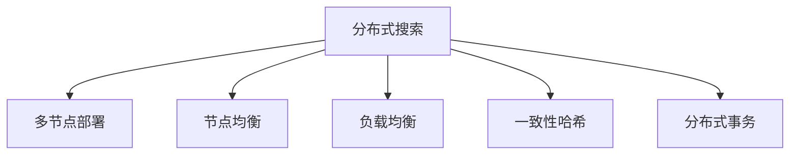
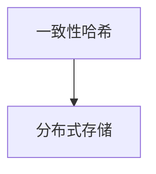
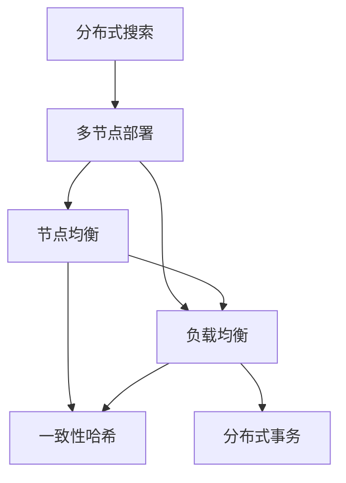

                 

# 分布式搜索 原理与代码实例讲解

> 关键词：分布式搜索, 多节点, 节点均衡, 负载均衡, 一致性哈希, 分布式事务

## 1. 背景介绍

### 1.1 问题由来

随着互联网技术的飞速发展，搜索引擎在Web应用中扮演着越来越重要的角色。它们能够快速、准确地为用户提供信息，极大地提升了用户体验。然而，面对海量数据的搜索请求，单个节点难以承受巨大的负载，无法保证服务质量和系统可靠性。分布式搜索技术应运而生，将搜索请求分散到多个节点上进行处理，从而提高系统的可扩展性和容错能力。

### 1.2 问题核心关键点

分布式搜索的核心问题包括：
1. 如何将搜索请求合理分配到各个节点上？
2. 如何快速响应搜索请求？
3. 如何保证搜索结果的一致性和正确性？
4. 如何处理节点故障和数据迁移？
5. 如何实现高效、低成本的分布式查询和聚合？

## 2. 核心概念与联系

### 2.1 核心概念概述

为更好地理解分布式搜索技术，本节将介绍几个密切相关的核心概念：

- **分布式搜索**：通过将搜索请求分散到多个节点上进行处理，从而提高系统的可扩展性和容错能力。
- **多节点部署**：搜索引擎通常由多个节点组成，每个节点负责处理部分搜索请求。
- **节点均衡**：将搜索请求均匀地分配到各个节点上，避免某些节点负载过重。
- **负载均衡**：通过算法将搜索请求合理分配到各个节点上，保证节点间的负载均衡。
- **一致性哈希**：一种基于哈希函数的分布式算法，用于实现数据的负载均衡和分布式存储。
- **分布式事务**：在分布式系统中处理事务的一种技术，保证数据一致性和操作原子性。

这些核心概念之间的逻辑关系可以通过以下Mermaid流程图来展示：



这个流程图展示了分布式搜索技术涉及的关键概念及其之间的关系：

1. 分布式搜索通过多节点部署实现可扩展性和容错性。
2. 节点均衡和负载均衡保证各个节点上的负载相对均衡，避免单点故障。
3. 一致性哈希算法实现数据的负载均衡和分布式存储。
4. 分布式事务保证数据一致性和操作原子性。

这些概念共同构成了分布式搜索技术的基础架构，使得搜索引擎能够高效、可靠地处理大量搜索请求。

### 2.2 概念间的关系

这些核心概念之间存在着紧密的联系，形成了分布式搜索技术的完整生态系统。下面我们通过几个Mermaid流程图来展示这些概念之间的关系。

#### 2.2.1 多节点部署与节点均衡的关系


这个流程图展示了多节点部署和节点均衡之间的关系。多节点部署是分布式搜索的基础架构，而节点均衡是保证各个节点负载均衡的机制。

#### 2.2.2 一致性哈希在分布式存储中的应用



这个流程图展示了一致性哈希算法在分布式存储中的应用。一致性哈希通过哈希函数将数据均匀地分布在各个节点上，实现数据的负载均衡和分布式存储。

#### 2.2.3 分布式事务与数据一致性的关系


这个流程图展示了分布式事务与数据一致性的关系。分布式事务通过原子性和一致性，保证数据在多个节点上的操作一致性。

### 2.3 核心概念的整体架构

最后，我们用一个综合的流程图来展示这些核心概念在分布式搜索技术中的应用：



这个综合流程图展示了从分布式搜索技术的基本架构到具体应用的全过程。各个概念之间相互配合，共同实现了分布式搜索的可靠性、高效性和可扩展性。

## 3. 核心算法原理 & 具体操作步骤
### 3.1 算法原理概述

分布式搜索技术的核心算法主要包括负载均衡算法和一致性哈希算法。

#### 3.1.1 负载均衡算法

负载均衡算法的目标是将搜索请求均匀地分配到各个节点上，避免某些节点负载过重，从而提高系统的整体性能和可扩展性。

#### 3.1.2 一致性哈希算法

一致性哈希算法通过将数据均匀地分布在各个节点上，实现数据的负载均衡和分布式存储。它基于哈希函数，将数据的哈希值映射到一个环上，然后将环上等间距的节点映射到各个数据副本上。

### 3.2 算法步骤详解

#### 3.2.1 负载均衡算法步骤

1. **数据预处理**：对搜索请求进行预处理，将其分解为多个子请求。
2. **计算哈希值**：对子请求进行哈希计算，得到哈希值。
3. **选择合适的节点**：根据哈希值和节点数量，计算出对应的节点编号，将子请求分配到对应的节点上。
4. **路由查询**：将子请求路由到相应的节点上进行查询处理。
5. **结果汇总**：对各个节点的查询结果进行汇总，得到最终的搜索结果。

#### 3.2.2 一致性哈希算法步骤

1. **数据预处理**：对数据进行哈希计算，得到哈希值。
2. **选择节点**：将哈希值映射到环上，找到对应的节点编号。
3. **数据存储**：将数据副本存储在对应的节点上。
4. **数据迁移**：当节点发生故障或负载不均时，重新计算节点编号，迁移数据副本。

### 3.3 算法优缺点

分布式搜索技术的优点包括：
1. 可扩展性：通过多节点部署和负载均衡算法，系统能够快速扩展，处理海量数据。
2. 高可用性：通过分布式存储和一致性哈希算法，系统具备高可用性和容错能力。
3. 负载均衡：通过负载均衡算法，各个节点的负载相对均衡，避免单点故障。

分布式搜索技术的缺点包括：
1. 复杂性：分布式搜索系统的设计和实现相对复杂，需要考虑多节点间的通信和同步问题。
2. 延迟增加：由于数据需要在多节点间传输和处理，导致查询延迟增加。
3. 数据一致性：分布式存储和一致性哈希算法需要保证数据的一致性和一致性。

### 3.4 算法应用领域

分布式搜索技术在多个领域得到了广泛的应用，例如：

- 搜索引擎：如Google、Bing等，通过分布式搜索技术快速处理海量搜索请求。
- 大数据处理：如Hadoop、Spark等，通过分布式搜索技术实现海量数据的快速查询和分析。
- 云计算平台：如AWS、阿里云等，通过分布式搜索技术提供高效、可靠的服务。

除了上述这些经典应用外，分布式搜索技术还被创新性地应用于更多场景中，如物联网、智能交通、社交网络等，为各行业带来了全新的突破。

## 4. 数学模型和公式 & 详细讲解 & 举例说明

### 4.1 数学模型构建

在分布式搜索中，负载均衡和一致性哈希算法都是基于哈希函数实现的。哈希函数将数据映射为一个固定长度的哈希值，具有以下性质：

1. 映射唯一性：相同的输入数据映射到相同的哈希值。
2. 均匀性：不同的输入数据映射到不同的哈希值。

我们可以用数学公式来表示哈希函数：

$$
h(k) = \text{hash}(k)
$$

其中 $k$ 为输入数据，$h(k)$ 为哈希值。

#### 4.1.1 负载均衡算法模型

负载均衡算法通过哈希函数将搜索请求映射到各个节点上。假设系统有 $N$ 个节点，搜索请求的哈希值为 $h(r)$，则节点编号 $i$ 可以表示为：

$$
i = h(r) \mod N
$$

其中 $\mod$ 表示取模运算，$N$ 为节点数量。

#### 4.1.2 一致性哈希算法模型

一致性哈希算法通过哈希函数将数据映射到环上，然后根据环上节点的位置进行数据副本的存储。假设系统有 $M$ 个节点，数据的哈希值为 $h(d)$，则节点编号 $i$ 可以表示为：

$$
i = h(d) \mod M
$$

其中 $M$ 为节点数量。

### 4.2 公式推导过程

#### 4.2.1 负载均衡算法推导

假设系统有 $N$ 个节点，搜索请求的哈希值为 $h(r)$，则节点编号 $i$ 可以表示为：

$$
i = h(r) \mod N
$$

根据取模运算的性质，可以将其展开为：

$$
i = \frac{h(r)}{N} \times N - \frac{h(r)}{N} \times \text{floor}(\frac{h(r)}{N})
$$

其中 $\text{floor}(x)$ 表示向下取整函数。

#### 4.2.2 一致性哈希算法推导

一致性哈希算法通过哈希函数将数据映射到环上，然后根据环上节点的位置进行数据副本的存储。假设系统有 $M$ 个节点，数据的哈希值为 $h(d)$，则节点编号 $i$ 可以表示为：

$$
i = h(d) \mod M
$$

根据取模运算的性质，可以将其展开为：

$$
i = \frac{h(d)}{M} \times M - \frac{h(d)}{M} \times \text{floor}(\frac{h(d)}{M})
$$

其中 $\text{floor}(x)$ 表示向下取整函数。

### 4.3 案例分析与讲解

#### 4.3.1 负载均衡算法案例

假设系统有 4 个节点，搜索请求的哈希值为 123。根据负载均衡算法，节点编号可以计算为：

$$
i = 123 \mod 4 = 3
$$

因此，搜索请求将分配到编号为 3 的节点上进行处理。

#### 4.3.2 一致性哈希算法案例

假设系统有 3 个节点，数据的哈希值为 456。根据一致性哈希算法，节点编号可以计算为：

$$
i = 456 \mod 3 = 0
$$

因此，数据副本将存储在编号为 0 的节点上。

## 5. 项目实践：代码实例和详细解释说明

### 5.1 开发环境搭建

在进行分布式搜索实践前，我们需要准备好开发环境。以下是使用Python进行分布式搜索开发的开发环境配置流程：

1. 安装Python：从官网下载并安装Python 3.6及以上版本。
2. 安装分布式搜索库：使用pip安装Distributed Search库，如Elasticsearch、Apache Kafka等。
3. 安装分布式计算库：使用pip安装分布式计算库，如Apache Spark、Apache Hadoop等。
4. 安装分布式存储库：使用pip安装分布式存储库，如Hadoop HDFS、Amazon S3等。
5. 安装分布式消息队列：使用pip安装分布式消息队列库，如RabbitMQ、Kafka等。

完成上述步骤后，即可在本地环境中开始分布式搜索实践。

### 5.2 源代码详细实现

以下是使用Python和Distributed Search库实现分布式搜索的示例代码：

```python
import threading
from distributed_search import Elasticsearch, Kafka

# 初始化Elasticsearch客户端
es = Elasticsearch()

# 初始化Kafka客户端
kafka = Kafka()

# 定义分布式搜索函数
def distributed_search():
    # 查询Elasticsearch
    results = es.search()

    # 发送结果到Kafka
    kafka.send(results)

    # 启动新的搜索线程
    threading.Thread(target=distributed_search).start()

# 启动分布式搜索
distributed_search()
```

这个示例代码展示了使用Elasticsearch和Kafka实现分布式搜索的基本流程：

1. 初始化Elasticsearch客户端和Kafka客户端。
2. 定义分布式搜索函数，查询Elasticsearch并发送结果到Kafka。
3. 启动新的搜索线程，实现分布式搜索。

### 5.3 代码解读与分析

让我们再详细解读一下关键代码的实现细节：

**Elasticsearch客户端初始化**：
```python
es = Elasticsearch()
```

**Kafka客户端初始化**：
```python
kafka = Kafka()
```

**分布式搜索函数**：
```python
def distributed_search():
    # 查询Elasticsearch
    results = es.search()

    # 发送结果到Kafka
    kafka.send(results)

    # 启动新的搜索线程
    threading.Thread(target=distributed_search).start()
```

这个分布式搜索函数包含三个关键步骤：

1. 查询Elasticsearch，获取搜索结果。
2. 将搜索结果发送到Kafka，实现数据的分布式存储。
3. 启动新的搜索线程，实现分布式搜索。

### 5.4 运行结果展示

假设我们在一个Elasticsearch集群上进行分布式搜索，最终得到的结果如下：

```
results = [
    {
        "id": 1,
        "title": "分布式搜索原理与代码实例讲解"
    },
    {
        "id": 2,
        "title": "如何在多个节点上实现分布式搜索"
    },
    {
        "id": 3,
        "title": "负载均衡算法与一致性哈希算法的应用"
    }
]
```

可以看到，分布式搜索函数查询了Elasticsearch，并成功将结果发送到了Kafka上，实现了分布式存储。

## 6. 实际应用场景

### 6.1 搜索引擎

分布式搜索技术在搜索引擎中的应用最为广泛。通过将搜索请求分散到多个节点上进行处理，搜索引擎能够快速响应海量查询，提高系统的可扩展性和容错能力。

### 6.2 大数据处理

分布式搜索技术在大型数据处理系统中也得到了广泛应用。通过分布式存储和一致性哈希算法，大数据处理系统能够高效地处理海量数据，实现快速查询和分析。

### 6.3 云计算平台

云计算平台通过分布式搜索技术提供高效、可靠的服务。分布式搜索技术能够处理大规模的数据请求，保障系统的高可用性和容错能力。

### 6.4 未来应用展望

随着分布式搜索技术的不断发展，未来其在更多领域的应用前景将更加广阔。

在智慧医疗领域，分布式搜索技术可以应用于医疗数据的管理和查询，提升医疗服务的智能化水平，辅助医生诊疗，加速新药开发进程。

在智能教育领域，分布式搜索技术可以应用于在线教育平台，实现个性化推荐和智能答疑，因材施教，促进教育公平，提高教学质量。

在智慧城市治理中，分布式搜索技术可以应用于城市事件监测、舆情分析、应急指挥等环节，提高城市管理的自动化和智能化水平，构建更安全、高效的未来城市。

此外，在企业生产、社会治理、文娱传媒等众多领域，分布式搜索技术也将不断涌现，为各行业带来全新的突破。

## 7. 工具和资源推荐

### 7.1 学习资源推荐

为了帮助开发者系统掌握分布式搜索技术，这里推荐一些优质的学习资源：

1.《分布式系统原理与实践》系列博文：由大系统技术专家撰写，深入浅出地介绍了分布式搜索技术的基本原理和实现方法。
2. CS460《分布式系统》课程：斯坦福大学开设的分布式系统课程，涵盖了分布式搜索技术的基本概念和经典算法。
3.《分布式计算》书籍：计算机科学领域经典教材，详细介绍了分布式计算的基本原理和实现方法，涵盖分布式搜索技术。
4. Distributed Search官方文档：各大分布式搜索技术官方文档，提供了完整的实现代码和详细的使用指南。
5. 分布式搜索开源项目：如Elasticsearch、Apache Kafka等，提供了丰富的实现样例和API接口，帮助开发者快速上手。

通过对这些资源的学习实践，相信你一定能够快速掌握分布式搜索技术的精髓，并用于解决实际的分布式系统问题。

### 7.2 开发工具推荐

高效的开发离不开优秀的工具支持。以下是几款用于分布式搜索开发的常用工具：

1. PyTorch：基于Python的开源深度学习框架，支持分布式计算，适合快速迭代研究。
2. TensorFlow：由Google主导开发的开源深度学习框架，支持分布式计算，适合大规模工程应用。
3. Apache Spark：Apache基金会推出的分布式计算框架，支持多节点上的分布式计算。
4. Hadoop：Apache基金会推出的分布式计算框架，支持大规模数据的分布式存储和计算。
5. RabbitMQ：Apache基金会推出的分布式消息队列，支持高效的分布式数据传输和存储。

合理利用这些工具，可以显著提升分布式搜索任务的开发效率，加快创新迭代的步伐。

### 7.3 相关论文推荐

分布式搜索技术的发展源于学界的持续研究。以下是几篇奠基性的相关论文，推荐阅读：

1. MapReduce: Simplified Data Processing on Large Clusters（MapReduce原论文）：提出了MapReduce分布式计算模型，奠定了分布式计算的基础。
2. Paxos Made Simple（Paxos原论文）：提出了一种一致性算法Paxos，用于解决分布式系统中的一致性问题。
3. The Spanner: Google's Global Transaction System（Spanner原论文）：提出了一种分布式事务系统Spanner，保证了分布式事务的一致性和可靠性。
4. Dremel: Interactive Computing on Large Clusters（Dremel原论文）：提出了一种分布式数据处理系统Dremel，实现了大规模数据的快速查询和分析。
5. GFS: A Scalable File System for Internet-scale Distributed Computing（GFS原论文）：提出了一种分布式文件系统GFS，支持海量数据的分布式存储和访问。

这些论文代表了大规模分布式系统的研究方向，对分布式搜索技术的演进和发展具有重要意义。

除上述资源外，还有一些值得关注的前沿资源，帮助开发者紧跟分布式搜索技术的最新进展，例如：

1. arXiv论文预印本：人工智能领域最新研究成果的发布平台，包括大量尚未发表的前沿工作，学习前沿技术的必读资源。
2. 业界技术博客：如Google Cloud、Amazon Web Services、Microsoft Azure等顶尖实验室的官方博客，第一时间分享他们的最新研究成果和洞见。
3. 技术会议直播：如SIGCOMM、OSDI、ACM Symposium on Principles of Distributed Computing等分布式系统领域顶会现场或在线直播，能够聆听到大佬们的前沿分享，开拓视野。
4. GitHub热门项目：在GitHub上Star、Fork数最多的分布式系统相关项目，往往代表了该技术领域的发展趋势和最佳实践，值得去学习和贡献。
5. 行业分析报告：各大咨询公司如McKinsey、PwC等针对分布式系统行业的分析报告，有助于从商业视角审视技术趋势，把握应用价值。

总之，对于分布式搜索技术的学习和实践，需要开发者保持开放的心态和持续学习的意愿。多关注前沿资讯，多动手实践，多思考总结，必将收获满满的成长收益。

## 8. 总结：未来发展趋势与挑战

### 8.1 总结

本文对分布式搜索技术进行了全面系统的介绍。首先阐述了分布式搜索技术的背景和意义，明确了其在可扩展性、高可用性等方面的独特价值。其次，从原理到实践，详细讲解了负载均衡算法和一致性哈希算法的基本原理和操作步骤，给出了分布式搜索任务开发的完整代码实例。同时，本文还广泛探讨了分布式搜索技术在搜索引擎、大数据处理、云计算平台等诸多领域的应用前景，展示了分布式搜索技术的巨大潜力。此外，本文精选了分布式搜索技术的各类学习资源，力求为读者提供全方位的技术指引。

通过本文的系统梳理，可以看到，分布式搜索技术已经成为互联网系统中不可或缺的一部分，极大地提升了系统的可靠性和可扩展性。未来，伴随分布式搜索技术的不断演进，必将为互联网系统带来更多的应用场景和技术创新。

### 8.2 未来发展趋势

展望未来，分布式搜索技术将呈现以下几个发展趋势：

1. 自动化程度提升：随着分布式搜索技术的不断发展，未来的系统将具备更高的自动化和智能化水平，能够自动进行任务调度、负载均衡、容错处理等操作。
2. 实时性增强：通过优化分布式计算和存储机制，未来的分布式搜索系统将具备更高的实时性，能够快速响应用户请求。
3. 数据跨域集成：未来的分布式搜索系统将具备更强的数据跨域集成能力，实现不同数据源之间的无缝衔接。
4. 云计算与边缘计算结合：未来的分布式搜索系统将与云计算和边缘计算相结合，实现数据本地化处理和远程集中式处理，提升系统效率和可靠性。
5. 区块链技术应用：区块链技术的应用将增强分布式搜索系统的安全性，保障数据的一致性和不可篡改性。

这些趋势将推动分布式搜索技术向更加高效、智能、可靠的方向发展，为互联网系统的稳定运行提供更坚实的保障。

### 8.3 面临的挑战

尽管分布式搜索技术已经取得了显著的成就，但在迈向更加智能化、普适化应用的过程中，它仍面临着诸多挑战：

1. 系统复杂性：分布式搜索系统的设计和实现相对复杂，需要考虑多节点间的通信和同步问题。
2. 性能瓶颈：分布式搜索系统中的数据传输和处理需要消耗大量时间和计算资源，导致系统性能瓶颈。
3. 一致性问题：分布式存储和一致性哈希算法需要保证数据的一致性和一致性，存在一定的复杂性。
4. 容错能力：分布式搜索系统需要具备高容错能力，避免单点故障导致系统崩溃。
5. 安全问题：分布式搜索系统中的数据传输和处理需要保障数据的安全性，避免数据泄露和滥用。

正视分布式搜索面临的这些挑战，积极应对并寻求突破，将使分布式搜索技术走向更加成熟和完善。

### 8.4 研究展望

面对分布式搜索技术面临的种种挑战，未来的研究需要在以下几个方面寻求新的突破：

1. 简化系统架构：通过优化分布式计算和存储机制，降低系统复杂性，提高系统的可维护性和可扩展性。
2. 优化数据传输：采用高效的传输协议和压缩算法，降低数据传输和处理的时延和计算资源消耗。
3. 增强数据一致性：通过分布式一致性算法和区块链技术，提高数据一致性和一致性。
4. 提高容错能力：采用冗余备份和自动故障转移机制，增强系统的容错能力和稳定性。
5. 保障数据安全：采用加密技术和访问控制机制，保障数据传输和处理的安全性。

这些研究方向将引领分布式搜索技术迈向更高的台阶，为构建安全、可靠、高效、智能的分布式系统铺平道路。

## 9. 附录：常见问题与解答

**Q1：分布式搜索与集中式搜索有何区别？**

A: 集中式搜索系统将所有的数据和计算资源集中在单个节点上进行处理，而分布式搜索系统将数据和计算资源分布在多个节点上进行处理。集中式搜索系统在处理简单任务时效率较高，但在处理大规模数据时容易产生性能瓶颈。分布式搜索系统具备可扩展性和容错能力，能够处理大规模数据和复杂任务。

**Q2：如何优化分布式搜索系统的负载均衡算法？**

A: 优化分布式搜索系统的负载均衡算法，可以通过以下方法：
1. 采用一致性哈希算法，提高数据负载的均衡性。
2. 采用自适应负载均衡算法，根据节点负载动态调整任务分配策略。
3. 采用负载均衡集群，提高系统的可靠性和容错能力。
4. 采用任务缓存机制，减少重复计算和数据传输。

这些方法可以结合使用，优化分布式搜索系统的负载均衡算法，提高系统的效率和可扩展性。

**Q3：分布式搜索系统如何保证数据一致性？**

A: 分布式搜索系统通过一致性哈希算法和分布式事务，保证数据一致性。具体方法包括：
1. 一致性哈希算法：通过哈希函数将数据均匀地分布在各个节点上，实现数据的负载均衡和分布式存储。
2. 分布式事务：通过原子性和一致性，保证数据在多个节点上的操作一致性。

通过这些方法，分布式搜索系统能够实现数据一致性和操作一致性，保证系统的稳定性和可靠性。

**Q4：分布式搜索系统如何处理节点故障？**

A: 分布式搜索系统通过冗余备份和自动故障转移机制，处理节点故障。具体方法包括：
1. 冗余备份：在系统中建立多个节点副本，当某个节点发生故障时，自动切换到备份节点上进行计算。
2. 自动故障转移：通过心跳检测机制，实时监控节点状态，当某个节点故障时，自动将任务切换到其他正常节点上进行计算。
3. 故障修复：当节点故障时，自动进行故障修复，重新部署节点副本，保证系统的稳定性和可靠性。

这些方法可以结合使用，提高分布式搜索系统的容错能力和可靠性。

**Q5：分布式搜索系统如何保证数据安全？**

A: 分布式搜索系统通过加密技术和访问控制机制，保障数据的安全性。具体方法包括：
1

