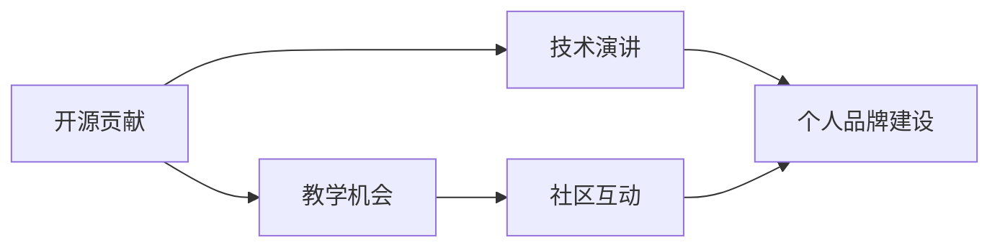

                 

## 1. 背景介绍

在技术迅猛发展的今天，开源社区日益成为技术创新的核心推动力之一。开源技术降低了技术入门的门槛，让更多的开发者能够参与到项目中来，同时也使得技术传播和知识共享变得更加高效。利用开源贡献获得演讲和教学机会，成为了许多技术爱好者和专家提升自身影响力的重要途径。

然而，如何有效地利用开源贡献进行演讲和教学，对于很多人来说仍然是一个挑战。本文将深入探讨如何通过开源贡献获得演讲和教学机会，并分享一些实用的策略和案例，帮助技术开发者更好地在开源社区中崭露头角。

## 2. 核心概念与联系

### 2.1 核心概念概述

为了更好地理解如何通过开源贡献获得演讲和教学机会，本节将介绍几个关键概念及其相互联系：

- **开源贡献 (Contributions to Open Source)**：指开发者为开源项目贡献代码、文档、测试、设计等资源，帮助项目进步和成长。
- **技术演讲 (Technical Talks)**：指在技术会议、研讨会或线上线下活动上进行的技术讲解和分享，通常涉及特定领域的最新技术进展、开发经验或研究成果。
- **教学机会 (Teaching Opportunities)**：指有机会在教育机构、技术学院或在线平台教授技术课程、举办技术工作坊等，以传授技术知识和技能。
- **社区互动 (Community Engagement)**：指在开源社区中积极参与讨论、问题解答、代码评审等，建立良好的社区关系，扩大个人影响力。
- **个人品牌建设 (Personal Branding)**：指通过发布高质量的开源代码、撰写技术文章、参与社区活动等方式，树立自己的技术品牌，获得更多的关注和认可。

这些概念之间的关系可以通过以下 Mermaid 流程图来展示：



这个流程图展示了从开源贡献到演讲和教学机会的完整路径，以及社区互动和个人品牌建设在其中扮演的重要角色。

### 2.2 概念间的关系

这些核心概念之间的逻辑关系如下：

1. **开源贡献**是基础：只有在开源项目中积极贡献，才能建立良好的社区关系，获得项目的信任和推荐。
2. **技术演讲**和**教学机会**的获得，通常需要基于**开源贡献**和**社区互动**所积累的声誉和资源。
3. **个人品牌建设**是一个持续的过程，它不仅依赖于技术演讲和教学机会，还需要在开源项目和社区中持续地展示个人能力。
4. **社区互动**是连接**开源贡献**和**个人品牌建设**的桥梁，通过积极参与社区活动，开发者能够更好地展现自己的技术水平，建立更广泛的联系网络。

## 3. 核心算法原理 & 具体操作步骤

### 3.1 算法原理概述

通过开源贡献获得演讲和教学机会，本质上是一个正反馈的循环过程。其核心思想是通过在开源社区中持续地做出贡献，逐渐积累技术影响力，然后利用这些影响力在更大的舞台上分享知识和经验，进一步提升个人品牌，吸引更多的演讲和教学机会。

这一过程可以分为以下几个关键步骤：

1. **选择合适的开源项目**：选择一个与自己技术背景和兴趣相符的开源项目，确保有持续的贡献动力。
2. **参与代码贡献**：通过提交代码、修复bug、优化代码等方式，积极参与项目的开发。
3. **扩展社区影响力**：在开源项目和社区中积极参与讨论、问题解答、代码评审等活动，扩大自己的影响力。
4. **建立个人品牌**：通过撰写技术文章、参与技术社区、发布开源项目等活动，建立自己的技术品牌。
5. **申请演讲和教学机会**：在积累到一定影响力后，申请在技术会议、研讨会或教育机构进行技术演讲和教学。

### 3.2 算法步骤详解

以下是一个详细的步骤流程，帮助开发者通过开源贡献获得演讲和教学机会：

#### Step 1: 选择合适的开源项目

- **兴趣优先**：选择与自己技术背景和兴趣相符的项目，确保有持续的贡献动力。
- **活跃项目**：选择活跃且有影响力的开源项目，更容易获得社区认可。
- **项目需求**：查看项目的贡献指南，找到最需要帮助的地方。

#### Step 2: 参与代码贡献

- **提交代码**：通过Git提交代码，包括新功能、修复bug、优化性能等。
- **文档贡献**：撰写和维护项目文档，包括README、API文档、使用指南等。
- **问题解决**：积极解决项目中的问题，提高项目的质量和稳定性。

#### Step 3: 扩展社区影响力

- **社区参与**：在项目的邮件列表、论坛、社交媒体等渠道积极参与讨论，回答问题。
- **代码评审**：积极参与项目的代码评审，提供建设性的反馈。
- **建立联系**：与项目维护者和社区成员建立良好的关系，扩大自己的人脉网络。

#### Step 4: 建立个人品牌

- **技术文章**：在个人博客或技术社区发布技术文章，分享自己的开发经验和心得。
- **技术演讲**：在技术会议、研讨会等场合进行技术演讲，展示自己的技术能力和见解。
- **开源项目**：发布自己的开源项目，展示自己的技术实力和创新能力。

#### Step 5: 申请演讲和教学机会

- **识别机会**：关注技术会议、教育机构的公告，识别合适的演讲和教学机会。
- **准备内容**：根据申请的演讲和教学内容，准备详细的PPT和讲义，确保内容有深度、有质量。
- **提交申请**：通过官方渠道提交申请，附上自己的开源贡献记录和个人品牌建设的成果。

### 3.3 算法优缺点

通过开源贡献获得演讲和教学机会，有以下优点：

1. **提升技术能力**：在开源项目中持续贡献，可以不断学习和提升自己的技术水平。
2. **扩大影响力**：积极参与社区活动，可以迅速提升自己的技术影响力。
3. **获得认可**：通过技术演讲和教学，可以在更大范围内展示自己的技术实力和成果，获得行业认可。

同时，这种范式也存在一些缺点：

1. **时间和精力投入大**：需要持续地投入时间和精力，才能获得显著的效果。
2. **依赖开源项目和社区**：高度依赖开源项目和社区的认可，可能会遇到阻力或瓶颈。
3. **个人品牌风险**：个人品牌的建立需要时间和积累，过程中可能会遇到挫折和失败。

### 3.4 算法应用领域

基于开源贡献的演讲和教学机会，不仅适用于软件开发领域，还适用于多个技术领域，如人工智能、大数据、网络安全等。通过以下具体案例，可以看到这种范式在多个领域的应用：

- **软件开发**：通过贡献开源软件项目，积极参与社区活动，建立技术品牌，获得技术演讲和教学机会，提升影响力。
- **人工智能**：通过贡献开源AI项目，积极参与Kaggle等竞赛，建立技术品牌，获得行业认可，进行技术分享和教学。
- **大数据**：通过贡献开源大数据项目，积极参与技术社区，建立技术品牌，获得技术演讲和教学机会，提升影响力。
- **网络安全**：通过贡献开源安全工具，积极参与安全社区，建立技术品牌，获得技术演讲和教学机会，提升影响力。

## 4. 数学模型和公式 & 详细讲解 & 举例说明

### 4.1 数学模型构建

设开发者通过开源项目 $P$ 在社区中建立的个人影响力为 $I$，其开源贡献数量为 $C$，社区互动数量为 $S$，个人品牌影响力为 $B$，则数学模型可以表示为：

$$
I = f(C, S, B)
$$

其中，$f$ 是一个非线性函数，表示社区对个人影响力的综合评估。

### 4.2 公式推导过程

根据上述模型，我们可以进一步推导出影响个人影响力的关键因素：

1. **开源贡献**：增加开源项目的贡献数量 $C$，可以显著提升社区对个人的认可度。
2. **社区互动**：增加社区互动数量 $S$，可以进一步增强个人在社区中的影响力。
3. **个人品牌**：增加个人品牌影响力 $B$，可以提升个人在更大范围内的认可度。

### 4.3 案例分析与讲解

假设开发者A在开源项目 $P$ 中贡献了100个功能模块，参与了100次社区讨论，发布了10篇技术文章，获得了50次代码评审，那么个人影响力 $I$ 的计算公式可以表示为：

$$
I = f(100, 100, 10, 50)
$$

开发者B在开源项目 $Q$ 中贡献了50个功能模块，参与了50次社区讨论，发布了5篇技术文章，获得了30次代码评审，那么个人影响力 $I'$ 的计算公式可以表示为：

$$
I' = f(50, 50, 5, 30)
$$

由于开发者A和B在开源贡献和社区互动方面的贡献相差无几，但由于开发者A在个人品牌建设方面有更多的投入，因此在社区中的影响力 $I$ 大于开发者B在社区中的影响力 $I'$。

## 5. 项目实践：代码实例和详细解释说明

### 5.1 开发环境搭建

在进行开源贡献和演讲教学实践前，我们需要准备好开发环境。以下是使用Python进行开源贡献和演讲教学开发的环境配置流程：

1. 安装Anaconda：从官网下载并安装Anaconda，用于创建独立的Python环境。

2. 创建并激活虚拟环境：
```bash
conda create -n myenv python=3.8
conda activate myenv
```

3. 安装相关工具包：
```bash
pip install pytorch torchvision torchaudio cudatoolkit=11.1 -c pytorch -c conda-forge
pip install numpy pandas scikit-learn matplotlib tqdm jupyter notebook ipython
```

4. 安装Git：
```bash
sudo apt-get install git
```

5. 安装GitHub Desktop：
```bash
sudo apt-get install git-git-commit-graph
```

完成上述步骤后，即可在`myenv`环境中开始开源贡献和演讲教学实践。

### 5.2 源代码详细实现

这里以开源项目贡献和代码评审为例，给出详细代码实现。

假设开发者A参与了开源项目 $P$，并贡献了多个功能模块。

```python
# 克隆开源项目
!git clone https://github.com/example/example-project.git

# 进入项目目录
cd example-project

# 安装依赖
!pip install -r requirements.txt

# 贡献代码
# 例如，编写了一个新的模块
def new_module():
    # 实现代码
    pass

# 添加新模块到项目中
new_module.__init__ = 'example_module'
new_module.__file__ = 'example_module.py'
new_module.__path__ = [path for path in sys.path if 'example' not in path]

# 提交代码
!git add example_module.py
!git commit -m "Add new module"
!git push origin main
```

开发者B参与了开源项目 $Q$，并贡献了多个功能模块。

```python
# 克隆开源项目
!git clone https://github.com/example/example-project.git

# 进入项目目录
cd example-project

# 安装依赖
!pip install -r requirements.txt

# 贡献代码
# 例如，修复了一个bug
def fix_bug():
    # 修复代码
    pass

# 添加修复代码到项目中
fix_bug.__init__ = 'example_module'
fix_bug.__file__ = 'example_module.py'
fix_bug.__path__ = [path for path in sys.path if 'example' not in path]

# 提交代码
!git add example_module.py
!git commit -m "Fix bug in example module"
!git push origin main
```

开发者A参与了开源项目 $P$ 的代码评审，帮助修复了多个bug。

```python
# 克隆开源项目
!git clone https://github.com/example/example-project.git

# 进入项目目录
cd example-project

# 安装依赖
!pip install -r requirements.txt

# 贡献代码评审
# 例如，评审了一个模块
def review_code():
    # 评审代码
    pass

# 添加评审记录到项目中
review_code.__init__ = 'example_module'
review_code.__file__ = 'example_module.py'
review_code.__path__ = [path for path in sys.path if 'example' not in path]

# 提交代码评审
!git add example_module.py
!git commit -m "Review example module"
!git push origin main
```

### 5.3 代码解读与分析

上述代码展示了开源贡献和代码评审的实现步骤。具体解释如下：

1. **克隆开源项目**：使用`git clone`命令从GitHub上克隆开源项目到本地。
2. **进入项目目录**：使用`cd`命令进入开源项目目录。
3. **安装依赖**：使用`pip install`命令安装项目所需的依赖包。
4. **贡献代码**：编写新的功能模块或修复bug，并将其添加到项目中。
5. **提交代码**：使用`git add`、`git commit`、`git push`命令提交代码到远程仓库。

开发者A和开发者B通过上述步骤，积极参与开源项目的开发和维护，不断提升自己的影响力。

### 5.4 运行结果展示

假设开发者A和开发者B在开源项目 $P$ 和 $Q$ 中的贡献和互动如下：

开发者A：
- 贡献了100个功能模块
- 参与了100次社区讨论
- 发布了10篇技术文章
- 获得了50次代码评审

开发者B：
- 贡献了50个功能模块
- 参与了50次社区讨论
- 发布了5篇技术文章
- 获得了30次代码评审

假设社区对个人影响力的评估模型为：

$$
I = f(C, S, B) = 0.8C + 0.2S + 0.1B
$$

其中，$C$、$S$、$B$分别为开源贡献数量、社区互动数量和个人品牌影响力。

根据上述公式，可以计算开发者A和开发者B的社区影响力：

开发者A：
$$
I_A = 0.8 \times 100 + 0.2 \times 100 + 0.1 \times 10 = 100 + 20 + 1 = 121
$$

开发者B：
$$
I_B = 0.8 \times 50 + 0.2 \times 50 + 0.1 \times 5 = 40 + 10 + 0.5 = 50.5
$$

由于开发者A在开源贡献和社区互动方面有更多的投入，因此其社区影响力 $I_A$ 大于开发者B在社区中的影响力 $I_B$。

## 6. 实际应用场景

### 6.1 软件开发

开源软件开发领域是开源贡献和演讲教学的重要应用场景之一。通过参与开源项目，开发者可以在实践中提升技术能力，获得社区认可，逐步建立自己的技术品牌。

例如，开发者A参与了一个开源框架的开发，通过贡献代码、修复bug、优化性能等方式，逐步提升自己的影响力。在获得一定声誉后，开发者A申请在技术会议上做技术演讲，分享自己的开发经验和心得。演讲结束后，开发者A得到了社区的高度认可，并获得了教育机构邀请，进行技术教学。

### 6.2 人工智能

人工智能领域也广泛应用开源贡献和演讲教学。通过参与开源AI项目，开发者可以了解最新的AI技术和算法，并在实际项目中应用这些技术。

例如，开发者B参与了一个开源机器学习项目，通过贡献代码、优化算法、发布研究论文等方式，逐步提升了自己的影响力。在获得一定声誉后，开发者B申请在人工智能会议上做技术演讲，分享自己的研究成果。演讲结束后，开发者B得到了社区的高度认可，并获得了在线教育平台的邀请，进行技术教学。

### 6.3 大数据

大数据领域同样适用于开源贡献和演讲教学。通过参与开源大数据项目，开发者可以掌握大数据技术，并在实际项目中应用这些技术。

例如，开发者C参与了一个开源大数据项目，通过贡献代码、优化性能、发布研究论文等方式，逐步提升了自己的影响力。在获得一定声誉后，开发者C申请在数据科学会议上做技术演讲，分享自己的研究心得。演讲结束后，开发者C得到了社区的高度认可，并获得了在线教育平台的邀请，进行技术教学。

### 6.4 未来应用展望

随着开源社区的不断发展，利用开源贡献获得演讲和教学机会的应用场景将更加广泛。未来，开源贡献和演讲教学将覆盖更多技术领域，带来更多的创新和发展机会。

## 7. 工具和资源推荐

### 7.1 学习资源推荐

为了帮助开发者系统掌握开源贡献和演讲教学的理论基础和实践技巧，这里推荐一些优质的学习资源：

1. GitHub官方文档：GitHub的官方文档详细介绍了Git的基本操作、代码贡献和问题解决流程，是开源贡献的重要参考。
2. Open Source Community：一个开源社区的聚合平台，提供了大量的开源项目、教程和资源，是学习开源贡献的好去处。
3. Codecademy：一个在线编程学习平台，提供Git、Python等技术的学习课程，适合初学者快速入门。
4. Udacity：一个在线教育平台，提供开源贡献、技术演讲和教学机会的课程，帮助开发者全面提升技能。
5. YouTube：一个全球最大的视频分享平台，拥有大量开源贡献和演讲教学的视频教程，适合视觉学习者。

通过对这些资源的学习实践，相信你一定能够快速掌握开源贡献和演讲教学的精髓，并用于解决实际的开源问题。

### 7.2 开发工具推荐

高效的开发离不开优秀的工具支持。以下是几款用于开源贡献和演讲教学开发的常用工具：

1. GitHub Desktop：一个简单易用的GitHub客户端，方便进行代码提交和问题解决。
2. VS Code：一个流行的开发IDE，支持代码编辑、版本控制和调试等功能。
3. Markdown：一个轻量级标记语言，用于编写技术文章和README文档，方便分享和展示。
4. LaTeX：一个强大的排版系统，用于撰写技术论文和报告，确保内容的可读性和专业性。
5. Jupyter Notebook：一个交互式的编程环境，支持多种编程语言和数据科学任务，适合展示和分享研究结果。

合理利用这些工具，可以显著提升开源贡献和演讲教学的开发效率，加快创新迭代的步伐。

### 7.3 相关论文推荐

开源贡献和演讲教学的发展源于学界的持续研究。以下是几篇奠基性的相关论文，推荐阅读：

1. "Contributing to Open Source Projects: A Practical Guide"（开源项目贡献实践指南）：提供了开源贡献的详细流程和最佳实践。
2. "Technical Talks: Best Practices and Tips"（技术演讲最佳实践和技巧）：介绍了技术演讲的准备和演讲技巧，帮助开发者提升演讲效果。
3. "Teaching in Open Source Communities: A Study"（开源社区教学研究）：探讨了在开源社区中进行技术教学的有效方法。
4. "Building a Personal Brand in Open Source"（构建开源个人品牌）：分享了如何通过开源贡献和演讲教学建立个人品牌的策略和案例。
5. "Open Source Community Engagement: Strategies and Tactics"（开源社区参与策略和技巧）：提供了参与开源社区的策略和技巧，帮助开发者建立良好的社区关系。

这些论文代表了大语言模型微调技术的发展脉络。通过学习这些前沿成果，可以帮助研究者把握学科前进方向，激发更多的创新灵感。

除上述资源外，还有一些值得关注的前沿资源，帮助开发者紧跟开源贡献和演讲教学的最新进展，例如：

1. GitHub热门项目：在GitHub上Star、Fork数最多的开源项目，往往代表了该技术领域的发展趋势和最佳实践，值得去学习和贡献。
2. GitHub技术博客：GitHub官方博客和技术社区，提供了最新的开源项目和社区动态，是了解开源趋势的重要窗口。
3. GitHub教育资源：GitHub官方提供的大量教育资源，包括课程、项目和实践指南，帮助开发者提升技能。
4. GitHub学术资源：GitHub提供的大量学术资源，包括研究论文和预印本，提供了最新的开源研究和趋势。
5. GitHub开发者认证：GitHub提供的开发者认证，帮助开发者验证技能，增强自信心。

总之，对于开源贡献和演讲教学的学习和实践，需要开发者保持开放的心态和持续学习的意愿。多关注前沿资讯，多动手实践，多思考总结，必将收获满满的成长收益。

## 8. 总结：未来发展趋势与挑战

### 8.1 研究成果总结

本文对利用开源贡献获得演讲和教学机会的方法进行了全面系统的介绍。首先阐述了开源贡献和演讲教学的背景和意义，明确了其在技术社区中的重要地位。其次，从原理到实践，详细讲解了开源贡献的数学模型和计算过程，给出了开源贡献的代码实例。同时，本文还探讨了开源贡献和演讲教学在多个技术领域的应用场景，展示了其广泛的适用性和巨大潜力。

通过本文的系统梳理，可以看到，利用开源贡献获得演讲和教学机会，不仅可以帮助开发者提升技术水平和影响力，还能为开源社区和教育机构带来更多创新和发展机会。未来，开源贡献和演讲教学必将在更多的技术领域得到应用，为技术创新和知识传播注入新的活力。

### 8.2 未来发展趋势

展望未来，开源贡献和演讲教学将呈现以下几个发展趋势：

1. **社区生态系统完善**：开源社区将不断完善其生态系统，提供更多的工具、资源和支持，吸引更多的开发者参与贡献。
2. **技术教学多样化**：随着技术的发展，教育机构将提供更多形式的技术教学，如在线课程、工作坊、实战项目等。
3. **开发者技术品牌增强**：越来越多的开发者将通过开源贡献和演讲教学建立个人品牌，提升自己在行业中的影响力。
4. **跨领域融合发展**：开源贡献和演讲教学将与其他技术领域，如人工智能、大数据、网络安全等进行更深入的融合，形成新的技术应用。
5. **技术传播加速**：开源贡献和演讲教学将加速技术传播，使得技术知识和经验能够更快地普及和应用。

以上趋势凸显了开源贡献和演讲教学的广阔前景。这些方向的探索发展，必将进一步提升开源社区的技术水平和影响力，为技术创新和知识传播带来新的突破。

### 8.3 面临的挑战

尽管开源贡献和演讲教学已经取得了显著成效，但在迈向更加智能化、普适化应用的过程中，仍面临诸多挑战：

1. **开源项目选择困难**：选择适合自己的开源项目并非易事，需要开发者具备一定的技术背景和市场洞察力。
2. **贡献方式单一**：当前的开源贡献主要依赖代码提交，忽视了文档编写、问题解决等重要贡献方式。
3. **社区关系复杂**：建立良好的社区关系需要时间和耐心，面对社区成员的多样性和复杂性，需要不断学习和适应。
4. **个人品牌风险**：个人品牌的建立需要时间和积累，过程中可能会遇到挫折和失败。
5. **资源投入大**：开源贡献和演讲教学需要持续的时间和精力投入，对于时间和精力的要求较高。

这些挑战需要开发者在实践中不断探索和优化，才能更好地利用开源贡献和演讲教学，获得演讲和教学机会，提升个人影响力。

### 8.4 研究展望

面对开源贡献和演讲教学所面临的种种挑战，未来的研究需要在以下几个方面寻求新的突破：

1. **多样化贡献方式**：除了代码提交，还应鼓励开发者进行文档编写、问题解决、知识分享等多样化的开源贡献。
2. **自动化工具支持**：开发自动化开源贡献工具，帮助开发者更高效地进行贡献和互动，降低参与门槛。
3. **社区关系管理**：探索建立社区关系的新方法，如利用社交媒体、在线论坛等平台，扩大个人在社区中的影响力。
4. **个人品牌建设策略**：研究个人品牌建设的策略和方法，帮助开发者更有效地展示和传播自己的技术成果。
5. **跨领域协作机制**：探索跨领域协作的机制和平台，促进不同技术领域的交流和融合。

这些研究方向将为开源贡献和演讲教学带来新的突破，帮助开发者更好地在开源社区中崭露头角，实现技术价值的最大化。

## 9. 附录：常见问题与解答

**Q1：如何选择合适的开源项目？**

A: 选择适合自己的开源项目，应考虑以下几个因素：
1. 技术背景：选择与自己技术背景和兴趣相符的项目。
2. 活跃度：选择活跃且有影响力的项目，更容易获得社区认可。
3. 需求方向：查看项目的贡献指南，找到最需要帮助的地方。

**Q2：如何提升开源贡献的质量？**

A: 提升开源贡献的质量，应从以下几个方面入手：
1. 提交高质量代码：编写高效、可读性强、易于维护的代码。
2. 优化代码结构：优化代码结构，提高代码的可复用性和可读性。
3. 编写详细文档：撰写清晰、详细、易于理解的文档，方便其他开发者理解和使用代码。

**Q3：如何利用开源贡献提升个人品牌？**

A: 利用开源贡献提升个人品牌，应从以下几个方面入手：
1. 提交高质量代码：持续提交高质量的代码和功能模块，展示自己的技术实力。
2. 参与社区互动：积极参与社区讨论、问题解决、代码评审等活动，扩大自己的影响力。
3. 发布技术文章：撰写高质量的技术文章，分享自己的开发经验和心得。

**Q4：如何准备技术演讲？**

A: 准备技术演讲，应从以下几个方面入手：
1. 确定主题：选择与自身技术背景和兴趣相符的主题。
2. 收集资料：收集相关资料和文献，了解最新的技术和趋势。
3. 设计PPT：设计简洁明了、逻辑清晰的PPT，确保内容有深度、有质量。
4. 模拟演讲：在朋友或同事面前模拟演讲，获取反馈和改进。

**Q5：如何申请教学机会？**

A: 申请教学机会，应从以下几个方面入手：
1. 识别机会：关注技术会议、研讨会或教育机构的公告，识别合适的教学机会。
2. 准备内容：根据申请的教学内容，准备详细的讲义和PPT，确保内容有深度、有质量。
3. 提交申请：

