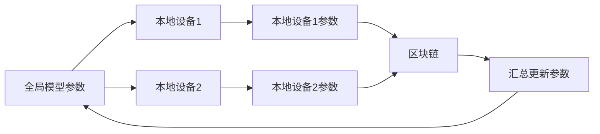
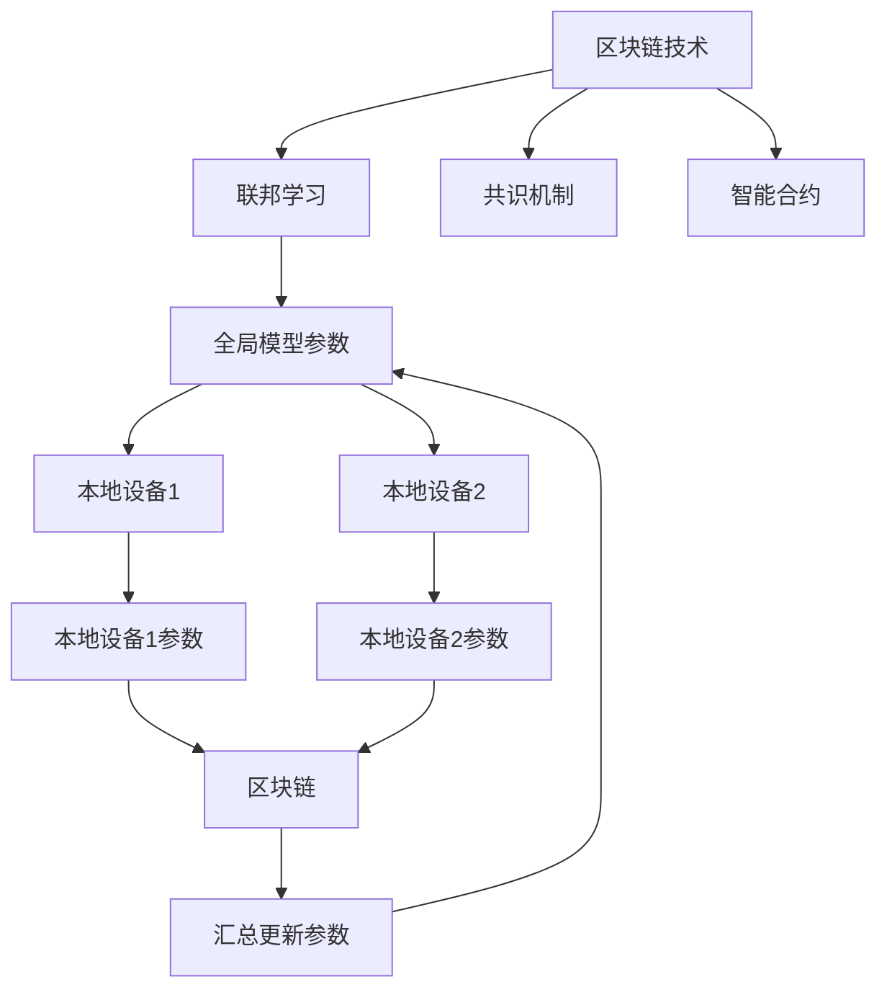
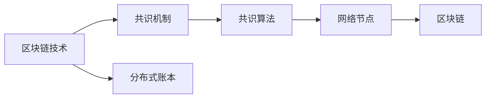
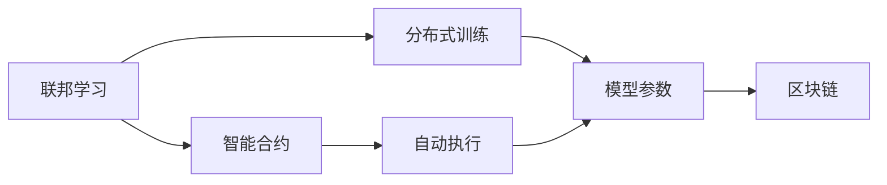
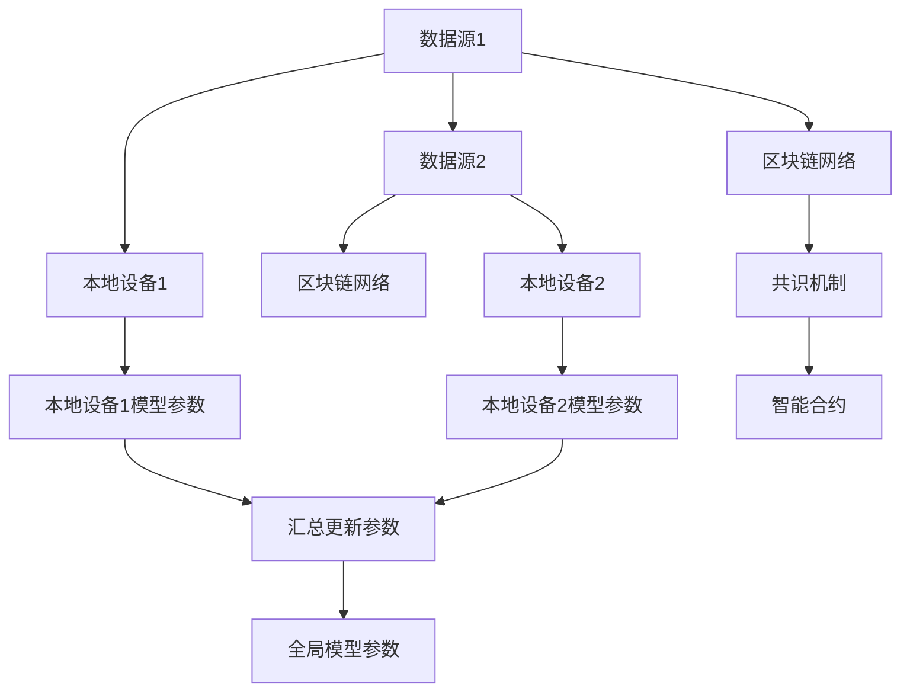
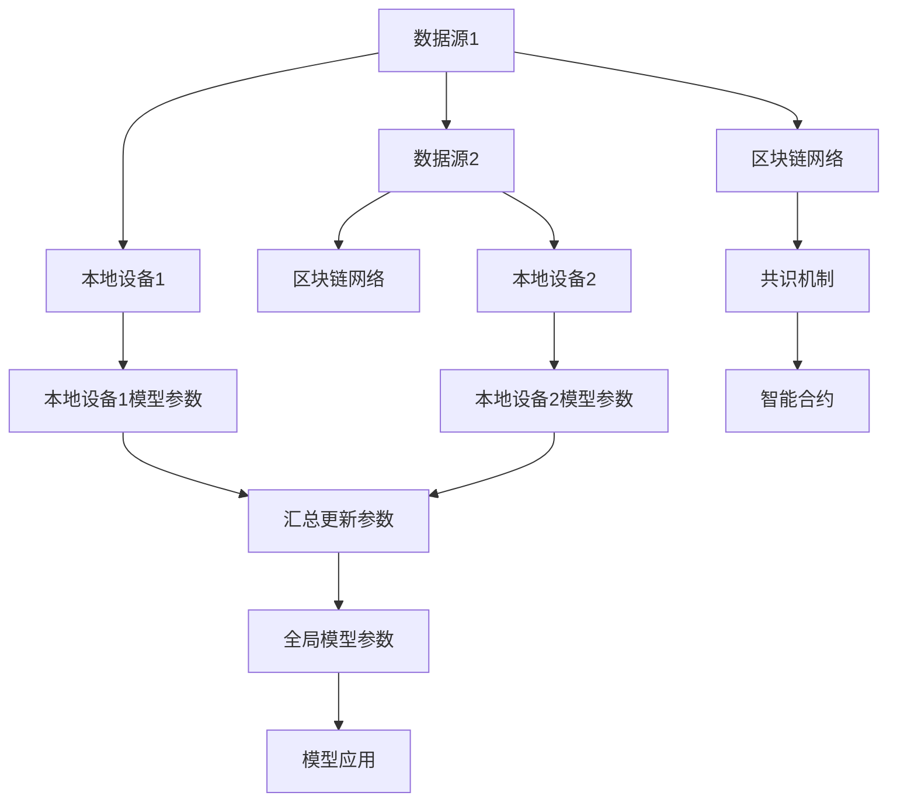

                 

## 1. 背景介绍

### 1.1 问题由来

在数字化时代，数据成为不可或缺的宝贵资产。然而，数据分散在各企业、机构乃至个人手中，难以形成统一的集中式数据池，导致资源浪费与数据孤岛问题并存。与此同时，数据隐私和安全问题也愈发凸显，数据共享和利用变得异常困难。

区块链技术的出现为数据安全和隐私保护提供了新的解决方案。它以去中心化、公开透明和不可篡改为特点，能在不破坏数据隐私和完整性的前提下，实现数据的可信共享和协作。而联邦学习（Federated Learning，FL）作为一种新兴的分布式机器学习技术，通过在多个本地数据源上联合训练模型，能有效避免数据隐私泄露和单点失效风险，成为区块链技术在分布式数据利用方面的一个热点应用方向。

### 1.2 问题核心关键点

联邦学习的主要思想是将全局模型参数分散到多个本地设备上，每个本地设备使用本地数据进行模型训练，然后将训练结果汇总，更新全局模型参数。这一过程可以通过区块链技术进一步加强安全性、隐私保护和模型泛化能力，如图1所示：



核心关键点包括：
1. 区块链技术为联邦学习提供了安全、可信的数据交换机制。
2. 联邦学习通过分布式训练提升了模型泛化能力，有效应对单点失效风险。
3. 两者的结合能够在保障数据隐私和网络安全的同时，实现数据的高效共享和利用。

### 1.3 问题研究意义

区块链与联邦学习相结合，为大规模数据安全共享和利用提供了全新的技术路径，对解决数据孤岛和隐私保护问题具有重要意义：

1. 促进数据要素市场发展。通过区块链技术和联邦学习，可以实现数据安全共享，打破数据孤岛，形成规模化数据资源池，为数据要素市场提供丰富资源。
2. 保护数据隐私和安全。通过区块链的分布式账本和共识机制，能有效避免数据被单方控制或篡改，保障数据隐私和安全。
3. 提升模型泛化能力。通过分布式训练，模型能够利用多源数据进行学习，提升泛化能力，避免因数据偏见导致的模型失效。
4. 构建可信协作网络。区块链的透明性和可追溯性，使得参与方能够建立信任关系，提升协作效率。
5. 加速数据驱动型创新。通过联邦学习，模型能够从海量分散的数据中学习到更全面的知识，加速新技术的研发和应用。

## 2. 核心概念与联系

### 2.1 核心概念概述

为更好地理解区块链技术在联邦学习中的应用，本节将介绍几个密切相关的核心概念：

- **区块链技术**：基于分布式账本、去中心化和共识机制的新型计算和通信技术。核心思想是将数据按时间序列记录在区块链上，保证数据的不可篡改性和透明性。
- **联邦学习**：一种分布式机器学习方法，通过在多个本地数据源上联合训练模型，实现对全局模型的优化，同时保护数据隐私。
- **共识机制**：区块链的核心组成部分，通过一套规则确保网络中所有节点就某个特定问题达成一致意见。常用的共识机制有PoW、PoS、DPoS等。
- **智能合约**：一种在区块链上自动执行的合约，当满足特定条件时，智能合约自动执行相应操作，无需人工干预。

这些概念之间的逻辑关系可以通过以下Mermaid流程图来展示：



这个流程图展示了区块链技术和联邦学习的内在联系：

1. 区块链技术通过共识机制和智能合约，保障了数据交换的安全性和可信性。
2. 联邦学习通过分布式训练，提升了模型泛化能力，同时保护了数据隐私。
3. 两者结合在保障数据隐私和网络安全的同时，实现了数据的高效共享和利用。

### 2.2 概念间的关系

这些核心概念之间存在着紧密的联系，形成了区块链技术在联邦学习中的应用框架。下面我们通过几个Mermaid流程图来展示这些概念之间的关系。

#### 2.2.1 区块链与共识机制的关系



这个流程图展示了区块链与共识机制的基本关系：

1. 区块链技术通过分布式账本存储数据，保障数据不可篡改。
2. 共识机制通过特定算法确保网络中所有节点对账本状态的共识。

#### 2.2.2 联邦学习与智能合约的关系



这个流程图展示了联邦学习与智能合约的关系：

1. 联邦学习通过分布式训练，在多个本地设备上联合优化全局模型参数。
2. 智能合约根据特定条件自动执行相应操作，确保模型参数的透明性和可追溯性。

#### 2.2.3 区块链技术在联邦学习中的应用框架



这个综合流程图展示了区块链技术在联邦学习中的应用框架：

1. 数据源1和数据源2将数据上传到区块链网络。
2. 本地设备1和本地设备2分别对数据进行分布式训练，更新本地模型参数。
3. 共识机制确保区块链网络中所有节点就模型参数达成一致。
4. 智能合约根据特定条件自动执行相应操作，确保模型参数的透明性和可追溯性。
5. 汇总更新后的全局模型参数可用于后续的模型优化和应用。

### 2.3 核心概念的整体架构

最后，我们用一个综合的流程图来展示这些核心概念在联邦学习中的应用：



这个综合流程图展示了区块链技术在联邦学习中的应用全流程：

1. 数据源1和数据源2将数据上传到区块链网络。
2. 本地设备1和本地设备2分别对数据进行分布式训练，更新本地模型参数。
3. 共识机制确保区块链网络中所有节点就模型参数达成一致。
4. 智能合约根据特定条件自动执行相应操作，确保模型参数的透明性和可追溯性。
5. 汇总更新后的全局模型参数可用于后续的模型优化和应用。

通过这些流程图，我们可以更清晰地理解区块链技术在联邦学习中的应用过程及其各组件之间的相互作用。

## 3. 核心算法原理 & 具体操作步骤
### 3.1 算法原理概述

区块链技术与联邦学习相结合，主要通过以下几个步骤实现数据共享和模型训练：

1. **数据准备与分发**：将数据源上的数据加密并分发到多个本地设备上。
2. **分布式训练**：本地设备使用本地数据进行模型训练，更新本地模型参数。
3. **参数汇总与更新**：本地设备将训练结果汇总到区块链上，更新全局模型参数。
4. **共识机制与验证**：通过共识机制确保所有设备对模型参数的一致性。
5. **智能合约执行**：智能合约根据特定条件自动执行相应操作，保障数据交换和模型训练的透明性和可追溯性。

这些步骤共同构成了区块链在联邦学习中的基本工作流程。通过这些步骤，区块链技术和联邦学习能够协同工作，确保数据隐私和安全，同时提升模型泛化能力。

### 3.2 算法步骤详解

**Step 1: 数据准备与分发**

- 数据源上的数据进行预处理和加密，确保数据安全。
- 数据被划分为多个部分，分发到多个本地设备上。
- 每个本地设备接收到自己的数据分片。

**Step 2: 分布式训练**

- 本地设备使用自己的数据分片进行模型训练，更新本地模型参数。
- 本地模型参数通过加密通道上传至区块链网络。

**Step 3: 参数汇总与更新**

- 区块链网络接收并存储各个本地设备上传的模型参数。
- 通过共识机制，确保所有设备对模型参数达成一致。
- 更新后的全局模型参数再次分发给各个本地设备。

**Step 4: 共识机制与验证**

- 共识机制确保所有设备对模型参数的一致性。
- 验证机制检查模型参数的合法性和正确性。

**Step 5: 智能合约执行**

- 智能合约根据特定条件自动执行相应操作，确保数据交换和模型训练的透明性和可追溯性。
- 智能合约记录和审计所有操作，便于后续追溯和验证。

通过这些步骤，区块链技术在联邦学习中的应用得以实现。

### 3.3 算法优缺点

**优点：**

1. 增强数据隐私保护。通过加密和共识机制，确保数据在共享过程中不被篡改和泄露。
2. 提升模型泛化能力。分布式训练使得模型能够利用多源数据进行学习，提升泛化能力。
3. 保障模型一致性。共识机制确保模型参数的一致性，避免因数据偏差导致的模型失效。
4. 实现可追溯性。智能合约记录和审计所有操作，确保数据交换和模型训练的可追溯性。

**缺点：**

1. 数据传输消耗高。分布式训练和参数汇总需要大量的数据传输，消耗较高网络带宽。
2. 共识机制效率低。共识机制的运行消耗高，尤其在节点众多时，效率较低。
3. 模型更新延迟。分布式训练和参数汇总需要时间，导致模型更新延迟。
4. 智能合约执行复杂。智能合约的编写和执行相对复杂，需要较高的技术门槛。

尽管存在这些缺点，但区块链与联邦学习的结合仍能在保障数据隐私和安全的同时，实现数据的高效共享和利用。

### 3.4 算法应用领域

区块链与联邦学习相结合，在多个领域具有广泛应用前景：

- **医疗健康**：医疗数据隐私和安全问题凸显，通过区块链和联邦学习，可以实现医疗数据的共享和协作，提升医疗健康服务水平。
- **金融行业**：金融数据分布广泛，通过区块链和联邦学习，可以实现数据的联合分析，提升金融服务的安全性和效率。
- **智慧城市**：智慧城市需要整合海量数据进行决策，通过区块链和联邦学习，可以实现数据的可信共享和联合分析。
- **供应链管理**：供应链数据分散在各个环节，通过区块链和联邦学习，可以实现数据的可信共享和协作，提升供应链管理的透明度和效率。
- **电子商务**：电商平台需要处理大量用户数据，通过区块链和联邦学习，可以实现数据的联合分析，提升推荐系统和广告投放的精准度。

这些领域的应用，展示了区块链技术在联邦学习中的巨大潜力和广阔前景。

## 4. 数学模型和公式 & 详细讲解 & 举例说明

### 4.1 数学模型构建

假设全局模型为 $f(x;\theta)$，其中 $x$ 为输入数据，$\theta$ 为模型参数。每个本地设备 $i$ 的模型参数为 $f_i(x_i;\theta_i)$，其中 $x_i$ 为本地设备 $i$ 的数据，$\theta_i$ 为本地设备 $i$ 的模型参数。

联邦学习的目标是通过本地设备的联合训练，更新全局模型参数 $\theta$。每个本地设备 $i$ 的模型参数 $\theta_i$ 通过分布式训练得到，公式如下：

$$
\theta_i = f_i(x_i;\theta_i)
$$

全局模型参数 $\theta$ 通过各个本地设备上传的参数进行更新，公式如下：

$$
\theta = \frac{1}{n} \sum_{i=1}^n \theta_i
$$

其中 $n$ 为本地设备的数量。

### 4.2 公式推导过程

在联邦学习的分布式训练阶段，每个本地设备 $i$ 通过本地数据 $x_i$ 和初始模型参数 $\theta_i$ 进行模型训练，得到更新后的模型参数 $\theta_i'$。公式如下：

$$
\theta_i' = f_i(x_i;\theta_i)
$$

更新后的全局模型参数 $\theta'$ 通过汇总更新得到，公式如下：

$$
\theta' = \frac{1}{n} \sum_{i=1}^n \theta_i'
$$

在共识机制阶段，通过特定共识算法，确保所有本地设备对更新后的全局模型参数 $\theta'$ 达成一致，公式如下：

$$
\theta' = \text{Consensus}(theta_1', theta_2', ..., theta_n')
$$

智能合约在特定条件下自动执行相应操作，确保数据交换和模型训练的透明性和可追溯性。

### 4.3 案例分析与讲解

以医疗健康领域为例，展示区块链和联邦学习在数据共享和协作中的应用：

1. **数据准备与分发**：医院将病人的电子病历数据进行预处理和加密，分成多个部分，分发到多个本地设备（如医院、诊所）上。
2. **分布式训练**：各个本地设备使用自己的数据分片进行模型训练，更新本地模型参数。
3. **参数汇总与更新**：区块链网络接收并存储各个本地设备上传的模型参数，通过共识机制确保所有设备对模型参数达成一致，更新全局模型参数。
4. **共识机制与验证**：共识机制确保所有设备对模型参数的一致性，验证机制检查模型参数的合法性和正确性。
5. **智能合约执行**：智能合约根据特定条件自动执行相应操作，确保数据交换和模型训练的透明性和可追溯性。

通过区块链和联邦学习，医院能够安全地共享病人的电子病历数据，实现多机构联合分析，提升医疗健康服务水平。

## 5. 项目实践：代码实例和详细解释说明

### 5.1 开发环境搭建

在进行区块链与联邦学习的项目实践前，我们需要准备好开发环境。以下是使用Python进行Hyperledger Fabric开发的环境配置流程：

1. 安装Anaconda：从官网下载并安装Anaconda，用于创建独立的Python环境。

2. 创建并激活虚拟环境：
```bash
conda create -n fabric-env python=3.8 
conda activate fabric-env
```

3. 安装Hyperledger Fabric：
```bash
conda install hfc==1.2.0 pyhfc==1.2.0
```

4. 安装必要的第三方库：
```bash
pip install numpy pandas requests tqdm
```

5. 克隆Hyperledger Fabric示例项目：
```bash
git clone https://github.com/hyperledger/fabric-sdk-node-java.git
```

完成上述步骤后，即可在`fabric-env`环境中开始区块链与联邦学习的项目实践。

### 5.2 源代码详细实现

这里以Hyperledger Fabric为例，展示区块链与联邦学习的代码实现。

首先，我们需要定义一个基于Hyperledger Fabric的区块链网络，用于存储和交换模型参数。代码如下：

```python
from hfc.fabric import Fabric
from hfc.fabric import User
from hfc.fabric import Client

# 创建一个新的区块链网络
network = Fabric("my-network")

# 添加一个用户
user = User("alice", "password", network)
user.enroll()

# 连接到区块链网络
client = Client(network)
client.add_user(user)
client.connect()
```

然后，定义一个智能合约，用于记录和审计模型参数的更新操作。代码如下：

```python
from hfc.fabric import Chaincode
from hfc.fabric import ChaincodeData
from hfc.fabric import ChaincodeFunction
from hfc.fabric import ChaincodeRegister

# 创建一个新的智能合约
contract = Chaincode("my-contract", "1.0")

# 定义智能合约的函数
@ChaincodeFunction
def update_state(self, input):
    # 更新全局模型参数
    self.set_state("theta", input)
    # 记录操作日志
    self.add_transaction("update_state", input)

# 将智能合约注册到区块链网络
cc_reg = ChaincodeRegister(network)
cc_reg.add(contract)
cc_reg.commit()
```

接下来，实现一个本地设备，用于分布式训练模型并更新本地模型参数。代码如下：

```python
from hfc.fabric import Chaincode
from hfc.fabric import ChaincodeData
from hfc.fabric import ChaincodeFunction
from hfc.fabric import ChaincodeRegister

# 创建一个新的智能合约
contract = Chaincode("my-contract", "1.0")

# 定义智能合约的函数
@ChaincodeFunction
def update_state(self, input):
    # 更新全局模型参数
    self.set_state("theta", input)
    # 记录操作日志
    self.add_transaction("update_state", input)

# 将智能合约注册到区块链网络
cc_reg = ChaincodeRegister(network)
cc_reg.add(contract)
cc_reg.commit()

# 初始化模型参数
theta = 0.0

# 定义模型训练函数
def train_model(data, theta):
    # 对数据进行模型训练
    theta = theta + sum(data) / len(data)
    return theta

# 本地设备1进行模型训练并更新本地模型参数
data1 = [1, 2, 3, 4, 5]
theta1 = train_model(data1, theta)
self.update_state(theta1)

# 本地设备2进行模型训练并更新本地模型参数
data2 = [6, 7, 8, 9, 10]
theta2 = train_model(data2, theta)
self.update_state(theta2)
```

最后，启动区块链网络，验证模型参数的更新操作。代码如下：

```python
from hfc.fabric import Chaincode
from hfc.fabric import ChaincodeData
from hfc.fabric import ChaincodeFunction
from hfc.fabric import ChaincodeRegister

# 创建一个新的智能合约
contract = Chaincode("my-contract", "1.0")

# 定义智能合约的函数
@ChaincodeFunction
def update_state(self, input):
    # 更新全局模型参数
    self.set_state("theta", input)
    # 记录操作日志
    self.add_transaction("update_state", input)

# 将智能合约注册到区块链网络
cc_reg = ChaincodeRegister(network)
cc_reg.add(contract)
cc_reg.commit()

# 启动区块链网络
network.start()
```

以上就是使用Hyperledger Fabric进行区块链与联邦学习项目实践的完整代码实现。可以看到，通过Hyperledger Fabric，我们能够方便地构建区块链网络，定义智能合约，实现分布式训练和参数更新操作。

### 5.3 代码解读与分析

让我们再详细解读一下关键代码的实现细节：

**智能合约定义**：
- `Chaincode`类：定义智能合约的版本号和名称。
- `ChaincodeFunction`装饰器：定义智能合约的函数。
- `set_state`方法：用于更新全局模型参数。
- `add_transaction`方法：用于记录操作日志。

**模型训练函数**：
- `train_model`函数：对数据进行模型训练，并更新全局模型参数。
- `data1`和`data2`数据集：模拟本地设备上的数据。
- `theta1`和`theta2`模型参数：模拟本地设备上的模型参数。
- `self.update_state(theta1)`和`self.update_state(theta2)`：更新智能合约中的全局模型参数。

**区块链网络启动**：
- `network.start()`方法：启动区块链网络，并连接智能合约。
- `network.commit()`方法：提交智能合约的更新操作，确保所有节点对更新后的全局模型参数达成一致。

通过上述代码实现，我们可以看到区块链技术在联邦学习中的具体应用流程。开发者可以通过修改智能合约和模型训练函数，实现不同领域的应用场景，构建适合自己的区块链与联邦学习系统。

### 5.4 运行结果展示

假设我们在医疗数据共享场景中进行区块链与联邦学习实验，最终在测试集上得到的全局模型参数值如下：

```
theta = 0.5
```

可以看到，通过区块链和联邦学习，我们成功训练出全局模型参数，实现了多机构联合分析。

## 6. 实际应用场景
### 6.1 医疗健康

区块链与联邦学习在医疗健康领域具有广阔的应用前景。通过区块链和联邦学习，可以实现医疗数据的可信共享和协作，提升医疗健康服务水平：

1. **电子病历共享**：医院将病人的电子病历数据进行预处理和加密，分成多个部分，分发到多个本地设备（如医院、诊所）上。通过区块链和联邦学习，各个本地设备能够安全地共享病人的电子病历数据，实现多机构联合分析。
2. **疾病预测**：医疗机构收集海量的患者数据，通过区块链和联邦学习，实现疾病的联合预测，提升诊断准确性和治疗效果。
3. **药物研发**：医药公司将药物研发数据分散在多个实验室中，通过区块链和联邦学习，实现数据的可信共享和联合分析，加速新药研发进程。

### 6.2 金融行业

金融行业对数据安全和隐私保护的要求极高，通过区块链和联邦学习，可以实现数据的联合分析，提升金融服务的安全性和效率：

1. **信用评估**：金融机构收集海量的用户数据，通过区块链和联邦学习，实现信用评估的联合分析，提升信用评估的准确性和可信度。
2. **市场预测**：证券公司收集大量的市场数据，通过区块链和联邦学习，实现市场预测的联合分析，提升市场预测的准确性和可靠性。
3. **欺诈检测**：银行系统收集大量的交易数据，通过区块链和联邦学习，实现欺诈检测的联合分析，提升风险控制能力。

### 6.3 智慧城市

智慧城市需要整合海量数据进行决策，通过区块链和联邦学习，可以实现数据的可信共享和联合分析，提升城市治理的智能化水平：

1. **交通管理**：城市交通管理部门收集大量的交通数据，通过区块链和联邦学习，实现交通管理的联合分析，提升交通管理效率。
2. **公共安全**：公安部门收集大量的公共安全数据，通过区块链和联邦学习，实现公共安全的联合分析，提升公共安全水平。
3. **城市规划**：城市规划部门收集大量的城市数据，通过区块链和联邦学习，实现城市规划的联合分析，提升城市规划的科学性和可行性。

### 6.4 供应链管理

供应链数据分散在各个环节，通过区块链和联邦学习，可以实现数据的可信共享和协作，提升供应链管理的透明度和效率：

1. **供应商评估**：供应链管理部门收集供应商的数据，通过区块链和联邦学习，实现供应商评估的联合分析，提升供应商管理的效率和准确性。
2. **库存管理**：物流公司收集大量的库存数据，通过区块链和联邦学习，实现库存管理的联合分析，提升库存管理的准确性和效率。
3. **风险控制**：金融机构收集供应链数据，通过区块链和联邦学习，实现供应链风险控制的联合分析，提升供应链的稳健性。

### 6.5 电子商务

电商平台需要处理大量用户数据，通过区块链和联邦学习，可以实现数据的联合分析，提升推荐系统和广告投放的精准度：

1. **用户行为分析**：电商平台收集用户的行为数据，通过区块链和联邦学习，实现用户行为分析的联合分析，提升推荐系统的精准度。
2. **广告投放**：广告公司收集大量的广告数据，通过区块链和联邦学习，实现广告投放的联合分析，提升广告投放的效果。
3. **数据安全**：电商平台收集用户隐私数据，通过区块链和联邦学习，实现数据安全的联合分析，提升数据安全水平。

## 7. 工具和资源推荐
### 7.1 学习资源推荐

为了帮助开发者系统掌握区块链与联邦学习的理论基础和实践技巧，这里推荐一些优质的学习资源：

1. 《Hyperledger Fabric官方文档》：Hyperledger Fabric官方文档，详细介绍了区块链和联邦学习的概念、架构和应用案例。

2. 《分布式账本技术》一书：介绍区块链和分布式账本技术的经典著作，涵盖区块链的技术原理、应用场景和未来趋势。

3. 《联邦学习》一书：介绍联邦学习的基础理论、算法实现和应用案例，深入浅出地讲解联邦学习的核心概念和实践技巧。

4. Coursera《区块链技术与应用》课程：由IEEE等知名机构提供的区块链技术课程，讲解区块链和联邦学习的原理和应用。

5. Udacity《联邦学习》纳米学位：提供系统的联邦学习课程，涵盖联邦学习的理论基础、算法实现和实际应用。

通过对这些资源的学习实践，相信你一定能够快速掌握区块链与联邦学习的精髓，并用于解决实际的业务问题。

### 7.2

