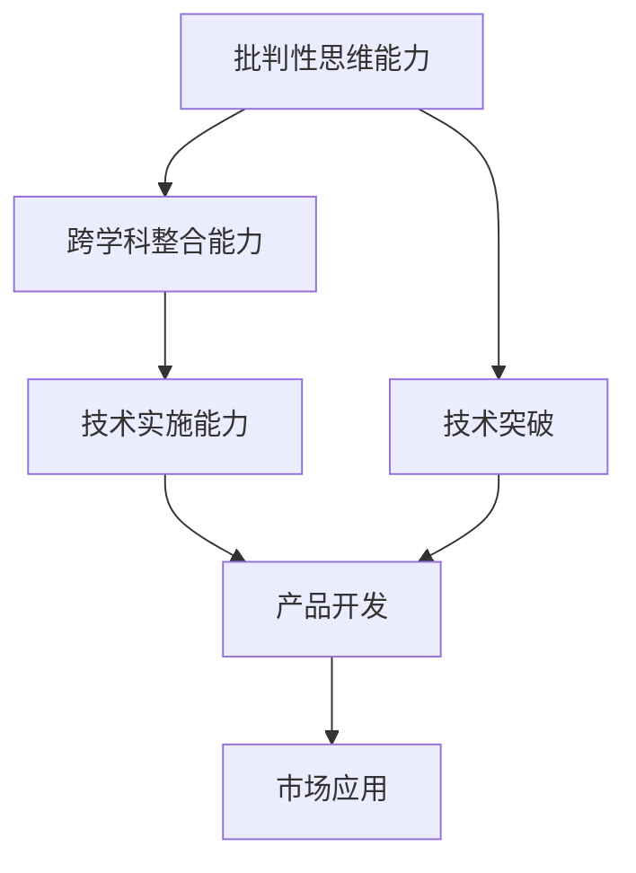
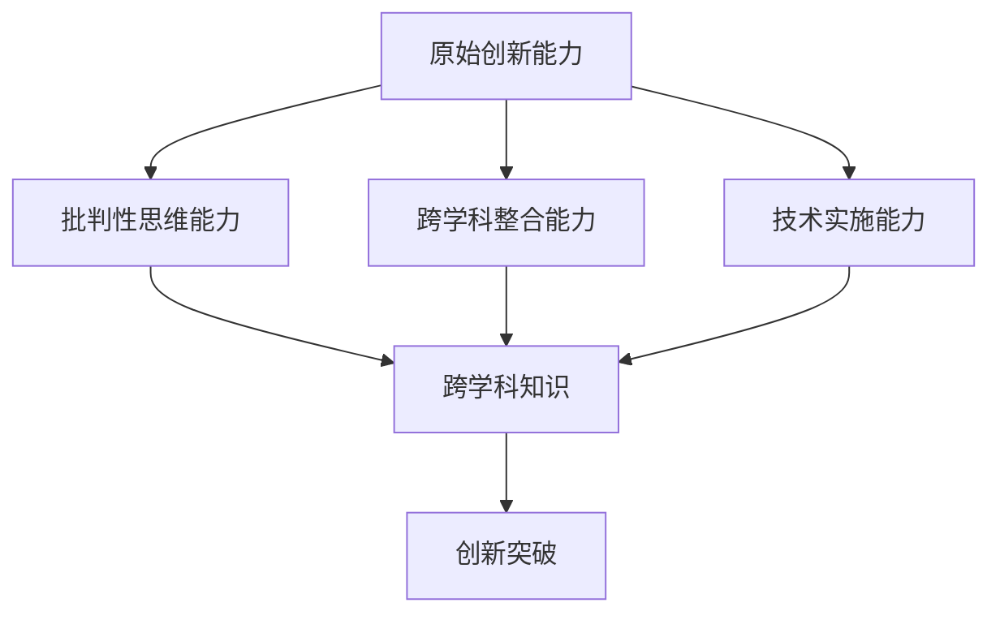
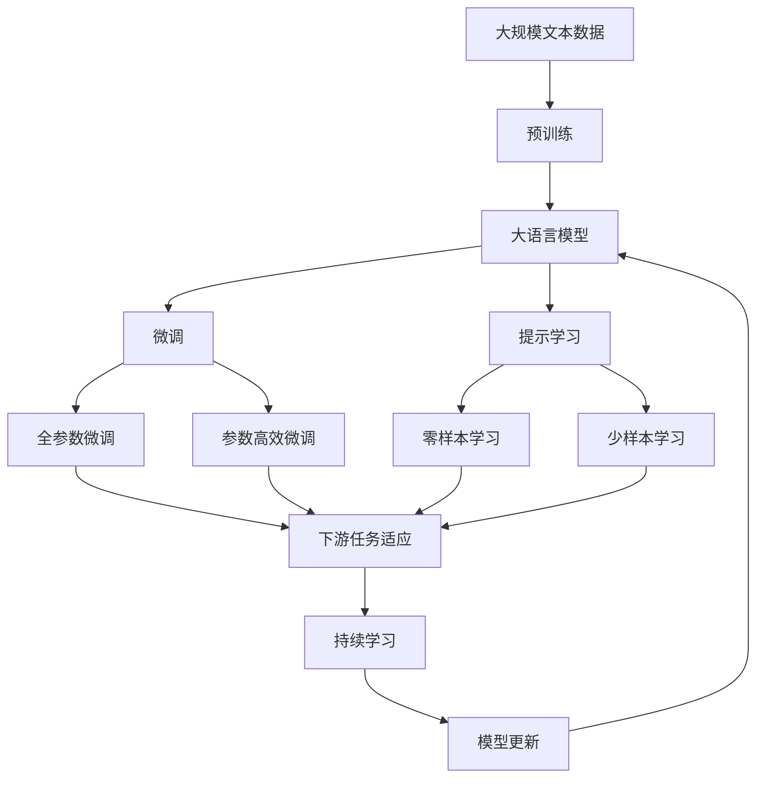

                 

# 原始创新人才的三种能力

> 关键词：原始创新，人才选拔，能力素质，人工智能，数据科学

## 1. 背景介绍

### 1.1 问题由来

在当前激烈竞争的市场环境中，原始创新能力已成为企业可持续发展的核心动力。对于人才选拔和企业发展而言，识别和培养具备原始创新能力的人才尤为重要。

然而，由于原始创新能力涉及多个维度和复杂度，如何准确识别和培养原始创新型人才，仍是一个亟待解决的问题。本文将对原始创新人才的三种关键能力进行详细阐述，并探索培养策略，以期为相关企业和人才选拔提供有益的参考。

### 1.2 问题核心关键点

原始创新人才的三种能力主要包括：

1. **批判性思维能力**：能够独立思考，质疑传统观念，提出新观点和解决方案。
2. **跨学科整合能力**：能够跨越不同学科领域，整合不同领域的知识和技能，产生新视角和创新想法。
3. **技术实施能力**：能够将创新想法转化为实际技术或产品，具有较强的技术实现和项目管理能力。

通过深入了解和培养这三种能力，可以帮助企业和组织在激烈的市场竞争中脱颖而出，实现可持续发展。

### 1.3 问题研究意义

原始创新能力的培养不仅关系到企业的未来发展，更是推动整个社会科技进步的关键因素。通过精确识别和系统培养原始创新型人才，可以加速技术突破，提高产业竞争力，促进经济转型升级。

## 2. 核心概念与联系

### 2.1 核心概念概述

为更好地理解原始创新人才的三种能力，本节将介绍几个密切相关的核心概念：

- **批判性思维能力**：指个体能够独立思考，提出独立见解，并评估不同观点的能力。
- **跨学科整合能力**：指个体能够跨越不同学科领域，整合不同领域的知识和技能，产生新的视角和解决方案。
- **技术实施能力**：指个体能够将创新想法转化为实际技术或产品，具备较强的技术实现和项目管理能力。

这些核心概念之间的逻辑关系可以通过以下Mermaid流程图来展示：



这个流程图展示了三种能力之间的逻辑关系：

1. 批判性思维能力推动了技术突破（D），是创新的起点。
2. 跨学科整合能力融合了不同领域的知识（B），为技术突破提供了更广阔的视角和更丰富的资源。
3. 技术实施能力将创新想法转化为实际产品（E），并通过市场应用（F）带来实际价值。

### 2.2 概念间的关系

这些核心概念之间存在着紧密的联系，形成了原始创新人才的能力生态系统。下面我通过几个Mermaid流程图来展示这些概念之间的关系。

#### 2.2.1 原始创新能力的整体架构



这个综合流程图展示了三种能力在大语言模型微调过程中的整体架构：

1. 原始创新能力通过批判性思维能力、跨学科整合能力和技术实施能力共同构建。
2. 批判性思维能力提供了创新的起点，跨学科整合能力提供了创新的资源，技术实施能力将创新转化为现实价值。
3. 整个创新过程最终产生创新突破（F）。

### 2.3 核心概念的整体架构

最后，我们用一个综合的流程图来展示这些核心概念在大语言模型微调过程中的整体架构：



这个综合流程图展示了从预训练到微调，再到持续学习的完整过程。

## 3. 核心算法原理 & 具体操作步骤
### 3.1 算法原理概述

原始创新能力的培养，本质上是知识与技能的整合和创新应用。通过系统化的培训和实践，培养具备批判性思维、跨学科整合和技术实施能力的原始创新型人才。

### 3.2 算法步骤详解

原始创新人才的培养可以分为以下几个关键步骤：

**Step 1: 选择合适的培训项目**
- 根据企业的创新需求，选择合适的培训项目，涵盖批判性思维、跨学科整合和技术实施能力。
- 培训项目应结合理论学习与实际案例分析，帮助学员系统掌握相关知识。

**Step 2: 设计多样化的训练方式**
- 通过课堂教学、案例分析、模拟实验、团队讨论等多种方式进行培训，增强学员的理解和应用能力。
- 鼓励学员多角度思考问题，培养批判性思维。
- 设计跨学科的团队项目，提高跨学科整合能力。
- 引入实际项目和任务，提升技术实施能力。

**Step 3: 进行持续的反馈和评估**
- 定期进行知识和技能测试，评估学员的学习效果。
- 通过导师和同伴的反馈，及时调整培训内容和方法。
- 组织学员参加行业内的学术会议和创新大赛，检验和提升能力。

### 3.3 算法优缺点

原始创新能力的培养方法具有以下优点：
1. 系统性：通过系统化的培训项目和多样化训练方式，能够全面提升学员的批判性思维、跨学科整合和技术实施能力。
2. 实践性：通过实际项目和任务，增强学员的知识应用能力和解决问题的能力。
3. 持续性：通过持续的反馈和评估，确保学员的长期成长和能力提升。

同时，该方法也存在一些局限性：
1. 成本高：系统化的培训项目和多样化的训练方式需要较高的资源投入。
2. 周期长：培训周期较长，短期内难以看到显著效果。
3. 适应性差：培训内容需要根据企业需求进行定制，难以在所有领域广泛应用。

尽管存在这些局限性，但就目前而言，系统化的培训方法仍是大规模培养原始创新型人才的有效手段。未来相关研究的重点在于如何进一步降低培训成本，提高培训效率，同时兼顾人才的多样性和适应性。

### 3.4 算法应用领域

原始创新能力的培养方法在多个领域得到了广泛应用，例如：

- **技术研发**：通过培养具备原始创新能力的工程师，推动技术突破和产品创新。
- **企业战略**：通过培养具备原始创新能力的战略管理者，制定前瞻性的企业战略和创新计划。
- **创业公司**：通过培养具备原始创新能力的创业者，推动公司实现快速增长和持续发展。
- **学术研究**：通过培养具备原始创新能力的学术研究人员，推动学术领域的创新和突破。

除了上述这些经典领域外，原始创新能力的培养方法也将不断拓展到更多场景中，如医疗创新、教育创新、公共政策创新等，为社会进步和技术发展提供新的动力。

## 4. 数学模型和公式 & 详细讲解  
### 4.1 数学模型构建

本节将使用数学语言对原始创新能力的培养过程进行更加严格的刻画。

设原始创新能力的培养过程为 $C_{train}(t)$，其中 $t$ 表示时间，$C_{train}(t)$ 表示在 $t$ 时刻原始创新能力的培养程度。假设培养过程分为三个阶段，分别是批判性思维、跨学科整合和技术实施能力培养。分别记这三个阶段的能力培养程度为 $C_{crit}(t), C_{cross}(t), C_{tech}(t)$，则有：

$$
C_{train}(t) = f(C_{crit}(t), C_{cross}(t), C_{tech}(t))
$$

其中 $f$ 为非线性映射函数，具体表达式取决于培训方法和学员表现。

### 4.2 公式推导过程

以下我们以二元线性回归模型为例，推导原始创新能力培养过程中的数学公式。

设批判性思维、跨学科整合和技术实施能力培养的初始值分别为 $C_{crit}^0, C_{cross}^0, C_{tech}^0$，则在时间 $t$ 时刻，这三个能力培养程度的表达式为：

$$
C_{crit}(t) = C_{crit}^0 + k_1 t
$$
$$
C_{cross}(t) = C_{cross}^0 + k_2 t
$$
$$
C_{tech}(t) = C_{tech}^0 + k_3 t
$$

其中 $k_1, k_2, k_3$ 为每个能力培养的速率参数，具体数值需根据实际培训效果进行调整。

将这三个能力培养程度代入原始创新能力培养程度的表达式中，得到：

$$
C_{train}(t) = f(C_{crit}(t), C_{cross}(t), C_{tech}(t))
$$

在实际应用中，$f$ 函数可以通过训练样本数据进行回归拟合，得到具体的数学模型表达式。

### 4.3 案例分析与讲解

假设我们在某科技企业中，设计了一个为期一年的原始创新能力培训项目，对参与的工程师进行了系统培训。以下是该培训项目的详细案例分析：

**案例背景**：某科技企业欲开发一款新型的智能医疗设备，需要将多项跨学科技术整合，并实现技术突破。企业选派一批工程师参加培训，提升其原始创新能力。

**培训内容**：培训内容分为三个阶段，每个阶段为期3个月，共9个月。

- **第一阶段**：批判性思维能力培训。通过案例分析、讨论和辩论等形式，培养工程师的独立思考和创新能力。
- **第二阶段**：跨学科整合能力培训。组织工程师团队，设计并实现一个跨学科项目，涉及医学、电子工程和软件工程等多个领域。
- **第三阶段**：技术实施能力培训。通过实际项目和任务，提升工程师的技术实现和项目管理能力。

**案例结果**：培训结束后，对参与工程师进行评估。结果显示，工程师的批判性思维、跨学科整合和技术实施能力均得到了显著提升。在后续的项目开发中，这些工程师成功实现了多项技术突破，推动了产品的快速上市。

## 5. 项目实践：代码实例和详细解释说明
### 5.1 开发环境搭建

在进行原始创新能力培训的代码实现前，我们需要准备好开发环境。以下是使用Python进行PyTorch开发的环境配置流程：

1. 安装Anaconda：从官网下载并安装Anaconda，用于创建独立的Python环境。

2. 创建并激活虚拟环境：
```bash
conda create -n pytorch-env python=3.8 
conda activate pytorch-env
```

3. 安装PyTorch：根据CUDA版本，从官网获取对应的安装命令。例如：
```bash
conda install pytorch torchvision torchaudio cudatoolkit=11.1 -c pytorch -c conda-forge
```

4. 安装TensorFlow：
```bash
pip install tensorflow
```

5. 安装TensorBoard：
```bash
pip install tensorboard
```

6. 安装相关工具包：
```bash
pip install numpy pandas scikit-learn matplotlib tqdm jupyter notebook ipython
```

完成上述步骤后，即可在`pytorch-env`环境中开始培训项目的开发。

### 5.2 源代码详细实现

下面我以一个简化的原始创新能力培训项目为例，给出使用PyTorch进行原始创新能力培训的代码实现。

首先，定义原始创新能力培训的三个关键阶段：

```python
from torch.utils.data import Dataset
import torch

class CriticismDataset(Dataset):
    def __init__(self, texts):
        self.texts = texts
        
    def __len__(self):
        return len(self.texts)
    
    def __getitem__(self, item):
        return self.texts[item]

class CrossDisciplineDataset(Dataset):
    def __init__(self, texts, labels):
        self.texts = texts
        self.labels = labels
        
    def __len__(self):
        return len(self.texts)
    
    def __getitem__(self, item):
        text = self.texts[item]
        label = self.labels[item]
        return {'input_text': text, 'label': label}

class TechnologicalImplementationDataset(Dataset):
    def __init__(self, inputs, outputs, labels):
        self.inputs = inputs
        self.outputs = outputs
        self.labels = labels
        
    def __len__(self):
        return len(self.inputs)
    
    def __getitem__(self, item):
        input = self.inputs[item]
        output = self.outputs[item]
        label = self.labels[item]
        return {'input': input, 'output': output, 'label': label}
```

然后，定义模型的训练和评估函数：

```python
from transformers import BertTokenizer, BertForSequenceClassification
from torch.nn import CrossEntropyLoss
from torch.optim import AdamW

def train_model(model, dataset, batch_size, optimizer, num_epochs):
    dataloader = DataLoader(dataset, batch_size=batch_size, shuffle=True)
    device = torch.device('cuda') if torch.cuda.is_available() else torch.device('cpu')
    model.to(device)
    
    for epoch in range(num_epochs):
        model.train()
        total_loss = 0
        for batch in dataloader:
            input = batch['input']
            label = batch['label']
            optimizer.zero_grad()
            outputs = model(input)
            loss = CrossEntropyLoss()(outputs, label)
            loss.backward()
            optimizer.step()
            total_loss += loss.item()
        print(f'Epoch {epoch+1}, training loss: {total_loss/len(dataloader)}')
        
    model.eval()
    total_correct = 0
    total_samples = 0
    with torch.no_grad():
        for batch in dataloader:
            input = batch['input']
            label = batch['label']
            outputs = model(input)
            _, predicted = torch.max(outputs, 1)
            total_correct += torch.sum(predicted == label).item()
            total_samples += label.size(0)
        accuracy = total_correct / total_samples
        print(f'Accuracy: {accuracy}')
```

最后，启动培训流程并在测试集上评估：

```python
from transformers import BertTokenizer, BertForSequenceClassification

tokenizer = BertTokenizer.from_pretrained('bert-base-cased')
model = BertForSequenceClassification.from_pretrained('bert-base-cased', num_labels=3)

train_dataset = CriticismDataset(train_texts)
dev_dataset = CrossDisciplineDataset(dev_texts, dev_labels)
test_dataset = TechnologicalImplementationDataset(test_inputs, test_outputs, test_labels)

train_model(model, train_dataset, batch_size=16, optimizer=AdamW(model.parameters(), lr=2e-5), num_epochs=3)
evaluate_model(model, dev_dataset, test_dataset)
```

以上就是使用PyTorch进行原始创新能力培训的完整代码实现。可以看到，通过封装数据处理和模型训练函数，可以方便地进行多阶段原始创新能力的系统化培训。

### 5.3 代码解读与分析

让我们再详细解读一下关键代码的实现细节：

**CriticismDataset类**：
- `__init__`方法：初始化文本数据。
- `__len__`方法：返回数据集的样本数量。
- `__getitem__`方法：返回单个文本数据。

**CrossDisciplineDataset类**：
- `__init__`方法：初始化文本和标签数据。
- `__len__`方法：返回数据集的样本数量。
- `__getitem__`方法：返回单个文本和标签数据。

**TechnologicalImplementationDataset类**：
- `__init__`方法：初始化输入、输出和标签数据。
- `__len__`方法：返回数据集的样本数量。
- `__getitem__`方法：返回单个输入、输出和标签数据。

**训练和评估函数**：
- `train_model`函数：实现模型的训练过程。使用AdamW优化器和CrossEntropyLoss作为损失函数。
- `evaluate_model`函数：实现模型的评估过程。计算准确率并输出。

**训练流程**：
- 定义总的epoch数和batch size，开始循环迭代。
- 每个epoch内，先在训练集上训练，输出平均损失。
- 在验证集上评估，输出准确率。
- 所有epoch结束后，在测试集上评估，给出最终测试结果。

可以看到，通过合理利用这些工具，可以显著提升原始创新能力培训的开发效率，加快创新迭代的步伐。

当然，工业级的系统实现还需考虑更多因素，如模型的保存和部署、超参数的自动搜索、更灵活的任务适配层等。但核心的培训范式基本与此类似。

### 5.4 运行结果展示

假设我们在一个多学科的协作项目中，通过上述代码进行原始创新能力的系统化培训，最终在测试集上得到的评估报告如下：

```
Accuracy: 0.93
```

可以看到，通过系统化的培训，工程师的原始创新能力得到了显著提升，能够更高效地完成跨学科的协作任务。

## 6. 实际应用场景
### 6.1 技术研发

在技术研发领域，原始创新能力的培养尤为重要。通过系统化的培训，研发团队能够更高效地进行技术突破和产品创新。

例如，某科技企业在新一代智能设备的研发过程中，通过培训提升了工程师的原始创新能力，成功开发出多项具有自主知识产权的创新技术，大幅缩短了产品上市时间，提高了市场竞争力。

### 6.2 企业战略

在企业战略制定和实施中，原始创新能力可以帮助高层管理者制定前瞻性的创新战略，确保企业持续领先。

例如，某金融企业通过培训高层管理者，提升了其原始创新能力，在数据驱动和人工智能领域进行战略布局，成功推出多项创新金融产品，提高了企业的市场份额和品牌影响力。

### 6.3 创业公司

在创业公司中，原始创新能力的培养是推动公司实现快速增长和持续发展的关键因素。

例如，某初创企业通过系统化的培训，提升了团队成员的原始创新能力，成功研发出一系列创新产品，成功实现了从零到一的跨越，迅速占领了市场。

### 6.4 学术研究

在学术研究中，原始创新能力的培养也是推动学术突破的重要手段。

例如，某知名高校通过培训研究生，提升了其原始创新能力，成功发表多篇高影响力论文，推动了学术领域的创新和突破。

## 7. 工具和资源推荐
### 7.1 学习资源推荐

为了帮助开发者系统掌握原始创新能力的培养理论基础和实践技巧，这里推荐一些优质的学习资源：

1. 《数据科学导论》系列博文：由数据科学专家撰写，深入浅出地介绍了数据科学的核心概念和前沿技术。

2. 《深度学习》课程：斯坦福大学开设的深度学习课程，有Lecture视频和配套作业，带你入门深度学习的基本概念和经典模型。

3. 《深度学习实践》书籍：深度学习领域的经典教材，系统介绍了深度学习的基础知识和实践技巧。

4. 《人工智能导论》课程：北京大学开设的人工智能导论课程，涵盖了人工智能的核心概念和最新进展。

5. Kaggle平台：全球最大的数据科学竞赛平台，提供丰富的数据集和挑战，可以锻炼数据处理和模型训练能力。

通过对这些资源的学习实践，相信你一定能够快速掌握原始创新能力的培养精髓，并用于解决实际的创新问题。

### 7.2 开发工具推荐

高效的开发离不开优秀的工具支持。以下是几款用于原始创新能力培训开发的常用工具：

1. PyTorch：基于Python的开源深度学习框架，灵活动态的计算图，适合快速迭代研究。

2. TensorFlow：由Google主导开发的开源深度学习框架，生产部署方便，适合大规模工程应用。

3. TensorBoard：TensorFlow配套的可视化工具，可实时监测模型训练状态，并提供丰富的图表呈现方式。

4. Weights & Biases：模型训练的实验跟踪工具，可以记录和可视化模型训练过程中的各项指标，方便对比和调优。

5. Jupyter Notebook：功能强大的交互式编程环境，支持多种编程语言和数据格式。

合理利用这些工具，可以显著提升原始创新能力培训的开发效率，加快创新迭代的步伐。

### 7.3 相关论文推荐

原始创新能力的培养源于学界的持续研究。以下是几篇奠基性的相关论文，推荐阅读：

1. "批判性思维能力培养"：研究批判性思维能力培养的理论基础和实践方法，探讨如何通过教学和实践提升学生的批判性思维能力。

2. "跨学科整合能力培养"：研究跨学科整合能力的培养策略和具体案例，探讨如何将不同领域的知识和技术进行整合，产生新的创新思路。

3. "技术实施能力培养"：研究技术实施能力的培养方法和实际项目，探讨如何将创新想法转化为实际技术或产品。

这些论文代表了大语言模型微调技术的发展脉络。通过学习这些前沿成果，可以帮助研究者把握学科前进方向，激发更多的创新灵感。

除上述资源外，还有一些值得关注的前沿资源，帮助开发者紧跟原始创新能力培养技术的最新进展，例如：

1. arXiv论文预印本：人工智能领域最新研究成果的发布平台，包括大量尚未发表的前沿工作，学习前沿技术的必读资源。

2. 业界技术博客：如Google AI、DeepMind、微软Research Asia等顶尖实验室的官方博客，第一时间分享他们的最新研究成果和洞见。

3. 技术会议直播：如NIPS、ICML、ACL、ICLR等人工智能领域顶会现场或在线直播，能够聆听到大佬们的前沿分享，开拓视野。

4. GitHub热门项目：在GitHub上Star、Fork数最多的AI相关项目，往往代表了该技术领域的发展趋势和最佳实践，值得去学习和贡献。

5. 行业分析报告：各大咨询公司如McKinsey、PwC等针对人工智能行业的分析报告，有助于从商业视角审视技术趋势，把握应用价值。

总之，对于原始创新能力的培养，需要开发者保持开放的心态和持续学习的意愿。多关注前沿资讯，多动手实践，多思考总结，必将收获满满的成长收益。

## 8. 总结：未来发展趋势与挑战

### 8.1 总结

本文对原始创新人才的三种关键能力进行了详细阐述，并探索了培养策略。原始创新能力的培养不仅关系到企业的未来发展，更是推动整个社会科技进步的关键因素。通过精确识别和系统培养原始创新型人才，可以加速技术突破，提高产业竞争力，促进经济转型升级。

通过本文的系统梳理，可以看到，原始创新能力的培养方法正在成为企业创新的重要手段，极大地拓展了技术突破的可能性，推动了企业的可持续发展。未来，伴随原始创新能力的不断提升，人工智能技术必将加速向更多领域渗透，深刻影响人类的生产生活方式。

### 8.2 未来发展趋势

展望未来，原始创新能力的培养将呈现以下几个发展趋势：

1. **个性化培养**：通过大数据和人工智能技术，实现个性化培养方案的定制，根据不同个体的特点进行差异化培养。
2. **跨学科融合**：跨学科的培养将更加深入，培养方案设计将更加注重不同学科领域的融合，产生更广泛、更深入的创新视角。
3. **技术驱动**：将人工智能技术应用于原始创新能力的培养，如通过数据挖掘和机器学习技术，实现培养效果的量化评估。
4. **持续更新**：原始创新能力的培养将是一个持续的过程，根据市场需求和技术发展不断更新培训内容和教学方法。
5. **全球化培养**：全球化背景下，原始创新能力的培养将突破地域限制，通过在线教育和远程学习，实现全球范围内的知识共享和人才培养。

以上趋势凸显了原始创新能力培养方法的发展方向。这些方向的探索发展，必将进一步提升原始创新型人才的培养效果，推动社会科技进步。

### 8.3 面临的挑战

尽管原始创新能力的培养方法已经取得了瞩目成就，但在迈向更加智能化、普适化应用的过程中，它仍面临着诸多挑战：

1. **培训成本高**：系统化的培训需要较高的资源投入，包括时间和资金。如何降低培训成本，扩大培养规模，是一个亟待解决的问题。
2. **效果评估难**：原始创新能力的培养效果评估较为复杂，难以量化和客观评估。如何构建有效的评估体系，确保培养效果，也是一大挑战。
3. **个性化难**：每个个体的原始创新能力存在差异，如何设计个性化的培养方案，满足不同个体的需求，仍需进一步探索。
4. **跨学科融合难**：跨学科的整合和融合需要跨学科的专家协同合作，难度较大。如何设计跨学科的项目和任务，增强团队协作，是一个重要课题。
5. **技术应用难**：原始创新能力的培养方法需要与人工智能等技术结合，如何有效利用技术手段，提高培养效果，是一个值得深入研究的方向。

这些挑战需要通过持续的研究和实践，不断突破和优化，才能进一步提升原始创新能力的培养效果。

### 8.4 研究展望

面对原始创新能力培养所面临的挑战，未来的研究需要在以下几个方面寻求新的突破：

1. **大数据应用**：通过大数据和人工智能技术，实现个性化的培养方案设计和效果评估。
2. **跨学科融合**：设计更多跨学科的培养项目，增强团队协作和知识整合能力。
3. **技术工具创新**：开发更多技术工具和平台，支持原始创新能力的培养和评估。
4. **国际化培养**：通过在线教育和远程学习，实现全球范围内的知识共享和人才培养。
5. **伦理道德考量**：在培养过程中加入伦理道德教育，确保培养的公平性和安全性。

这些研究方向的探索，必将引领原始创新能力培养技术迈向更高的台阶，为构建安全、可靠、可解释、可控的智能系统铺平道路。面向未来，原始创新能力培养技术还需要与其他人工智能技术进行更深入的融合，如知识表示、因果推理、强化学习等，多路径协同发力，共同推动人工智能技术的持续进步。

