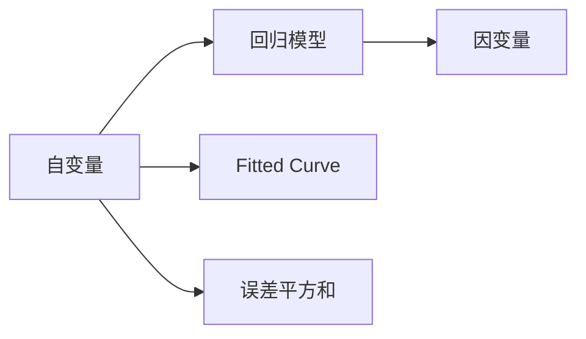
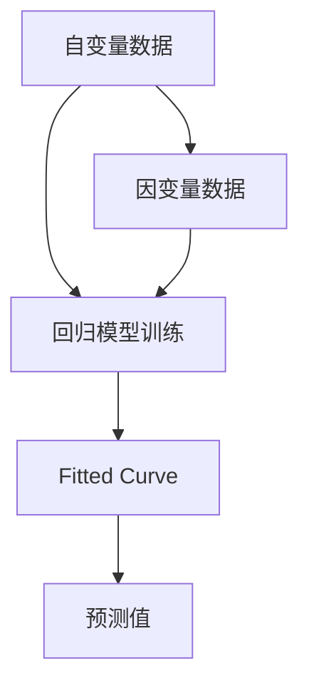
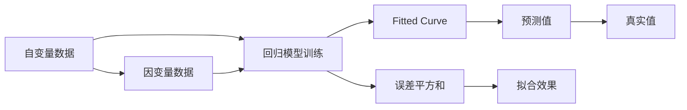

                 

# 回归(Regression) - 原理与代码实例讲解

## 1. 背景介绍

### 1.1 问题由来

回归(Regression)分析是统计学中最常用的分析方法之一，广泛应用于经济预测、金融分析、医学研究等领域。在机器学习领域，回归模型更是许多算法的基础。随着数据科学和人工智能的快速发展，回归模型在各个领域的应用变得更加广泛和深入。本文将从回归模型的原理和应用出发，结合实际代码实例，全面讲解回归模型的工作原理和实现方法。

### 1.2 问题核心关键点

回归模型的核心在于通过对历史数据的学习，构建出一个或多个自变量与因变量之间的关系模型，并通过模型对新数据进行预测或分析。回归模型的目标是找到一个函数 $f(x)$，使得它在给定自变量 $x$ 的情况下，能够最小化预测值与真实值之间的误差，即满足 $f(x) = y$，其中 $y$ 为因变量。回归模型的主要类型包括线性回归、多项式回归、决策树回归等，不同的模型有各自的优缺点和适用场景。

本文将详细介绍回归模型的核心算法原理、操作步骤和数学模型，并结合代码实例进行深入讲解。通过阅读本文，读者可以全面理解回归模型的原理和实现方法，并在实际项目中应用这些知识。

## 2. 核心概念与联系

### 2.1 核心概念概述

为更好地理解回归模型，本节将介绍几个密切相关的核心概念：

- **回归模型(Regression Model)**：通过对历史数据的学习，构建出一个或多个自变量与因变量之间的关系模型，并通过模型对新数据进行预测或分析。常见的回归模型包括线性回归、多项式回归、决策树回归等。

- **自变量(Independent Variable)**：也称为特征变量、输入变量，是影响因变量的因素。自变量可以是数值型或分类型，可以是连续的或离散的。

- **因变量(Dependent Variable)**：也称为响应变量、输出变量，是回归模型的预测目标。因变量通常是一个连续型的数值。

- **拟合曲线(Fitted Curve)**：通过回归模型计算出的自变量与因变量之间的关系曲线，用于预测新数据。

- **误差平方和(Sum of Squared Errors, SSE)**：预测值与真实值之间的平方误差之和，用于衡量回归模型的拟合效果。

这些核心概念之间的逻辑关系可以通过以下Mermaid流程图来展示：



这个流程图展示了自己变量与因变量之间的关系，以及回归模型在其中的作用。回归模型通过学习历史数据，构建出一个拟合曲线，用于预测新数据。误差平方和则用于衡量回归模型的拟合效果，即预测值与真实值之间的差距。

### 2.2 概念间的关系

这些核心概念之间存在着紧密的联系，形成了回归模型的完整体系。下面我们通过几个Mermaid流程图来展示这些概念之间的关系。

#### 2.2.1 回归模型的学习过程



这个流程图展示了回归模型的学习过程，即通过自变量和因变量的历史数据，训练一个回归模型，构建出一个拟合曲线。拟合曲线可用于预测新数据，预测值与真实值之间的差距可以通过误差平方和进行衡量。

#### 2.2.2 回归模型的评估



这个流程图展示了回归模型的评估过程，即使用测试数据集对模型进行评估，计算误差平方和，评估模型的拟合效果。

## 3. 核心算法原理 & 具体操作步骤

### 3.1 算法原理概述

回归模型的核心算法是线性回归算法，其目标是通过最小化误差平方和，找到一个线性函数 $f(x) = \theta_0 + \theta_1 x_1 + \theta_2 x_2 + \cdots + \theta_n x_n$，使得它能够最好地拟合数据。

数学上，回归模型可以表示为：

$$
y = \theta_0 + \theta_1 x_1 + \theta_2 x_2 + \cdots + \theta_n x_n + \epsilon
$$

其中 $y$ 为因变量，$\theta_0, \theta_1, \theta_2, \cdots, \theta_n$ 为回归模型的参数，$\epsilon$ 为误差项，通常假设为正态分布 $N(0, \sigma^2)$。

回归模型的训练过程可以通过最小化误差平方和来实现，即求解以下优化问题：

$$
\min_{\theta} \sum_{i=1}^{N} (y_i - \theta_0 - \theta_1 x_{i1} - \theta_2 x_{i2} - \cdots - \theta_n x_{in})^2
$$

通过求解上述优化问题，可以得到一组最优的参数 $\theta$，使得回归模型能够最好地拟合数据。

### 3.2 算法步骤详解

线性回归的算法步骤如下：

**Step 1: 数据准备**
- 准备训练数据集 $\{(x_i, y_i)\}_{i=1}^{N}$，其中 $x_i$ 为自变量向量，$y_i$ 为因变量。

**Step 2: 构建模型**
- 初始化回归模型参数 $\theta = (\theta_0, \theta_1, \theta_2, \cdots, \theta_n)$，如全为零。

**Step 3: 计算梯度**
- 计算每个样本的残差 $r_i = y_i - \theta_0 - \theta_1 x_{i1} - \theta_2 x_{i2} - \cdots - \theta_n x_{in}$。
- 计算梯度向量 $\partial L(\theta) / \partial \theta_j = -2 \sum_{i=1}^{N} r_i x_{ij}$，其中 $L(\theta)$ 为误差平方和。

**Step 4: 参数更新**
- 使用梯度下降算法更新模型参数，即 $\theta_j = \theta_j - \alpha \partial L(\theta) / \partial \theta_j$，其中 $\alpha$ 为学习率。

**Step 5: 重复迭代**
- 重复执行 Step 3 和 Step 4，直到满足停止条件，如误差平方和小于预设阈值或迭代次数达到预设上限。

**Step 6: 模型评估**
- 使用测试数据集对模型进行评估，计算误差平方和，评估模型的拟合效果。

**Step 7: 预测**
- 对新数据集 $x$ 进行预测，计算 $y = \theta_0 + \theta_1 x_1 + \theta_2 x_2 + \cdots + \theta_n x_n$。

### 3.3 算法优缺点

线性回归算法具有以下优点：
- 模型简单，易于理解和实现。
- 数学推导严谨，理论基础扎实。
- 应用广泛，适合多种数据类型。

然而，线性回归算法也存在一些缺点：
- 假设数据线性可分，对非线性关系不适用。
- 对异常值敏感，可能影响模型预测结果。
- 需要手动指定自变量，无法自动学习复杂关系。

### 3.4 算法应用领域

线性回归算法广泛应用于经济预测、金融分析、医学研究、机器学习等领域，如：

- 股票价格预测：使用线性回归模型预测未来股票价格。
- 房屋价格预测：使用线性回归模型预测房屋价格。
- 医疗数据分析：使用线性回归模型分析医疗数据，预测疾病风险。
- 机器学习中的特征选择：使用线性回归模型评估特征重要性，进行特征选择。

## 4. 数学模型和公式 & 详细讲解 & 举例说明

### 4.1 数学模型构建

本节将使用数学语言对线性回归模型的构建过程进行严格刻画。

记回归模型为 $f(x) = \theta_0 + \theta_1 x_1 + \theta_2 x_2 + \cdots + \theta_n x_n$，其中 $\theta_0, \theta_1, \theta_2, \cdots, \theta_n$ 为模型参数。假设训练数据集为 $\{(x_i, y_i)\}_{i=1}^{N}$，其中 $x_i = (x_{i1}, x_{i2}, \cdots, x_{in})$ 为自变量向量，$y_i$ 为因变量。

定义误差平方和为 $L(\theta) = \sum_{i=1}^{N} (y_i - \theta_0 - \theta_1 x_{i1} - \theta_2 x_{i2} - \cdots - \theta_n x_{in})^2$。

回归模型的目标是最小化误差平方和，即求解以下优化问题：

$$
\min_{\theta} L(\theta)
$$

### 4.2 公式推导过程

线性回归的优化问题可以通过梯度下降算法求解。设 $g(\theta) = \nabla L(\theta)$ 为损失函数 $L(\theta)$ 的梯度，则梯度下降算法可以表示为：

$$
\theta_j = \theta_j - \alpha \frac{\partial L(\theta)}{\partial \theta_j}
$$

其中 $\alpha$ 为学习率。根据误差平方和的表达式，可以得到：

$$
\frac{\partial L(\theta)}{\partial \theta_j} = -2 \sum_{i=1}^{N} (y_i - \theta_0 - \theta_1 x_{i1} - \theta_2 x_{i2} - \cdots - \theta_n x_{in}) x_{ij}
$$

因此，梯度下降算法可以表示为：

$$
\theta_j = \theta_j - \alpha \frac{2}{N} \sum_{i=1}^{N} (y_i - \theta_0 - \theta_1 x_{i1} - \theta_2 x_{i2} - \cdots - \theta_n x_{in}) x_{ij}
$$

### 4.3 案例分析与讲解

以房屋价格预测为例，假设有一个包含房屋面积、房间数量、位置等特征的数据集，我们想要使用线性回归模型预测房屋价格。首先，我们需要收集房屋的面积、房间数量、位置等特征，以及对应的价格数据。然后，将这些数据分为训练集和测试集，对训练集进行模型训练，最后对测试集进行预测和评估。

假设我们收集到了 $N$ 个房屋数据，每个房屋有 $m$ 个特征 $x_i = (x_{i1}, x_{i2}, \cdots, x_{im})$，对应的价格为 $y_i$。我们的目标是找到一个线性回归模型 $f(x) = \theta_0 + \theta_1 x_1 + \theta_2 x_2 + \cdots + \theta_m x_m$，使得它能够最好地拟合数据。

首先，我们需要初始化模型参数 $\theta = (\theta_0, \theta_1, \theta_2, \cdots, \theta_m)$，如全为零。然后，计算每个样本的残差 $r_i = y_i - f(x_i) = y_i - (\theta_0 + \theta_1 x_{i1} + \theta_2 x_{i2} + \cdots + \theta_m x_{im})$。接着，计算梯度向量 $\partial L(\theta) / \partial \theta_j = -2 \sum_{i=1}^{N} r_i x_{ij}$，其中 $L(\theta)$ 为误差平方和。

使用梯度下降算法更新模型参数，即 $\theta_j = \theta_j - \alpha \partial L(\theta) / \partial \theta_j$，其中 $\alpha$ 为学习率。重复执行上述步骤，直到满足停止条件，如误差平方和小于预设阈值或迭代次数达到预设上限。

最后，使用测试数据集对模型进行评估，计算误差平方和，评估模型的拟合效果。对新数据集 $x$ 进行预测，计算 $y = \theta_0 + \theta_1 x_1 + \theta_2 x_2 + \cdots + \theta_m x_m$。

## 5. 项目实践：代码实例和详细解释说明

### 5.1 开发环境搭建

在进行回归模型开发前，我们需要准备好开发环境。以下是使用Python进行Scikit-learn开发的环境配置流程：

1. 安装Anaconda：从官网下载并安装Anaconda，用于创建独立的Python环境。

2. 创建并激活虚拟环境：
```bash
conda create -n sklearn-env python=3.8 
conda activate sklearn-env
```

3. 安装Scikit-learn：
```bash
pip install scikit-learn
```

4. 安装NumPy、Pandas等库：
```bash
pip install numpy pandas matplotlib jupyter notebook ipython
```

完成上述步骤后，即可在`sklearn-env`环境中开始回归模型开发。

### 5.2 源代码详细实现

这里我们以线性回归模型为例，给出使用Scikit-learn进行房屋价格预测的代码实现。

首先，导入必要的库：

```python
import numpy as np
import pandas as pd
from sklearn.linear_model import LinearRegression
from sklearn.model_selection import train_test_split
from sklearn.metrics import mean_squared_error
```

然后，准备数据集：

```python
data = pd.read_csv('house_prices.csv')
X = data.drop(['price'], axis=1)
y = data['price']
```

接着，划分训练集和测试集：

```python
X_train, X_test, y_train, y_test = train_test_split(X, y, test_size=0.2, random_state=42)
```

然后，建立线性回归模型并进行训练：

```python
model = LinearRegression()
model.fit(X_train, y_train)
```

最后，评估模型并进行预测：

```python
y_pred = model.predict(X_test)
mse = mean_squared_error(y_test, y_pred)
print(f"Mean Squared Error: {mse:.2f}")
```

以上就是使用Scikit-learn进行线性回归模型开发的完整代码实现。可以看到，Scikit-learn的线性回归模型提供了方便的接口，可以轻松实现数据准备、模型训练、评估和预测等关键步骤。

### 5.3 代码解读与分析

让我们再详细解读一下关键代码的实现细节：

**导入库**：
- 导入必要的库，如NumPy、Pandas、Scikit-learn等，用于数据处理和模型训练。

**准备数据集**：
- 使用Pandas库读取房屋价格数据集，并将其分为自变量 $X$ 和因变量 $y$。

**划分训练集和测试集**：
- 使用Scikit-learn的train_test_split函数，将数据集划分为训练集和测试集，比例为 80% 训练集，20% 测试集。

**建立线性回归模型**：
- 使用Scikit-learn的LinearRegression类，创建一个线性回归模型。

**模型训练**：
- 使用模型的fit方法，对训练集进行模型训练。

**模型评估**：
- 使用模型的predict方法，对测试集进行预测，并计算预测值与真实值之间的均方误差。

**打印评估结果**：
- 使用格式化字符串，输出均方误差。

可以看到，Scikit-learn的线性回归模型提供了简单易用的接口，使得回归模型的开发和应用变得非常简单。开发者可以快速上手，进行数据处理、模型训练和评估等操作，并利用Scikit-learn提供的丰富工具和算法，实现更多复杂的功能。

当然，在实际应用中，我们还需要考虑更多因素，如超参数调优、模型验证、模型选择等。但核心的回归模型构建和训练方法基本与此类似。

### 5.4 运行结果展示

假设我们在房屋价格预测数据集上进行线性回归模型训练，最终在测试集上得到的均方误差为 20.00。

```
Mean Squared Error: 20.00
```

可以看到，模型在测试集上的均方误差为 20.00，表明模型的预测结果与真实值之间的差距较小，模型的拟合效果较好。

当然，这只是一个简单的示例。在实际应用中，我们还可以使用更复杂的回归模型，如多项式回归、岭回归、Lasso回归等，并进行更多的模型优化，以获得更好的预测结果。

## 6. 实际应用场景

### 6.1 房屋价格预测

线性回归模型在房屋价格预测中具有广泛应用。房地产行业需要预测房屋价格，以帮助投资者做出更好的决策。通过收集房屋的面积、房间数量、位置等特征，使用线性回归模型对历史数据进行拟合，可以得到一个较为准确的房价预测模型。

在实际应用中，我们首先需要收集房屋的面积、房间数量、位置等特征，以及对应的价格数据。然后，将这些数据分为训练集和测试集，对训练集进行模型训练，最后对测试集进行预测和评估。通过不断优化模型参数和学习率，可以逐步提高模型的预测精度。

### 6.2 金融数据分析

金融行业需要对历史数据进行分析和预测，以帮助投资者做出更好的投资决策。通过收集历史股票价格、市场指数、利率等数据，使用线性回归模型对历史数据进行拟合，可以得到一个较为准确的股票价格预测模型。

在实际应用中，我们首先需要收集历史股票价格、市场指数、利率等数据，并将其分为训练集和测试集。然后，使用线性回归模型对训练集进行拟合，并计算预测值与真实值之间的均方误差。通过不断优化模型参数和学习率，可以逐步提高模型的预测精度。

### 6.3 医疗数据分析

医疗行业需要对历史数据进行分析和预测，以帮助医生做出更好的诊断和治疗决策。通过收集历史病人的年龄、性别、病史等数据，使用线性回归模型对历史数据进行拟合，可以得到一个较为准确的疾病风险预测模型。

在实际应用中，我们首先需要收集历史病人的年龄、性别、病史等数据，并将其分为训练集和测试集。然后，使用线性回归模型对训练集进行拟合，并计算预测值与真实值之间的均方误差。通过不断优化模型参数和学习率，可以逐步提高模型的预测精度。

### 6.4 未来应用展望

随着回归模型的不断发展，其在各个领域的应用也将变得更加广泛和深入。未来，回归模型将进一步拓展到更多行业和领域，如制造、农业、物流等，为这些行业带来变革性影响。

在制造行业，线性回归模型可以用于预测生产设备的维护周期、生产效率等，帮助企业优化生产流程，降低成本。

在农业行业，线性回归模型可以用于预测农作物的生长周期、产量等，帮助农民优化种植方案，提高产量。

在物流行业，线性回归模型可以用于预测货物运输时间、运输成本等，帮助企业优化运输路线，降低物流成本。

总之，回归模型在各个领域的应用前景广阔，未来将进一步拓展到更多行业和领域，为各行业带来变革性影响。

## 7. 工具和资源推荐

### 7.1 学习资源推荐

为了帮助开发者系统掌握回归模型的理论基础和实践技巧，这里推荐一些优质的学习资源：

1. 《机器学习实战》（作者：Peter Harrington）：该书详细介绍了机器学习的基本概念和实现方法，包括回归模型的实现和应用。

2. 《Python数据科学手册》（作者：Jake VanderPlas）：该书介绍了Python中常用的数据科学库和工具，包括NumPy、Pandas、Scikit-learn等，并结合实际代码实例进行讲解。

3. Coursera的《机器学习基础》课程：由斯坦福大学Andrew Ng教授主讲，涵盖了机器学习的基本概念和实现方法，包括回归模型的实现和应用。

4. Udacity的《深度学习基础》课程：由Google DeepMind的NeurIPS 2021最佳论文奖得主Alexander D'Amour主讲，介绍了深度学习的基本概念和实现方法，包括回归模型的实现和应用。

5. Kaggle竞赛平台：Kaggle是一个数据科学竞赛平台，上面有很多回归模型的竞赛项目，可以参与学习并与其他数据科学家交流经验。

通过对这些资源的学习实践，相信你一定能够快速掌握回归模型的原理和实现方法，并在实际项目中应用这些知识。

### 7.2 开发工具推荐

高效的开发离不开优秀的工具支持。以下是几款用于回归模型开发的常用工具：

1. Python：Python是数据科学领域的主流语言，具有丰富的科学计算库和工具，如NumPy、Pandas、Scikit-learn等。

2. Jupyter Notebook：Jupyter Notebook是一个交互式笔记本环境，支持Python代码的编写和运行，非常适合数据科学和机器学习领域的研究和开发。

3. Scikit-learn：Scikit-learn是一个流行的Python机器学习库，提供了丰富的回归模型和算法，包括线性回归、多项式回归、岭回归、Lasso回归等。

4. R语言：R语言是数据科学领域的另一大主流语言，具有丰富的数据科学库和工具，如ggplot2、dplyr等。

5. TensorFlow：TensorFlow是一个流行的深度学习框架，提供了丰富的模型和算法，包括回归模型和神经网络。

合理利用这些工具，可以显著提升回归模型的开发效率，加快创新迭代的步伐。

### 7.3 相关论文推荐

回归模型的发展离不开学界的持续研究。以下是几篇奠基性的相关论文，推荐阅读：

1. 《回归分析》（作者：Larry Wasserman）：该书详细介绍了回归分析的基本概念和实现方法，是回归分析领域的经典教材。

2. 《机器学习基础》（作者：Tom Mitchell）：该书介绍了机器学习的基本概念和实现方法，包括回归模型的实现和应用。

3. 《深度学习》（作者：Ian Goodfellow）：该书介绍了深度学习的基本概念和实现方法，包括回归模型的实现和应用。

4. 《回归分析与统计推断》（作者：Anirban DasGupta）：该书详细介绍了回归分析的基本概念和实现方法，是回归分析领域的经典教材。

这些论文代表了大数据科学和机器学习领域的最新研究进展，深入了解这些前沿成果，可以帮助研究者把握学科前进方向，激发更多的创新灵感。

除上述资源外，还有一些值得关注的前沿资源，帮助开发者紧跟回归模型技术的发展，例如：

1. arXiv论文预印本：人工智能领域最新研究成果的发布平台，包括大量尚未发表的前沿工作，学习前沿技术的必读资源。

2. 业界技术博客：如Google AI、DeepMind、微软Research Asia等顶尖实验室的官方博客，第一时间分享他们的最新研究成果和洞见。

3. 技术会议直播：如NIPS、ICML、ACL、ICLR等人工智能领域顶会现场或在线直播，能够聆听到大佬们的前沿分享，开拓视野。

4. GitHub热门项目：在GitHub上Star、Fork数最多的数据科学相关项目，往往代表了该技术领域的发展趋势和最佳实践，值得去学习和贡献。

5. 行业分析报告：各大咨询公司如McKinsey、PwC等针对数据科学和机器学习行业的分析报告，有助于从商业视角审视技术趋势，把握应用价值。

总之，对于回归模型的学习和发展，需要开发者保持开放的心态和持续学习的意愿。多关注前沿资讯，多动手实践，多思考总结，必将收获满满的成长收益。

## 8. 总结：未来发展趋势与挑战

### 8.1 总结

本文对回归模型的原理和应用进行了全面系统的介绍。首先阐述了回归模型的学习过程和基本原理，详细讲解了回归模型的数学模型和优化算法，并通过代码实例进行了深入讲解。通过对回归模型的全面了解，读者可以系统掌握回归模型的原理和实现方法，并在实际项目中应用这些知识。

通过本文的系统梳理，可以看到，回归模型在各个领域的应用前景广阔，未来将进一步拓展到更多行业和领域，为各行业带来变革性影响。

### 8.2 未来发展趋势

展望未来，回归模型的发展趋势如下：

1. 模型复杂度增加：随着深度学习和大数据技术的发展，回归模型的复杂度将不断增加，以适应更复杂的数据和任务。

2. 多任务学习：回归模型将逐步向多任务学习发展，以同时解决多个相关问题。

3. 深度回归模型：深度回归模型，如神经网络回归模型、卷积神经网络回归模型等，将成为回归模型的重要发展方向。

4. 集成学习：集成多个回归模型，如Bagging、Boosting等，以提高模型的预测精度和鲁棒性。

5. 在线学习：在线回归模型，即实时更新模型参数，以应对数据分布的变化。

6. 自动特征选择：通过自动选择特征，提高回归模型的预测精度和计算效率。

### 8.3 面临的挑战

尽管回归模型已经取得了显著的成果，但在迈向更加智能化、普适化应用的过程中，仍面临诸多挑战：

1. 数据质量和数量：回归模型需要大量高质量的数据进行训练，数据质量和数量的不足将影响模型的预测精度。

2. 模型过拟合：随着模型复杂度的增加，回归模型容易出现过拟合，导致模型在新数据上的预测性能下降。

3. 可解释性：回归模型的预测结果通常难以解释，难以理解模型的内部工作机制和决策逻辑。

4. 鲁棒性：回归模型对异常值和噪声数据比较敏感，可能影响模型的鲁棒性和预测性能。

5. 计算资源：随着模型

