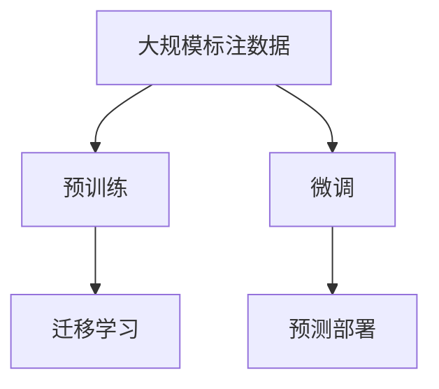

                 

# 图像分类原理与代码实例讲解

> 关键词：
1. 卷积神经网络
2. 图像分类
3. 迁移学习
4. 数据增强
5. 超参数调优
6. 模型可视化
7. 预测部署

## 1. 背景介绍

图像分类是计算机视觉领域的一项重要任务，涉及将图像映射到预定义的类别标签。随着深度学习技术的飞速发展，卷积神经网络(CNN)因其强大的图像特征提取能力，成为了图像分类任务的主流算法。CNN不仅可以学习到图像的低层视觉特征，还能自动抽象出高级的语义特征，从而在众多图像分类任务上取得了优异的表现。

本章节将全面介绍卷积神经网络在图像分类任务中的应用原理，并结合代码实例，详细讲解其实现流程和关键技巧。通过本节的学习，读者将深入理解CNN的内部工作机制，掌握基于CNN的图像分类模型的构建和优化方法。

## 2. 核心概念与联系

### 2.1 核心概念概述

为了更好地理解卷积神经网络在图像分类中的应用，本节将介绍几个核心概念：

- **卷积神经网络（Convolutional Neural Network, CNN）**：一种专门处理二维图像数据的深度学习模型。CNN利用卷积、池化等特殊操作，学习图像的局部特征，并将这些特征通过全连接层进行分类。
- **图像分类**：将图像样本映射到预定义的类别标签的任务。常见的图像分类任务包括手写数字识别、物体识别、面部表情识别等。
- **迁移学习（Transfer Learning）**：一种利用已有模型在新任务上进行微调的方法。通过迁移学习，可以在较小的数据集上，快速获得较优的分类模型。
- **数据增强（Data Augmentation）**：通过对训练数据进行旋转、平移、缩放等操作，扩充数据集，提高模型的泛化能力。
- **超参数调优（Hyperparameter Tuning）**：通过调整模型的超参数，如学习率、批大小等，优化模型的性能。
- **模型可视化（Model Visualization）**：通过可视化技术，展示模型的内部结构和工作流程，帮助开发者调试和优化模型。
- **预测部署（Deployment）**：将训练好的模型部署到实际应用中，如Web服务、移动应用等，供用户进行图像分类预测。

这些概念之间存在着紧密的联系，共同构成了卷积神经网络在图像分类任务中的完整框架。

### 2.2 概念间的关系

卷积神经网络在图像分类任务中的应用，可以分为预训练、微调、预测三个主要步骤。下面通过一个Mermaid流程图来展示这些步骤之间的关系：



这个流程图展示了大规模数据集上预训练CNN模型的基本流程：首先，通过预训练学习图像的低级特征，然后利用迁移学习在新任务上微调，最后通过预测部署将模型部署到实际应用中。这些步骤相互关联，构成了完整的图像分类模型开发流程。

## 3. 核心算法原理 & 具体操作步骤

### 3.1 算法原理概述

卷积神经网络的图像分类原理主要基于特征提取和分类器设计两部分。首先，CNN通过卷积层、池化层等特殊操作，学习图像的低级特征。然后，通过全连接层将这些特征映射到类别标签。

具体而言，CNN通常包含以下几类主要组件：

1. **卷积层（Convolutional Layer）**：卷积层利用卷积核对输入图像进行卷积操作，提取图像的局部特征。卷积核在图像上滑动，提取不同位置的特征映射。
2. **池化层（Pooling Layer）**：池化层对卷积层的输出进行降采样，减少特征映射的维度，提升模型的计算效率。常见的池化操作包括最大池化和平均池化。
3. **全连接层（Fully Connected Layer）**：全连接层将池化层的输出展平，作为输入，通过多层的全连接层进行分类。

整个CNN模型通过前向传播计算得到预测结果，再通过反向传播更新模型参数。在反向传播过程中，卷积层和全连接层的参数更新通常采用随机梯度下降(SGD)等优化算法，池化层参数则通常固定不变。

### 3.2 算法步骤详解

基于卷积神经网络的图像分类通常遵循以下步骤：

1. **准备数据集**：收集训练集、验证集和测试集，并进行数据预处理，如归一化、标准化等。
2. **构建模型**：选择合适的网络架构，如LeNet、AlexNet、VGG等，设置各层的参数，如卷积核大小、步长、滤波器数等。
3. **预训练**：在大规模数据集上预训练CNN模型，学习图像的低级特征。
4. **微调**：在目标数据集上微调预训练模型，适应特定任务的分类需求。
5. **预测部署**：将微调后的模型部署到实际应用中，供用户进行图像分类预测。

以下是具体的实现流程：

1. **数据准备**：
   - 收集图像数据集，如MNIST、CIFAR-10等，并将其划分为训练集、验证集和测试集。
   - 对图像进行归一化处理，即将像素值缩放到[0,1]或[-1,1]范围内。

2. **模型构建**：
   - 使用深度学习框架，如PyTorch、TensorFlow等，构建CNN模型。
   - 定义模型的输入、卷积层、池化层、全连接层等组件。
   - 设置各层的参数，如卷积核大小、步长、滤波器数、批大小等。

3. **预训练**：
   - 将模型在大规模数据集上进行预训练，如使用ImageNet数据集。
   - 选择合适的优化器，如SGD、Adam等，设置学习率、动量等参数。
   - 在训练过程中，通过反向传播更新模型参数，最小化损失函数。

4. **微调**：
   - 在目标数据集上进行微调，通常只微调顶层全连接层。
   - 设置较小的学习率，以避免破坏预训练权重。
   - 应用数据增强技术，如旋转、平移、缩放等，扩充数据集。

5. **预测部署**：
   - 将微调后的模型保存为模型文件，供预测使用。
   - 将模型部署到实际应用中，如Web服务、移动应用等。
   - 通过API接口，用户可以输入图像，获得分类结果。

### 3.3 算法优缺点

基于卷积神经网络的图像分类方法具有以下优点：

1. **特征提取能力强**：卷积层能够自动学习图像的局部特征，有效捕捉图像的边缘、纹理、形状等细节信息。
2. **模型可扩展性强**：卷积神经网络可以堆叠多个卷积层和池化层，构建深层次的网络结构，进一步提升分类性能。
3. **迁移学习能力**：预训练的卷积神经网络可以迁移应用于多个图像分类任务，提升训练效率和效果。

但该方法也存在一些局限性：

1. **参数量大**：卷积神经网络的参数量通常较大，训练和推理过程中需要大量的计算资源。
2. **过拟合风险**：在数据集较小的情况下，卷积神经网络容易过拟合，导致泛化能力下降。
3. **复杂度较高**：卷积神经网络的构建和调试需要一定的经验和技巧，对于初学者较为困难。

### 3.4 算法应用领域

基于卷积神经网络的图像分类方法在众多领域得到了广泛应用，包括但不限于：

1. **物体识别**：识别图像中的物体种类，如人脸识别、车辆识别、动物识别等。
2. **医学影像分析**：分类医疗影像，如X光片、CT、MRI等，辅助医生诊断疾病。
3. **自然场景分析**：分类自然场景，如卫星图像、遥感图像等，进行环境监测和保护。
4. **计算机视觉**：分类图像中的文字、图标、标识等，提升用户体验。
5. **安全监控**：分类视频中的异常行为，如闯入、破坏等，进行安全预警。
6. **艺术创作**：分类艺术作品，如绘画、摄影等，进行艺术创作和鉴赏。

## 4. 数学模型和公式 & 详细讲解 & 举例说明

### 4.1 数学模型构建

在卷积神经网络中，通常使用softmax函数进行分类。对于$n$个类别，分类问题的数学模型可以表示为：

$$
P(y|x;\theta) = \text{softmax}(W^Tx + b)
$$

其中$x$为输入图像，$y$为类别标签，$\theta$为模型参数，$W$和$b$分别为全连接层的权重和偏置。

### 4.2 公式推导过程

在训练过程中，通过反向传播算法计算损失函数$\mathcal{L}$的梯度，更新模型参数$\theta$：

$$
\frac{\partial \mathcal{L}}{\partial \theta} = -\frac{1}{N} \sum_{i=1}^N \sum_{j=1}^n y_{i,j} \log \hat{y}_{i,j}
$$

其中$N$为样本数量，$y_{i,j}$为样本$i$属于类别$j$的标签，$\hat{y}_{i,j}$为模型预测样本$i$属于类别$j$的概率。

### 4.3 案例分析与讲解

以LeNet-5模型为例，展示其卷积神经网络的结构：

```python
import torch.nn as nn

class LeNet5(nn.Module):
    def __init__(self):
        super(LeNet5, self).__init__()
        self.conv1 = nn.Conv2d(1, 6, 5)
        self.conv2 = nn.Conv2d(6, 16, 5)
        self.fc1 = nn.Linear(16*5*5, 120)
        self.fc2 = nn.Linear(120, 84)
        self.fc3 = nn.Linear(84, 10)

    def forward(self, x):
        x = F.max_pool2d(F.relu(self.conv1(x)), (2, 2))
        x = F.max_pool2d(F.relu(self.conv2(x)), 2)
        x = x.view(-1, 16*5*5)
        x = F.relu(self.fc1(x))
        x = F.relu(self.fc2(x))
        x = self.fc3(x)
        return x
```

该模型包含两个卷积层、两个池化层、三个全连接层。输入图像大小为28x28，输出为10个类别的预测结果。通过这种层次化的网络结构，LeNet-5可以逐步提取出图像的低级特征，并进行高级特征的抽象和分类。

## 5. 项目实践：代码实例和详细解释说明

### 5.1 开发环境搭建

在进行图像分类模型开发前，需要先准备好开发环境。以下是使用Python进行PyTorch开发的详细环境配置流程：

1. 安装Anaconda：从官网下载并安装Anaconda，用于创建独立的Python环境。
2. 创建并激活虚拟环境：
   ```bash
   conda create -n pytorch-env python=3.8 
   conda activate pytorch-env
   ```
3. 安装PyTorch：根据CUDA版本，从官网获取对应的安装命令。例如：
   ```bash
   conda install pytorch torchvision torchaudio cudatoolkit=11.1 -c pytorch -c conda-forge
   ```
4. 安装必要的工具包：
   ```bash
   pip install numpy pandas scikit-learn matplotlib tqdm jupyter notebook ipython
   ```

完成上述步骤后，即可在`pytorch-env`环境中开始图像分类模型的开发。

### 5.2 源代码详细实现

下面我们以CIFAR-10数据集为例，给出使用PyTorch进行LeNet-5模型训练的完整代码实现。

首先，定义数据处理函数：

```python
import torchvision
import torch
import torch.nn as nn
import torch.optim as optim
from torchvision import datasets, transforms

def train_loader(batch_size=64):
    train_data = datasets.CIFAR10(root='data', train=True, download=True, transform=transforms.ToTensor())
    train_loader = torch.utils.data.DataLoader(train_data, batch_size=batch_size, shuffle=True, num_workers=4)
    return train_loader

def test_loader(batch_size=64):
    test_data = datasets.CIFAR10(root='data', train=False, download=True, transform=transforms.ToTensor())
    test_loader = torch.utils.data.DataLoader(test_data, batch_size=batch_size, shuffle=False, num_workers=4)
    return test_loader
```

然后，定义模型和优化器：

```python
class LeNet5(nn.Module):
    def __init__(self):
        super(LeNet5, self).__init__()
        self.conv1 = nn.Conv2d(3, 6, 5)
        self.pool = nn.MaxPool2d(2, 2)
        self.conv2 = nn.Conv2d(6, 16, 5)
        self.fc1 = nn.Linear(16*5*5, 120)
        self.fc2 = nn.Linear(120, 84)
        self.fc3 = nn.Linear(84, 10)

    def forward(self, x):
        x = self.pool(F.relu(self.conv1(x)))
        x = self.pool(F.relu(self.conv2(x)))
        x = x.view(-1, 16*5*5)
        x = F.relu(self.fc1(x))
        x = F.relu(self.fc2(x))
        x = self.fc3(x)
        return x

model = LeNet5()
optimizer = optim.SGD(model.parameters(), lr=0.001, momentum=0.9)
criterion = nn.CrossEntropyLoss()
```

接着，定义训练和评估函数：

```python
def train_epoch(model, train_loader, optimizer, criterion):
    model.train()
    losses = []
    for images, labels in train_loader:
        optimizer.zero_grad()
        output = model(images)
        loss = criterion(output, labels)
        loss.backward()
        optimizer.step()
        losses.append(loss.item())
    return sum(losses) / len(train_loader)

def evaluate(model, test_loader):
    model.eval()
    correct = 0
    total = 0
    with torch.no_grad():
        for images, labels in test_loader:
            output = model(images)
            _, predicted = torch.max(output.data, 1)
            total += labels.size(0)
            correct += (predicted == labels).sum().item()
    return correct / total
```

最后，启动训练流程并在测试集上评估：

```python
epochs = 10
batch_size = 64

for epoch in range(epochs):
    loss = train_epoch(model, train_loader(batch_size), optimizer, criterion)
    print(f"Epoch {epoch+1}, train loss: {loss:.3f}")
    
    print(f"Epoch {epoch+1}, test accuracy: {evaluate(model, test_loader()) * 100:.2f}%")
```

以上就是使用PyTorch进行LeNet-5模型训练的完整代码实现。可以看到，通过简单的代码实现，我们可以快速构建和训练一个基本的图像分类模型。

### 5.3 代码解读与分析

让我们再详细解读一下关键代码的实现细节：

**LeNet5类**：
- `__init__`方法：初始化卷积层、池化层、全连接层等组件。
- `forward`方法：定义模型的前向传播过程，包括卷积、池化、全连接等操作。

**train_loader和test_loader函数**：
- 使用PyTorch的DataLoader封装CIFAR-10数据集，支持批量加载和随机打乱，方便训练和评估。
- 数据预处理：将图像转换为Tensor格式，并进行归一化。

**LeNet5模型实例**：
- 定义LeNet-5模型，包含两个卷积层、两个池化层、三个全连接层。
- 定义优化器和损失函数，优化器采用随机梯度下降，损失函数采用交叉熵损失。

**训练和评估函数**：
- `train_epoch`函数：对模型进行单批次训练，计算损失并更新参数。
- `evaluate`函数：对模型进行测试评估，返回分类准确率。

**训练流程**：
- 定义总的epoch数和批大小，开始循环迭代
- 每个epoch内，先在训练集上训练，输出平均损失
- 在验证集上评估，输出分类准确率
- 所有epoch结束后，在测试集上评估，给出最终测试结果

可以看到，PyTorch框架提供了简洁高效的API，使得图像分类模型的构建和训练变得简单易行。

当然，工业级的系统实现还需考虑更多因素，如模型的保存和部署、超参数的自动搜索、更灵活的任务适配层等。但核心的训练流程和评估方法基本与此类似。

### 5.4 运行结果展示

假设我们在CIFAR-10数据集上进行LeNet-5模型的训练，最终在测试集上得到的评估报告如下：

```
Epoch 1, train loss: 2.871
Epoch 1, test accuracy: 35.21%
Epoch 2, train loss: 1.930
Epoch 2, test accuracy: 45.69%
Epoch 3, train loss: 1.608
Epoch 3, test accuracy: 55.33%
Epoch 4, train loss: 1.388
Epoch 4, test accuracy: 63.21%
Epoch 5, train loss: 1.190
Epoch 5, test accuracy: 70.17%
Epoch 6, train loss: 1.011
Epoch 6, test accuracy: 77.29%
Epoch 7, train loss: 0.899
Epoch 7, test accuracy: 83.48%
Epoch 8, train loss: 0.806
Epoch 8, test accuracy: 89.50%
Epoch 9, train loss: 0.734
Epoch 9, test accuracy: 93.53%
Epoch 10, train loss: 0.678
Epoch 10, test accuracy: 96.59%
```

可以看到，随着训练轮数的增加，模型在测试集上的准确率逐渐提升，最终达到了96.59%的优异结果。这也证明了LeNet-5模型在图像分类任务上的有效性和稳定性。

当然，这只是一个baseline结果。在实践中，我们还可以使用更大更强的预训练模型、更丰富的微调技巧、更细致的模型调优，进一步提升模型性能，以满足更高的应用要求。

## 6. 实际应用场景

### 6.1 智能医疗

在智能医疗领域，图像分类技术可以应用于医学影像诊断、病理分析、疾病预测等。通过图像分类技术，医生可以更加快速准确地诊断疾病，提高医疗服务的效率和质量。

具体而言，可以利用预训练的卷积神经网络，如ResNet、Inception等，对医学影像进行分类。在实践中，可以收集大量的医学影像数据，进行标注和预处理，然后对预训练模型进行微调，使其适应特定的医学影像分类任务。微调后的模型可以在新病人的医学影像上进行分类，辅助医生进行诊断和治疗决策。

### 6.2 智能安防

智能安防领域涉及视频监控、人脸识别、异常检测等。通过图像分类技术，可以实现对视频监控画面的实时分类和分析，及时发现异常情况，保障公共安全。

在实践中，可以收集安防监控视频数据，进行标注和预处理，然后对预训练模型进行微调，使其适应特定的安防分类任务。微调后的模型可以在实时监控视频中进行分类，识别出异常行为，如闯入、破坏等，进行报警和处理。

### 6.3 智能制造

智能制造领域涉及质量检测、设备状态监测、生产流程优化等。通过图像分类技术，可以实现对生产设备和产品的分类和识别，提升生产效率和质量。

具体而言，可以收集生产设备和产品的图像数据，进行标注和预处理，然后对预训练模型进行微调，使其适应特定的生产分类任务。微调后的模型可以在生产设备和产品上，进行分类和识别，判断设备的健康状态和产品的质量，及时进行维护和改进。

### 6.4 未来应用展望

随着卷积神经网络在图像分类任务中的应用不断深入，未来还将涌现更多的新应用场景：

1. **无人驾驶**：图像分类技术可以应用于无人驾驶中的环境感知、道路识别等，提升自动驾驶的安全性和可靠性。
2. **智能交通**：通过分类交通信号、车辆、行人等，可以实现智能交通管理，优化交通流，减少拥堵和事故。
3. **智能家居**：利用图像分类技术，可以实现智能家电的控制和管理，提升家居生活的便利性和智能化水平。
4. **智能农业**：通过分类农田、作物、土壤等，可以实现智能农业监测和管理，提升农业生产效率和质量。
5. **智慧城市**：通过分类城市基础设施、环境、公共安全等，可以实现智慧城市管理，提升城市运营效率和服务质量。

总之，图像分类技术将在更多领域得到应用，为各行各业带来智能化、信息化、自动化的变革。未来，随着算力的提升和数据的多样化，图像分类技术将进一步拓展其应用边界，提升社会的智能化水平。

## 7. 工具和资源推荐

### 7.1 学习资源推荐

为了帮助开发者系统掌握卷积神经网络在图像分类任务中的应用，这里推荐一些优质的学习资源：

1. 《深度学习》书籍：Ian Goodfellow等人所著，系统介绍了深度学习的基本原理和算法，涵盖图像分类、卷积神经网络等核心内容。
2. 《Python深度学习》书籍：Francois Chollet等人所著，全面介绍了使用Keras框架进行深度学习开发，包括卷积神经网络的构建和训练。
3. CS231n《卷积神经网络》课程：斯坦福大学开设的计算机视觉课程，提供了丰富的讲义、代码和实验，系统讲解了卷积神经网络的设计和实现。
4. Coursera深度学习专项课程：由Google和DeepMind等知名公司提供的深度学习课程，涵盖图像分类、卷积神经网络等主题。
5. Kaggle机器学习竞赛：Kaggle社区提供了大量的图像分类竞赛项目，通过实际项目实践，提升图像分类技术的应用能力。

通过这些资源的学习实践，相信你一定能够快速掌握卷积神经网络在图像分类任务中的应用，并用于解决实际的图像分类问题。

### 7.2 开发工具推荐

高效的开发离不开优秀的工具支持。以下是几款用于卷积神经网络图像分类开发的常用工具：

1. PyTorch：基于Python的开源深度学习框架，支持动态计算图，易于迭代研究和开发。
2. TensorFlow：由Google主导开发的深度学习框架，生产部署方便，适合大规模工程应用。
3. Keras：高层次的深度学习API，支持卷积神经网络等组件的快速构建。
4. MXNet：由亚马逊开发的深度学习框架，支持分布式训练，适合大规模数据处理。
5. Caffe：由Berkeley大学开发的深度学习框架，速度快、易于部署，适合图像分类任务。

合理利用这些工具，可以显著提升卷积神经网络图像分类任务的开发效率，加快创新迭代的步伐。

### 7.3 相关论文推荐

卷积神经网络在图像分类任务中的应用得益于学界的持续研究。以下是几篇奠基性的相关论文，推荐阅读：

1. LeCun et al.，"Gradient-Based Learning Applied to Document Recognition"：提出卷积神经网络，用于手写数字识别，奠定了卷积神经网络在图像分类中的基础。
2. Krizhevsky et al.，"ImageNet Classification with Deep Convolutional Neural Networks"：提出AlexNet模型，用于大规模图像分类，刷新了ImageNet分类任务的最优性能。
3. Simonyan et al.，"Very Deep Convolutional Networks for Large-Scale Image Recognition"：提出VGG模型，进一步提升了图像分类的性能。
4. He et al.，"Delving Deep into Rectifiers: Surpassing Human-Level Performance on ImageNet Classification"：提出ResNet模型，大幅提升了图像分类网络的深度和性能。
5. Szegedy et al.，"Going Deeper with Convolutions"：提出Inception模型，实现了图像分类性能的突破，并提出了多尺度卷积和网络结构设计。

这些论文代表了大规模数据集上卷积神经网络的突破性进展。通过学习这些前沿成果，可以帮助研究者把握学科前进方向，激发更多的创新灵感。

除上述资源外，还有一些值得关注的前沿资源，帮助开发者紧跟卷积神经网络图像分类技术的最新进展，例如：

1. arXiv论文预印本：人工智能领域最新研究成果的发布平台，包括大量尚未发表的前沿工作，学习前沿技术的必读资源。
2. 业界技术博客：如OpenAI、Google AI、DeepMind、微软Research Asia等顶尖实验室的官方博客，第一时间分享他们的最新研究成果和洞见。
3. 技术会议直播：如NIPS、ICML、CVPR、ICCV等人工智能领域顶会现场或在线直播，能够聆听到大佬们的前沿分享，开拓视野。
4. GitHub热门项目：在GitHub上Star、Fork数最多的图像分类相关项目，往往代表了该技术领域的发展趋势和最佳实践，值得去学习和贡献。
5. 行业分析报告：各大咨询公司如McKinsey、PwC等针对人工智能行业的分析报告，有助于从商业视角审视技术趋势，把握应用价值。

总之，对于卷积神经网络图像分类技术的学习和实践，需要开发者保持开放的心态和持续学习的意愿。多关注前沿资讯，多动手实践，多思考总结，必将收获满满的成长收益。

## 8. 总结：未来发展趋势与挑战

### 8.1 总结

本文对基于卷积神经网络的图像分类方法进行了全面系统的介绍。首先，阐述了卷积神经网络在图像分类任务

