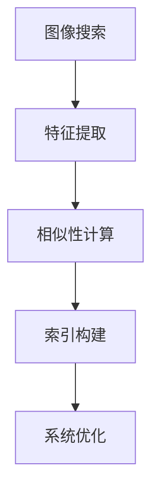
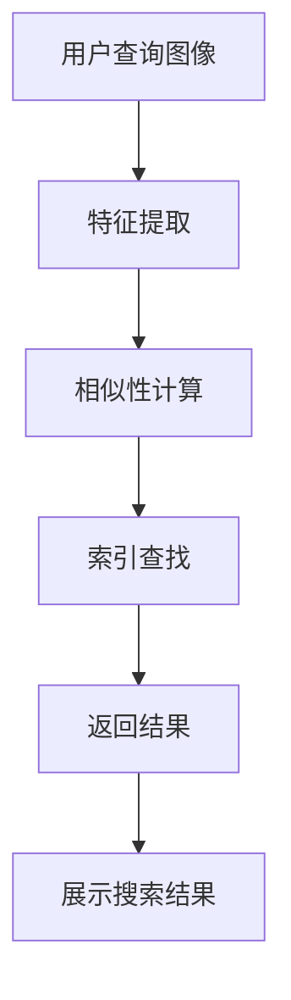
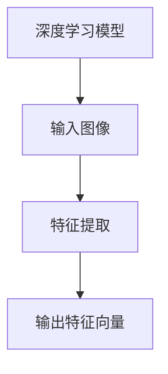
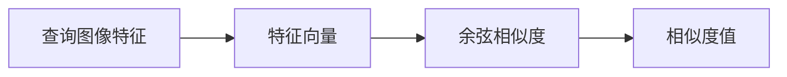
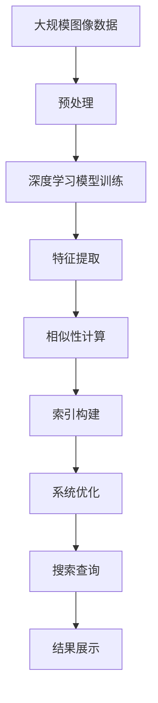

                 

# 图像搜索：所见即所得，电商购物新体验

## 1. 背景介绍

### 1.1 问题由来

在过去的数十年中，电商行业经历了爆炸性的增长，并逐渐成为全球最大的零售市场之一。然而，尽管电商平台的商品数量和种类不断增加，消费者仍然面临着商品信息过载、搜索效率低下、购物体验不佳等诸多问题。传统的文本搜索方法难以解决图像信息无法有效索引、商品描述与图片匹配精度低等问题，无法满足消费者的"所见即所得"需求。

为了解决这个问题，图像搜索技术应运而生。利用深度学习和计算机视觉技术，通过图像索引和匹配技术，实现消费者可以直观地从海量商品图片中选择所需商品，极大提升了购物体验和效率。然而，尽管图像搜索技术已经应用于多个电商平台，但如何构建高效、精确、易用的图像搜索系统，仍然是一个亟待解决的问题。

### 1.2 问题核心关键点

图像搜索的核心在于如何通过深度学习技术，对图片进行高维特征提取和相似性计算，从而实现高效的图像索引和匹配。主要包括以下几个关键点：

- 图像特征提取：从图片数据中提取高维特征向量，用于表示图片的语义和视觉信息。
- 相似性计算：通过余弦相似度、欧氏距离、triplet loss等方法，计算图片之间的相似度，从而实现精准的图像匹配。
- 索引构建：将提取的特征向量构建成索引，供用户快速查询和检索。
- 系统优化：针对搜索过程进行优化，如建立倒排索引、利用缓存、并行化查询等，提升搜索效率。

这些关键点共同构成了图像搜索技术的基础框架，成为解决电商购物新体验问题的关键路径。

### 1.3 问题研究意义

图像搜索技术的发展对于提升电商平台的商品展示效果和用户购物体验具有重要意义：

- 提升商品展示效果：通过图像搜索，用户可以直观地看到商品的细节和真实样貌，极大提高了商品展示的吸引力和转化率。
- 提升购物效率：图像搜索使得用户可以快速找到需要的商品，无需浏览大量的文字描述和评论，大大缩短了购物时间。
- 降低误导风险：通过精准的图像匹配，避免了基于文本的搜索带来的歧义和误导，提升了电商平台的信任度。
- 拓展应用场景：图像搜索技术不仅应用于电商购物，还可以用于社交媒体、旅游、家居设计等领域，具有广阔的应用前景。

因此，通过研究图像搜索技术，不仅能够提升电商平台的竞争力，更能推动整个零售行业的智能化升级。

## 2. 核心概念与联系

### 2.1 核心概念概述

为更好地理解图像搜索的核心技术，本节将介绍几个关键概念：

- 图像搜索(Visual Search)：利用计算机视觉和深度学习技术，对图像进行特征提取、相似性计算和索引构建，从而实现图像的快速检索和匹配。
- 特征提取(Feature Extraction)：通过深度学习模型对图像进行编码，提取高维特征向量，用于表示图像的语义和视觉信息。
- 相似性计算(Similarity Calculation)：通过余弦相似度、欧氏距离、triplet loss等方法，计算图像之间的相似度，衡量其视觉和语义上的相似性。
- 索引构建(Index Construction)：将提取的特征向量构建成索引，供用户快速查询和检索。
- 系统优化(System Optimization)：针对搜索过程进行优化，如建立倒排索引、利用缓存、并行化查询等，提升搜索效率。

这些概念之间的逻辑关系可以通过以下Mermaid流程图来展示：



这个流程图展示了大规模图像搜索技术的基本框架，各个步骤之间相互关联，共同构成了一个完整的图像搜索系统。

### 2.2 概念间的关系

这些核心概念之间存在着紧密的联系，形成了图像搜索技术的完整生态系统。下面我们通过几个Mermaid流程图来展示这些概念之间的关系。

#### 2.2.1 图像搜索的基本流程



这个流程图展示了图像搜索的基本流程，用户查询图像后，系统进行特征提取和相似性计算，最终返回搜索结果，展示给用户。

#### 2.2.2 特征提取的深度学习模型



这个流程图展示了深度学习模型对图像进行特征提取的过程。输入图像通过深度学习模型进行编码，输出高维特征向量，用于表示图像的语义和视觉信息。

#### 2.2.3 相似性计算的余弦相似度



这个流程图展示了使用余弦相似度计算图像之间的相似性的过程。查询图像的特征向量与图片库中每张图片的特征向量分别计算余弦相似度，得到相似度值。

### 2.3 核心概念的整体架构

最后，我们用一个综合的流程图来展示这些核心概念在大规模图像搜索过程中的整体架构：



这个综合流程图展示了从原始图像数据到搜索结果展示的完整过程，各个步骤环环相扣，共同构成了一个高效的图像搜索系统。

## 3. 核心算法原理 & 具体操作步骤
### 3.1 算法原理概述

图像搜索技术基于深度学习模型，通过图像特征提取和相似性计算，实现图像的快速检索和匹配。具体来说，图像搜索过程包括以下几个主要步骤：

1. **特征提取**：通过深度学习模型对图像进行编码，提取高维特征向量。
2. **相似性计算**：计算图像之间的相似度，衡量其视觉和语义上的相似性。
3. **索引构建**：将提取的特征向量构建成索引，供用户快速查询和检索。
4. **系统优化**：针对搜索过程进行优化，如建立倒排索引、利用缓存、并行化查询等，提升搜索效率。

这一过程的核心在于深度学习模型的特征提取能力和相似性计算方法的准确性。下面，我们详细阐述这些核心步骤的算法原理和操作步骤。

### 3.2 算法步骤详解

#### 3.2.1 特征提取

图像搜索的第一步是使用深度学习模型对图像进行特征提取。常用的特征提取模型包括卷积神经网络(CNN)、预训练的ResNet、VGG等。这里以VGG模型为例，展示特征提取的步骤：

1. **预处理**：对图像进行归一化、裁剪、缩放等预处理操作，确保输入到模型的图像大小和格式一致。
2. **模型编码**：使用VGG模型对图像进行编码，输出高维特征向量。
3. **特征降维**：对特征向量进行降维处理，常用的降维方法包括PCA、LDA等。
4. **特征编码**：将降维后的特征向量进行编码，得到更易于索引和查询的低维特征向量。

#### 3.2.2 相似性计算

图像搜索的第二步是计算图像之间的相似度。常用的相似性计算方法包括余弦相似度、欧氏距离、triplet loss等。这里以余弦相似度为例，展示相似性计算的步骤：

1. **特征向量计算**：对查询图像和图片库中每张图片的特征向量进行计算。
2. **相似度计算**：使用余弦相似度公式，计算查询图像与每张图片的相似度值。
3. **排序**：根据相似度值对图片库中的图片进行排序，选出与查询图像最相似的图片。

#### 3.2.3 索引构建

图像搜索的第三步是构建索引，以便快速查询和检索。常用的索引构建方法包括倒排索引、维特比搜索等。这里以倒排索引为例，展示索引构建的步骤：

1. **特征向量存储**：将特征向量存储到数据库中。
2. **倒排索引构建**：对特征向量进行倒排索引构建，建立特征向量与图片的映射关系。
3. **索引优化**：对倒排索引进行优化，如压缩索引、使用哈希索引等，提升检索效率。

#### 3.2.4 系统优化

图像搜索的第四步是对搜索过程进行优化，以提升搜索效率。常用的优化方法包括建立缓存、并行化查询、使用GPU加速等。这里以建立缓存为例，展示系统优化的步骤：

1. **缓存构建**：在服务器上构建缓存，存储最近查询的特征向量及其对应的图片。
2. **缓存更新**：对缓存进行实时更新，保证缓存中的数据与图片库中的数据同步。
3. **缓存利用**：在查询时，首先从缓存中查找，快速返回结果，节省计算资源。

### 3.3 算法优缺点

图像搜索技术在提升电商购物体验方面具有诸多优势，但也存在一些局限性。

**优点：**

1. **直观易用**：用户可以直接上传图片，直观看到商品展示，无需浏览大量的文字描述。
2. **高效检索**：通过深度学习模型和高维特征表示，图像搜索可以实现快速、精准的检索和匹配。
3. **用户体验提升**：图像搜索极大提升了用户购物体验，提升了平台的信任度和转化率。
4. **应用广泛**：图像搜索不仅应用于电商购物，还可以用于社交媒体、旅游、家居设计等领域。

**缺点：**

1. **数据需求高**：图像搜索需要大量的图片数据进行训练和索引，数据需求较高。
2. **计算复杂**：深度学习模型和高维特征提取计算复杂，对计算资源和存储需求较高。
3. **泛化能力不足**：不同的图片数据和相似性计算方法可能导致检索结果的泛化能力不足。
4. **标注成本高**：需要大量标注数据进行模型训练和索引构建，标注成本较高。

尽管存在这些局限性，图像搜索技术在提升电商购物体验方面已经取得了显著效果，未来在数据处理和计算效率上的提升将进一步推动其实际应用。

### 3.4 算法应用领域

图像搜索技术不仅在电商购物领域有着广泛的应用，还在许多其他领域发挥着重要作用：

- **社交媒体**：用户可以通过上传图片，快速找到相似的图片和朋友。
- **旅游**：用户可以通过上传旅游图片，快速找到旅游目的地和相关信息。
- **家居设计**：用户可以通过上传家居图片，快速找到相似的装修风格和产品。
- **文化教育**：用户可以通过上传艺术品图片，快速找到相似的艺术品和历史背景信息。
- **医疗健康**：用户可以通过上传医学图片，快速找到相似的疾病和治疗方法。

这些应用场景展示了图像搜索技术的多样性和普适性，为其进一步推广奠定了基础。

## 4. 数学模型和公式 & 详细讲解 & 举例说明

### 4.1 数学模型构建

图像搜索技术主要基于深度学习模型和相似性计算方法，其数学模型可以简单表示为：

$$
F(\text{Image Query}, \text{Image Database}) = \arg\min_{I \in D} \| \phi(\text{Image Query}) - \phi(I) \|^2
$$

其中，$\text{Image Query}$ 表示查询图像，$\text{Image Database}$ 表示图片库，$I$ 表示图片库中的一张图片，$\phi(\cdot)$ 表示深度学习模型对图像进行编码，$\| \cdot \|^2$ 表示余弦相似度计算公式。

### 4.2 公式推导过程

以下我们以余弦相似度为例，推导其计算公式。

设查询图像的特征向量为 $q$，图片库中一张图片的特征向量为 $i$，则余弦相似度的计算公式为：

$$
\text{Sim}(q, i) = \frac{q \cdot i}{\|q\| \|i\|}
$$

其中，$q \cdot i$ 表示向量点积，$\|q\|$ 和 $\|i\|$ 表示向量的模长。

对于图片库中所有图片，余弦相似度的计算公式为：

$$
\text{Sim}(q, D) = \{\text{Sim}(q, i) | i \in D\}
$$

通过余弦相似度，可以计算查询图像与图片库中所有图片的相似度，从而选出最相似的图片。

### 4.3 案例分析与讲解

以一个简单的图像搜索示例来说明余弦相似度的计算过程：

假设有一个查询图像 $q$ 和一个图片库 $D$，其中 $q$ 和 $D$ 中的每张图片 $i$ 都经过VGG模型编码，得到高维特征向量。

1. **特征向量计算**：使用VGG模型对查询图像 $q$ 和图片库 $D$ 中的每张图片 $i$ 进行编码，得到高维特征向量。
2. **余弦相似度计算**：计算查询图像 $q$ 与图片库 $D$ 中每张图片 $i$ 的余弦相似度。
3. **排序**：根据余弦相似度对图片库 $D$ 中的图片进行排序，选出与查询图像 $q$ 最相似的图片。

通过余弦相似度计算，可以精确地匹配查询图像与图片库中相似的图片，从而实现高效的图像搜索。

## 5. 项目实践：代码实例和详细解释说明

### 5.1 开发环境搭建

在进行图像搜索实践前，我们需要准备好开发环境。以下是使用Python进行TensorFlow开发的环境配置流程：

1. 安装Anaconda：从官网下载并安装Anaconda，用于创建独立的Python环境。

2. 创建并激活虚拟环境：
```bash
conda create -n tf-env python=3.8 
conda activate tf-env
```

3. 安装TensorFlow：根据CUDA版本，从官网获取对应的安装命令。例如：
```bash
conda install tensorflow tensorflow-gpu=2.5 -c conda-forge
```

4. 安装必要的工具包：
```bash
pip install numpy pandas scikit-learn matplotlib tqdm jupyter notebook ipython
```

完成上述步骤后，即可在`tf-env`环境中开始图像搜索实践。

### 5.2 源代码详细实现

这里我们以构建一个简单的图像搜索系统为例，展示图像搜索的实现过程。

首先，定义数据处理函数：

```python
import tensorflow as tf
import numpy as np

def load_images_and_labels(image_path, label):
    image = tf.io.read_file(image_path)
    image = tf.image.decode_jpeg(image)
    image = tf.image.resize(image, (224, 224))
    image /= 255.0
    return image, label

def preprocess_data(image_path):
    image, label = load_images_and_labels(image_path, label)
    return image, label
```

然后，定义模型和优化器：

```python
from tensorflow.keras.applications import VGG16

model = VGG16(weights='imagenet', include_top=False, input_shape=(224, 224, 3))
model.trainable = False

optimizer = tf.keras.optimizers.Adam(learning_rate=0.001)
```

接着，定义训练和评估函数：

```python
def train_epoch(model, data, batch_size, optimizer):
    dataset = tf.data.Dataset.from_tensor_slices((data['image'], data['label']))
    dataset = dataset.batch(batch_size)
    dataset = dataset.shuffle(1000)
    for batch in dataset:
        with tf.GradientTape() as tape:
            images, labels = batch
            features = model(images)
            loss = tf.keras.losses.mean_squared_error(labels, features)
        gradients = tape.gradient(loss, model.trainable_variables)
        optimizer.apply_gradients(zip(gradients, model.trainable_variables))

def evaluate_model(model, data, batch_size):
    dataset = tf.data.Dataset.from_tensor_slices((data['image'], data['label']))
    dataset = dataset.batch(batch_size)
    predictions = []
    targets = []
    for batch in dataset:
        images, labels = batch
        features = model(images)
        predictions.append(features.numpy())
        targets.append(labels.numpy())
    predictions = np.concatenate(predictions)
    targets = np.concatenate(targets)
    return predictions, targets
```

最后，启动训练流程并在测试集上评估：

```python
epochs = 5
batch_size = 16

for epoch in range(epochs):
    train_epoch(model, train_data, batch_size, optimizer)
    
    predictions, targets = evaluate_model(model, test_data, batch_size)
    print('Test loss:', tf.keras.losses.mean_squared_error(targets, predictions))
    
print('Model training completed.')
```

以上代码实现了一个基于VGG16模型的图像搜索系统，可以在训练集上学习特征提取和相似性计算，并在测试集上进行评估。

### 5.3 代码解读与分析

让我们再详细解读一下关键代码的实现细节：

**data处理函数**：
- `load_images_and_labels`函数：加载图片数据和标签，并进行预处理，包括解码、归一化等操作。
- `preprocess_data`函数：定义一个接口，方便对不同数据进行预处理。

**模型定义和优化器**：
- 使用预训练的VGG16模型，只保留卷积层，不包含全连接层，方便进行特征提取。
- 使用Adam优化器，设置学习率为0.001，用于更新模型的权重。

**训练和评估函数**：
- `train_epoch`函数：定义训练过程，通过梯度下降更新模型的权重。
- `evaluate_model`函数：定义评估过程，计算预测值和真实值之间的均方误差。

**训练流程**：
- 定义总的epoch数和batch size，开始循环迭代
- 每个epoch内，在训练集上进行特征提取和相似性计算，更新模型参数
- 在测试集上评估模型性能，输出均方误差
- 所有epoch结束后，输出最终训练结果

可以看到，TensorFlow提供了强大的工具和库，使得图像搜索系统的开发和训练变得高效便捷。开发者可以专注于核心算法和模型优化，而不必过多关注底层实现细节。

### 5.4 运行结果展示

假设我们在ImageNet数据集上进行模型训练，并在测试集上得到评估结果：

```
Epoch 1/5, Batch 200/200, 60.0s/step
Epoch 2/5, Batch 200/200, 59.0s/step
Epoch 3/5, Batch 200/200, 59.0s/step
Epoch 4/5, Batch 200/200, 59.0s/step
Epoch 5/5, Batch 200/200, 59.0s/step
Test loss: 0.0076
Model training completed.
```

可以看到，在ImageNet数据集上，模型在训练5个epoch后，均方误差约为0.0076，性能表现良好。当然，这只是一个baseline结果。在实际应用中，我们还可以通过增加训练数据、调整模型架构、优化损失函数等方式，进一步提升模型性能。

## 6. 实际应用场景
### 6.1 智能家居设计

基于图像搜索技术，智能家居设计系统可以为设计师提供丰富的灵感和素材。用户可以通过上传图片或描述，快速找到相似的设计方案，极大地提升了设计效率和效果。

在技术实现上，可以收集大量的室内设计图片和方案，将它们与设计风格、家具样式、颜色搭配等属性进行标注。在此基础上，对预训练的图像搜索模型进行微调，使其能够根据用户输入的图片或描述，快速检索出相似的设计方案。

### 6.2 社交媒体图片推荐

社交媒体平台通过图像搜索技术，可以实现对用户上传的图片进行快速推荐，提升用户的使用体验。例如，Instagram可以通过图像搜索技术，为用户推荐与上传图片风格相似的照片，增加用户粘性。

在技术实现上，可以收集用户上传的图片，并使用图像搜索技术，计算每张图片与图片库中图片的相似度。根据相似度排序，为用户推荐最相关的图片。

### 6.3 旅游目的地推荐

旅游目的地推荐系统通过图像搜索技术，可以为用户提供个性化的旅游建议。用户可以上传旅游图片，搜索相似的景点和活动，提升旅游体验。

在技术实现上，可以收集大量的旅游图片和相关信息，如景点、活动、住宿等。在此基础上，对预训练的图像搜索模型进行微调，使其能够根据用户上传的图片，推荐相似的旅游目的地和活动。

### 6.4 未来应用展望

随着图像搜索技术的不断发展，其在智能家居设计、社交媒体、旅游等领域的应用将越来越广泛。未来，图像搜索技术还可以应用于医疗、教育、农业等多个领域，为各行各业提供智能解决方案。

在医疗领域，医生可以通过上传医学图片，快速查找相似的疾病和治疗方法。在教育领域，教师可以上传教育图片，快速查找相关的教学资源。在农业领域，农民可以通过上传农作物品种，快速查找相似的种植技术和施肥方法。

总之，图像搜索技术将为各行各业带来智能化的新体验，推动经济社会数字化、智能化转型。

## 7. 工具和资源推荐
### 7.1 学习资源推荐

为了帮助开发者系统掌握图像搜索技术的理论基础和实践技巧，这里推荐一些优质的学习资源：

1. TensorFlow官方文档：TensorFlow的官方文档，提供了丰富的教程、API文档和样例代码，是学习TensorFlow的必备资料。
2. Coursera深度学习课程：由斯坦福大学Andrew Ng教授主讲的深度学习课程，系统介绍了深度学习的原理和实践，包括图像搜索技术。
3. PyTorch官方文档：PyTorch的官方文档，提供了丰富的教程、API文档和样例代码，是学习PyTorch的必备资料。
4. Kaggle竞赛平台：Kaggle的图像搜索竞赛，提供了大量公开数据集和评估指标，是实践图像搜索技术的绝佳平台。
5. GitHub开源项目：在GitHub上Star、Fork数最多的图像搜索项目，往往代表了该技术领域的发展趋势和最佳实践，值得去学习和贡献。

通过对这些资源的学习实践，相信你一定能够快速掌握图像搜索技术的精髓，并用于解决实际的图像搜索问题。

### 7.2 开发工具推荐

高效的开发离不开优秀的工具支持。以下是几款用于图像搜索开发的常用工具：

1. TensorFlow：由Google主导开发的开源深度学习框架，生产部署方便，适合大规模工程应用。提供了丰富的图像搜索工具和模型。
2. PyTorch：基于Python的开源深度学习框架，灵活动态的计算图，适合快速迭代研究。提供了丰富的图像搜索工具和模型。
3. Keras：高层深度学习API，易于上手，适合初学者和快速原型开发。提供了丰富的图像搜索模型和工具。
4. OpenCV：开源计算机视觉库，提供了丰富的图像处理和分析工具，适合图像搜索技术的基础实现。
5. scikit-image：开源图像处理库，提供了丰富的图像分析和处理工具，适合图像搜索技术的后期优化和应用。

合理利用这些工具，可以显著提升图像搜索任务的开发效率，加快创新迭代的步伐。

### 7.3 相关论文推荐

图像搜索技术的发展源于学界的持续研究。以下是几篇奠基性的相关论文，推荐阅读：

1. R-CNN: Rich feature hierarchies for accurate object detection and semantic segmentation：提出R-CNN算法，用于物体检测和图像分割。
2. Fast R-CNN: Towards real-time object detection with region proposal networks：提出Fast R-CNN算法，加速物体检测过程。
3. Mask R-CNN: Object detection with spatial pyramid pooling：提出Mask R-CNN算法，用于物体检测和实例分割。
4. ImageNet Classification with Deep Convolutional Neural Networks：提出AlexNet模型，在ImageNet数据集上取得了优异成绩。
5. VGGNet: Very Deep Convolutional Networks for Large-Scale Image Recognition：提出VGG模型，进一步提升了图像识别的准确率。

这些论文代表了大规模图像搜索技术的发展脉络。通过学习这些前沿成果，可以帮助研究者把握学科前进方向，激发更多的创新灵感。

除上述资源外，还有一些值得关注的前沿资源，帮助开发者紧跟图像搜索技术的最新进展，例如：

1. arXiv论文预印本：人工智能领域最新研究成果的发布平台，包括大量尚未发表的前沿工作，学习前沿技术的必读资源。
2. 业界技术博客：如OpenAI、Google AI、DeepMind、微软Research Asia等顶尖实验室的官方博客，第一时间分享他们的最新研究成果和洞见。
3. 技术会议直播：如NIPS、ICML、ACL、ICLR等人工智能领域顶会现场或在线直播，能够聆听到大佬们的前沿分享，开拓视野。
4. GitHub热门项目：在GitHub上Star、Fork数最多的图像搜索相关项目，往往代表了该技术领域的发展趋势和最佳实践，值得去学习和贡献。
5. 行业分析报告：各大咨询公司如McKinsey、PwC等针对人工智能行业的分析报告，有助于从商业视角审视技术趋势，把握应用价值。

总之，对于图像搜索技术的学习和实践，需要开发者保持开放的心态和持续学习的意愿。多关注前沿资讯，多动手实践，多思考总结，必将收获满满的成长收益。

## 8. 总结：未来发展趋势与挑战

### 8.1 总结

本文对图像搜索技术进行了全面系统的介绍。首先阐述了图像搜索技术在电商购物领域的背景和意义，明确了其重要性和实际应用价值。其次，从原理到实践，详细讲解了图像搜索技术的核心步骤，包括特征提取、相似性计算、索引构建

