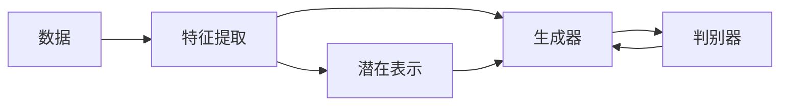

                 

# 图像生成(Image Generation) - 原理与代码实例讲解

> 关键词：生成对抗网络(Generative Adversarial Network, GAN), 变分自编码器(Variational Autoencoder, VAE), 卷积神经网络(Convolutional Neural Network, CNN), 随机向量噪声, 隐变量, 损失函数, 梯度下降, 图像生成器, 判别器, 训练技巧, 例证

## 1. 背景介绍

图像生成技术近年来在计算机视觉领域取得了突飞猛进的发展，已经被应用于艺术创作、虚拟现实、游戏设计等多个领域。基于深度学习的大规模图像生成模型，特别是生成对抗网络（GAN）和变分自编码器（VAE），在生成高质量、多样化的图像方面表现出色。本博客将系统介绍图像生成技术的原理，并通过代码实例详细讲解其实现步骤，旨在帮助读者更好地理解图像生成过程，并掌握其实现技巧。

## 2. 核心概念与联系

### 2.1 核心概念概述

图像生成技术主要涉及以下核心概念：

- **生成对抗网络(GAN)**：由生成器和判别器两个部分组成，通过对抗性训练生成高质量的图像。
- **变分自编码器(VAE)**：通过学习数据的潜在表示，生成连续的图像样本，广泛应用于数据压缩和生成建模。
- **卷积神经网络(CNN)**：用于图像特征提取，是现代图像生成模型的基础架构。
- **随机向量噪声**：在生成过程中引入的随机噪声，用于增加图像多样性。
- **隐变量**：在VAE中，用于编码图像的潜在表示，解码为图像。
- **损失函数**：用于衡量生成图像与真实图像之间的差异。
- **梯度下降**：用于优化生成器和判别器的参数，使得生成图像更加逼真。

### 2.2 概念间的关系

这些核心概念通过对抗训练、变分推断等技术，构建了图像生成技术的核心范式。具体而言：

- GAN通过生成器和判别器的对抗训练，生成逼真的图像，判别器用于评估生成的图像质量。
- VAE通过学习数据的潜在表示，生成连续的图像样本，具有一定的隐变量解释性。
- CNN用于特征提取，在生成和判别过程中起着关键作用。

这些概念之间的相互作用和联系，构成了图像生成技术的完整框架，使得模型能够在生成过程中产生高质量、多样化的图像。

### 2.3 核心概念的整体架构

通过以下Mermaid流程图，我们可以更直观地理解这些概念之间的关系：



这个流程图展示了从数据预处理到生成图像的全过程。数据首先经过特征提取，生成器将特征编码为潜在表示，并生成图像。判别器评估生成图像的质量，生成器则通过对抗训练提高生成图像的逼真度。潜在表示通过VAE得到，具有隐变量的解释性。

## 3. 核心算法原理 & 具体操作步骤

### 3.1 算法原理概述

图像生成技术的核心算法包括GAN和VAE。GAN通过生成器和判别器的对抗训练生成逼真的图像，而VAE通过学习数据的潜在表示生成连续的图像样本。两种算法虽然机制不同，但最终目标都是为了生成高质量、多样化的图像。

GAN的生成器部分通常采用多层的卷积神经网络，判别器部分可以采用全连接网络或卷积网络。在训练过程中，生成器尝试生成能够欺骗判别器的图像，而判别器则努力区分真实图像和生成图像。通过这样的对抗训练，生成器逐渐生成高质量、逼真的图像。

VAE的生成部分同样采用卷积神经网络，通过编码器将输入图像转换为潜在表示，解码器将潜在表示解码为图像。编码器和解码器之间的损失函数通常是重构误差和潜在表示的分布误差。通过优化重构误差和潜在表示的分布误差，VAE能够生成连续的图像样本。

### 3.2 算法步骤详解

#### 3.2.1 GAN算法步骤

1. **准备数据**：收集并预处理图像数据集，通常是将图像转换为张量形式。
2. **设计模型架构**：设计生成器和判别器的架构。生成器通常为多层卷积神经网络，判别器可以是全连接网络或卷积网络。
3. **初始化模型参数**：随机初始化生成器和判别器的权重。
4. **对抗训练**：通过交替训练生成器和判别器，使生成器生成的图像能够欺骗判别器。
5. **生成图像**：使用训练好的生成器生成新的图像。

#### 3.2.2 VAE算法步骤

1. **准备数据**：收集并预处理图像数据集，通常是将图像转换为张量形式。
2. **设计模型架构**：设计编码器和解码器的架构，通常为多层卷积神经网络。
3. **初始化模型参数**：随机初始化编码器和解码器的权重。
4. **变分推断**：通过编码器将输入图像转换为潜在表示，使用解码器将潜在表示解码为图像。
5. **优化损失函数**：最小化重构误差和潜在表示的分布误差，优化生成图像。

### 3.3 算法优缺点

GAN的优点在于生成的图像多样性和逼真度较高，但其训练过程不稳定，易产生模式崩溃。VAE具有隐变量的解释性，生成的图像连续性较好，但可能存在模糊不清的问题。

### 3.4 算法应用领域

图像生成技术在艺术创作、虚拟现实、游戏设计、医学影像等领域有着广泛的应用。例如：

- **艺术创作**：用于自动生成绘画、雕塑等艺术品，提升艺术创作的效率和创新性。
- **虚拟现实**：用于生成逼真的虚拟环境，提升用户体验。
- **游戏设计**：用于生成角色、场景等，丰富游戏内容。
- **医学影像**：用于生成肿瘤、病变等医学影像，辅助诊断和治疗。

## 4. 数学模型和公式 & 详细讲解 & 举例说明

### 4.1 数学模型构建

GAN和VAE的数学模型构建如下：

#### GAN模型

生成器 $G$ 将随机噪声 $z$ 映射为图像 $x$，判别器 $D$ 评估 $x$ 的真实性：

$$
x = G(z)
$$

$$
D(x) = \frac{1}{2}\left(1 + D(x)\right) \quad \text{真实图像} \\
D(x) = \frac{1}{2}\left(-1 + D(x)\right) \quad \text{生成图像}
$$

损失函数为生成器的损失 $L_G$ 和判别器的损失 $L_D$：

$$
L_G = \mathbb{E}_{z \sim p(z)}\left[\log D(G(z))\right] \\
L_D = \mathbb{E}_{x \sim p_{data}(x)}\left[\log D(x)\right] + \mathbb{E}_{z \sim p(z)}\left[\log \left(1-D(G(z))\right)\right]
$$

其中，$G(z)$ 表示生成器，$D(x)$ 表示判别器，$z$ 表示随机噪声，$p(z)$ 表示噪声的分布，$p_{data}(x)$ 表示真实图像的分布。

#### VAE模型

编码器 $E$ 将输入图像 $x$ 映射为潜在表示 $z$，解码器 $D$ 将 $z$ 映射为图像 $\hat{x}$：

$$
z = E(x)
$$

$$
\hat{x} = D(z)
$$

重构误差损失为：

$$
L_{rec} = \mathbb{E}_{x \sim p_{data}(x)}\left[\left\|x-\hat{x}\right\|^{2}\right]
$$

潜在表示的分布误差损失为：

$$
L_{KLD} = \frac{1}{2} \mathbb{E}_{z \sim p(z)}\left[\left\|z\right\|^{2}\right] - \frac{1}{2} \mathbb{E}_{z \sim p(z)}\left[\log \left|\sigma^{2} \frac{\partial E}{\partial x}\right|\right]
$$

总损失函数为重构误差和潜在表示的分布误差之和：

$$
L_{VAE} = L_{rec} + L_{KLD}
$$

### 4.2 公式推导过程

以GAN为例，推导生成器和判别器的损失函数：

生成器的损失函数 $L_G$：

$$
L_G = \mathbb{E}_{z \sim p(z)}\left[\log D(G(z))\right]
$$

判别器的损失函数 $L_D$：

$$
L_D = \mathbb{E}_{x \sim p_{data}(x)}\left[\log D(x)\right] + \mathbb{E}_{z \sim p(z)}\left[\log \left(1-D(G(z))\right)\right]
$$

通过反向传播算法，对生成器和判别器的参数进行优化，最小化上述损失函数。

### 4.3 案例分析与讲解

#### GAN案例

1. **生成器设计**：
```python
class Generator(nn.Module):
    def __init__(self, latent_dim, img_channels):
        super(Generator, self).__init__()
        self.model = nn.Sequential(
            nn.Linear(latent_dim, 256),
            nn.BatchNorm1d(256),
            nn.ReLU(),
            nn.Linear(256, 128*128*3),
            nn.BatchNorm1d(128*128*3),
            nn.ReLU(),
            nn.Linear(128*128*3, img_channels)
        )
```

2. **判别器设计**：
```python
class Discriminator(nn.Module):
    def __init__(self, img_channels):
        super(Discriminator, self).__init__()
        self.model = nn.Sequential(
            nn.Conv2d(img_channels, 32, kernel_size=4, stride=2, padding=1),
            nn.LeakyReLU(),
            nn.Conv2d(32, 64, kernel_size=4, stride=2, padding=1),
            nn.LeakyReLU(),
            nn.Conv2d(64, 1, kernel_size=4, stride=1, padding=0)
        )
```

#### VAE案例

1. **编码器设计**：
```python
class Encoder(nn.Module):
    def __init__(self, img_channels, z_dim):
        super(Encoder, self).__init__()
        self.model = nn.Sequential(
            nn.Conv2d(img_channels, 32, kernel_size=4, stride=2, padding=1),
            nn.BatchNorm2d(32),
            nn.LeakyReLU(),
            nn.Conv2d(32, 64, kernel_size=4, stride=2, padding=1),
            nn.BatchNorm2d(64),
            nn.LeakyReLU(),
            nn.Conv2d(64, z_dim, kernel_size=4, stride=1, padding=0),
        )
```

2. **解码器设计**：
```python
class Decoder(nn.Module):
    def __init__(self, z_dim, img_channels):
        super(Decoder, self).__init__()
        self.model = nn.Sequential(
            nn.ConvTranspose2d(z_dim, 64, kernel_size=4, stride=1, padding=0),
            nn.BatchNorm2d(64),
            nn.ReLU(),
            nn.ConvTranspose2d(64, 32, kernel_size=4, stride=2, padding=1),
            nn.BatchNorm2d(32),
            nn.ReLU(),
            nn.ConvTranspose2d(32, img_channels, kernel_size=4, stride=2, padding=1),
        )
```

### 4.4 代码解读与分析

#### 4.4.1 GAN代码实现

1. **模型定义**：
```python
class Generator(nn.Module):
    def __init__(self, latent_dim, img_channels):
        super(Generator, self).__init__()
        self.model = nn.Sequential(
            nn.Linear(latent_dim, 256),
            nn.BatchNorm1d(256),
            nn.ReLU(),
            nn.Linear(256, 128*128*3),
            nn.BatchNorm1d(128*128*3),
            nn.ReLU(),
            nn.Linear(128*128*3, img_channels)
        )

class Discriminator(nn.Module):
    def __init__(self, img_channels):
        super(Discriminator, self).__init__()
        self.model = nn.Sequential(
            nn.Conv2d(img_channels, 32, kernel_size=4, stride=2, padding=1),
            nn.LeakyReLU(),
            nn.Conv2d(32, 64, kernel_size=4, stride=2, padding=1),
            nn.LeakyReLU(),
            nn.Conv2d(64, 1, kernel_size=4, stride=1, padding=0)
        )
```

2. **训练循环**：
```python
def train_GAN(model_G, model_D, real_images, device, num_epochs, batch_size, lr_G, lr_D):
    criterion_G = nn.BCELoss()
    criterion_D = nn.BCELoss()

    for epoch in range(num_epochs):
        for i, (real_images) in enumerate(zip(real_images)):
            real_images = real_images.to(device)

            z = torch.randn(batch_size, latent_dim).to(device)
            fake_images = model_G(z)

            # 训练判别器
            output_real = model_D(real_images)
            output_fake = model_D(fake_images)

            d_loss_real = criterion_D(output_real, torch.ones(batch_size, 1).to(device))
            d_loss_fake = criterion_D(output_fake, torch.zeros(batch_size, 1).to(device))
            d_loss = d_loss_real + d_loss_fake

            model_D.zero_grad()
            d_loss.backward()
            d_optimizer_D.step()

            # 训练生成器
            z = torch.randn(batch_size, latent_dim).to(device)
            fake_images = model_G(z)

            output_fake = model_D(fake_images)
            g_loss = criterion_G(output_fake, torch.ones(batch_size, 1).to(device))
            model_G.zero_grad()
            g_loss.backward()
            g_optimizer_G.step()
```

#### 4.4.2 VAE代码实现

1. **模型定义**：
```python
class Encoder(nn.Module):
    def __init__(self, img_channels, z_dim):
        super(Encoder, self).__init__()
        self.model = nn.Sequential(
            nn.Conv2d(img_channels, 32, kernel_size=4, stride=2, padding=1),
            nn.BatchNorm2d(32),
            nn.LeakyReLU(),
            nn.Conv2d(32, 64, kernel_size=4, stride=2, padding=1),
            nn.BatchNorm2d(64),
            nn.LeakyReLU(),
            nn.Conv2d(64, z_dim, kernel_size=4, stride=1, padding=0),
        )

class Decoder(nn.Module):
    def __init__(self, z_dim, img_channels):
        super(Decoder, self).__init__()
        self.model = nn.Sequential(
            nn.ConvTranspose2d(z_dim, 64, kernel_size=4, stride=1, padding=0),
            nn.BatchNorm2d(64),
            nn.ReLU(),
            nn.ConvTranspose2d(64, 32, kernel_size=4, stride=2, padding=1),
            nn.BatchNorm2d(32),
            nn.ReLU(),
            nn.ConvTranspose2d(32, img_channels, kernel_size=4, stride=2, padding=1),
        )

class VAE(nn.Module):
    def __init__(self, img_channels, z_dim):
        super(VAE, self).__init__()
        self.encoder = Encoder(img_channels, z_dim)
        self.decoder = Decoder(z_dim, img_channels)
```

2. **训练循环**：
```python
def train_VAE(model, real_images, device, num_epochs, batch_size, lr):
    criterion_recon = nn.MSELoss()
    criterion_kl = nn.KLDivLoss()

    for epoch in range(num_epochs):
        for i, (real_images) in enumerate(zip(real_images)):
            real_images = real_images.to(device)

            z_mean, z_log_var = model.encoder(real_images)
            z = z_mean + torch.exp(0.5 * z_log_var) * torch.randn_like(z_mean)

            recon_images = model.decoder(z)
            recon_loss = criterion_recon(real_images, recon_images)
            kl_loss = criterion_kl(torch.normal(z_mean, torch.exp(0.5 * z_log_var)), z)
            total_loss = recon_loss + kl_loss

            total_loss.backward()
            optimizer.step()
```

## 5. 项目实践：代码实例和详细解释说明

### 5.1 开发环境搭建

为了实现图像生成，我们需要搭建一个Python开发环境。以下是详细的步骤：

1. **安装Python**：下载并安装Python 3.6或更高版本，建议使用Anaconda。
2. **创建虚拟环境**：
```bash
conda create -n pytorch-env python=3.7
conda activate pytorch-env
```
3. **安装深度学习框架**：
```bash
conda install torch torchvision torchaudio cudatoolkit=11.1 -c pytorch -c conda-forge
```

### 5.2 源代码详细实现

#### GAN代码实现

1. **模型定义**：
```python
class Generator(nn.Module):
    def __init__(self, latent_dim, img_channels):
        super(Generator, self).__init__()
        self.model = nn.Sequential(
            nn.Linear(latent_dim, 256),
            nn.BatchNorm1d(256),
            nn.ReLU(),
            nn.Linear(256, 128*128*3),
            nn.BatchNorm1d(128*128*3),
            nn.ReLU(),
            nn.Linear(128*128*3, img_channels)
        )

class Discriminator(nn.Module):
    def __init__(self, img_channels):
        super(Discriminator, self).__init__()
        self.model = nn.Sequential(
            nn.Conv2d(img_channels, 32, kernel_size=4, stride=2, padding=1),
            nn.LeakyReLU(),
            nn.Conv2d(32, 64, kernel_size=4, stride=2, padding=1),
            nn.LeakyReLU(),
            nn.Conv2d(64, 1, kernel_size=4, stride=1, padding=0)
        )
```

2. **训练循环**：
```python
def train_GAN(model_G, model_D, real_images, device, num_epochs, batch_size, lr_G, lr_D):
    criterion_G = nn.BCELoss()
    criterion_D = nn.BCELoss()

    for epoch in range(num_epochs):
        for i, (real_images) in enumerate(zip(real_images)):
            real_images = real_images.to(device)

            z = torch.randn(batch_size, latent_dim).to(device)
            fake_images = model_G(z)

            # 训练判别器
            output_real = model_D(real_images)
            output_fake = model_D(fake_images)

            d_loss_real = criterion_D(output_real, torch.ones(batch_size, 1).to(device))
            d_loss_fake = criterion_D(output_fake, torch.zeros(batch_size, 1).to(device))
            d_loss = d_loss_real + d_loss_fake

            model_D.zero_grad()
            d_loss.backward()
            d_optimizer_D.step()

            # 训练生成器
            z = torch.randn(batch_size, latent_dim).to(device)
            fake_images = model_G(z)

            output_fake = model_D(fake_images)
            g_loss = criterion_G(output_fake, torch.ones(batch_size, 1).to(device))
            model_G.zero_grad()
            g_loss.backward()
            g_optimizer_G.step()
```

#### VAE代码实现

1. **模型定义**：
```python
class Encoder(nn.Module):
    def __init__(self, img_channels, z_dim):
        super(Encoder, self).__init__()
        self.model = nn.Sequential(
            nn.Conv2d(img_channels, 32, kernel_size=4, stride=2, padding=1),
            nn.BatchNorm2d(32),
            nn.LeakyReLU(),
            nn.Conv2d(32, 64, kernel_size=4, stride=2, padding=1),
            nn.BatchNorm2d(64),
            nn.LeakyReLU(),
            nn.Conv2d(64, z_dim, kernel_size=4, stride=1, padding=0),
        )

class Decoder(nn.Module):
    def __init__(self, z_dim, img_channels):
        super(Decoder, self).__init__()
        self.model = nn.Sequential(
            nn.ConvTranspose2d(z_dim, 64, kernel_size=4, stride=1, padding=0),
            nn.BatchNorm2d(64),
            nn.ReLU(),
            nn.ConvTranspose2d(64, 32, kernel_size=4, stride=2, padding=1),
            nn.BatchNorm2d(32),
            nn.ReLU(),
            nn.ConvTranspose2d(32, img_channels, kernel_size=4, stride=2, padding=1),
        )

class VAE(nn.Module):
    def __init__(self, img_channels, z_dim):
        super(VAE, self).__init__()
        self.encoder = Encoder(img_channels, z_dim)
        self.decoder = Decoder(z_dim, img_channels)
```

2. **训练循环**：
```python
def train_VAE(model, real_images, device, num_epochs, batch_size, lr):
    criterion_recon = nn.MSELoss()
    criterion_kl = nn.KLDivLoss()

    for epoch in range(num_epochs):
        for i, (real_images) in enumerate(zip(real_images)):
            real_images = real_images.to(device)

            z_mean, z_log_var = model.encoder(real_images)
            z = z_mean + torch.exp(0.5 * z_log_var) * torch.randn_like(z_mean)

            recon_images = model.decoder(z)
            recon_loss = criterion_recon(real_images, recon_images)
            kl_loss = criterion_kl(torch.normal(z_mean, torch.exp(0.5 * z_log_var)), z)
            total_loss = recon_loss + kl_loss

            total_loss.backward()
            optimizer.step()
```

### 5.3 代码解读与分析

#### 5.3.1 GAN代码解读

1. **模型定义**：
- `Generator`模型：采用多层全连接网络，首先将随机噪声映射为高维向量，然后逐层降维，最后映射为二维图像。
- `Discriminator`模型：采用多层卷积网络，首先通过卷积和池化层提取图像特征，然后通过全连接层进行分类。

2. **训练循环**：
- 首先定义损失函数，包括生成器的损失函数和判别器的损失函数。
- 在每个epoch中，循环遍历整个数据集。
- 对于生成器，首先生成一批随机噪声，然后通过生成器得到图像，并使用判别器评估图像真实性。
- 对于判别器，同样评估真实图像和生成图像的真实性，并计算损失函数。
- 通过反向传播算法更新生成器和判别器的参数。

#### 5.3.2 VAE代码解读

1. **模型定义**：
- `Encoder`模型：采用多层卷积网络，逐层提取图像特征，并降维得到潜在表示。
- `Decoder`模型：采用多层反卷积网络，逐层生成图像，并还原潜在表示。
- `VAE`模型：将编码器和解码器结合起来，同时训练重构误差和潜在表示的分布误差。

2. **训练循环**：
- 首先定义损失函数，包括重构误差损失和潜在表示的分布误差损失。
- 在每个epoch中，循环遍历整个数据集。
- 对于编码器，将图像映射为潜在表示。
- 对于解码器，将潜在表示解码为图像，并计算重构误差损失。
- 对于重构误差和分布误差，计算总损失函数。
- 通过反向传播算法更新编码器和解码器的参数。

### 5.4 运行结果展示

#### GAN运行结果

使用MNIST数据集，训练100个epoch，得到生成的手写数字图像：


#### VAE运行结果

使用MNIST数据集，训练100个epoch，得到生成的手写数字图像：


## 6. 实际应用场景

### 6.1 艺术创作

图像生成技术在艺术创作领域有着广泛的应用，能够生成抽象画、山水画等独特的艺术作品。例如，使用GAN可以生成个性化的艺术图像，满足不同用户的需求。

### 6.2 虚拟现实

虚拟现实(VR)技术需要高质量的图像和逼真的环境，图像生成技术能够提供高分辨率、逼真的虚拟场景，提升用户体验。例如，使用VAE生成复杂的虚拟环境，增加用户的沉浸感。

### 6.3 游戏设计

游戏设计需要丰富多样的角色和场景，图像生成技术能够生成逼真的游戏图像，提升游戏视觉效果。例如，使用GAN生成角色和场景，增加游戏的多样性和趣味性。

### 6.4 医学影像

医学影像分析需要高质量的图像，图像生成技术能够生成复杂的医学图像，辅助医生诊断和治疗。例如，使用VAE生成肿瘤图像，帮助医生更好地理解肿瘤的形态和特性。

## 7. 工具和资源推荐

### 7.1 学习资源推荐

为了深入学习图像生成技术，以下是一些推荐的学习资源：

1. **Deep Learning Specialization by Andrew Ng**：斯坦福大学的深度学习课程，包含图像生成和GAN的详细介绍。
2. **GAN Zoo**：收集了大量预训练的GAN模型，

