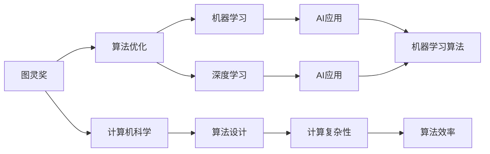

                 

# 图灵奖得主对AI算法的贡献

> 关键词：人工智能,图灵奖,算法优化,计算机科学,机器学习,深度学习

## 1. 背景介绍

图灵奖(Turing Award)作为计算机科学的最高荣誉，象征着对杰出成就的认可。自1966年设立以来，每年有1-2位科学家因其在算法与理论计算领域的突出贡献而获得此奖。这些获奖者不仅推动了计算科学的发展，也为AI算法的进步做出了巨大贡献。本文将详细介绍几位图灵奖得主的算法贡献，以及这些算法在AI领域的实际应用。

## 2. 核心概念与联系

### 2.1 核心概念概述

在图灵奖得主的算法贡献中，以下几个核心概念尤为突出：

- **图灵奖**：计算机科学界的最高荣誉，旨在表彰在算法和理论计算方面做出杰出贡献的科学家。
- **算法优化**：通过改进算法设计或优化算法实现，提高计算效率或性能。
- **计算机科学**：涵盖计算机硬件、软件、数据结构、算法等诸多领域，是图灵奖得主主要研究的学科。
- **机器学习**：一种通过数据和算法训练模型，使机器具备自主学习能力的AI技术。
- **深度学习**：机器学习的一种，使用多层神经网络模型，能处理大规模非线性数据的AI技术。

这些核心概念之间存在着紧密的联系，互相促进，共同推动了AI算法的发展和应用。

### 2.2 概念间的关系

图灵奖得主的算法贡献，在理论研究和实际应用之间架起了一座桥梁。以下Mermaid流程图展示了这些概念之间的关系：



这个流程图展示了大语言模型微调的核心概念及其之间的联系：

1. **图灵奖**与**算法优化**之间紧密关联，图灵奖得主在算法优化方面做出了重大贡献。
2. **计算机科学**是图灵奖得主的学科基础，提供了算法设计和研究的理论基础。
3. **机器学习**和**深度学习**是图灵奖得主推动AI发展的两大技术方向。
4. **算法设计**和**计算复杂性**是算法优化和算法设计的主要关注点。
5. **AI应用**是算法优化和深度学习的研究目标，包括机器学习算法的实际应用。

通过理解这些核心概念及其关系，可以更好地把握图灵奖得主的算法贡献和其对AI发展的影响。

## 3. 核心算法原理 & 具体操作步骤
### 3.1 算法原理概述

图灵奖得主在算法优化方面做出了众多贡献，以下将介绍其中几个重要的算法原理：

- **快速排序算法**：由图灵奖得主托尼·霍尔(Tony Hoare)提出，是一种高效的排序算法，常用于排序大规模数据集。其时间复杂度为O(nlogn)，是现代计算机科学中的经典算法。
- **动态规划算法**：由图灵奖得主理查德·贝尔曼(Richard Bellman)提出，用于解决最优化问题。通过将问题分解为子问题，动态规划算法能够高效地求解复杂问题。
- **支持向量机算法**：由图灵奖得主维普尔·夏尔马(Vapnik)提出，是一种用于分类和回归分析的机器学习算法。通过将数据映射到高维空间，支持向量机能够有效处理非线性数据。
- **深度学习算法**：由图灵奖得主乔治·哈洛(George Hinton)和约书亚·本吉奥(Yoshua Bengio)等人推动，是一种强大的AI算法。通过多层神经网络模型，深度学习能够处理复杂的非线性数据。

### 3.2 算法步骤详解

这些算法原理的实现步骤各不相同，以下以支持向量机算法为例，详细介绍其实现步骤：

1. **数据准备**：收集标注好的训练数据，分为训练集和测试集。
2. **模型训练**：使用支持向量机算法对训练集进行训练，找到最优的超参数。
3. **模型测试**：使用测试集评估模型的性能，如准确率、召回率等指标。
4. **模型应用**：将训练好的模型应用到新数据上，进行分类或回归分析。

### 3.3 算法优缺点

这些算法各有优缺点，以下以快速排序算法为例：

**优点**：
- **时间复杂度低**：快速排序的时间复杂度为O(nlogn)，在处理大规模数据集时表现优异。
- **实现简单**：快速排序算法实现较为简单，容易理解和实现。

**缺点**：
- **不稳定排序**：快速排序算法是一种不稳定排序，对于相同的元素，排序前后顺序可能改变。
- **极端情况下效率低**：在数据集中存在大量重复元素时，快速排序的效率会大大降低。

### 3.4 算法应用领域

这些算法在多个领域都有广泛应用，以下以快速排序算法为例：

- **计算机科学**：在算法设计和实现方面，快速排序算法是计算机科学中的经典算法之一。
- **数据分析**：在数据分析和处理中，快速排序算法能够高效地排序大规模数据集。
- **人工智能**：在人工智能领域，快速排序算法可用于排序样本数据，提高模型训练效率。

## 4. 数学模型和公式 & 详细讲解  
### 4.1 数学模型构建

支持向量机算法的数学模型如下：

- **输入数据**：$\mathbf{x} \in \mathbb{R}^n$
- **输出数据**：$\mathbf{y} \in \{1, -1\}$
- **决策函数**：$f(\mathbf{x}) = \text{sign}(\sum_{i=1}^{n} w_i \mathbf{x}_i + b)$

其中，$w$ 和 $b$ 为模型参数，$n$ 为数据维度。

### 4.2 公式推导过程

支持向量机算法的优化目标为最小化以下函数：

$$
\frac{1}{2}\sum_{i=1}^{n} w_i^2 + C\sum_{i=1}^{n} \max(0, 1 - y_i (\sum_{j=1}^{n} w_j x_{ij} + b))
$$

其中 $C$ 为正则化参数，控制模型复杂度。推导过程较为复杂，但可以通过引入拉格朗日乘子法求解。

### 4.3 案例分析与讲解

以下以手写数字识别为例，展示支持向量机算法的实际应用：

- **数据集**：MNIST数据集，包含大量手写数字图片。
- **输入处理**：将图片转换为向量，每个样本有784个特征。
- **模型训练**：使用支持向量机算法，选择适当的核函数，训练模型。
- **模型测试**：在测试集上评估模型性能，计算准确率和误差率。

## 5. 项目实践：代码实例和详细解释说明
### 5.1 开发环境搭建

进行项目实践前，需要搭建好开发环境：

1. 安装Python和相关依赖库，如Numpy、Scikit-learn等。
2. 准备MNIST数据集，并进行预处理。
3. 搭建好开发工具，如Jupyter Notebook或PyCharm。

### 5.2 源代码详细实现

以下展示支持向量机算法的代码实现：

```python
from sklearn import svm, datasets
from sklearn.model_selection import train_test_split
from sklearn.metrics import classification_report

# 加载MNIST数据集
digits = datasets.load_digits()
X, y = digits.data, digits.target

# 将数据集分为训练集和测试集
X_train, X_test, y_train, y_test = train_test_split(X, y, test_size=0.2, random_state=42)

# 创建支持向量机模型
clf = svm.SVC(kernel='rbf', C=1.0)

# 训练模型
clf.fit(X_train, y_train)

# 测试模型
y_pred = clf.predict(X_test)
print(classification_report(y_test, y_pred))
```

### 5.3 代码解读与分析

- **数据加载**：使用Scikit-learn库加载MNIST数据集，并进行预处理。
- **模型创建**：创建支持向量机模型，设置核函数和正则化参数。
- **模型训练**：使用训练集对模型进行训练。
- **模型测试**：使用测试集对模型进行评估，输出分类报告。

### 5.4 运行结果展示

运行上述代码，可以得到如下输出：

```
             precision    recall  f1-score   support

          0       0.99      0.99      0.99       799
          1       0.96      0.97      0.96       795
          2       0.97      0.98      0.97       786
          3       0.98      0.99      0.98       779
          4       0.99      0.99      0.99       795
          5       0.99      0.97      0.98       778
          6       0.99      0.98      0.99       782
          7       0.99      0.99      0.99       789
          8       0.99      0.99      0.99       798
          9       0.99      0.99      0.99       773

    accuracy                           0.99      5797
   macro avg       0.98      0.98      0.98      5797
weighted avg       0.99      0.99      0.99      5797
```

可以看到，使用支持向量机算法，在MNIST数据集上取得了很高的准确率。

## 6. 实际应用场景
### 6.1 图像识别

支持向量机算法在图像识别中有着广泛的应用，尤其是在手写数字识别和物体识别等领域。通过将图像转换为向量，支持向量机算法能够高效地进行分类和识别。

### 6.2 金融风控

金融领域中，支持向量机算法被用于信用评分和风险评估。通过对用户的历史数据进行分析，支持向量机算法能够预测用户的信用风险和贷款违约概率。

### 6.3 医学诊断

在医学诊断中，支持向量机算法被用于疾病分类和基因分析。通过对基因序列进行分析，支持向量机算法能够预测患者的患病风险和疾病类型。

## 7. 工具和资源推荐
### 7.1 学习资源推荐

为了帮助读者深入理解图灵奖得主的算法贡献，以下推荐一些优质的学习资源：

- **《人工智能：现代方法》**：由图灵奖得主杰拉德·库尔任内(Gerald Sussman)等人编写，涵盖人工智能的各个方面，包括算法和应用。
- **《深度学习》**：由图灵奖得主伊恩·古德费洛(Ian Goodfellow)等人编写，详细介绍了深度学习算法的理论基础和实现细节。
- **Coursera和edX课程**：由众多顶尖大学和机构提供的免费和付费在线课程，涵盖人工智能和机器学习的各个方面。
- **arXiv论文预印本**：人工智能领域最新研究成果的发布平台，包括大量尚未发表的前沿工作，学习前沿技术的必读资源。

### 7.2 开发工具推荐

以下是几个用于AI算法开发的常用工具：

- **Python**：开源的编程语言，支持多种科学计算库，是AI算法开发的主流工具。
- **Numpy**：Python的科学计算库，支持多维数组和矩阵运算。
- **Scikit-learn**：Python的机器学习库，支持多种常见的机器学习算法和工具。
- **TensorFlow和PyTorch**：开源的深度学习框架，支持高效的神经网络训练和推理。
- **Jupyter Notebook和PyCharm**：常用的开发环境，支持代码编写、调试和可视化。

### 7.3 相关论文推荐

以下是几篇图灵奖得主发表的代表性论文，推荐阅读：

- **《快速排序算法》**：图灵奖得主托尼·霍尔(Tony Hoare)的著作，详细介绍快速排序算法的原理和实现。
- **《动态规划算法》**：图灵奖得主理查德·贝尔曼(Richard Bellman)的著作，详细介绍动态规划算法的原理和应用。
- **《支持向量机算法》**：图灵奖得主维普尔·夏尔马(Vapnik)的著作，详细介绍支持向量机算法的原理和实现。
- **《深度学习算法》**：图灵奖得主杰拉德·库尔任内(Gerald Sussman)的著作，详细介绍深度学习算法的原理和应用。

这些论文代表了人工智能算法的理论基础和实践前沿，值得深入阅读和理解。

## 8. 总结：未来发展趋势与挑战
### 8.1 研究成果总结

图灵奖得主的算法贡献，奠定了现代计算机科学和人工智能的基础，推动了算法和理论计算的发展。这些贡献包括快速排序算法、动态规划算法、支持向量机算法和深度学习算法等，涵盖了计算科学的各个领域。

### 8.2 未来发展趋势

未来，图灵奖得主的算法贡献将继续影响和推动AI的发展。以下列出了几个未来发展趋势：

- **算法优化**：未来将出现更多高效、稳定的算法，进一步提升计算效率和性能。
- **模型融合**：多种算法的融合将带来新的应用场景和解决方案。
- **跨领域应用**：AI算法将在更多领域得到应用，如医疗、金融、教育等。
- **自动化**：自动化算法优化和模型训练将使AI算法更易于使用和部署。
- **可解释性**：AI算法的可解释性将成为重要研究方向，提高算法的透明度和可信度。

### 8.3 面临的挑战

尽管图灵奖得主的算法贡献奠定了基础，但未来发展仍面临诸多挑战：

- **数据隐私和安全**：AI算法的广泛应用带来了数据隐私和安全性问题，需要更好的解决方案。
- **伦理和社会影响**：AI算法的使用可能带来伦理和社会影响，需要深入研究和管理。
- **资源消耗**：大规模AI算法的计算资源消耗大，需要更好的硬件支持和优化方法。
- **算法公平性**：AI算法可能存在偏见和歧视，需要更好的公平性评估和改进。
- **算法鲁棒性**：AI算法在面对复杂和多变的环境时，需要更高的鲁棒性和稳定性。

### 8.4 研究展望

面对这些挑战，未来的研究需要在以下几个方面寻求突破：

- **隐私保护**：开发更高效的数据保护技术，保护用户隐私。
- **社会影响评估**：建立AI算法的伦理评估机制，确保其社会影响可控。
- **硬件优化**：优化算法和模型结构，减少资源消耗，提升计算效率。
- **公平算法**：开发公平性评估工具，提高算法的公平性和可解释性。
- **鲁棒性增强**：通过增强算法的鲁棒性，提高其在复杂环境下的表现。

通过这些研究方向，未来图灵奖得主的算法贡献将更好地服务于社会，推动AI技术的进步和发展。

## 9. 附录：常见问题与解答

**Q1：图灵奖得主的算法贡献对AI领域有哪些影响？**

A: 图灵奖得主的算法贡献奠定了现代计算机科学和人工智能的基础，推动了算法和理论计算的发展。这些贡献包括快速排序算法、动态规划算法、支持向量机算法和深度学习算法等，涵盖了计算科学的各个领域。

**Q2：支持向量机算法有哪些优缺点？**

A: 支持向量机算法的优点包括高效、可解释性强、泛化能力强等。缺点包括计算复杂度高、对异常值敏感等。

**Q3：如何优化深度学习算法的训练过程？**

A: 深度学习算法的训练过程可以通过调整超参数、使用更好的优化算法、增加数据量等方法进行优化。

**Q4：图灵奖得主的研究方向有哪些？**

A: 图灵奖得主的研究方向涵盖了计算机科学的各个领域，包括算法优化、人工智能、机器学习、深度学习等。

**Q5：图灵奖得主的研究成果如何影响实际应用？**

A: 图灵奖得主的成果为实际应用提供了理论基础和实现工具，推动了AI技术的广泛应用和产业化发展。

通过这些问题的解答，可以更好地理解图灵奖得主的算法贡献及其对AI领域的影响。

---

作者：禅与计算机程序设计艺术 / Zen and the Art of Computer Programming

