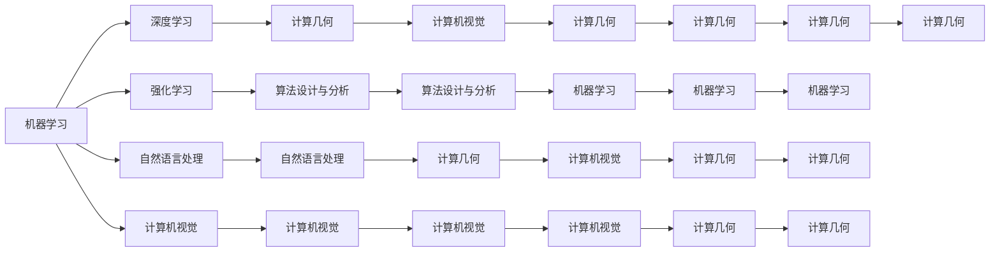

                 

# 图灵奖得主对AI算法的贡献

## 1. 背景介绍

图灵奖，作为计算机科学领域的最高荣誉，旨在表彰对计算机领域做出卓越贡献的科学家和技术专家。自1966年设立以来，已有众多杰出学者和技术先锋获得这一殊荣。本文聚焦于图灵奖得主在AI算法领域的贡献，通过梳理和解析，探讨这些先驱如何通过创新的算法和技术，推动了人工智能的飞速发展。

## 2. 核心概念与联系

### 2.1 核心概念概述

图灵奖得主对AI算法的贡献，主要集中在以下几个核心概念上：

- **机器学习**：通过算法使计算机能够从数据中学习规律，以实现预测、分类、聚类等任务。
- **深度学习**：一种基于神经网络的机器学习方法，通过多层次的非线性变换，实现对复杂数据的有效建模和分析。
- **强化学习**：通过智能体与环境互动，通过试错学习最优策略，实现决策与控制。
- **自然语言处理**：使计算机能够理解和生成人类语言，包括语义理解、自动翻译、文本生成等任务。
- **计算机视觉**：使计算机能够理解和分析视觉信息，包括图像分类、目标检测、语义分割等任务。
- **计算几何**：涉及计算机图形学和计算几何学的交叉领域，旨在解决复杂的几何问题。
- **算法设计与分析**：通过对算法性能的分析和设计，提升计算机系统的效率和效果。

### 2.2 概念间的关系

以上核心概念之间存在着紧密的联系，它们共同构成了人工智能的算法基础和应用框架。以下通过几个Mermaid流程图来展示这些概念之间的关系：



这个流程图展示了不同AI算法之间的相互关系：

1. 机器学习是基础，深度学习、强化学习、自然语言处理、计算机视觉、计算几何等算法都是机器学习的具体应用。
2. 深度学习、强化学习、自然语言处理等算法又各自有着不同的应用场景和技术特点。
3. 算法设计与分析则是优化和提升这些算法效率的基础。

## 3. 核心算法原理 & 具体操作步骤

### 3.1 算法原理概述

图灵奖得主对AI算法的贡献，主要体现在以下几个关键算法原理上：

1. **监督学习与无监督学习**：通过有标签和无标签数据，机器学习算法能够学习数据的规律，并进行分类、预测等任务。
2. **梯度下降算法**：一种基于反向传播的优化算法，通过迭代更新模型参数，最小化损失函数，实现模型优化。
3. **神经网络与深度神经网络**：通过多层次的非线性变换，实现对复杂数据的有效建模和分析。
4. **卷积神经网络**：针对图像和视频数据的深度学习模型，通过卷积操作提取局部特征，实现高效分类和识别。
5. **循环神经网络**：针对序列数据的深度学习模型，通过循环结构保持序列信息，实现时间序列预测和文本生成。
6. **注意力机制**：通过自注意力机制，提高模型对关键信息的关注，实现更加精准的语义理解和生成。
7. **对抗训练**：通过加入对抗样本，提高模型的鲁棒性和泛化能力，避免过拟合。
8. **迁移学习**：通过在大规模数据集上预训练模型，再在下游任务上进行微调，实现跨领域迁移能力。

### 3.2 算法步骤详解

以深度神经网络为例，其基本训练步骤包括：

1. **数据准备**：收集和处理训练数据，包括数据清洗、归一化、分割等。
2. **模型定义**：定义神经网络的架构，包括输入层、隐藏层、输出层等。
3. **损失函数定义**：选择合适的损失函数，如交叉熵损失、均方误差损失等。
4. **模型训练**：使用梯度下降等优化算法，最小化损失函数，更新模型参数。
5. **模型评估**：在测试集上评估模型性能，如精度、召回率、F1分数等。

### 3.3 算法优缺点

图灵奖得主开发的算法具有以下优点：

- **精度高**：通过多层次非线性变换，能够捕捉复杂数据的特征，实现高精度预测和分类。
- **泛化能力强**：在大规模数据集上进行预训练，能够适应不同领域和数据分布的变化。
- **计算效率高**：通过并行计算和优化算法，能够在合理的时间内完成训练和推理。

但同时，这些算法也存在以下缺点：

- **计算资源需求大**：深度神经网络需要大量的计算资源，包括高性能的GPU和TPU。
- **模型复杂度高**：模型结构和参数量较大，难以解释和调试。
- **对抗攻击易受影响**：对抗样本对模型的预测结果影响较大，难以保证模型的鲁棒性。

### 3.4 算法应用领域

图灵奖得主开发的算法在多个领域得到了广泛应用：

- **医疗**：通过深度学习算法，实现对医学影像的自动化分析和诊断，提高了医疗效率和准确性。
- **金融**：使用强化学习算法，实现对金融市场的高频交易和风险管理，优化了金融决策。
- **自动驾驶**：利用计算机视觉和深度学习算法，实现对交通场景的实时感知和决策，推动了自动驾驶技术的进步。
- **自然语言处理**：通过自然语言处理算法，实现文本的情感分析、自动翻译和问答系统，提升了人机交互体验。
- **计算机视觉**：使用卷积神经网络和计算机视觉算法，实现图像分类、目标检测和语义分割，推动了视觉应用的发展。

## 4. 数学模型和公式 & 详细讲解 & 举例说明

### 4.1 数学模型构建

以深度学习为例，基本模型包括输入层、隐藏层和输出层，数学模型构建如下：

$$
\begin{aligned}
& y = \sigma(W_1 \cdot x + b_1) \\
& h = \sigma(W_2 \cdot y + b_2) \\
& z = W_3 \cdot h + b_3
\end{aligned}
$$

其中，$x$为输入，$y$为隐藏层的输出，$h$为全连接层的输出，$z$为最终输出。$W$和$b$分别为权重和偏置。

### 4.2 公式推导过程

以线性回归为例，目标是最小化预测值与真实值之间的平方误差，数学推导如下：

1. 目标函数：

$$
J(w, b) = \frac{1}{2m} \sum_{i=1}^m (h_{\theta}(x^{(i)}) - y^{(i)})^2
$$

2. 梯度下降更新：

$$
\begin{aligned}
& \frac{\partial J}{\partial w} = \frac{1}{m} \sum_{i=1}^m (h_{\theta}(x^{(i)}) - y^{(i)}) \cdot x^{(i)} \\
& \frac{\partial J}{\partial b} = \frac{1}{m} \sum_{i=1}^m (h_{\theta}(x^{(i)}) - y^{(i)})
\end{aligned}
$$

其中，$h_{\theta}(x)$为线性回归模型的输出，$x^{(i)}$为样本$x$的第$i$个元素，$y^{(i)}$为样本$y$的第$i$个元素。

### 4.3 案例分析与讲解

以图像分类为例，使用卷积神经网络实现手写数字识别，其网络架构如下：

1. 输入层：输入图像$x$，大小为$28 \times 28$。
2. 卷积层：提取图像局部特征，使用$5 \times 5$的卷积核和$1 \times 1$的池化层。
3. 全连接层：将卷积层的特征图展平，通过全连接层进行分类。

通过反向传播算法，计算损失函数$J$对每个参数的梯度，并使用梯度下降算法更新参数，最小化损失函数，得到最终分类结果。

## 5. 项目实践：代码实例和详细解释说明

### 5.1 开发环境搭建

开发深度学习算法，需要配置以下环境：

1. 安装Python：使用Anaconda或Miniconda安装最新版本的Python。
2. 安装必要的库：使用pip安装TensorFlow、Keras、Scikit-learn等深度学习库。
3. 安装GPU驱动：如果使用GPU加速，需要安装相应的CUDA和cuDNN驱动。
4. 搭建计算环境：使用Jupyter Notebook或PyCharm等IDE搭建开发环境。

### 5.2 源代码详细实现

以手写数字识别为例，使用Keras实现卷积神经网络的代码如下：

```python
import tensorflow as tf
from tensorflow import keras

# 加载MNIST数据集
mnist = keras.datasets.mnist
(x_train, y_train), (x_test, y_test) = mnist.load_data()

# 数据预处理
x_train = x_train / 255.0
x_test = x_test / 255.0

# 定义模型
model = keras.Sequential([
    keras.layers.Flatten(input_shape=(28, 28)),
    keras.layers.Dense(128, activation='relu'),
    keras.layers.Dense(10, activation='softmax')
])

# 编译模型
model.compile(optimizer='adam',
              loss='sparse_categorical_crossentropy',
              metrics=['accuracy'])

# 训练模型
model.fit(x_train, y_train, epochs=10)

# 评估模型
model.evaluate(x_test, y_test)
```

### 5.3 代码解读与分析

以上代码中，首先加载了MNIST数据集，并进行了数据预处理，将像素值归一化到[0,1]之间。然后定义了一个包含两个全连接层的卷积神经网络，使用ReLU激活函数和Softmax输出层。最后编译模型，使用Adam优化器和交叉熵损失函数进行训练和评估。

### 5.4 运行结果展示

训练完成后，可以使用`evaluate`函数评估模型的准确率：

```python
loss, accuracy = model.evaluate(x_test, y_test)
print('Test accuracy:', accuracy)
```

## 6. 实际应用场景

### 6.4 未来应用展望

随着图灵奖得主对AI算法的持续创新，未来AI算法将在以下领域得到更广泛的应用：

- **医疗**：利用AI算法进行疾病的早期预测和个性化治疗，提升医疗服务的质量和效率。
- **金融**：通过AI算法实现精准的金融预测和风险管理，优化金融决策。
- **自动驾驶**：结合计算机视觉和深度学习算法，实现自动驾驶汽车的智能决策。
- **自然语言处理**：通过AI算法实现更加精准的文本理解和生成，提升人机交互体验。
- **计算机视觉**：使用AI算法进行图像识别和增强现实，推动视觉应用的发展。
- **计算几何**：在机器人导航、空间规划等领域，利用AI算法实现高精度的计算和分析。

## 7. 工具和资源推荐

### 7.1 学习资源推荐

以下是推荐的深度学习学习资源：

1. 《深度学习》（Ian Goodfellow等）：详细介绍了深度学习的基本概念和算法。
2. 《Python深度学习》（Francois Chollet）：使用Keras实现深度学习的经典案例。
3. 《动手学深度学习》（李沐等）：动手实践深度学习算法，适合初学者和进阶者。
4. 《机器学习实战》（Peter Harrington）：通过实际案例讲解机器学习算法。
5. 《深度学习入门》（斋藤康毅）：从基础到高级，涵盖深度学习各个方面。
6. 《自然语言处理综论》（Daniel Jurafsky和James H. Martin）：涵盖自然语言处理的基本概念和算法。

### 7.2 开发工具推荐

以下是推荐的深度学习开发工具：

1. TensorFlow：由Google开发的深度学习框架，支持多种计算图和分布式训练。
2. PyTorch：由Facebook开发的深度学习框架，支持动态计算图和高效的GPU加速。
3. Keras：基于TensorFlow和Theano的高级深度学习库，易于上手。
4. MXNet：由Amazon开发的深度学习框架，支持多种计算平台。
5. Caffe：由Berkeley开发的深度学习框架，适用于图像处理和计算机视觉。

### 7.3 相关论文推荐

以下是推荐的深度学习相关论文：

1. 《ImageNet分类：深度卷积神经网络》（Krizhevsky等）：介绍AlexNet卷积神经网络，推动了图像识别领域的发展。
2. 《深度神经网络中的语言模型》（Dzmitry Bahdanau等）：通过LSTM实现机器翻译，提升了自然语言处理的效果。
3. 《NIPS2014：深度学习中的残差网络》（Kaiming He等）：提出残差网络，提高了深度神经网络的训练效率和效果。
4. 《神经网络中的激活函数》（Alex Krizhevsky等）：介绍ReLU激活函数，提升了神经网络的训练速度和效果。
5. 《Attention is All You Need》（Ashish Vaswani等）：提出Transformer模型，提升了自然语言处理的效果。

## 8. 总结：未来发展趋势与挑战

### 8.1 研究成果总结

图灵奖得主对AI算法的贡献，主要体现在以下几个方面：

1. 深度学习算法：推动了计算机视觉、自然语言处理等领域的发展。
2. 强化学习算法：提升了决策和控制领域的效果，推动了自动驾驶和机器人技术的发展。
3. 计算机视觉算法：推动了图像识别和计算机视觉领域的发展。
4. 自然语言处理算法：提升了文本理解和生成领域的效果。
5. 计算几何算法：推动了机器人导航和空间规划等领域的发展。

### 8.2 未来发展趋势

未来AI算法的发展趋势包括：

1. 深度学习算法的持续优化：通过更高效的算法和更大的模型，实现更高的精度和泛化能力。
2. 强化学习算法的广泛应用：推动更多领域的决策和控制，提升智能系统的自主性。
3. 计算机视觉算法的多模态融合：结合视觉和听觉等多模态数据，提升感知和理解能力。
4. 自然语言处理算法的语义理解：提升对文本语义的理解和生成，推动人机交互的发展。
5. 计算几何算法的高效计算：提升计算几何领域的应用效率，推动智能机器人的发展。

### 8.3 面临的挑战

AI算法的发展面临着以下挑战：

1. 数据依赖性：深度学习算法对大规模标注数据的需求较大，数据的获取和标注成本较高。
2. 模型复杂性：深度神经网络的复杂性较高，难以解释和调试，容易产生“黑盒”问题。
3. 鲁棒性和泛化能力：深度学习算法对对抗样本和噪声的鲁棒性不足，泛化能力有待提升。
4. 计算资源需求：深度学习算法对计算资源的需求较大，硬件成本较高。
5. 算法公平性：深度学习算法可能产生算法偏见，需要更多的公平性和可解释性研究。

### 8.4 研究展望

未来的研究方向包括：

1. 高效深度学习算法：优化深度神经网络的结构和算法，实现更高效的训练和推理。
2. 多模态学习：结合视觉、听觉等多模态数据，提升智能系统的感知和理解能力。
3. 可解释性算法：开发可解释性更强的算法，提升算法的透明性和公平性。
4. 弱监督学习：开发更多弱监督和无监督学习算法，降低对大规模标注数据的依赖。
5. 动态学习：开发动态学习和自适应算法，提升智能系统的适应性和灵活性。

## 9. 附录：常见问题与解答

**Q1：什么是深度学习？**

A: 深度学习是一种基于神经网络的机器学习方法，通过多层次的非线性变换，实现对复杂数据的有效建模和分析。

**Q2：深度学习与传统机器学习的区别是什么？**

A: 深度学习通过神经网络的多层次结构，能够自动提取数据的高层特征，而传统机器学习需要手工设计特征。深度学习具有更好的数据处理能力，能够处理更复杂的数据结构。

**Q3：深度学习在实际应用中有哪些优势？**

A: 深度学习具有以下优势：
1. 高精度：通过多层次非线性变换，能够捕捉复杂数据的特征，实现高精度预测和分类。
2. 泛化能力强：在大规模数据集上进行预训练，能够适应不同领域和数据分布的变化。
3. 计算效率高：通过并行计算和优化算法，能够在合理的时间内完成训练和推理。

**Q4：深度学习有哪些应用领域？**

A: 深度学习在多个领域得到了广泛应用，包括计算机视觉、自然语言处理、语音识别、机器人技术等。

**Q5：深度学习的未来发展方向是什么？**

A: 深度学习的未来发展方向包括：
1. 高效深度学习算法：优化深度神经网络的结构和算法，实现更高效的训练和推理。
2. 多模态学习：结合视觉、听觉等多模态数据，提升智能系统的感知和理解能力。
3. 可解释性算法：开发可解释性更强的算法，提升算法的透明性和公平性。
4. 弱监督学习：开发更多弱监督和无监督学习算法，降低对大规模标注数据的依赖。
5. 动态学习：开发动态学习和自适应算法，提升智能系统的适应性和灵活性。

---

作者：禅与计算机程序设计艺术 / Zen and the Art of Computer Programming

