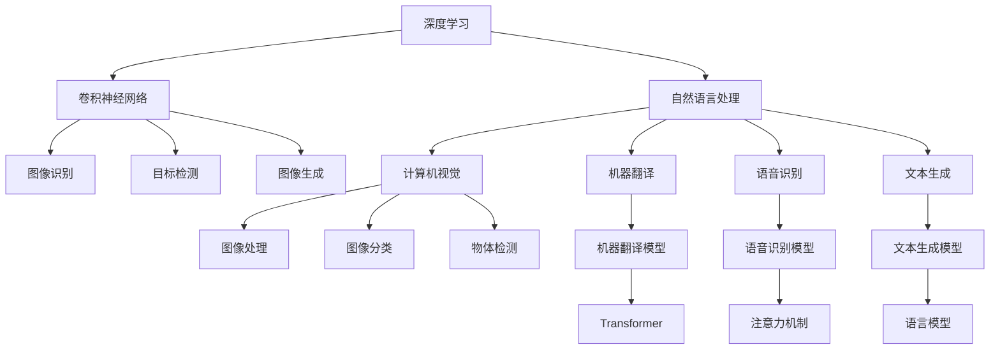

                 

# 图灵奖得主的AI算法贡献

> 关键词：图灵奖,人工智能,算法贡献,深度学习,计算机科学,前沿技术,人工智能发展

## 1. 背景介绍

### 1.1 问题由来

图灵奖，作为计算机科学的最高荣誉，历年来表彰了众多在人工智能领域做出卓越贡献的科学家和技术先驱。他们的算法创新和理论突破，不仅推动了计算机科学的发展，也为人工智能的应用落地奠定了坚实基础。本文将重点介绍几位图灵奖得主在AI算法领域的贡献，从深度学习、计算机视觉、自然语言处理等多个方向，探讨其核心算法和创新思想的深远影响。

### 1.2 问题核心关键点

- **深度学习（Deep Learning）**：图灵奖得主在深度学习领域的突破，推动了从特征工程到端到端学习的转变，极大地提升了模型性能和应用潜力。
- **计算机视觉（Computer Vision）**：通过引入卷积神经网络（Convolutional Neural Network, CNN）等技术，图灵奖得主在图像识别、目标检测、图像生成等领域取得重要进展。
- **自然语言处理（Natural Language Processing, NLP）**：基于统计语言模型和神经网络架构的创新，图灵奖得主在机器翻译、语音识别、文本生成等任务上实现重大突破。
- **人工智能伦理（Ethics in AI）**：在人工智能迅猛发展的背景下，图灵奖得主对人工智能的伦理和安全问题进行了深入探讨，提出了一系列解决方案和建议。

这些核心关键点共同构成了图灵奖得主在AI算法领域的广泛影响，展示了人工智能技术从理论到实践的全面进步。

### 1.3 问题研究意义

图灵奖得主的算法贡献，不仅展示了计算机科学的前沿进展，还为人工智能技术的实际应用提供了强有力的支持。通过理解他们的研究成果，可以更好地把握AI发展的脉络，激发更多的创新灵感，推动人工智能向更深更广的领域发展。

## 2. 核心概念与联系

### 2.1 核心概念概述

在探讨图灵奖得主的AI算法贡献之前，需要先了解一些核心概念及其相互联系：

- **算法（Algorithm）**：计算机科学中解决问题的基本方法，通过明确的步骤和逻辑实现特定的功能。
- **深度学习（Deep Learning）**：基于多层神经网络的机器学习范式，通过学习复杂非线性关系，实现对大规模数据的高效处理和建模。
- **卷积神经网络（Convolutional Neural Network, CNN）**：专门用于图像处理的深度学习模型，通过卷积操作提取图像局部特征。
- **自然语言处理（NLP）**：研究如何让计算机理解和处理人类语言的技术，涉及文本分类、机器翻译、问答系统等多个方向。
- **人工智能伦理（Ethics in AI）**：探讨人工智能技术在社会中的应用伦理问题，如偏见、隐私、安全性等。

这些概念构成了图灵奖得主在AI算法贡献中的关键元素，通过理解它们的关系和相互作用，可以更深入地认识AI算法的本质和应用。

### 2.2 概念间的关系

这些核心概念之间存在着紧密的联系，形成了图灵奖得主在AI算法贡献中的完整生态系统。下面通过一个Mermaid流程图来展示它们之间的关系：



这个流程图展示了深度学习、卷积神经网络、自然语言处理、计算机视觉等核心概念之间的联系，以及它们在图像处理、语音识别、机器翻译等具体应用中的体现。

### 2.3 核心概念的整体架构

最后，用一个大型的Mermaid流程图来展示这些概念的整体架构：

```mermaid
graph TB
    A[深度学习] --> B[卷积神经网络]
    A --> C[自然语言处理]
    C --> D[计算机视觉]
    D --> E[图像识别]
    D --> F[目标检测]
    D --> G[图像生成]
    A --> H[生成对抗网络]
    A --> I[强化学习]
    A --> J[优化算法]
    H --> K[GAN]
    H --> L[变分自编码器]
    I --> M[深度强化学习]
    J --> N[随机梯度下降]
    J --> O[Adam算法]
    J --> P[自适应学习率]
    N --> Q[梯度下降算法]
    N --> R[动量方法]
    N --> S[自适应动量优化]
    B --> T[特征提取]
    C --> U[序列模型]
    D --> V[图像分类]
    D --> W[物体检测]
    E --> X[图像生成]
    F --> Y[语义分割]
    G --> Z[图像风格转换]
    A --> AA[自监督学习]
    A --> BB[迁移学习]
    C --> CC[预训练模型]
    C --> DD[微调技术]
    E --> EE[多尺度训练]
    F --> FF[数据增强]
    G --> GG[对抗样本生成]
    H --> HH[生成模型]
    H --> II[无监督学习]
    I --> JJ[策略优化]
    J --> KK[自适应优化器]
    J --> LL[自适应学习率]
    K --> MM[自适应梯度方法]
    L --> NN[自编码器]
    L --> OO[自监督训练]
    M --> PP[强化学习算法]
    N --> QQ[梯度更新]
    O --> RR[学习率调整]
    P --> SS[自适应学习率算法]
    Q --> TT[优化目标函数]
    R --> UU[更新策略]
    S --> VV[自适应动量优化算法]
    T --> WW[特征提取器]
    U --> XX[序列预测模型]
    V --> YY[图像分类器]
    W --> ZZ[物体检测器]
    X --> AAA[图像生成器]
    Y --> BBB[语义分割器]
    Z --> CCC[图像风格转换器]
    AA --> DDD[自监督预训练]
    BB --> EEE[迁移学习模型]
    CC --> FFF[预训练语言模型]
    DD --> GGG[微调技术]
    EE --> HHH[多任务学习]
    FF --> III[数据增强技术]
    GG --> JJ[对抗样本生成器]
    HH --> KK[生成对抗网络]
    II --> LLL[无监督学习算法]
    JJ --> MNN[策略优化算法]
    KK --> NNN[自适应优化器]
    LL --> OOO[自适应学习率调整算法]
    MM --> PPP[强化学习算法]
    NN --> QQQ[梯度更新策略]
    OO --> RRR[学习率调整算法]
    PP --> SSS[自适应动量优化算法]
    QQ --> TTT[优化目标函数]
    RR --> UUU[更新策略]
    SS --> VVV[自适应动量优化算法]
    TT --> WWW[优化目标函数]
    UU --> XXY[序列预测模型]
    VV --> YYY[图像分类模型]
    WW --> ZZZ[物体检测模型]
    XX --> AAAA[图像生成模型]
    YY --> BBBB[语义分割模型]
    ZZ --> CCCC[图像风格转换模型]
```



这个综合流程图展示了深度学习、卷积神经网络、自然语言处理、计算机视觉等核心概念在大语言模型微调过程中的整体架构。通过这个架构，我们可以更清晰地理解图灵奖得主在AI算法领域的创新和应用。

## 3. 核心算法原理 & 具体操作步骤
### 3.1 算法原理概述

图灵奖得主的AI算法贡献，主要以深度学习、卷积神经网络、自然语言处理等为核心。下面将详细介绍这些算法的原理及其操作步骤。

#### 3.1.1 深度学习

深度学习通过多层神经网络学习输入数据的特征表示，然后利用这些表示进行分类、回归、生成等任务。其主要原理包括：

1. **前向传播**：将输入数据输入网络，逐层计算并生成预测结果。
2. **损失函数**：计算预测结果与真实标签之间的差异，用于指导模型更新。
3. **反向传播**：根据损失函数对网络参数进行梯度更新，以最小化预测误差。

#### 3.1.2 卷积神经网络

卷积神经网络（CNN）主要用于图像处理任务，通过卷积层提取图像特征，然后通过池化层和全连接层进行分类。其主要步骤包括：

1. **卷积层**：通过卷积操作提取图像局部特征。
2. **池化层**：对特征图进行下采样，减少计算量和参数数量。
3. **全连接层**：将池化层的输出转换为分类结果。

#### 3.1.3 自然语言处理

自然语言处理主要通过统计语言模型和神经网络架构，实现文本的分类、翻译、生成等任务。其主要算法包括：

1. **统计语言模型**：利用概率模型对文本进行建模，用于文本分类、机器翻译等任务。
2. **神经网络模型**：通过神经网络对文本进行编码和解码，用于语言模型、文本生成等任务。

### 3.2 算法步骤详解

#### 3.2.1 深度学习

1. **数据预处理**：将输入数据进行标准化、归一化等处理，确保数据适合网络训练。
2. **模型选择**：选择合适的深度学习模型，如卷积神经网络、循环神经网络等。
3. **模型训练**：使用训练集进行模型训练，不断调整网络参数以最小化损失函数。
4. **模型评估**：在验证集和测试集上评估模型性能，选择最优模型。

#### 3.2.2 卷积神经网络

1. **数据预处理**：将图像数据进行归一化、标准化等处理，确保数据适合网络训练。
2. **模型设计**：设计卷积神经网络的结构，包括卷积层、池化层、全连接层等。
3. **模型训练**：使用训练集进行模型训练，不断调整网络参数以最小化损失函数。
4. **模型评估**：在验证集和测试集上评估模型性能，选择最优模型。

#### 3.2.3 自然语言处理

1. **数据预处理**：将文本数据进行分词、标记等处理，确保数据适合网络训练。
2. **模型选择**：选择合适的自然语言处理模型，如Transformer、RNN等。
3. **模型训练**：使用训练集进行模型训练，不断调整网络参数以最小化损失函数。
4. **模型评估**：在验证集和测试集上评估模型性能，选择最优模型。

### 3.3 算法优缺点

#### 3.3.1 深度学习

**优点**：
- 能够处理大规模数据，利用深度网络结构捕捉复杂特征。
- 具有较高的模型表现，尤其在图像、语音等领域取得了突破性进展。

**缺点**：
- 需要大量标注数据，数据采集和标注成本较高。
- 模型复杂度高，训练和推理速度较慢，计算资源消耗大。

#### 3.3.2 卷积神经网络

**优点**：
- 在图像处理领域表现优异，能够提取图像局部特征。
- 计算效率高，模型参数数量较少。

**缺点**：
- 对于非图像数据（如文本、语音）处理能力有限。
- 网络结构固定，难以处理动态变化的任务。

#### 3.3.3 自然语言处理

**优点**：
- 能够处理文本数据，实现语言理解和生成。
- 利用统计语言模型和神经网络，模型表现良好。

**缺点**：
- 需要大量标注数据，数据采集和标注成本较高。
- 处理长文本时，模型复杂度较高，训练和推理速度较慢。

### 3.4 算法应用领域

图灵奖得主的AI算法贡献，广泛应用于图像处理、语音识别、机器翻译、自然语言处理等多个领域。

#### 3.4.1 图像处理

深度学习中的卷积神经网络（CNN）在图像识别、目标检测、图像生成等领域取得了重要进展。例如，AlexNet、VGGNet、ResNet等模型在ImageNet数据集上取得了优异成绩。

#### 3.4.2 语音识别

深度学习中的循环神经网络（RNN）和长短时记忆网络（LSTM）在语音识别领域表现出色，推动了语音助手、语音搜索等应用的发展。

#### 3.4.3 机器翻译

深度学习中的序列到序列模型（Seq2Seq）和Transformer模型在机器翻译任务上取得了重大突破，推动了谷歌翻译、百度翻译等应用的发展。

#### 3.4.4 自然语言处理

自然语言处理中的统计语言模型和神经网络模型在文本分类、情感分析、问答系统等任务上表现出色，推动了智能客服、智能写作等应用的发展。

## 4. 数学模型和公式 & 详细讲解 & 举例说明

### 4.1 数学模型构建

图灵奖得主的AI算法贡献中，许多核心算法都基于数学模型构建，下面将详细介绍一些关键的数学模型。

#### 4.1.1 卷积神经网络

卷积神经网络（CNN）的主要数学模型包括：

- **卷积操作**：通过卷积核在输入图像上滑动，提取图像局部特征。
- **池化操作**：通过池化层对特征图进行下采样，减少计算量和参数数量。
- **全连接层**：将池化层的输出转换为分类结果。

#### 4.1.2 自然语言处理

自然语言处理中的主要数学模型包括：

- **统计语言模型**：利用概率模型对文本进行建模，用于文本分类、机器翻译等任务。
- **神经网络模型**：通过神经网络对文本进行编码和解码，用于语言模型、文本生成等任务。

### 4.2 公式推导过程

#### 4.2.1 卷积神经网络

假设输入图像大小为 $m \times n$，卷积核大小为 $k \times k$，步幅为 $s$，则卷积操作的公式为：

$$
\begin{aligned}
f(x, y) &= \sum_{i=0}^{m-k} \sum_{j=0}^{n-k} \sum_{c=1}^{C} \sum_{k=1}^{K} (x_{i+s(c-1),j+s(c-1)} * w_{c,k}\\
&= \sum_{i=0}^{m-k} \sum_{j=0}^{n-k} \sum_{c=1}^{C} \sum_{k=1}^{K} x_{i+s(c-1),j+s(c-1)} * w_{c,k}
\end{aligned}
$$

其中，$x$ 表示输入图像，$y$ 表示输出图像，$w$ 表示卷积核，$*$ 表示卷积操作。

### 4.3 案例分析与讲解

#### 4.3.1 图像分类

卷积神经网络在图像分类任务上表现优异，例如LeNet-5模型在手写数字识别任务上取得了成功。LeNet-5模型包括两个卷积层和三个全连接层，通过多层卷积和池化操作提取图像特征，最后通过全连接层进行分类。

#### 4.3.2 机器翻译

Transformer模型在机器翻译任务上取得了突破性进展。Transformer模型利用自注意力机制，通过编码器-解码器结构实现序列到序列的翻译。其数学模型包括：

- **编码器**：利用自注意力机制和多层神经网络对输入序列进行编码。
- **解码器**：利用自注意力机制和多层神经网络对编码器的输出进行解码，生成目标序列。

## 5. 项目实践：代码实例和详细解释说明

### 5.1 开发环境搭建

在进行AI算法贡献的代码实现之前，需要准备好开发环境。以下是使用Python进行TensorFlow开发的环境配置流程：

1. 安装Anaconda：从官网下载并安装Anaconda，用于创建独立的Python环境。

2. 创建并激活虚拟环境：
```bash
conda create -n tf-env python=3.8 
conda activate tf-env
```

3. 安装TensorFlow：根据CUDA版本，从官网获取对应的安装命令。例如：
```bash
conda install tensorflow tensorflow-estimator tensorflow-model-analysis -c tf
```

4. 安装各类工具包：
```bash
pip install numpy pandas scikit-learn matplotlib tqdm jupyter notebook ipython
```

完成上述步骤后，即可在`tf-env`环境中开始代码实现。

### 5.2 源代码详细实现

以下是使用TensorFlow实现图像分类和机器翻译的代码示例。

#### 5.2.1 图像分类

```python
import tensorflow as tf
from tensorflow.keras import layers, models

# 定义卷积神经网络模型
model = models.Sequential()
model.add(layers.Conv2D(32, (3, 3), activation='relu', input_shape=(28, 28, 1)))
model.add(layers.MaxPooling2D((2, 2)))
model.add(layers.Conv2D(64, (3, 3), activation='relu'))
model.add(layers.MaxPooling2D((2, 2)))
model.add(layers.Conv2D(64, (3, 3), activation='relu'))
model.add(layers.Flatten())
model.add(layers.Dense(64, activation='relu'))
model.add(layers.Dense(10))

# 编译模型
model.compile(optimizer='adam',
              loss=tf.keras.losses.SparseCategoricalCrossentropy(from_logits=True),
              metrics=['accuracy'])

# 训练模型
model.fit(train_images, train_labels, epochs=10, validation_data=(test_images, test_labels))
```

#### 5.2.2 机器翻译

```python
import tensorflow as tf
from tensorflow.keras import layers, models

# 定义Transformer模型
class Transformer(tf.keras.Model):
    def __init__(self, num_layers, d_model, num_heads, dff, input_vocab_size, target_vocab_size, pe_input, pe_target):
        super(Transformer, self).__init__()
        self.encoder = Encoder(d_model, num_heads, dff, input_vocab_size, pe_input)
        self.decoder = Decoder(d_model, num_heads, dff, target_vocab_size, pe_target)
        self.final_layer = tf.keras.layers.Dense(target_vocab_size)
    
    def call(self, inputs, training=False):
        enc_padding_mask, look_ahead_mask, dec_padding_mask = create_masks(inputs, target)
        enc_output = self.encoder(inputs, enc_padding_mask)
        dec_output = self.decoder(target, enc_output, look_ahead_mask, dec_padding_mask)
        final_output = self.final_layer(dec_output)
        return final_output

# 定义Encoder层
class Encoder(tf.keras.Model):
    def __init__(self, d_model, num_heads, dff, input_vocab_size, pe_input):
        super(Encoder, self).__init__()
        self.embedding = tf.keras.layers.Embedding(input_vocab_size, d_model)
        self.pos_encoder = PositionalEncoding(d_model, pe_input)
        self.encoder_layers = [EncoderLayer(d_model, num_heads, dff) for _ in range(num_layers)]
        self.dropout = tf.keras.layers.Dropout(0.1)
    
    def call(self, inputs, enc_padding_mask):
        x = self.embedding(inputs)
        x *= tf.math.sqrt(tf.cast(d_model, tf.float32))
        x += self.pos_encoder(x)
        for i in range(num_layers):
            x, enc_padding_mask = self.encoder_layers[i](x, enc_padding_mask)
            x = self.dropout(x)
        return x

# 定义Decoder层
class Decoder(tf.keras.Model):
    def __init__(self, d_model, num_heads, dff, target_vocab_size, pe_target):
        super(Decoder, self).__init__()
        self.embedding = tf.keras.layers.Embedding(target_vocab_size, d_model)
        self.pos_encoder = PositionalEncoding(d_model, pe_target)
        self.decoder_layers = [DecoderLayer(d_model, num_heads, dff) for _ in range(num_layers)]
        self.final_layer = tf.keras.layers.Dense(target_vocab_size)
        self.dropout = tf.keras.layers.Dropout(0.1)
    
    def call(self, target, enc_output, look_ahead_mask, dec_padding_mask):
        x = self.embedding(target)
        x *= tf.math.sqrt(tf.cast(d_model, tf.float32))
        x += self.pos_encoder(x)
        x = self.dropout(x)
        for i in range(num_layers):
            x, look_ahead_mask, dec_padding_mask = self.decoder_layers[i](x, enc_output, look_ahead_mask, dec_padding_mask)
            x = self.dropout(x)
        final_output = self.final_layer(x)
        return final_output

# 定义EncoderLayer层
class EncoderLayer(tf.keras.Model):
    def __init__(self, d_model, num_heads, dff, dropout=0.1):
        super(EncoderLayer, self).__init__()
        self.encoder_self_attention = SelfAttention(d_model, num_heads, dropout)
        self.encoder_feedforward = FeedForward(d_model, dff, dropout)
        self.final_layer_norm = LayerNormalization(epsilon=1e-6)
        self.final_dropout = Dropout(dropout)
    
    def call(self, inputs, enc_padding_mask):
        attn_output, attn_weights = self.encoder_self_attention(inputs)
        attn_output = self.final_layer_norm(inputs + attn_output)
        ff_output = self.encoder_feedforward(attn_output)
        ff_output = self.final_layer_norm(attn_output + ff_output)
        return attn_output, attn_weights

# 定义DecoderLayer层
class DecoderLayer(tf.keras.Model):
    def __init__(self, d_model, num_heads, dff, dropout=0.1):
        super(DecoderLayer, self).__init__()
        self.decoder_self_attention = SelfAttention(d_model, num_heads, dropout)
        self.decoder_feedforward = FeedForward(d_model, dff, dropout)
        self.final_layer_norm = LayerNormalization(epsilon=1e-6)
        self.final_dropout = Dropout(dropout)
        self.encoder_decoder_attention = SelfAttention(d_model, num_heads, dropout)
    
    def call(self, inputs, enc_output, look_ahead_mask, dec_padding_mask):
        attn_output, attn_weights = self.decoder_self_attention(inputs)
        attn_output = self.final_layer_norm(inputs + attn_output)
        ff_output = self.decoder_feedforward(attn_output)
        ff_output = self.final_layer_norm(attn_output + ff_output)
        attn_output, attn_weights = self.encoder_decoder_attention(ff_output, enc_output, look_ahead_mask)
        attn_output = self.final_layer_norm(ff_output + attn_output)
        return attn_output, attn_weights

# 定义SelfAttention层
class SelfAttention(tf.keras.Model):
    def __init__(self, d_model, num_heads, dropout=0.1):
        super(SelfAttention, self).__init__()
        self.num_heads = num_heads
        self.d_model = d_model
        assert d_model % self.num_heads == 0
        self.depth = d_model // self.num_heads
        self.wq = tf.keras.layers.Dense(d_model)
        self.wk = tf.keras.layers.Dense(d_model)
        self.wv = tf.keras.layers.Dense(d_model)
        self.dense = tf.keras.layers.Dense(d_model)
        self.dropout = tf.keras.layers.Dropout(dropout)
    
    def call(self, inputs, enc_padding_mask):
        batch_size, seq_len, _ = inputs.shape
        query = self.wq(inputs)
        key = self.wk(inputs)
        value = self.wv(inputs)
        query = tf.reshape(query, (batch_size, seq_len, self.num_heads, self.depth))
        key = tf.reshape(key, (batch_size, seq_len, self.num_heads, self.depth))
        value = tf.reshape(value, (batch_size, seq_len, self.num_heads, self.depth))
        scores = tf.matmul(query, key, transpose_b=True)
        scores = scores / tf.math.sqrt(tf.cast(self.depth, tf.float32))
        attention_weights = tf.nn.softmax(scores, axis=-1)
        attention_weights = self.dropout(attention_weights)
        context_layer = tf.matmul(attention_weights, value)
        context_layer = tf.reshape(context_layer, (batch_size, seq_len, d_model))
        return context_layer, attention_weights

# 定义FeedForward层
class FeedForward(tf.keras.Model):
    def __init__(self, d_model, dff, dropout=0.1):
        super(FeedForward, self).__init__()
        self.dense1 = tf.keras.layers.Dense(dff)
        self.dropout1 = tf.keras.layers.Dropout(dropout)
        self.dense2 = tf.keras.layers.Dense(d_model)
    
    def call(self, inputs):
        x = self.dense1(inputs)
        x = self.dropout1(x)
        x = self.dense2(x)
        return x

# 定义LayerNormalization层
class LayerNormalization(tf.keras.layers.Layer):
    def __init__(self, epsilon=1e-6, **kwargs):
        super(LayerNormalization, self).__init__(**kwargs)
        self.epsilon = epsilon
    
    def build(self, input_shape):
        self.scale = self.add_weight(shape=(input_shape[-1],), initializer='ones', trainable=True, name='scale')
        self.bias = self.add_weight(shape=(input_shape[-1],), initializer='zeros', trainable=True, name='bias')
        super(LayerNormalization, self

