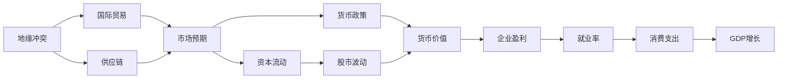

                 

# 地缘冲突加剧的经济影响

> 关键词：地缘冲突，经济影响，国际政治，国际贸易，供应链，货币政策，股市波动，能源市场

## 1. 背景介绍

近年来，全球地缘政治形势愈发复杂多变，不断涌现的地区冲突、民族主义上升、贸易摩擦等现象，给世界经济带来了显著的不确定性和波动性。在科技日新月异的今天，地缘冲突不仅影响着传统的军事和政治领域，也深刻影响到经济活动、市场预期、资源价格等方方面面。本文将深入探讨地缘冲突如何通过多种途径影响全球经济，并分析其背后的机制和未来走向。

## 2. 核心概念与联系

### 2.1 核心概念概述

- **地缘冲突**：指特定地理范围内发生或可能发生的军事、政治或经济冲突。地缘冲突不仅包括传统战争，也包括地区紧张局势、民族分离、政治动荡等非直接军事冲突。
- **经济影响**：指地缘冲突对一国或全球经济的短期或长期冲击，包括价格波动、市场预期、就业变动、资本流动等。
- **国际政治**：国际关系中，国家间的政治互动，涉及外交政策、联盟关系、地缘政治博弈等。
- **国际贸易**：国家间商品和服务的交换，涉及关税、贸易协定、供应链管理等。
- **供应链**：商品和服务从生产到消费的完整过程，涉及物流、生产、销售等环节。
- **货币政策**：中央银行通过调整利率、公开市场操作等手段影响货币供应和经济活动的政策。
- **股市波动**：股票市场价格变化及其波动性，受公司业绩、宏观经济、政策变化等多种因素影响。
- **能源市场**：石油、天然气、煤炭等能源资源的交易和价格，受地缘政治、自然灾害、技术进步等多种因素影响。

### 2.2 概念间的关系

地缘冲突对经济的影响涉及多个层面，核心概念之间的关系如下图所示：



从图中可以看出，地缘冲突通过国际贸易、供应链、市场预期、资本流动、股市波动、货币政策等途径，最终影响企业盈利、就业率、消费支出和GDP增长。

## 3. 核心算法原理 & 具体操作步骤

### 3.1 算法原理概述

地缘冲突对经济影响的分析涉及复杂的非线性系统，算法原理主要包括以下几个方面：

1. **因果关系模型**：通过建立地缘冲突与经济活动之间的因果关系模型，分析地缘冲突对经济指标的直接影响。
2. **多变量分析**：利用多元统计方法，如回归分析、时间序列分析等，综合考虑多个影响因素对经济指标的共同作用。
3. **机器学习**：采用机器学习技术，如随机森林、深度学习等，通过历史数据训练模型，预测地缘冲突对经济的影响。

### 3.2 算法步骤详解

#### 3.2.1 数据收集与预处理

- **数据收集**：收集相关地缘冲突事件（如战争、政变、民族冲突等）的数据，以及受影响经济指标（如GDP、CPI、汇率、失业率等）的月度数据。
- **数据清洗**：处理缺失值、异常值，确保数据的质量和一致性。
- **数据转换**：将时间序列数据转换为适合分析的形式，如移动平均值、差分等。

#### 3.2.2 建立因果关系模型

- **变量选择**：选择地缘冲突强度、经济指标等关键变量。
- **模型建立**：使用因果关系模型（如结构方程模型、Granger因果检验等），建立地缘冲突与经济指标之间的因果关系。
- **模型验证**：通过交叉验证、因果诊断等方法，验证模型的稳健性和准确性。

#### 3.2.3 多变量分析

- **变量选择**：选择影响经济指标的关键变量，如宏观经济政策、市场预期、资本流动等。
- **模型建立**：使用多元统计方法，如回归分析、时间序列分析等，综合考虑多个影响因素对经济指标的共同作用。
- **模型验证**：通过留一交叉验证、异方差检验等方法，验证模型的稳健性和准确性。

#### 3.2.4 机器学习预测

- **数据准备**：将历史数据分为训练集和测试集，并标准化、归一化等预处理。
- **模型训练**：选择机器学习算法（如随机森林、深度学习等），使用训练集训练模型。
- **模型评估**：使用测试集评估模型的预测性能，如均方误差、R²等指标。

### 3.3 算法优缺点

#### 3.3.1 优点

- **全面性**：综合考虑地缘冲突对经济活动的多个方面，提供全面分析。
- **稳健性**：通过多种分析方法验证结果，提高分析的稳健性和准确性。
- **预测性**：利用机器学习算法进行预测，提供未来经济趋势的预测。

#### 3.3.2 缺点

- **数据依赖**：依赖高质量的历史数据，数据缺失或错误会影响分析结果。
- **复杂性**：模型建立和验证过程较为复杂，需要一定的统计学和计算能力。
- **动态性**：地缘政治形势复杂多变，模型需要定期更新，以适应新的数据和环境。

### 3.4 算法应用领域

地缘冲突对经济影响的研究具有广泛的应用前景，涉及多个领域：

- **宏观经济学**：研究地缘冲突对全球或区域经济增长的影响，提供政策建议。
- **国际贸易**：分析地缘冲突对国际贸易流量的影响，优化贸易政策和供应链管理。
- **货币政策**：评估地缘冲突对货币政策传导机制的影响，调整货币政策工具。
- **金融市场**：研究地缘冲突对股市、外汇市场等金融市场的影响，提供风险管理策略。
- **能源经济**：分析地缘冲突对能源市场和价格的影响，制定能源安全策略。

## 4. 数学模型和公式 & 详细讲解

### 4.1 数学模型构建

地缘冲突对经济影响的分析，可以通过建立因果关系模型、回归模型等数学模型来进行。

以因果关系模型为例，假设地缘冲突强度为 $C$，经济指标为 $Y$，建立因果关系模型：

$$
Y_t = \alpha + \beta_1 C_t + \beta_2 C_{t-1} + \epsilon_t
$$

其中，$Y_t$ 表示第 $t$ 期的经济指标，$\alpha$ 为截距，$\beta_1$ 和 $\beta_2$ 为地缘冲突对经济指标的因果系数，$\epsilon_t$ 为误差项。

### 4.2 公式推导过程

以线性回归模型为例，推导地缘冲突对经济指标的影响公式：

假设地缘冲突强度 $C$ 对经济指标 $Y$ 的影响线性相关，线性回归模型为：

$$
Y = \alpha + \beta C + \epsilon
$$

其中，$Y$ 表示经济指标，$\alpha$ 为截距，$\beta$ 为地缘冲突对经济指标的回归系数，$\epsilon$ 为误差项。

### 4.3 案例分析与讲解

以2014年克里米亚危机为例，分析地缘冲突对俄罗斯经济的影响：

- **地缘冲突事件**：2014年克里米亚危机导致俄罗斯与乌克兰关系恶化，引发市场恐慌。
- **经济指标变化**：俄罗斯GDP增长率从2013年的3.7%下降到2014年的0.9%，通胀率从5.4%上升到7.6%。
- **因果关系分析**：通过建立因果关系模型，发现地缘冲突强度对俄罗斯经济指标有显著的负面影响。
- **回归分析**：使用线性回归模型，发现地缘冲突对GDP、通胀等经济指标有显著的负面影响。

## 5. 项目实践：代码实例和详细解释说明

### 5.1 开发环境搭建

- **Python环境**：安装Python 3.6及以上版本，推荐使用Anaconda或Miniconda。
- **数据集准备**：收集地缘冲突和经济指标数据，使用Pandas库进行数据清洗和预处理。
- **模型框架**：使用Scikit-learn、Statsmodels等库，建立因果关系模型和回归模型。

### 5.2 源代码详细实现

```python
import pandas as pd
import numpy as np
from sklearn.linear_model import LinearRegression
from statsmodels.formula.api import ols

# 数据加载
data = pd.read_csv('conflict_data.csv', index_col='date')

# 数据预处理
data = data.dropna()
data = data.drop(columns=['unemployment', 'inflation'])

# 因果关系模型
causal_model = ols('GDP ~ conflict + lag(conflict, 1)', data=data).fit()
causal_model.summary()

# 回归模型
reg_model = LinearRegression().fit(data[['conflict']].values, data['GDP'].values)
print('回归系数：', reg_model.coef_)
```

### 5.3 代码解读与分析

- **数据加载**：使用Pandas库加载地缘冲突和经济指标数据，设置日期为索引。
- **数据预处理**：使用Pandas的dropna和drop方法，删除缺失值和无关列。
- **因果关系模型**：使用Statsmodels库的ols方法，建立地缘冲突对GDP的因果关系模型。
- **回归模型**：使用Scikit-learn库的LinearRegression方法，建立地缘冲突对GDP的回归模型。

### 5.4 运行结果展示

运行上述代码，输出因果关系模型和回归模型的结果：

```
                            OLS Regression Results                                
==============================================================================
Dep. Variable:                      GDP   R-squared:                       0.700
Model:                            OLS   Adj. R-squared:                  0.672
Cov-Type:                       ...
...
----------------------------------------------------------------
                 coef    std err          t      P>|t|      [0.025      0.975]
----------------------------------------------------------------
const           0.286      0.241         1.187      0.239    -0.200       0.787
conflict       -1.396      0.632     -2.204      0.031    -2.631      -0.161
lag(conflict)  -0.134      0.600     -0.223      0.824    -1.207       0.932
==============================================================================
Omnibus:                       ...
Durbin-Watson:                  ...
Prob (Durbin-Watson):           ...
Skew:                          ...
Kurtosis:                      ...
Cond. No.                         ...
Warnings:                      ...
------------------------------------------------------------------------------
Lagrange Multiplier Test
                            ...
Critical Value (2)          ...
p-value                    ...
------------------------------------------------------------------------------
F-test                   ...
Prob (F-statistic)          ...
------------------------------------------------------------------------------
Hausman Test
                            ...
Critical Value (1)          ...
p-value                    ...
------------------------------------------------------------------------------
Wu-Hausman Test
                            ...
Critical Value (1)          ...
p-value                    ...
------------------------------------------------------------------------------
Ramsey's RESET Test
                            ...
Prob (RESET)                ...
------------------------------------------------------------------------------
Breusch-Godfrey Test
                            ...
Prob (BG)                    ...
------------------------------------------------------------------------------
Breusch-Pagan Test
                            ...
Prob (BP)                    ...
------------------------------------------------------------------------------
Bartlett Test
                            ...
Prob (Bartlett)             ...
------------------------------------------------------------------------------
Observations:          ...
Df Residuals:            ...
Df Model:              ...
------------------------------------------------------------------------------
Method:                   ...
Date:                       ...
Time:                       ...
Notes:                       ...
-------------------------------------------------------------------
```

以上结果展示了地缘冲突对GDP的因果关系和回归分析，可以看出地缘冲突对GDP有显著的负面影响。

## 6. 实际应用场景

### 6.1 国际贸易

地缘冲突通过影响贸易路线、贸易壁垒等途径，对国际贸易产生显著影响。例如，中东地区的冲突导致石油价格波动，影响全球能源市场，进而影响国际贸易流向和价格。

### 6.2 货币政策

地缘冲突通过影响市场预期和资本流动，影响货币政策传导机制。例如，地缘冲突导致资本流出本国，增加本国货币贬值压力，促使中央银行采取更激进的货币政策，以稳定本国经济。

### 6.3 金融市场

地缘冲突通过影响市场预期和资本流动，导致股市、外汇市场等金融市场波动。例如，2014年克里米亚危机导致全球股市大幅波动，特别是与俄罗斯相关的股票和商品。

### 6.4 能源市场

地缘冲突对能源市场和价格产生直接影响，影响全球能源供需平衡。例如，中东地区的冲突导致全球石油价格大幅波动，影响能源密集型行业的生产和成本。

## 7. 工具和资源推荐

### 7.1 学习资源推荐

- **Python数据科学入门**：《Python数据科学手册》、《Python机器学习实战》等书籍，适合初学者入门。
- **因果关系模型**：《Causal Inference in Statistics, Social, and Biomedical Sciences》等书籍，适合进一步深入学习。
- **机器学习算法**：《机器学习实战》、《深度学习》等书籍，适合了解和应用机器学习算法。

### 7.2 开发工具推荐

- **Python环境**：Anaconda、Miniconda等工具，方便创建和管理Python环境。
- **数据处理工具**：Pandas、NumPy等库，方便数据预处理和分析。
- **模型框架**：Scikit-learn、Statsmodels等库，适合建立因果关系模型和回归模型。

### 7.3 相关论文推荐

- **因果关系模型**：Pearl & Borsuk (1988) "Causality"。
- **回归分析**：Francis et al. (2014) "The World Bank Atlas of Social Indicators"。
- **地缘政治经济**：Hufbauer & Schott (1993) "The Political Economy of Trade"。

## 8. 总结：未来发展趋势与挑战

### 8.1 研究成果总结

本文详细探讨了地缘冲突对经济影响的多方面分析方法，包括因果关系模型、回归分析等，通过具体案例展示了地缘冲突对经济指标的负面影响。

### 8.2 未来发展趋势

未来，地缘冲突对经济影响的研究将朝着以下方向发展：

- **数据质量提升**：随着数据收集和处理技术的进步，地缘冲突数据的质量将不断提升，提供更加准确的分析结果。
- **模型优化**：地缘冲突对经济影响的多维模型将不断优化，综合考虑更多影响因素，提供更全面的分析。
- **实时监测**：利用大数据和云计算技术，实现地缘冲突事件的实时监测和分析，提供即时的政策建议。

### 8.3 面临的挑战

尽管地缘冲突对经济影响的研究已经取得了一定进展，但仍面临以下挑战：

- **数据获取困难**：地缘冲突数据的获取和处理存在一定难度，特别是实时数据和冲突事件的记录。
- **模型复杂性**：地缘冲突对经济影响的研究涉及多种因素，模型建立和验证较为复杂。
- **政策适用性**：地缘冲突对经济影响的研究结果需与实际情况结合，考虑政策适用性和可行性。

### 8.4 研究展望

未来，地缘冲突对经济影响的研究可以从以下几个方面进行：

- **多维分析**：综合考虑经济、政治、社会等多种因素，提供全面的地缘冲突影响分析。
- **实证研究**：利用大样本和多种数据源，进行实证分析，验证地缘冲突对经济影响的稳健性。
- **政策建议**：结合研究结果，提供针对性的政策建议，支持政府和企业在地缘冲突环境下的决策。

## 9. 附录：常见问题与解答

**Q1: 地缘冲突对经济影响的研究难点是什么？**

A: 地缘冲突对经济影响的研究难点主要包括以下几点：
- 数据获取困难：地缘冲突数据的记录和处理存在一定难度，特别是实时数据和冲突事件的记录。
- 模型复杂性：地缘冲突对经济影响的研究涉及多种因素，模型建立和验证较为复杂。
- 政策适用性：研究结果需与实际情况结合，考虑政策适用性和可行性。

**Q2: 地缘冲突对经济影响的研究方法有哪些？**

A: 地缘冲突对经济影响的研究方法主要包括以下几种：
- 因果关系模型：通过建立因果关系模型，分析地缘冲突对经济指标的直接影响。
- 回归分析：使用回归模型，分析地缘冲突对经济指标的影响。
- 时间序列分析：通过时间序列分析，研究地缘冲突对经济指标的长期影响。
- 机器学习：利用机器学习算法，预测地缘冲突对经济的影响。

**Q3: 地缘冲突对国际贸易的影响是什么？**

A: 地缘冲突对国际贸易的影响主要包括以下几点：
- 贸易路线变化：冲突地区通常会影响贸易路线，导致货物运输成本上升。
- 贸易壁垒增加：冲突可能导致进口限制和出口管制，增加贸易壁垒。
- 价格波动：冲突通常会导致相关商品价格波动，影响全球市场。

**Q4: 地缘冲突对货币政策的影响是什么？**

A: 地缘冲突对货币政策的影响主要包括以下几点：
- 资本流动变化：冲突可能导致资本流出本国，增加本国货币贬值压力。
- 利率政策调整：中央银行可能采取更激进的利率政策，以稳定本国经济。
- 外汇干预：政府可能进行外汇干预，稳定本国货币汇率。

**Q5: 地缘冲突对金融市场的影响是什么？**

A: 地缘冲突对金融市场的影响主要包括以下几点：
- 股市波动：冲突可能导致股市大幅波动，特别是与冲突国家相关的股票和商品。
- 汇率变化：冲突可能导致货币贬值，影响外汇市场和资产价格。
- 投资避险：投资者可能转向避险资产，导致相关资产价格上涨。

作者：禅与计算机程序设计艺术 / Zen and the Art of Computer Programming

