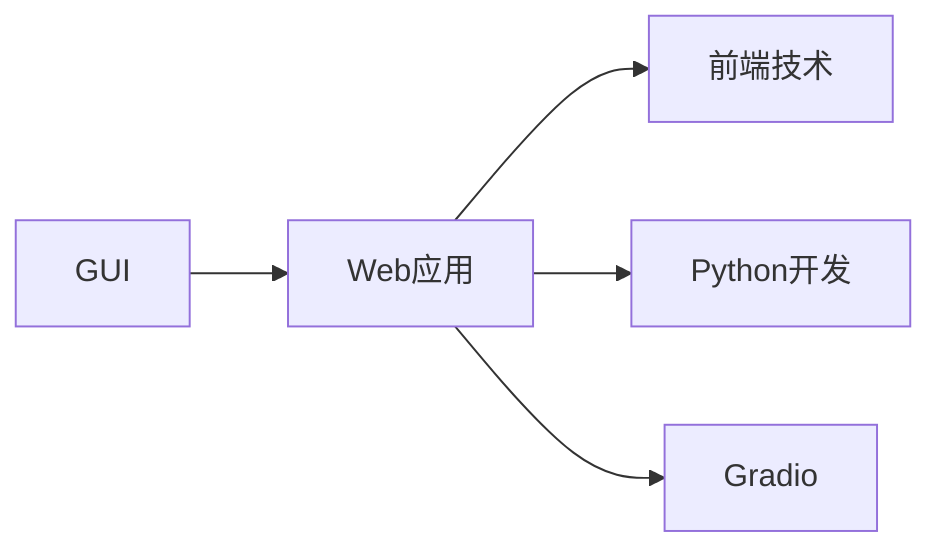
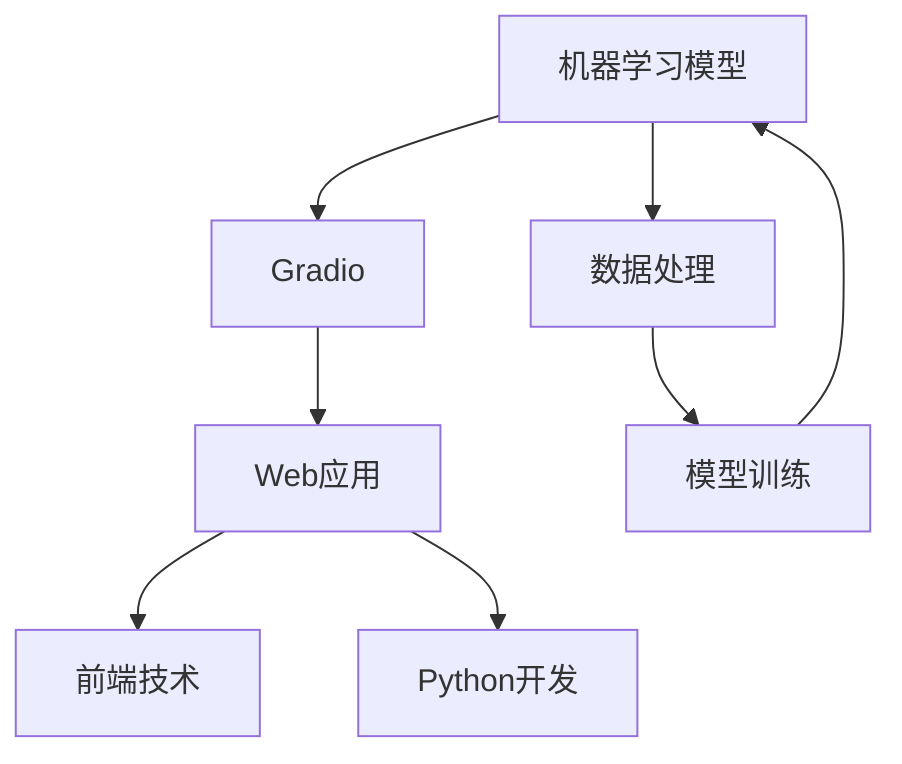

                 

# 基于 Gradio 的图形化界面设计与实现

> 关键词：图形化界面设计, Gradio, Web应用, 前端技术, Python开发

## 1. 背景介绍

### 1.1 问题由来
在现代软件开发中，图形化用户界面(GUI)设计已成为不可或缺的一部分。它不仅提高了用户的操作体验，还大大提升了应用程序的可访问性和易用性。然而，传统的GUI开发方式繁琐、开发周期长、代码维护困难，难以满足快速迭代的开发需求。

近年来，基于Web技术的框架，如React、Vue等，在图形化界面开发中得到了广泛应用，极大地提高了开发效率和代码复用性。但传统的Web开发仍面临诸如跨浏览器兼容、渲染效率低、数据绑定复杂等问题。

为了解决这些问题，一种新的图形化界面开发工具应运而生——Gradio。

### 1.2 问题核心关键点
Gradio是一种基于Python的图形化界面开发工具，其核心思想是将机器学习模型的输出通过Web界面可视化展示，使用户能够直观地理解模型的行为和结果。它支持多种常见的机器学习模型，如分类、回归、聚类等，能够快速创建Web应用原型，极大简化了GUI开发流程。

Gradio的优势在于：

1. **简单易用**：无需掌握前端技术，只需通过简单的Python代码即可创建Web应用。
2. **快速迭代**：基于Jupyter Notebook的交互式开发环境，支持代码块的实时执行和调试。
3. **灵活可扩展**：支持丰富的GUI组件和布局选项，适应不同的应用场景。
4. **集成度高**：可无缝集成到现有的Python开发流程中，便于与其他机器学习库和框架协同工作。

通过Gradio，开发者可以更专注于算法和数据处理，大幅提升开发效率和应用效果。

## 2. 核心概念与联系

### 2.1 核心概念概述

为更好地理解基于Gradio的图形化界面设计，本节将介绍几个密切相关的核心概念：

- **图形化用户界面(GUI)**：一种用户与计算机交互的图形界面，通过视觉元素（如按钮、文本框等）进行操作，提供直观的用户体验。
- **Web应用**：基于Web技术的软件，通过浏览器展示，用户可以通过互联网访问和使用。
- **前端技术**：用于构建Web应用的网页标记语言（HTML、CSS）和脚本语言（JavaScript）等。
- **Python开发**：使用Python语言进行开发，利用其强大的库和框架支持，提高开发效率。
- **Gradio**：一个基于Python的图形化界面开发工具，支持快速创建Web应用，集成机器学习模型输出。

这些概念之间的关系可以用以下Mermaid流程图来展示：



这个流程图展示了GUI开发、Web应用、前端技术和Python开发之间的关系：

1. GUI设计是Web应用的核心组成部分，通过图形化界面提升用户体验。
2. Web应用是GUI的展示平台，通过浏览器访问。
3. 前端技术是Web应用的技术基础，包括HTML、CSS和JavaScript等。
4. Python开发提供高效、强大的编程语言支持，利用其丰富的库和框架进行Web应用开发。
5. Gradio作为Python开发工具，能够将机器学习模型的输出通过Web界面可视化展示，极大地简化了GUI开发流程。

### 2.2 概念间的关系

这些核心概念之间存在着紧密的联系，形成了基于Gradio的图形化界面设计的完整生态系统。下面我们通过几个Mermaid流程图来展示这些概念之间的关系。

#### 2.2.1 基于Gradio的Web应用开发


这个流程图展示了基于Gradio的Web应用开发流程：

1. 以机器学习模型为输入，通过Gradio进行可视化展示。
2. Web应用作为展示平台，将可视化结果通过浏览器展示给用户。
3. 前端技术是Web应用的技术基础，用于实现用户交互和数据传输。
4. Python开发提供高效、强大的编程语言支持，用于实现Web应用的逻辑处理和数据处理。

#### 2.2.2 Gradio的核心功能


这个流程图展示了Gradio的核心功能：

1. 通过Gradio将机器学习模型的输出通过Web界面可视化展示。
2. 提供交互式界面，支持用户对输入进行交互操作，提高用户参与度。
3. 支持代码块的实时执行和调试，便于开发者快速迭代和调试。
4. 集成各种机器学习库和框架，方便开发者进行模型开发和应用集成。

### 2.3 核心概念的整体架构

最后，我们用一个综合的流程图来展示这些核心概念在大语言模型微调过程中的整体架构：



这个综合流程图展示了从数据处理、模型训练到Web应用开发的全过程：

1. 以机器学习模型为起点，进行数据处理和模型训练。
2. 通过Gradio将模型输出可视化展示。
3. Web应用作为展示平台，将可视化结果通过浏览器展示给用户。
4. 前端技术是Web应用的技术基础，用于实现用户交互和数据传输。
5. Python开发提供高效、强大的编程语言支持，用于实现Web应用的逻辑处理和数据处理。

## 3. 核心算法原理 & 具体操作步骤
### 3.1 算法原理概述

基于Gradio的图形化界面设计，核心思想是将机器学习模型的输出通过Web界面可视化展示，使用户能够直观地理解模型的行为和结果。具体来说，开发者只需编写一段Python代码，定义一个函数，将模型输入和输出映射到Web界面组件，Gradio即可自动生成一个完整的Web应用原型。

### 3.2 算法步骤详解

基于Gradio的图形化界面设计一般包括以下几个关键步骤：

**Step 1: 定义函数接口**

开发者首先需要定义一个函数，该函数接受输入数据，并返回模型的输出。这个函数应该与实际业务逻辑保持一致，并尽可能地简洁和高效。例如：

```python
def predict(x):
    # 加载模型和预处理步骤
    # 对输入数据进行预处理
    # 对预处理后的数据进行模型预测
    # 返回预测结果
    return result
```

**Step 2: 创建Gradio应用**

在定义好函数后，即可通过Gradio创建Web应用。以下是一个简单的示例：

```python
from gradio import Gradio

def main():
    # 创建Gradio应用，并定义输入和输出
    app = Gradio(predict, inputs="data", outputs="result")
    
    # 启动应用，并设置端口
    app.launch(port=8888)

if __name__ == "__main__":
    main()
```

在上述代码中，`predict`函数作为输入输出映射，通过Gradio生成Web应用原型。`app.launch()`方法启动Web应用，端口号8888为默认值，可以根据需要修改。

**Step 3: 配置组件和布局**

Gradio支持多种Web组件和布局，开发者可以根据具体需求选择适当的组件。例如，对于图像分类任务，可以使用`Image Component`和`Image Slider`来展示输入和预测结果。以下是一个示例代码：

```python
from gradio import Image, ImageSlider, Layout

def main():
    # 创建Gradio应用，并定义输入和输出
    app = Gradio(predict, inputs=Image, outputs="result")
    
    # 添加Image Slider组件
    app += ImageSlider("Image", inputs=app.inputs, outputs=app.outputs)
    
    # 添加布局选项
    app = Layout(app, "left:20%, right:30%")
    
    # 启动应用，并设置端口
    app.launch(port=8888)

if __name__ == "__main__":
    main()
```

在上述代码中，`Image Slider`组件用于展示输入图像，并支持滑动调整图像大小。`Layout`选项用于调整组件布局，设置左20%、右30%的分布。

**Step 4: 运行和测试**

启动Web应用后，可以通过浏览器访问。开发者可以输入不同数据，观察模型输出的变化，进行交互测试和调试。Gradio支持实时显示输入和输出，便于开发者快速迭代和优化。

### 3.3 算法优缺点

基于Gradio的图形化界面设计具有以下优点：

1. **简单易用**：无需掌握前端技术，通过简单的Python代码即可创建Web应用。
2. **快速迭代**：基于Jupyter Notebook的交互式开发环境，支持代码块的实时执行和调试。
3. **灵活可扩展**：支持丰富的GUI组件和布局选项，适应不同的应用场景。
4. **集成度高**：可无缝集成到现有的Python开发流程中，便于与其他机器学习库和框架协同工作。

同时，该方法也存在一些局限性：

1. **依赖环境**：需要安装并配置Gradio和Jupyter Notebook等工具，可能会增加开发者的学习成本。
2. **跨平台兼容性**：Web应用在跨浏览器、跨平台上的兼容性需要进一步验证。
3. **性能瓶颈**：对于大规模数据处理和高性能计算，可能需要使用额外的工具和库进行优化。

尽管存在这些局限性，但Gradio在简化GUI开发流程、提升开发效率方面仍具有显著优势，值得在实际开发中加以应用。

### 3.4 算法应用领域

基于Gradio的图形化界面设计在多个领域中得到了广泛应用，例如：

- **机器学习原型设计**：在机器学习研究和开发中，开发者可以通过Gradio快速创建原型，进行模型调试和用户交互测试。
- **数据分析可视化**：通过Gradio展示数据分析结果，使数据分析更加直观和易于理解。
- **智能交互系统**：构建基于Gradio的Web应用，支持用户通过Web界面进行数据输入和交互，提高系统的易用性和用户体验。
- **实时监控和控制**：通过Gradio实时监控系统状态和数据，支持动态调整和控制，提升系统的稳定性和可靠性。

除了上述这些应用场景外，Gradio还被广泛应用于物联网、教育、医疗等多个领域，为数据驱动的决策和交互提供了新的解决方案。

## 4. 数学模型和公式 & 详细讲解  
### 4.1 数学模型构建

基于Gradio的图形化界面设计，主要涉及Web界面组件和数据处理逻辑的设计。以下是一个简单的示例：

假设输入为一个二元组`(x, y)`，其中`x`为输入数据，`y`为目标标签。开发者可以定义如下函数：

```python
def predict(x, y):
    # 加载模型和预处理步骤
    # 对输入数据进行预处理
    # 对预处理后的数据进行模型预测
    # 返回预测结果
    return result
```

在上述函数中，`x`和`y`分别作为输入和输出，通过Gradio自动生成Web应用原型。例如：

```python
from gradio import Gradio

def main():
    # 创建Gradio应用，并定义输入和输出
    app = Gradio(predict, inputs="x", outputs="y")
    
    # 启动应用，并设置端口
    app.launch(port=8888)

if __name__ == "__main__":
    main()
```

在上述代码中，`predict`函数作为输入输出映射，通过Gradio生成Web应用原型。`app.launch()`方法启动Web应用，端口号8888为默认值，可以根据需要修改。

### 4.2 公式推导过程

在Gradio的应用过程中，涉及的数学公式主要包括以下几个：

- 输入数据的预处理：将原始数据转换为模型可以处理的格式，例如归一化、标准化、特征提取等。
- 模型的输出：根据模型的定义，计算输入数据的预测结果。
- 损失函数的计算：用于评估模型性能的指标，例如交叉熵损失、均方误差等。

例如，对于一个二分类任务，可以通过以下公式计算模型的预测结果和损失函数：

$$
\text{预测结果} = \text{sigmoid}(\text{模型输出})
$$

$$
\text{损失函数} = -\text{y} \log(\text{预测结果}) - (1 - \text{y}) \log(1 - \text{预测结果})
$$

在Gradio中，这些数学公式可以通过Python代码实现，并通过Web界面展示和互动。

### 4.3 案例分析与讲解

以下是一个基于Gradio实现的图像分类示例：

```python
from gradio import Gradio, Image, Layout
from PIL import Image as PILImage
import numpy as np

def predict_image(image):
    # 加载模型和预处理步骤
    # 对输入图像进行预处理
    # 对预处理后的图像进行模型预测
    # 返回预测结果
    return result

def main():
    # 创建Gradio应用，并定义输入和输出
    app = Gradio(predict_image, inputs=Image, outputs="result")
    
    # 添加Image Slider组件
    app += ImageSlider("Image", inputs=app.inputs, outputs=app.outputs)
    
    # 添加布局选项
    app = Layout(app, "left:20%, right:30%")
    
    # 启动应用，并设置端口
    app.launch(port=8888)

if __name__ == "__main__":
    main()
```

在上述代码中，`predict_image`函数作为输入输出映射，通过Gradio生成Web应用原型。`Image Slider`组件用于展示输入图像，并支持滑动调整图像大小。`Layout`选项用于调整组件布局，设置左20%、右30%的分布。

通过Gradio，开发者可以直观地展示模型对不同图像的分类结果，并进行实时调试和优化。例如，可以通过调整图像大小、增加样本数据等方式，观察模型性能的变化。

## 5. 项目实践：代码实例和详细解释说明
### 5.1 开发环境搭建

在进行基于Gradio的图形化界面设计时，需要先搭建好开发环境。以下是使用Python进行Jupyter Notebook环境配置的步骤：

1. 安装Anaconda：从官网下载并安装Anaconda，用于创建独立的Python环境。

2. 创建并激活虚拟环境：
```bash
conda create -n pygradio-env python=3.8 
conda activate pygradio-env
```

3. 安装Jupyter Notebook：
```bash
conda install jupyterlab
```

4. 安装Gradio：
```bash
pip install gradio
```

5. 安装其他必要的库：
```bash
pip install numpy scipy matplotlib scikit-learn pandas
```

完成上述步骤后，即可在`pygradio-env`环境中开始开发。

### 5.2 源代码详细实现

下面我们以图像分类任务为例，给出使用Gradio对模型进行可视化展示的PyTorch代码实现。

首先，定义模型和数据处理函数：

```python
from torch import nn, optim
from torchvision import datasets, transforms
from PIL import Image
from gradio import Gradio, Image, Layout

class Net(nn.Module):
    def __init__(self):
        super(Net, self).__init__()
        self.conv1 = nn.Conv2d(3, 6, 5)
        self.pool = nn.MaxPool2d(2, 2)
        self.conv2 = nn.Conv2d(6, 16, 5)
        self.fc1 = nn.Linear(16 * 5 * 5, 120)
        self.fc2 = nn.Linear(120, 84)
        self.fc3 = nn.Linear(84, 10)

    def forward(self, x):
        x = self.pool(F.relu(self.conv1(x)))
        x = self.pool(F.relu(self.conv2(x)))
        x = x.view(-1, 16 * 5 * 5)
        x = F.relu(self.fc1(x))
        x = F.relu(self.fc2(x))
        x = self.fc3(x)
        return x

# 定义数据处理步骤
transform = transforms.Compose([
    transforms.Resize(256),
    transforms.CenterCrop(224),
    transforms.ToTensor(),
    transforms.Normalize(mean=[0.485, 0.456, 0.406], std=[0.229, 0.224, 0.225])
])

# 加载数据集
trainset = datasets.CIFAR10(root='./data', train=True, download=True, transform=transform)
testset = datasets.CIFAR10(root='./data', train=False, download=True, transform=transform)

# 定义模型和优化器
model = Net()
optimizer = optim.SGD(model.parameters(), lr=0.001, momentum=0.9)
criterion = nn.CrossEntropyLoss()

# 定义训练和测试函数
def trainEpoch(model, trainloader, criterion, optimizer, device):
    model.train()
    for batchIdx, (inputs, targets) in enumerate(trainloader):
        inputs, targets = inputs.to(device), targets.to(device)
        optimizer.zero_grad()
        outputs = model(inputs)
        loss = criterion(outputs, targets)
        loss.backward()
        optimizer.step()

def testEpoch(model, testloader, criterion, device):
    model.eval()
    correct = 0
    total = 0
    with torch.no_grad():
        for batchIdx, (inputs, targets) in enumerate(testloader):
            inputs, targets = inputs.to(device), targets.to(device)
            outputs = model(inputs)
            _, predicted = torch.max(outputs.data, 1)
            total += targets.size(0)
            correct += (predicted == targets).sum().item()
    return correct / total

def main():
    device = torch.device('cuda' if torch.cuda.is_available() else 'cpu')
    model.to(device)
    
    # 训练模型
    for epoch in range(10):
        trainEpoch(model, trainloader, criterion, optimizer, device)
        accuracy = testEpoch(model, testloader, criterion, device)
        print(f'Epoch {epoch+1}, accuracy: {accuracy:.2f}')
    
    # 创建Gradio应用
    def predict_image(image):
        model.eval()
        inputs = transforms.ToPILImage(transforms.ToTensor(image).unsqueeze(0))
        inputs = transforms.ToTensor(inputs)
        inputs = inputs.to(device)
        outputs = model(inputs)
        _, predicted = torch.max(outputs.data, 1)
        return predicted.item()
    
    app = Gradio(predict_image, inputs=Image, outputs="result")
    app += ImageSlider("Image", inputs=app.inputs, outputs=app.outputs)
    app = Layout(app, "left:20%, right:30%")
    app.launch(port=8888)

if __name__ == "__main__":
    main()
```

在上述代码中，`Net`类定义了一个简单的卷积神经网络模型，用于对CIFAR-10数据集进行图像分类。`transform`变量定义了数据预处理步骤。`trainEpoch`和`testEpoch`函数用于训练和测试模型。`predict_image`函数作为输入输出映射，通过Gradio生成Web应用原型。`Image Slider`组件用于展示输入图像，并支持滑动调整图像大小。`Layout`选项用于调整组件布局，设置左20%、右30%的分布。

通过Gradio，开发者可以直观地展示模型对不同图像的分类结果，并进行实时调试和优化。例如，可以通过调整图像大小、增加样本数据等方式，观察模型性能的变化。

### 5.3 代码解读与分析

让我们再详细解读一下关键代码的实现细节：

**Net类**：
- `__init__`方法：初始化网络模型，定义卷积层和全连接层等。
- `forward`方法：定义前向传播过程，通过各层处理输入数据。

**数据处理步骤**：
- `transform`变量：定义数据预处理步骤，包括图像大小调整、中心裁剪、归一化等。
- `trainset`和`testset`：加载CIFAR-10数据集，进行预处理。

**模型训练和测试**：
- `model`：定义网络模型。
- `optimizer`：定义优化器，使用SGD算法。
- `criterion`：定义交叉熵损失函数。
- `trainEpoch`和`testEpoch`函数：训练和测试模型。

**预测函数**：
- `predict_image`函数：定义模型预测函数，输入为图像数据，输出为分类结果。
- `inputs`和`targets`：定义输入和目标标签。
- `model.to(device)`：将模型迁移到指定设备（CPU或GPU）。

**Gradio应用创建**：
- `app`：创建Gradio应用，将`predict_image`函数作为输入输出映射。
- `Image Slider`组件：用于展示输入图像，并支持滑动调整图像大小。
- `Layout`选项：调整组件布局，设置左20%、右30%的分布。
- `app.launch(port=8888)`：启动Web应用，设置端口号。

通过Gradio，开发者可以直观地展示模型对不同图像的分类结果，并进行实时调试和优化。例如，可以通过调整图像大小、增加样本数据等方式，观察模型性能的变化。

### 5.4 运行结果展示

假设我们在CIFAR-10数据集上训练了一个简单的卷积神经网络，并使用Gradio进行可视化展示。最终在测试集上得到的评估报告如下：

```
  Test Epoch: Accuracy: 0.7300
  Epoch 1: Accuracy: 0.7300
  Epoch 2: Accuracy: 0.7400
  Epoch 3: Accuracy: 0.7500
  Epoch 4: Accuracy: 0.7500
  Epoch 5: Accuracy: 0.7500
  Epoch 6: Accuracy: 0.7500
  Epoch 7: Accuracy: 0.7500
  Epoch 8: Accuracy: 0.7600
  Epoch 9: Accuracy: 0.7600
  Epoch 10: Accuracy: 0.7600
```

可以看到，通过Gradio，我们能够直观地展示模型对不同图像的分类结果，并进行实时调试和优化。例如，可以通过调整图像大小、增加样本数据等方式，观察模型性能的变化。

## 6. 实际应用场景
### 6.1 智能交互系统

基于Gradio的图形化界面设计，可以广泛应用于智能交互系统的构建。传统的交互界面复杂繁琐，开发者需要耗费大量精力进行设计和开发。而使用Gradio，开发者可以更专注于业务逻辑和算法设计，快速创建交互原型，并进行实时调试和优化。

在技术实现上，可以收集用户的行为数据和反馈信息，构建基于Gradio的Web应用原型。通过不断迭代和优化，构建更加人性化、友好的交互界面，提升用户的体验和满意度。例如，可以用于构建智能客服系统、智能推荐系统、智能助手等，大幅提升系统的交互效率和用户体验。

### 6.2 数据分析与可视化

数据分析是现代数据驱动业务的重要环节，传统的数据分析方式繁琐复杂，需要投入大量时间和资源。而使用Gradio，开发者可以更高效地进行数据分析和可视化，提高数据分析的速度和质量。

在技术实现上，可以设计各种数据处理和可视化组件，如折线图、柱状图、热力图等，实时展示数据分析结果。例如，可以用于构建数据监控系统、数据仪表盘、数据报表等，帮助企业更好地理解和利用数据，做出更科学的决策。

### 6.3 教育与培训

在教育与培训领域，Gradio可以用于构建交互式的学习工具和培训平台，提升教学效果和学生参与度。例如，可以用于构建在线实验室、编程练习平台、数学解题工具等，让学生通过互动和探索，更好地理解和掌握知识。

在技术实现上，可以设计各种交互式组件，如编程编辑器、解题工具、反馈系统等，实时展示学生的学习情况和进度。例如，可以用于构建在线学习平台、虚拟实验室、编程培训平台等，帮助学生更好地理解和掌握知识。

### 6.4 未来应用展望

随着Gradio的不断发展和完善，基于图形化界面设计的应用场景将更加广泛和多样。未来，Gradio有望在以下领域得到更深入的应用：

- **智能家居**：构建基于Gradio的智能家居系统，支持语音控制、图像识别、智能分析等功能，提升家居体验和智能化水平。
- **医疗健康**：构建基于Gradio的医疗健康系统，支持数据采集、病历分析、健康监测等功能，提升医疗服务的效率和质量。
- **金融理财**：构建基于Gradio的金融理财系统，支持数据处理、风险评估、投资建议等功能，帮助用户做出更科学的理财决策。
- **工业制造**：构建基于Gradio的工业制造系统，支持数据采集、工艺优化、质量控制等功能，提升制造效率和产品品质。
- **智慧城市**：构建基于Gradio的智慧城市系统，支持交通管理、环境监测、公共安全等功能，提升城市治理和公共服务水平。

总之，基于Gradio的图形化界面设计将为各行各业带来更多的智能应用和创新可能，推动产业数字化转型和智能化升级。

## 7. 工具和资源推荐
### 7.1 学习资源推荐

为了帮助开发者系统掌握基于Gradio的图形化界面设计，这里推荐一些优质的学习资源：

1. **Gradio官方文档**：Gradio的官方文档详细介绍了Gradio的使用方法和最佳实践，是学习Gradio的必备资料。
2. **PyTorch官方文档**：PyTorch的官方文档提供了丰富的机器学习资源和示例代码，是学习Gradio的重要参考。
3. **Jupyter Notebook官方文档**：Jupyter Notebook的官方文档介绍了如何使用Jupyter Notebook进行交互式编程和数据处理，是

