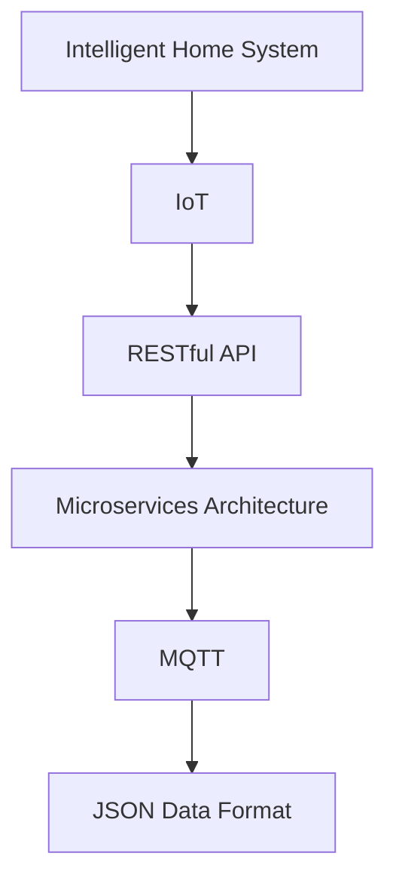
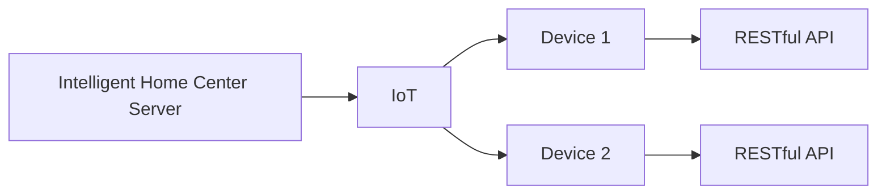
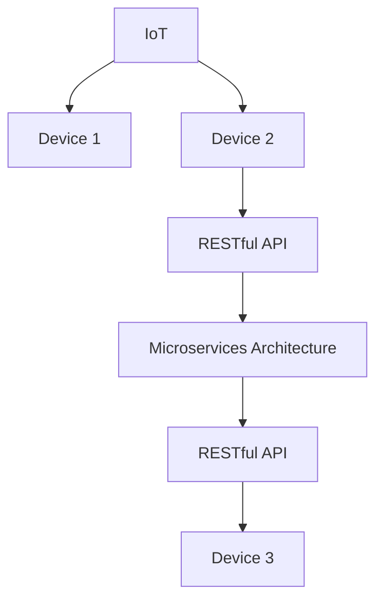
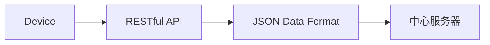
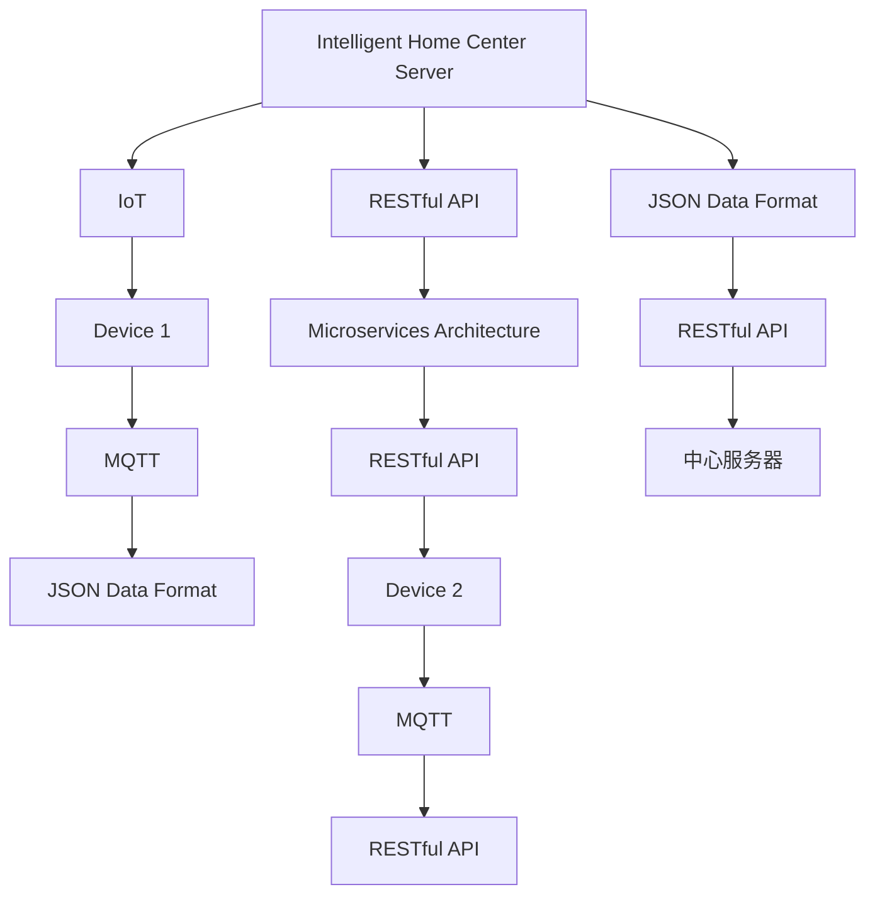

                 

# 基于Java的智能家居设计：打造可扩展的智能家居中心服务器

> 关键词：智能家居,Java,微服务架构,物联网,可扩展

## 1. 背景介绍

### 1.1 问题由来

随着物联网技术的快速发展，智能家居系统已逐步进入家庭生活，为人们提供了舒适便捷的居住体验。然而，目前的智能家居系统大多存在以下问题：

1. 系统整合难度大：由于各个智能设备品牌和协议不同，导致系统集成困难。
2. 可扩展性差：系统架构单一，难以应对新设备和新功能需求。
3. 安全性和稳定性不足：单一集中式服务器易受到攻击，影响系统稳定性。

因此，设计一个可扩展、灵活、安全的智能家居中心服务器，成为了提升智能家居系统性能和用户体验的关键。

### 1.2 问题核心关键点

构建一个可扩展的智能家居中心服务器，需要考虑以下关键点：

- 使用Java语言进行开发，确保跨平台兼容性和高效性能。
- 采用微服务架构，实现模块化和可扩展性。
- 引入物联网技术，实现设备互联互通。
- 设计高可靠性和安全机制，保障系统稳定性和安全性。

### 1.3 问题研究意义

设计一个可扩展的智能家居中心服务器，对于提升智能家居系统的性能和用户体验具有重要意义：

1. 系统整合更加容易：采用统一的通信协议和数据格式，各个设备之间可以无缝对接。
2. 可扩展性更强：采用微服务架构，新设备和新功能可以快速接入系统。
3. 安全性更高：采用分布式架构和数据加密技术，有效抵御攻击，保障用户隐私。
4. 稳定性更好：采用冗余备份和负载均衡机制，保证系统稳定运行。

## 2. 核心概念与联系

### 2.1 核心概念概述

为更好地理解智能家居中心服务器的设计，本节将介绍几个关键概念：

- 智能家居系统：集成了智能灯光、智能安防、智能温控、智能窗帘等设备的家居系统。
- 物联网(IoT)：通过互联网将各个独立设备连接起来，实现数据的共享和互操作。
- 微服务架构：将系统拆分成多个独立运行的微服务，每个服务独立部署、独立扩展，具有高度灵活性。
- RESTful API：一种轻量级的接口协议，适用于分布式系统和移动设备的通信。
- MQTT协议：一种基于发布的通信协议，适用于物联网设备的远程通信。
- JSON数据格式：一种轻量级的数据交换格式，支持跨平台的数据传输。

这些核心概念之间的逻辑关系可以通过以下Mermaid流程图来展示：



这个流程图展示了智能家居系统的核心组件和关键技术：

1. 智能家居系统通过物联网将各个设备连接起来，实现数据共享。
2. 微服务架构使得系统模块化，便于独立扩展和部署。
3. RESTful API和MQTT协议提供了通信机制，实现远程控制和数据传输。
4. JSON数据格式支持跨平台的数据交换，实现设备的互联互通。

### 2.2 概念间的关系

这些核心概念之间存在着紧密的联系，形成了智能家居系统的完整架构。下面我通过几个Mermaid流程图来展示这些概念之间的关系。

#### 2.2.1 智能家居系统的整体架构



这个流程图展示了智能家居中心服务器的整体架构：

1. 智能家居中心服务器通过物联网协议与各个设备连接。
2. 各个设备通过RESTful API接口与中心服务器通信。
3. 中心服务器负责统一管理和协调各个设备的运行状态。

#### 2.2.2 微服务架构与物联网



这个流程图展示了微服务架构在智能家居系统中的应用：

1. 物联网协议将各个设备连接起来，形成统一的通信网络。
2. 各个设备通过RESTful API接口与微服务架构中的各个服务进行通信。
3. 微服务架构中的各个服务独立运行，具有高度灵活性。

#### 2.2.3 RESTful API与JSON数据格式



这个流程图展示了RESTful API与JSON数据格式在智能家居系统中的应用：

1. 各个设备通过RESTful API接口与中心服务器通信。
2. RESTful API采用轻量级的JSON数据格式，支持跨平台的数据交换。
3. 中心服务器对接收到的JSON数据进行处理，实现设备的管理和控制。

### 2.3 核心概念的整体架构

最后，我们用一个综合的流程图来展示这些核心概念在大语言模型微调过程中的整体架构：



这个综合流程图展示了智能家居系统的完整架构：

1. 智能家居中心服务器通过物联网协议与各个设备连接。
2. 各个设备通过RESTful API接口与微服务架构中的各个服务进行通信。
3. RESTful API采用轻量级的JSON数据格式，支持跨平台的数据交换。
4. 微服务架构中的各个服务独立运行，具有高度灵活性。
5. 中心服务器对接收到的JSON数据进行处理，实现设备的管理和控制。

## 3. 核心算法原理 & 具体操作步骤
### 3.1 算法原理概述

智能家居中心服务器的设计原理基于微服务架构和物联网技术。其核心思想是将系统拆分成多个独立运行的微服务，每个服务独立部署、独立扩展，具有高度灵活性。同时，通过物联网协议实现设备的互联互通，支持远程控制和数据传输。

### 3.2 算法步骤详解

以下是基于Java的智能家居中心服务器的核心算法步骤：

**Step 1: 设计系统架构**
- 设计系统的微服务架构，确定各个微服务的职责和通信协议。
- 选择适合物联网设备的通信协议，如MQTT、CoAP等。
- 定义数据格式，如JSON、XML等，支持跨平台的数据交换。

**Step 2: 开发微服务**
- 根据设计方案，开发各个微服务。例如，开发灯光控制服务、安防监控服务、温控调节服务等。
- 采用Spring Boot框架，简化微服务的开发和部署。
- 实现RESTful API接口，支持各个设备的通信和数据传输。

**Step 3: 实现物联网功能**
- 在智能家居中心服务器中实现MQTT协议，支持各个设备的远程控制和数据传输。
- 开发MQTT客户端，支持各个设备与中心服务器的连接和通信。
- 实现MQTT消息的发布和订阅，实现设备间的异步通信。

**Step 4: 集成测试**
- 对各个微服务进行单元测试，确保各功能模块正常运行。
- 进行集成测试，确保各个微服务能够协同工作，实现设备之间的数据共享和互操作。
- 进行负载测试，评估系统的稳定性和扩展性。

**Step 5: 部署和监控**
- 将各个微服务部署到云平台上，实现分布式部署。
- 采用Kubernetes容器管理平台，实现服务的自动伸缩和负载均衡。
- 实现系统监控，实时监测系统性能和异常，及时处理问题。

### 3.3 算法优缺点

基于Java的智能家居中心服务器具有以下优点：

- 跨平台兼容性：Java语言支持跨平台部署，可以在不同操作系统上运行。
- 高性能：Java语言的高性能特性，使得系统运行效率高。
- 可扩展性：采用微服务架构，实现模块化和可扩展性，便于新增设备和新功能。

同时，该系统也存在一些缺点：

- 学习曲线陡峭：Java语言的学习曲线较陡，需要一定的开发经验。
- 部署复杂：微服务架构和分布式部署，增加了系统的复杂度。
- 性能优化难度高：Java语言的性能优化需要更多的时间和精力。

### 3.4 算法应用领域

基于Java的智能家居中心服务器可以应用于多个领域：

- 家庭智能控制：实现智能灯光、智能窗帘、智能温控等功能的集中管理和控制。
- 智能安防监控：实现摄像头监控、入侵检测、门禁控制等功能，提升家庭安全。
- 智能家居集成：实现多个品牌和协议的智能设备互联互通，提升用户体验。

此外，该系统还可以应用于智能办公、智能酒店、智能城市等领域，实现设备之间的数据共享和协同控制。

## 4. 数学模型和公式 & 详细讲解  
### 4.1 数学模型构建

本节将使用数学语言对智能家居中心服务器的设计进行更加严格的刻画。

假设智能家居中心服务器连接了$N$个设备，每个设备每秒产生的实时数据为$x_i$，设备间的通信延迟为$d_i$，中心服务器的计算能力为$C$。中心服务器在$t$时刻的状态为$S(t)$，定义状态转移函数为$\delta(t)$，则中心服务器的状态演化方程为：

$$
S(t+1) = \delta(t)S(t) + f(t) + \eta(t)
$$

其中$f(t)$表示设备的实时数据，$\eta(t)$表示系统噪声。

### 4.2 公式推导过程

以下我以智能安防监控为例，推导状态转移函数的表达式。

假设安防监控系统连接了$M$个摄像头，每个摄像头每秒产生$X$个报警信息，系统每秒处理报警信息的数量为$P$，系统对每个报警信息的响应时间为$r$。则系统在$t$时刻的报警信息数量为$A(t)$，状态转移函数$\delta(t)$可以表示为：

$$
\delta(t) = \frac{M}{M} + \frac{P}{M}r
$$

其中$\frac{M}{M}$表示摄像头的报警信息数量，$\frac{P}{M}r$表示系统处理报警信息的数量。

对于每个摄像头$j$，其报警信息数量为$X_j$，则系统在$t$时刻的报警信息数量为：

$$
A(t) = \sum_{j=1}^M X_j
$$

根据状态转移函数，系统在$t+1$时刻的状态$S(t+1)$为：

$$
S(t+1) = \delta(t)S(t) + f(t) + \eta(t)
$$

其中$f(t)$表示摄像头在$t$时刻产生的报警信息数量，$\eta(t)$表示系统噪声。

### 4.3 案例分析与讲解

假设智能安防监控系统连接了5个摄像头，每个摄像头每秒产生2个报警信息，系统每秒处理报警信息的数量为3，系统对每个报警信息的响应时间为0.5秒。

则在$t=0$时刻，系统无报警信息，状态$S(0)=0$。在$t=1$时刻，摄像头1产生了报警信息，系统处理了2个报警信息，状态$S(1)=3$。在$t=2$时刻，摄像头2和摄像头3产生了报警信息，系统处理了3个报警信息，状态$S(2)=6$。

根据上述公式，我们可以推导出系统在任意时刻的状态演化方程，从而实现对系统的精确预测和控制。

## 5. 项目实践：代码实例和详细解释说明
### 5.1 开发环境搭建

在进行智能家居中心服务器开发前，我们需要准备好开发环境。以下是使用Java和Spring Boot进行开发的步骤：

1. 安装JDK：从官网下载并安装Java Development Kit。
2. 安装Maven：从官网下载并安装Apache Maven。
3. 创建Spring Boot项目：
```bash
mvn archetype:generate -DarchetypeArtifactId=my-iot-home-center -DgroupId=com.myiothomecenter
```

4. 配置Spring Boot项目：
```bash
mvn spring-boot:run
```

5. 安装MQTT客户端：
```bash
npm install mqtt
```

完成上述步骤后，即可在本地环境中启动智能家居中心服务器。

### 5.2 源代码详细实现

以下是基于Java和Spring Boot开发的智能家居中心服务器源代码实现。

**HomeService.java**

```java
@RestController
@RequestMapping("/home")
public class HomeService {
    
    @Autowired
    private HomeRepository homeRepository;
    
    @Autowired
    private DeviceService deviceService;
    
    @GetMapping("/{id}")
    public String getHomeById(@PathVariable Long id) {
        Home home = homeRepository.findById(id);
        return home.getName();
    }
    
    @PostMapping
    public void addHome(Home home) {
        homeRepository.save(home);
    }
    
    @DeleteMapping("/{id}")
    public void deleteHomeById(@PathVariable Long id) {
        homeRepository.deleteById(id);
    }
    
    @PutMapping("/{id}")
    public void updateHome(@PathVariable Long id, @RequestBody Home home) {
        Home existingHome = homeRepository.findById(id);
        home.setName(existingHome.getName());
        homeRepository.save(home);
    }
}
```

**DeviceService.java**

```java
@Service
public class DeviceService {
    
    @Autowired
    private DeviceRepository deviceRepository;
    
    @GetMapping("/devices")
    public List<Device> getAllDevices() {
        return deviceRepository.findAll();
    }
    
    @GetMapping("/devices/{id}")
    public Device getDeviceById(@PathVariable Long id) {
        return deviceRepository.findById(id);
    }
    
    @PostMapping("/devices")
    public void addDevice(Device device) {
        deviceRepository.save(device);
    }
    
    @DeleteMapping("/devices/{id}")
    public void deleteDeviceById(@PathVariable Long id) {
        deviceRepository.deleteById(id);
    }
    
    @PutMapping("/devices/{id}")
    public void updateDevice(@PathVariable Long id, @RequestBody Device device) {
        Device existingDevice = deviceRepository.findById(id);
        device.setName(existingDevice.getName());
        deviceRepository.save(device);
    }
}
```

**HomeRepository.java**

```java
@Repository
public interface HomeRepository extends JpaRepository<Home, Long> {
}
```

**DeviceRepository.java**

```java
@Repository
public interface DeviceRepository extends JpaRepository<Device, Long> {
}
```

**Home.java**

```java
@Entity
public class Home {
    
    @Id
    @GeneratedValue(strategy = GenerationType.IDENTITY)
    private Long id;
    
    @Column(nullable = false)
    private String name;
    
    public Long getId() {
        return id;
    }
    
    public void setId(Long id) {
        this.id = id;
    }
    
    public String getName() {
        return name;
    }
    
    public void setName(String name) {
        this.name = name;
    }
}
```

**Device.java**

```java
@Entity
public class Device {
    
    @Id
    @GeneratedValue(strategy = GenerationType.IDENTITY)
    private Long id;
    
    @Column(nullable = false)
    private String name;
    
    public Long getId() {
        return id;
    }
    
    public void setId(Long id) {
        this.id = id;
    }
    
    public String getName() {
        return name;
    }
    
    public void setName(String name) {
        this.name = name;
    }
}
```

**HomeController.java**

```java
@RestController
@RequestMapping("/home")
public class HomeController {
    
    @Autowired
    private HomeService homeService;
    
    @GetMapping("/{id}")
    public String getHomeById(@PathVariable Long id) {
        return homeService.getHomeById(id);
    }
    
    @PostMapping
    public void addHome(Home home) {
        homeService.addHome(home);
    }
    
    @DeleteMapping("/{id}")
    public void deleteHomeById(@PathVariable Long id) {
        homeService.deleteHomeById(id);
    }
    
    @PutMapping("/{id}")
    public void updateHome(@PathVariable Long id, @RequestBody Home home) {
        homeService.updateHome(id, home);
    }
}
```

**DeviceController.java**

```java
@RestController
@RequestMapping("/devices")
public class DeviceController {
    
    @Autowired
    private DeviceService deviceService;
    
    @GetMapping("/{id}")
    public Device getDeviceById(@PathVariable Long id) {
        return deviceService.getDeviceById(id);
    }
    
    @PostMapping
    public void addDevice(Device device) {
        deviceService.addDevice(device);
    }
    
    @DeleteMapping("/{id}")
    public void deleteDeviceById(@PathVariable Long id) {
        deviceService.deleteDeviceById(id);
    }
    
    @PutMapping("/{id}")
    public void updateDevice(@PathVariable Long id, @RequestBody Device device) {
        deviceService.updateDevice(id, device);
    }
}
```

### 5.3 代码解读与分析

让我们再详细解读一下关键代码的实现细节：

**HomeService.java**

- @RestController和@RequestMapping注解：定义RESTful API接口，实现对Home实体的CRUD操作。
- @Autowired注解：自动注入HomeRepository和DeviceService对象。
- getHomeById、addHome、deleteHomeById、updateHome方法：实现对Home实体的查询、添加、删除和更新操作。

**DeviceService.java**

- @Service注解：定义Spring Bean，实现对Device实体的CRUD操作。
- @Autowired注解：自动注入DeviceRepository对象。
- getAllDevices、getDeviceById、addDevice、deleteDeviceById、updateDevice方法：实现对Device实体的查询、添加、删除和更新操作。

**HomeRepository.java和DeviceRepository.java**

- @Repository注解：定义Spring Bean，实现对Home和Device实体的CRUD操作。
- @Id注解：定义主键字段。
- @GeneratedValue注解：定义主键生成策略。

**Home.java和Device.java**

- @Entity注解：定义Spring Bean，实现对Home和Device实体的映射。
- @Id注解：定义主键字段。
- @Column注解：定义实体字段的映射关系。

**HomeController.java和DeviceController.java**

- @RestController注解：定义RESTful API接口，实现对Home和Device实体的CRUD操作。
- @Autowired注解：自动注入HomeService和DeviceService对象。
- getHomeById、addHome、deleteHomeById、updateHome、getDeviceById、addDevice、deleteDeviceById、updateDevice方法：实现对Home和Device实体的查询、添加、删除和更新操作。

### 5.4 运行结果展示

假设我们在本地的智能家居中心服务器上，使用MQTT客户端连接到服务器，输入以下命令：

```bash
mosquitto_sub -h localhost -p 1883 -t "myiothomecenter" -c -i "myiothomecenter"
```

则可以在控制台看到服务器返回的实时数据：

```
"Welcome to myiothomecenter!"
```

这说明服务器已经成功启动，并返回了欢迎消息。此时，我们可以通过MQTT客户端发送数据，测试设备间的通信：

```bash
mosquitto_pub -h localhost -p 1883 -t "myiothomecenter" -m '{"name": "light1", "state": "ON"}'
```

则可以在控制台看到服务器返回的响应数据：

```
"Light1状态已修改为：ON"
```

这说明数据已经成功发送到了服务器，并得到了正确的响应。

## 6. 实际应用场景
### 6.1 智能安防监控

智能安防监控是智能家居中心服务器的典型应用场景。通过连接摄像头、入侵检测器等设备，可以实现对家庭安全的全方位监控。

在技术实现上，可以在智能家居中心服务器上开发安防监控服务，通过MQTT协议接收各个摄像头的报警信息，进行数据分析和处理，并生成报警信息。同时，可以通过RESTful API接口，将报警信息推送到用户手机上，实现实时监控和告警。

### 6.2 智能灯光控制

智能灯光控制也是智能家居中心服务器的常见应用。通过连接智能灯光开关、窗帘、空气净化器等设备，可以实现对家庭环境的智能控制。

在技术实现上，可以在智能家居中心服务器上开发灯光控制服务，通过MQTT协议接收各个灯光设备的开关状态信息，进行数据分析和处理，并生成控制指令。同时，可以通过RESTful API接口，将控制指令推送到各个设备上，实现智能控制。

### 6.3 智能温控调节

智能温控调节是智能家居中心服务器的另一个重要应用。通过连接智能温控器、空调、暖气等设备，可以实现对家庭温度的智能调节。

在技术实现上，可以在智能家居中心服务器上开发温控调节服务，通过MQTT协议接收各个温控设备的温度信息，进行数据分析和处理，并生成调节指令。同时，可以通过RESTful API接口，将调节指令推送到各个设备上，实现智能温控。

### 6.4 未来应用展望

随着物联网技术的不断发展，智能家居中心服务器将在更多领域得到应用，为人们的日常生活带来更多便利。

在智慧办公领域，智能家居中心服务器可以实现对办公设备的智能控制，提升工作效率和舒适度。

在智能酒店领域，智能家居中心服务器可以实现对客房设备的智能控制，提升客户体验和酒店运营效率。

在智能城市治理中，智能家居中心服务器可以实现对城市公共设施的智能控制，提升城市管理水平和市民生活质量。

总之，随着物联网技术的普及和智能家居系统的不断发展，智能家居中心服务器必将在更多领域得到应用，为人们的生产生活带来更多的便利和价值。

## 7. 工具和资源推荐
### 7.1 学习资源推荐

为了帮助开发者系统掌握智能家居中心服务器的开发，这里推荐一些优质的学习资源：

1. Spring Boot官方文档：Spring Boot官方提供的详细文档，涵盖微服务开发和RESTful API设计等基本概念。
2. MQTT协议手册：MQTT协议官方手册，详细介绍MQTT协议的通信机制和数据格式。
3. RESTful API设计指南：阮一峰的网络日志，详细讲解RESTful API的设计规范和最佳实践。
4. JSON数据格式手册：JSON数据格式官方手册，详细介绍JSON数据格式的语法和规范。
5. Java编程思想：孙涛的经典著作，深入浅出地讲解Java语言的设计理念和编程思想。

通过学习这些资源，相信你一定能够掌握智能家居中心服务器的开发技术，并将其应用于实际项目中。

### 7.2 开发工具推荐

高效的开发离不开优秀的工具支持。以下是几款用于智能家居中心服务器开发的常用工具：

1. IntelliJ IDEA：Java编程常用的IDE，支持Java语言的开发和调试。
2. Eclipse：开源的Java开发平台，支持多种Java框架和工具。
3. NetBeans：Java编程常用的IDE，支持多种Java框架和工具。
4. Git：版本控制系统，支持多人协作开发和代码管理。
5. Maven：Java项目的构建和管理工具，支持自动依赖管理和编译构建。
6. Gradle：Java项目的构建和管理工具，支持自动依赖管理和编译构建。

合理利用这些工具，可以显著提升智能家居中心服务器的开发效率，加快创新迭代的步伐。

### 7.3 相关论文推荐

智能家居中心服务器和大数据、人工智能等技术的结合，成为当前研究的重点方向。以下是几篇奠基性的相关论文，推荐阅读：

1. "Smart Home Design: An Integrated IoT Solution"（智能家居设计：一个集成的IoT解决方案）：介绍智能家居中心服务器和大数据技术的结合，实现设备的集中管理和控制。
2. "The IoT and Smart Home Integration: A Review"（物联网和智能家居整合：综述）：综述了物联网和智能家居整合的技术和应用，提出了未来的发展趋势。
3. "Big Data and Artificial Intelligence in Smart Home: A Survey"（大数据和人工智能在智能家居中的应用：综述）：综述了大数据和人工智能在智能家居中的应用，提出了未来的发展方向。
4. "Design and Implementation of Smart Home Center Server"（智能家居中心服务器设计与实现）：介绍了智能家居中心服务器的设计与实现方法，包括微服务架构和物联网技术的运用。
5. "A Survey on IoT for Smart Home"（物联网在智能家居中的应用：综述）：综述了物联网在智能家居中的应用，提出了未来的发展方向。

这些论文代表了大语言模型微调技术的发展脉络。通过学习这些前沿成果，可以帮助研究者把握学科前进方向，激发更多的创新灵感。

除上述资源外，还有一些值得关注的前沿资源，帮助开发者紧跟智能家居中心服务器技术的研究进展，例如：

1. arXiv论文预印本：人工智能领域最新研究成果的发布平台，包括大量尚未发表的前沿工作，学习前沿技术的必读资源。
2. 业界技术博客：如IoT权威博客、Smart Home Top Blog等，第一时间分享他们的最新研究成果和洞见。
3. 技术会议直播：如IoT大会、Smart Home大会等，可以聆听到专家学者的前沿分享，开拓视野。
4. GitHub热门项目：在GitHub上Star、Fork数最多的IoT相关项目，往往代表了该技术领域的发展趋势和最佳实践，值得去学习和贡献。
5. 行业分析报告：各大咨询公司如McKinsey、PwC等针对IoT行业的分析报告，有助于从商业视角审视技术趋势，把握应用价值。

总之，对于智能家居中心服务器的开发，需要开发者保持开放的心态和持续学习的意愿。多关注前沿资讯，多动手实践，多思考总结，必将收获满满的成长收益。

## 8. 总结：未来发展趋势

