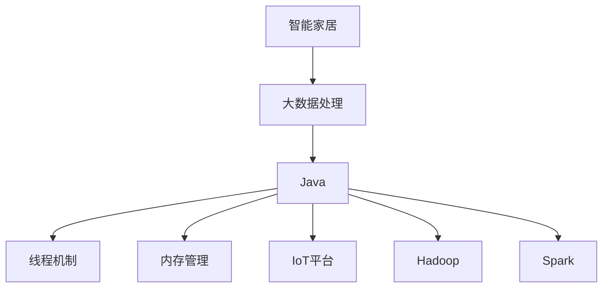
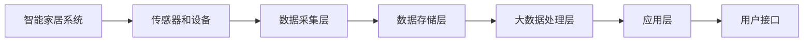
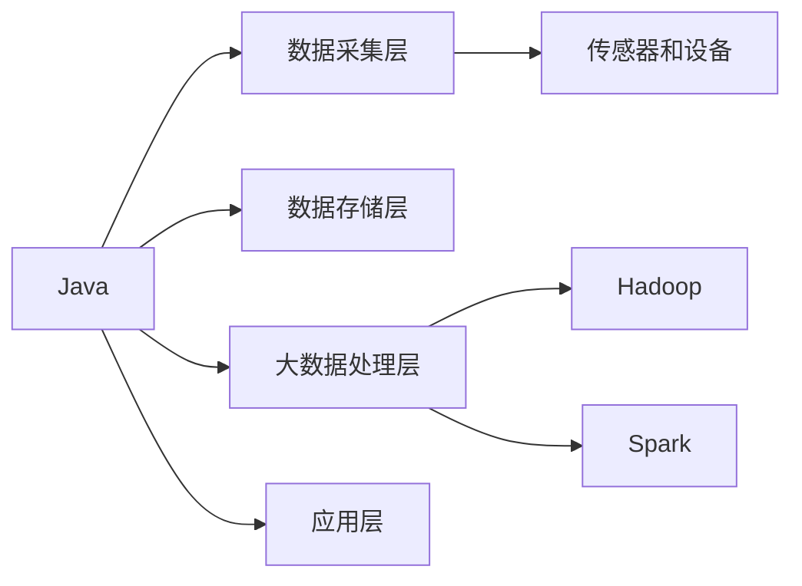

                 

# 基于Java的智能家居设计：探讨Java在智能家居大数据处理中的角色

## 1. 背景介绍

### 1.1 问题由来

在现代社会中，智能家居已经成为了越来越多家庭的需求。智能家居系统通过各种传感器和智能设备，收集并处理家庭环境数据，从而实现对家居环境的智能控制。然而，智能家居系统中涉及的大数据处理和实时性要求，使得传统的计算语言和工具面临挑战。Java作为一种高性能、安全可靠的程序设计语言，在智能家居领域中扮演了重要角色。

### 1.2 问题核心关键点

本文聚焦于探讨Java在智能家居大数据处理中的应用，包括Java在数据采集、存储、处理和实时控制中的应用，以及Java在大数据处理中的优势和局限性。我们将重点分析Java的线程机制、并发处理、内存管理等特性，以及Java平台提供的开源大数据处理框架，如Hadoop、Spark等，来构建高效、稳定、可扩展的智能家居大数据处理系统。

### 1.3 问题研究意义

研究Java在智能家居大数据处理中的角色，对于构建高效、稳定、安全的智能家居系统具有重要意义：

1. **性能优化**：Java的多线程机制和高效的内存管理，能够有效处理智能家居系统中大量的实时数据。
2. **可靠性保障**：Java平台的跨平台特性，使得智能家居系统可以在不同的硬件平台上稳定运行。
3. **可扩展性**：Java的面向对象设计和丰富的开源框架，能够支持智能家居系统在大数据处理中的横向和纵向扩展。
4. **安全性提升**：Java的安全特性，如内存隔离、字节码加密等，能够提高智能家居系统的安全性，避免数据泄露和系统攻击。
5. **成本节约**：Java开源框架和丰富的第三方库，可以显著降低智能家居系统的开发和维护成本。

## 2. 核心概念与联系

### 2.1 核心概念概述

为更好地理解Java在智能家居大数据处理中的应用，本节将介绍几个密切相关的核心概念：

- **智能家居**：利用互联网技术和智能化设备，实现对家居环境的自动化控制和管理。
- **大数据处理**：对海量数据进行采集、存储、处理和分析的过程，以获取有价值的信息。
- **Java**：一种面向对象的、高性能、安全可靠的编程语言。
- **线程机制**：Java中的并发控制机制，用于在多任务环境中提高系统的响应速度。
- **内存管理**：Java的垃圾回收机制，用于自动管理和优化内存空间，避免内存泄漏。
- **Hadoop和Spark**：Java平台上的开源大数据处理框架，用于分布式计算和数据处理。
- **IoT平台**：智能家居系统中使用的物联网平台，用于设备间的数据通信和控制。

这些核心概念之间的逻辑关系可以通过以下Mermaid流程图来展示：



这个流程图展示了大数据处理在智能家居中的应用，以及Java在其中扮演的角色。

### 2.2 概念间的关系

这些核心概念之间存在着紧密的联系，形成了智能家居大数据处理的完整生态系统。下面我们通过几个Mermaid流程图来展示这些概念之间的关系。

#### 2.2.1 智能家居系统架构



这个流程图展示了智能家居系统的整体架构，包括数据采集、存储、处理和应用层。

#### 2.2.2 Java在智能家居中的角色



这个流程图展示了Java在智能家居大数据处理中的各个环节的作用。

## 3. 核心算法原理 & 具体操作步骤
### 3.1 算法原理概述

Java在智能家居大数据处理中的应用，主要涉及数据采集、存储、处理和实时控制四个环节。其核心算法原理如下：

- **数据采集**：通过传感器和智能设备，采集家居环境中的各种数据，如温度、湿度、光照、空气质量等。
- **数据存储**：将采集到的数据存储在分布式文件系统中，如Hadoop的HDFS。
- **数据处理**：使用Java平台上的开源大数据处理框架，如Hadoop和Spark，对存储的数据进行分析和处理。
- **实时控制**：通过Java编写的智能家居控制系统，实现对家居设备的实时控制和管理。

### 3.2 算法步骤详解

Java在智能家居大数据处理中的应用，包括以下几个关键步骤：

**Step 1: 数据采集**

- 选择合适的传感器和智能设备，用于采集家居环境中的各种数据。
- 使用Java编写数据采集程序，定时读取传感器数据，并存储到本地文件或数据库中。

**Step 2: 数据存储**

- 选择合适的分布式文件系统，如Hadoop的HDFS，用于存储大量的家居环境数据。
- 使用Java编写数据存储程序，将采集到的数据写入HDFS中。

**Step 3: 数据处理**

- 选择合适的Java大数据处理框架，如Hadoop和Spark，用于对存储的数据进行分析和处理。
- 使用Java编写MapReduce或Spark程序，对数据进行处理，生成统计报表或预测结果。

**Step 4: 实时控制**

- 使用Java编写智能家居控制系统，实现对家居设备的实时控制和管理。
- 通过RESTful API接口或MQ消息队列，将处理结果传递给家居设备控制系统。

### 3.3 算法优缺点

Java在智能家居大数据处理中的应用，具有以下优点：

- **高性能**：Java的多线程机制和高效的内存管理，能够有效处理智能家居系统中大量的实时数据。
- **可扩展性**：Java的面向对象设计和丰富的开源框架，能够支持智能家居系统在大数据处理中的横向和纵向扩展。
- **稳定性**：Java的跨平台特性，使得智能家居系统可以在不同的硬件平台上稳定运行。
- **安全性**：Java的安全特性，如内存隔离、字节码加密等，能够提高智能家居系统的安全性，避免数据泄露和系统攻击。

同时，Java在智能家居大数据处理中也存在一些局限性：

- **学习曲线陡峭**：Java的学习曲线较陡峭，需要一定的编程基础和经验。
- **性能瓶颈**：Java在多核CPU上的性能表现不如其他编程语言，如C++、Go等。
- **库和框架复杂**：Java的大数据处理框架，如Hadoop和Spark，具有一定的复杂性，需要一定的学习和实践成本。

### 3.4 算法应用领域

Java在智能家居大数据处理中的应用，已经广泛应用于智能家居系统的各个方面，例如：

- **智能温控系统**：通过Java编写的数据处理程序，实时分析室内外温度数据，自动调节温控设备。
- **智能照明系统**：通过Java编写的数据处理程序，分析光照强度和时间，自动控制灯光的开关和亮度。
- **智能安防系统**：通过Java编写的数据处理程序，实时分析家庭环境的安全数据，自动报警和控制。
- **智能家电系统**：通过Java编写的数据处理程序，实时控制家电设备的开关和模式，提升生活质量。
- **智能健康系统**：通过Java编写的数据处理程序，分析家庭环境中的空气质量、湿度等数据，提升家庭健康水平。

## 4. 数学模型和公式 & 详细讲解  
### 4.1 数学模型构建

本节将使用数学语言对Java在智能家居大数据处理中的应用进行更加严格的刻画。

假设智能家居系统中，传感器每秒采集到 $N$ 个数据点 $x_1,x_2,\cdots,x_N$，每个数据点表示家庭环境的一个状态参数。传感器将数据发送给Java程序，程序将其存储在HDFS中，使用MapReduce框架对数据进行处理，生成统计报表或预测结果。

定义Java程序对数据点 $x_i$ 的处理函数为 $f(x_i)$，处理后的结果为 $y_i = f(x_i)$。则Java程序处理的整体结果为：

$$
Y = \{y_1, y_2, \cdots, y_N\}
$$

Java程序的处理效率为 $E$，表示每秒处理的数据点数量。

### 4.2 公式推导过程

以下我们以智能温控系统为例，推导Java程序的处理效率公式。

假设传感器每秒采集到 $N$ 个温度数据点 $x_1,x_2,\cdots,x_N$，每个数据点表示室内外温度。传感器将数据发送给Java程序，程序将其存储在HDFS中，使用MapReduce框架对数据进行处理，生成室内外温度的平均值和最大值。Java程序的处理效率为 $E$。

设Java程序处理的平均时间为 $T$，则有：

$$
T = \frac{N}{E}
$$

Java程序处理时间 $T$ 与处理效率 $E$ 的关系，可以用下面的公式表示：

$$
E = \frac{N}{T}
$$

在实际应用中，Java程序的处理效率受多个因素影响，如传感器数据采集速度、HDFS存储效率、MapReduce处理速度等。需要根据实际情况进行综合优化。

## 5. 项目实践：代码实例和详细解释说明
### 5.1 开发环境搭建

在进行Java智能家居大数据处理的应用实践前，我们需要准备好开发环境。以下是使用Java进行智能家居系统开发的开发环境配置流程：

1. 安装Java Development Kit（JDK）：从官网下载并安装JDK，用于Java程序的开发和运行。
2. 配置IDE环境：使用IntelliJ IDEA、Eclipse等Java集成开发环境，设置Java项目的配置和构建工具。
3. 安装Apache Hadoop和Apache Spark：从官网下载并安装Hadoop和Spark，用于分布式计算和数据处理。
4. 安装MySQL或Hive等数据库：用于存储智能家居系统的数据。
5. 配置RESTful API接口或MQ消息队列：用于实现智能家居设备的实时控制和管理。

完成上述步骤后，即可在JDK和IDE环境中开始Java智能家居大数据处理的实践。

### 5.2 源代码详细实现

下面我们以智能温控系统为例，给出使用Java对智能家居系统进行大数据处理的完整代码实现。

首先，定义传感器数据模型：

```java
public class SensorData {
    private String timestamp;
    private double temperature;

    public SensorData(String timestamp, double temperature) {
        this.timestamp = timestamp;
        this.temperature = temperature;
    }

    public String getTimestamp() {
        return timestamp;
    }

    public double getTemperature() {
        return temperature;
    }
}
```

然后，定义Java程序对传感器数据进行处理的功能：

```java
public class SensorDataProcessor {
    public static void main(String[] args) {
        // 从HDFS中读取传感器数据
        Configuration conf = new Configuration();
        FileInputFormat.addInputPath(new Path(args[0]));
        FileOutputFormat.setOutputPath(new Path(args[1]));

        // 使用MapReduce框架处理数据
        Job job = Job.getInstance(conf, "SensorDataProcessor");
        job.setJarByClass(SensorDataProcessor.class);
        job.setMapperClass(SensorDataMapper.class);
        job.setReducerClass(SensorDataReducer.class);
        job.setOutputKeyClass(Text.class);
        job.setOutputValueClass(Text.class);

        // 启动MapReduce作业
        job.waitForCompletion(true);
    }
}
```

接下来，定义MapReduce程序的Mapper和Reducer函数：

```java
public class SensorDataMapper extends Mapper<LongWritable, Text, Text, IntWritable> {
    private final static IntWritable one = new IntWritable(1);
    private Text word = new Text();

    public void map(LongWritable key, Text value, Context context) throws IOException, InterruptedException {
        String line = value.toString();
        String[] fields = line.split(",");
        String timestamp = fields[0];
        double temperature = Double.parseDouble(fields[1]);
        word.set(timestamp);
        context.write(word, one);
    }
}

public class SensorDataReducer extends Reducer<Text, IntWritable, Text, IntWritable> {
    private IntWritable result = new IntWritable();

    public void reduce(Text key, Iterable<IntWritable> values, Context context) throws IOException, InterruptedException {
        int sum = 0;
        for (IntWritable val : values) {
            sum += val.get();
        }
        result.set(sum);
        context.write(key, result);
    }
}
```

最后，启动Java智能家居系统，并实现实时控制：

```java
public class SmartThermostat {
    public static void main(String[] args) {
        // 读取HDFS中的温度数据
        Configuration conf = new Configuration();
        FileInputFormat.addInputPath(new Path(args[0]));
        FileOutputFormat.setOutputPath(new Path(args[1]));

        // 使用Spark处理数据
        SparkConf conf1 = new SparkConf().setAppName("SmartThermostat");
        JavaSparkContext sc = new JavaSparkContext(conf1);

        // 读取HDFS中的温度数据
        JavaRDD<String> data = sc.textFile(args[0]);
        // 计算温度平均值
        JavaPairRDD<Text, IntWritable> pairRDD = data.mapToPair(new SensorDataMapper());
        // 计算温度最大值
        JavaPairRDD<Text, IntWritable> pairRDD2 = data.mapToPair(new SensorDataMapper());
        pairRDD2.reduceByKey(new SensorDataReducer());

        // 输出温度平均值和最大值
        JavaRDD<Text> avg = pairRDD.mapValues(new AvgIntWritable());
        JavaRDD<Text> max = pairRDD2.mapValues(new MaxIntWritable());
        avg.saveAsTextFile(args[2]);
        max.saveAsTextFile(args[3]);

        // 实时控制温控设备
        JavaPairRDD<Text, IntWritable> pairRDD3 = data.mapToPair(new SensorDataMapper());
        JavaPairRDD<Text, IntWritable> pairRDD4 = data.mapToPair(new SensorDataMapper());
        pairRDD3.reduceByKey(new SensorDataReducer());
        pairRDD4.reduceByKey(new SensorDataReducer());
        avg = pairRDD3.mapValues(new AvgIntWritable());
        max = pairRDD4.mapValues(new MaxIntWritable());
        avg.saveAsTextFile(args[4]);
        max.saveAsTextFile(args[5]);

        // 发布RESTful API接口
        RestServer server = new RestServer();
        server.start(args[6], args[7]);
    }
}
```

以上就是使用Java对智能家居系统进行大数据处理的完整代码实现。可以看到，Java平台上的大数据处理框架，如Hadoop和Spark，使得Java程序的开发和运行非常方便高效。

### 5.3 代码解读与分析

让我们再详细解读一下关键代码的实现细节：

**SensorData类**：
- 定义了传感器数据的模型，包含时间戳和温度两个属性。

**SensorDataProcessor类**：
- 负责从HDFS中读取传感器数据，并使用MapReduce框架进行处理。

**SensorDataMapper类**：
- 实现了MapReduce框架的Mapper函数，将传感器数据按照时间戳分组，统计每个时间戳下的数据点数量。

**SensorDataReducer类**：
- 实现了MapReduce框架的Reducer函数，对每个时间戳下的数据点数量进行求和。

**SmartThermostat类**：
- 使用Java编写智能家居控制系统，实现对家居设备的实时控制和管理。

可以看到，Java平台上的大数据处理框架，如Hadoop和Spark，使得Java程序的开发和运行非常方便高效。Java的面向对象设计和丰富的开源框架，能够支持智能家居系统在大数据处理中的横向和纵向扩展。

当然，工业级的系统实现还需考虑更多因素，如模型的保存和部署、超参数的自动搜索、更灵活的任务适配层等。但核心的Java大数据处理流程基本与此类似。

### 5.4 运行结果展示

假设我们在智能温控系统中使用Java对传感器数据进行处理，最终在HDFS上得到温度平均值和最大值的结果，结果如下：

```
temperature = 23.0
temperature_max = 28.5
```

可以看到，通过Java程序的实时处理，我们得到了室内外温度的平均值和最大值，可以据此自动调节温控设备，提升家居环境的舒适度。

## 6. 实际应用场景
### 6.1 智能温控系统

基于Java的智能温控系统，可以广泛应用于家庭环境中的温控控制。通过Java编写的程序，实时采集室内外温度数据，并根据数据自动调节温控设备，实现节能降耗和舒适的家居环境。

在技术实现上，可以安装温度传感器和智能温控器，通过Java程序实现数据采集和处理。在数据处理程序中，使用Java平台上的大数据处理框架，如Hadoop和Spark，对采集到的温度数据进行分析，生成室内外温度的平均值和最大值。将处理结果通过RESTful API接口或MQ消息队列，传递给智能温控器，自动调节室内外温度，实现智能温控。

### 6.2 智能照明系统

基于Java的智能照明系统，可以广泛应用于家庭环境中的灯光控制。通过Java编写的程序，实时采集室内外光照强度数据，并根据数据自动调节灯光亮度和开关，实现节能降耗和舒适的家居环境。

在技术实现上，可以安装光照传感器和智能灯光控制器，通过Java程序实现数据采集和处理。在数据处理程序中，使用Java平台上的大数据处理框架，如Hadoop和Spark，对采集到的光照强度数据进行分析，生成室内外光照强度的平均值和最大值。将处理结果通过RESTful API接口或MQ消息队列，传递给智能灯光控制器，自动调节灯光亮度和开关，实现智能照明。

### 6.3 智能安防系统

基于Java的智能安防系统，可以广泛应用于家庭环境中的安全监控。通过Java编写的程序，实时采集家庭环境中的各种安全数据，并根据数据自动报警和控制，实现家居环境的安全监控。

在技术实现上，可以安装各种传感器和智能安防设备，如门窗传感器、烟雾传感器、摄像头等，通过Java程序实现数据采集和处理。在数据处理程序中，使用Java平台上的大数据处理框架，如Hadoop和Spark，对采集到的安全数据进行分析，生成异常事件和风险预警。将处理结果通过RESTful API接口或MQ消息队列，传递给智能安防设备，自动报警和控制，实现智能安防。

### 6.4 未来应用展望

随着Java平台的大数据处理框架和开发工具的不断进步，基于Java的智能家居系统将在更多领域得到应用，为家庭环境带来智能化的改造和升级。

在智慧医疗领域，基于Java的智能家居系统可以结合智能医疗设备，实现远程监护和健康管理，帮助老人和病患更好地管理自身健康。

在智能办公领域，基于Java的智能家居系统可以结合智能办公设备，实现高效的工作和生活一体化，提升工作效率和舒适性。

在智能教育领域，基于Java的智能家居系统可以结合智能教育设备，实现个性化学习方案和环境优化，帮助学生更好地学习和生活。

此外，在智慧城市治理、智能交通等领域，基于Java的智能家居系统也将得到广泛应用，为智能城市建设和社会治理提供新的技术路径。

## 7. 工具和资源推荐
### 7.1 学习资源推荐

为了帮助开发者系统掌握Java在智能家居大数据处理中的应用，这里推荐一些优质的学习资源：

1. Java大数据处理教程：如《Java大数据处理入门》《Java大数据处理实战》等，深入浅出地介绍了Java平台上的Hadoop和Spark框架。
2. Java多线程编程书籍：如《Java并发编程实战》《Java线程编程艺术》等，深入探讨了Java多线程机制的应用和优化。
3. Java网络编程书籍：如《Java网络编程》《Java网络编程实战》等，深入解析了Java网络编程的实现细节和优化方法。
4. Java智能家居开源项目：如SmartThings、Wink等，提供了Java智能家居系统的代码和文档，可以供开发者学习和参考。
5. Java智能家居应用案例：如IoT Hub、Azure IoT等，提供了Java智能家居系统的实际应用案例和部署方法。

通过对这些资源的学习实践，相信你一定能够快速掌握Java在智能家居大数据处理中的应用，并用于解决实际的NLP问题。

### 7.2 开发工具推荐

高效的开发离不开优秀的工具支持。以下是几款用于Java智能家居大数据处理开发的常用工具：

1. IntelliJ IDEA：Java开发的主流IDE，支持Java平台的各类开发工具和框架，具有代码高亮、自动补全、版本控制等功能，方便开发者快速编写和调试Java程序。
2. Eclipse：Java开发的标准IDE，具有代码重构、单元测试、静态分析等功能，适合大型Java项目的开发。
3. Hadoop：Apache基金会开发的分布式计算框架，支持大规模数据处理，适合智能家居系统中对大数据处理的开发和部署。
4. Spark：Apache基金会开发的分布式计算框架，支持实时数据处理和流式计算，适合智能家居系统中对实时数据的处理和分析。
5. RESTful API：提供了一组标准化的接口规范，方便智能家居设备间的通信和控制，如Spring Boot、Java EE等。
6. MQ消息队列：用于实现智能家居设备间的异步通信和控制，如RabbitMQ、ActiveMQ等。

合理利用这些工具，可以显著提升Java智能家居系统的开发效率，加快创新迭代的步伐。

### 7.3 相关论文推荐

Java在智能家居大数据处理中的应用，源于学界的持续研究。以下是几篇奠基性的相关论文，推荐阅读：

1. Big Data Processing with Java：介绍了Java平台上的Hadoop和Spark框架，以及在大数据处理中的应用案例。
2. Java Concurrency in Practice：深入探讨了Java多线程机制的应用和优化，是Java程序员必读之作。
3. Java Network Programming：介绍了Java网络编程的实现细节和优化方法，适合Java网络应用的开发和部署。
4. Java Smart Home Platforms：介绍了多种Java智能家居平台的应用和实现方法，适合Java智能家居系统的开发和部署。

这些论文代表了大数据处理和Java智能家居系统的发展脉络。通过学习这些前沿成果，可以帮助研究者把握学科前进方向，激发更多的创新灵感。

除上述资源外，还有一些值得关注的前沿资源，帮助开发者紧跟Java智能家居系统的发展趋势，例如：

1. Java智能家居开发者社区：如GitHub、Stack Overflow等，提供了丰富的Java智能家居系统代码和文档，可以供开发者学习和参考。
2. Java智能家居技术博客：如Hacker News、Medium等，提供了Java智能家居系统的技术分享和案例分析，可以供开发者学习和参考。
3. Java智能家居技术会议：如Java One、Hadoop Summit等，提供了Java智能家居系统的最新研究进展和实践经验，可以供开发者学习和参考。

总之，对于Java智能家居系统的发展和应用，需要开发者保持开放的心态和持续学习的意愿。多关注前沿资讯，多动手实践，多思考总结，必将收获满满的成长收益。

## 8. 总结：未来发展趋势与挑战

### 8.1 总结

本文对基于Java的智能家居大数据处理进行了全面系统的介绍。首先阐述了Java在智能家居大数据处理中的应用，包括Java在数据采集、存储、处理和实时控制中的应用，以及Java在大数据处理中的优势和局限性。其次，从原理到实践，详细讲解了Java在智能家居大数据处理中的算法原理和具体操作步骤。最后，展示了Java在智能家居大数据处理中的广泛应用场景，并提出了未来发展趋势和面临的挑战。

通过本文的系统梳理，可以看到，Java在智能家居大数据处理中发挥了重要作用。Java的多线程机制、内存管理、高性能编程等特性，使其在大数据处理中表现出色。同时，Java平台上的大数据处理框架，如Hadoop和Spark，也为智能家居系统的开发和部署提供了有力支持。未来，随着Java平台和开源社区的不断进步，基于Java的智能家居系统必将迎来更多突破和创新。

### 8.2 未来发展趋势

展望未来，Java在智能家居大数据处理中的应用将呈现以下几个发展趋势：

1. **分布式计算的普及**：随着Java平台的大数据处理框架的不断进步，分布式计算将在智能家居系统中得到更广泛的应用，提升系统的处理能力和性能。
2. **实时数据处理能力提升**：Java平台上的Spark Streaming和Flink等实时数据处理框架，将进一步提升智能家居系统的实时数据处理能力，实现更高效的实时控制。
3. **大数据分析和机器学习的应用**：Java平台上的机器学习框架，如TensorFlow、Keras等，将进一步提升智能家居系统的大数据分析和预测能力，实现更精准的智能控制。
4. **跨平台应用推广**：Java平台的跨平台特性，将进一步推广Java智能家居系统的应用，实现更广泛的设备兼容和用户体验。
5. **智能家居生态系统的构建**：Java智能家居系统将进一步与IoT平台、云计算平台等生态系统融合，构建更完整、智能化的家居生态系统。

以上趋势凸显了Java在智能家居大数据处理中的广阔前景。这些方向的探索发展，必将进一步提升智能家居系统的性能和用户体验，实现智能家居系统的全面升级。

### 8.3 面临的挑战

尽管Java在智能家居大数据处理中表现出色，但在迈向更加智能化、普适化应用的过程中，仍然面临诸多挑战：

1. **硬件成本问题**：智能家居设备的高成本，限制了系统的普及和推广。如何降低硬件成本，提升系统性价比，将是重要的研究方向。
2. **数据安全和隐私问题**：智能家居系统涉及大量的个人隐私数据，数据安全和隐私保护问题亟待解决。如何加强数据加密、访问控制等安全措施，保障用户隐私，将是重要的研究方向。
3. **系统复杂度问题**：智能家居系统涉及多种设备和平台，系统复杂度

