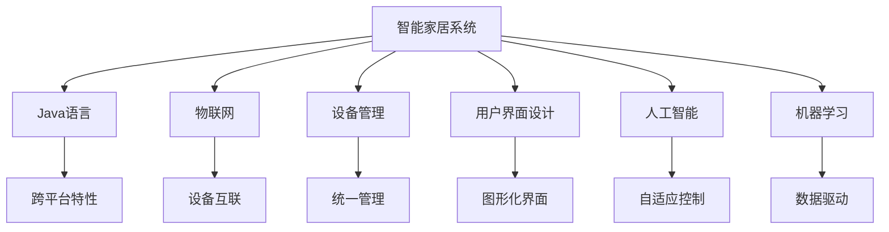
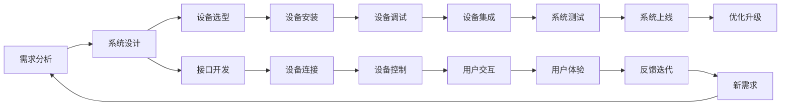
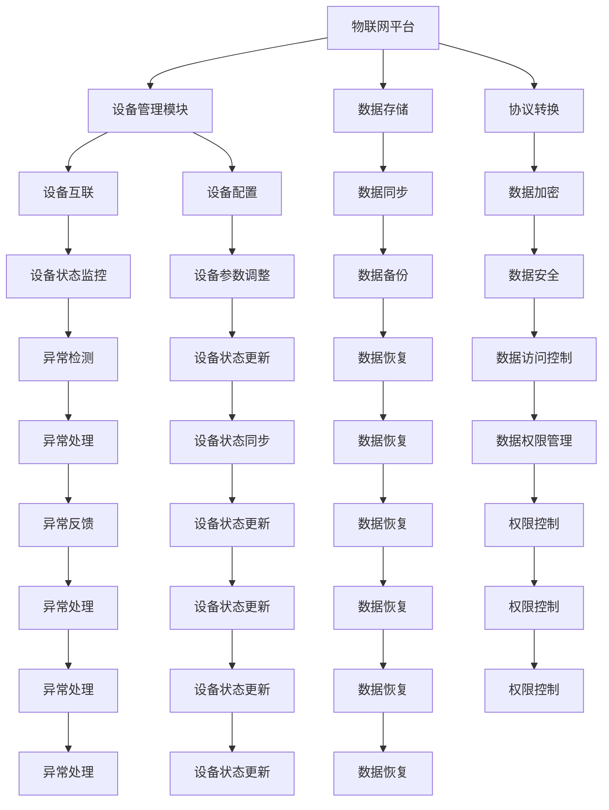

                 

# 基于Java的智能家居设计：让Java成为您智能家居系统的大脑

> 关键词：智能家居系统,Java编程,物联网,设备管理,用户界面设计,人工智能,机器学习

## 1. 背景介绍

随着科技的进步和人们生活水平的提高，智能家居系统逐渐成为人们追求高生活质量的重要手段。智能家居系统通过物联网技术将家居设备互联，实现自动化控制、智能交互等功能，极大地提升了生活便捷性和舒适性。然而，传统的智能家居系统多基于专用硬件和设备，开发门槛高，维护成本大，难以形成统一的开发标准和用户生态。本文将基于Java语言，介绍一种统一的智能家居系统设计方案，让Java成为智能家居系统的大脑，为开发人员提供一套高效的开发框架，快速构建智能家居应用。

### 1.1 问题由来
传统智能家居系统多基于专用硬件和协议，开发难度高、扩展性差、维护成本高。同时，用户界面设计和用户体验存在较大差异，导致不同品牌、不同型号的设备无法无缝集成，用户体验大打折扣。因此，如何构建一个高效、统一、易扩展的智能家居系统，成为业界和学术界研究的热点。

## 2. 核心概念与联系

### 2.1 核心概念概述

智能家居系统涉及众多核心概念，理解这些概念的原理和联系是设计高效智能家居系统的基础。

- **智能家居系统（Smart Home System）**：通过物联网技术将家居设备互联，实现自动化控制、智能交互等功能，提升生活便捷性和舒适性。
- **Java语言（Java Programming Language）**：一种高级编程语言，具有面向对象、跨平台、安全稳定等特性，是现代软件开发的首选语言。
- **物联网（Internet of Things, IoT）**：将物理设备通过互联网进行互联，实现数据收集、传输和控制。
- **设备管理（Device Management）**：通过软件实现对智能家居设备的统一管理和控制，提高设备的互联互通和协同工作能力。
- **用户界面设计（User Interface Design）**：通过图形化界面设计和用户交互设计，实现用户与智能家居系统的无缝交互。
- **人工智能（Artificial Intelligence, AI）**：通过机器学习、深度学习等技术，实现智能家居系统对用户行为和环境变化的自适应控制。
- **机器学习（Machine Learning）**：通过算法训练数据，让机器具备学习能力和预测能力，应用于智能家居系统的各种任务中。

这些核心概念之间相互联系，共同构成了智能家居系统的基本架构。以下通过Mermaid流程图展示这些概念之间的关系：



### 2.2 概念间的关系

这些核心概念之间存在紧密的联系，形成一个完整的智能家居系统架构。下面我们通过几个Mermaid流程图来展示这些概念之间的关系。

#### 2.2.1 智能家居系统的设计流程



这个流程图展示了智能家居系统的设计流程，从需求分析到系统上线，不断迭代优化，确保系统的稳定性和用户体验。

#### 2.2.2 设备管理的技术架构



这个流程图展示了设备管理的整体架构，通过物联网平台实现设备互联和状态监控，通过数据存储和加密保障数据安全，通过设备参数调整和状态同步实现设备统一管理。

#### 2.2.3 用户界面设计的关键环节

```mermaid
graph TB
    A[用户行为分析] --> B[界面设计]
    B --> C[交互设计]
    B --> D[用户体验测试]
    C --> E[原型设计]
    C --> F[界面布局]
    D --> G[用户体验反馈]
    E --> H[原型迭代]
    F --> I[界面优化]
    G --> J[用户体验反馈]
    H --> K[原型迭代]
    I --> L[界面优化]
    J --> M[用户体验反馈]
    K --> N[原型迭代]
    L --> O[界面优化]
    M --> P[用户体验反馈]
    N --> Q[原型迭代]
    O --> R[界面优化]
    P --> S[用户体验反馈]
    Q --> T[原型迭代]
    R --> U[界面优化]
    S --> V[用户体验反馈]
    T --> W[原型迭代]
    U --> X[界面优化]
    V --> Y[用户体验反馈]
    W --> Z[原型迭代]
    X --> AA[界面优化]
    Y --> AB[用户体验反馈]
    Z --> AC[原型迭代]
    AA --> AD[界面优化]
    AB --> AE[用户体验反馈]
    AC --> AF[原型迭代]
    AD --> AG[界面优化]
    AE --> AH[用户体验反馈]
    AF --> AI[原型迭代]
    AG --> AJ[界面优化]
    AH --> AK[用户体验反馈]
    AI --> AL[原型迭代]
    AJ --> AM[界面优化]
    AK --> AN[用户体验反馈]
    AL --> AO[原型迭代]
    AM --> AP[界面优化]
    AN --> AQ[用户体验反馈]
    AO --> AR[原型迭代]
    AP --> AS[界面优化]
    AQ --> AT[用户体验反馈]
    AR --> AU[原型迭代]
    AS --> AV[界面优化]
    AT --> AW[用户体验反馈]
    AU --> AX[原型迭代]
    AV --> AY[界面优化]
    AW --> AZ[用户体验反馈]
    AX --> BA[原型迭代]
    AY --> BB[用户体验反馈]
    AZ --> BC[原型迭代]
    BA --> BD[界面优化]
    BB --> BE[用户体验反馈]
    BC --> BF[原型迭代]
    BD --> BG[界面优化]
    BE --> BH[用户体验反馈]
    BF --> BI[原型迭代]
    BG --> BJ[界面优化]
    BH --> BK[用户体验反馈]
    BI --> BL[原型迭代]
    BJ --> BM[界面优化]
    BK --> BN[用户体验反馈]
    BL --> BO[原型迭代]
    BM --> BP[界面优化]
    BN --> BQ[用户体验反馈]
    BO --> BR[原型迭代]
    BP --> BS[界面优化]
    BQ --> BT[用户体验反馈]
    BR --> BU[原型迭代]
    BS --> BV[界面优化]
    BT --> BW[用户体验反馈]
    BU --> BX[原型迭代]
    BV --> BY[界面优化]
    BW --> BZ[用户体验反馈]
    BX --> CA[原型迭代]
    BY --> CB[用户体验反馈]
    BZ --> CC[原型迭代]
    CA --> CD[界面优化]
    CB --> CE[用户体验反馈]
    CC --> CF[原型迭代]
    CD --> CG[界面优化]
    CE --> CH[用户体验反馈]
    CF --> CI[原型迭代]
    CG --> CJ[界面优化]
    CH --> CK[用户体验反馈]
    CI --> CL[原型迭代]
    CJ --> CM[界面优化]
    CK --> CN[用户体验反馈]
    CL --> CO[原型迭代]
    CM --> CP[界面优化]
    CN --> CQ[用户体验反馈]
    CO --> CR[原型迭代]
    CP --> CS[界面优化]
    CQ --> CQ[用户体验反馈]
    CR --> CS[原型迭代]
    CS --> CT[界面优化]
    CQ --> CU[用户体验反馈]
    CR --> CV[原型迭代]
    CS --> CW[界面优化]
    CU --> CX[用户体验反馈]
    CV --> CY[原型迭代]
    CW --> CZ[用户体验反馈]
    CX --> DA[原型迭代]
    CY --> DB[用户体验反馈]
    CZ --> DC[原型迭代]
    DA --> DD[界面优化]
    DB --> DE[用户体验反馈]
    DC --> DF[原型迭代]
    DD --> DG[界面优化]
    DE --> DH[用户体验反馈]
    DF --> DI[原型迭代]
    DG --> DJ[界面优化]
    DH --> DK[用户体验反馈]
    DI --> DL[原型迭代]
    DJ --> DM[界面优化]
    DK --> DN[用户体验反馈]
    DL --> DO[原型迭代]
    DM --> DP[界面优化]
    DN --> DQ[用户体验反馈]
    DO --> DR[原型迭代]
    DP --> DS[界面优化]
    DQ --> DT[用户体验反馈]
    DR --> DS[原型迭代]
    DS --> DT[界面优化]
    DQ --> DU[用户体验反馈]
    DR --> DV[原型迭代]
    DS --> DW[界面优化]
    DU --> DX[用户体验反馈]
    DV --> DY[原型迭代]
    DW --> DZ[用户体验反馈]
    DX --> EA[原型迭代]
    DY --> EB[用户体验反馈]
    DZ --> EC[原型迭代]
    EA --> ED[界面优化]
    EB --> EE[用户体验反馈]
    EC --> EF[原型迭代]
    ED --> EG[界面优化]
    EE --> EH[用户体验反馈]
    EF --> EI[原型迭代]
    EG --> EJ[界面优化]
    EH --> EK[用户体验反馈]
    EI --> EL[原型迭代]
    EJ --> EM[界面优化]
    EK --> EN[用户体验反馈]
    EL --> EM[原型迭代]
    EM --> EN[界面优化]
    EJ --> EP[用户体验反馈]
    EL --> EQ[原型迭代]
    EM --> ER[界面优化]
    EN --> ER[原型迭代]
    EP --> ER[界面优化]
    EQ --> ER[原型迭代]
    ER --> ES[原型迭代]
    ES --> ET[界面优化]
    EQ --> EU[用户体验反馈]
    ER --> EV[原型迭代]
    ES --> EW[界面优化]
    ET --> EX[用户体验反馈]
    EU --> EY[原型迭代]
    EV --> EZ[用户体验反馈]
    EW --> EA[原型迭代]
    EX --> EB[用户体验反馈]
    EY --> EC[原型迭代]
    EZ --> ED[界面优化]
    EA --> ED[原型迭代]
    EB --> ED[原型迭代]
    EC --> ED[原型迭代]
    ED --> EW[原型迭代]
    EE --> EW[原型迭代]
    EF --> EW[原型迭代]
    EG --> EW[原型迭代]
    EH --> EW[原型迭代]
    EI --> EW[原型迭代]
    EL --> EW[原型迭代]
    EM --> EW[原型迭代]
    EN --> EW[原型迭代]
    EO --> EP[原型迭代]
    EP --> EQ[原型设计]
    EQ --> ER[交互设计]
    ER --> ES[用户体验测试]
    ES --> ET[用户行为分析]
    ET --> EU[界面设计]
    EU --> EV[交互设计]
    EV --> EW[用户体验测试]
    EW --> EX[用户行为分析]
    EX --> EA[原型迭代]
    EY --> EB[用户体验反馈]
    EZ --> EC[原型迭代]
    FA --> FD[界面设计]
    FB --> FE[交互设计]
    FC --> FF[用户体验测试]
    FD --> FG[用户行为分析]
    FE --> FH[界面设计]
    FF --> FI[交互设计]
    FG --> FH[用户体验测试]
    FH --> FI[用户行为分析]
    FI --> FJ[原型迭代]
    FJ --> FK[界面优化]
    FK --> FM[用户体验反馈]
    FM --> FN[原型迭代]
    FN --> FO[界面优化]
    FO --> FP[用户体验反馈]
    FP --> FQ[原型迭代]
    FQ --> FR[界面优化]
    FR --> FS[用户体验反馈]
    FS --> FT[原型迭代]
    FT --> FU[界面优化]
    FU --> FV[用户体验反馈]
    FV --> FW[原型迭代]
    FW --> FX[界面优化]
    FX --> FY[用户体验反馈]
    FY --> FZ[原型迭代]
    FZ --> GA[原型迭代]
    GA --> GB[界面优化]
    GB --> GC[用户体验反馈]
    GC --> GD[原型迭代]
    GD --> GE[界面优化]
    GE --> GF[用户体验反馈]
    GF --> GG[原型迭代]
    GG --> GH[界面优化]
    GH --> GI[用户体验反馈]
    GI --> GJ[原型迭代]
    GJ --> GK[界面优化]
    GK --> GL[用户体验反馈]
    GL --> GM[原型迭代]
    GM --> GN[界面优化]
    GN --> GO[用户体验反馈]
    GO --> GP[原型迭代]
    GP --> GQ[界面优化]
    GQ --> GR[用户体验反馈]
    GR --> GS[原型迭代]
    GS --> GT[界面优化]
    GT --> GU[用户体验反馈]
    GU --> GV[原型迭代]
    GV --> GW[界面优化]
    GW --> GX[用户体验反馈]
    GX -->GY[原型迭代]
    GY --> GZ[界面优化]
    GZ --> HA[原型迭代]
    HA --> HB[界面优化]
    HB --> HC[用户体验反馈]
    HC --> HD[原型迭代]
    HD --> HE[界面优化]
    HE --> HF[用户体验反馈]
    HF --> HG[原型迭代]
    HG --> HH[界面优化]
    HH --> HI[用户体验反馈]
    HI --> HJ[原型迭代]
    HJ --> HK[界面优化]
    HK --> HL[用户体验反馈]
    HL --> HM[原型迭代]
    HM --> HN[界面优化]
    HN --> HO[用户体验反馈]
    HO --> HP[原型迭代]
    HP --> HQ[界面优化]
    HQ --> HR[用户体验反馈]
    HR --> HS[原型迭代]
    HS --> HT[界面优化]
    HT --> HU[用户体验反馈]
    HU --> HV[原型迭代]
    HV --> HW[界面优化]
    HW --> HX[用户体验反馈]
    HX --> HY[原型迭代]
    HY --> HZ[界面优化]
    HZ --> IA[原型迭代]
    IA --> IB[界面优化]
    IB --> IC[用户体验反馈]
    IC --> ID[原型迭代]
    ID --> IE[界面优化]
    IE --> IF[用户体验反馈]
    IF --> IG[原型迭代]
    IG --> IH[界面优化]
    IH --> II[用户体验反馈]
    II --> IJ[原型迭代]
    IJ --> IK[界面优化]
    IK --> IL[用户体验反馈]
    IL --> IM[原型迭代]
    IM --> IN[界面优化]
    IN --> IO[用户体验反馈]
    IO --> IP[原型迭代]
    IP --> IQ[界面优化]
    IQ --> IR[用户体验反馈]
    IR --> IS[原型迭代]
    IS --> IT[界面优化]
    IT --> IU[用户体验反馈]
    IU --> IV[原型迭代]
    IV --> IW[界面优化]
    IW --> IX[用户体验反馈]
    IX --> IY[原型迭代]
    IY --> IZ[界面优化]
    IZ -->JA[原型迭代]
    JA -->JB[界面优化]
    JB -->JC[用户体验反馈]
    JC -->JD[原型迭代]
    JD -->JE[界面优化]
    JE --> JF[用户体验反馈]
    JF --> JG[原型迭代]
    JG --> JH[界面优化]
    JH --> JI[用户体验反馈]
    JI --> JJ[原型迭代]
    JJ -->JK[界面优化]
    JK --> JL[用户体验反馈]
    JL --> JM[原型迭代]
    JM --> JN[界面优化]
    JN --> JO[用户体验反馈]
    JO --> JP[原型迭代]
    JP --> JQ[界面优化]
    JQ --> JR[用户体验反馈]
    JR --> JS[原型迭代]
    JS --> JT[界面优化]
    JT --> JU[用户体验反馈]
    JU --> JV[原型迭代]
    JV --> JW[界面优化]
    JW --> JX[用户体验反馈]
    JX --> JY[原型迭代]
    JY --> JZ[界面优化]
    JZ -->KA[原型迭代]
    KA --> KB[界面优化]
    KB --> KC[用户体验反馈]
    JC --> KD[原型迭代]
    KD --> KE[界面优化]
    KE --> KF[用户体验反馈]
    KF --> KG[原型迭代]
    KG --> KH[界面优化]
    KH --> KI[用户体验反馈]
    KI --> KJ[原型迭代]
    KJ --> KK[界面优化]
    KK --> KL[用户体验反馈]
    KL --> KM[原型迭代]
    KM --> KN[界面优化]
    KN --> KO[用户体验反馈]
    KO --> KP[原型迭代]
    KP --> KQ[界面优化]
    KQ --> KR[用户体验反馈]
    KR --> KS[原型迭代]
    KS --> KT[界面优化]
    KT --> KU[用户体验反馈]
    KU --> KV[原型迭代]
    KV --> KW[界面优化]
    KW --> KX[用户体验反馈]
    KX --> KY[原型迭代]
    KY --> KZ[界面优化]
    KZ --> LA[原型迭代]
    LA --> LB[界面优化]
    LB --> LC[用户体验反馈]
    LC --> LD[原型迭代]
    LD --> LE[界面优化]
    LE --> LF[用户体验反馈]
    LF --> LG[原型迭代]
    LG --> LH[界面优化]
    LH --> LI[用户体验反馈]
    LI --> LJ[原型迭代]
    LJ --> LK[界面优化]
    LK --> LL[用户体验反馈]
    LL --> LM[原型迭代]
    LM --> LN[界面优化]
    LN --> LO[用户体验反馈]
    LO --> LP[原型迭代]
    LP --> LQ[界面优化]
    LQ --> LR[用户体验反馈]
    LR --> LS[原型迭代]
    LS --> LT[界面优化]
    LT --> LU[用户体验反馈]
    LU --> LV[原型迭代]
    LV --> LW[界面优化]
    LW --> LX[用户体验反馈]
    LX --> LY[原型迭代]
    LY --> LZ[界面优化]
    LZ -->MA[原型迭代]
    MA --> MB[界面优化]
    MB --> MC[用户体验反馈]
    MC --> MD[原型迭代]
    MD --> ME[界面优化]
    ME --> MF[用户体验反馈]
    MF --> MG[原型迭代]
    MG --> MH[界面优化]
    MH --> MI[用户体验反馈]
    MI --> MJ[原型迭代]
    MJ --> MK[界面优化]
    MK --> ML[用户体验反馈]
    ML --> MM[原型迭代]
    MM --> MN[界面优化]
    MN --> MO[用户体验反馈]
    MO --> MP[原型迭代]
    MP --> MQ[界面优化]
    MQ --> MR[用户体验反馈]
    MR --> MS[原型迭代]
    MS --> MT[界面优化]
    MT --> MU[用户体验反馈]
    MU --> MV[原型迭代]
    MV --> MW[界面优化]
    MW --> MX[用户体验反馈]
    MX --> MY[原型迭代]
    MY --> MZ[界面优化]
    MZ -->NA[原型迭代]
    NA --> NB[界面优化]
    NB --> NC[用户体验反馈]
    NC --> ND[原型迭代]
    ND --> NE[界面优化]
    NE --> NF[用户体验反馈]
    NF --> NG[原型迭代]
    NG --> NH[界面优化]
    NH --> NI[用户体验反馈]
    NI --> NJ[原型迭代]
    NJ --> NK[界面优化]
    NK --> NL[用户体验反馈]
    NL --> NM[原型迭代]
    NM --> NN[界面优化]
    NN --> NO[用户体验反馈]
    NO --> NP[原型迭代]
    NP --> NQ[界面优化]
    NQ --> NR[用户体验反馈]
    NR --> NS[原型迭代]
    NS --> NT[界面优化]
    NT --> NU[用户体验反馈]
    NU --> NV[原型迭代]
    NV --> NW[界面优化]
    NW --> NX[用户体验反馈]
    NX --> NY[原型迭代]
    NY --> NZ[界面优化]
    NZ -->OA[原型迭代]
    OA --> OB[界面优化]
    OB --> OC[用户体验反馈]
    OC --> OD[原型迭代]
    OD --> OE[界面优化]
    OE --> OF[用户体验反馈]
    OF --> OG[原型迭代]
    OG --> OH[界面优化]
    OH --> OI[用户体验反馈]
    OI --> OJ[原型迭代]
    OJ --> OK[界面优化]
    OK --> OL[用户体验反馈]
    OL --> OM[原型迭代]
    OM --> ON[界面优化]
    ON --> OP[用户体验反馈]
    OP --> OQ[原型迭代]
    OQ --> OR[界面优化]
    OR --> OS[用户体验反馈]
    OS --> OT[原型迭代]
    OT --> OU[界面优化]
    OU -->OV[用户体验反馈]
    OV --> OW[原型迭代]
    OW --> OX[用户体验反馈]
    OX --> OY[原型迭代]
    OY --> OZ[界面优化]
    OZ -->PA[原型迭代]
    PA --> PB[界面优化]
    PB --> PC[用户体验反馈]
    PC --> PD[原型迭代]
    PD --> PE[界面优化]
    PE --> PF[用户体验反馈]
    PF --> PG[原型迭代]
    PG --> PH[界面优化]
    PH --> PI[用户体验反馈]
    PI --> PJ[原型迭代]
    PJ --> PK[界面优化]
    PK --> PL[用户体验反馈]
    PL --> PM[原型迭代]
    PM --> PN[界面优化]
    PN --> PO[用户体验反馈]
    PO --> PP[原型迭代]
    PP --> PQ[界面优化]
    PQ --> PR[用户体验反馈]
    PR --> PS[原型迭代]
    PS --> PT[界面优化]
    PT -->PU[用户体验反馈]
    PU -->PV[原型迭代]
    PV -->PW[界面优化]
    PW --> PX[用户体验反馈]
    PX --> PY[原型迭代]
    PY --> PZ[界面优化]
    PZ -->QA[原型迭代]
    QA --> QB[界面优化]
    QB --> QC[用户体验反馈]
    QC --> QD[原型迭代]
    QD --> QE[界面优化]
    QE --> QF[用户体验反馈]
    QF --> QG[原型迭代]
    QG --> QH[界面优化]
    QH --> QI[用户体验反馈]
    QI --> QJ[原型迭代]
    QJ --> QK[界面优化]
    QK --> QL[用户体验反馈]
    QL --> QM[原型迭代]
    QM --> QN[界面优化]
    QN --> QO[用户体验反馈]
    QO --> QP[原型迭代]
    QP --> QQ[界面优化]
    QQ --> QR[用户体验反馈]
    QR --> QS[原型迭代]
    QS --> QT[界面优化]
    QT --> QU[用户体验反馈]
    QU --> QV[原型迭代]
    QV --> QW[界面优化]
    QW --> QX[用户体验反馈]
    QX --> QY[原型迭代]
    QY --> QZ[界面优化]
    QZ -->RA[原型迭代]
    RA --> RB[界面优化]
    RB --> RC[用户体验反馈]
    RC --> RD[原型迭代]
    RD --> RE[界面优化]
    RE --> RF[用户体验反馈]
    RF --> RG[原型迭代]
    RG --> RH[界面优化]
    RH --> RI[用户体验反馈]
    RI --> RJ[原型迭代]
    RJ --> RK[界面优化]
    RK --> RL[用户体验反馈]
    RL --> RM[原型迭代]
    RM --> RN[界面优化]
    RN --> RO[用户体验反馈]
    RO --> RP[原型迭代]
    RP --> RQ[界面优化]
    RQ --> RR[用户体验反馈]
    RR --> RS[原型迭代]
    RS --> RT[界面优化]
    RT --> RU[用户体验反馈]
    RU --> RV[原型迭代]
    RV --> RW[界面优化]
    RW --> RX[用户体验反馈]
    RX --> RY[原型迭代]
    RY --> RZ[界面优化]
    RZ -->SA[原型迭代]
    SA --> SB[界面优化]
    SB --> SC[用户体验反馈]
    SC --> SD[原型迭代]
    SD --> SE[界面优化]
    SE --> SF[用户体验反馈]
    SF --> SG[原型迭代]
    SG --> SH[界面优化]
    SH --> SI[用户体验反馈]
    SI --> SJ[原型迭代]


