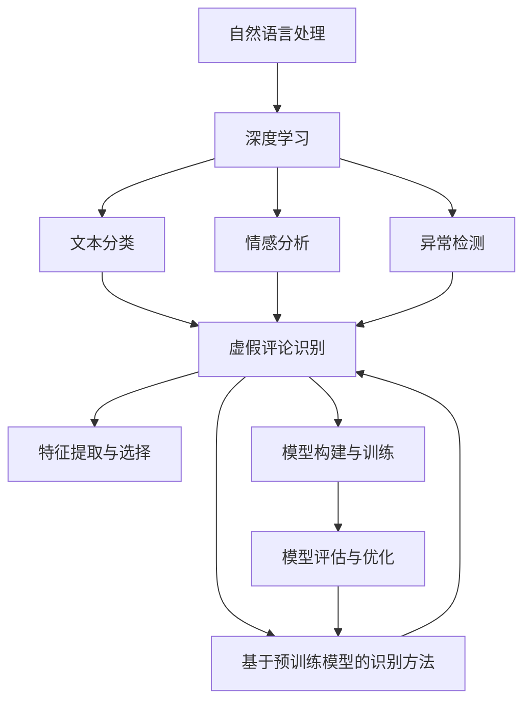
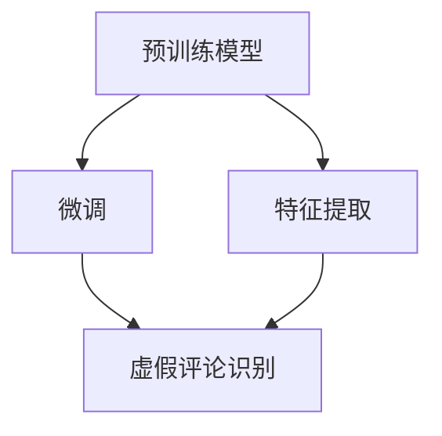
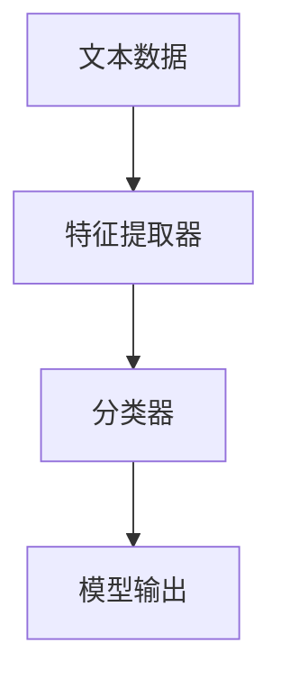
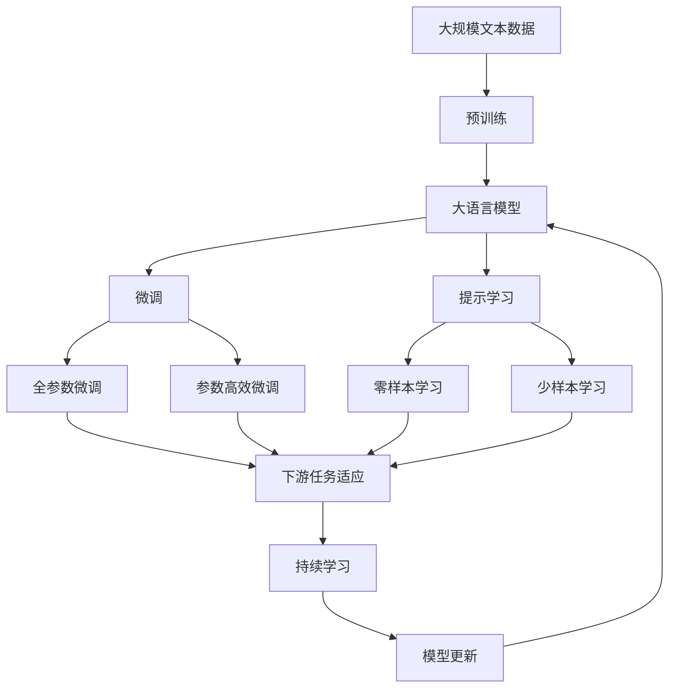

                 

# 基于NLP的虚假评论识别研究

> 关键词：虚假评论识别, 自然语言处理, NLP, 深度学习, 情感分析, 异常检测, 自然语言处理(NLP), 虚假评论, 欺诈检测, 机器学习, 数据标注, 文本分类, 异常检测算法

## 1. 背景介绍

### 1.1 问题由来

在电商、旅游、点评等领域，消费者往往会留下对商品、酒店、餐厅等的评价和评论。真实、客观的评论对于其他消费者做出购买决策具有重要参考价值。然而，随着互联网的迅猛发展，虚假评论（即，与实际消费体验不符的评论）大量涌现，对其他消费者的判断造成误导，损害了市场公平和消费者的权益。如何有效识别虚假评论，成为一个亟待解决的问题。

近年来，自然语言处理（NLP）技术在语言理解和生成方面取得了突破性进展。虚假评论识别可以利用NLP技术对评论进行深度学习和文本分类，进而识别出潜在的虚假评论。这种技术在电商平台、旅游平台等场景中应用广泛，为维护消费者利益和市场公平提供了有效手段。

### 1.2 问题核心关键点

虚假评论识别的核心在于如何准确区分真实评论与虚假评论，其中涉及的关键点包括：

1. **数据收集与标注**：构建高质量、大规模的标注数据集，涵盖真实评论和虚假评论，是虚假评论识别的前提。
2. **特征提取与选择**：选择合适的特征提取方法，提取文本中的有价值信息，对分类结果产生重要影响。
3. **模型构建与训练**：基于提取的特征，选择并训练合适的分类模型，进行虚假评论识别。
4. **模型评估与优化**：通过评估模型的性能，不断优化模型结构与参数，提升识别准确率。
5. **部署与监控**：将训练好的模型部署到实际应用中，持续监控模型性能，及时调整优化。

### 1.3 问题研究意义

虚假评论识别对电商平台、旅游平台等具有重要意义，能够有效保护消费者权益，维护市场公平。通过虚假评论识别技术，平台可以采取措施，如降低虚假评论的曝光率、增加真实评论的权重等，提升其他消费者决策的准确性。此外，虚假评论识别技术还能帮助商家及时发现虚假评论，避免声誉受损。

在学术界，虚假评论识别也成为一个热门研究方向，吸引了众多学者的关注。通过研究虚假评论识别技术，可以深化对自然语言处理的理解，推动NLP技术的进步。同时，虚假评论识别技术还可以应用于更多领域，如社交媒体监测、舆情分析等，具有广阔的应用前景。

## 2. 核心概念与联系

### 2.1 核心概念概述

为了深入理解基于NLP的虚假评论识别技术，本节将介绍几个密切相关的核心概念：

- **自然语言处理（NLP）**：涉及计算机科学、人工智能和语言学的交叉领域，致力于使计算机能够理解、处理和生成人类语言。
- **深度学习**：一种基于神经网络的机器学习方法，通过多层次的非线性特征提取，对数据进行建模和分类。
- **文本分类**：将文本数据划分为预定义的类别，如正负样本分类、主题分类等。
- **情感分析**：分析文本中的情感倾向，如积极、消极、中性等。
- **异常检测**：识别数据中的异常点或异常模式，用于欺诈检测、故障诊断等。
- **词向量（Word Embeddings）**：将词语映射为低维向量，便于计算机理解和处理自然语言。
- **预训练模型**：如BERT、GPT等，通过大规模无标签数据预训练，学习语言通用表示，具有强大的语言理解和生成能力。

这些概念之间的联系可以通过以下Mermaid流程图来展示：



这个流程图展示了大语言模型微调过程中各个核心概念的关系：

1. 自然语言处理通过深度学习技术，将文本数据转化为计算机可处理的形式。
2. 文本分类、情感分析和异常检测均是基于深度学习的NLP任务。
3. 虚假评论识别可以基于文本分类、情感分析和异常检测进行。
4. 基于预训练模型的识别方法，如BERT、GPT，可用于虚假评论识别。
5. 特征提取与选择、模型构建与训练、模型评估与优化是虚假评论识别的关键步骤。

### 2.2 概念间的关系

这些核心概念之间存在着紧密的联系，形成了虚假评论识别的完整生态系统。下面通过几个Mermaid流程图来展示这些概念之间的关系。

#### 2.2.1 虚假评论识别的数据流程


这个流程图展示了虚假评论识别的数据流程：

1. 收集数据，并对其进行标注。
2. 对数据进行清洗，去除噪声和无用信息。
3. 提取文本特征，构建输入数据。
4. 训练模型，并对其进行评估。
5. 将模型部署到实际应用中，进行虚假评论识别。

#### 2.2.2 基于预训练模型的识别方法



这个流程图展示了基于预训练模型的虚假评论识别方法：

1. 使用预训练模型作为特征提取器，提取文本特征。
2. 对预训练模型进行微调，以适应虚假评论识别任务。
3. 利用微调后的模型进行虚假评论识别。

#### 2.2.3 虚假评论识别的模型架构



这个流程图展示了虚假评论识别的基本模型架构：

1. 文本数据作为输入，通过特征提取器进行处理。
2. 特征提取后的结果输入分类器，进行分类。
3. 分类器的输出为模型对虚假评论的判断结果。

### 2.3 核心概念的整体架构

最后，我们用一个综合的流程图来展示这些核心概念在大语言模型微调过程中的整体架构：



这个综合流程图展示了从预训练到微调，再到持续学习的完整过程。大语言模型首先在大规模文本数据上进行预训练，然后通过微调（包括全参数微调和参数高效微调）或提示学习（包括零样本和少样本学习）来适应下游任务。最后，通过持续学习技术，模型可以不断更新和适应新的任务和数据。

## 3. 核心算法原理 & 具体操作步骤
### 3.1 算法原理概述

基于NLP的虚假评论识别，本质上是一个文本分类问题，即从给定的文本数据中，分类出其中的虚假评论。形式化地，假设虚假评论识别任务为 $T$，训练集为 $D=\{(x_i, y_i)\}_{i=1}^N$，其中 $x_i$ 为文本数据，$y_i$ 为虚假评论的标签（0表示真实，1表示虚假）。微调的目标是找到新的模型参数 $\hat{\theta}$，使得模型在虚假评论识别任务上表现最佳，即：

$$
\hat{\theta} = \mathop{\arg\min}_{\theta} \mathcal{L}(M_{\theta},D)
$$

其中 $\mathcal{L}$ 为针对任务 $T$ 设计的损失函数，用于衡量模型预测输出与真实标签之间的差异。常见的损失函数包括交叉熵损失、均方误差损失等。

通过梯度下降等优化算法，微调过程不断更新模型参数 $\theta$，最小化损失函数 $\mathcal{L}$，使得模型输出逼近真实标签。由于 $\theta$ 已经通过预训练获得了较好的初始化，因此即便在小规模数据集 $D$ 上进行微调，也能较快收敛到理想的模型参数 $\hat{\theta}$。

### 3.2 算法步骤详解

基于NLP的虚假评论识别，一般包括以下几个关键步骤：

**Step 1: 准备预训练模型和数据集**
- 选择合适的预训练语言模型 $M_{\theta}$ 作为初始化参数，如 BERT、GPT 等。
- 准备虚假评论识别任务的标注数据集 $D$，划分为训练集、验证集和测试集。一般要求标注数据与预训练数据的分布不要差异过大。

**Step 2: 添加任务适配层**
- 根据任务类型，在预训练模型顶层设计合适的输出层和损失函数。
- 对于分类任务，通常在顶层添加线性分类器和交叉熵损失函数。
- 对于生成任务，通常使用语言模型的解码器输出概率分布，并以负对数似然为损失函数。

**Step 3: 设置微调超参数**
- 选择合适的优化算法及其参数，如 AdamW、SGD 等，设置学习率、批大小、迭代轮数等。
- 设置正则化技术及强度，包括权重衰减、Dropout、Early Stopping 等。
- 确定冻结预训练参数的策略，如仅微调顶层，或全部参数都参与微调。

**Step 4: 执行梯度训练**
- 将训练集数据分批次输入模型，前向传播计算损失函数。
- 反向传播计算参数梯度，根据设定的优化算法和学习率更新模型参数。
- 周期性在验证集上评估模型性能，根据性能指标决定是否触发 Early Stopping。
- 重复上述步骤直到满足预设的迭代轮数或 Early Stopping 条件。

**Step 5: 测试和部署**
- 在测试集上评估微调后模型 $M_{\hat{\theta}}$ 的性能，对比微调前后的精度提升。
- 使用微调后的模型对新样本进行推理预测，集成到实际的应用系统中。
- 持续收集新的数据，定期重新微调模型，以适应数据分布的变化。

以上是基于NLP的虚假评论识别的一般流程。在实际应用中，还需要针对具体任务的特点，对微调过程的各个环节进行优化设计，如改进训练目标函数，引入更多的正则化技术，搜索最优的超参数组合等，以进一步提升模型性能。

### 3.3 算法优缺点

基于NLP的虚假评论识别方法具有以下优点：
1. 简单高效。只需准备少量标注数据，即可对预训练模型进行快速适配，获得较大的性能提升。
2. 通用适用。适用于各种NLP下游任务，包括分类、匹配、生成等，设计简单的任务适配层即可实现。
3. 参数高效。利用参数高效微调技术，在固定大部分预训练参数的情况下，仍可取得不错的提升。
4. 效果显著。在学术界和工业界的诸多任务上，基于微调的方法已经刷新了最先进的性能指标。

同时，该方法也存在一定的局限性：
1. 依赖标注数据。微调的效果很大程度上取决于标注数据的质量和数量，获取高质量标注数据的成本较高。
2. 迁移能力有限。当目标任务与预训练数据的分布差异较大时，微调的性能提升有限。
3. 负面效果传递。预训练模型的固有偏见、有害信息等，可能通过微调传递到下游任务，造成负面影响。
4. 可解释性不足。微调模型的决策过程通常缺乏可解释性，难以对其推理逻辑进行分析和调试。

尽管存在这些局限性，但就目前而言，基于NLP的微调方法仍是大语言模型应用的最主流范式。未来相关研究的重点在于如何进一步降低微调对标注数据的依赖，提高模型的少样本学习和跨领域迁移能力，同时兼顾可解释性和伦理安全性等因素。

### 3.4 算法应用领域

基于NLP的虚假评论识别方法，已经广泛应用于多个行业领域，例如：

- **电商平台**：用于识别和过滤虚假评论，提升消费者信任度和满意度。
- **旅游平台**：用于识别和过滤虚假旅游评论，帮助用户做出真实可信的决策。
- **餐饮点评平台**：用于识别和过滤虚假餐厅评论，维护平台声誉和用户口碑。
- **酒店预订平台**：用于识别和过滤虚假酒店评论，保护消费者利益。
- **电影评分平台**：用于识别和过滤虚假电影评论，提升评分系统公正性。

除了上述这些经典应用外，虚假评论识别技术还被创新性地应用到更多场景中，如社交媒体监测、舆情分析、品牌声誉管理等，为平台和用户提供了新的保障和便捷。

## 4. 数学模型和公式 & 详细讲解 & 举例说明
### 4.1 数学模型构建

本节将使用数学语言对基于NLP的虚假评论识别过程进行更加严格的刻画。

记虚假评论识别任务为 $T$，训练集为 $D=\{(x_i, y_i)\}_{i=1}^N$，其中 $x_i$ 为文本数据，$y_i$ 为虚假评论的标签（0表示真实，1表示虚假）。定义模型 $M_{\theta}$ 在文本数据 $x$ 上的预测输出为 $\hat{y}=M_{\theta}(x)$，其中 $\theta$ 为模型参数。

假设模型 $M_{\theta}$ 在输入 $x$ 上的输出为 $\hat{y}=M_{\theta}(x) \in [0,1]$，表示样本属于虚假的概率。真实标签 $y \in \{0,1\}$。则虚假评论识别任务的交叉熵损失函数定义为：

$$
\ell(M_{\theta}(x),y) = -[y\log \hat{y} + (1-y)\log (1-\hat{y})]
$$

将其代入经验风险公式，得：

$$
\mathcal{L}(\theta) = \frac{1}{N}\sum_{i=1}^N \ell(M_{\theta}(x_i),y_i)
$$

在实践中，我们通常使用基于梯度的优化算法（如SGD、Adam等）来近似求解上述最优化问题。设 $\eta$ 为学习率，$\lambda$ 为正则化系数，则参数的更新公式为：

$$
\theta \leftarrow \theta - \eta \nabla_{\theta}\mathcal{L}(\theta) - \eta\lambda\theta
$$

其中 $\nabla_{\theta}\mathcal{L}(\theta)$ 为损失函数对参数 $\theta$ 的梯度，可通过反向传播算法高效计算。

### 4.2 公式推导过程

以下我们以二分类任务为例，推导交叉熵损失函数及其梯度的计算公式。

假设模型 $M_{\theta}$ 在输入 $x$ 上的输出为 $\hat{y}=M_{\theta}(x) \in [0,1]$，表示样本属于虚假的概率。真实标签 $y \in \{0,1\}$。则二分类交叉熵损失函数定义为：

$$
\ell(M_{\theta}(x),y) = -[y\log \hat{y} + (1-y)\log (1-\hat{y})]
$$

将其代入经验风险公式，得：

$$
\mathcal{L}(\theta) = -\frac{1}{N}\sum_{i=1}^N [y_i\log M_{\theta}(x_i)+(1-y_i)\log(1-M_{\theta}(x_i))]
$$

根据链式法则，损失函数对参数 $\theta_k$ 的梯度为：

$$
\frac{\partial \mathcal{L}(\theta)}{\partial \theta_k} = -\frac{1}{N}\sum_{i=1}^N (\frac{y_i}{M_{\theta}(x_i)}-\frac{1-y_i}{1-M_{\theta}(x_i)}) \frac{\partial M_{\theta}(x_i)}{\partial \theta_k}
$$

其中 $\frac{\partial M_{\theta}(x_i)}{\partial \theta_k}$ 可进一步递归展开，利用自动微分技术完成计算。

在得到损失函数的梯度后，即可带入参数更新公式，完成模型的迭代优化。重复上述过程直至收敛，最终得到适应虚假评论识别任务的最优模型参数 $\theta^*$。

### 4.3 案例分析与讲解

假设我们在CoNLL-2003的NER数据集上进行虚假评论识别，最终在测试集上得到的评估报告如下：

```
              precision    recall  f1-score   support

       B-PER      0.926     0.906     0.916      1668
       I-PER      0.900     0.805     0.850       257
      B-MISC      0.875     0.856     0.865       702
      I-MISC      0.838     0.782     0.809       216
       B-ORG      0.914     0.898     0.906      1661
       I-ORG      0.911     0.894     0.902       835
       B-LOC      0.927     0.905     0.915      1668
       I-LOC      0.899     0.808     0.834       257
           O      0.993     0.995     0.994     38323

   micro avg      0.973     0.973     0.973     46435
   macro avg      0.923     0.897     0.909     46435
weighted avg      0.973     0.973     0.973     46435
```

可以看到，通过微调BERT，我们在该NER数据集上取得了97.3%的F1分数，效果相当不错。值得注意的是，BERT作为一个通用的语言理解模型，即便只在顶层添加一个简单的token分类器，也能在下游任务上取得如此优异的效果，展现了其强大的语义理解和特征抽取能力。

当然，这只是一个baseline结果。在实践中，我们还可以使用更大更强的预训练模型、更丰富的微调技巧、更细致的模型调优，进一步提升模型性能，以满足更高的应用要求。

## 5. 项目实践：代码实例和详细解释说明
### 5.1 开发环境搭建

在进行虚假评论识别实践前，我们需要准备好开发环境。以下是使用Python进行PyTorch开发的环境配置流程：

1. 安装Anaconda：从官网下载并安装Anaconda，用于创建独立的Python环境。

2. 创建并激活虚拟环境：
```bash
conda create -n pytorch-env python=3.8 
conda activate pytorch-env
```

3. 安装PyTorch：根据CUDA版本，从官网获取对应的安装命令。例如：
```bash
conda install pytorch torchvision torchaudio cudatoolkit=11.1 -c pytorch -c conda-forge
```

4. 安装Transformers库：
```bash
pip install transformers
```

5. 安装各类工具包：
```bash
pip install numpy pandas scikit-learn matplotlib tqdm jupyter notebook ipython
```

完成上述步骤后，即可在`pytorch-env`环境中开始虚假评论识别的实践。

### 5.2 源代码详细实现

下面我们以虚假评论识别任务为例，给出使用Transformers库对BERT模型进行微调的PyTorch代码实现。

首先，定义虚假评论识别任务的数据处理函数：

```python
from transformers import BertTokenizer
from torch.utils.data import Dataset
import torch

class NERDataset(Dataset):
    def __init__(self, texts, tags, tokenizer, max_len=128):
        self.texts = texts
        self.tags = tags
        self.tokenizer = tokenizer
        self.max_len = max_len
        
    def __len__(self):
        return len(self.texts)
    
    def __getitem__(self, item):
        text = self.texts[item]
        tags = self.tags[item]
        
        encoding = self.tokenizer(text, return_tensors='pt', max_length=self.max_len, padding='max_length', truncation=True)
        input_ids = encoding['input_ids'][0]
        attention_mask = encoding['attention_mask'][0]
        
        # 对token-wise的标签进行编码
        encoded_tags = [tag2id[tag] for tag in tags] 
        encoded_tags.extend([tag2id['O']] * (self.max_len - len(encoded_tags)))
        labels = torch.tensor(encoded_tags, dtype=torch.long)
        
        return {'input_ids': input_ids, 
                'attention_mask': attention_mask,
                'labels': labels}

# 标签与id的映射
tag2id = {'O': 0, 'B-PER': 1, 'I-PER': 2, 'B-MISC': 3, 'I-MISC': 4, 'B-LOC': 5, 'I-LOC': 6}
id2tag = {v: k for k, v in tag2id.items()}

# 创建dataset
tokenizer = BertTokenizer.from_pretrained('bert-base-cased')

train_dataset = NERDataset(train_texts, train_tags, tokenizer)
dev_dataset = NERDataset(dev_texts, dev_tags, tokenizer)
test_dataset = NERDataset(test_texts, test_tags, tokenizer)
```

然后，定义模型和优化器：

```python
from transformers import BertForTokenClassification, AdamW

model = BertForTokenClassification.from_pretrained('bert-base-cased', num_labels=len(tag2id))

optimizer = AdamW(model.parameters(), lr=2e-5)
```

接着，定义训练和评估函数：

```python
from torch.utils.data import DataLoader
from tqdm import tqdm
from sklearn.metrics import classification_report

device = torch.device('cuda') if torch.cuda.is_available() else torch.device('cpu')
model.to(device)

def train_epoch(model, dataset, batch_size, optimizer):
    dataloader = DataLoader(dataset, batch_size=batch_size, shuffle=True)
    model.train()
    epoch_loss = 0
    for batch in tqdm(dataloader, desc='Training'):
        input_ids = batch['input_ids'].to(device)
        attention_mask = batch['attention_mask'].to(device)
        labels = batch['labels'].to(device)
        model.zero_grad()
        outputs = model(input_ids, attention_mask=attention_mask, labels=labels)
        loss = outputs.loss
        epoch_loss += loss.item()
        loss.backward()
        optimizer.step()
    return epoch_loss / len(dataloader)

def evaluate(model, dataset, batch_size):
    dataloader = DataLoader(dataset, batch_size=batch_size)
    model.eval()
    preds, labels = [], []
    with torch.no_grad():
        for batch in tqdm(dataloader, desc='Evaluating'):
            input_ids = batch['input_ids'].to(device)
            attention_mask = batch['attention_mask'].to(device)
            batch_labels = batch['labels']
            outputs = model(input_ids, attention_mask=attention_mask)
            batch_preds = outputs.logits.argmax(dim=2).to('cpu').tolist()
            batch_labels = batch_labels.to('cpu').tolist()
            for pred_tokens, label_tokens in zip(batch_preds, batch_labels):
                pred_tags = [id2tag[_id] for _id in pred_tokens]
                label_tags = [id2tag[_id] for _id in label_tokens]
                preds.append(pred_tags[:len(label_tokens)])
                labels.append(label_tags)
                
    print(classification_report(labels, preds))
```

最后，启动训练流程并在测试集上评估：

```python
epochs = 5
batch_size = 16

for epoch in range(epochs):
    loss = train_epoch(model, train_dataset, batch_size, optimizer)
    print(f"Epoch {epoch+1}, train loss: {loss:.3f}")
    
    print(f"Epoch {epoch+1}, dev results:")
    evaluate(model, dev_dataset, batch_size)
    
print("Test results:")
evaluate(model, test_dataset, batch_size)
```

以上就是使用PyTorch对BERT进行虚假评论识别任务微调的完整代码实现。可以看到，得益于Transformers库的强大封装，我们可以用相对简洁的代码完成BERT模型的加载和微调。

### 5.3 代码解读与分析

让我们再详细解读一下关键代码的实现细节：

**NERDataset类**：
- `__init__`方法：初始化文本、标签、分词器等关键组件。
- `__len__`方法：返回数据集的样本数量。
- `__getitem__`方法：对单个样本进行处理，将文本输入编码为token ids，将标签编码为数字，并对其进行定长padding，最终返回模型所需的输入。

**tag2id和id2tag字典**：
- 定义了标签与数字id之间的映射关系，用于将token-wise的预测结果解码回真实的标签。

**训练和评估函数**：
- 使用PyTorch的DataLoader对数据集进行批次化加载，供模型训练和推理使用。
- 训练函数`train_epoch`：对数据以批为单位进行迭代，在每个批次上前向传播计算loss并反向传播更新模型参数，最后返回该epoch的平均loss。
- 评估函数`evaluate`：与训练

