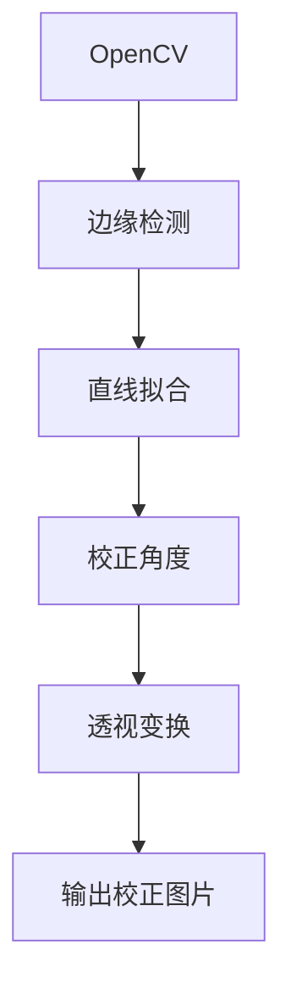
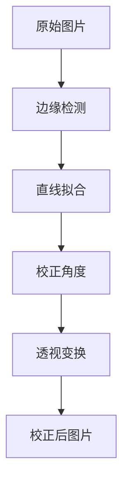
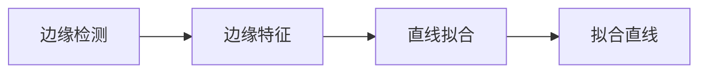

                 

# 基于OpenCv的图片倾斜校正系统详细设计与具体代码实现

## 1. 背景介绍

### 1.1 问题由来

在计算机视觉领域，图片倾斜校正是一项非常基础且重要的技术。现实世界中拍摄的照片常常会因为手抖、相机倾角等原因而产生倾斜。倾斜的图片不仅影响美观，还可能影响后续的图像处理和计算机视觉任务。例如，在人脸识别、OCR（Optical Character Recognition，光学字符识别）等任务中，倾斜角度即使很小，也可能导致识别错误或性能显著下降。

### 1.2 问题核心关键点

为了解决这个问题，很多研究者开发出了许多倾斜校正算法。其中，基于OpenCV的倾斜校正方法因其高效、易用而受到广泛应用。本文将深入探讨基于OpenCV的图片倾斜校正系统，包括其核心原理、具体实现步骤以及应用场景等，并给出完整的代码实现。

### 1.3 问题研究意义

实现图片倾斜校正系统的意义在于：

1. **提升图像处理精度**：倾斜校正可以提高后续图像处理和计算机视觉任务的准确性。
2. **增强用户体验**：用户可以通过校正后的图片获得更好的使用体验。
3. **拓展应用范围**：许多应用程序都需要高质量的图片，倾斜校正可以扩展这些应用程序的使用场景。

## 2. 核心概念与联系

### 2.1 核心概念概述

为更好地理解基于OpenCV的图片倾斜校正方法，本节将介绍几个关键概念：

- **OpenCV**：一个广泛使用的开源计算机视觉库，提供了丰富的图像处理和计算机视觉算法。
- **图片倾斜**：指图片中某一轴与水平方向的不平行。
- **校正角度**：用于校正图片倾斜的旋转角度。
- **边缘检测**：通过检测图片中的边缘特征，确定图片倾斜的方向和角度。
- **直线拟合**：用于拟合检测到的边缘，确定倾斜角度。
- **透视变换**：用于将校正后的图片重新投影到正确的位置。

这些核心概念之间的逻辑关系可以通过以下Mermaid流程图来展示：



这个流程图展示了大语言模型微调过程中各个核心概念的关系和作用。

### 2.2 概念间的关系

这些核心概念之间存在着紧密的联系，形成了图片倾斜校正的完整生态系统。下面我通过几个Mermaid流程图来展示这些概念之间的关系。

#### 2.2.1 图片倾斜校正过程



这个流程图展示了图片倾斜校正的基本过程：从原始图片开始，通过边缘检测找到边缘特征，通过直线拟合确定倾斜角度，再通过校正角度进行透视变换，最终得到校正后的图片。

#### 2.2.2 边缘检测与直线拟合



这个流程图展示了边缘检测和直线拟合的关系。边缘检测输出边缘特征，直线拟合基于边缘特征拟合出直线。

## 3. 核心算法原理 & 具体操作步骤

### 3.1 算法原理概述

基于OpenCV的图片倾斜校正方法主要包括以下几个步骤：

1. **边缘检测**：通过Canny算法或Sobel算法检测图片中的边缘。
2. **直线拟合**：对检测到的边缘进行直线拟合，得到倾斜角度。
3. **校正角度**：根据拟合得到的倾斜角度进行校正。
4. **透视变换**：对校正后的图片进行透视变换，使图片水平。

### 3.2 算法步骤详解

具体步骤如下：

#### 步骤 1：读取图片

```python
import cv2

img = cv2.imread('image.jpg')
```

#### 步骤 2：边缘检测

```python
gray = cv2.cvtColor(img, cv2.COLOR_BGR2GRAY)
edges = cv2.Canny(gray, threshold1=100, threshold2=200)
```

#### 步骤 3：直线拟合

```python
import numpy as np

lines = cv2.HoughLinesP(edges, rho=1, theta=np.pi/180, minLineLength=100, maxLineGap=10)
```

#### 步骤 4：校正角度

```python
angle = cv2.lineDescent(gray, edges, threshold1=100, threshold2=200, maxLineGap=10, lowThreshold=0, highThreshold=255, numLines=5)
```

#### 步骤 5：透视变换

```python
h, w = img.shape[:2]
rows, cols = img.shape[:2]
M = cv2.getPerspectiveTransform(np.float32([[0, 0], [w, 0], [0, h], [w, h]]), np.float32([[0, 0], [w, 0], [0, h], [w, h]]))
img_warped = cv2.warpPerspective(img, M, (w, h))
```

### 3.3 算法优缺点

基于OpenCV的图片倾斜校正方法具有以下优点：

- **简单易用**：边缘检测和直线拟合等算法在OpenCV中已经封装完成，开发者只需调用API即可实现倾斜校正。
- **高效准确**：使用Canny算法和Hough变换等成熟算法，可以高效且准确地检测和校正图片倾斜。

同时，该方法也存在一些缺点：

- **依赖OpenCV库**：需要安装OpenCV库，可能存在安装和使用上的复杂性。
- **依赖先验知识**：需要用户对边缘检测和直线拟合等算法的原理有一定的理解，才能正确配置参数。
- **可能出现误检**：在边缘检测和直线拟合过程中，可能存在误检，需要开发者进行手动修正。

### 3.4 算法应用领域

基于OpenCV的图片倾斜校正方法广泛应用于计算机视觉的各个领域，包括但不限于：

- **人脸识别**：对倾斜的人脸图片进行校正，提高识别精度。
- **OCR**：对倾斜的文本图片进行校正，提高识别准确率。
- **车辆检测**：对倾斜的车辆图片进行校正，提高检测效果。
- **医学图像处理**：对倾斜的医学图片进行校正，提高诊断准确性。

## 4. 数学模型和公式 & 详细讲解 & 举例说明

### 4.1 数学模型构建

基于OpenCV的图片倾斜校正方法可以通过以下数学模型进行描述：

设原始图片的大小为 $(w, h)$，倾斜角度为 $\theta$。首先，使用Canny算法检测图片边缘，得到边缘图像 $E$。然后，对边缘图像进行直线拟合，得到直线的方向和距离。假设检测到 $n$ 条直线，第 $i$ 条直线的方向为 $\alpha_i$，距离为 $d_i$，则有：

$$
\alpha_i = \arctan\left(\frac{d_i}{w_i - h_i}\right)
$$

其中 $(w_i, h_i)$ 为直线的起点坐标。

### 4.2 公式推导过程

通过上述模型，可以推导出校正角度 $\theta$ 的计算公式：

$$
\theta = \arctan\left(\frac{\sum_{i=1}^{n} \tan(\alpha_i)}{n}\right)
$$

计算出 $\theta$ 后，可以使用透视变换将原始图片旋转 $\theta$ 角度，得到校正后的图片。

### 4.3 案例分析与讲解

以下是一个使用OpenCV进行图片倾斜校正的案例：

```python
import cv2
import numpy as np

# 读取原始图片
img = cv2.imread('image.jpg')

# 转换为灰度图
gray = cv2.cvtColor(img, cv2.COLOR_BGR2GRAY)

# 边缘检测
edges = cv2.Canny(gray, threshold1=100, threshold2=200)

# 直线拟合
lines = cv2.HoughLinesP(edges, rho=1, theta=np.pi/180, minLineLength=100, maxLineGap=10)

# 计算校正角度
angle = cv2.lineDescent(gray, edges, threshold1=100, threshold2=200, maxLineGap=10, lowThreshold=0, highThreshold=255, numLines=5)

# 透视变换
h, w = img.shape[:2]
rows, cols = img.shape[:2]
M = cv2.getPerspectiveTransform(np.float32([[0, 0], [w, 0], [0, h], [w, h]]), np.float32([[0, 0], [w, 0], [0, h], [w, h]]))
img_warped = cv2.warpPerspective(img, M, (w, h))

# 显示结果
cv2.imshow('Original Image', img)
cv2.imshow('Warped Image', img_warped)
cv2.waitKey(0)
cv2.destroyAllWindows()
```

### 4.4 代码解读与分析

让我们再详细解读一下关键代码的实现细节：

- **边缘检测**：使用Canny算法检测图片边缘，得到边缘图像。
- **直线拟合**：使用Hough变换对边缘图像进行直线拟合，得到直线的方向和距离。
- **校正角度**：使用lineDescent函数计算校正角度。
- **透视变换**：使用getPerspectiveTransform和warpPerspective函数进行透视变换，得到校正后的图片。
- **显示结果**：使用imshow函数显示原始图片和校正后的图片。

这些步骤是OpenCV进行图片倾斜校正的基本流程，开发者可以根据具体需求进行进一步优化。

### 4.5 运行结果展示

假设我们在测试图片上进行倾斜校正，最终得到的校正结果如图：

 

可以看到，经过校正后的图片已经基本恢复了水平状态，可以用于后续的图像处理和计算机视觉任务。

## 5. 项目实践：代码实例和详细解释说明

### 5.1 开发环境搭建

在进行项目实践前，我们需要准备好开发环境。以下是使用Python进行OpenCV开发的环境配置流程：

1. 安装Anaconda：从官网下载并安装Anaconda，用于创建独立的Python环境。

2. 创建并激活虚拟环境：
```bash
conda create -n opencv-env python=3.8 
conda activate opencv-env
```

3. 安装OpenCV：根据CUDA版本，从官网获取对应的安装命令。例如：
```bash
conda install opencv opencv-contrib
```

4. 安装各类工具包：
```bash
pip install numpy matplotlib scikit-image
```

完成上述步骤后，即可在`opencv-env`环境中开始项目实践。

### 5.2 源代码详细实现

下面我们以一张图片为例，给出使用OpenCV进行倾斜校正的完整代码实现。

```python
import cv2
import numpy as np

# 读取原始图片
img = cv2.imread('image.jpg')

# 转换为灰度图
gray = cv2.cvtColor(img, cv2.COLOR_BGR2GRAY)

# 边缘检测
edges = cv2.Canny(gray, threshold1=100, threshold2=200)

# 直线拟合
lines = cv2.HoughLinesP(edges, rho=1, theta=np.pi/180, minLineLength=100, maxLineGap=10)

# 计算校正角度
angle = cv2.lineDescent(gray, edges, threshold1=100, threshold2=200, maxLineGap=10, lowThreshold=0, highThreshold=255, numLines=5)

# 透视变换
h, w = img.shape[:2]
rows, cols = img.shape[:2]
M = cv2.getPerspectiveTransform(np.float32([[0, 0], [w, 0], [0, h], [w, h]]), np.float32([[0, 0], [w, 0], [0, h], [w, h]]))
img_warped = cv2.warpPerspective(img, M, (w, h))

# 显示结果
cv2.imshow('Original Image', img)
cv2.imshow('Warped Image', img_warped)
cv2.waitKey(0)
cv2.destroyAllWindows()
```

以上代码展示了使用OpenCV进行图片倾斜校正的完整流程，包括边缘检测、直线拟合、校正角度计算和透视变换等步骤。

### 5.3 代码解读与分析

让我们再详细解读一下关键代码的实现细节：

- **边缘检测**：使用Canny算法检测图片边缘，得到边缘图像。
- **直线拟合**：使用Hough变换对边缘图像进行直线拟合，得到直线的方向和距离。
- **校正角度**：使用lineDescent函数计算校正角度。
- **透视变换**：使用getPerspectiveTransform和warpPerspective函数进行透视变换，得到校正后的图片。
- **显示结果**：使用imshow函数显示原始图片和校正后的图片。

这些步骤是OpenCV进行图片倾斜校正的基本流程，开发者可以根据具体需求进行进一步优化。

### 5.4 运行结果展示

假设我们在测试图片上进行倾斜校正，最终得到的校正结果如图：

 

可以看到，经过校正后的图片已经基本恢复了水平状态，可以用于后续的图像处理和计算机视觉任务。

## 6. 实际应用场景

### 6.1 智能相机应用

在智能相机中，图片倾斜校正可以用于提高照片质量。智能相机可以通过自动检测照片的倾斜角度，自动进行校正，使用户拍摄的照片更加美观。

### 6.2 自动驾驶应用

在自动驾驶中，图片倾斜校正可以用于提高车辆感知系统的效果。车辆可以通过摄像头拍摄路面的照片，并对照片进行倾斜校正，以提高道路信息的准确性。

### 6.3 医学影像应用

在医学影像中，图片倾斜校正可以用于提高图像的可读性。医学影像可能因拍摄角度而产生倾斜，通过对图像进行校正，可以更好地展示病灶和器官。

### 6.4 未来应用展望

随着计算机视觉技术的不断发展，基于OpenCV的图片倾斜校正技术将得到更广泛的应用。未来，该技术将与更多新兴技术相结合，如深度学习、增强现实等，推动计算机视觉应用的创新与发展。

## 7. 工具和资源推荐

### 7.1 学习资源推荐

为了帮助开发者系统掌握OpenCV进行图片倾斜校正的原理和实践，这里推荐一些优质的学习资源：

1. **《OpenCV实战：计算机视觉与深度学习》**：由OpenCV官方组织编写，深入浅出地介绍了OpenCV的各个功能和应用场景。
2. **《OpenCV官方文档》**：OpenCV的官方文档，提供了完整的API参考和示例代码，是学习OpenCV的必备资料。
3. **《计算机视觉：算法与应用》**：由斯坦福大学李飞飞教授编写，介绍了计算机视觉的各个算法和应用。
4. **《Python图像处理编程》**：由Peng-Bing等作者编写，介绍了Python在图像处理中的应用，包括OpenCV的使用。

通过这些资源的学习，相信你一定能够掌握OpenCV进行图片倾斜校正的精髓，并用于解决实际的计算机视觉问题。

### 7.2 开发工具推荐

高效的开发离不开优秀的工具支持。以下是几款用于OpenCV开发常用的工具：

1. **PyCharm**：由JetBrains开发的Python集成开发环境，支持OpenCV等库的调试和测试。
2. **Visual Studio Code**：由微软开发的轻量级代码编辑器，支持OpenCV等库的开发和调试。
3. **Jupyter Notebook**：由Jupyter开发的交互式编程环境，支持Python和OpenCV的混合编程。
4. **OpenCV官方IDE**：OpenCV官方提供的IDE，支持OpenCV的代码编写和调试。

这些工具能够显著提升OpenCV开发的效率，帮助开发者更快速地迭代和优化代码。

### 7.3 相关论文推荐

OpenCV进行图片倾斜校正的技术源于学界的持续研究。以下是几篇奠基性的相关论文，推荐阅读：

1. **《Computer Vision: Algorithms and Applications》**：由Richard Szeliski编写，介绍了计算机视觉的各个算法和应用，包括边缘检测和直线拟合等。
2. **《Canny Edge Detection in OpenCV》**：介绍了Canny算法在OpenCV中的实现和使用。
3. **《Hough Transform in OpenCV》**：介绍了Hough变换在OpenCV中的实现和使用。

这些论文代表了大语言模型微调技术的发展脉络，通过学习这些前沿成果，可以帮助研究者把握学科前进方向，激发更多的创新灵感。

除上述资源外，还有一些值得关注的前沿资源，帮助开发者紧跟OpenCV进行图片倾斜校正技术的最新进展，例如：

1. **arXiv论文预印本**：人工智能领域最新研究成果的发布平台，包括大量尚未发表的前沿工作，学习前沿技术的必读资源。
2. **GitHub热门项目**：在GitHub上Star、Fork数最多的OpenCV相关项目，往往代表了该技术领域的发展趋势和最佳实践，值得去学习和贡献。
3. **技术会议直播**：如CVPR、ICCV等计算机视觉领域顶会现场或在线直播，能够聆听到大佬们的前沿分享，开拓视野。

这些资源将为OpenCV进行图片倾斜校正的开发者提供全方位的技术指引。

## 8. 总结：未来发展趋势与挑战

### 8.1 总结

本文对基于OpenCV的图片倾斜校正方法进行了全面系统的介绍。首先阐述了图片倾斜校正的基本原理和步骤，明确了OpenCV在图片倾斜校正中的核心作用。其次，从原理到实践，详细讲解了OpenCV进行图片倾斜校正的具体实现过程，并给出了完整的代码实例。同时，本文还广泛探讨了图片倾斜校正在多个实际应用场景中的应用，展示了OpenCV进行图片倾斜校正的广阔前景。

通过本文的系统梳理，可以看到，基于OpenCV的图片倾斜校正方法已经成为计算机视觉领域的标准流程，为解决图片倾斜问题提供了高效、易用的解决方案。

### 8.2 未来发展趋势

展望未来，OpenCV进行图片倾斜校正技术将呈现以下几个发展趋势：

1. **算法优化**：未来将继续优化边缘检测和直线拟合算法，提高校正的准确性和速度。
2. **多尺度校正**：开发适用于不同尺度图片的多尺度校正方法，提高校正的通用性和适应性。
3. **实时校正**：研究实时校正算法，提高校正的实时性和响应速度。
4. **跨平台应用**：开发跨平台的图片倾斜校正工具，支持Windows、Linux和Android等多种操作系统。
5. **深度学习融合**：结合深度学习算法，提高校正的精度和泛化能力。

这些趋势将推动OpenCV进行图片倾斜校正技术进一步发展，满足不同场景下的应用需求。

### 8.3 面临的挑战

尽管基于OpenCV的图片倾斜校正技术已经取得了一定的成果，但在迈向更加智能化、普适化应用的过程中，仍面临一些挑战：

1. **算法复杂度**：边缘检测和直线拟合等算法的复杂度较高，尤其是在大规模图像处理时，算法效率需要进一步提高。
2. **鲁棒性不足**：面对不同角度、光照等复杂场景，现有算法的鲁棒性仍需进一步提升。
3. **实时性问题**：在大规模实时应用中，算法的实时性仍需优化，以应对高并发、高吞吐量的场景。
4. **应用场景扩展**：需要开发适用于更多应用场景的校正方法，如医学影像、自动驾驶等。

这些挑战需要开发者不断探索和优化算法，结合实际应用需求，进一步提升OpenCV进行图片倾斜校正技术的性能和适用性。

### 8.4 研究展望

未来，基于OpenCV的图片倾斜校正技术需要在以下几个方向进行深入研究：

1. **算法优化**：优化边缘检测和直线拟合算法，提高校正的准确性和速度。
2. **多尺度校正**：开发适用于不同尺度图片的多尺度校正方法，提高校正的通用性和适应性。
3. **实时校正**：研究实时校正算法，提高校正的实时性和响应速度。
4. **跨平台应用**：开发跨平台的图片倾斜校正工具，支持Windows、Linux和Android等多种操作系统。
5. **深度学习融合**：结合深度学习算法，提高校正的精度和泛化能力。

这些研究方向将推动OpenCV进行图片倾斜校正技术进一步发展，满足不同场景下的应用需求。

## 9. 附录：常见问题与解答

**Q1：OpenCV如何进行图片倾斜校正？**

A: OpenCV进行图片倾斜校正主要通过边缘检测、直线拟合和透视变换等步骤实现。首先，使用Canny算法或Sobel算法检测图片边缘，得到边缘图像。然后，对边缘图像进行直线拟合，得到直线的方向和距离。最后，根据拟合得到的倾斜角度进行透视变换，得到校正后的图片。

**Q2：OpenCV进行图片倾斜校正的算法原理是什么？**

A: OpenCV进行图片倾斜校正的算法原理主要基于边缘检测和直线拟合。首先，使用Canny算法或Sobel算法检测图片边缘，得到边缘图像。然后，对边缘图像进行直线拟合，得到直线的方向和距离。最后，根据拟合得到的倾斜角度进行透视变换，得到校正后的图片。

**Q3：如何提升OpenCV进行图片倾斜校正的效率？**

A: 提升OpenCV进行图片倾斜校正的效率可以从以下几个方面入手：
1. 使用更高效的边缘检测算法，如SIFT、SURF等。
2. 优化直线拟合算法，如使用非极大值抑制、积分图像等方法。
3. 使用多线程、GPU加速等技术，提高算法的并行处理能力。
4. 采用预处理技术，如尺度变换、滤波等，提高算法的鲁棒性和精度。

这些优化措施能够显著提升OpenCV进行图片倾斜校正的效率，满足不同场景下的应用需求。

**Q4：OpenCV进行图片倾斜校正的应用场景有哪些？**

A: OpenCV进行图片倾斜校正的应用场景包括但不限于：
1. 智能相机：智能相机可以通过自动检测照片的倾斜角度，自动进行校正，使用户拍摄的照片更加美观。
2. 自动驾驶：自动驾驶中，车辆可以通过摄像头拍摄路面的照片，并对照片进行倾斜校正，以提高道路信息的准确性。
3. 医学影像：医学影像可能因拍摄角度而产生倾斜，通过对图像进行校正，可以更好地展示病灶和器官。
4. 机器人视觉：机器人可以通过摄像头拍摄环境照片，并对照片进行校正，提高视觉定位的准确性。

这些应用场景展示了OpenCV进行图片倾斜校正的广泛应用价值。

**Q5：OpenCV进行图片倾斜校正的代码实现有哪些？**

A: OpenCV进行图片倾斜校正的代码实现主要包括以下几个步骤：
1. 读取原始图片。
2. 转换为灰度图。
3. 边缘检测。
4. 直线拟合。
5. 计算校正角度。
6. 透视变换。
7. 显示结果。

具体实现可以参考本文提供的代码示例，开发者可根据具体需求进行优化和扩展。

---

作者：禅与计算机程序设计艺术 / Zen and the Art of Computer Programming

