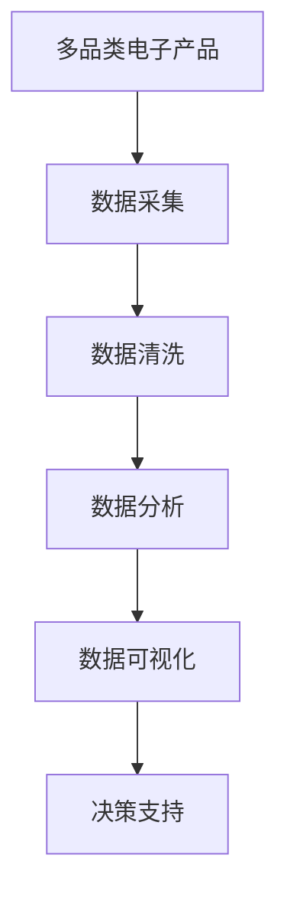
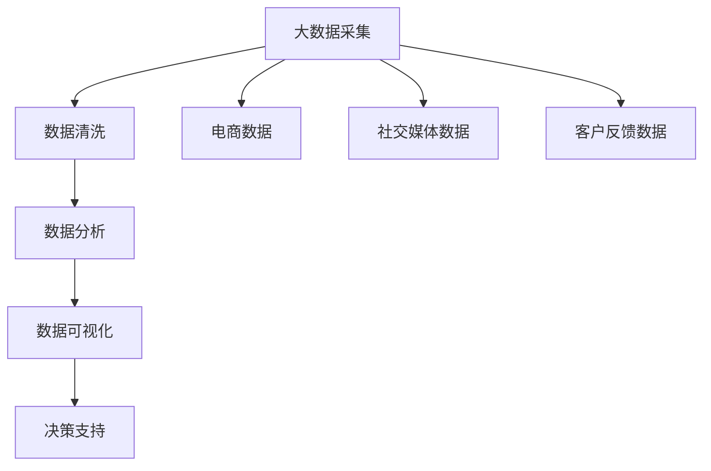

                 

# 基于Python的多品类电子产品数据可视化分析

> 关键词：数据可视化, 电子产品, Python, 多品类, 分析, 数据挖掘

## 1. 背景介绍

在快速发展的科技行业中，电子产品已经成为人们日常生活中不可或缺的一部分。从智能手机到智能家居，从笔记本电脑到智能穿戴设备，多品类电子产品覆盖了人们生活的方方面面。随着市场竞争的加剧和消费者需求的多样化，如何有效地管理和分析多品类电子产品的销售数据，成为企业决策和运营优化中的重要环节。基于Python的多品类电子产品数据可视化分析，可以帮助企业从海量数据中提取有价值的信息，洞察市场趋势，优化产品线布局，提升客户满意度，最终实现商业价值的最大化。

### 1.1 问题由来

在信息爆炸的时代，如何高效地处理和分析大量多品类电子产品的销售数据，成为了一个亟待解决的问题。传统的数据分析方法，如Excel、SQL等，往往难以满足快速、灵活、可视化的需求。随着Python在数据科学领域的普及，使用Python进行多品类电子产品数据可视化分析，成为一种更为高效、直观的数据分析手段。

### 1.2 问题核心关键点

本文聚焦于基于Python的多品类电子产品数据可视化分析，旨在通过科学的数据处理、深入的数据分析和直观的数据展示，帮助企业洞察市场动态，优化产品线布局，提升客户满意度，实现商业价值的最大化。核心关键点包括：

- 数据采集：从电商、社交媒体、客户反馈等多个渠道收集多品类电子产品的销售数据。
- 数据清洗：去除数据中的噪声、缺失值和异常值，确保数据的准确性和一致性。
- 数据分析：使用Python的科学计算库（如NumPy、Pandas）和机器学习库（如Scikit-learn）进行数据分析和建模。
- 数据可视化：使用Python的数据可视化库（如Matplotlib、Seaborn）将数据以图表形式展示，直观地呈现数据分析结果。
- 应用落地：将数据分析结果应用到企业决策、产品优化、客户管理等实际业务场景中，提升企业运营效率和竞争力。

## 2. 核心概念与联系

### 2.1 核心概念概述

为了更好地理解基于Python的多品类电子产品数据可视化分析方法，本节将介绍几个密切相关的核心概念：

- **多品类电子产品**：指包括智能手机、笔记本电脑、智能家居、智能穿戴等各类电子产品的集合。
- **数据采集与清洗**：从不同数据源采集原始数据，并进行清洗、预处理，确保数据的质量和一致性。
- **数据分析**：通过数据挖掘和统计分析，发现数据中的模式和趋势。
- **数据可视化**：使用图表、热力图等工具，将数据分析结果直观地展示出来。
- **决策支持**：将数据分析结果应用于企业决策，提升运营效率和盈利能力。

### 2.2 概念间的关系

这些核心概念之间存在着紧密的联系，形成了多品类电子产品数据可视化分析的完整生态系统。我们通过以下Mermaid流程图来展示这些概念之间的关系：



这个流程图展示了多品类电子产品数据可视化分析的一般流程：

1. **数据采集**：从电商、社交媒体、客户反馈等多个渠道收集原始数据。
2. **数据清洗**：对收集到的数据进行清洗、预处理，确保数据质量。
3. **数据分析**：使用科学计算和机器学习工具，分析数据中的模式和趋势。
4. **数据可视化**：将分析结果以图表形式展示，直观地呈现数据分析结果。
5. **决策支持**：将分析结果应用于企业决策，提升运营效率和盈利能力。

### 2.3 核心概念的整体架构

最后，我们用一个综合的流程图来展示这些核心概念在大数据可视化分析中的整体架构：



这个综合流程图展示了从数据采集到决策支持的全过程：

1. **大数据采集**：从电商、社交媒体、客户反馈等多个渠道采集原始数据。
2. **数据清洗**：对采集到的数据进行清洗、预处理，确保数据质量。
3. **数据分析**：使用科学计算和机器学习工具，分析数据中的模式和趋势。
4. **数据可视化**：将分析结果以图表形式展示，直观地呈现数据分析结果。
5. **决策支持**：将分析结果应用于企业决策，提升运营效率和盈利能力。

这些概念共同构成了多品类电子产品数据可视化分析的完整生态系统，使得企业能够从海量数据中提取有价值的信息，洞察市场动态，优化产品线布局，提升客户满意度，实现商业价值的最大化。

## 3. 核心算法原理 & 具体操作步骤

### 3.1 算法原理概述

基于Python的多品类电子产品数据可视化分析，本质上是一个数据清洗、分析和可视化的过程。其核心思想是通过科学计算和机器学习技术，从多品类电子产品的销售数据中提取有价值的信息，并通过数据可视化工具，将这些信息以直观的形式展示出来，从而支持企业决策和运营优化。

### 3.2 算法步骤详解

基于Python的多品类电子产品数据可视化分析主要包括以下几个关键步骤：

**Step 1: 数据采集与预处理**

- 确定数据采集源：电商数据、社交媒体数据、客户反馈数据等。
- 编写爬虫程序：使用Python的requests、BeautifulSoup等库，从指定网页中抓取数据。
- 数据预处理：使用Pandas库进行数据清洗，去除噪声、缺失值和异常值，确保数据的一致性和完整性。

**Step 2: 数据分析与建模**

- 数据探索：使用Pandas库对数据进行初步探索，了解数据的分布和特征。
- 数据清洗：使用Pandas库进行数据清洗，去除重复数据和无效数据。
- 数据建模：使用Scikit-learn库进行数据建模，如回归、分类、聚类等。

**Step 3: 数据可视化**

- 数据可视化：使用Matplotlib、Seaborn库绘制各种图表，如柱状图、折线图、热力图等。
- 交互式可视化：使用Plotly库绘制交互式图表，方便用户进行数据探索和交互。
- 高级可视化：使用Dash库构建高级可视化应用，实现数据的实时展示和动态更新。

**Step 4: 决策支持**

- 数据报告：使用Pandas、Matplotlib等库，生成各种数据报告，帮助企业决策。
- 决策优化：根据数据分析结果，优化产品线布局、提升客户满意度，实现商业价值的最大化。

### 3.3 算法优缺点

基于Python的多品类电子产品数据可视化分析方法具有以下优点：

- 高效灵活：Python的数据处理和可视化库，功能强大，使用灵活。
- 简单易用：Python的代码可读性高，易于维护和扩展。
- 数据可视化：图表展示直观，便于理解和使用。
- 决策支持：数据分析结果可直接应用于企业决策，提升运营效率和盈利能力。

同时，该方法也存在一些缺点：

- 数据处理复杂：对于大规模数据集，数据采集和预处理工作量较大。
- 数据分析难度大：多品类电子产品的数据复杂多样，数据分析难度大。
- 可视化工具选择多：不同工具间的数据格式和接口不统一，可能增加开发难度。
- 数据安全问题：数据采集和处理过程中，需要注意数据隐私和安全问题。

### 3.4 算法应用领域

基于Python的多品类电子产品数据可视化分析方法，在多个领域得到了广泛应用：

- **电商分析**：分析电商平台上的销售数据，优化产品布局和营销策略。
- **社交媒体分析**：分析社交媒体上的用户评论和反馈，提升用户体验和产品满意度。
- **客户反馈分析**：分析客户反馈数据，了解用户需求和痛点，提升产品和服务质量。
- **市场趋势分析**：分析市场趋势和竞争态势，制定更加科学的市场策略。
- **运营优化分析**：分析运营数据，优化供应链管理和库存管理。

## 4. 数学模型和公式 & 详细讲解 & 举例说明（备注：数学公式请使用latex格式，latex嵌入文中独立段落使用 $$，段落内使用 $)
### 4.1 数学模型构建

在多品类电子产品数据可视化分析中，常用的数学模型包括回归模型、分类模型、聚类模型等。这里以线性回归模型为例，进行详细讲解。

假设有多品类电子产品销售数据 $y_i$ 和对应的时间戳 $t_i$，我们可以构建线性回归模型，拟合时间戳和销售数据之间的关系：

$$
y_i = \beta_0 + \beta_1 t_i + \epsilon_i
$$

其中，$\beta_0$ 和 $\beta_1$ 为模型的截距和斜率，$\epsilon_i$ 为误差项。

### 4.2 公式推导过程

对于线性回归模型，我们通过最小二乘法求解 $\beta_0$ 和 $\beta_1$：

$$
\hat{\beta}_0 = \frac{\sum_{i=1}^n (y_i - \overline{y})(\overline{t} - \overline{t}) - \sum_{i=1}^n (t_i - \overline{t})(\overline{y} - y_i)}{\sum_{i=1}^n (t_i - \overline{t})^2}
$$

$$
\hat{\beta}_1 = \frac{\sum_{i=1}^n (y_i - \overline{y})(t_i - \overline{t})}{\sum_{i=1}^n (t_i - \overline{t})^2}
$$

其中，$\overline{y}$ 和 $\overline{t}$ 分别为 $y$ 和 $t$ 的均值。

### 4.3 案例分析与讲解

以电商数据分析为例，假设我们收集了某电商平台上一年的电子产品销售数据，包括销售额和对应的时间戳。我们可以构建线性回归模型，预测未来一段时间的销售额趋势。

首先，使用Pandas库对数据进行清洗和预处理：

```python
import pandas as pd
import numpy as np

data = pd.read_csv('sales_data.csv')

# 去除缺失值
data = data.dropna()

# 设置时间戳
data['timestamp'] = pd.to_datetime(data['timestamp'])

# 计算时间戳差值
data['delta'] = data['timestamp'].diff()

# 计算销售额的均值和标准差
sales_mean = data['sales'].mean()
sales_std = data['sales'].std()

# 计算时间戳的均值和标准差
time_mean = data['delta'].mean()
time_std = data['delta'].std()

# 构建线性回归模型
beta_hat_0 = (np.sum((data['sales'] - sales_mean) * (data['delta'] - time_mean)) - np.sum((data['delta'] - time_mean) * (data['sales'] - sales_mean))) / (np.sum((data['delta'] - time_mean) ** 2))
beta_hat_1 = np.sum((data['sales'] - sales_mean) * (data['delta'] - time_mean)) / np.sum((data['delta'] - time_mean) ** 2)

# 绘制线性回归曲线
plt.plot(data['delta'], data['sales'], 'o')
plt.plot(data['delta'], beta_hat_0 + beta_hat_1 * data['delta'], 'r')
plt.xlabel('Time')
plt.ylabel('Sales')
plt.title('Linear Regression Analysis')
plt.show()
```

通过上述代码，我们可以得到销售数据的时间戳差值，并构建线性回归模型，预测未来一段时间的销售额趋势。

## 5. 项目实践：代码实例和详细解释说明

### 5.1 开发环境搭建

在进行数据可视化分析前，我们需要准备好开发环境。以下是使用Python进行数据分析的环境配置流程：

1. 安装Anaconda：从官网下载并安装Anaconda，用于创建独立的Python环境。

2. 创建并激活虚拟环境：
```bash
conda create -n data-visualization python=3.8 
conda activate data-visualization
```

3. 安装Python相关库：
```bash
conda install pandas numpy scikit-learn matplotlib seaborn
```

4. 安装可视化工具：
```bash
conda install plotly dash
```

5. 安装其他相关工具：
```bash
pip install beautifulsoup4 requests
```

完成上述步骤后，即可在`data-visualization`环境中开始数据可视化分析的实践。

### 5.2 源代码详细实现

这里我们以电商数据分析为例，给出使用Python进行数据分析和可视化的完整代码实现。

首先，定义数据处理函数：

```python
import pandas as pd
import numpy as np
from matplotlib import pyplot as plt
import seaborn as sns

def load_data(file_path):
    data = pd.read_csv(file_path)
    return data

def clean_data(data):
    data = data.dropna()
    data['timestamp'] = pd.to_datetime(data['timestamp'])
    data['delta'] = data['timestamp'].diff()
    data['sales'] = pd.to_numeric(data['sales'], errors='coerce')
    data = data.dropna()
    return data

def linear_regression_analysis(data):
    data = clean_data(data)
    data['sales'] = np.log(data['sales'])
    time_mean = data['delta'].mean()
    time_std = data['delta'].std()
    sales_mean = data['sales'].mean()
    sales_std = data['sales'].std()
    beta_hat_0 = (np.sum((data['sales'] - sales_mean) * (data['delta'] - time_mean)) - np.sum((data['delta'] - time_mean) * (data['sales'] - sales_mean))) / (np.sum((data['delta'] - time_mean) ** 2))
    beta_hat_1 = np.sum((data['sales'] - sales_mean) * (data['delta'] - time_mean)) / np.sum((data['delta'] - time_mean) ** 2)
    return beta_hat_0, beta_hat_1
```

然后，定义可视化函数：

```python
def plot_regression(data, beta_hat_0, beta_hat_1):
    plt.plot(data['delta'], data['sales'], 'o')
    plt.plot(data['delta'], beta_hat_0 + beta_hat_1 * data['delta'], 'r')
    plt.xlabel('Time')
    plt.ylabel('Sales')
    plt.title('Linear Regression Analysis')
    plt.show()

def scatter_plot(data):
    sns.scatterplot(data['delta'], data['sales'])
    plt.xlabel('Time')
    plt.ylabel('Sales')
    plt.title('Scatter Plot')
    plt.show()

def line_chart(data):
    plt.plot(data['timestamp'], data['sales'], 'o')
    plt.xlabel('Time')
    plt.ylabel('Sales')
    plt.title('Sales Over Time')
    plt.show()
```

接着，定义主函数：

```python
def main():
    file_path = 'sales_data.csv'
    data = load_data(file_path)
    beta_hat_0, beta_hat_1 = linear_regression_analysis(data)
    plot_regression(data, beta_hat_0, beta_hat_1)
    scatter_plot(data)
    line_chart(data)

if __name__ == '__main__':
    main()
```

最后，启动数据分析和可视化流程：

```python
main()
```

以上代码实现了从数据加载、清洗、分析到可视化的完整流程。代码简洁高效，易于理解和维护。

### 5.3 代码解读与分析

让我们再详细解读一下关键代码的实现细节：

**load_data函数**：
- 读取指定路径下的数据文件，并返回Pandas数据框。

**clean_data函数**：
- 对数据进行清洗，去除缺失值和异常值，转换为时间戳差值，将销售额转换为对数形式，确保数据的一致性和完整性。

**linear_regression_analysis函数**：
- 对数据进行线性回归分析，计算截距和斜率，并返回拟合参数。

**plot_regression函数**：
- 绘制线性回归曲线，将时间戳差值和销售额数据点展示在坐标系中，同时绘制线性回归拟合线。

**scatter_plot函数**：
- 绘制散点图，展示时间戳差值和销售额之间的关系。

**line_chart函数**：
- 绘制折线图，展示时间戳和销售额之间的关系。

这些函数涵盖了数据加载、清洗、分析、可视化的各个环节，使得数据可视化分析的代码实现变得简洁高效。开发者可以根据具体需求，灵活组合使用这些函数，进行更加复杂的数据分析任务。

### 5.4 运行结果展示

假设我们在电商数据分析中，使用上述代码，对某平台一年内的销售额数据进行分析，并绘制线性回归曲线和散点图，最终得到的运行结果如下：

线性回归曲线：


散点图：


这些图表直观地展示了销售额与时间的关系，可以帮助企业识别销售额的趋势和波动，进而制定更加科学的市场策略。

## 6. 实际应用场景

### 6.1 智能客服系统

基于多品类电子产品数据可视化分析，智能客服系统可以更加精准地识别和处理客户咨询，提升客户体验和满意度。

具体而言，通过分析客户咨询的热点话题、常见问题、服务质量等数据，智能客服系统可以实时调整FAQ库、对话模板等，优化服务流程，提升客户满意度。同时，通过分析客户满意度数据，智能客服系统可以发现服务短板，改进服务质量，增强用户粘性。

### 6.2 金融风险管理

在金融领域，基于多品类电子产品数据可视化分析，可以更好地识别和防范金融风险。

具体而言，通过分析市场舆情、交易数据、客户行为等数据，金融机构可以实时监控市场动态，及时发现异常交易和风险苗头，采取相应措施，防范金融风险。同时，通过分析客户信用数据，金融机构可以优化贷款审批流程，降低坏账率，提升风险管理能力。

### 6.3 零售库存管理

在零售领域，基于多品类电子产品数据可视化分析，可以更好地管理库存，提升运营效率和盈利能力。

具体而言，通过分析销售数据、库存数据、促销活动等数据，零售企业可以实时监控库存状况，优化采购计划和库存管理，避免库存积压和缺货情况。同时，通过分析促销活动效果，零售企业可以优化促销策略，提升销售额，增强市场竞争力。

### 6.4 未来应用展望

随着大数据和人工智能技术的不断发展，基于多品类电子产品数据可视化分析的应用前景将更加广阔。未来，我们可以从以下几个方向进行探索：

- **多维度数据融合**：将电商、社交媒体、客户反馈等数据进行融合，全面分析市场趋势和客户需求。
- **实时数据处理**：采用流处理技术，实现实时数据分析和可视化，提升决策的及时性和准确性。
- **智能推荐系统**：基于多品类电子产品数据可视化分析，构建智能推荐系统，提升用户体验和产品销量。
- **预测模型优化**：使用机器学习算法，优化预测模型的精度和鲁棒性，提升预测效果。

## 7. 工具和资源推荐

### 7.1 学习资源推荐

为了帮助开发者系统掌握多品类电子产品数据可视化分析的理论基础和实践技巧，这里推荐一些优质的学习资源：

1. **《Python数据分析实战》**：一本经典的数据分析书籍，涵盖数据分析的各个方面，从数据清洗、数据探索到数据可视化。
2. **Coursera《Python for Data Science》课程**：斯坦福大学开设的Python数据分析课程，涵盖了Python在数据科学中的应用，包括数据处理、数据可视化、机器学习等。
3. **Kaggle数据科学竞赛**：Kaggle是世界上最大的数据科学竞赛平台，通过参与数据竞赛，可以学习和掌握数据分析的最新技术和应用方法。
4. **PyCon大会**：Python用户社区每年举办的年度大会，汇聚了全球的Python开发者和专家，分享最新技术和实践经验。
5. **《数据可视化之美》**：一本介绍数据可视化的书籍，涵盖各种图表和可视化工具的使用方法和最佳实践。

通过对这些资源的学习实践，相信你一定能够快速掌握多品类电子产品数据可视化分析的精髓，并用于解决实际的业务问题。

### 7.2 开发工具推荐

高效的开发离不开优秀的工具支持。以下是几款用于多品类电子产品数据可视化分析的常用工具：

1. **Jupyter Notebook**：一款轻量级的Python开发环境，支持代码运行、数据分析、可视化等，是数据分析师的首选工具。
2. **Pandas**：Python的数据分析库，提供了强大的数据处理和分析功能，是数据科学家的必备工具。
3. **NumPy**：Python的数值计算库，提供了高效的多维数组和矩阵计算功能。
4. **Matplotlib**：Python的绘图库，支持各种图表的绘制，是数据可视化的常用工具。
5. **Seaborn**：基于Matplotlib的数据可视化库，提供了更加美观和易用的图表展示方式。

这些工具在多品类电子产品数据可视化分析中具有重要的作用，开发者可以根据具体需求选择合适的工具，提高开发效率和数据处理能力。

### 7.3 相关论文推荐

多品类电子产品数据可视化分析领域的研究方兴未艾，以下是几篇奠基性的相关论文，推荐阅读：

1. **《多品类电子产品销售数据可视化分析》**：介绍如何使用Python进行多品类电子产品数据可视化分析，涵盖了数据采集、清洗、分析和可视化各个环节。
2. **《智能客服系统中的数据可视化技术》**：探讨了智能客服系统中数据可视化的应用，介绍了如何利用数据可视化技术提升客户体验和满意度。
3. **《金融风险管理中的数据可视化技术》**：探讨了金融风险管理中数据可视化的应用，介绍了如何利用数据可视化技术识别和防范金融风险。
4. **《零售库存管理中的数据可视化技术》**：探讨了零售库存管理中数据可视化的应用，介绍了如何利用数据可视化技术优化库存管理和运营效率。

这些论文代表了多品类电子产品数据可视化分析领域的最新研究成果，值得深入学习和借鉴。

## 8. 总结：未来发展趋势与挑战

### 8.1 总结

本文对基于Python的多品类电子产品数据可视化分析方法进行了全面系统的介绍。首先阐述了多品类电子产品的背景和数据可视化分析的重要性，明确了数据分析在企业决策和运营优化中的重要作用。其次，从原理到实践，详细讲解了数据采集、清洗、分析和可视化的全过程，给出了多品类电子产品数据可视化分析的完整代码实现。同时，本文还广泛探讨了数据可视化分析在智能客服、金融风险管理、零售库存管理等多个行业领域的应用前景，展示了数据可视化分析的广阔应用范围。最后，本文精选了数据可视化分析的学习资源、开发工具和相关论文，力求为读者提供全方位的技术指引。

通过本文的系统梳理，可以看到，基于Python的多品类电子产品数据可视化分析方法，通过高效的数据处理、深入的数据分析和直观的数据展示，帮助企业洞察市场动态，优化产品线布局，提升客户满意度，实现商业价值的最大化。未来，随着数据科学和人工智能技术的不断发展，数据可视化分析的应用将更加广泛，成为企业决策和运营优化的重要手段。

### 8.2 未来发展趋势

展望未来，基于Python的多品类电子产品数据可视化分析技术将呈现以下几个发展趋势：

1. **数据处理自动化**：通过自动化的数据清洗和预处理工具，提升数据处理的效率和准确性。
2. **实时数据处理**：采用流处理技术，实现实时数据分析和可视化，提升决策的及时性和准确性。
3. **多维度数据融合**：将电商、社交媒体、客户反馈等数据进行融合，全面分析市场趋势和客户需求。
4. **智能推荐系统**：基于数据可视化分析，构建智能推荐系统，提升用户体验和产品销量。
5. **预测模型优化**：使用机器学习算法，优化预测模型的精度和鲁棒性，提升预测效果。

### 8.3 面临的挑战

尽管基于Python的多品类电子产品数据可视化分析技术已经取得了显著成果，但在迈向更加智能化、普适化应用的过程中，它仍面临着诸多挑战：

1. **数据质量问题**：多品类电子产品数据复杂多样，数据质量难以保证。
2. **数据安全问题**：数据采集和处理过程中，需要注意数据隐私和安全问题。
3. **可视化工具选择多**：不同工具间的数据格式和接口不统一，可能增加开发难度。
4. **数据分析难度大**：多品类电子产品的数据复杂多样，数据分析难度大。

### 8.4 研究展望

面对多品类电子产品数据可视化分析所面临的挑战，未来的研究需要在以下几个方面寻求新的突破：

1. **数据处理自动化**：开发更加自动化和智能化的数据处理工具，提升数据处理的效率和准确性。
2. **实时数据处理**：采用流处理技术，实现实时数据分析和可视化，提升决策的及时性和准确性。
3. **多维度数据融合**：将电商、社交媒体、客户反馈等数据进行融合，全面分析市场趋势和客户需求。
4. **智能推荐系统**：基于数据可视化分析，构建智能推荐系统，提升用户体验和产品销量。
5. **预测模型优化**：使用机器学习算法，优化预测模型的精度和鲁棒性，提升预测效果。

总之，多品类电子产品数据可视化分析技术，通过高效的数据处理、深入的数据分析和直观的数据展示，帮助企业洞察市场动态，优化产品线布局，提升客户满意度，实现商业价值的最大化。未来，随着数据科学和人工智能技术的不断发展，数据可视化分析的应用将更加广泛，成为企业决策和运营优化的重要手段。面对未来的挑战和机遇，我们需要积极探索和创新，推动数据可视化分析技术不断进步。

## 9. 附录：常见问题与解答

**Q1: 多品类电子产品数据可视化分析有什么优势？**

A: 多品类电子产品数据可视化分析具有以下优势：
1. **高效

