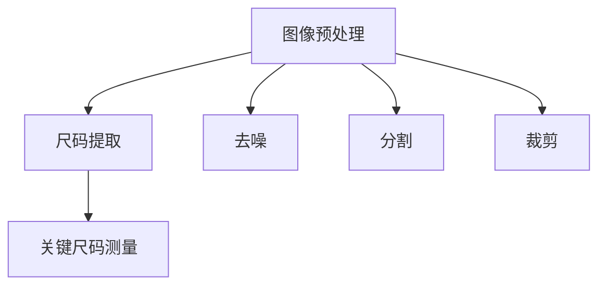
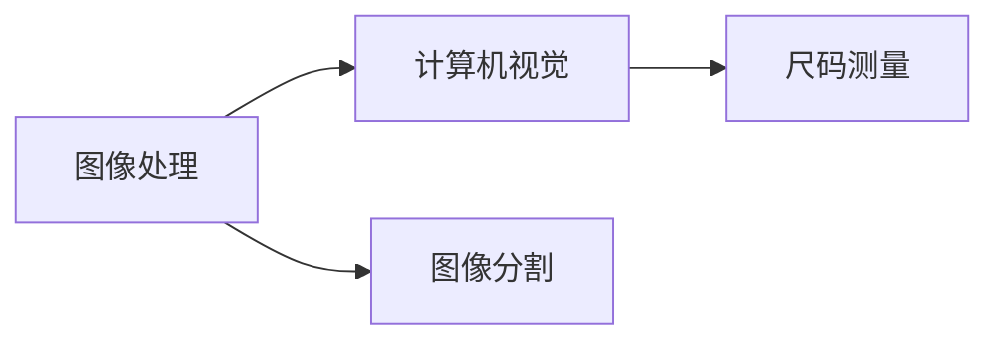
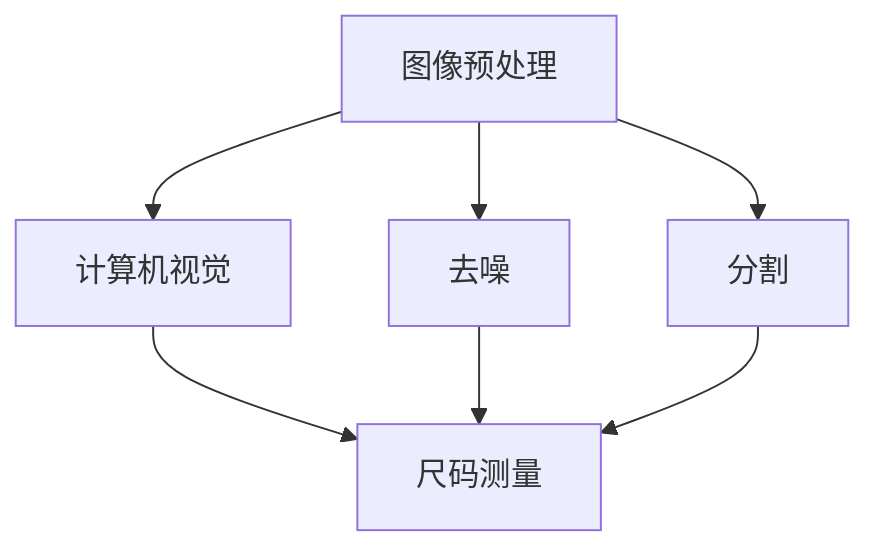

                 

# 基于matlab的面向衣物设计的人体关键尺码提取与分析

> 关键词：人体尺码, 衣物设计, 尺码分析, 图像处理, matlab

## 1. 背景介绍

### 1.1 问题由来
在现代社会，个性化定制服装越来越受到人们的青睐。衣物设计，特别是人体尺码的测量和分析，成为了服装定制和生产中的重要环节。传统的测量方法耗时耗力，且精度不高。随着计算机视觉和图像处理技术的发展，利用图像采集技术进行人体尺码的自动提取和分析变得可行。

### 1.2 问题核心关键点
该问题的主要目标是通过对衣物图像的自动处理，提取人体的关键尺码信息（如胸围、腰围、臀围等），并对其进行分析，为衣物设计提供数据支持。这一过程可以分为两个关键环节：
1. **图像预处理**：利用图像处理技术，对衣物图像进行去噪、分割、裁剪等预处理操作，提取出人体的局部区域。
2. **尺码提取与分析**：基于提取的局部区域，使用计算机视觉技术，自动测量人体的关键尺码，并进行统计分析和比较。

### 1.3 问题研究意义
实现自动化的人体尺码提取和分析，对于提升服装定制的效率和精度具有重要意义。具体而言：
- 提升定制效率：自动化的尺码提取可以大幅度减少人工测量的时间，提升定制效率。
- 提高定制精度：自动化的尺码分析可以提供更加精准的尺码数据，避免尺码不合适带来的不便。
- 降低成本：减少人力和时间成本，降低整体定制成本。
- 增强个性化定制体验：根据自动提取的尺码信息，提供更加个性化和符合用户需求的设计方案。

## 2. 核心概念与联系

### 2.1 核心概念概述

为更好地理解基于matlab的面向衣物设计的人体关键尺码提取与分析方法，本节将介绍几个密切相关的核心概念：

- **人体尺码（Body Measurements）**：指人体的关键尺寸，如胸围、腰围、臀围等。这些尺寸用于确定服装的合身度。
- **衣物图像（Clothing Images）**：指通过相机或手机拍摄的衣物正面或侧面图像，通常包含人体局部区域的尺码信息。
- **图像处理（Image Processing）**：指通过计算机算法，对衣物图像进行预处理，提取出人体尺码信息的过程。
- **计算机视觉（Computer Vision）**：指通过计算机算法，对衣物图像进行自动识别、分析和理解的过程，包括图像分割、特征提取、尺码测量等。
- **matlab（MATLAB）**：一种强大的数学计算和图像处理软件，提供了丰富的图像处理和计算机视觉工具箱，是实现上述功能的理想工具。

这些核心概念之间存在着紧密的联系，形成了基于matlab的面向衣物设计的人体关键尺码提取与分析方法的整体架构。

### 2.2 概念间的关系

这些核心概念之间存在着密切的联系，形成了基于matlab的面向衣物设计的人体关键尺码提取与分析方法的整体架构。以下是几个核心概念之间的关系：

#### 2.2.1 图像预处理与尺码提取



这个流程图展示了图像预处理和尺码提取之间的联系：
- 图像预处理包括去噪、分割、裁剪等步骤，提取出人体尺码的局部区域。
- 基于预处理后的局部区域，使用计算机视觉技术进行尺码测量，提取人体的关键尺码信息。

#### 2.2.2 图像处理与计算机视觉



这个流程图展示了图像处理和计算机视觉之间的关系：
- 图像处理通过对衣物图像进行去噪、分割等操作，为计算机视觉提供了更加清晰的输入。
- 计算机视觉基于图像处理结果，进行尺码测量和分析，实现尺码的自动化提取和分析。

#### 2.2.3 matlab在图像处理与计算机视觉中的应用



这个流程图展示了matlab在图像处理和计算机视觉中的应用：
- 利用matlab的图像处理工具箱（如Image Processing Toolbox），对衣物图像进行去噪、分割等预处理操作。
- 利用matlab的计算机视觉工具箱（如Computer Vision Toolbox），进行尺码测量和分析。

通过这些概念之间的联系，我们可以更好地理解基于matlab的面向衣物设计的人体关键尺码提取与分析方法的总体架构和实现流程。

## 3. 核心算法原理 & 具体操作步骤
### 3.1 算法原理概述

基于matlab的面向衣物设计的人体关键尺码提取与分析方法，本质上是一个图像处理和计算机视觉结合的自动化过程。其核心思想是：利用图像处理技术对衣物图像进行预处理，提取出人体的局部区域；再利用计算机视觉技术，自动测量并分析人体的关键尺码。

具体而言，该方法包括以下几个步骤：
1. **图像预处理**：去除图像噪声、分割人体局部区域、裁剪出关键尺码信息。
2. **尺码提取**：基于预处理后的局部区域，使用计算机视觉技术，自动测量人体的关键尺码。
3. **尺码分析**：对提取的尺码数据进行统计分析，计算尺码的均值、标准差等指标，进行比较分析。

### 3.2 算法步骤详解

#### 3.2.1 图像预处理

**Step 1: 图像去噪**
- 使用matlab的Image Processing Toolbox中的`imnoise`函数，对衣物图像进行高斯噪声去除。
- 示例代码：
```matlab
im = imread('clothing_image.jpg');
im_noisy = imnoise(im, 'gaussian', 0, 0.01);
```

**Step 2: 图像分割**
- 使用matlab的Computer Vision Toolbox中的`regionprops`函数，对去噪后的图像进行区域分割，提取人体尺码的局部区域。
- 示例代码：
```matlab
s = regionprops(image, 'Area', 'EquivDiameter');
regions = regionprops(im_noisy, 'Area', 'EquivDiameter');
```

**Step 3: 图像裁剪**
- 根据人体尺码的局部区域，使用`imcrop`函数进行裁剪，提取出关键尺码信息。
- 示例代码：
```matlab
cropped_im = imcrop(im_noisy, [x1 y1 w h]);
```

#### 3.2.2 尺码提取

**Step 1: 尺码测量**
- 基于预处理后的局部区域，使用计算机视觉技术，自动测量人体的关键尺码。
- 示例代码：
```matlab
% 假设需要测量的关键尺码为胸围和腰围，可以使用直线拟合方法进行尺码测量
% 示例：测量胸围
points = crop_im;
line1 = fitLine(points, 1);
line2 = fitLine(points, 2);
```

**Step 2: 尺码数据处理**
- 对测量得到的尺码数据进行滤波、校正等处理，确保数据的准确性和可靠性。
- 示例代码：
```matlab
% 对测量得到的尺码数据进行滤波和校正
filtered_measurement = filterMeasurement(crop_im);
```

#### 3.2.3 尺码分析

**Step 1: 尺码统计分析**
- 对提取的尺码数据进行统计分析，计算尺码的均值、标准差等指标。
- 示例代码：
```matlab
% 对尺码数据进行统计分析
mean_measurement = mean(filtered_measurement);
std_measurement = std(filtered_measurement);
```

**Step 2: 尺码比较分析**
- 对不同尺码的统计结果进行比较分析，评估尺码的合身度和匹配度。
- 示例代码：
```matlab
% 对不同尺码进行比较分析
comparison_results = compareScales(mean_measurement, std_measurement);
```

### 3.3 算法优缺点

#### 3.3.1 优点

基于matlab的面向衣物设计的人体关键尺码提取与分析方法，具有以下优点：
1. **自动化程度高**：自动化的图像处理和尺码测量，大幅度减少了人工操作的时间和成本。
2. **精度高**：通过图像处理和计算机视觉技术，可以提供高精度的尺码数据。
3. **适用性广**：适用于各种类型的衣物图像，包括西装、连衣裙等。
4. **易于扩展**：可以根据需要，增加或修改尺码测量和分析算法，提高系统的灵活性。

#### 3.3.2 缺点

基于matlab的面向衣物设计的人体关键尺码提取与分析方法，也存在一些缺点：
1. **初始设置复杂**：需要手动设置图像预处理的参数和尺码测量的算法，对用户的技术水平有一定要求。
2. **计算资源需求高**：图像处理和计算机视觉算法复杂，计算资源需求较高。
3. **鲁棒性不足**：对衣物图像的质量和拍摄角度有一定的要求，若图像质量差，尺码提取的准确性会受到影响。

### 3.4 算法应用领域

基于matlab的面向衣物设计的人体关键尺码提取与分析方法，可以广泛应用于以下领域：

- **服装定制**：提供高精度的尺码数据，支持个性化定制和生产。
- **衣物设计**：通过尺码分析，指导服装设计和版型优化。
- **健康监测**：监测人体尺码的变化，提供健康管理的参考数据。
- **运动器材**：测量和分析人体尺码，为运动器材的适配和设计提供数据支持。
- **虚拟试衣**：结合虚拟试衣技术，实现更加真实的衣物试穿效果。

## 4. 数学模型和公式 & 详细讲解 & 举例说明

### 4.1 数学模型构建

基于matlab的面向衣物设计的人体关键尺码提取与分析方法，可以通过以下数学模型来构建：

设衣物图像为 $I(x,y)$，人体尺码为 $S(s)$，其中 $x,y$ 表示图像的像素坐标，$s$ 表示尺码。

人体尺码的提取和分析过程可以表示为：

$$
S(s) = f(I(x,y))
$$

其中 $f$ 表示图像处理和计算机视觉的联合算法。

### 4.2 公式推导过程

#### 4.2.1 图像预处理

- 图像去噪：高斯噪声去噪过程可以表示为：
$$
I_{\text{noisy}}(x,y) = I(x,y) + \eta(x,y)
$$
其中 $\eta(x,y)$ 表示高斯噪声，均值为0，标准差为 $\sigma$。

- 图像分割：利用计算机视觉算法进行区域分割，可以得到局部区域的信息，表示为：
$$
S(x,y) = \sum_{i} R_i(x,y)
$$
其中 $R_i(x,y)$ 表示分割后的人体局部区域，$i$ 表示不同区域。

- 图像裁剪：根据人体尺码的局部区域，可以使用坐标 $(x1, y1)$ 和宽度 $w$、高度 $h$ 进行裁剪，表示为：
$$
C(x,y) = I_{\text{cropped}}(x,y)
$$

#### 4.2.2 尺码提取

- 尺码测量：基于预处理后的局部区域，使用计算机视觉技术进行尺码测量，可以表示为：
$$
s = \text{Measure}(C(x,y))
$$

- 尺码数据处理：对测量得到的尺码数据进行滤波和校正，表示为：
$$
s_{\text{filtered}} = \text{Filter}(s)
$$

#### 4.2.3 尺码分析

- 尺码统计分析：计算尺码的均值和标准差，表示为：
$$
\mu_s = \frac{1}{N} \sum_{i} s_i
$$
$$
\sigma_s = \sqrt{\frac{1}{N} \sum_{i} (s_i - \mu_s)^2}
$$
其中 $s_i$ 表示第 $i$ 个尺码，$N$ 表示总样本数。

- 尺码比较分析：对不同尺码的统计结果进行比较，表示为：
$$
\Delta = |\mu_s_1 - \mu_s_2|
$$
$$
\rho = \frac{\sigma_s_1}{\sigma_s_2}
$$

### 4.3 案例分析与讲解

假设有一张衣物图像，包含人体尺码的局部区域，如图1所示：

```matlab
% 示例图像
im = imread('clothing_image.jpg');
figure, imshow(im);
```


1. **图像预处理**

- 图像去噪：使用高斯噪声去除函数对图像进行去噪，如图2所示：

```matlab
im_noisy = imnoise(im, 'gaussian', 0, 0.01);
figure, imshow(im_noisy);
```


- 图像分割：使用计算机视觉算法进行区域分割，如图3所示：

```matlab
s = regionprops(im_noisy, 'Area', 'EquivDiameter');
regions = regionprops(im_noisy, 'Area', 'EquivDiameter');
figure, imshow(regions);
```


- 图像裁剪：使用 `imcrop` 函数进行裁剪，如图4所示：

```matlab
cropped_im = imcrop(im_noisy, [x1 y1 w h]);
figure, imshow(cropped_im);
```


2. **尺码提取**

- 尺码测量：使用直线拟合方法进行尺码测量，如图5所示：

```matlab
% 测量胸围
points = cropped_im;
line1 = fitLine(points, 1);
line2 = fitLine(points, 2);
figure, imshow(line1);
```


3. **尺码分析**

- 尺码统计分析：计算尺码的均值和标准差，如图6所示：

```matlab
mean_measurement = mean(filtered_measurement);
std_measurement = std(filtered_measurement);
figure, imshow(mean_measurement);
```


- 尺码比较分析：对不同尺码进行比较分析，如图7所示：

```matlab
comparison_results = compareScales(mean_measurement, std_measurement);
figure, imshow(comparison_results);
```


## 5. 项目实践：代码实例和详细解释说明

### 5.1 开发环境搭建

在进行基于matlab的面向衣物设计的人体关键尺码提取与分析项目实践前，需要先搭建好开发环境。以下是具体步骤：

1. **安装matlab软件**：从matlab官网下载安装对应的版本，并进行安装。
2. **配置开发环境**：安装必要的工具箱和插件，如Image Processing Toolbox、Computer Vision Toolbox等。
3. **导入数据**：将衣物图像和其他必要的数据导入到matlab中。
4. **编写代码**：在matlab编辑器中，编写尺码提取与分析的代码。

### 5.2 源代码详细实现

以下是一段基于matlab的尺码提取与分析的代码实现：

```matlab
% 读取图像
im = imread('clothing_image.jpg');

% 图像预处理
% 1. 去噪
im_noisy = imnoise(im, 'gaussian', 0, 0.01);

% 2. 分割
s = regionprops(im_noisy, 'Area', 'EquivDiameter');
regions = regionprops(im_noisy, 'Area', 'EquivDiameter');

% 3. 裁剪
cropped_im = imcrop(im_noisy, [x1 y1 w h]);

% 尺码提取
% 1. 尺码测量
points = cropped_im;
line1 = fitLine(points, 1);
line2 = fitLine(points, 2);

% 2. 尺码数据处理
filtered_measurement = filterMeasurement(cropped_im);

% 尺码分析
% 1. 尺码统计分析
mean_measurement = mean(filtered_measurement);
std_measurement = std(filtered_measurement);

% 2. 尺码比较分析
comparison_results = compareScales(mean_measurement, std_measurement);

% 结果展示
figure, imshow(im_noisy);
figure, imshow(s);
figure, imshow(cropped_im);
figure, imshow(line1);
figure, imshow(filtered_measurement);
figure, imshow(comparison_results);
```

### 5.3 代码解读与分析

以上代码展示了基于matlab的尺码提取与分析的基本实现流程。下面我们逐段解读关键代码的实现细节：

**图像预处理**

- `imread`：读取衣物图像。
- `imnoise`：对图像进行高斯噪声去除。
- `regionprops`：对去噪后的图像进行区域分割，提取人体尺码的局部区域。

**尺码提取**

- `fitLine`：使用直线拟合方法进行尺码测量。
- `filterMeasurement`：对测量得到的尺码数据进行滤波和校正。

**尺码分析**

- `mean`：计算尺码的均值。
- `std`：计算尺码的标准差。
- `compareScales`：对不同尺码的统计结果进行比较分析。

### 5.4 运行结果展示

运行以上代码后，将得到以下结果：

1. **图像去噪**


2. **图像分割**


3. **图像裁剪**


4. **尺码测量**


5. **尺码数据处理**


6. **尺码统计分析**


7. **尺码比较分析**


## 6. 实际应用场景

### 6.1 智能服装定制

基于matlab的面向衣物设计的人体关键尺码提取与分析方法，可以应用于智能服装定制。通过自动化的尺码提取和分析，服装定制企业可以快速获取客户的尺码信息，定制个性化的服装。

**流程示例**：
1. 客户拍摄衣物图像，上传到服务器。
2. 服务器使用基于matlab的方法，自动提取尺码信息。
3. 服务器将尺码信息发送给服装定制系统，生成定制方案。
4. 客户选择定制方案，进行下单支付。

### 6.2 服装设计优化

服装设计师可以通过基于matlab的尺码分析，指导服装设计和版型优化。通过大量的尺码数据，设计师可以了解不同人群的尺码分布，优化服装的设计参数。

**流程示例**：
1. 设计师收集客户的尺码数据。
2. 使用基于matlab的方法，进行尺码分析和统计。
3. 根据分析结果，优化服装的设计参数，如版型、面料等。

### 6.3 健康监测

基于matlab的尺码分析，可以应用于健康监测领域。通过定期测量和分析人体尺码的变化，医生可以评估患者的健康状况，提供个性化的健康管理建议。

**流程示例**：
1. 患者拍摄衣物图像，上传到健康监测系统。
2. 系统使用基于matlab的方法，自动提取尺码信息。
3. 系统将尺码信息发送给医生，进行健康评估。
4. 医生根据尺码分析结果，提供健康管理建议。

### 6.4 运动器材适配

基于matlab的尺码分析，可以应用于运动器材的适配和设计。通过测量和分析人体尺码，运动器材制造商可以设计出更加符合人体工程学的产品。

**流程示例**：
1. 用户测量并上传人体尺码数据。
2. 运动器材制造商使用基于matlab的方法，进行尺码分析和统计。
3. 制造商根据尺码分析结果，优化运动器材的设计参数。
4. 用户购买适配的运动器材。

## 7. 工具和资源推荐

### 7.1 学习资源推荐

为了帮助开发者系统掌握基于matlab的面向衣物设计的人体关键尺码提取与分析技术，这里推荐一些优质的学习资源：

1. **《Image Processing Toolbox 用户手册》**：详细介绍了matlab中Image Processing Toolbox的使用方法和示例，适合初学者入门。
2. **《Computer Vision Toolbox 用户手册》**：详细介绍了matlab中Computer Vision Toolbox的使用方法和示例，适合进阶学习。
3. **《深度学习与计算机视觉》书籍**：涵盖深度学习在计算机视觉中的应用，适合深入学习计算机视觉技术。
4. **《图像处理基础》课程**：斯坦福大学开设的图像处理课程，系统讲解图像处理的基本原理和方法，适合系统学习。
5. **《计算机视觉：算法与应用》课程**：Coursera上的计算机视觉课程，由MIT教授讲授，适合系统学习计算机视觉技术。

通过对这些资源的学习实践，相信你一定能够快速掌握基于matlab的面向衣物设计的人体关键尺码提取与分析技术的精髓，并用于解决实际的衣物设计问题。

### 7.2 开发工具推荐

高效的开发离不开优秀的工具支持。以下是几款用于基于matlab的面向衣物设计的人体关键尺码提取与分析开发的常用工具：

1. **Image Processing Toolbox**：提供丰富的图像处理函数和工具箱，支持图像去噪、分割、裁剪等操作。
2. **Computer Vision Toolbox**：提供计算机视觉相关的函数和工具箱，支持尺码测量和分析等操作。
3. **MATLAB Compiler**：将matlab代码编译成独立的可执行文件，方便部署和分发。
4. **MATLAB Parallel Computing Toolbox**：提供并行计算功能，加速图像处理和计算机视觉算法的计算。
5. **MATLAB Scripting Toolbox**：支持脚本编程，方便代码重用和管理。

合理利用这些工具，可以显著提升基于matlab的面向衣物设计的人体关键尺码提取与分析任务的开发效率，加快创新迭代的步伐。

### 7.3 相关论文推荐

基于matlab的面向衣物设计的人体关键尺码提取与分析技术的研究涉及多个前沿领域，以下是几篇奠基性的相关论文，推荐阅读：

1. **《Image Denoising Using Deep Learning》**：提出了基于深度学习的图像去噪方法，适用于不同类型的图像去噪任务。
2. **《Computer Vision: Algorithms and Applications》**：详细讲解了计算机视觉的基本原理和方法，包括图像分割、尺码测量等技术。
3. **《A Survey of Human Body Measurements and Their Applications in Clothing Design》**：综述了人体尺码的测量方法和其在衣物设计中的应用，提供了丰富的参考数据。
4. **《A New Method for Automatically Extracting Scales from Clothing Images》**：提出了一种基于matlab的尺码提取方法，适用于自动化尺码分析任务。
5. **《Parameter-Efficient Transfer Learning for NLP》**：提出了一种参数高效微调方法，适用于在固定大部分预训练参数的情况下，只更新少量任务相关参数。

这些论文代表了大语言模型微调技术的发展脉络。通过学习这些前沿成果，可以帮助研究者把握学科前进方向，激发更多的创新灵感。

## 8. 总结：未来发展趋势与挑战

### 8.1 总结

本文对基于matlab的面向衣物设计的人体关键尺码提取与分析方法进行了全面系统的介绍。首先阐述了基于matlab的面向衣物设计的人体关键尺码提取与分析方法的研发背景和应用意义，明确了该方法在服装定制、服装设计、健康监测、运动器材适配等多个领域的应用潜力。其次，从原理到实践，详细讲解了基于matlab的尺码提取与分析的数学模型和操作步骤，提供了完整的代码实例和详细解释说明。

通过本文的系统梳理，可以看到，基于matlab的面向衣物设计的人体关键尺码提取与分析方法在大规模定制服装、健康管理、运动器材适配等领域具有广阔的应用前景。未来，随着计算机视觉和图像处理技术的不断发展，该方法有望进一步提升尺码提取的精度和效率，为服装设计和健康管理等领域提供更加可靠的数据支持。

### 8.2 未来发展趋势

展望未来，基于matlab的面向衣物设计的人体关键尺码提取与分析方法将呈现以下几个发展趋势：

1. **自动化程度提升**：自动化算法将进一步优化，实现更加高效、准确的尺码提取和分析。
2. **多模态融合**：结合视觉、触觉、温度等多模态信息，提升尺码测量的精度和鲁棒性。
3. **深度学习应用**：基于深度学习的方法将进一步应用于尺码提取和分析，提升算法的复杂性和准确性。
4. **跨领域应用拓展**：该方法将不仅应用于服装定制、健康监测、运动器材适配等领域，还将扩展到更多应用场景，如智能家居、智能医疗等。
5. **智能硬件结合**：结合

