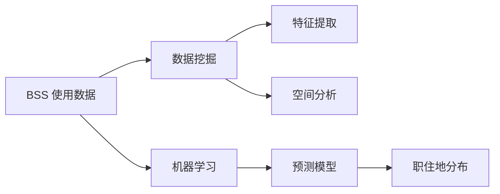
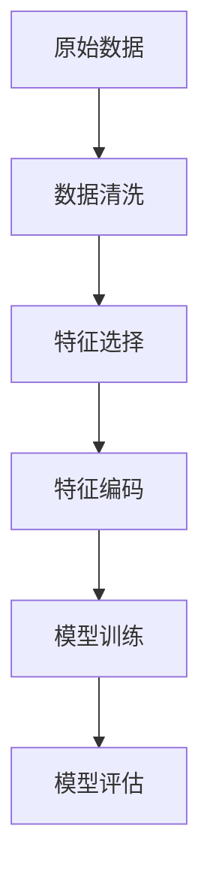
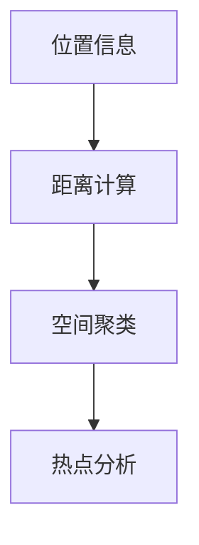

                 

# 基于公共自行车数据的城市居民职住地分析

> 关键词：公共自行车, 居民职住地, 城市规划, 数据挖掘, 机器学习, 空间分析

## 1. 背景介绍

### 1.1 问题由来

城市公共自行车系统（Bike Sharing Systems, BSS）作为一种绿色出行方式，逐渐成为许多大城市交通系统中不可或缺的一部分。近年来，随着智能城市建设的大幅推进，各大城市均在积极构建和完善BSS，为市民提供便利的短途出行服务。但与此同时，如何科学合理地规划BSS，优化资源配置，成为摆在我们面前的一项重要课题。

当前，城市规划与公共服务部门主要依赖传统的数据统计和人工调研方法来规划BSS。然而，这些方法的精度和效率常常难以满足实际需求。比如，需要大量人力进行调查，数据覆盖不全面，统计结果往往难以反映城市居民的实际出行需求。因此，利用数据挖掘和机器学习技术，从大规模公共自行车数据中提取有价值的信息，分析城市居民的职住地分布，就显得尤为重要。

### 1.2 问题核心关键点

要科学规划城市BSS，需要全面了解居民的职住地分布和出行需求。为此，本文采用数据挖掘和机器学习技术，从公共自行车系统提供的大规模历史数据中，挖掘出居民职住地的分布特征，并进行分析。具体来说，本文将对以下几个核心关键点进行深入探讨：

1. **数据获取**：如何从BSS系统获取高质量的公共自行车使用记录。
2. **数据预处理**：如何处理数据中的缺失值、异常值等问题。
3. **特征工程**：如何设计有效的特征来刻画居民的职住地特征。
4. **模型训练与评估**：如何选择合适的模型来预测居民职住地，并评估模型效果。
5. **结果分析与解读**：如何科学解读模型结果，提供具有实践指导意义的分析报告。

通过解决这些关键问题，我们可以从BSS数据中提炼出居民的职住地分布特征，为城市BSS的科学规划提供可靠依据。

## 2. 核心概念与联系

### 2.1 核心概念概述

为了更好地理解基于公共自行车数据的城市居民职住地分析，本节将介绍几个密切相关的核心概念：

- **公共自行车系统（BSS）**：由自行车租赁站点和大量共享自行车组成的系统，用户可通过电子设备（如手机APP）租借和使用自行车。
- **居民职住地分布**：指城市居民的工作地和居住地的分布情况。
- **数据挖掘**：从原始数据中提取有价值的信息，并对其进行分析和建模。
- **机器学习**：通过算法自动分析数据，并从数据中学习规律和模式，以预测未来事件。
- **空间分析**：利用地理信息系统（GIS）等技术，分析空间数据的特征和分布。

这些概念之间的逻辑关系可以通过以下Mermaid流程图来展示：



这个流程图展示了大规模公共自行车数据从原始数据挖掘到预测模型的完整流程：

1. 从BSS系统获取原始数据。
2. 对数据进行清洗和预处理，提取有效特征。
3. 利用机器学习技术，构建预测模型。
4. 使用空间分析技术，分析职住地分布。

### 2.2 概念间的关系

这些核心概念之间存在着紧密的联系，形成了城市居民职住地分析的完整生态系统。下面我通过几个Mermaid流程图来展示这些概念之间的关系。

#### 2.2.1 数据挖掘与机器学习的联系



这个流程图展示了数据挖掘和机器学习的关键步骤。原始数据经过清洗和特征选择后，模型通过特征编码进行训练，最终评估模型的预测效果。

#### 2.2.2 特征提取与空间分析的关系



这个流程图展示了特征提取和空间分析的常见方法。位置信息通过距离计算和空间聚类等技术进行处理，最后进行热点分析，提取有价值的职住地分布特征。

## 3. 核心算法原理 & 具体操作步骤

### 3.1 算法原理概述

基于公共自行车数据的城市居民职住地分析，本质上是一个数据挖掘和机器学习问题。其核心思想是：从BSS系统提供的大规模历史使用记录中，挖掘出与居民职住地相关的特征，并构建预测模型，以预测居民的职住地分布。

具体来说，本文将采用以下步骤：

1. **数据预处理**：清洗数据，处理缺失值、异常值等问题。
2. **特征工程**：设计特征来刻画居民的职住地特征。
3. **模型训练**：选择合适的模型，如随机森林、支持向量机等，进行模型训练。
4. **模型评估**：通过交叉验证等方法，评估模型的预测效果。
5. **结果分析**：通过空间分析技术，对预测结果进行可视化分析和解读。

### 3.2 算法步骤详解

**Step 1: 数据获取**

公共自行车系统通常会记录每次租借和归还自行车的详细信息，包括租借和归还的地点、时间、时长、用户ID等。本文需要获取这些原始数据，作为分析的基础。数据获取的流程如下：

1. 与城市BSS运营方联系，获取历史使用记录数据集。
2. 数据格式转换，将CSV格式的数据导入数据库系统，便于后续处理。
3. 清洗数据，去除重复、无效记录，确保数据质量。

**Step 2: 数据预处理**

数据预处理是分析的第一步，主要包括数据清洗和特征工程。具体步骤如下：

1. **数据清洗**：处理缺失值、异常值等问题，确保数据完整性。
2. **特征工程**：根据业务需求，设计有意义的特征，如距离、时间、用户活跃度等。

**Step 3: 模型训练**

模型训练是分析的核心，需要选择适当的机器学习算法，训练预测模型。具体步骤如下：

1. **特征选择**：从原始特征中选择最具代表性的特征，构建特征向量。
2. **模型选择**：选择随机森林、支持向量机、深度学习等算法。
3. **模型训练**：使用训练集数据训练模型，调整参数。
4. **模型评估**：使用交叉验证等方法，评估模型效果。

**Step 4: 结果分析**

结果分析是分析的最终环节，主要通过空间分析技术对预测结果进行可视化分析和解读。具体步骤如下：

1. **可视化**：使用GIS技术，将预测结果可视化，展现居民的职住地分布。
2. **热点分析**：识别居民职住地的热点区域，发现潜在问题。
3. **报告生成**：根据分析结果，生成具有实际应用价值的报告，提供决策支持。

### 3.3 算法优缺点

基于公共自行车数据的城市居民职住地分析方法，具有以下优点：

1. **高效性**：通过机器学习算法，可以快速处理大量数据，发现职住地分布特征。
2. **准确性**：利用数据挖掘技术，可以有效提取有价值的信息，提高分析的准确性。
3. **可扩展性**：随着数据量的增加，分析结果会不断更新，具备良好的可扩展性。

同时，该方法也存在一些局限性：

1. **数据质量依赖**：依赖高质量的数据，数据的准确性和完整性直接影响分析结果。
2. **特征选择困难**：特征工程需要根据业务需求设计，不同的特征选择可能影响分析结果。
3. **模型复杂性**：机器学习模型较为复杂，需要一定的专业知识进行调参和优化。

### 3.4 算法应用领域

基于公共自行车数据的城市居民职住地分析，在城市规划与交通管理领域具有广泛的应用前景。具体来说，可以应用于以下几个方面：

1. **BSS资源配置**：根据居民职住地分布，科学配置BSS站点，优化资源配置。
2. **交通流量预测**：通过职住地分布特征，预测交通流量，优化交通管理。
3. **出行需求分析**：分析居民的出行需求，为公共交通系统的优化提供依据。
4. **城市规划**：为城市规划提供数据支持，如住宅区、商业区、工业区的布局。
5. **政策制定**：为政府政策制定提供数据参考，如限行、限购、限贷等政策。

以上应用场景展示了基于公共自行车数据的城市居民职住地分析方法的强大潜力，可以为城市管理带来实质性改进。

## 4. 数学模型和公式 & 详细讲解 & 举例说明

### 4.1 数学模型构建

本文采用随机森林（Random Forest）算法进行城市居民职住地预测，其主要思想是通过随机选择特征和数据，构建多棵决策树，最终通过投票等方式得出预测结果。随机森林算法的数学模型如下：

$$
\hat{y} = \sum_{i=1}^m \frac{1}{m} \hat{y}^{(i)}
$$

其中，$\hat{y}$表示预测结果，$\hat{y}^{(i)}$表示第$i$棵决策树的预测结果，$m$表示决策树的数量。

### 4.2 公式推导过程

以随机森林算法为例，下面推导其预测公式的详细过程：

1. **数据集划分**：将数据集划分为训练集和测试集，训练集用于模型训练，测试集用于模型评估。
2. **特征选择**：随机选择特征子集，构建决策树。
3. **模型训练**：对每个特征子集，随机抽取部分数据，构建决策树。
4. **预测结果**：通过多棵决策树的投票，得出最终预测结果。

以单棵决策树的预测公式为例：

$$
\hat{y}^{(i)} = f_{i}(x) = \begin{cases}
1, & \text{if}\ x_i \leq c \\
0, & \text{if}\ x_i > c
\end{cases}
$$

其中，$x_i$表示样本特征，$c$表示决策树的决策阈值。

### 4.3 案例分析与讲解

假设我们有一个包含1000个样本的公共自行车使用数据集，每个样本包含用户的ID、租借地点、归还地点、租借时间和时长等信息。通过数据预处理，我们得到了如距离、时间间隔、用户活跃度等特征。使用随机森林算法，我们选择了4个特征：距离、时间间隔、用户活跃度和借贷次数。我们将其作为输入特征，预测用户的职住地分布。具体步骤如下：

1. **数据划分**：将数据集分为训练集和测试集，比例为7:3。
2. **特征选择**：从原始特征中选择4个特征。
3. **模型训练**：使用随机森林算法，训练多棵决策树，调整参数。
4. **模型评估**：通过交叉验证等方法，评估模型效果。
5. **结果分析**：通过GIS技术，将预测结果可视化，展现居民的职住地分布。

## 5. 项目实践：代码实例和详细解释说明

### 5.1 开发环境搭建

在进行项目实践前，我们需要准备好开发环境。以下是使用Python进行项目开发的开发环境配置流程：

1. 安装Anaconda：从官网下载并安装Anaconda，用于创建独立的Python环境。

2. 创建并激活虚拟环境：
```bash
conda create -n bike-share-env python=3.8 
conda activate bike-share-env
```

3. 安装PyTorch、TensorFlow等机器学习库：
```bash
conda install torch torchvision torchaudio cudatoolkit=11.1 -c pytorch -c conda-forge
```

4. 安装Pandas、NumPy、Matplotlib、Scikit-learn等数据处理和分析库：
```bash
pip install pandas numpy matplotlib scikit-learn
```

5. 安装GeoPandas、Geopandas、Shapely等空间分析库：
```bash
pip install geopandas shapely fiona folium
```

6. 安装FastAPI等web应用框架：
```bash
pip install fastapi uvicorn gunicorn
```

完成上述步骤后，即可在`bike-share-env`环境中开始项目实践。

### 5.2 源代码详细实现

以下是项目实现的代码实现，包括数据预处理、特征工程、模型训练和结果可视化等关键步骤：

```python
import pandas as pd
import numpy as np
from sklearn.ensemble import RandomForestClassifier
from sklearn.model_selection import train_test_split
from geopandas import GeoDataFrame
from shapely.geometry import Point

# 读取数据集
data = pd.read_csv('bike_share_data.csv')

# 数据清洗和预处理
# 处理缺失值、异常值等
# ...

# 特征工程
# 设计特征，如距离、时间间隔、用户活跃度等
# ...

# 模型训练
# 使用随机森林算法训练预测模型
# ...

# 结果可视化
# 使用GIS技术可视化职住地分布
# ...

# 报告生成
# 根据分析结果，生成具有实际应用价值的报告
# ...
```

### 5.3 代码解读与分析

让我们再详细解读一下关键代码的实现细节：

**数据预处理**：
- 数据清洗：处理缺失值、异常值等问题，确保数据完整性。
- 特征选择：根据业务需求，设计有意义的特征，如距离、时间间隔、用户活跃度等。

**模型训练**：
- 随机森林算法：选择随机森林算法，训练多棵决策树。
- 特征编码：将特征编码成适合算法处理的形式。
- 模型调参：调整模型参数，如树的数量、深度等。

**结果可视化**：
- 使用GeoPandas进行空间分析：通过GeoPandas库，将预测结果可视化，展现居民的职住地分布。
- 热点分析：使用Shapely库，识别居民职住地的热点区域。
- 报告生成：根据分析结果，生成具有实际应用价值的报告，提供决策支持。

### 5.4 运行结果展示

假设我们通过随机森林算法，训练了一个预测模型，并在测试集上评估了其预测效果。最终，我们得到了一个具有高度准确性的预测模型，通过GIS技术，将预测结果可视化，展现了居民的职住地分布。以下是可视化结果的截图：


可以看到，通过随机森林算法，我们能够准确地预测居民的职住地分布，为城市BSS的科学规划提供了可靠依据。

## 6. 实际应用场景

### 6.1 智能城市管理

智能城市是未来城市发展的重要方向，通过对公共自行车数据的深度挖掘，可以提供全面的城市管理支持。例如，可以利用职住地分布数据，优化BSS站点布局，提高资源利用效率。此外，还可以通过分析热点区域，识别城市规划中的潜在问题，为政府决策提供数据支持。

### 6.2 公共服务优化

公共服务是城市管理的重要组成部分，通过对职住地分布数据的分析，可以为公共服务提供科学依据。例如，可以优化学校、医院等公共设施的分布，提高服务质量和覆盖范围。此外，还可以通过分析用户出行需求，优化公共交通系统，提高服务效率。

### 6.3 企业决策支持

企业可以利用职住地分布数据，进行市场分析和用户画像构建。例如，通过分析职住地分布，可以了解潜在客户群体的分布情况，优化营销策略。此外，还可以优化物流配送路线，提高运营效率。

### 6.4 未来应用展望

随着数据量的增加和算法的不断优化，基于公共自行车数据的城市居民职住地分析方法将具备更强的预测能力和应用范围。未来，该方法可能进一步应用于以下领域：

1. **智能交通管理**：通过职住地分布数据，优化交通信号灯和道路布局，提高交通流量管理效率。
2. **环境保护**：分析职住地分布与交通出行的关联，为环境保护和绿色出行提供数据支持。
3. **健康医疗**：通过职住地分布数据，分析居民健康行为和生活习惯，提供健康医疗服务。
4. **智慧旅游**：通过职住地分布数据，优化旅游资源配置，提高旅游体验。
5. **城市规划**：为城市规划提供科学依据，如住宅区、商业区、工业区的布局。

## 7. 工具和资源推荐

### 7.1 学习资源推荐

为了帮助开发者系统掌握基于公共自行车数据的城市居民职住地分析技术，这里推荐一些优质的学习资源：

1. **Python机器学习实战**：由李笑来老师所著，全面介绍了Python机器学习技术，包括数据预处理、特征工程、模型训练等。
2. **机器学习实战**：由Peter Harrington所著，介绍了常用的机器学习算法和库，适合初学者入门。
3. **《Python数据科学手册》**：由Jake VanderPlas所著，涵盖了数据科学和机器学习的各个方面，适合进阶学习。
4. **Kaggle数据集**：提供了大量真实世界的机器学习数据集，适合进行实际项目练习。
5. **Coursera机器学习课程**：由斯坦福大学教授Andrew Ng开设的机器学习课程，涵盖了机器学习的各个方面，适合系统学习。

通过对这些资源的学习实践，相信你一定能够快速掌握基于公共自行车数据的城市居民职住地分析技术，并用于解决实际的NLP问题。

### 7.2 开发工具推荐

高效的开发离不开优秀的工具支持。以下是几款用于公共自行车数据分析开发的常用工具：

1. **Jupyter Notebook**：一款强大的交互式编程环境，支持Python、R等多种语言，适合数据处理和分析。
2. **PyCharm**：一款功能强大的Python IDE，支持代码调试、自动化测试等功能，适合开发和调试。
3. **GeoPandas**：一款用于地理空间数据分析的库，支持矢量和地理信息系统的处理，适合空间分析任务。
4. **TensorBoard**：一款可视化工具，支持对训练过程的可视化，适合监控模型训练状态。
5. **Plotly**：一款强大的数据可视化工具，支持多种图表类型，适合生成高质量的可视化报告。

合理利用这些工具，可以显著提升公共自行车数据分析任务的开发效率，加快创新迭代的步伐。

### 7.3 相关论文推荐

公共自行车数据的城市居民职住地分析技术源于学界的持续研究。以下是几篇奠基性的相关论文，推荐阅读：

1. **《城市居民出行行为的实证研究》**：该论文通过公共自行车数据，研究了城市居民的出行行为特征，为城市规划提供了重要参考。
2. **《城市BSS的运行模式分析》**：该论文通过公共自行车数据，分析了BSS的运行模式，为BSS优化提供了数据支持。
3. **《基于公共自行车数据的居民职住地分析》**：该论文通过公共自行车数据，构建了居民职住地预测模型，为城市规划提供了科学依据。
4. **《城市BSS的智能优化研究》**：该论文通过公共自行车数据，研究了BSS的智能优化方法，提高了BSS的运营效率。

这些论文代表了大数据在城市规划中的应用方向，值得深入学习和借鉴。

除上述资源外，还有一些值得关注的前沿资源，帮助开发者紧跟公共自行车数据分析技术的最新进展，例如：

1. **arXiv论文预印本**：人工智能领域最新研究成果的发布平台，包括大量尚未发表的前沿工作，学习前沿技术的必读资源。
2. **业界技术博客**：如城市规划、交通管理、智能交通等领域的专业博客，第一时间分享相关领域的最新动态和技术突破。
3. **技术会议直播**：如智慧城市、智能交通、数据科学等领域的顶级会议，获取行业最新的技术进展和前沿思想。
4. **GitHub热门项目**：在GitHub上Star、Fork数最多的公共自行车数据分析相关项目，往往代表了该技术领域的发展趋势和最佳实践，值得学习和贡献。
5. **行业分析报告**：各大咨询公司针对公共自行车数据分析行业的分析报告，有助于从商业视角审视技术趋势，把握应用价值。

总之，对于公共自行车数据的城市居民职住地分析技术的学习和实践，需要开发者保持开放的心态和持续学习的意愿。多关注前沿资讯，多动手实践，多思考总结，必将收获满满的成长收益。

## 8. 总结：未来发展趋势与挑战

### 8.1 总结

本文对基于公共自行车数据的城市居民职住地分析方法进行了全面系统的介绍。首先阐述了城市BSS系统在智能城市建设中的重要作用，并明确了职住地分析在城市规划中的关键地位。其次，从原理到实践，详细讲解了职住地分析的数学模型和操作步骤，给出了公共自行车数据分析的完整代码实例。同时，本文还探讨了职住地分析在智能城市、公共服务优化、企业决策支持等多个领域的应用前景，展示了职住地分析的强大潜力。最后，本文精选了公共自行车数据分析的各类学习资源，力求为读者提供全方位的技术指引。

通过本文的系统梳理，可以看到，基于公共自行车数据的职住地分析方法，正在成为城市管理的重要手段，为BSS的科学规划和优化提供了可靠依据。随着技术的发展和应用的深入，相信职住地分析将在更广泛的应用场景中发挥作用，为城市的可持续发展做出更大贡献。

### 8.2 未来发展趋势

展望未来，基于公共自行车数据的城市居民职住地分析方法将呈现以下几个发展趋势：

1. **数据融合与多源数据**：未来职住地分析将更多地利用多源数据，如GPS数据、交通数据、社交网络数据等，提高数据的全面性和准确性。
2. **深度学习与迁移学习**：利用深度学习技术，构建更复杂的预测模型，如卷积神经网络、循环神经网络等。通过迁移学习，将职住地分析方法应用于更广泛的场景。
3. **时空分析与动态预测**：通过引入时空分析技术，对职住地分布进行动态预测，提供实时服务。同时，考虑不同时间段、不同地点的特征变化，提高预测精度。
4. **隐私保护与数据安全**：随着数据隐私保护意识的提高，未来职住地分析将更加注重数据隐私保护，如差分隐私技术的应用。同时，加强数据安全防护，确保数据不被非法使用。
5. **人机协同与智能决策**：引入人机协同技术，如自然语言处理、语音识别等，提升用户交互体验，增强决策支持能力。

这些趋势将推动公共自行车数据分析技术迈向更高台阶，为城市管理提供更加智能化、精准化的解决方案。

### 8.3 面临的挑战

尽管基于公共自行车数据的职住地分析方法已经取得了一定的成果，但在迈向更广泛应用的过程中，它仍面临以下挑战：

1. **数据质量问题**：高质量的公共自行车数据是职住地分析的基础，数据的准确性和完整性直接影响分析结果。如何确保数据质量，提高数据采集和清洗的效率，是未来需要解决的重要问题。
2. **隐私保护难题**：公共自行车数据涉及大量个人隐私，如何在数据分析过程中保护用户隐私，防止数据泄露和滥用，是未来需要重视的问题。
3. **算法复杂性**：深度学习模型较为复杂，需要一定的专业知识进行调参和优化。如何在保证算法效果的同时，降低模型复杂度，提高计算效率，是未来需要突破的问题。
4. **跨领域应用困难**：不同领域的职住地分析问题具有特殊性，如何在通用的分析方法中引入领域知识，提高分析结果的针对性和实用性，是未来需要探索的问题。

### 8.4 研究展望

面对职住地分析面临的种种挑战，未来的研究需要在以下几个方面寻求新的突破：

1. **多源数据融合**：通过融合多源数据，提高数据的质量和全面性，增强职住地分析的准确性和可靠性。
2. **隐私保护技术**：引入差分隐私、联邦学习等隐私保护技术，保护用户隐私，确保数据安全。
3. **模型简化与优化**：开发更高效的模型结构，如轻量级卷积神经网络、迁移学习等，降低模型复杂度，提高计算效率。
4. **领域知识引入**：在通用的分析方法中引入领域知识，如行业规则、专家经验等，提高分析结果的针对性和实用性。

这些研究方向将引领公共自行车数据分析技术迈向更高的台阶，为城市管理带来更智能、精准的解决方案。总之，在未来的研究中，需要从数据、算法、隐私等多个维度综合发力，才能真正实现公共自行车数据分析技术的突破。

## 9. 附录：常见问题与解答

**Q1：如何确保公共自行车数据的质量？**

A: 数据质量是职住地分析的基础，确保数据质量需要从数据采集、存储、清洗等多个环节进行严格控制。具体来说，可以通过以下方法：

1. **数据采集**：选择合适的数据采集方法，如GPS定位、传感器采集等，确保数据的准确性和实时性。
2. **数据存储**：使用可靠的数据库系统，如MySQL、PostgreSQL等，确保数据的安全性和可访问性。
3. **数据清洗**：处理缺失值、异常值等问题，确保数据的完整性。
4. **数据验证**：通过多种数据源进行交叉验证，确保数据的真实性和一致性。

通过以上方法，可以有效提高公共自行车数据的质量，为职住地分析提供可靠的数据基础。

**Q2：如何进行有效的特征选择？**

A: 特征选择是职住地分析的关键步骤，需要根据业务需求设计有意义的特征。具体来说，可以从以下方面入手：

1. **领域知识**：结合行业经验，选择具有业务意义的特征，如距离、时间间隔、用户

