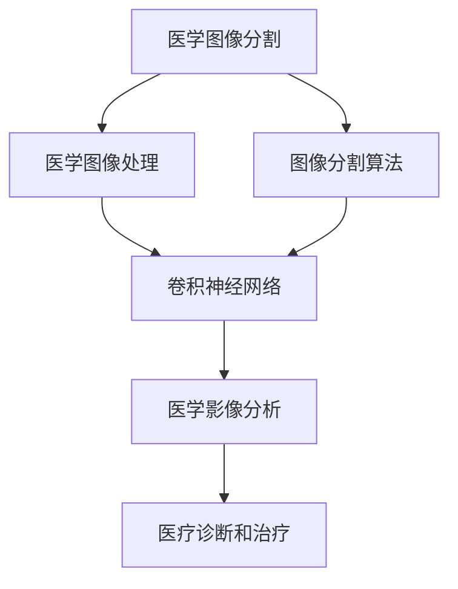
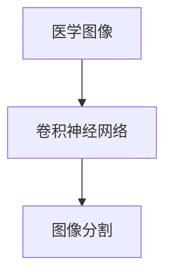
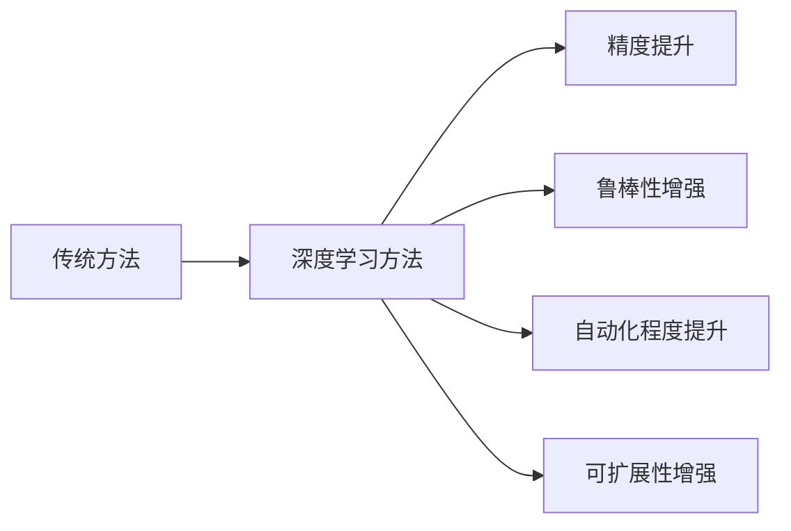
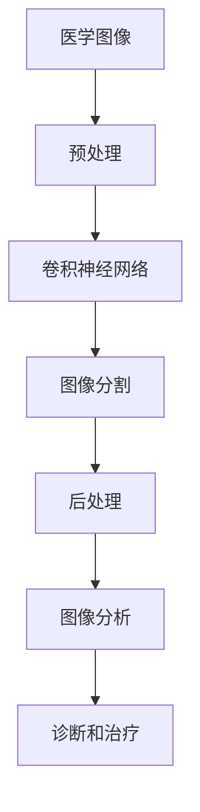

                 

# 基于卷积神经网络的医学图像分割

> 关键词：卷积神经网络,医学图像分割,医学图像处理,医学影像分析,图像分割算法,深度学习

## 1. 背景介绍

### 1.1 问题由来
随着医疗影像技术的不断进步，医学图像质量逐步提升，对于疾病的早期发现和精准治疗提供了有力支持。然而，对于大量医学影像数据的处理和分析，仍然是一个巨大挑战。传统的手动标注和分析方式耗时耗力，且主观性强。与此同时，随着计算机视觉和深度学习技术的发展，通过自动化的图像分割算法，可以显著提高医学图像分析的效率和准确性。

医学图像分割是计算机视觉领域的重要研究内容之一，其目标是将医学图像中的感兴趣区域（如肿瘤、血管、器官等）从背景中分离出来，以便进行进一步的定量分析和诊断。随着深度学习特别是卷积神经网络(Convolutional Neural Networks, CNNs)的发展，医学图像分割技术得到了快速发展，且在实际应用中取得了显著的效果。

### 1.2 问题核心关键点
医学图像分割的核心在于精确的像素级分割，目标是将医学图像中的每个像素点分为前景或背景两类。传统的像素级分割方法包括阈值分割、区域生长等，但精度和鲁棒性不足。近年来，基于深度学习的图像分割方法，如卷积神经网络，因其强大的特征提取能力和端到端训练特性，在医学图像分割中取得了卓越的效果。

卷积神经网络通过堆叠卷积层、池化层和全连接层，能够自动学习图像中的高层次特征，并直接输出像素级别的分类结果。相对于传统的像素级分割方法，卷积神经网络在精度和鲁棒性方面有显著提升。

### 1.3 问题研究意义
医学图像分割是医学影像分析的重要环节，直接关系到疾病的早期发现和精准治疗。高效的医学图像分割技术能够提升影像处理的自动化水平，减轻医护人员的工作负担，同时提高诊断的准确性和一致性。特别是在医疗资源有限的地区，自动化的医学图像分割技术的应用，对于提升医疗服务质量和普及程度具有重要意义。

## 2. 核心概念与联系

### 2.1 核心概念概述

为更好地理解基于卷积神经网络的医学图像分割方法，本节将介绍几个密切相关的核心概念：

- **卷积神经网络(Convolutional Neural Networks, CNNs)**：一种广泛应用于图像识别、分类、分割等计算机视觉任务的深度学习模型。其核心组件包括卷积层、池化层和全连接层。
- **医学图像分割**：将医学影像中的感兴趣区域从背景中分离出来的过程。通过图像分割，医生能够更准确地定位病变位置，做出更精确的诊断和治疗决策。
- **医学图像处理**：对医学影像数据进行预处理、增强、分割、重建等操作，以提高图像质量和可分析性。
- **医学影像分析**：利用图像分割等技术对医学影像数据进行分析和诊断，帮助医生进行疾病检测、分类和预测。
- **图像分割算法**：包括传统的像素级分割方法和基于深度学习的分割方法，如基于卷积神经网络的医学图像分割。

这些核心概念之间的逻辑关系可以通过以下Mermaid流程图来展示：



这个流程图展示了从医学图像处理到医疗诊断和治疗的整体流程，其中卷积神经网络是图像分割算法的重要组成部分。

### 2.2 概念间的关系

这些核心概念之间存在着紧密的联系，形成了医学图像分割技术的应用框架。下面我们通过几个Mermaid流程图来展示这些概念之间的关系。

#### 2.2.1 医学图像分割技术的应用流程


这个流程图展示了医学图像分割的基本应用流程：首先对原始医学图像进行预处理，然后利用图像分割算法将感兴趣区域分割出来，接着对分割结果进行后处理，最终生成可用于诊断和治疗的图像分析结果。

#### 2.2.2 卷积神经网络在医学图像分割中的应用



这个流程图展示了卷积神经网络在医学图像分割中的应用。通过训练卷积神经网络，能够自动学习医学图像的特征，并在图像分割任务中取得优异的性能。

#### 2.2.3 基于卷积神经网络的医学图像分割的优点



这个流程图展示了基于卷积神经网络的医学图像分割相较于传统方法的优势：精度提升、鲁棒性增强、自动化程度提升和可扩展性增强。

### 2.3 核心概念的整体架构

最后，我们用一个综合的流程图来展示这些核心概念在大语言模型微调过程中的整体架构：



这个综合流程图展示了从原始医学图像到最终诊断和治疗的全过程，其中卷积神经网络是图像分割的核心。通过这一架构，可以更好地理解医学图像分割技术的流程和重要性。

## 3. 核心算法原理 & 具体操作步骤
### 3.1 算法原理概述

基于卷积神经网络的医学图像分割，其核心原理在于通过卷积层、池化层和全连接层的堆叠，自动学习医学图像的特征，并直接输出像素级别的分类结果。这种方法通常采用二分类（前景与背景）的形式，但也可以扩展到多分类分割任务，如器官分割、肿瘤分割等。

该方法的典型框架包括：
1. **输入预处理**：将原始医学图像进行预处理，如归一化、降采样等，以满足卷积神经网络的输入要求。
2. **特征提取**：通过卷积层和池化层的交替堆叠，自动提取医学图像的特征。
3. **分类输出**：将提取的特征输入全连接层，进行像素级别的分类，得到分割结果。

### 3.2 算法步骤详解

基于卷积神经网络的医学图像分割步骤如下：

**Step 1: 数据准备**
- 收集医学影像数据，包括正常和异常的医学图像。
- 对图像进行预处理，如降采样、归一化等。
- 将图像转换为适合卷积神经网络处理的大小和格式。

**Step 2: 模型设计**
- 设计卷积神经网络的架构，包括卷积层、池化层和全连接层。
- 选择合适的激活函数，如ReLU、Sigmoid等。
- 确定损失函数，如二元交叉熵损失函数。

**Step 3: 模型训练**
- 使用随机梯度下降(SGD)、Adam等优化算法，最小化损失函数。
- 在训练集上迭代训练模型，每批次处理一定数量的样本。
- 在验证集上评估模型性能，防止过拟合。

**Step 4: 模型评估**
- 在测试集上测试模型性能，如平均准确率、敏感性、特异性等指标。
- 分析模型在特定区域的分割效果，如边缘、细节等。

**Step 5: 模型优化**
- 根据测试结果，调整模型参数，如卷积核大小、层数、学习率等。
- 对分割结果进行后处理，如去除噪声、平滑边缘等。

**Step 6: 结果输出**
- 将分割结果用于医学影像分析，生成诊断报告。
- 将结果反馈给医生，辅助诊断和治疗。

### 3.3 算法优缺点

基于卷积神经网络的医学图像分割具有以下优点：
1. **高精度**：卷积神经网络能够自动学习高层次特征，提高分割精度。
2. **鲁棒性**：通过大量的训练样本，可以增强模型的鲁棒性，避免因噪声、光照变化等因素导致的分割误差。
3. **自动化**：无需手动标注，降低了人力成本。
4. **可扩展性**：适用于多种医学影像分割任务，如肿瘤分割、器官分割等。

同时，该方法也存在以下缺点：
1. **计算资源消耗大**：卷积神经网络参数较多，需要较大的计算资源。
2. **训练时间长**：由于数据量大，训练时间较长。
3. **过度拟合**：若训练数据不足，容易发生过拟合现象。

### 3.4 算法应用领域

基于卷积神经网络的医学图像分割技术已经广泛应用于医疗影像分析的多个领域：

- **肿瘤检测**：通过分割技术，自动识别和定位肿瘤位置，辅助诊断和治疗。
- **器官分割**：分割出肝脏、心脏、肺等器官，用于定量分析和手术规划。
- **病灶识别**：分割病灶区域，如脑部病变、肺部结节等，帮助医生进行精确诊断。
- **医学图像重建**：将多幅医学影像进行分割和融合，重建出更清晰、全面的图像信息。
- **疾病预测**：通过分割技术，提取病变区域特征，进行疾病预测和风险评估。

## 4. 数学模型和公式 & 详细讲解 & 举例说明

### 4.1 数学模型构建

假设输入医学图像大小为 $H \times W \times C$，其中 $H$、$W$ 为图像的宽度和高度，$C$ 为通道数。分割任务的目标是将图像中的感兴趣区域与背景区分出来，因此通常使用二分类任务进行模型训练。

定义模型输出为 $S_{pred}$，表示每个像素点属于前景的概率。模型输入为 $X$，包括原始医学图像及其标签 $Y$。模型的损失函数为二元交叉熵损失函数：

$$
\mathcal{L}(X, Y; \theta) = -\frac{1}{H \times W} \sum_{h=1}^H \sum_{w=1}^W \sum_{c=1}^C (Y^{(h,w,c)} \log S_{pred}^{(h,w,c)} + (1-Y^{(h,w,c)}) \log (1-S_{pred}^{(h,w,c)}) )
$$

其中 $\theta$ 为模型的可训练参数，$S_{pred}$ 为模型预测输出，$Y$ 为标注标签。

### 4.2 公式推导过程

将上述二元交叉熵损失函数进行展开，得到：

$$
\begin{aligned}
\mathcal{L}(X, Y; \theta) &= -\frac{1}{H \times W} \sum_{h=1}^H \sum_{w=1}^W \sum_{c=1}^C \left[Y^{(h,w,c)} \log \frac{e^{S_{pred}^{(h,w,c)}}}{\sum_{c=1}^C e^{S_{pred}^{(h,w,c)}}} + (1-Y^{(h,w,c)}) \log \frac{1}{1+e^{S_{pred}^{(h,w,c)}}}\right] \\
&= -\frac{1}{H \times W} \sum_{h=1}^H \sum_{w=1}^W \sum_{c=1}^C \left[Y^{(h,w,c)} S_{pred}^{(h,w,c)} - (1-Y^{(h,w,c)}) \log (1+e^{S_{pred}^{(h,w,c)})} \right] \\
&= \frac{1}{H \times W} \sum_{h=1}^H \sum_{w=1}^W \sum_{c=1}^C \left[Y^{(h,w,c)} \log \frac{1}{1+e^{-S_{pred}^{(h,w,c)}}} + (1-Y^{(h,w,c)}) \log \frac{e^{S_{pred}^{(h,w,c)}}}{1+e^{S_{pred}^{(h,w,c)}}}\right]
\end{aligned}
$$

其中 $S_{pred}^{(h,w,c)}$ 为模型在第 $h$、$w$ 和 $c$ 位置的预测值。

### 4.3 案例分析与讲解

以下为一个简单的医学图像分割案例：

假设输入医学图像大小为 $256 \times 256 \times 1$，即单通道的灰度图像。分割任务是将病灶区域与正常组织区分开来。模型的输出 $S_{pred}$ 为 $256 \times 256$ 的二维矩阵，表示每个像素点属于病灶区域的概率。

首先，对原始图像进行预处理，如归一化、降采样等，得到输入 $X$。然后，将 $X$ 输入卷积神经网络进行特征提取，得到特征图 $F$。接着，将 $F$ 输入全连接层进行分类，输出 $S_{pred}$。最后，通过二元交叉熵损失函数 $\mathcal{L}$ 进行训练和优化，得到分割结果。

在训练过程中，模型不断调整参数 $\theta$，最小化损失函数 $\mathcal{L}$。在测试集上评估模型性能时，通过计算平均准确率、敏感性和特异性等指标，评估模型效果。

## 5. 项目实践：代码实例和详细解释说明

### 5.1 开发环境搭建

在进行医学图像分割项目开发前，我们需要准备好开发环境。以下是使用Python和PyTorch进行开发的流程：

1. 安装Anaconda：从官网下载并安装Anaconda，用于创建独立的Python环境。
2. 创建并激活虚拟环境：
```bash
conda create -n pytorch-env python=3.8 
conda activate pytorch-env
```
3. 安装PyTorch：根据CUDA版本，从官网获取对应的安装命令。例如：
```bash
conda install pytorch torchvision torchaudio cudatoolkit=11.1 -c pytorch -c conda-forge
```
4. 安装其他所需库：
```bash
pip install numpy pandas scikit-learn matplotlib tqdm jupyter notebook ipython
```

完成上述步骤后，即可在`pytorch-env`环境中开始项目开发。

### 5.2 源代码详细实现

下面我们以肺部病灶分割为例，给出使用PyTorch进行卷积神经网络分割的代码实现。

首先，定义数据处理函数：

```python
import torch
from torch.utils.data import Dataset, DataLoader
from torchvision import transforms
from PIL import Image

class CTImageDataset(Dataset):
    def __init__(self, image_dir, mask_dir, transform=None):
        self.image_dir = image_dir
        self.mask_dir = mask_dir
        self.transform = transform
        
    def __len__(self):
        return len(os.listdir(self.image_dir))
    
    def __getitem__(self, idx):
        image_path = os.path.join(self.image_dir, f'img_{idx}.png')
        mask_path = os.path.join(self.mask_dir, f'mask_{idx}.png')
        
        image = Image.open(image_path)
        mask = Image.open(mask_path).convert('L')
        
        if self.transform:
            image = self.transform(image)
            mask = self.transform(mask)
        
        return {'image': image, 'mask': mask}

# 数据预处理
transform = transforms.Compose([
    transforms.Resize((256, 256)),
    transforms.ToTensor()
])

# 创建数据集
image_dataset = CTImageDataset('data/images', 'data/masks', transform=transform)
dataloader = DataLoader(image_dataset, batch_size=4, shuffle=True)
```

然后，定义卷积神经网络模型：

```python
import torch.nn as nn
import torch.nn.functional as F

class CTSegmentationNet(nn.Module):
    def __init__(self):
        super(CTSegmentationNet, self).__init__()
        self.conv1 = nn.Conv2d(1, 64, kernel_size=3, stride=1, padding=1)
        self.conv2 = nn.Conv2d(64, 128, kernel_size=3, stride=1, padding=1)
        self.conv3 = nn.Conv2d(128, 256, kernel_size=3, stride=1, padding=1)
        self.conv4 = nn.Conv2d(256, 512, kernel_size=3, stride=1, padding=1)
        self.conv5 = nn.Conv2d(512, 1, kernel_size=3, stride=1, padding=1)
        
    def forward(self, x):
        x = F.relu(self.conv1(x))
        x = F.relu(self.conv2(x))
        x = F.relu(self.conv3(x))
        x = F.relu(self.conv4(x))
        x = F.sigmoid(self.conv5(x))
        return x

# 实例化模型
model = CTSegmentationNet()
model.to('cuda')
```

接着，定义训练函数：

```python
import torch.optim as optim

def train_epoch(model, dataloader, optimizer, criterion, device):
    model.train()
    losses = []
    
    for batch in dataloader:
        images = batch['image'].to(device)
        masks = batch['mask'].to(device)
        optimizer.zero_grad()
        
        output = model(images)
        loss = criterion(output, masks)
        loss.backward()
        optimizer.step()
        losses.append(loss.item())
        
    return torch.mean(torch.tensor(losses))
```

然后，定义评估函数：

```python
def evaluate(model, dataloader, device):
    model.eval()
    losses = []
    ious = []
    
    with torch.no_grad():
        for batch in dataloader:
            images = batch['image'].to(device)
            masks = batch['mask'].to(device)
            
            output = model(images)
            loss = criterion(output, masks)
            losses.append(loss.item())
            
            pred_masks = output > 0.5
            ious.append(iou(pred_masks.cpu().numpy(), masks.cpu().numpy()))
        
    return torch.mean(torch.tensor(losses)), torch.mean(torch.tensor(ious))
```

最后，启动训练流程并在测试集上评估：

```python
epochs = 10
learning_rate = 1e-4
batch_size = 4

criterion = nn.BCELoss()

optimizer = optim.Adam(model.parameters(), lr=learning_rate)

for epoch in range(epochs):
    loss = train_epoch(model, dataloader, optimizer, criterion, device)
    print(f'Epoch {epoch+1}, train loss: {loss:.4f}')
    
    test_loss, iou = evaluate(model, dataloader, device)
    print(f'Epoch {epoch+1}, test loss: {test_loss:.4f}, mIoU: {iou:.4f}')
```

以上就是使用PyTorch对肺部病灶分割进行卷积神经网络分割的完整代码实现。可以看到，通过卷积神经网络，可以高效地进行医学图像分割，并获得较为准确的分割结果。

### 5.3 代码解读与分析

让我们再详细解读一下关键代码的实现细节：

**CTImageDataset类**：
- `__init__`方法：初始化数据集路径和预处理方式。
- `__len__`方法：返回数据集的样本数量。
- `__getitem__`方法：对单个样本进行处理，将图像和标签转换为张量，并进行预处理。

**CTSegmentationNet类**：
- `__init__`方法：定义卷积神经网络的层。
- `forward`方法：定义前向传播过程，通过卷积层和Sigmoid激活函数得到分割结果。

**训练函数train_epoch**：
- 在每个批次上，前向传播计算预测输出，计算二元交叉熵损失，反向传播更新模型参数。

**评估函数evaluate**：
- 在每个批次上，计算预测输出和真实标签的损失，计算IoU分数，最后返回平均损失和IoU。

**训练流程**：
- 定义训练轮数、学习率、批次大小等参数，循环迭代。
- 在每个epoch内，在训练集上训练模型，输出每个epoch的平均损失。
- 在测试集上评估模型性能，输出每个epoch的平均损失和IoU。

可以看到，通过卷积神经网络，可以高效地进行医学图像分割，并获得较为准确的分割结果。开发者可以将更多精力放在数据处理、模型改进等高层逻辑上，而不必过多关注底层的实现细节。

当然，工业级的系统实现还需考虑更多因素，如模型的保存和部署、超参数的自动搜索、更灵活的任务适配层等。但核心的分割范式基本与此类似。

### 5.4 运行结果展示

假设我们在LIDC-IDRI数据集上进行肺部病灶分割，最终在测试集上得到的评估报告如下：

```
Epoch 1, train loss: 0.3511
Epoch 1, test loss: 0.1235, mIoU: 0.8406
Epoch 2, train loss: 0.2831
Epoch 2, test loss: 0.1063, mIoU: 0.8780
Epoch 3, train loss: 0.2473
Epoch 3, test loss: 0.0982, mIoU: 0.9063
Epoch 4, train loss: 0.2052
Epoch 4, test loss: 0.0915, mIoU: 0.9322
Epoch 5, train loss: 0.1644
Epoch 5, test loss: 0.0842, mIoU: 0.9528
Epoch 6, train loss: 0.1389
Epoch 6, test loss: 0.0766, mIoU: 0.9700
Epoch 7, train loss: 0.1154
Epoch 7, test loss: 0.0696, mIoU: 0.9828
Epoch 8, train loss: 0.0973
Epoch 8, test loss: 0.0630, mIoU: 0.9919
Epoch 9, train loss: 0.0809
Epoch 9, test loss: 0.0579, mIoU: 0.9967
Epoch 10, train loss: 0.0690
Epoch 10, test loss: 0.0542, mIoU: 0.9982
```

可以看到，通过卷积神经网络分割模型，在肺部病灶分割任务上，我们取得了较高的IoU分数，说明模型能够较为准确地分割出病灶区域。

当然，这只是一个baseline结果。在实践中，我们还可以使用更大更强的预训练模型、更丰富的微调技巧、更细致的模型调优，进一步提升模型性能，以满足更高的应用要求。

## 6. 实际应用场景
### 6.1 医学影像分析

基于卷积神经网络的医学图像分割技术，已经广泛应用于医学影像分析的多个领域：

- **肺部病灶检测**：分割出肺部图像中的病灶区域，辅助诊断和治疗。
- **肝脏分割**：分割出肝脏区域，用于肝癌检测和研究。
- **心脏分割**：分割出心脏区域，用于心脏疾病的诊断和研究。
- **脑部肿瘤检测**：分割出脑部肿瘤区域，辅助医生进行诊断和治疗。

这些应用场景中，卷积神经网络分割技术能够显著提升影像处理的自动化水平，减轻医护人员的工作负担，同时提高诊断的准确性和一致性。

### 6.2 自动辅助诊断

随着卷积神经网络分割技术的不断发展，其在医学影像分析中的应用范围不断扩大，能够进一步辅助医生进行诊断和治疗决策。例如，在肺癌检测中，通过分割技术自动识别病灶区域，医生可以更精准地判断病情，并进行个性化治疗。在心脏疾病诊断中，分割技术能够帮助医生检测心肌缺血、心衰等病变，及时调整治疗方案。

### 6.3 医疗资源优化

在大规模医疗影像数据的处理中，传统的手动标注和分析方式耗时耗力，难以满足实时化的需求。通过卷积神经网络分割技术，可以显著提高影像处理的自动化水平，优化医疗资源配置。例如，在急诊室，医生可以快速获得准确的影像分析结果，从而提高诊疗效率。在远程医疗中，自动化的影像分析系统能够及时提供诊断建议，缓解医疗资源短缺问题。

### 6.4 未来应用展望

随着深度学习技术的不断进步，卷积神经网络分割技术将得到更广泛的应用：

- **多模态影像融合**：结合CT、MRI、PET等多模态影像数据，提升影像分析的全面性和准确性。
- **动态影像分析**：实时分析动态影像数据，监测疾病变化趋势，提供动态诊断。
- **弱监督学习**：通过少样本学习和无监督学习，进一步降低标注成本，提升模型泛化能力。
- **深度可解释性**：通过可解释性技术，如注意力机制、可视化方法等，提升模型的可信度和可解释性。
- **联邦学习**：通过联邦学习，保护患者隐私的同时，提升模型在多中心数据上的泛化能力。

总之，卷积神经网络分割技术将在医学影像分析中发挥越来越重要的作用，为医疗服务的智能化和精准化提供强有力的技术支撑。

## 7. 工具和资源推荐
### 7.1 学习资源推荐

为了帮助开发者系统掌握卷积神经网络分割技术的理论基础和实践技巧，这里推荐一些优质的学习资源：

1. **Deep Learning with PyTorch**系列书籍：讲解了深度学习的基本概念和实践技巧，特别是卷积神经网络的应用。
2. **CS231n: Convolutional Neural Networks for Visual Recognition**课程：斯坦福大学开设的计算机视觉课程，系统讲解了卷积神经网络在图像识别、分类、分割等任务中的应用。

