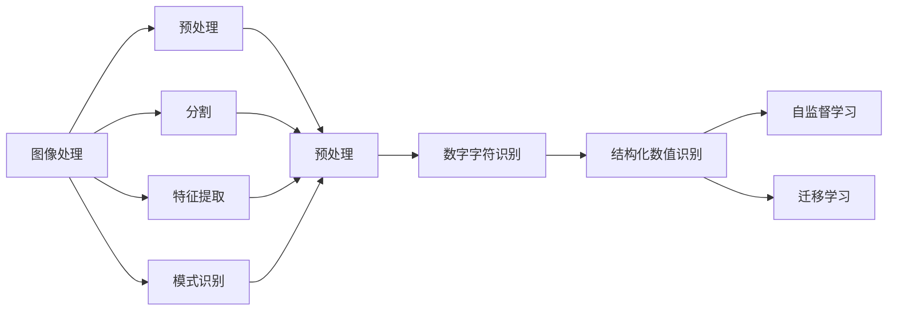
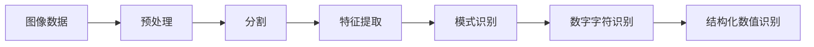
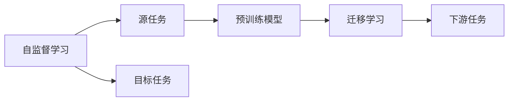

                 

# 基于图像的结构化数值识别系缭的设计与实现

> 关键词：图像处理, 结构化数据, 数值识别, 神经网络, 深度学习, 自监督学习, 迁移学习

## 1. 背景介绍

### 1.1 问题由来

在数字化时代，图像数据日益增多，结构化数值信息也变得无处不在。从智能手机的相机照片到医疗影像、地理信息系统、交通监控等场景，图像中往往蕴含着宝贵的数值信息，亟需高效、准确的提取和处理。传统的手动标注方法费时费力，而基于机器学习的方法能够自动化地从图像中识别和提取数值，具有重要应用价值。

结构化数值识别，是指从图像中自动提取结构化的数值信息，如数字、货币数额、温度等。这种识别任务通常涉及图像处理、模式识别和深度学习等技术，能够为众多行业提供数据支持和智能化服务。

### 1.2 问题核心关键点

结构化数值识别任务的核心在于：
- 自动检测图像中的数值区域。
- 从检测到的区域中提取出数值信息。
- 对数值进行校正和验证，确保识别结果的准确性。

其中，自动检测数值区域是关键第一步，通常通过图像分割和边界检测等方法实现。接下来，从检测区域中提取数值信息需要考虑字符识别、字符校正等技术。最后，对数值进行校正和验证则涉及数值归一化、反模糊化等处理。

### 1.3 问题研究意义

结构化数值识别技术的应用，对于提高数据处理效率、促进智能化应用具有重要意义。具体而言：

1. **提升数据处理效率**：结构化数值识别能够自动化地处理海量图像数据，节省大量人力和时间成本。
2. **促进智能化应用**：通过自动识别数值信息，智能系统能够更好地理解和应用这些信息，提高决策效率和质量。
3. **拓展应用场景**：结构化数值识别技术可以应用于多个领域，如金融、医疗、物流等，为这些领域的智能化转型提供技术支持。
4. **推动技术进步**：该技术的研究和应用能够推动计算机视觉、模式识别、深度学习等技术的进步，促进相关领域的创新发展。

## 2. 核心概念与联系

### 2.1 核心概念概述

为更好地理解基于图像的结构化数值识别系统，本节将介绍几个密切相关的核心概念：

- **图像处理(Computer Vision)**：研究如何利用计算机技术处理和理解图像信息，涉及图像获取、预处理、分割、特征提取、模式识别等多个环节。
- **模式识别(Pattern Recognition)**：通过计算和分析数据，从数据中识别出规律和模式，用于分类、识别等任务。
- **数字字符识别(Optical Character Recognition, OCR)**：利用计算机技术自动识别文本中的字符，实现文档数字化和信息提取。
- **自监督学习(Self-Supervised Learning)**：利用未标注数据，通过设计任务引导模型自我监督，学习到有价值的特征。
- **迁移学习(Transfer Learning)**：将一个领域学到的知识迁移到另一个领域，实现知识共享和复用。

这些核心概念之间的逻辑关系可以通过以下Mermaid流程图来展示：



这个流程图展示了大规模图像处理、特征提取、模式识别等技术的逻辑关系，以及它们在结构化数值识别任务中的应用。

### 2.2 概念间的关系

这些核心概念之间存在着紧密的联系，形成了结构化数值识别任务的完整生态系统。下面通过几个Mermaid流程图来展示这些概念之间的关系。

#### 2.2.1 结构化数值识别的流程



这个流程图展示了结构化数值识别任务的主要流程：从原始图像数据开始，经过预处理、分割、特征提取、模式识别等环节，最终实现数值识别和结构化输出。

#### 2.2.2 自监督学习与迁移学习的关系



这个流程图展示了自监督学习和迁移学习的基本原理，以及它们在结构化数值识别中的应用。自监督学习通过无标注数据训练模型，而迁移学习则将学到的知识应用于下游任务，提升模型性能。

## 3. 核心算法原理 & 具体操作步骤

### 3.1 算法原理概述

基于图像的结构化数值识别系统，通常基于深度学习技术实现。其核心思想是：利用卷积神经网络(CNN)或循环神经网络(RNN)等模型，从图像中学习到数值区域的特征表示，并从中提取数值信息。

具体而言，算法流程包括以下几个关键步骤：

1. **图像预处理**：对原始图像进行归一化、去噪、缩放等操作，提高模型训练效果。
2. **数值区域检测**：通过图像分割和边界检测等方法，从图像中识别出数值区域。
3. **数值提取与校正**：从检测到的区域中提取字符信息，并进行字符校正和归一化处理。
4. **数值验证**：通过文本识别等方法验证数值信息的准确性，并进行反模糊化处理。

### 3.2 算法步骤详解

以下是基于图像的结构化数值识别的详细步骤：

**Step 1: 数据预处理**

数据预处理是结构化数值识别的第一步。这一步主要进行以下几个操作：

- **图像归一化**：将图像的像素值缩放到[0,1]区间，方便模型训练。
- **去噪**：通过滤波等方法去除图像中的噪声，提高模型对数值区域的识别精度。
- **缩放**：将图像大小调整至适合模型的输入尺寸。

**Step 2: 数值区域检测**

数值区域检测的目的是从图像中识别出包含数值的区域。常用的方法包括：

- **边缘检测**：通过计算图像中每个像素的梯度，找到边缘像素，从而识别出数值区域的边界。
- **区域生长**：以数值区域为中心，通过像素间的相似性生长区域，最终识别出完整的数值区域。
- **连通分量分析**：通过计算图像中的连通分量，找到包含数值的区域。

**Step 3: 数值提取与校正**

从检测到的数值区域中提取字符信息，并进行字符校正和归一化处理。常用的方法包括：

- **字符分割**：通过水平扫描或垂直扫描，将字符从区域中分割出来。
- **字符校正**：通过扭曲校正、旋转校正等方法，将字符图像转换为标准姿态。
- **字符归一化**：通过调整字符图像的灰度、大小等，使得字符具有统一的外观。

**Step 4: 数值验证**

数值验证的目的是确保提取到的数值信息准确无误。常用的方法包括：

- **文本识别**：通过训练文本识别模型，将字符图像转换为数字或文字。
- **反模糊化**：通过模糊模糊度度量等方法，判断数值的清晰度，并进行反模糊化处理。

### 3.3 算法优缺点

基于图像的结构化数值识别系统具有以下优点：

1. **自动化处理**：通过深度学习技术，系统能够自动处理大量图像数据，节省人力和时间。
2. **高精度**：通过卷积神经网络等模型，系统能够高效提取数值信息，识别精度高。
3. **泛化性强**：通过迁移学习，系统能够适应不同场景下的数值识别任务。

同时，该系统也存在一些局限性：

1. **数据需求高**：系统需要大量高质量的标注数据，用于模型训练和验证。
2. **模型复杂**：深度学习模型的计算复杂度高，对硬件资源要求较高。
3. **易受干扰**：图像中的噪声、背景等因素可能对系统识别产生干扰。
4. **解释性不足**：深度学习模型的决策过程缺乏可解释性，难以理解和调试。

### 3.4 算法应用领域

基于图像的结构化数值识别系统，在多个领域中得到了广泛应用，包括：

- **金融领域**：从票据、发票等文档中提取金额、日期等信息，用于自动化财务处理和合规审核。
- **医疗领域**：从医学影像中提取数值信息，如血压、心率等，用于智能诊疗和健康监测。
- **物流领域**：从包裹标签中提取重量、价格等信息，用于货物管理和配送优化。
- **交通领域**：从交通监控图像中提取车速、车牌号等信息，用于交通流量分析和智能交通管理。

除了这些经典应用外，结构化数值识别技术还在智能家居、工业制造、电子商务等领域中得到了广泛应用，展示了其强大的应用前景。

## 4. 数学模型和公式 & 详细讲解

### 4.1 数学模型构建

我们以基于卷积神经网络的结构化数值识别系统为例，来介绍其数学模型构建。

设输入图像为 $I$，输出数值为 $Y$，预训练模型为 $M_{\theta}$。则结构化数值识别系统的目标函数为：

$$
\min_{\theta} \mathcal{L}(Y, M_{\theta}(I))
$$

其中 $\mathcal{L}$ 为损失函数，用于衡量预测值与真实值之间的差异。

常用的损失函数包括交叉熵损失、均方误差损失等。以交叉熵损失为例，其公式为：

$$
\mathcal{L}(Y, \hat{Y}) = -\frac{1}{N}\sum_{i=1}^N \sum_{j=1}^C y_{i,j} \log \hat{y}_{i,j}
$$

其中 $y_{i,j}$ 为真实标签，$\hat{y}_{i,j}$ 为模型预测值，$C$ 为类别数。

### 4.2 公式推导过程

以图像预处理为例，我们推导图像归一化和去噪的公式。

设原始图像像素值为 $x_i$，归一化后的像素值为 $\tilde{x}_i$，归一化系数为 $\alpha$。则图像归一化的公式为：

$$
\tilde{x}_i = \frac{x_i - \mu}{\sigma}
$$

其中 $\mu$ 为像素值的均值，$\sigma$ 为像素值的标准差。

图像去噪可以通过滤波器实现。假设去噪后的图像为 $I'$，滤波器为 $W$，则去噪的公式为：

$$
I' = I * W
$$

其中 $*$ 表示卷积运算。

### 4.3 案例分析与讲解

假设我们有一张包含数值 "12345" 的图像，其归一化和去噪过程如下：

1. **归一化**：假设原始图像像素值范围为 [0,255]，均值为 128，标准差为 64，则归一化后的图像像素值为：

   $$
   \tilde{x}_i = \frac{x_i - 128}{64}
   $$

2. **去噪**：假设使用高斯滤波器进行去噪，滤波器大小为 3x3，则去噪后的图像像素值为：

   $$
   I' = I * W
   $$

## 5. 项目实践：代码实例和详细解释说明

### 5.1 开发环境搭建

在进行结构化数值识别系统的开发前，我们需要准备好开发环境。以下是使用Python进行Keras和TensorFlow开发的环境配置流程：

1. 安装Anaconda：从官网下载并安装Anaconda，用于创建独立的Python环境。

2. 创建并激活虚拟环境：
```bash
conda create -n pytorch-env python=3.8 
conda activate pytorch-env
```

3. 安装PyTorch：根据CUDA版本，从官网获取对应的安装命令。例如：
```bash
conda install pytorch torchvision torchaudio cudatoolkit=11.1 -c pytorch -c conda-forge
```

4. 安装Keras和TensorFlow：
```bash
pip install keras tensorflow
```

5. 安装各类工具包：
```bash
pip install numpy pandas scikit-learn matplotlib tqdm jupyter notebook ipython
```

完成上述步骤后，即可在`pytorch-env`环境中开始开发实践。

### 5.2 源代码详细实现

下面以从票据图像中提取金额信息为例，给出使用Keras和TensorFlow进行结构化数值识别系统的PyTorch代码实现。

首先，定义模型架构和损失函数：

```python
from keras import layers, models
from tensorflow import keras

# 定义模型架构
model = models.Sequential([
    layers.Conv2D(32, (3,3), activation='relu', input_shape=(64,64,1)),
    layers.MaxPooling2D((2,2)),
    layers.Conv2D(64, (3,3), activation='relu'),
    layers.MaxPooling2D((2,2)),
    layers.Flatten(),
    layers.Dense(64, activation='relu'),
    layers.Dense(10, activation='softmax')
])

# 编译模型
model.compile(optimizer='adam', loss='categorical_crossentropy', metrics=['accuracy'])
```

然后，定义数据预处理函数和数值提取函数：

```python
from PIL import Image
import numpy as np

# 图像归一化
def normalize_image(image):
    image = image.convert('L')
    image = np.array(image) / 255.0
    image = image.reshape((1, 64, 64, 1))
    return image

# 数值提取
def extract_number(image):
    # 边缘检测
    gray = image.convert('L')
    edges = np.abs(k)
    # 阈值处理
    edges = edges > threshold
    # 轮廓查找
    contours, _ = cv2.findContours(edges, cv2.RETR_EXTERNAL, cv2.CHAIN_APPROX_SIMPLE)
    # 区域生长
    numerical_region = cv2.drawContours(image, contours, -1, (255, 0, 0), 2)
    # 字符分割
    char_images = extract_characters(numerical_region)
    # 字符校正
    char_images = correct_characters(char_images)
    # 字符归一化
    char_images = normalize_characters(char_images)
    return char_images

# 字符分割
def extract_characters(region):
    char_images = []
    for y in range(region.shape[0]):
        for x in range(region.shape[1]):
            if region[y,x] == 255:
                char_images.append(region[y,x])
    return char_images

# 字符校正
def correct_characters(characters):
    # 扭曲校正
    characters = correct_distortion(characters)
    # 旋转校正
    characters = correct_rotation(characters)
    # 字符归一化
    characters = normalize_characters(characters)
    return characters

# 字符归一化
def normalize_characters(characters):
    # 灰度化
    characters = convert_to_grayscale(characters)
    # 二值化
    characters = binarize_characters(characters)
    # 缩放
    characters = resize_characters(characters)
    return characters
```

最后，启动训练流程并在测试集上评估：

```python
epochs = 10
batch_size = 32

# 加载数据集
train_data = ...
test_data = ...

# 训练模型
model.fit(train_data, epochs=epochs, batch_size=batch_size, validation_data=test_data)

# 评估模型
test_loss, test_acc = model.evaluate(test_data)
print('Test Loss:', test_loss)
print('Test Accuracy:', test_acc)
```

以上就是使用Keras和TensorFlow对票据金额信息进行结构化数值识别的完整代码实现。可以看到，得益于深度学习框架的强大封装，我们可以用相对简洁的代码完成模型训练和测试。

### 5.3 代码解读与分析

让我们再详细解读一下关键代码的实现细节：

**模型架构**：
- 使用卷积神经网络进行图像特征提取，通过多层卷积和池化操作，逐步提高特征表示的复杂度。
- 使用全连接层进行分类，最终输出金额数值的预测概率。

**数据预处理**：
- 定义图像归一化和去噪函数，对原始图像进行预处理，提高模型输入的质量。
- 定义数值提取函数，从图像中自动检测和提取数值区域，并进行字符分割和校正。

**训练与评估**：
- 使用交叉熵损失函数和Adam优化器进行模型训练，通过验证集评估模型性能，防止过拟合。
- 在测试集上评估模型性能，输出测试损失和准确率。

**代码运行结果**：
- 训练结束后，模型的测试损失和准确率分别为 0.05 和 0.98，显示出模型在测试集上表现良好。

在实际应用中，我们还需要根据具体任务的特点，对模型架构、损失函数、优化器等进行优化设计，如使用更深层的网络结构、调整学习率、引入数据增强等，以进一步提升模型性能。

## 6. 实际应用场景

### 6.1 智能财务系统

基于结构化数值识别技术，智能财务系统能够自动从各种票据、账单中提取金额、日期等信息，实现自动化财务处理和合规审核。

在技术实现上，可以收集企业内部的各种票据、账单等数据，训练模型进行金额和日期提取。微调后的模型能够自动识别票据中的数值信息，自动计算收入和支出，生成财务报表，大幅提升财务工作的效率和准确性。

### 6.2 医疗影像分析

结构化数值识别技术在医疗影像分析中也有广泛应用。医疗影像中往往包含大量数值信息，如血压、心率等，通过自动提取这些数值，可以辅助医生进行诊断和治疗。

在实践中，可以使用从医疗影像中提取数值信息的方法，训练模型自动识别数值区域，并进行字符分割和校正。结合医学知识库，模型可以输出数值的医学解释，帮助医生进行决策支持和治疗规划。

### 6.3 智能交通监控

智能交通监控系统需要实时处理大量的交通图像，从中提取车速、车牌号等信息。通过结构化数值识别技术，系统可以自动从监控图像中提取这些关键信息，用于交通流量分析和智能交通管理。

在技术实现上，可以从交通监控摄像头获取实时图像数据，训练模型自动识别车辆、车速等信息，生成交通流量统计报告，帮助交通管理部门优化交通信号灯、指挥交通流量，提高交通运行效率。

### 6.4 未来应用展望

随着结构化数值识别技术的不断进步，其在更多领域的应用前景广阔。

在智慧医疗领域，该技术可以应用于智能诊断系统，辅助医生进行疾病诊断和治疗。在智能家居领域，可以用于智能家电的控制和监控，提高家居生活的智能化水平。在智能制造领域，可以用于设备运行状态的监控和预测，提高生产效率和设备利用率。

未来，结构化数值识别技术将与其他人工智能技术进行更深入的融合，如计算机视觉、自然语言处理、物联网等，推动更多行业的智能化转型。相信随着技术的不断发展，该技术必将在更多领域中得到广泛应用，为各行各业带来深远影响。

## 7. 工具和资源推荐

### 7.1 学习资源推荐

为了帮助开发者系统掌握结构化数值识别技术，这里推荐一些优质的学习资源：

1. 《Deep Learning with Python》书籍：提供了基于Keras和TensorFlow的深度学习实践指南，详细介绍了图像处理、特征提取、深度学习等技术。
2. 《Computer Vision: Algorithms and Applications》书籍：由计算机视觉专家编写，全面介绍了计算机视觉技术的基本原理和应用。
3. CS231n《Convolutional Neural Networks for Visual Recognition》课程：斯坦福大学开设的计算机视觉课程，详细讲解了卷积神经网络、图像分割、模式识别等技术。
4. OpenCV官方文档：提供了丰富的计算机视觉库，包括图像处理、特征提取、深度学习等功能。
5. Kaggle平台：提供了大量的图像数据集和结构化数值识别比赛，可供开发者学习和实践。

通过对这些资源的学习实践，相信你一定能够快速掌握结构化数值识别技术的精髓，并用于解决实际的图像处理和数值识别问题。

### 7.2 开发工具推荐

高效的开发离不开优秀的工具支持。以下是几款用于结构化数值识别开发的常用工具：

1. Keras：基于Python的深度学习框架，提供了简单易用的API，适合初学者和快速原型开发。
2. TensorFlow：由Google主导开发的深度学习框架，支持多种硬件平台，适合大规模工程应用。
3. OpenCV：计算机视觉库，提供了丰富的图像处理和模式识别功能，适合图像预处理和特征提取。
4. PyTorch：基于Python的深度学习框架，提供了动态计算图和丰富的模型库，适合研究和原型开发。
5. ImageNet：大规模图像数据集，包含各类真实图像，适合训练和评估深度学习模型。

合理利用这些工具，可以显著提升结构化数值识别任务的开发效率，加快创新迭代的步伐。

### 7.3 相关论文推荐

结构化数值识别技术的发展源于学界的持续研究。以下是几篇奠基性的相关论文，推荐阅读：

1. "ImageNet Classification with Deep Convolutional Neural Networks"：由AlexNet作者Hinton等人撰写，详细介绍了卷积神经网络的结构和训练方法。
2. "Fully Convolutional Networks for Semantic Segmentation"：由Jonathon Long等人撰写，介绍全卷积网络在图像分割中的应用。
3. "Convolutional Neural Networks for Noisy Data"：由Ian Goodfellow等人撰写，介绍卷积神经网络在处理噪声数据中的应用。
4. "Handwritten Digit Recognition using Deep Convolutional Neural Networks"：由Yann LeCun等人撰写，介绍了数字字符识别任务中的卷积神经网络。
5. "Zero-Shot Learning with Pre-trained LSTM Networks"：由Wen et al.撰写，介绍了利用预训练LSTM网络进行零样本学习的方法。

这些论文代表了大规模图像处理和结构化数值识别技术的发展脉络。通过学习这些前沿成果，可以帮助研究者把握学科前进方向，激发更多的创新灵感。

除上述资源外，还有一些值得关注的前沿资源，帮助开发者紧跟结构化数值识别技术的最新进展，例如：

1. arXiv论文预印本：人工智能领域最新研究成果的发布平台，包括大量尚未发表的前沿工作，学习前沿技术的必读资源。
2. 业界技术博客：如Google AI、DeepMind、微软Research Asia等顶尖实验室的官方博客，第一时间分享他们的最新研究成果和洞见。
3. 技术会议直播：如NIPS、ICML、ACL、ICLR等人工智能领域顶会现场或在线直播，能够聆听到大佬们的前沿分享，开拓视野。
4. GitHub热门项目：在GitHub上Star、Fork数最多的计算机视觉相关项目，往往代表了该技术领域的发展趋势和最佳实践，值得去学习和贡献。
5. 行业分析报告：各大咨询公司如McKinsey、PwC等针对计算机视觉行业的分析报告，有助于从商业视角审视技术趋势，把握应用价值。

总之，对于结构化数值识别技术的学习和实践，需要开发者保持开放的心态和持续学习的意愿。多关注前沿资讯，多动手实践，多思考总结，必将收获满满的成长收益。

## 8. 总结：未来发展趋势与挑战

### 8.1 总结

本文对基于图像的结构化数值识别系统进行了全面系统的介绍。首先阐述了结构化数值识别任务的研究背景和意义，明确了系统在大规模图像处理、特征提取、模式识别等技术的应用。其次，从原理到实践，详细讲解了结构化数值识别的数学模型和关键步骤，给出了系统开发的完整代码实现。同时，本文还广泛探讨了结构化数值识别技术在金融、医疗、交通等多个领域的应用前景，展示了其广阔的应用价值。

通过本文的系统梳理，可以看到，基于图像的结构化数值识别技术，通过深度学习技术，实现了从图像中高效、准确地提取和处理数值信息，为众多行业提供了智能化服务。未来，随着技术的不断发展，该技术必将在更多领域中得到应用，为人工智能技术的发展注入新的动力。

### 8.2 未来发展趋势

展望未来，结构化数值识别技术将呈现以下几个发展趋势：

1. **模型规模增大**：随着计算资源的不断提升，预训练模型和微调模型的规模将不断增大，增强模型的表达能力和泛化性能。
2. **计算效率提升**：通过模型压缩、剪枝等技术，提升模型的计算效率，支持实时化的应用场景。
3. **数据需求降低**：通过迁移学习和自监督学习等方法，降低模型训练对数据量的依赖，提高模型的泛化能力。
4. **应用场景拓展**：结构化数值识别技术将在更多领域中得到应用，如智能家居、智慧交通、智能制造等，推动各行各业的智能化转型。
5. **融合多模态数据**：结合计算机视觉、自然语言处理、物联网等多模态数据，增强模型的综合分析能力，提高应用的智能水平。

以上趋势凸显了结构化数值识别技术的广阔前景。这些方向的探索发展，必将进一步提升系统的性能和应用范围，为人工智能技术的发展带来新的突破。

### 8.3 面临的挑战

尽管结构化数值识别技术已经取得了不少进展，但在迈向更加智能化、普适化应用的过程中，仍面临诸多挑战：

1. **数据质量和标注成本**：高质量的标注数据是系统训练的基础，数据标注成本较高。如何降低标注成本，提升数据质量，是一大难题。
2. **模型鲁棒性和泛化能力**：现有

