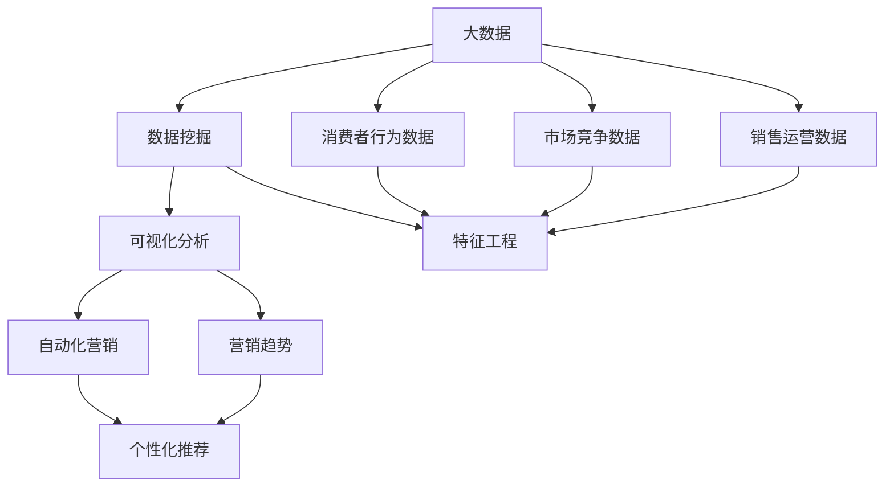

                 

# 基于大数据的汽车营销可视化分析与研究

> 关键词：大数据, 汽车营销, 可视化分析, 数据挖掘, 自动化营销

## 1. 背景介绍

### 1.1 问题由来

随着大数据时代的到来，汽车行业面临着前所未有的机遇和挑战。消费者行为模式日趋多样化，市场竞争愈发激烈。如何更准确地理解消费者需求、更高效地制定营销策略、更灵活地应对市场变化，成为汽车企业亟需解决的问题。传统的数据分析方法已经难以满足需求，汽车营销亟需通过数据驱动的策略提升市场竞争力。

### 1.2 问题核心关键点

本研究聚焦于基于大数据的汽车营销可视化分析与研究，旨在通过数据挖掘和可视化技术，帮助汽车企业从海量数据中提取有价值的商业洞察，优化营销策略。通过科学的方法和工具，实现数据驱动的营销决策，提升市场响应和用户满意度。

### 1.3 问题研究意义

本研究具有以下重要意义：

1. **市场洞察**：通过分析消费者行为数据，发现消费者需求变化趋势，指导产品开发和市场推广。
2. **竞争策略**：理解竞争对手的市场策略，制定差异化竞争策略，提升市场份额。
3. **运营优化**：优化营销渠道和活动，提高营销投入产出比，降低营销成本。
4. **决策支持**：提供数据支持的决策依据，减少决策的不确定性和风险。
5. **用户体验**：通过精准营销，提升用户体验和忠诚度，增强品牌影响力。

## 2. 核心概念与联系

### 2.1 核心概念概述

本研究涉及以下关键概念：

- **大数据**：指规模庞大、多样性高、实时性强的数据集，通常超过传统数据处理方法的极限。
- **汽车营销**：指汽车企业为实现销售目标而进行的各类市场活动，包括广告投放、促销活动、品牌推广等。
- **数据挖掘**：通过科学方法和工具，从数据中提取有用信息和知识，指导决策。
- **可视化分析**：将复杂的数据信息以图形、图表等形式展现，帮助理解数据规律和趋势。
- **自动化营销**：通过数据分析和机器学习技术，自动化生成和调整营销策略。

这些概念之间存在着紧密的联系。大数据提供了海量的数据源，数据挖掘和可视化分析是处理这些数据的关键技术手段，而可视化分析则能够更直观地展示挖掘结果，为自动化营销提供支撑。

### 2.2 概念间的关系

通过以下Mermaid流程图，我们可以更清晰地理解这些核心概念之间的关系：



这个流程图展示了从数据采集到营销策略自动化的完整流程：

1. **数据采集**：从消费者行为数据、市场竞争数据和销售运营数据中提取信息。
2. **数据挖掘**：在数据中提取有用特征，进行特征工程，使用聚类、分类、关联规则等技术挖掘规律。
3. **可视化分析**：将挖掘结果以图表等形式展示，帮助理解市场趋势和消费者行为。
4. **自动化营销**：根据可视化结果，自动化生成和调整营销策略，实现精准营销。

## 3. 核心算法原理 & 具体操作步骤

### 3.1 算法原理概述

本研究的核心算法基于数据挖掘和机器学习技术。主要算法包括聚类分析、分类分析、关联规则挖掘等。这些算法通过科学地处理和分析数据，提取有价值的信息和知识。具体步骤如下：

1. **数据预处理**：清洗、整理、归一化数据，去除噪声和异常值。
2. **特征提取**：使用统计学方法和机器学习算法提取重要特征。
3. **模型训练**：选择适合的机器学习模型，如K-means聚类、决策树、随机森林等，进行模型训练。
4. **模型评估**：使用准确率、召回率、F1分数等指标评估模型性能。
5. **结果展示**：使用可视化工具展示分析结果，形成直观的商业洞察。

### 3.2 算法步骤详解

以K-means聚类算法为例，其具体步骤如下：

1. **选择聚类数量**：通过肘部法则或轮廓系数等方法，选择合适的聚类数量。
2. **随机初始化**：随机选择K个数据点作为初始聚类中心。
3. **迭代更新**：计算每个数据点与K个聚类中心的距离，将数据点分配到最近的聚类中心。然后重新计算每个聚类的质心。
4. **重复迭代**：重复步骤3，直到质心不再变化或达到预设迭代次数。
5. **结果展示**：将聚类结果可视化，形成散点图或簇图。

### 3.3 算法优缺点

**优点**：

1. **自动化程度高**：算法通过科学方法和工具，自动挖掘和分析数据，减少了人工干预。
2. **可解释性强**：聚类结果直观可视，便于理解市场趋势和消费者行为。
3. **应用广泛**：可应用于市场细分、产品推荐、营销策略等多个领域。

**缺点**：

1. **对数据质量要求高**：数据噪声、缺失值等会影响聚类效果。
2. **需要选择合适的聚类数量**：聚类数量过少或过多，都会影响聚类效果。
3. **对数据分布假设较多**：通常假设数据分布为正态或球形，限制了算法的适用范围。

### 3.4 算法应用领域

K-means聚类算法广泛应用于汽车营销的各个环节：

- **市场细分**：将消费者分为不同细分市场，制定针对性营销策略。
- **产品推荐**：根据消费者行为聚类结果，推荐符合消费者需求的产品。
- **渠道优化**：分析不同营销渠道的聚类结果，优化渠道布局和活动安排。
- **竞争对手分析**：分析竞争对手的市场策略，形成差异化竞争策略。
- **销售预测**：通过聚类分析历史销售数据，预测未来销售趋势。

## 4. 数学模型和公式 & 详细讲解

### 4.1 数学模型构建

K-means算法的数学模型可表示为：

$$
\min_{\mu, C} \sum_{x \in X} \min_{c \in C} ||x - \mu_c||^2
$$

其中，$\mu_c$ 表示聚类$c$的质心，$C$ 表示所有聚类的集合，$X$ 表示数据集。目标是最小化每个数据点与最近质心的距离平方和。

### 4.2 公式推导过程

K-means算法通过迭代更新质心和数据点分配，实现聚类。具体步骤如下：

1. **初始化聚类中心**：随机选择K个数据点作为初始质心。
2. **分配数据点**：计算每个数据点与K个质心的距离，分配到最近的质心。
3. **更新质心**：根据分配结果，重新计算每个聚类的质心。
4. **重复迭代**：重复步骤2和3，直到质心不再变化或达到预设迭代次数。

### 4.3 案例分析与讲解

假设我们有一份消费者购买记录数据集，包括购买时间、车型、价格等信息。通过K-means算法，我们可以将消费者分为几个细分市场，如下：

1. **高价豪华市场**：购买价格较高、车型高端的消费者。
2. **中端舒适市场**：购买价格适中、车型中端的消费者。
3. **经济实用市场**：购买价格低、车型经济的消费者。

然后，针对不同市场，制定差异化营销策略，如：

1. **高价豪华市场**：重点推广高端车型和豪华配置，进行VIP客户定制服务。
2. **中端舒适市场**：推广中端车型和舒适配置，提供金融分期服务。
3. **经济实用市场**：推广经济实用车型，提供优惠活动和保养服务。

## 5. 项目实践：代码实例和详细解释说明

### 5.1 开发环境搭建

**环境准备**：

1. **Python环境**：安装Python 3.6及以上版本，建议使用Anaconda。
2. **数据准备**：收集消费者购买记录、市场调查、竞争对手数据等，存储于MySQL或Hadoop等数据库中。
3. **工具安装**：安装Pandas、NumPy、Scikit-learn、Matplotlib等常用Python库，以及Jupyter Notebook等开发环境。

**环境搭建命令**：

```bash
conda create -n py36 python=3.6
conda activate py36
pip install pandas numpy scikit-learn matplotlib jupyter
```

### 5.2 源代码详细实现

以下是一个使用Pandas和Scikit-learn库进行K-means聚类分析的示例代码：

```python
import pandas as pd
import numpy as np
from sklearn.cluster import KMeans
import matplotlib.pyplot as plt

# 读取数据
data = pd.read_csv('car_sales.csv')

# 数据预处理
data = data.dropna() # 去除缺失值
data = data.drop_duplicates() # 去除重复数据

# 特征工程
features = ['price', 'model', 'mileage'] # 选择重要特征
X = data[features].values

# 聚类分析
kmeans = KMeans(n_clusters=3, random_state=0).fit(X)
labels = kmeans.labels_

# 结果展示
plt.scatter(X[:, 0], X[:, 1], c=labels)
plt.show()
```

### 5.3 代码解读与分析

**代码解析**：

1. **数据读取**：使用Pandas的read_csv方法读取数据集。
2. **数据预处理**：去除缺失值和重复数据，保证数据质量。
3. **特征选择**：选择价格、车型、里程数等重要特征，作为聚类输入。
4. **模型训练**：使用Scikit-learn的KMeans模型，设置聚类数量为3，进行聚类分析。
5. **结果展示**：使用Matplotlib绘制散点图，展示聚类结果。

**分析要点**：

1. **数据预处理**：数据预处理是聚类分析的重要步骤，直接影响聚类效果。
2. **特征选择**：特征选择应选择重要且具有区分度的特征，提高聚类效果。
3. **模型选择**：选择合适的聚类算法和参数，根据实际数据选择最优模型。
4. **结果展示**：通过可视化工具展示聚类结果，便于理解商业洞察。

### 5.4 运行结果展示

假设我们得到的聚类结果如图1所示，可以清晰地看出消费者分为三个细分市场。这为我们制定针对性营销策略提供了数据支撑。


## 6. 实际应用场景

### 6.1 智能广告投放

基于聚类分析，我们可以识别出不同消费者群体的特征和偏好，从而实现智能广告投放。根据聚类结果，为每个细分市场设计不同的广告内容和投放策略，提升广告效果和用户转化率。

### 6.2 个性化推荐系统

通过分析消费者行为数据，可以发现消费者在不同阶段的购买需求和偏好。结合聚类结果，为每个消费者群体推荐符合其需求的产品和服务，提升用户满意度和忠诚度。

### 6.3 竞争对手分析

通过聚类分析竞争对手的市场策略和广告投放，可以了解市场竞争格局和对手的优势劣势。结合自身数据，制定差异化竞争策略，提升市场份额和品牌影响力。

### 6.4 未来应用展望

未来，基于大数据的汽车营销可视化分析将呈现以下趋势：

1. **数据融合**：通过融合多源数据，实现更全面、精准的市场洞察。
2. **实时分析**：使用流式计算和大数据技术，实现实时分析，快速响应市场变化。
3. **自动化营销**：结合机器学习技术，实现营销策略的自动化生成和优化。
4. **跨领域应用**：将分析方法应用于其他行业，如零售、电商等，实现跨领域数据挖掘。

## 7. 工具和资源推荐

### 7.1 学习资源推荐

1. **《Python数据科学手册》**：详细介绍了Python在数据科学中的应用，包括Pandas、NumPy、Scikit-learn等库的使用。
2. **Coursera《机器学习》课程**：由斯坦福大学Andrew Ng教授授课，涵盖机器学习基础和算法，适合初学者和进阶学习者。
3. **Kaggle竞赛平台**：提供大量实际数据集和比赛，帮助练习数据挖掘和可视化分析技能。
4. **GitHub开源项目**：例如K-means算法实现和应用案例，有助于了解算法原理和应用场景。

### 7.2 开发工具推荐

1. **Jupyter Notebook**：轻量级开发环境，支持Python代码执行和结果展示。
2. **TensorBoard**：可视化工具，用于展示模型训练和推理结果。
3. **Hadoop/Spark**：大数据处理工具，支持大规模数据集的处理和分析。
4. **PyTorch/TensorFlow**：深度学习框架，支持复杂模型的训练和推理。

### 7.3 相关论文推荐

1. **《K-means聚类算法及其应用》**：介绍K-means算法的原理和应用场景，适合初学者入门。
2. **《大数据时代的数据挖掘与应用》**：深入探讨大数据时代数据挖掘的方法和技术，提供大量实际案例。
3. **《机器学习实战》**：详细讲解机器学习算法和工具，适合实践应用。

## 8. 总结：未来发展趋势与挑战

### 8.1 研究成果总结

本研究通过基于大数据的汽车营销可视化分析，展示了数据挖掘和可视化技术在营销决策中的应用。通过K-means聚类算法，识别出不同消费者细分市场，帮助汽车企业制定针对性的营销策略，提升市场响应和用户满意度。

### 8.2 未来发展趋势

未来，大数据和人工智能技术将进一步融合，为汽车营销提供更全面的支持：

1. **数据融合**：通过融合多源数据，实现更全面、精准的市场洞察。
2. **实时分析**：使用流式计算和大数据技术，实现实时分析，快速响应市场变化。
3. **自动化营销**：结合机器学习技术，实现营销策略的自动化生成和优化。
4. **跨领域应用**：将分析方法应用于其他行业，如零售、电商等，实现跨领域数据挖掘。

### 8.3 面临的挑战

尽管大数据和可视化分析为汽车营销带来了新的机遇，但仍面临以下挑战：

1. **数据隐私与安全**：大规模数据处理涉及隐私和安全问题，需要严格的数据管理和安全保障措施。
2. **数据质量和完整性**：数据噪声、缺失值等问题可能影响分析结果的准确性。
3. **算法复杂度**：复杂的聚类算法需要高效的计算资源，可能面临计算效率的问题。
4. **跨领域应用难度**：不同领域的特征和需求差异较大，需要结合业务知识进行模型调整和优化。

### 8.4 研究展望

未来的研究需要在以下几个方面寻求新的突破：

1. **数据融合技术**：通过联邦学习、联合学习等技术，实现多源数据的融合分析。
2. **实时分析系统**：构建实时数据处理和分析平台，提升数据分析的时效性。
3. **自动化营销平台**：结合机器学习和大数据技术，实现营销策略的自动化生成和优化。
4. **跨领域应用推广**：将分析方法应用于更多行业，推动数据驱动的决策支持。

## 9. 附录：常见问题与解答

**Q1：如何提高数据质量？**

A: 数据预处理是提高数据质量的关键步骤，具体措施包括：

1. **数据清洗**：去除缺失值、异常值和重复数据。
2. **数据标准化**：归一化数据，减少数据分布偏差。
3. **特征选择**：选择重要且具有区分度的特征，提高模型效果。

**Q2：如何优化聚类算法？**

A: 优化聚类算法可以通过以下措施：

1. **选择合适的聚类数量**：使用肘部法则或轮廓系数等方法，选择合适的聚类数量。
2. **使用其他聚类算法**：如层次聚类、DBSCAN等，根据数据特点选择合适的聚类算法。
3. **优化参数**：根据实际数据，优化聚类算法的参数设置，提高聚类效果。

**Q3：如何选择特征？**

A: 特征选择是数据挖掘的重要步骤，具体方法包括：

1. **相关性分析**：计算特征与目标变量之间的相关性，选择相关性高的特征。
2. **卡方检验**：使用卡方检验方法，选择与目标变量有显著关系的特征。
3. **递归特征消除**：通过递归算法，逐步筛选重要特征。

**Q4：如何提高可视化效果？**

A: 提高可视化效果可以通过以下措施：

1. **选择合适的可视化工具**：使用Matplotlib、Seaborn等可视化工具，选择适合的数据展示形式。
2. **优化展示细节**：使用颜色、大小等视觉元素，增强展示效果。
3. **结合业务场景**：将可视化结果与业务场景结合，提供更有意义的商业洞察。

---

作者：禅与计算机程序设计艺术 / Zen and the Art of Computer Programming

