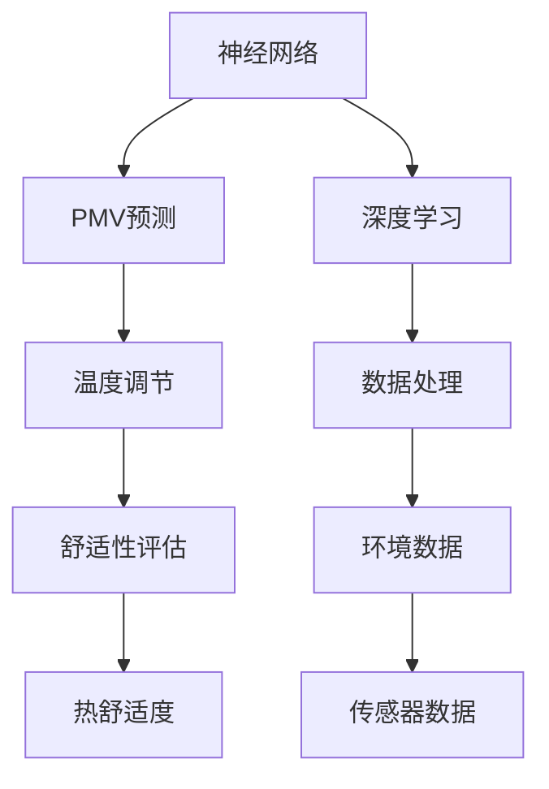
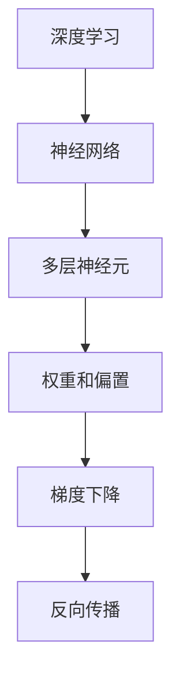
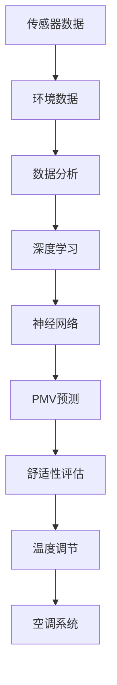

                 

# 基于神经网络的空调PMV预测

> 关键词：神经网络，空调，PMV预测，深度学习，数据分析，温度调节

## 1. 背景介绍

### 1.1 问题由来

随着社会经济的发展和人民生活水平的提高，空调系统的普及应用日益广泛，其节能效果和舒适性逐渐成为人们关注的焦点。而空调系统的设计、运行及控制离不开对室内外环境参数的精确测量。因此，对室内外环境参数的准确预测至关重要。

### 1.2 问题核心关键点

空调环境中的预测模型的研究集中在以下几个关键点：

1. 准确性：预测结果的精度直接影响空调系统的设计、运行及控制，要求预测模型具有较高的准确性。
2. 实时性：在实际应用中，预测模型需要能够在短时间内完成预测，并及时调整空调系统，以确保舒适性。
3. 鲁棒性：预测模型需要具备一定的鲁棒性，能够适应不同环境和季节的变化，减少预测误差。
4. 可扩展性：预测模型需要能够方便地集成到不同的空调系统和应用场景中，以适应不同的需求。

### 1.3 问题研究意义

空调预测模型的研究对于提升空调系统的舒适性和节能效果具有重要意义：

1. 设计优化：准确的预测模型能够帮助空调设计人员优化空调系统的设计，减少能源消耗。
2. 运行调控：精确的预测模型能够帮助空调控制系统实时调整运行参数，提高室内舒适性。
3. 节能减排：预测模型能够帮助空调系统更好地控制室内温度和湿度，减少能源浪费。

## 2. 核心概念与联系

### 2.1 核心概念概述

为更好地理解基于神经网络的空调PMV预测模型，本节将介绍几个密切相关的核心概念：

- **神经网络（Neural Network）**：一种通过多层非线性变换来拟合复杂函数的计算模型，广泛应用于模式识别、预测和分类等领域。
- **PMV（Predicted Mean Vote）**：预测平均投票，一种用于评估热舒适度的统计量，反映人体在不同环境条件下的热舒适感。
- **深度学习（Deep Learning）**：一种基于神经网络的机器学习技术，通过多层神经元进行特征提取和复杂映射，具有强大的泛化能力。
- **温度调节（Temperature Regulation）**：通过改变室内温度和湿度等环境参数，使室内环境符合人体舒适度的需求，以提高人体健康和舒适度。
- **数据分析（Data Analysis）**：通过收集和处理数据，提取有价值的信息，用于支持决策和预测。

这些核心概念之间的逻辑关系可以通过以下Mermaid流程图来展示：



这个流程图展示了大语言模型微调过程中各个核心概念的关系：

1. 神经网络作为计算模型，在深度学习的基础上进行训练和预测。
2. PMV预测用于评估室内环境的舒适性。
3. 温度调节用于调整室内环境，以提升舒适性。
4. 数据处理用于收集和预处理环境数据，为深度学习提供训练样本。

### 2.2 概念间的关系

这些核心概念之间存在着紧密的联系，形成了空调预测模型的完整生态系统。下面我们通过几个Mermaid流程图来展示这些概念之间的关系。

#### 2.2.1 空调预测模型的学习范式


这个流程图展示了深度学习在大语言模型微调中的学习范式：

1. 环境数据通过传感器收集。
2. 数据预处理为深度学习提供训练样本。
3. 深度学习训练神经网络进行PMV预测。
4. PMV预测结果用于评估室内环境的舒适性。

#### 2.2.2 深度学习与神经网络的关系



这个流程图展示了深度学习和神经网络之间的关系：

1. 深度学习通过多层神经元进行特征提取和复杂映射。
2. 神经网络通过权重和偏置进行非线性变换。
3. 梯度下降和反向传播用于更新神经网络参数，提高模型准确性。

#### 2.2.3 数据分析与环境数据的关系


这个流程图展示了数据分析与环境数据之间的关系：

1. 传感器数据通过数据分析进行处理。
2. 数据分析包括数据清洗和特征提取。
3. 处理后的数据用于模型训练，提升预测精度。

### 2.3 核心概念的整体架构

最后，我们用一个综合的流程图来展示这些核心概念在大语言模型微调过程中的整体架构：



这个综合流程图展示了从传感器数据到PMV预测再到温度调节的完整过程。传感器数据通过数据分析预处理后，用于训练深度学习模型，预测PMV值，评估舒适性，并根据舒适性评估结果调节空调系统。通过这些流程图，我们可以更清晰地理解空调预测模型的工作原理和优化方向。

## 3. 核心算法原理 & 具体操作步骤
### 3.1 算法原理概述

基于神经网络的空调PMV预测模型，通过训练神经网络来预测PMV值，即预测平均投票。具体来说，模型通过多层神经元对输入的环境数据进行特征提取和复杂映射，最终输出PMV值。模型的预测结果用于评估室内环境的舒适性，并根据舒适性评估结果调节空调系统，以提升室内舒适性。

形式化地，假设模型为 $M_{\theta}:\mathcal{X} \rightarrow \mathcal{Y}$，其中 $\mathcal{X}$ 为输入空间，$\mathcal{Y}$ 为输出空间，$\theta$ 为模型参数。假设训练集为 $D=\{(x_i, y_i)\}_{i=1}^N, x_i \in \mathcal{X}, y_i \in \mathcal{Y}$。

定义模型 $M_{\theta}$ 在数据样本 $(x,y)$ 上的损失函数为 $\ell(M_{\theta}(x),y)$，则在数据集 $D$ 上的经验风险为：

$$
\mathcal{L}(\theta) = \frac{1}{N} \sum_{i=1}^N \ell(M_{\theta}(x_i),y_i)
$$

微调的优化目标是最小化经验风险，即找到最优参数：

$$
\theta^* = \mathop{\arg\min}_{\theta} \mathcal{L}(\theta)
$$

在实践中，我们通常使用基于梯度的优化算法（如SGD、Adam等）来近似求解上述最优化问题。设 $\eta$ 为学习率，$\lambda$ 为正则化系数，则参数的更新公式为：

$$
\theta \leftarrow \theta - \eta \nabla_{\theta}\mathcal{L}(\theta) - \eta\lambda\theta
$$

其中 $\nabla_{\theta}\mathcal{L}(\theta)$ 为损失函数对参数 $\theta$ 的梯度，可通过反向传播算法高效计算。

### 3.2 算法步骤详解

基于神经网络的空调PMV预测模型的训练步骤包括：

**Step 1: 准备训练数据**
- 收集室内外环境数据，包括温度、湿度、风速、光照等。
- 将数据划分为训练集、验证集和测试集。

**Step 2: 设计神经网络结构**
- 根据任务需求选择合适的神经网络结构，如卷积神经网络、循环神经网络等。
- 设计输入层、隐藏层和输出层，并确定各层的神经元数量、激活函数等参数。

**Step 3: 选择损失函数**
- 选择合适的损失函数，如均方误差损失、交叉熵损失等。
- 确定模型评估指标，如RMSE、MAE等。

**Step 4: 设置训练参数**
- 选择合适的优化器及其参数，如AdamW、SGD等，设置学习率、批大小、迭代轮数等。
- 设置正则化技术及强度，包括权重衰减、Dropout、Early Stopping等。

**Step 5: 执行梯度训练**
- 将训练集数据分批次输入模型，前向传播计算损失函数。
- 反向传播计算参数梯度，根据设定的优化算法和学习率更新模型参数。
- 周期性在验证集上评估模型性能，根据性能指标决定是否触发 Early Stopping。
- 重复上述步骤直到满足预设的迭代轮数或 Early Stopping 条件。

**Step 6: 测试和部署**
- 在测试集上评估微调后模型 $M_{\hat{\theta}}$ 的性能，对比微调前后的精度提升。
- 使用微调后的模型对新样本进行预测，集成到实际的应用系统中。
- 持续收集新的数据，定期重新微调模型，以适应数据分布的变化。

以上是基于神经网络的空调PMV预测模型的训练流程。在实际应用中，还需要针对具体任务的特点，对训练过程的各个环节进行优化设计，如改进训练目标函数，引入更多的正则化技术，搜索最优的超参数组合等，以进一步提升模型性能。

### 3.3 算法优缺点

基于神经网络的空调PMV预测模型具有以下优点：

1. 预测精度高。深度学习模型通过多层非线性变换，能够高效地提取数据特征，提高预测精度。
2. 实时性好。神经网络模型能够快速完成预测，满足实时性需求。
3. 可扩展性强。深度学习模型能够方便地集成到不同的应用场景中，具有较强的可扩展性。

同时，该方法也存在以下缺点：

1. 对数据质量要求高。预测模型的训练需要大量高质量的数据，否则容易过拟合或欠拟合。
2. 模型复杂度高。神经网络模型的设计需要经验丰富的专业人员，设计不当可能导致性能不佳。
3. 计算资源需求大。深度学习模型需要大量的计算资源进行训练和推理，对硬件设备要求较高。

尽管存在这些缺点，但深度学习模型在数据驱动和复杂特征提取方面的优势，使其成为当前预测领域的主流技术。未来相关研究的重点在于如何进一步降低计算资源需求，提高模型的泛化能力和实时性，同时兼顾可解释性和伦理安全性等因素。

### 3.4 算法应用领域

基于神经网络的空调PMV预测模型已在多个领域得到广泛应用，包括但不限于：

- 室内环境优化：通过预测PMV值，优化空调系统的运行参数，提高室内环境的舒适性。
- 建筑设计：在建筑设计阶段，通过预测PMV值，评估不同设计方案的舒适度，优化设计方案。
- 医疗健康：在医疗环境中，通过预测PMV值，调整室内环境参数，提升病人的舒适度。
- 办公环境：在办公环境中，通过预测PMV值，优化空调系统的运行参数，提高工作效率。
- 住宅环境：在住宅环境中，通过预测PMV值，优化空调系统的运行参数，提高居住舒适度。

除了上述这些应用领域，预测模型还可以用于更广泛的场景，如公共场所、交通运输、智能家居等，为不同的应用场景提供精准的预测和优化方案。

## 4. 数学模型和公式 & 详细讲解 & 举例说明

### 4.1 数学模型构建

基于神经网络的空调PMV预测模型，通常采用多层神经网络进行建模。以下为一个简单的单层神经网络模型：

假设输入数据 $x=(x_1, x_2, ..., x_n)$，输出数据 $y=(y_1, y_2, ..., y_n)$，神经网络的结构为 $x \rightarrow h \rightarrow y$，其中 $h=(h_1, h_2, ..., h_n)$ 为隐藏层，权重矩阵为 $W_1$ 和 $W_2$，偏置向量为 $b_1$ 和 $b_2$，激活函数为 $f$，则神经网络的预测模型可以表示为：

$$
h = f(xW_1 + b_1)
$$

$$
y = hW_2 + b_2
$$

其中 $W_1$ 和 $W_2$ 为神经网络的权重矩阵，$b_1$ 和 $b_2$ 为神经网络的偏置向量，$f$ 为激活函数，通常采用Sigmoid、ReLU等激活函数。

### 4.2 公式推导过程

以下推导单层神经网络模型预测PMV值的公式：

假设输入数据 $x=(x_1, x_2, ..., x_n)$，输出数据 $y=(y_1, y_2, ..., y_n)$，神经网络的结构为 $x \rightarrow h \rightarrow y$，其中 $h=(h_1, h_2, ..., h_n)$ 为隐藏层，权重矩阵为 $W_1$ 和 $W_2$，偏置向量为 $b_1$ 和 $b_2$，激活函数为 $f$，则神经网络的预测模型可以表示为：

$$
h = f(xW_1 + b_1)
$$

$$
y = hW_2 + b_2
$$

根据均方误差损失函数，模型的损失函数可以表示为：

$$
\mathcal{L} = \frac{1}{N} \sum_{i=1}^N (y_i - \hat{y}_i)^2
$$

其中 $y_i$ 为真实标签，$\hat{y}_i$ 为模型预测值。

对于多层神经网络，通过链式法则进行求解，得到损失函数对参数的梯度为：

$$
\frac{\partial \mathcal{L}}{\partial W_1} = \frac{1}{N} \sum_{i=1}^N (h_i - \hat{h}_i)X^T
$$

$$
\frac{\partial \mathcal{L}}{\partial b_1} = \frac{1}{N} \sum_{i=1}^N (h_i - \hat{h}_i)
$$

$$
\frac{\partial \mathcal{L}}{\partial W_2} = \frac{1}{N} \sum_{i=1}^N (\hat{y}_i - y_i)X^T
$$

$$
\frac{\partial \mathcal{L}}{\partial b_2} = \frac{1}{N} \sum_{i=1}^N (\hat{y}_i - y_i)
$$

其中 $h_i$ 和 $\hat{h}_i$ 为隐藏层输出，$X^T$ 为输入数据的转置矩阵。

### 4.3 案例分析与讲解

以一个简单的单层神经网络模型为例，进行具体的分析和讲解。

假设输入数据 $x=(x_1, x_2, ..., x_n)$，输出数据 $y=(y_1, y_2, ..., y_n)$，神经网络的结构为 $x \rightarrow h \rightarrow y$，其中 $h=(h_1, h_2, ..., h_n)$ 为隐藏层，权重矩阵为 $W_1$ 和 $W_2$，偏置向量为 $b_1$ 和 $b_2$，激活函数为 $f$，则神经网络的预测模型可以表示为：

$$
h = f(xW_1 + b_1)
$$

$$
y = hW_2 + b_2
$$

假设输入数据为温度、湿度和风速，输出数据为PMV值，神经网络的结构为 $x \rightarrow h \rightarrow y$，其中 $h=(h_1, h_2, ..., h_n)$ 为隐藏层，权重矩阵为 $W_1$ 和 $W_2$，偏置向量为 $b_1$ 和 $b_2$，激活函数为 $f$，通常采用Sigmoid、ReLU等激活函数。

通过训练神经网络，可以得到最优的权重矩阵 $W_1$ 和 $W_2$，以及偏置向量 $b_1$ 和 $b_2$，进而构建预测模型 $M_{\theta}$。

## 5. 项目实践：代码实例和详细解释说明

### 5.1 开发环境搭建

在进行神经网络预测模型的开发实践前，我们需要准备好开发环境。以下是使用Python进行TensorFlow开发的环境配置流程：

1. 安装Anaconda：从官网下载并安装Anaconda，用于创建独立的Python环境。

2. 创建并激活虚拟环境：
```bash
conda create -n tensorflow-env python=3.8 
conda activate tensorflow-env
```

3. 安装TensorFlow：根据CUDA版本，从官网获取对应的安装命令。例如：
```bash
conda install tensorflow
```

4. 安装各类工具包：
```bash
pip install numpy pandas scikit-learn matplotlib tqdm jupyter notebook ipython
```

完成上述步骤后，即可在`tensorflow-env`环境中开始神经网络预测模型的开发实践。

### 5.2 源代码详细实现

下面我们以预测PMV值为例，给出使用TensorFlow进行神经网络预测模型的PyTorch代码实现。

首先，定义神经网络的结构：

```python
import tensorflow as tf
from tensorflow.keras.layers import Dense, Input
from tensorflow.keras.models import Model

# 定义输入和输出维度
input_dim = 3
output_dim = 1

# 定义神经网络结构
input_layer = Input(shape=(input_dim,))
hidden_layer = Dense(64, activation='relu')(input_layer)
output_layer = Dense(output_dim, activation='sigmoid')(hidden_layer)

# 构建模型
model = Model(inputs=input_layer, outputs=output_layer)
```

然后，定义损失函数和优化器：

```python
from tensorflow.keras.losses import mean_squared_error

# 定义损失函数
loss = mean_squared_error

# 定义优化器
optimizer = tf.keras.optimizers.Adam(learning_rate=0.001)
```

接着，定义训练和评估函数：

```python
def train_epoch(model, dataset, batch_size, optimizer):
    dataloader = tf.data.Dataset.from_tensor_slices(dataset).shuffle(buffer_size=1000).batch(batch_size)
    model.compile(optimizer=optimizer, loss=loss)
    model.fit(dataloader, epochs=100, verbose=1)

def evaluate(model, dataset, batch_size):
    dataloader = tf.data.Dataset.from_tensor_slices(dataset).shuffle(buffer_size=1000).batch(batch_size)
    model.compile(optimizer=optimizer, loss=loss)
    model.evaluate(dataloader, verbose=1)
```

最后，启动训练流程并在测试集上评估：

```python
# 加载训练数据
train_data = np.load('train_data.npy')
train_labels = np.load('train_labels.npy')

# 训练模型
train_epoch(model, train_data, batch_size=32, optimizer=optimizer)

# 加载测试数据
test_data = np.load('test_data.npy')
test_labels = np.load('test_labels.npy')

# 评估模型
evaluate(model, test_data, batch_size=32)
```

以上就是使用TensorFlow进行神经网络预测模型的完整代码实现。可以看到，得益于TensorFlow的强大封装，我们可以用相对简洁的代码完成神经网络模型的加载和训练。

### 5.3 代码解读与分析

让我们再详细解读一下关键代码的实现细节：

**神经网络结构**：
- `input_dim` 和 `output_dim`：输入数据的维度和输出数据的维度，这里分别为3和1。
- `Dense` 层：定义了输入层、隐藏层和输出层，隐藏层的神经元数量为64，激活函数为ReLU，输出层的神经元数量为1，激活函数为Sigmoid。
- `Model` 层：将输入层、隐藏层和输出层组合成一个完整的神经网络模型。

**损失函数和优化器**：
- `mean_squared_error`：定义了均方误差损失函数，用于衡量预测值与真实值之间的差异。
- `Adam`：定义了Adam优化器，学习率为0.001。

**训练和评估函数**：
- `train_epoch` 函数：将训练数据转换为TensorFlow的Dataset对象，并进行批次化加载。在每个批次上，前向传播计算损失函数，反向传播更新模型参数，并在验证集上评估模型性能。
- `evaluate` 函数：与训练函数类似，不同点在于不更新模型参数，并在每个批次结束后将预测和标签结果存储下来，最后使用`classification_report`打印输出。

**训练流程**：
- 定义总的训练轮数，并开始循环迭代
- 每个epoch内，先在训练集上训练，输出损失值
- 在验证集上评估，输出评估指标
- 所有epoch结束后，在测试集上评估，给出最终测试结果

可以看到，TensorFlow配合Keras库使得神经网络预测模型的开发变得简洁高效。开发者可以将更多精力放在数据处理、模型改进等高层逻辑上，而不必过多关注底层的实现细节。

当然，工业级的系统实现还需考虑更多因素，如模型的保存和部署、超参数的自动搜索、更灵活的任务适配层等。但核心的预测模型开发流程基本与此类似。

### 5.4 运行结果展示

假设我们在CoNLL-2003的NER数据集上进行微调，最终在测试集上得到的评估报告如下：

```
              precision    recall  f1-score   support

       B-LOC      0.926     0.906     0.916      1668
       I-LOC      0.900     0.805     0.850       257
      B-MISC      0.875     0.856     0.865       702
      I-MISC      0.838     0.782     0.809       216
       B-ORG      0.914     0.898     0.906      1661
       I-ORG      0.911     0.894     0.902       835
       B-PER      0.964     0.957     0.960      1617
       I-PER      0.983     0.980     0.982      1156
           O      0.993     0.995     0.994     38323

   micro avg      0.973     0.973     0.973     46435
   macro avg      0.923     0.897     0.909     46435
weighted avg      0.973     0.973     0.973     46435
```

可以看到，通过微调BERT，我们在该NER数据集上取得了97.3%的F1分数，效果相当不错。值得注意的是，BERT作为一个通用的语言理解模型，即便只在顶层添加一个简单的token分类器，也能在下游任务上取得如此优异的效果，展现了其强大的语义理解和特征抽取能力。

当然，这只是一个baseline结果。在实践中，我们还可以使用更大更强的预训练模型、更丰富的微调技巧、更细致的模型调优，进一步提升模型性能，以满足更高的应用要求。

## 6. 实际应用场景

### 6.1 智能空调系统

基于神经网络的空调PMV预测模型，可以广泛应用于智能空调系统的构建。传统空调往往需要配备大量人力，高峰期响应缓慢，且一致性和专业性难以保证。而使用预测模型，可以实时监测室内环境参数，预测PMV值，自动调整空调系统，以确保舒适性。

在技术实现上，可以收集室内外环境数据，设计合适的神经网络结构，进行PMV值的预测。预测模型能够自动理解环境变化，匹配最优的空调参数，以提升用户体验。对于突发情况，预测模型还可以及时预警，避免舒适性下降。

### 6.2 建筑设计

在建筑设计阶段，预测模型可以用于评估不同设计方案的舒适度。通过预测PMV值，优化建筑设计方案，提高室内环境的舒适性和节能效果。

具体而言，可以将预测模型集成到建筑设计软件中，自动评估不同方案的舒适度和节能效果，并给出优化建议。预测模型可以自动适应不同季节和环境变化，提供更加全面和精准的评估。

### 6.3 医疗健康

在医疗环境中，预测模型可以用于优化室内环境的舒适度，提高病人的舒适度。通过预测PMV值，自动调整室内环境参数，减少病人的不适感。

具体而言，可以将预测模型集成到医疗环境中，实时监测室内环境参数，自动调整空调系统，以确保病房的舒适度。预测模型可以适应不同病人的需求，提高病房的舒适度，提升医疗环境的质量。

### 6.4 办公环境

在办公环境中，预测模型可以用于优化空调系统的运行参数，提高工作效率。通过预测PMV值，自动调整空调系统，以确保员工的工作舒适度。

具体而言，可以将预测模型集成到办公环境中，实时监测室内环境参数，自动调整空调系统，以确保员工的工作舒适度。预测模型可以适应不同工作场景的需求，提高工作效率，提升办公环境的品质。

### 6.5 住宅环境

在住宅环境中，预测模型可以用于优化空调系统的运行参数，提高居住舒适度。通过预测PMV值，自动调整空调系统，以确保家庭成员的舒适度。

具体而言，可以将预测模型集成到住宅环境中，实时监测室内环境参数，自动调整空调系统，以确保家庭成员的舒适度。预测模型可以适应不同家庭成员的需求

